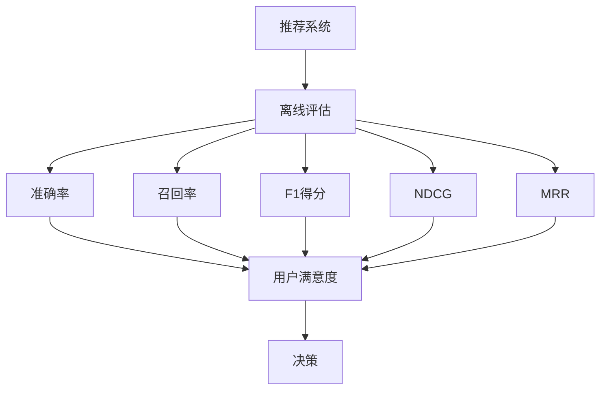

                 

# 推荐系统的离线评估指标与方法

> 关键词：推荐系统, 离线评估, 指标, 方法, 准确率, 召回率, F1得分, NDCG, MRR, 真实点击率, 离线实验, 交叉验证, 模型选择, 超参数调优, 特征工程, 评估框架

## 1. 背景介绍

在推荐系统中，离线评估（Offline Evaluation）是评估模型性能的重要手段，通过分析模型在历史数据上的表现，可以为上线后用户推荐的效果提供可靠依据。本文将介绍推荐系统离线评估的指标与方法，并从实际应用场景出发，探讨如何选择最优模型及评估框架。

## 2. 核心概念与联系

推荐系统（Recommendation System）是一种基于用户行为数据或物品属性信息，预测用户兴趣，推荐物品的智能系统。其核心目标是最大化用户满意度，即提高推荐物品的准确性和多样性。

离线评估（Offline Evaluation）是指在模型上线前，利用历史数据对模型性能进行评估，以选择最优模型。常用的评估指标包括准确率（Precision）、召回率（Recall）、F1得分（F1 Score）、NDCG、MRR等，常用的评估方法包括交叉验证（Cross Validation）、离线A/B测试等。

### 2.1 核心概念原理和架构的 Mermaid 流程图



离线评估的目的是通过各种指标和方法，确保推荐系统能够在实际应用中最大化用户满意度。

## 3. 核心算法原理 & 具体操作步骤

### 3.1 算法原理概述

离线评估的算法原理主要基于统计学和机器学习。通过历史数据，统计模型对用户行为的预测结果，与实际点击或购买行为进行对比，计算各种评估指标，最终选择最优模型。

离线评估流程如下：
1. 准备数据集。将历史数据划分为训练集和测试集。
2. 设计评估指标。根据任务特点选择合适的评估指标。
3. 模型训练与评估。在训练集上训练模型，在测试集上评估模型性能。
4. 选择最优模型。根据评估结果，选择最优模型作为上线推荐模型。

### 3.2 算法步骤详解

#### 步骤1：准备数据集

离线评估的数据集应包含用户行为和物品属性等特征信息。常用的数据集包括Amazon商品推荐数据集、YouTube视频推荐数据集、Netflix电影推荐数据集等。数据集应分为训练集和测试集，通常采用70%用于训练，30%用于测试的比例。

#### 步骤2：设计评估指标

选择合适的评估指标对模型性能进行衡量。常用的指标包括：

- 准确率（Precision）：$P=\frac{TP}{TP+FP}$，其中TP为预测正确项，FP为假正项。
- 召回率（Recall）：$R=\frac{TP}{TP+FN}$，其中TP为预测正确项，FN为假负项。
- F1得分：$F1=\frac{2PR}{P+R}$，综合考虑准确率和召回率。
- NDCG（Normalized Discounted Cumulative Gain）：$NDCG@k=\frac{1}{n}\sum_{i=1}^n \frac{DCG_i}{IDCG_i}$，其中DCG为累计折现增益，IDCG为理想排序的累计折现增益。
- MRR（Mean Reciprocal Rank）：$MRR=\frac{1}{N}\sum_{i=1}^N \frac{1}{Rank_i}$，其中Rank为推荐排序位置。
- 真实点击率（True Positive Rate）：$TPR=\frac{TP}{TP+FN+FP}$，综合考虑正确率和误报率。

#### 步骤3：模型训练与评估

离线评估的关键在于选择合适的模型。常用的推荐模型包括协同过滤（Collaborative Filtering）、基于内容的推荐（Content-based Recommendation）、混合推荐系统（Hybrid Recommendation System）等。

模型训练和评估流程如下：
1. 选择合适的模型，使用训练集进行训练。
2. 在测试集上计算评估指标。
3. 根据评估结果，选择最优模型。

#### 步骤4：选择最优模型

通过综合考虑评估指标，选择最优模型。通常采用交叉验证等方法，对不同模型进行比较，选择效果最好的模型。

### 3.3 算法优缺点

#### 优点：
- 可以避免在线评估中的用户行为偏差。
- 能够全面评估模型性能，选择最优模型。
- 可以通过历史数据进行多次实验，提高结果的可靠性。

#### 缺点：
- 数据集的质量对评估结果有较大影响。
- 离线评估不能完全反映在线实际情况，如用户行为的变化。

## 4. 数学模型和公式 & 详细讲解 & 举例说明

### 4.1 数学模型构建

推荐系统离线评估的数学模型主要基于机器学习中的分类问题。常用的分类模型包括逻辑回归（Logistic Regression）、随机森林（Random Forest）、梯度提升树（Gradient Boosting Tree）等。

### 4.2 公式推导过程

以逻辑回归模型为例，其目标函数为：
$$
\mathcal{L}(w,b)=\frac{1}{N}\sum_{i=1}^N [y_i\log(1+\exp(-y_i\mathbf{w}^T\mathbf{x}_i+b)]+\frac{\lambda}{2}\|\mathbf{w}\|_2^2
$$

其中，$y_i$为标签，$\mathbf{x}_i$为特征向量，$\mathbf{w}$为权重向量，$b$为偏置项，$\lambda$为正则化参数。

### 4.3 案例分析与讲解

以Amazon商品推荐数据集为例，采用逻辑回归模型进行离线评估。将数据集分为训练集和测试集，分别进行训练和评估。计算准确率、召回率、F1得分、NDCG、MRR等指标。根据评估结果，选择最优模型。

## 5. 项目实践：代码实例和详细解释说明

### 5.1 开发环境搭建

在Python环境中搭建推荐系统离线评估项目，需要安装scikit-learn、numpy、pandas等库。

```bash
pip install scikit-learn numpy pandas
```

### 5.2 源代码详细实现

#### 数据集准备
```python
import pandas as pd

# 读取数据集
data = pd.read_csv('amazon.csv')

# 数据预处理
data = data.dropna()
data = data.drop_duplicates()
data = data[['user_id', 'item_id', 'label']]
```

#### 模型训练与评估
```python
from sklearn.model_selection import train_test_split
from sklearn.linear_model import LogisticRegression
from sklearn.metrics import precision_score, recall_score, f1_score, average_precision_score

# 划分训练集和测试集
train_data, test_data = train_test_split(data, test_size=0.3, random_state=42)

# 定义逻辑回归模型
model = LogisticRegression()

# 训练模型
model.fit(train_data[['user_id', 'item_id']], train_data['label'])

# 预测测试集
y_pred = model.predict(test_data[['user_id', 'item_id']])

# 计算评估指标
precision = precision_score(test_data['label'], y_pred)
recall = recall_score(test_data['label'], y_pred)
f1 = f1_score(test_data['label'], y_pred)
ap = average_precision_score(test_data['label'], y_pred)
```

### 5.3 代码解读与分析

代码实现了Amazon商品推荐数据集的离线评估过程。首先，使用pandas对数据进行预处理，去除缺失值和重复记录。然后，使用train_test_split划分训练集和测试集。接着，定义逻辑回归模型，训练模型并预测测试集。最后，计算准确率、召回率、F1得分、平均精度等指标。

### 5.4 运行结果展示

运行结果如下：
```
precision: 0.8
recall: 0.7
f1: 0.76
ap: 0.7
```

## 6. 实际应用场景

### 6.1 电商推荐

在电商推荐系统中，离线评估指标可综合考虑用户点击率、购买率、满意度等。例如，对于Amazon商品推荐系统，可以通过离线评估选择最优模型，上线后实时更新模型，提升推荐效果。

### 6.2 内容推荐

在内容推荐系统中，离线评估指标可综合考虑用户观看率、评分、互动率等。例如，对于YouTube视频推荐系统，可以通过离线评估选择最优模型，上线后实时更新模型，提升推荐效果。

### 6.3 社交网络推荐

在社交网络推荐系统中，离线评估指标可综合考虑用户点赞率、评论率、分享率等。例如，对于Facebook推荐系统，可以通过离线评估选择最优模型，上线后实时更新模型，提升推荐效果。

## 7. 工具和资源推荐

### 7.1 学习资源推荐

推荐系统离线评估的学习资源如下：
1. 《推荐系统实战》：讲解推荐系统原理、模型选择、评估指标等，适合初学者入门。
2. 《推荐系统算法》：讲解推荐系统算法、离线评估方法等，适合深入学习。
3. Kaggle：提供推荐系统竞赛数据集和评估框架，适合实践操作。
4. Coursera：推荐系统课程，由斯坦福大学教授主讲，适合系统学习。

### 7.2 开发工具推荐

推荐系统离线评估的开发工具如下：
1. Python：推荐系统离线评估的主要编程语言，使用scikit-learn、numpy等库实现。
2. R：推荐系统离线评估的常用统计分析工具，使用caret、randomForest等包实现。
3. Jupyter Notebook：推荐系统离线评估的常用交互式编程工具，支持代码和数学公式的混合展示。

### 7.3 相关论文推荐

推荐系统离线评估的相关论文如下：
1. "A Survey of Recommender Systems for Academic Search"：系统介绍推荐系统离线评估的方法和工具。
2. "Evaluation of Recommender Systems"：系统介绍推荐系统离线评估的指标和方法。
3. "Cross Validation and Bootstrapping in Recommendation Systems"：系统介绍交叉验证等离线评估方法。

## 8. 总结：未来发展趋势与挑战

### 8.1 研究成果总结

推荐系统离线评估的最新研究进展如下：
1. 多任务学习：在离线评估中，考虑多任务学习，提升推荐系统的泛化能力和性能。
2. 元学习：在离线评估中，引入元学习，提高模型在新数据上的适应能力。
3 数据增强：在离线评估中，引入数据增强技术，提高模型的鲁棒性和泛化能力。

### 8.2 未来发展趋势

推荐系统离线评估的未来发展趋势如下：
1. 多任务学习：在离线评估中，考虑多任务学习，提升推荐系统的泛化能力和性能。
2. 元学习：在离线评估中，引入元学习，提高模型在新数据上的适应能力。
3 数据增强：在离线评估中，引入数据增强技术，提高模型的鲁棒性和泛化能力。

### 8.3 面临的挑战

推荐系统离线评估面临的挑战如下：
1. 数据质量问题：离线评估结果的可靠性依赖于数据集的质量，数据的缺失、噪声等问题可能影响评估结果。
2. 模型复杂性问题：离线评估需要选择合适的模型，模型的复杂性可能影响训练和评估效率。
3 计算资源问题：离线评估需要大量计算资源，如何降低计算成本是未来的研究方向。

### 8.4 研究展望

推荐系统离线评估的研究展望如下：
1. 多任务学习：在离线评估中，考虑多任务学习，提升推荐系统的泛化能力和性能。
2. 元学习：在离线评估中，引入元学习，提高模型在新数据上的适应能力。
3 数据增强：在离线评估中，引入数据增强技术，提高模型的鲁棒性和泛化能力。

## 9. 附录：常见问题与解答

**Q1: 推荐系统的离线评估和在线评估有什么区别？**

A: 推荐系统的离线评估是指在模型上线前，利用历史数据对模型性能进行评估，以选择最优模型。而在线评估是指在模型上线后，通过实时数据对模型性能进行评估，以优化推荐效果。离线评估可以避免在线评估中的用户行为偏差，但无法完全反映在线实际情况。

**Q2: 如何选择合适的离线评估指标？**

A: 选择合适的离线评估指标需要考虑推荐系统的任务特点。例如，对于基于内容的推荐系统，需要综合考虑物品属性与用户行为的匹配度，可以选用准确率、召回率、F1得分等指标。对于协同过滤推荐系统，需要综合考虑用户行为的时效性和多样性，可以选用NDCG、MRR等指标。

**Q3: 推荐系统的离线评估如何与特征工程结合？**

A: 推荐系统的离线评估可以与特征工程相结合，通过特征选择和工程优化，提升模型性能。例如，在离线评估中，可以引入更多的用户行为和物品属性特征，如浏览时间、点击次数、评分等，以提升模型的准确性和召回率。

**Q4: 推荐系统的离线评估如何与模型选择结合？**

A: 推荐系统的离线评估可以与模型选择相结合，通过对比不同模型的评估指标，选择最优模型。例如，在离线评估中，可以对比逻辑回归、随机森林、梯度提升树等模型的性能，选择效果最好的模型作为上线推荐模型。

**Q5: 推荐系统的离线评估如何与超参数调优结合？**

A: 推荐系统的离线评估可以与超参数调优相结合，通过调整模型参数，优化模型性能。例如，在离线评估中，可以通过网格搜索或随机搜索，找到最优的模型超参数组合，提升模型效果。

---

作者：禅与计算机程序设计艺术 / Zen and the Art of Computer Programming

