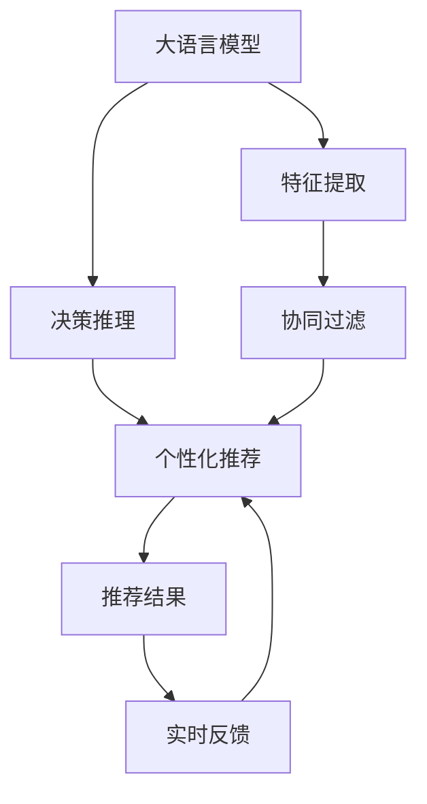

                 

# 搜索推荐的实时反馈学习：大模型策略

## 1. 背景介绍

### 1.1 问题由来

随着互联网的迅猛发展，搜索引擎和推荐系统成为人们获取信息和娱乐的主要渠道。用户搜索和推荐的实时性、个性化和准确性，直接影响到用户的体验和满意度。目前，大部分推荐系统采用的算法如协同过滤、矩阵分解等，虽然能在一定程度上提升推荐效果，但在面对个性化需求、用户动态变化等场景时，仍然存在显著局限。

近年来，大语言模型在自然语言处理领域取得了巨大成功，尤其是BERT、GPT等预训练模型。大语言模型通过海量无标签数据进行自监督预训练，学习到广泛的语义知识和表示能力。因此，大模型在推荐系统中的应用逐渐被提出，并受到广泛关注。然而，基于大模型的推荐系统仍处于研究初期，关于实时反馈学习的研究尚未全面展开。

### 1.2 问题核心关键点

本研究聚焦于基于大语言模型的实时反馈学习，以解决传统推荐算法在处理个性化需求、用户动态变化等场景下的局限性。实时反馈学习是指在推荐过程中，通过收集用户对推荐结果的实时反馈，动态更新模型参数，以提升推荐准确性和用户体验。这一范式使得模型能够更及时地响应用户需求，减少推荐偏差，从而提供更加个性化和满意的推荐服务。

## 2. 核心概念与联系

### 2.1 核心概念概述

为更好地理解实时反馈学习在基于大语言模型的推荐系统中的应用，本节将介绍几个密切相关的核心概念：

- 大语言模型(Large Language Model, LLM)：指通过自监督预训练学习到广泛语义知识和表示能力的深度学习模型。其代表包括BERT、GPT等。
- 推荐系统(Recommendation System)：利用用户历史行为、物品属性等数据，预测用户可能感兴趣物品的系统。常见的推荐算法包括协同过滤、基于内容的推荐等。
- 实时反馈学习(Online Feedback Learning)：指在推荐过程中，通过收集用户对推荐结果的实时反馈，动态更新模型参数，以提升推荐效果的用户体验。
- 大模型推荐系统(LLM-based Recommendation)：指在推荐系统中采用大语言模型进行特征提取、决策推理等任务，以提升推荐效果和效率。
- 用户画像(User Profile)：根据用户历史行为、属性等数据，构建的个性化描述，用于指导推荐决策。
- 推荐损失(Recommendation Loss)：用于衡量推荐结果与用户真实反馈的差异，常见包括平均绝对误差(MAE)、均方误差(MSE)等。

这些核心概念之间的逻辑关系可以通过以下Mermaid流程图来展示：



这个流程图展示了基于大语言模型的推荐系统中的关键步骤和流程：

1. 大语言模型通过预训练学习到语义表示，用于提取物品和用户的特征。
2. 根据特征提取结果，模型进行决策推理，生成推荐结果。
3. 推荐结果通过协同过滤算法进行筛选和排序，得到最终推荐列表。
4. 推荐结果反馈给用户，收集用户的实时反馈信息。
5. 根据实时反馈，动态更新模型参数，重新生成推荐结果。

## 3. 核心算法原理 & 具体操作步骤
### 3.1 算法原理概述

基于大语言模型的实时反馈学习，其实质是将大语言模型作为特征提取器，结合推荐系统，通过实时反馈动态更新模型，提升推荐效果。其核心思想是：

1. 利用大语言模型提取物品和用户的语义特征，生成初步推荐结果。
2. 将推荐结果与用户的实时反馈进行比较，计算推荐损失。
3. 根据推荐损失，通过反向传播更新模型参数，重新生成推荐结果。
4. 重复上述步骤，直至推荐损失收敛。

形式化地，假设用户对物品 $i$ 的反馈为 $f_i$，推荐结果为 $R_i$，模型参数为 $\theta$。则实时反馈学习的优化目标是最小化推荐损失，即：

$$
\min_{\theta} \frac{1}{N} \sum_{i=1}^N [f_i \cdot \log(R_i) + (1-f_i) \cdot \log(1-R_i)]
$$

其中 $N$ 为样本总数。

### 3.2 算法步骤详解

基于大语言模型的实时反馈学习一般包括以下几个关键步骤：

**Step 1: 准备预训练模型和数据集**
- 选择合适的预训练语言模型 $M_{\theta}$ 作为初始化参数，如 BERT、GPT 等。
- 准备推荐系统的训练集、验证集和测试集，其中训练集包含用户-物品对的交互数据，验证集和测试集用于评估推荐效果。

**Step 2: 添加推荐适配层**
- 根据推荐系统任务类型，在预训练模型顶层设计合适的推荐输出层和损失函数。
- 对于分类任务，通常在顶层添加线性分类器和交叉熵损失函数。
- 对于排名任务，通常使用排名损失函数，如平均绝对误差损失。

**Step 3: 设置实时反馈学习超参数**
- 选择合适的优化算法及其参数，如 AdamW、SGD 等，设置学习率、批大小、迭代轮数等。
- 设置正则化技术及强度，包括权重衰减、Dropout、Early Stopping等。
- 确定冻结预训练参数的策略，如仅微调顶层，或全部参数都参与微调。

**Step 4: 执行梯度训练**
- 将训练集数据分批次输入模型，前向传播计算推荐损失。
- 反向传播计算参数梯度，根据设定的优化算法和学习率更新模型参数。
- 周期性在验证集上评估模型性能，根据性能指标决定是否触发 Early Stopping。
- 重复上述步骤直到满足预设的迭代轮数或 Early Stopping 条件。

**Step 5: 测试和部署**
- 在测试集上评估实时反馈学习后模型 $M_{\hat{\theta}}$ 的性能，对比实时反馈前后的精度提升。
- 使用实时反馈学习后的模型对新样本进行推理预测，集成到实际的应用系统中。
- 持续收集新的反馈数据，定期重新训练模型，以适应用户行为变化。

以上是基于实时反馈学习的大语言模型推荐系统的一般流程。在实际应用中，还需要针对具体任务的特点，对实时反馈学习过程的各个环节进行优化设计，如改进训练目标函数，引入更多的正则化技术，搜索最优的超参数组合等，以进一步提升模型性能。

### 3.3 算法优缺点

基于实时反馈学习的大语言模型推荐系统具有以下优点：
1. 高效实时。大语言模型提取特征的过程已经训练完毕，不再需要计算时间，实时反馈学习可以在极短时间内更新模型。
2. 泛化能力强。实时反馈学习可以动态调整模型，适应不断变化的用户需求和环境。
3. 数据需求少。与传统推荐算法相比，实时反馈学习仅需少量实时反馈数据即可取得显著效果。
4. 模型可解释性强。实时反馈学习通过反向传播更新模型参数，能够直观反映反馈对推荐结果的影响。

同时，该方法也存在一定的局限性：
1. 反馈数据质量依赖。实时反馈学习的质量很大程度上取决于用户提供的反馈数据的准确性和及时性，反馈质量差会影响模型效果。
2. 推荐效果不确定。实时反馈学习的优化目标较为简单，有时可能无法充分考虑用户的长期需求和行为变化，导致推荐效果的不确定性。
3. 技术复杂度高。实时反馈学习需要在模型内部设计特殊层和函数，同时还需要实时处理用户反馈，技术实现较为复杂。
4. 资源消耗大。实时反馈学习需要不断进行模型训练和参数更新，资源消耗较大，对算力、内存等要求较高。

尽管存在这些局限性，但就目前而言，实时反馈学习结合大语言模型的方法仍是目前推荐系统研究的热点和前沿方向。未来相关研究的重点在于如何进一步降低实时反馈学习的资源消耗，提高反馈数据的处理效率，同时兼顾模型的泛化能力和可解释性等因素。

### 3.4 算法应用领域

基于实时反馈学习的大语言模型推荐系统已经在多个领域得到应用，包括但不限于以下：

- 电子商务：通过实时反馈学习个性化推荐商品，提升用户体验和购买转化率。
- 视频推荐：实时反馈学习推荐用户可能感兴趣的视频内容，优化推荐效果。
- 新闻阅读：实时反馈学习推荐个性化新闻内容，提高用户阅读量和满意度。
- 音乐推荐：实时反馈学习推荐个性化的音乐，提升用户体验和收听率。
- 旅游推荐：实时反馈学习推荐旅游目的地和路线，满足用户个性化需求。

除了上述这些经典应用外，实时反馈学习结合大语言模型的推荐方法也在不断扩展到更多场景中，如实时广告推荐、智能家居控制等，为推荐系统带来了新的突破。

## 4. 数学模型和公式 & 详细讲解  
### 4.1 数学模型构建

本节将使用数学语言对基于实时反馈学习的大语言模型推荐过程进行更加严格的刻画。

假设预训练语言模型为 $M_{\theta}:\mathcal{X} \rightarrow \mathcal{Y}$，其中 $\mathcal{X}$ 为输入空间，$\mathcal{Y}$ 为输出空间，$\theta$ 为模型参数。假设推荐系统的训练集为 $D=\{(x_i,y_i)\}_{i=1}^N, x_i \in \mathcal{X}, y_i \in \mathcal{Y}$。

定义推荐模型 $M_{\theta}$ 在用户-物品对 $(x,y)$ 上的推荐损失为 $\ell(M_{\theta}(x),y)$，则在数据集 $D$ 上的经验风险为：

$$
\mathcal{L}(\theta) = \frac{1}{N} \sum_{i=1}^N \ell(M_{\theta}(x_i),y_i)
$$

其中 $\ell(M_{\theta}(x),y)$ 为推荐损失函数，用于衡量模型预测推荐结果与用户反馈的差异。常见的推荐损失函数包括交叉熵损失、均方误差损失等。

根据实时反馈学习的目标，最优模型参数应满足：

$$
\theta^* = \mathop{\arg\min}_{\theta} \mathcal{L}(\theta)
$$

在得到推荐损失函数的梯度后，即可带入参数更新公式，完成模型的迭代优化。重复上述过程直至收敛，最终得到适应推荐任务的最优模型参数 $\theta^*$。

### 4.2 公式推导过程

以下我们以交叉熵损失为例，推导推荐模型的损失函数及其梯度的计算公式。

假设模型 $M_{\theta}$ 在用户-物品对 $(x,y)$ 上的推荐结果为 $R_i$，用户提供的反馈为 $f_i$。则交叉熵损失函数定义为：

$$
\ell(M_{\theta}(x),y) = -[f_i \cdot \log R_i + (1-f_i) \cdot \log (1-R_i)]
$$

将其代入经验风险公式，得：

$$
\mathcal{L}(\theta) = -\frac{1}{N}\sum_{i=1}^N [f_i \cdot \log M_{\theta}(x_i) + (1-f_i) \cdot \log (1-M_{\theta}(x_i))]
$$

根据链式法则，损失函数对参数 $\theta_k$ 的梯度为：

$$
\frac{\partial \mathcal{L}(\theta)}{\partial \theta_k} = -\frac{1}{N}\sum_{i=1}^N [f_i \cdot \frac{\partial M_{\theta}(x_i)}{\partial \theta_k} - (1-f_i) \cdot \frac{\partial (1-M_{\theta}(x_i))}{\partial \theta_k}]
$$

其中 $\frac{\partial M_{\theta}(x_i)}{\partial \theta_k}$ 可进一步递归展开，利用自动微分技术完成计算。

在得到损失函数的梯度后，即可带入参数更新公式，完成模型的迭代优化。重复上述过程直至收敛，最终得到适应推荐任务的最优模型参数 $\theta^*$。

## 5. 项目实践：代码实例和详细解释说明
### 5.1 开发环境搭建

在进行实时反馈学习实践前，我们需要准备好开发环境。以下是使用Python进行PyTorch开发的环境配置流程：

1. 安装Anaconda：从官网下载并安装Anaconda，用于创建独立的Python环境。

2. 创建并激活虚拟环境：
```bash
conda create -n pytorch-env python=3.8 
conda activate pytorch-env
```

3. 安装PyTorch：根据CUDA版本，从官网获取对应的安装命令。例如：
```bash
conda install pytorch torchvision torchaudio cudatoolkit=11.1 -c pytorch -c conda-forge
```

4. 安装Transformers库：
```bash
pip install transformers
```

5. 安装各类工具包：
```bash
pip install numpy pandas scikit-learn matplotlib tqdm jupyter notebook ipython
```

完成上述步骤后，即可在`pytorch-env`环境中开始实时反馈学习实践。

### 5.2 源代码详细实现

下面我们以商品推荐任务为例，给出使用Transformers库对BERT模型进行实时反馈学习的PyTorch代码实现。

首先，定义推荐任务的数据处理函数：

```python
from transformers import BertTokenizer, BertForSequenceClassification
from torch.utils.data import Dataset
import torch

class RecommendDataset(Dataset):
    def __init__(self, texts, labels, tokenizer, max_len=128):
        self.texts = texts
        self.labels = labels
        self.tokenizer = tokenizer
        self.max_len = max_len
        
    def __len__(self):
        return len(self.texts)
    
    def __getitem__(self, item):
        text = self.texts[item]
        label = self.labels[item]
        
        encoding = self.tokenizer(text, return_tensors='pt', max_length=self.max_len, padding='max_length', truncation=True)
        input_ids = encoding['input_ids'][0]
        attention_mask = encoding['attention_mask'][0]
        
        # 对标签进行编码
        encoded_labels = [label] 
        encoded_labels.extend([0] * (self.max_len - len(encoded_labels)))
        labels = torch.tensor(encoded_labels, dtype=torch.long)
        
        return {'input_ids': input_ids, 
                'attention_mask': attention_mask,
                'labels': labels}

# 标签与id的映射
label2id = {0: 0, 1: 1}
id2label = {v: k for k, v in label2id.items()}

# 创建dataset
tokenizer = BertTokenizer.from_pretrained('bert-base-cased')

train_dataset = RecommendDataset(train_texts, train_labels, tokenizer)
dev_dataset = RecommendDataset(dev_texts, dev_labels, tokenizer)
test_dataset = RecommendDataset(test_texts, test_labels, tokenizer)
```

然后，定义模型和优化器：

```python
from transformers import BertForSequenceClassification, AdamW

model = BertForSequenceClassification.from_pretrained('bert-base-cased', num_labels=2)

optimizer = AdamW(model.parameters(), lr=2e-5)
```

接着，定义训练和评估函数：

```python
from torch.utils.data import DataLoader
from tqdm import tqdm
from sklearn.metrics import accuracy_score

device = torch.device('cuda') if torch.cuda.is_available() else torch.device('cpu')
model.to(device)

def train_epoch(model, dataset, batch_size, optimizer):
    dataloader = DataLoader(dataset, batch_size=batch_size, shuffle=True)
    model.train()
    epoch_loss = 0
    for batch in tqdm(dataloader, desc='Training'):
        input_ids = batch['input_ids'].to(device)
        attention_mask = batch['attention_mask'].to(device)
        labels = batch['labels'].to(device)
        model.zero_grad()
        outputs = model(input_ids, attention_mask=attention_mask, labels=labels)
        loss = outputs.loss
        epoch_loss += loss.item()
        loss.backward()
        optimizer.step()
    return epoch_loss / len(dataloader)

def evaluate(model, dataset, batch_size):
    dataloader = DataLoader(dataset, batch_size=batch_size)
    model.eval()
    preds, labels = [], []
    with torch.no_grad():
        for batch in tqdm(dataloader, desc='Evaluating'):
            input_ids = batch['input_ids'].to(device)
            attention_mask = batch['attention_mask'].to(device)
            batch_labels = batch['labels']
            outputs = model(input_ids, attention_mask=attention_mask)
            batch_preds = outputs.logits.argmax(dim=1).to('cpu').tolist()
            batch_labels = batch_labels.to('cpu').tolist()
            for pred, label in zip(batch_preds, batch_labels):
                preds.append(pred)
                labels.append(label)
                
    print(f"Accuracy: {accuracy_score(labels, preds)}")
```

最后，启动训练流程并在测试集上评估：

```python
epochs = 5
batch_size = 16

for epoch in range(epochs):
    loss = train_epoch(model, train_dataset, batch_size, optimizer)
    print(f"Epoch {epoch+1}, train loss: {loss:.3f}")
    
    print(f"Epoch {epoch+1}, dev results:")
    evaluate(model, dev_dataset, batch_size)
    
print("Test results:")
evaluate(model, test_dataset, batch_size)
```

以上就是使用PyTorch对BERT进行实时反馈学习实践的完整代码实现。可以看到，得益于Transformers库的强大封装，我们可以用相对简洁的代码完成BERT模型的加载和实时反馈学习。

### 5.3 代码解读与分析

让我们再详细解读一下关键代码的实现细节：

**RecommendDataset类**：
- `__init__`方法：初始化文本、标签、分词器等关键组件。
- `__len__`方法：返回数据集的样本数量。
- `__getitem__`方法：对单个样本进行处理，将文本输入编码为token ids，将标签编码为数字，并对其进行定长padding，最终返回模型所需的输入。

**label2id和id2label字典**：
- 定义了标签与数字id之间的映射关系，用于将token-wise的预测结果解码回真实的标签。

**训练和评估函数**：
- 使用PyTorch的DataLoader对数据集进行批次化加载，供模型训练和推理使用。
- 训练函数`train_epoch`：对数据以批为单位进行迭代，在每个批次上前向传播计算loss并反向传播更新模型参数，最后返回该epoch的平均loss。
- 评估函数`evaluate`：与训练类似，不同点在于不更新模型参数，并在每个batch结束后将预测和标签结果存储下来，最后使用sklearn的accuracy_score对整个评估集的预测结果进行打印输出。

**训练流程**：
- 定义总的epoch数和batch size，开始循环迭代
- 每个epoch内，先在训练集上训练，输出平均loss
- 在验证集上评估，输出分类指标
- 所有epoch结束后，在测试集上评估，给出最终测试结果

可以看到，PyTorch配合Transformers库使得实时反馈学习代码实现变得简洁高效。开发者可以将更多精力放在数据处理、模型改进等高层逻辑上，而不必过多关注底层的实现细节。

当然，工业级的系统实现还需考虑更多因素，如模型的保存和部署、超参数的自动搜索、更灵活的任务适配层等。但核心的实时反馈学习范式基本与此类似。

## 6. 实际应用场景
### 6.1 智能推荐系统

实时反馈学习结合大语言模型，为智能推荐系统带来了新的突破。传统推荐系统往往依赖历史行为数据和协同过滤等算法，难以充分考虑用户个性化需求和实时行为变化。通过实时反馈学习，系统可以动态调整模型，及时响应用户实时反馈，提供更加个性化和满意的推荐服务。

在技术实现上，可以收集用户实时反馈（如点击、浏览、评价等），将其与推荐结果进行对比，计算推荐损失，动态更新模型参数。微调后的推荐系统可以根据用户的即时反馈不断优化推荐效果，减少推荐偏差，提供更精准的推荐内容。

### 6.2 社交媒体推荐

社交媒体平台中的推荐系统，需要实时响应用户的动态行为和内容变化。通过实时反馈学习，系统可以根据用户的实时点赞、评论、分享等行为，动态调整推荐算法，满足用户的即时需求。

具体而言，可以收集用户在社交媒体上的实时反馈数据，将其与推荐结果进行对比，计算推荐损失，更新模型参数。实时反馈学习可以使得社交媒体推荐系统更加智能化，及时捕捉用户兴趣变化，提供更加多样和动态的推荐内容。

### 6.3 广告投放优化

广告推荐系统需要根据用户的实时行为，动态调整广告投放策略，优化广告效果。通过实时反馈学习，系统可以根据用户的点击、浏览、停留等行为，动态调整广告推荐，提高广告投放的精准性和转化率。

在技术实现上，可以收集用户的广告点击行为，将其与推荐结果进行对比，计算推荐损失，更新模型参数。实时反馈学习可以使得广告推荐系统更加高效，及时捕捉用户偏好变化，提供更加精准的广告推荐。

### 6.4 未来应用展望

随着实时反馈学习和大语言模型技术的不断发展，未来的推荐系统将呈现以下几个趋势：

1. 实时性提升。实时反馈学习结合大语言模型，可以极大地提升推荐系统的实时性，及时响应用户需求，提供个性化的推荐服务。
2. 泛化能力增强。实时反馈学习可以动态调整模型，适应不断变化的用户需求和环境，提升推荐系统的泛化能力和鲁棒性。
3. 数据利用率提高。实时反馈学习结合大语言模型，可以充分利用用户反馈数据，提升推荐系统的精准性和效果。
4. 个性化程度加深。实时反馈学习可以动态调整推荐策略，根据用户实时行为和偏好，提供更加个性化和满意的推荐内容。
5. 安全性和公平性保障。实时反馈学习可以引入数据隐私保护机制，防止模型过拟合，保障推荐系统的公平性和安全性。

以上趋势展示了实时反馈学习结合大语言模型技术的广阔前景。这些方向的探索发展，必将进一步提升推荐系统的性能和应用范围，为智能推荐系统带来新的突破。

## 7. 工具和资源推荐
### 7.1 学习资源推荐

为了帮助开发者系统掌握实时反馈学习和大语言模型的理论基础和实践技巧，这里推荐一些优质的学习资源：

1. 《深度学习与自然语言处理》书籍：涵盖深度学习基础、自然语言处理、推荐系统等内容，适合系统学习实时反馈学习和大语言模型。

2. Coursera《Reinforcement Learning》课程：由斯坦福大学Andrew Ng主讲，系统讲解强化学习，包括多臂赌博机、马尔科夫决策过程等内容，有助于理解实时反馈学习。

3. HuggingFace官方文档：Transformer库的官方文档，提供了海量预训练模型和完整的实时反馈学习样例代码，是上手实践的必备资料。

4. arXiv预印本网站：可以获取最新的实时反馈学习和大语言模型论文，了解最新的研究进展和应用案例。

5. GitHub开源项目：如Recoformer、AdaLoRA等，这些项目提供了实时反馈学习和大语言模型的实现代码，可以帮助开发者快速上手。

通过对这些资源的学习实践，相信你一定能够快速掌握实时反馈学习和大语言模型的精髓，并用于解决实际的推荐问题。

### 7.2 开发工具推荐

高效的开发离不开优秀的工具支持。以下是几款用于实时反馈学习和大语言模型开发的常用工具：

1. PyTorch：基于Python的开源深度学习框架，灵活动态的计算图，适合快速迭代研究。大部分预训练语言模型都有PyTorch版本的实现。

2. TensorFlow：由Google主导开发的开源深度学习框架，生产部署方便，适合大规模工程应用。同样有丰富的预训练语言模型资源。

3. Transformers库：HuggingFace开发的NLP工具库，集成了众多SOTA语言模型，支持PyTorch和TensorFlow，是进行实时反馈学习和大语言模型开发的利器。

4. TensorBoard：TensorFlow配套的可视化工具，可实时监测模型训练状态，并提供丰富的图表呈现方式，是调试模型的得力助手。

5. Weights & Biases：模型训练的实验跟踪工具，可以记录和可视化模型训练过程中的各项指标，方便对比和调优。与主流深度学习框架无缝集成。

6. Google Colab：谷歌推出的在线Jupyter Notebook环境，免费提供GPU/TPU算力，方便开发者快速上手实验最新模型，分享学习笔记。

合理利用这些工具，可以显著提升实时反馈学习和大语言模型微调任务的开发效率，加快创新迭代的步伐。

### 7.3 相关论文推荐

实时反馈学习和大语言模型的研究源于学界的持续研究。以下是几篇奠基性的相关论文，推荐阅读：

1. Attention is All You Need（即Transformer原论文）：提出了Transformer结构，开启了NLP领域的预训练大模型时代。

2. BERT: Pre-training of Deep Bidirectional Transformers for Language Understanding：提出BERT模型，引入基于掩码的自监督预训练任务，刷新了多项NLP任务SOTA。

3. Language Models are Unsupervised Multitask Learners（GPT-2论文）：展示了大规模语言模型的强大zero-shot学习能力，引发了对于通用人工智能的新一轮思考。

4. Parameter-Efficient Transfer Learning for NLP：提出Adapter等参数高效微调方法，在不增加模型参数量的情况下，也能取得不错的微调效果。

5. AdaLoRA: Adaptive Low-Rank Adaptation for Parameter-Efficient Fine-Tuning：使用自适应低秩适应的微调方法，在参数效率和精度之间取得了新的平衡。

6. Transformer-XL: Attentive Language Models Beyond a Fixed-Length Context：提出Transformer-XL模型，解决了长文本建模问题，能够有效处理长文本输入。

这些论文代表了大语言模型和大语言模型微调技术的发展脉络。通过学习这些前沿成果，可以帮助研究者把握学科前进方向，激发更多的创新灵感。

## 8. 总结：未来发展趋势与挑战
### 8.1 总结

本文对基于实时反馈学习的大语言模型推荐系统进行了全面系统的介绍。首先阐述了实时反馈学习在推荐系统中的应用背景和意义，明确了实时反馈学习在处理个性化需求、用户动态变化等场景下的独特价值。其次，从原理到实践，详细讲解了实时反馈学习的数学原理和关键步骤，给出了实时反馈学习任务开发的完整代码实例。同时，本文还广泛探讨了实时反馈学习在大语言模型中的应用场景，展示了实时反馈学习范式的巨大潜力。此外，本文精选了实时反馈学习的各类学习资源，力求为读者提供全方位的技术指引。

通过本文的系统梳理，可以看到，实时反馈学习结合大语言模型的推荐系统正在成为推荐系统研究的热点和前沿方向，极大地拓展了推荐系统的应用边界，催生了更多的落地场景。实时反馈学习能够动态调整模型，及时响应用户需求，减少推荐偏差，从而提供更加个性化和满意的推荐服务。

### 8.2 未来发展趋势

展望未来，实时反馈学习和大语言模型推荐系统将呈现以下几个发展趋势：

1. 实时性提升。实时反馈学习结合大语言模型，可以极大地提升推荐系统的实时性，及时响应用户需求，提供个性化的推荐服务。
2. 泛化能力增强。实时反馈学习可以动态调整模型，适应不断变化的用户需求和环境，提升推荐系统的泛化能力和鲁棒性。
3. 数据利用率提高。实时反馈学习结合大语言模型，可以充分利用用户反馈数据，提升推荐系统的精准性和效果。
4. 个性化程度加深。实时反馈学习可以动态调整推荐策略，根据用户实时行为和偏好，提供更加个性化和满意的推荐内容。
5. 安全性和公平性保障。实时反馈学习可以引入数据隐私保护机制，防止模型过拟合，保障推荐系统的公平性和安全性。

以上趋势展示了实时反馈学习结合大语言模型技术的广阔前景。这些方向的探索发展，必将进一步提升推荐系统的性能和应用范围，为智能推荐系统带来新的突破。

### 8.3 面临的挑战

尽管实时反馈学习和大语言模型推荐系统已经取得了瞩目成就，但在迈向更加智能化、普适化应用的过程中，它仍面临着诸多挑战：

1. 反馈数据质量依赖。实时反馈学习的质量很大程度上取决于用户提供的反馈数据的准确性和及时性，反馈质量差会影响模型效果。
2. 推荐效果不确定。实时反馈学习的优化目标较为简单，有时可能无法充分考虑用户的长期需求和行为变化，导致推荐效果的不确定性。
3. 技术复杂度高。实时反馈学习需要在模型内部设计特殊层和函数，同时还需要实时处理用户反馈，技术实现较为复杂。
4. 资源消耗大。实时反馈学习需要不断进行模型训练和参数更新，资源消耗较大，对算力、内存等要求较高。
5. 推荐效果不稳定。实时反馈学习对反馈数据的依赖性较强，模型参数的更新可能受反馈数据的噪声影响，导致推荐效果的不稳定性。

尽管存在这些局限性，但就目前而言，实时反馈学习结合大语言模型的方法仍是目前推荐系统研究的热点和前沿方向。未来相关研究的重点在于如何进一步降低实时反馈学习的资源消耗，提高反馈数据的处理效率，同时兼顾模型的泛化能力和可解释性等因素。

### 8.4 研究展望

面对实时反馈学习和大语言模型推荐系统所面临的种种挑战，未来的研究需要在以下几个方面寻求新的突破：

1. 探索无监督和半监督实时反馈学习方法。摆脱对大规模标注数据的依赖，利用自监督学习、主动学习等无监督和半监督范式，最大限度利用非结构化数据，实现更加灵活高效的实时反馈学习。

2. 研究参数高效和计算高效的实时反馈学习范式。开发更加参数高效的实时反馈学习算法，在固定大部分预训练参数的同时，只更新极少量的任务相关参数。同时优化实时反馈学习模型的计算图，减少前向传播和反向传播的资源消耗，实现更加轻量级、实时性的部署。

3. 融合因果和对比学习范式。通过引入因果推断和对比学习思想，增强实时反馈学习模型建立稳定因果关系的能力，学习更加普适、鲁棒的语言表征，从而提升模型泛化性和抗干扰能力。

4. 引入更多先验知识。将符号化的先验知识，如知识图谱、逻辑规则等，与神经网络模型进行巧妙融合，引导实时反馈学习过程学习更准确、合理的语言模型。同时加强不同模态数据的整合，实现视觉、语音等多模态信息与文本信息的协同建模。

5. 结合因果分析和博弈论工具。将因果分析方法引入实时反馈学习模型，识别出模型决策的关键特征，增强输出解释的因果性和逻辑性。借助博弈论工具刻画人机交互过程，主动探索并规避模型的脆弱点，提高系统稳定性。

6. 纳入伦理道德约束。在模型训练目标中引入伦理导向的评估指标，过滤和惩罚有偏见、有害的输出倾向。同时加强人工干预和审核，建立模型行为的监管机制，确保输出符合人类价值观和伦理道德。

这些研究方向的探索，必将引领实时反馈学习和大语言模型推荐技术迈向更高的台阶，为构建安全、可靠、可解释、可控的智能系统铺平道路。面向未来，实时反馈学习和大语言模型推荐技术还需要与其他人工智能技术进行更深入的融合，如知识表示、因果推理、强化学习等，多路径协同发力，共同推动自然语言理解和智能交互系统的进步。只有勇于创新、敢于突破，才能不断拓展语言模型的边界，让智能技术更好地造福人类社会。

## 9. 附录：常见问题与解答
**Q1：实时反馈学习是否适用于所有推荐系统任务？**

A: 实时反馈学习在大多数推荐系统任务上都能取得不错的效果，特别是对于数据量较小的任务。但对于一些特定领域的任务，如医学、法律等，仅仅依靠通用语料预训练的模型可能难以很好地适应。此时需要在特定领域语料上进一步预训练，再进行实时反馈学习。此外，对于一些需要时效性、个性化很强的任务，如对话、推荐等，实时反馈学习方法也需要针对性的改进优化。

**Q2：实时反馈学习过程中如何设置学习率？**

A: 实时反馈学习的学习率一般要比预训练时小1-2个数量级，如果使用过大的学习率，容易破坏预训练权重，导致过拟合。一般建议从1e-5开始调参，逐步减小学习率，直至收敛。也可以使用warmup策略，在开始阶段使用较小的学习率，再逐渐过渡到预设值。需要注意的是，不同的优化器(如AdamW、Adafactor等)以及不同的学习率调度策略，可能需要设置不同的学习率阈值。

**Q3：实时反馈学习中如何选择推荐损失函数？**

A: 实时反馈学习的推荐损失函数需要根据具体任务的特点进行选择。对于分类任务，可以使用交叉熵损失；对于排名任务，可以使用均方误差损失。还可以结合其他损失函数，如Focal Loss、Huber Loss等，以提高模型的鲁棒性和泛化能力。

**Q4：实时反馈学习对反馈数据的依赖性如何？**

A: 实时反馈学习的质量很大程度上取决于用户提供的反馈数据的准确性和及时性。反馈数据越丰富、准确，实时反馈学习的效果越好。在实际应用中，可以结合数据增强技术，如多任务学习、对抗性训练等，进一步提高反馈数据的质量和多样性，增强模型的泛化能力和鲁棒性。

**Q5：实时反馈学习在推荐系统中的实际应用场景有哪些？**

A: 实时反馈学习结合大语言模型，已经在多个推荐系统任务中得到应用，包括但不限于以下：
1. 商品推荐：通过实时反馈学习个性化推荐商品，提升用户体验和购买转化率。
2. 视频推荐：实时反馈学习推荐用户可能感兴趣的视频内容，优化推荐效果。
3. 新闻推荐：实时反馈学习推荐个性化新闻内容，提高用户阅读量和满意度。
4. 音乐推荐：实时反馈学习推荐个性化的音乐，提升用户体验和收听率。
5. 社交媒体推荐：实时反馈学习推荐用户可能感兴趣的内容，优化推荐效果。
6. 广告投放优化：实时反馈学习动态调整广告推荐，提高广告投放的精准性和转化率。

这些应用场景展示了实时反馈学习和大语言模型在推荐系统中的广泛适用性，可以显著提升推荐系统的性能和用户满意度。

---

作者：禅与计算机程序设计艺术 / Zen and the Art of Computer Programming

