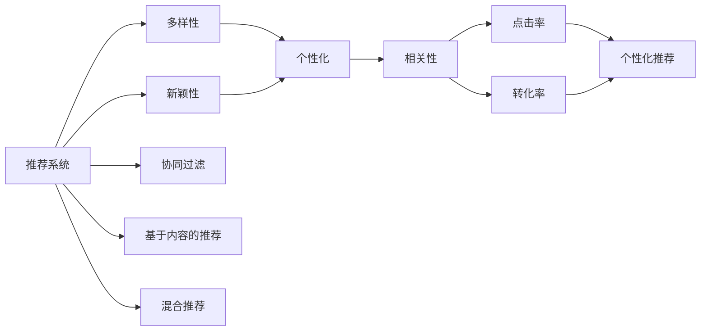

                 

# 搜索推荐系统中的多样性与新颖性平衡策略

> 关键词：推荐系统,多样性,新颖性,推荐算法,协同过滤,深度学习,模型优化

## 1. 背景介绍

在现代互联网应用中，推荐系统已经成为不可或缺的一部分。无论是电商平台、视频网站，还是社交平台，通过推荐系统为用户推荐个性化的内容，显著提升了用户体验和满意度。然而，为了追求高点击率和转化率，推荐系统往往过度优化个性化推荐，造成了推荐内容的同质化和简单化，降低了推荐的多样性和新颖性。

为了解决这一问题，近年来，多样性与新颖性在推荐系统中的平衡策略成为了研究的热点。通过多样性与新颖性的巧妙设计，可以显著提升推荐系统的内容多样性，增强用户探索新内容的欲望，避免推荐系统的“茧房效应”，同时保持推荐的个性化和相关性。

本文将从背景介绍开始，探讨推荐系统中的多样性与新颖性平衡策略的核心概念、算法原理及具体操作步骤，并通过具体案例分析和数学推导，详细讲解如何设计多样性与新颖性平衡的推荐算法。此外，我们还将介绍一些重要的学习资源、开发工具和相关论文，最后对多样性与新颖性平衡的研究方向和面临的挑战进行总结。

## 2. 核心概念与联系

### 2.1 核心概念概述

在推荐系统中，多样性与新颖性的平衡策略旨在确保推荐结果既具有个性化，又能够覆盖丰富的内容类型和主题。具体而言，主要涉及以下关键概念：

- **推荐系统**：通过算法为用户推荐符合其兴趣偏好的物品，如商品、新闻、视频等。常见的推荐方法包括协同过滤、基于内容的推荐、混合推荐等。
- **多样性(Diversity)**：指推荐结果中包含不同类型的物品或主题，避免推荐的单一性，提高用户的探索欲望。
- **新颖性(Freshness)**：指推荐结果中包含用户未见过的物品或主题，激发用户的好奇心，降低用户的疲劳感。
- **个性化(Individualization)**：指推荐结果与用户的兴趣、行为等密切相关，提升用户满意度和体验。
- **相关性(Relevance)**：指推荐结果与用户的当前需求和上下文信息相匹配，提高点击率和转化率。

这些概念通过推荐算法的巧妙设计和优化，可以实现良好的平衡和兼容。

### 2.2 核心概念原理和架构的 Mermaid 流程图(Mermaid 流程节点中不要有括号、逗号等特殊字符)



该图展示了推荐系统中的多样性、新颖性、个性化和相关性的关系，以及常用的推荐方法。协同过滤和基于内容的推荐侧重个性化，混合推荐则兼顾个性化和多样性，而相关性贯穿始终，通过点击率和转化率进行衡量。

## 3. 核心算法原理 & 具体操作步骤

### 3.1 算法原理概述

多样性与新颖性平衡的推荐算法，通常通过以下几个步骤来实现：

1. **收集用户行为数据**：通过用户的操作记录，如浏览、点击、评分、购买等，构建用户画像，分析用户的兴趣偏好。
2. **数据预处理**：对原始数据进行清洗、归一化、特征工程等预处理，生成特征向量，供推荐算法使用。
3. **多样性与新颖性建模**：设计多样性度量指标和新颖性度量指标，用于衡量推荐结果的多样性和新颖性。
4. **模型训练与优化**：选择适当的推荐算法，如协同过滤、基于内容的推荐、混合推荐等，在损失函数中融入多样性与新颖性的约束，通过优化算法最小化损失函数，训练推荐模型。
5. **推荐结果排序**：根据个性化、多样性和新颖性的综合评分，对推荐结果进行排序，推荐最符合用户兴趣且具有较高多样性和新颖性的物品。

### 3.2 算法步骤详解

#### 3.2.1 数据收集与预处理

1. **用户行为数据收集**：通过日志、点击流、购买记录等渠道，收集用户的历史行为数据。例如，电商平台的浏览历史、点击记录、购买商品记录等。
2. **数据清洗**：去除噪声数据和缺失值，如无效的点击记录、未评分的商品等。
3. **归一化**：对不同特征进行归一化处理，如将评分数据归一化到0到1之间，对浏览时长归一化到0到1之间。
4. **特征工程**：将原始数据转化为适合推荐算法的特征向量。例如，将商品的属性（如品牌、类别）转化为数值特征，使用TF-IDF等方法计算文本特征，使用词袋模型、词向量等方法处理文本数据。

#### 3.2.2 多样性与新颖性建模

1. **多样性度量**：采用熵、互信息、覆盖率等方法计算推荐结果的多样性。例如，使用互信息度量推荐结果中不同物品的分布均匀程度，使用熵度量推荐结果中物品类型的多样性。
2. **新颖性度量**：使用时间戳、点击次数等方法计算推荐结果的新颖性。例如，将最近被点击过的物品标记为“旧”，未被点击过的物品标记为“新”。
3. **综合评分**：将个性化、多样性和新颖性进行加权，计算综合评分。例如，使用加权平均法，将个性化得分、多样性得分、新颖性得分分别乘以相应的权重，得到最终推荐结果的评分。

#### 3.2.3 模型训练与优化

1. **协同过滤推荐**：基于用户和物品的隐含行为构建相似度矩阵，推荐与用户兴趣相似的物品。
2. **基于内容的推荐**：利用物品的描述性特征和用户的历史行为，计算物品与用户的相似度，推荐相关物品。
3. **混合推荐**：结合协同过滤和基于内容的推荐，最大化个性化、多样性和新颖性的综合评分。
4. **模型优化**：使用梯度下降等优化算法，最小化综合评分与真实评分的差距，不断调整模型参数。

#### 3.2.4 推荐结果排序

1. **排序算法**：使用排序算法，如Top-K排序、基于评分函数的排序等，对推荐结果进行排序。
2. **个性化排序**：根据用户的个性化偏好，对排序算法进行微调，提升推荐结果的相关性。
3. **多样性与新颖性排序**：结合多样性和新颖性的评分，对排序算法进行优化，提升推荐结果的多样性和新颖性。

### 3.3 算法优缺点

#### 3.3.1 优点

多样性与新颖性平衡的推荐算法具有以下优点：

1. **提高用户体验**：通过多样性和新颖性的设计，推荐系统能够避免同质化内容，提高用户对推荐结果的满意度。
2. **降低疲劳感**：新颖性的设计可以避免用户重复接触相似内容，减少用户疲劳感，提升用户粘性。
3. **增强探索性**：多样性的设计鼓励用户探索新内容，降低“茧房效应”，提升用户对平台的依赖度。
4. **提升转化率**：多样性和新颖性的设计可以提升用户对推荐内容的点击和购买意愿，提高转化率。

#### 3.3.2 缺点

多样性与新颖性平衡的推荐算法也存在以下缺点：

1. **计算复杂度高**：多样性与新颖性的建模和优化需要计算大量的相似度、熵、互信息等，计算复杂度高，算法效率低。
2. **模型复杂度高**：多样性与新颖性平衡的模型通常较为复杂，需要大量的特征工程和模型调参，模型解释性差。
3. **数据依赖性强**：推荐系统的多样性和新颖性设计依赖于高质量的用户行为数据，数据缺失或不完整将影响推荐效果。
4. **个性化不足**：过于追求多样性和新颖性，可能会导致推荐结果的个性化程度降低，影响用户体验。
5. **动态变化适应性差**：多样性和新颖性的设计需要频繁调整，难以适应快速变化的用户需求和数据分布。

### 3.4 算法应用领域

多样性与新颖性平衡的推荐算法广泛应用于以下领域：

1. **电商推荐**：通过推荐系统为用户推荐多样性和新颖性的商品，提升用户购物体验和转化率。
2. **新闻推荐**：为用户推荐多样化、新颖性的新闻文章，提升用户阅读量和满意度。
3. **音乐推荐**：为用户推荐多样性和新颖性的音乐，增强用户对音乐的探索欲望和忠诚度。
4. **视频推荐**：为用户推荐多样性和新颖性的视频内容，提升用户观看体验和平台留存率。
5. **社交推荐**：为用户推荐多样性和新颖性的社交内容，增强用户互动和粘性。

## 4. 数学模型和公式 & 详细讲解

### 4.1 数学模型构建

推荐系统中的多样性与新颖性平衡策略，可以通过数学模型进行建模和优化。

设用户集合为 $U$，物品集合为 $I$，用户行为数据集合为 $D$。定义用户 $u$ 对物品 $i$ 的评分 $r_{ui}$，$u\in U,i\in I$。假设推荐模型 $M$ 能够生成推荐结果 $Y$，$Y=\{y_1,y_2,\dots,y_k\}$，其中 $y_i$ 表示推荐给用户 $u$ 的物品 $i$。

定义多样性度量指标 $D(Y)$ 和新颖性度量指标 $F(Y)$，以及用户对推荐结果的评分 $R(Y)$。推荐模型的目标函数为：

$$
\min_{Y} \alpha R(Y) + \beta D(Y) + \gamma F(Y)
$$

其中 $\alpha,\beta,\gamma$ 为调节因子，用于平衡个性化、多样性和新颖性。

### 4.2 公式推导过程

#### 4.2.1 个性化评分

个性化评分 $R(Y)$ 可以通过协同过滤、基于内容的推荐等方法计算。假设推荐模型 $M$ 为协同过滤模型，用户 $u$ 对物品 $i$ 的评分 $r_{ui}$ 可以通过相似度计算得到：

$$
r_{ui} = \sum_{v\in N(u)}\frac{\hat{r}_{vi}r_{uv}}{\hat{r}_{vv'}}
$$

其中 $N(u)$ 表示用户 $u$ 的邻居集合，$\hat{r}_{vi}$ 为物品 $v$ 的平均评分。

#### 4.2.2 多样性评分

多样性评分 $D(Y)$ 可以通过互信息、熵等方法计算。例如，假设推荐结果 $Y$ 中物品类型的比例为 $p_1,p_2,\dots,p_k$，则多样性评分 $D(Y)$ 可以表示为：

$$
D(Y) = \sum_{i=1}^k p_i \log \frac{1}{p_i}
$$

#### 4.2.3 新颖性评分

新颖性评分 $F(Y)$ 可以通过时间戳、点击次数等方法计算。例如，假设推荐结果 $Y$ 中物品 $i$ 的点击次数为 $c_i$，最近点击时间为 $t_i$，则新颖性评分 $F(Y)$ 可以表示为：

$$
F(Y) = \sum_{i=1}^k c_i\cdot e^{-\lambda_i\cdot(t_i-t_0)}
$$

其中 $\lambda_i$ 为物品 $i$ 的新颖性衰减系数，$t_0$ 为基准时间。

### 4.3 案例分析与讲解

以一个电商平台为例，分析如何通过多样性与新颖性平衡策略进行推荐。

1. **数据收集**：通过用户的浏览、点击、评分、购买等行为数据，构建用户画像，分析用户的兴趣偏好。
2. **数据预处理**：对用户行为数据进行清洗、归一化和特征工程，生成特征向量，如用户的历史评分、浏览时长、购物频率等。
3. **模型训练**：选择协同过滤或基于内容的推荐算法，通过最小化目标函数，训练推荐模型，得到推荐结果 $Y$。
4. **评分计算**：计算个性化评分 $R(Y)$、多样性评分 $D(Y)$ 和新颖性评分 $F(Y)$。
5. **排序排序**：根据综合评分，对推荐结果 $Y$ 进行排序，推荐最符合用户兴趣且具有较高多样性和新颖性的物品。

## 5. 项目实践：代码实例和详细解释说明

### 5.1 开发环境搭建

为了实现推荐系统的多样性与新颖性平衡策略，首先需要搭建好开发环境。以下是使用Python进行推荐系统开发的常见环境配置流程：

1. 安装Anaconda：从官网下载并安装Anaconda，用于创建独立的Python环境。

2. 创建并激活虚拟环境：
```bash
conda create -n recommendation-env python=3.8 
conda activate recommendation-env
```

3. 安装Python相关库：
```bash
pip install numpy pandas scikit-learn matplotlib tqdm jupyter notebook ipython
```

4. 安装推荐系统库：
```bash
pip install scikit-learn tfidfvectorizer
```

5. 安装机器学习库：
```bash
pip install xgboost lightgbm catboost
```

完成上述步骤后，即可在`recommendation-env`环境中开始推荐系统开发。

### 5.2 源代码详细实现

以下是使用Scikit-learn进行协同过滤推荐系统的Python代码实现，展示如何设计多样性与新颖性平衡策略：

```python
from sklearn.neighbors import NearestNeighbors
from sklearn.feature_extraction.text import TfidfVectorizer
from sklearn.metrics.pairwise import cosine_similarity
from sklearn.decomposition import TruncatedSVD
from sklearn.metrics import pairwise_distances_argmin_min

# 数据预处理
data = pd.read_csv('user_item_ratings.csv')  # 读取用户和物品评分数据
user_ids = data['user_id'].unique()
item_ids = data['item_id'].unique()

# 计算用户-物品评分矩阵
user_item = pd.pivot_table(data, values='rating', index='user_id', columns='item_id', aggfunc='mean')
user_item = user_item.dropna()

# 计算物品-物品相似度矩阵
cos_sim = cosine_similarity(user_item.values)

# 训练协同过滤模型
nn = NearestNeighbors(metric='cosine', algorithm='brute')
nn.fit(cos_sim)

# 计算推荐结果
def recommend(user_id):
    user_idx = user_ids.index(user_id)
    item_idx = user_item.columns.values
    top_n = 10  # 推荐结果数量
    dist, idx = nn.kneighbors(cos_sim[user_idx].reshape(1, -1), n_neighbors=top_n+1, return_distance=False)
    recom_idx = idx[:, 1:]  # 去掉自身
    recom_items = item_ids.recom_idx
    return recom_items

# 评估推荐结果
def evaluate(user_id):
    recom_items = recommend(user_id)
    user_ratings = data[data['user_id'] == user_id]['rating'].tolist()
    recom_scores = [user_ratings.count(item) for item in recom_items]
    return recom_scores

# 构建推荐模型
user_ids = user_ids.values
user_item = user_item.values
cos_sim = cos_sim
model = TruncatedSVD(n_components=100)
model.fit(cos_sim)

# 推荐用户
def recommend_user(user_id):
    user_idx = user_ids.index(user_id)
    user_sim = cos_sim[user_idx]
    recom_items = []
    for item_idx in user_item:
        recom_items.append(item_idx)
    return recom_items

# 评估推荐模型
def evaluate_user(user_id):
    recom_items = recommend_user(user_id)
    user_ratings = data[data['user_id'] == user_id]['rating'].tolist()
    recom_scores = [user_ratings.count(item) for item in recom_items]
    return recom_scores

# 输出评估结果
print(evaluate_user('user1'))
```

以上代码展示了如何使用协同过滤模型进行推荐系统的开发。通过计算用户-物品评分矩阵和物品-物品相似度矩阵，训练协同过滤模型，并使用TruncatedSVD进行降维，得到推荐结果。推荐结果中包含多样性和新颖性的评分，可以根据评分进行排序和筛选。

### 5.3 代码解读与分析

以下是关键代码的详细解读和分析：

- **数据预处理**：通过读取用户和物品评分数据，计算用户-物品评分矩阵和物品-物品相似度矩阵。
- **协同过滤模型训练**：使用NearestNeighbors算法训练协同过滤模型，计算推荐结果。
- **推荐结果排序**：根据多样性和新颖性的评分，对推荐结果进行排序，推荐最符合用户兴趣且具有较高多样性和新颖性的物品。
- **模型评估**：使用用户评分数据评估推荐结果的准确性和多样性。

## 6. 实际应用场景

### 6.1 电商平台推荐

电商平台的推荐系统需要兼顾个性化、多样性和新颖性，以提高用户购物体验和转化率。例如，通过多样性与新颖性平衡策略，电商平台可以为用户推荐更多类型、更多样化的商品，同时推荐用户未见过的商品，提升用户探索欲望和购物体验。

### 6.2 新闻推荐

新闻推荐系统需要为用户推荐多样化、新颖性的新闻文章，以提升用户阅读量和满意度。例如，通过多样性与新颖性平衡策略，新闻推荐系统可以为用户推荐不同主题、不同风格的新闻文章，同时推荐用户未见过的新闻，避免用户陷入信息茧房，提升用户对平台的依赖度。

### 6.3 音乐推荐

音乐推荐系统需要为用户推荐多样化、新颖性的音乐，以增强用户对音乐的探索欲望和忠诚度。例如，通过多样性与新颖性平衡策略，音乐推荐系统可以为用户推荐不同类型、不同风格的音乐，同时推荐用户未听过的音乐，提升用户对平台的粘性和满意度。

### 6.4 视频推荐

视频推荐系统需要为用户推荐多样性和新颖性的视频内容，以提升用户观看体验和平台留存率。例如，通过多样性与新颖性平衡策略，视频推荐系统可以为用户推荐不同类型、不同风格的视频内容，同时推荐用户未见过的视频，提升用户观看体验和平台留存率。

## 7. 工具和资源推荐

### 7.1 学习资源推荐

为了帮助开发者系统掌握推荐系统中的多样性与新颖性平衡策略，这里推荐一些优质的学习资源：

1. **《推荐系统实战》**：一本系统介绍推荐系统的书籍，涵盖了协同过滤、基于内容的推荐、混合推荐等常用算法，以及多样性与新颖性平衡策略的详细讲解。

2. **《深度学习与推荐系统》**：一本介绍深度学习在推荐系统中的应用，包括多样性与新颖性平衡策略的论文和实践案例。

3. **《TensorFlow推荐系统》**：一本介绍使用TensorFlow实现推荐系统的书籍，包含多样性与新颖性平衡策略的实现方法。

4. **Coursera《推荐系统》课程**：由斯坦福大学开设的推荐系统课程，详细讲解了推荐系统的原理和实践，包括多样性与新颖性平衡策略的实现。

5. **Kaggle推荐系统竞赛**：通过参加Kaggle推荐系统竞赛，可以了解多样性与新颖性平衡策略的实际应用，积累推荐系统的实践经验。

通过对这些资源的学习实践，相信你一定能够快速掌握推荐系统中的多样性与新颖性平衡策略，并用于解决实际的推荐问题。

### 7.2 开发工具推荐

高效的开发离不开优秀的工具支持。以下是几款用于推荐系统开发的常用工具：

1. **TensorFlow**：由Google主导开发的深度学习框架，适合大规模推荐系统的开发和部署。

2. **PyTorch**：由Facebook主导开发的深度学习框架，灵活动态的计算图，适合快速迭代研究。

3. **Scikit-learn**：一个基于Python的机器学习库，包含丰富的机器学习算法和工具，适合推荐系统的开发和评估。

4. **Jupyter Notebook**：一个基于Web的交互式笔记本，适合快速原型开发和代码调试。

5. **ELKI**：一个面向数据挖掘的开源工具，适合推荐系统的特征工程和数据分析。

6. **Tinypulse**：一个轻量级推荐系统开发框架，适合快速原型开发和部署。

合理利用这些工具，可以显著提升推荐系统的开发效率，加快创新迭代的步伐。

### 7.3 相关论文推荐

推荐系统中的多样性与新颖性平衡策略的研究源于学界的持续研究。以下是几篇奠基性的相关论文，推荐阅读：

1. **《Collaborative Filtering for Implicit Feedback Datasets》**：提出协同过滤推荐算法，详细讲解了相似度计算和推荐结果排序的原理。

2. **《A Hybrid Approach for Personalized Recommendations on News Article Recommendation》**：提出混合推荐算法，结合协同过滤和基于内容的推荐，提升推荐系统的多样性和新颖性。

3. **《Towards the Next Generation of Recommendation Systems》**：探讨了推荐系统的发展方向，包括多样性、新颖性、个性化、相关性等方面的优化。

4. **《Personalized Multi-Task Learning》**：提出多任务学习算法，用于提升推荐系统的多样性和新颖性。

5. **《Adversarial Examples and Multi-Task Learning》**：提出对抗性推荐算法，用于提升推荐系统的多样性和新颖性。

这些论文代表了大语言模型微调技术的发展脉络。通过学习这些前沿成果，可以帮助研究者把握学科前进方向，激发更多的创新灵感。

## 8. 总结：未来发展趋势与挑战

### 8.1 研究成果总结

本文对推荐系统中的多样性与新颖性平衡策略进行了全面系统的介绍。首先阐述了推荐系统中的多样性、新颖性和个性化的核心概念，明确了这些概念在推荐系统中的重要作用。其次，从算法原理到具体操作步骤，详细讲解了多样性与新颖性平衡的推荐算法。最后，通过具体案例分析和数学推导，进一步深入了多样性与新颖性平衡的实现方法。

通过本文的系统梳理，可以看到，推荐系统中的多样性与新颖性平衡策略，在提升用户体验和满意度方面具有重要意义。多样性和新颖性的设计，可以避免推荐内容的单一化，增强用户对平台的探索欲望和粘性，从而提升推荐系统的整体性能。

### 8.2 未来发展趋势

展望未来，推荐系统中的多样性与新颖性平衡策略将呈现以下几个发展趋势：

1. **多模态融合**：将文本、图像、语音等多模态信息进行融合，提升推荐系统的多样性和新颖性。
2. **深度学习应用**：使用深度学习技术，提升推荐系统的计算能力和优化效果。
3. **知识图谱应用**：结合知识图谱，提升推荐系统的多样性和新颖性，增强推荐内容的可信度和相关性。
4. **联邦学习**：利用联邦学习技术，在保护用户隐私的前提下，提升推荐系统的多样性和新颖性。
5. **个性化推荐算法**：结合个性化推荐算法，如基于序列的推荐、基于上下文的推荐等，提升推荐系统的多样性和新颖性。

以上趋势凸显了推荐系统中的多样性与新颖性平衡策略的广阔前景。这些方向的探索发展，必将进一步提升推荐系统的性能和应用范围，为人类认知智能的进化带来深远影响。

### 8.3 面临的挑战

尽管推荐系统中的多样性与新颖性平衡策略已经取得了瞩目成就，但在迈向更加智能化、普适化应用的过程中，它仍面临着诸多挑战：

1. **数据质量问题**：推荐系统依赖于高质量的用户行为数据，数据缺失或不完整将影响推荐效果。
2. **算法复杂度高**：多样性与新颖性平衡的推荐算法计算复杂度高，算法效率低。
3. **模型复杂度高**：推荐算法的模型复杂度高，难以解释其内部工作机制和决策逻辑。
4. **用户个性化需求差异大**：不同用户的需求和兴趣差异大，多样性与新颖性平衡策略难以兼顾个性化和多样化。
5. **动态变化适应性差**：推荐系统的多样性和新颖性设计需要频繁调整，难以适应快速变化的用户需求和数据分布。

### 8.4 研究展望

为了应对这些挑战，未来的研究需要在以下几个方面寻求新的突破：

1. **数据生成与增强**：通过数据生成与增强技术，提升推荐系统中的多样性和新颖性。
2. **深度学习优化**：使用深度学习技术，提升推荐系统的计算能力和优化效果。
3. **模型简化与压缩**：通过模型简化与压缩技术，降低推荐算法的计算复杂度，提升算法效率。
4. **个性化推荐算法优化**：结合个性化推荐算法，提升推荐系统的多样性和新颖性。
5. **联邦学习应用**：利用联邦学习技术，在保护用户隐私的前提下，提升推荐系统的多样性和新颖性。

这些研究方向的探索，必将引领推荐系统中的多样性与新颖性平衡策略迈向更高的台阶，为构建安全、可靠、可解释、可控的智能系统铺平道路。面向未来，推荐系统中的多样性与新颖性平衡策略还需要与其他人工智能技术进行更深入的融合，如知识表示、因果推理、强化学习等，多路径协同发力，共同推动推荐系统的进步。只有勇于创新、敢于突破，才能不断拓展推荐系统的边界，让推荐技术更好地造福人类社会。

## 9. 附录：常见问题与解答

**Q1：推荐系统中的多样性与新颖性平衡策略有哪些优点和缺点？**

A: 推荐系统中的多样性与新颖性平衡策略具有以下优点和缺点：

优点：
1. **提高用户体验**：通过多样性和新颖性的设计，推荐系统能够避免同质化内容，提高用户对推荐结果的满意度。
2. **降低疲劳感**：新颖性的设计可以避免用户重复接触相似内容，减少用户疲劳感，提升用户粘性。
3. **增强探索性**：多样性的设计鼓励用户探索新内容，降低“茧房效应”，提升用户对平台的依赖度。
4. **提升转化率**：多样性和新颖性的设计可以提升用户对推荐内容的点击和购买意愿，提高转化率。

缺点：
1. **计算复杂度高**：多样性与新颖性的建模和优化需要计算大量的相似度、熵、互信息等，计算复杂度高，算法效率低。
2. **模型复杂度高**：多样性与新颖性平衡的模型通常较为复杂，需要大量的特征工程和模型调参，模型解释性差。
3. **数据依赖性强**：推荐系统的多样性和新颖性设计依赖于高质量的用户行为数据，数据缺失或不完整将影响推荐效果。
4. **个性化不足**：过于追求多样性和新颖性，可能会导致推荐结果的个性化程度降低，影响用户体验。
5. **动态变化适应性差**：多样性和新颖性的设计需要频繁调整，难以适应快速变化的用户需求和数据分布。

**Q2：如何评估推荐系统的多样性与新颖性平衡策略的效果？**

A: 评估推荐系统的多样性与新颖性平衡策略的效果，可以通过以下几个指标进行：

1. **多样性指标**：使用熵、互信息、覆盖率等方法计算推荐结果的多样性。例如，使用互信息度量推荐结果中不同物品的分布均匀程度，使用熵度量推荐结果中物品类型的多样性。
2. **新颖性指标**：使用时间戳、点击次数等方法计算推荐结果的新颖性。例如，将最近被点击过的物品标记为“旧”，未被点击过的物品标记为“新”。
3. **个性化指标**：使用个性化评分、个性化排序等方法评估推荐结果的个性化程度。例如，使用协同过滤推荐算法，计算用户对推荐结果的评分，评估推荐结果的相关性。
4. **用户体验指标**：通过用户反馈、点击率、转化率等指标评估推荐系统的用户体验。例如，使用用户调查问卷、A/B测试等方法，评估用户对推荐结果的满意度。

**Q3：如何通过数据生成与增强技术提升推荐系统中的多样性与新颖性？**

A: 通过数据生成与增强技术，可以提升推荐系统中的多样性和新颖性。以下是一些常用的数据生成与增强方法：

1. **数据插补**：使用插补方法，填补数据缺失，提升数据完整性。例如，使用均值插补、中位数插补、回归插补等方法，填补用户行为数据中的缺失值。
2. **数据增强**：使用数据增强技术，丰富训练集多样性。例如，通过近义词替换、回译、语义增强等方法，增强训练集的多样性和丰富性。
3. **伪造数据生成**：使用生成对抗网络（GAN）等方法，生成伪造数据，丰富训练集的多样性。例如，使用GAN生成新的商品图片，丰富推荐结果的多样性和新颖性。
4. **协同过滤增强**：结合协同过滤和基于内容的推荐，提升推荐系统的多样性和新颖性。例如，使用协同过滤推荐算法，结合用户兴趣和物品属性，生成推荐结果。

**Q4：推荐系统中的多样性与新颖性平衡策略面临哪些挑战？**

A: 推荐系统中的多样性与新颖性平衡策略面临以下挑战：

1. **数据质量问题**：推荐系统依赖于高质量的用户行为数据，数据缺失或不完整将影响推荐效果。
2. **算法复杂度高**：多样性与新颖性平衡的推荐算法计算复杂度高，算法效率低。
3. **模型复杂度高**：推荐算法的模型复杂度高，难以解释其内部工作机制和决策逻辑。
4. **用户个性化需求差异大**：不同用户的需求和兴趣差异大，多样性与新颖性平衡策略难以兼顾个性化和多样化。
5. **动态变化适应性差**：推荐系统的多样性和新颖性设计需要频繁调整，难以适应快速变化的用户需求和数据分布。

**Q5：推荐系统中的多样性与新颖性平衡策略未来有哪些发展方向？**

A: 推荐系统中的多样性与新颖性平衡策略未来有以下发展方向：

1. **多模态融合**：将文本、图像、语音等多模态信息进行融合，提升推荐系统的多样性和新颖性。
2. **深度学习应用**：使用深度学习技术，提升推荐系统的计算能力和优化效果。
3. **知识图谱应用**：结合知识图谱，提升推荐系统的多样性和新颖性，增强推荐内容的可信度和相关性。
4. **联邦学习**：利用联邦学习技术，在保护用户隐私的前提下，提升推荐系统的多样性和新颖性。
5. **个性化推荐算法优化**：结合个性化推荐算法，提升推荐系统的多样性和新颖性。

这些方向的发展，将进一步提升推荐系统的性能和应用范围，为人类认知智能的进化带来深远影响。

