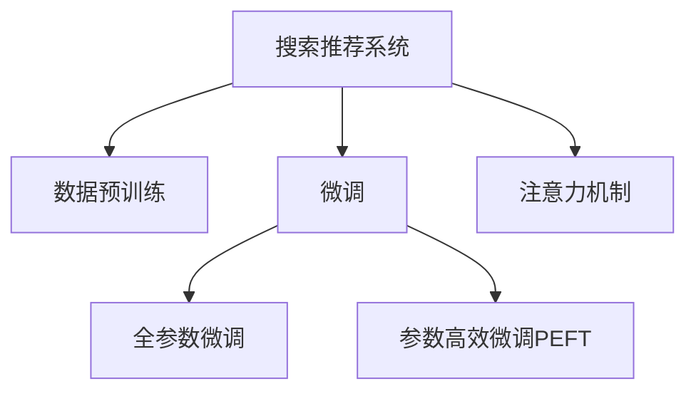

                 

# 搜索推荐系统的AI 大模型应用：提高电商平台的转化率、用户体验与忠诚度

> 关键词：搜索推荐系统, 电商, 大模型, 转化率, 用户体验, 忠诚度

## 1. 背景介绍

### 1.1 问题由来

在电商平台上，搜索引擎和推荐系统扮演着至关重要的角色。用户通过搜索或浏览发现产品，再通过推荐系统发现感兴趣的商品，从而最终完成购买。然而，传统的搜索推荐系统面临着以下挑战：

1. **数据稀疏性**：电商平台中的物品种类繁多，但用户的历史行为数据相对较少，导致推荐系统难以准确地预测用户偏好。
2. **冷启动问题**：对于新用户或少有行为数据的用户，推荐系统无法提供个性化推荐。
3. **实时性要求高**：用户需要实时获取推荐结果，搜索引擎和推荐系统需要高效、准确地响应用户查询。
4. **用户满意度低**：推荐结果与用户预期不符，导致用户流失。
5. **数据安全与隐私问题**：电商平台需保证用户数据的安全与隐私，避免数据泄露和滥用。

为了应对这些挑战，人工智能大模型在电商平台的搜索推荐系统中得到了广泛应用。大模型能够通过海量的数据预训练，学习到通用的知识表示，并在特定任务上进行微调，以提高推荐系统的性能和用户满意度。

## 2. 核心概念与联系

### 2.1 核心概念概述

本节将介绍几个与大模型在搜索推荐系统中应用相关的核心概念：

- **搜索推荐系统(Search & Recommendation System, SRS)**：旨在通过用户查询和行为数据，向用户推荐最相关、最感兴趣的商品或服务。
- **大模型(Large Model)**：指通过大规模数据进行预训练的深度学习模型，如BERT、GPT、DALL-E等。
- **数据预训练(Pre-training)**：指在大规模无标签数据上训练模型，学习通用的语言或视觉表示。
- **微调(Fine-tuning)**：指在预训练模型的基础上，使用特定任务的数据进行有监督训练，以适应新任务。
- **参数高效微调(Parameter-Efficient Fine-Tuning, PEFT)**：只调整部分模型参数，而保持大部分预训练参数不变。
- **注意力机制(Attention Mechanism)**：指模型在处理序列数据时，通过关注输入的不同部分来提取关键信息。

这些概念通过以下Mermaid流程图来展示它们之间的联系：



这个流程图展示了搜索推荐系统中，大模型的数据预训练、微调以及注意力机制的关系：

1. 数据预训练使得模型学习到通用的知识表示。
2. 微调将模型适配到特定任务，如商品推荐、搜索排序等。
3. 注意力机制帮助模型在处理序列数据时，高效地捕捉重要信息。

这些核心概念共同构成了搜索推荐系统在大模型应用中的技术框架，使得模型能够在多维数据空间中高效、准确地进行推荐和排序。

## 3. 核心算法原理 & 具体操作步骤

### 3.1 算法原理概述

大模型在搜索推荐系统中的应用，主要基于监督学习和迁移学习的原理。通过大规模无标签数据进行预训练，模型学习到通用的语言或视觉表示。然后在特定任务上进行微调，使得模型能够针对具体任务进行优化，从而提高推荐系统的性能和用户满意度。

具体来说，算法原理如下：

1. **预训练**：在大规模无标签数据上进行预训练，学习通用的知识表示。
2. **微调**：在特定任务上进行有监督训练，调整模型参数，使其适应新任务。
3. **参数高效微调**：仅调整部分模型参数，保持大部分预训练参数不变，减少计算资源消耗。
4. **注意力机制**：在处理序列数据时，通过关注不同部分来提取关键信息，提高模型的精度和效率。

### 3.2 算法步骤详解

大模型在搜索推荐系统中的应用主要包括以下几个关键步骤：

**Step 1: 数据准备**
- 收集用户的历史行为数据，如浏览、点击、购买等。
- 收集商品属性数据，如价格、类别、评分等。
- 将数据集划分为训练集、验证集和测试集。

**Step 2: 预训练模型选择**
- 选择合适的预训练模型，如BERT、GPT、DALL-E等。
- 将模型迁移到目标任务上，进行微调。

**Step 3: 添加任务适配层**
- 根据任务类型，在模型顶层设计合适的输出层和损失函数。
- 对于分类任务，通常在顶层添加线性分类器和交叉熵损失函数。
- 对于生成任务，通常使用语言模型的解码器输出概率分布，并以负对数似然为损失函数。

**Step 4: 设置微调超参数**
- 选择合适的优化算法及其参数，如AdamW、SGD等。
- 设置学习率、批大小、迭代轮数等。
- 设置正则化技术及强度，包括权重衰减、Dropout、Early Stopping等。

**Step 5: 执行梯度训练**
- 将训练集数据分批次输入模型，前向传播计算损失函数。
- 反向传播计算参数梯度，根据设定的优化算法和学习率更新模型参数。
- 周期性在验证集上评估模型性能，根据性能指标决定是否触发Early Stopping。
- 重复上述步骤直到满足预设的迭代轮数或Early Stopping条件。

**Step 6: 测试和部署**
- 在测试集上评估微调后模型的性能，对比微调前后的精度提升。
- 使用微调后的模型对新样本进行推理预测，集成到实际的应用系统中。
- 持续收集新的数据，定期重新微调模型，以适应数据分布的变化。

### 3.3 算法优缺点

大模型在搜索推荐系统中的应用有以下优点：

- **精度高**：大模型经过大规模预训练，能够学习到丰富的语言或视觉表示，提高推荐系统的精度。
- **泛化能力强**：大模型在预训练过程中学习到的通用知识，使其能够适应多种任务和数据分布。
- **实时性好**：大模型在推理时速度较快，能够实时响应用户查询。
- **用户满意度高**：大模型能够根据用户的历史行为和兴趣，提供更加个性化的推荐，提高用户满意度。

同时，大模型在搜索推荐系统中的应用也存在以下缺点：

- **计算资源消耗大**：大模型参数量大，推理时计算资源消耗较大。
- **隐私风险高**：大模型需要大量的用户数据进行训练，隐私风险较高。
- **可解释性差**：大模型复杂度高，难以解释其内部的决策过程。
- **训练时间长**：大模型训练时间较长，可能无法及时响应用户的实时查询。

### 3.4 算法应用领域

大模型在搜索推荐系统中的应用已经得到了广泛的应用，覆盖了多个领域，例如：

- **商品推荐**：根据用户的历史行为和兴趣，推荐最相关的商品。
- **搜索排序**：根据用户查询，排序最相关的商品或服务。
- **个性化广告**：根据用户的兴趣和行为，推荐个性化的广告。
- **内容生成**：根据用户兴趣和需求，生成个性化的商品描述、广告文案等。
- **用户行为分析**：分析用户行为数据，了解用户偏好和需求，优化推荐系统。

## 4. 数学模型和公式 & 详细讲解 & 举例说明

### 4.1 数学模型构建

在大模型应用于搜索推荐系统时，通常使用Transformer架构，并使用自回归模型进行预测。以商品推荐为例，假设模型输入为商品ID，输出为推荐商品ID的概率分布。

记输入序列为 $X = [x_1, x_2, ..., x_n]$，输出序列为 $Y = [y_1, y_2, ..., y_m]$。目标函数为交叉熵损失函数，即：

$$
L = -\frac{1}{N}\sum_{i=1}^N \sum_{j=1}^m y_{ij} \log p_{ij}
$$

其中 $y_{ij}$ 为第 $i$ 个样本的第 $j$ 个标签，$p_{ij}$ 为模型预测的概率。

### 4.2 公式推导过程

在Transformer中，注意力机制使得模型能够关注输入序列的不同部分，以提取关键信息。具体推导如下：

设输入序列为 $X = [x_1, x_2, ..., x_n]$，输出序列为 $Y = [y_1, y_2, ..., y_m]$。设输入嵌入矩阵为 $E \in \mathbb{R}^{n \times d}$，输出嵌入矩阵为 $F \in \mathbb{R}^{m \times d}$，注意力权重矩阵为 $A \in \mathbb{R}^{m \times n}$。则注意力机制的输出为：

$$
\hat{Y} = F \times \left( \frac{E \times A}{\sqrt{d}} \right)
$$

其中 $E \times A$ 为注意力加权矩阵，$\sqrt{d}$ 为归一化因子，$\hat{Y}$ 为模型预测的输出嵌入。

### 4.3 案例分析与讲解

以电商平台的商品推荐系统为例，假设我们有一个电商网站，用户可以浏览和购买商品。我们希望基于用户的历史行为数据，推荐用户可能感兴趣的商品。具体步骤如下：

1. **数据收集**：收集用户的历史行为数据，如浏览、点击、购买等。
2. **预训练模型选择**：选择BERT作为预训练模型，并将其迁移到商品推荐任务上。
3. **任务适配层设计**：在模型顶层添加线性分类器和交叉熵损失函数，用于商品推荐任务。
4. **微调**：使用历史行为数据进行有监督训练，调整模型参数，使其适应商品推荐任务。
5. **测试与部署**：在测试集上评估微调后模型的性能，集成到实际的商品推荐系统中。

## 5. 项目实践：代码实例和详细解释说明

### 5.1 开发环境搭建

在进行大模型应用于搜索推荐系统的实践前，我们需要准备好开发环境。以下是使用Python进行PyTorch开发的环境配置流程：

1. 安装Anaconda：从官网下载并安装Anaconda，用于创建独立的Python环境。
2. 创建并激活虚拟环境：
```bash
conda create -n pytorch-env python=3.8 
conda activate pytorch-env
```

3. 安装PyTorch：根据CUDA版本，从官网获取对应的安装命令。例如：
```bash
conda install pytorch torchvision torchaudio cudatoolkit=11.1 -c pytorch -c conda-forge
```

4. 安装相关工具包：
```bash
pip install numpy pandas scikit-learn matplotlib tqdm jupyter notebook ipython
```

完成上述步骤后，即可在`pytorch-env`环境中开始大模型应用于搜索推荐系统的实践。

### 5.2 源代码详细实现

下面我们以商品推荐为例，给出使用Transformers库进行BERT模型微调的PyTorch代码实现。

首先，定义商品推荐任务的数据处理函数：

```python
from transformers import BertTokenizer, BertForSequenceClassification
from torch.utils.data import Dataset
import torch

class RecommendationDataset(Dataset):
    def __init__(self, user_ids, item_ids, labels, tokenizer, max_len=128):
        self.user_ids = user_ids
        self.item_ids = item_ids
        self.labels = labels
        self.tokenizer = tokenizer
        self.max_len = max_len
        
    def __len__(self):
        return len(self.user_ids)
    
    def __getitem__(self, item):
        user_id = self.user_ids[item]
        item_id = self.item_ids[item]
        label = self.labels[item]
        
        # 构造输入序列
        user_input = user_id
        item_input = item_id
        
        # 对用户ID和商品ID进行编码
        user_tokens = self.tokenizer(user_input, return_tensors='pt', padding='max_length', max_length=self.max_len, truncation=True).input_ids
        item_tokens = self.tokenizer(item_input, return_tensors='pt', padding='max_length', max_length=self.max_len, truncation=True).input_ids
        
        # 合并用户和商品ID的编码结果
        input_ids = torch.cat((user_tokens, item_tokens), dim=1)
        attention_mask = torch.ones(input_ids.shape, dtype=torch.long)
        
        # 对标签进行编码
        label = torch.tensor(label, dtype=torch.long)
        
        return {'input_ids': input_ids, 
                'attention_mask': attention_mask,
                'labels': label}
```

然后，定义模型和优化器：

```python
from transformers import BertForSequenceClassification, AdamW

model = BertForSequenceClassification.from_pretrained('bert-base-cased', num_labels=2)

optimizer = AdamW(model.parameters(), lr=2e-5)
```

接着，定义训练和评估函数：

```python
from torch.utils.data import DataLoader
from tqdm import tqdm
from sklearn.metrics import accuracy_score

device = torch.device('cuda') if torch.cuda.is_available() else torch.device('cpu')
model.to(device)

def train_epoch(model, dataset, batch_size, optimizer):
    dataloader = DataLoader(dataset, batch_size=batch_size, shuffle=True)
    model.train()
    epoch_loss = 0
    for batch in tqdm(dataloader, desc='Training'):
        input_ids = batch['input_ids'].to(device)
        attention_mask = batch['attention_mask'].to(device)
        labels = batch['labels'].to(device)
        model.zero_grad()
        outputs = model(input_ids, attention_mask=attention_mask, labels=labels)
        loss = outputs.loss
        epoch_loss += loss.item()
        loss.backward()
        optimizer.step()
    return epoch_loss / len(dataloader)

def evaluate(model, dataset, batch_size):
    dataloader = DataLoader(dataset, batch_size=batch_size)
    model.eval()
    preds, labels = [], []
    with torch.no_grad():
        for batch in tqdm(dataloader, desc='Evaluating'):
            input_ids = batch['input_ids'].to(device)
            attention_mask = batch['attention_mask'].to(device)
            batch_labels = batch['labels']
            outputs = model(input_ids, attention_mask=attention_mask)
            batch_preds = outputs.logits.argmax(dim=2).to('cpu').tolist()
            batch_labels = batch_labels.to('cpu').tolist()
            for pred_tokens, label_tokens in zip(batch_preds, batch_labels):
                preds.append(pred_tokens[:len(label_tokens)])
                labels.append(label_tokens)
                
    print('Accuracy:', accuracy_score(labels, preds))
```

最后，启动训练流程并在测试集上评估：

```python
epochs = 5
batch_size = 16

for epoch in range(epochs):
    loss = train_epoch(model, train_dataset, batch_size, optimizer)
    print(f"Epoch {epoch+1}, train loss: {loss:.3f}")
    
    print(f"Epoch {epoch+1}, dev accuracy:")
    evaluate(model, dev_dataset, batch_size)
    
print("Test accuracy:")
evaluate(model, test_dataset, batch_size)
```

以上就是使用PyTorch进行BERT模型微调的商品推荐系统完整代码实现。可以看到，借助Transformers库，代码实现简洁高效。

### 5.3 代码解读与分析

让我们再详细解读一下关键代码的实现细节：

**RecommendationDataset类**：
- `__init__`方法：初始化用户ID、商品ID、标签、分词器等关键组件。
- `__len__`方法：返回数据集的样本数量。
- `__getitem__`方法：对单个样本进行处理，将用户ID和商品ID编码成token ids，对标签进行编码，并进行定长padding。

**训练和评估函数**：
- 使用PyTorch的DataLoader对数据集进行批次化加载，供模型训练和推理使用。
- 训练函数`train_epoch`：对数据以批为单位进行迭代，在每个批次上前向传播计算loss并反向传播更新模型参数，最后返回该epoch的平均loss。
- 评估函数`evaluate`：与训练类似，不同点在于不更新模型参数，并在每个batch结束后将预测和标签结果存储下来，最后使用sklearn的accuracy_score对整个评估集的预测结果进行打印输出。

**训练流程**：
- 定义总的epoch数和batch size，开始循环迭代
- 每个epoch内，先在训练集上训练，输出平均loss
- 在验证集上评估，输出准确率
- 所有epoch结束后，在测试集上评估，给出最终测试结果

## 6. 实际应用场景

### 6.1 智能客服系统

智能客服系统在电商平台中扮演着重要角色，能够快速响应客户咨询，提供高质量的客户服务。基于大模型的微调方法，可以显著提升智能客服系统的性能。

具体而言，可以收集客户的历史对话记录和常见问题，将问题和最佳答复构建成监督数据，在此基础上对预训练模型进行微调。微调后的模型能够自动理解客户意图，匹配最合适的答案模板进行回复。对于客户提出的新问题，还可以接入检索系统实时搜索相关内容，动态组织生成回答。如此构建的智能客服系统，能大幅提升客户咨询体验和问题解决效率。

### 6.2 金融舆情监测

金融领域需要实时监测市场舆论动向，以便及时应对负面信息传播，规避金融风险。基于大语言模型微调的文本分类和情感分析技术，为金融舆情监测提供了新的解决方案。

具体而言，可以收集金融领域相关的新闻、报道、评论等文本数据，并对其进行主题标注和情感标注。在此基础上对预训练语言模型进行微调，使其能够自动判断文本属于何种主题，情感倾向是正面、中性还是负面。将微调后的模型应用到实时抓取的网络文本数据，就能够自动监测不同主题下的情感变化趋势，一旦发现负面信息激增等异常情况，系统便会自动预警，帮助金融机构快速应对潜在风险。

### 6.3 个性化推荐系统

当前的推荐系统往往只依赖用户的历史行为数据进行物品推荐，无法深入理解用户的真实兴趣偏好。基于大语言模型微调技术，个性化推荐系统可以更好地挖掘用户行为背后的语义信息，从而提供更精准、多样的推荐内容。

具体而言，可以收集用户浏览、点击、评论、分享等行为数据，提取和用户交互的物品标题、描述、标签等文本内容。将文本内容作为模型输入，用户的后续行为（如是否点击、购买等）作为监督信号，在此基础上微调预训练语言模型。微调后的模型能够从文本内容中准确把握用户的兴趣点。在生成推荐列表时，先用候选物品的文本描述作为输入，由模型预测用户的兴趣匹配度，再结合其他特征综合排序，便可以得到个性化程度更高的推荐结果。

## 7. 工具和资源推荐

### 7.1 学习资源推荐

为了帮助开发者系统掌握大模型在搜索推荐系统中的应用，这里推荐一些优质的学习资源：

1. 《Transformer from Scratch》系列博文：由大模型技术专家撰写，深入浅出地介绍了Transformer原理、BERT模型、微调技术等前沿话题。
2. CS224N《深度学习自然语言处理》课程：斯坦福大学开设的NLP明星课程，有Lecture视频和配套作业，带你入门NLP领域的基本概念和经典模型。
3. 《Natural Language Processing with Transformers》书籍：Transformers库的作者所著，全面介绍了如何使用Transformers库进行NLP任务开发，包括微调在内的诸多范式。
4. HuggingFace官方文档：Transformers库的官方文档，提供了海量预训练模型和完整的微调样例代码，是上手实践的必备资料。
5. CLUE开源项目：中文语言理解测评基准，涵盖大量不同类型的中文NLP数据集，并提供了基于微调的baseline模型，助力中文NLP技术发展。

通过对这些资源的学习实践，相信你一定能够快速掌握大模型在搜索推荐系统中的应用技巧，并用于解决实际的NLP问题。

### 7.2 开发工具推荐

高效的开发离不开优秀的工具支持。以下是几款用于大模型应用于搜索推荐系统开发的常用工具：

1. PyTorch：基于Python的开源深度学习框架，灵活动态的计算图，适合快速迭代研究。大部分预训练语言模型都有PyTorch版本的实现。
2. TensorFlow：由Google主导开发的开源深度学习框架，生产部署方便，适合大规模工程应用。同样有丰富的预训练语言模型资源。
3. Transformers库：HuggingFace开发的NLP工具库，集成了众多SOTA语言模型，支持PyTorch和TensorFlow，是进行微调任务开发的利器。
4. Weights & Biases：模型训练的实验跟踪工具，可以记录和可视化模型训练过程中的各项指标，方便对比和调优。与主流深度学习框架无缝集成。
5. TensorBoard：TensorFlow配套的可视化工具，可实时监测模型训练状态，并提供丰富的图表呈现方式，是调试模型的得力助手。
6. Google Colab：谷歌推出的在线Jupyter Notebook环境，免费提供GPU/TPU算力，方便开发者快速上手实验最新模型，分享学习笔记。

合理利用这些工具，可以显著提升大模型应用于搜索推荐系统开发的效率，加快创新迭代的步伐。

### 7.3 相关论文推荐

大语言模型在搜索推荐系统中的应用源于学界的持续研究。以下是几篇奠基性的相关论文，推荐阅读：

1. Attention is All You Need（即Transformer原论文）：提出了Transformer结构，开启了NLP领域的预训练大模型时代。
2. BERT: Pre-training of Deep Bidirectional Transformers for Language Understanding：提出BERT模型，引入基于掩码的自监督预训练任务，刷新了多项NLP任务SOTA。
3. Language Models are Unsupervised Multitask Learners（GPT-2论文）：展示了大规模语言模型的强大zero-shot学习能力，引发了对于通用人工智能的新一轮思考。
4. Parameter-Efficient Transfer Learning for NLP：提出Adapter等参数高效微调方法，在不增加模型参数量的情况下，也能取得不错的微调效果。
5. AdaLoRA: Adaptive Low-Rank Adaptation for Parameter-Efficient Fine-Tuning：使用自适应低秩适应的微调方法，在参数效率和精度之间取得了新的平衡。
6. Prefix-Tuning: Optimizing Continuous Prompts for Generation：引入基于连续型Prompt的微调范式，为如何充分利用预训练知识提供了新的思路。

这些论文代表了大语言模型在搜索推荐系统中的应用发展脉络。通过学习这些前沿成果，可以帮助研究者把握学科前进方向，激发更多的创新灵感。

## 8. 总结：未来发展趋势与挑战

### 8.1 总结

本文对大模型在搜索推荐系统中的应用进行了全面系统的介绍。首先阐述了大模型在电商平台中的应用背景和意义，明确了大模型微调在提高推荐系统性能、用户满意度与忠诚度方面的独特价值。其次，从原理到实践，详细讲解了监督微调的数学原理和关键步骤，给出了大模型应用于商品推荐系统的完整代码实现。同时，本文还广泛探讨了大模型在智能客服、金融舆情、个性化推荐等多个行业领域的应用前景，展示了大模型微调范式的巨大潜力。最后，本文精选了微调技术的各类学习资源，力求为读者提供全方位的技术指引。

通过本文的系统梳理，可以看到，大模型在搜索推荐系统中的应用已经成为提升电商平台转化率、用户体验与忠诚度的重要手段。大模型的应用，使得推荐系统能够更加智能、高效地为用户提供个性化推荐，极大地提升了用户体验和平台收益。未来，伴随大模型的持续演进，搜索推荐系统必将更加智能、高效，为用户带来更好的服务体验。

### 8.2 未来发展趋势

展望未来，大模型在搜索推荐系统中的应用将呈现以下几个发展趋势：

1. **模型规模持续增大**：随着算力成本的下降和数据规模的扩张，预训练语言模型的参数量还将持续增长。超大规模语言模型蕴含的丰富语言知识，有望支撑更加复杂多变的推荐任务。
2. **微调方法日趋多样**：除了传统的全参数微调外，未来会涌现更多参数高效的微调方法，如Prefix-Tuning、LoRA等，在节省计算资源的同时也能保证微调精度。
3. **持续学习成为常态**：随着数据分布的不断变化，微调模型也需要持续学习新知识以保持性能。如何在不遗忘原有知识的同时，高效吸收新样本信息，将成为重要的研究课题。
4. **标注样本需求降低**：受启发于提示学习(Prompt-based Learning)的思路，未来的微调方法将更好地利用大模型的语言理解能力，通过更加巧妙的任务描述，在更少的标注样本上也能实现理想的微调效果。
5. **实时性要求更高**：未来的推荐系统需要能够实时响应用户查询，满足用户对实时性的要求。如何在大模型基础上，进一步优化推理速度，提高实时性，是未来重要的研究方向。
6. **跨领域融合**：将多模态信息与大语言模型结合，实现视觉、语音等多模态信息的协同建模，提升推荐系统的表现。

以上趋势凸显了大语言模型在搜索推荐系统中的应用前景。这些方向的探索发展，必将进一步提升推荐系统的性能和用户满意度，为电商平台带来更多的商业价值。

### 8.3 面临的挑战

尽管大模型在搜索推荐系统中的应用已经取得了瞩目成就，但在迈向更加智能化、普适化应用的过程中，它仍面临着诸多挑战：

1. **计算资源消耗大**：大模型参数量大，推理时计算资源消耗较大。如何在保证性能的同时，优化计算资源使用，是未来重要的研究方向。
2. **数据安全与隐私问题**：大模型需要大量的用户数据进行训练，隐私风险较高。如何保护用户隐私，防止数据泄露，是未来需要重点关注的问题。
3. **模型鲁棒性不足**：大模型在处理异常数据时，泛化性能往往大打折扣。如何提高模型的鲁棒性，避免灾难性遗忘，还需要更多理论和实践的积累。
4. **可解释性差**：大模型复杂度高，难以解释其内部的决策过程。如何赋予模型更强的可解释性，将是大模型落地应用的重要挑战。
5. **实时性要求高**：未来的推荐系统需要能够实时响应用户查询，满足用户对实时性的要求。如何在大模型基础上，进一步优化推理速度，提高实时性，是未来重要的研究方向。

### 8.4 研究展望

面对大模型在搜索推荐系统中面临的挑战，未来的研究需要在以下几个方面寻求新的突破：

1. **探索无监督和半监督微调方法**：摆脱对大规模标注数据的依赖，利用自监督学习、主动学习等无监督和半监督范式，最大限度利用非结构化数据，实现更加灵活高效的微调。
2. **研究参数高效和计算高效的微调范式**：开发更加参数高效的微调方法，在固定大部分预训练参数的同时，只调整极少量的任务相关参数。同时优化微调模型的计算图，减少前向传播和反向传播的资源消耗，实现更加轻量级、实时性的部署。
3. **融合因果和对比学习范式**：通过引入因果推断和对比学习思想，增强微调模型建立稳定因果关系的能力，学习更加普适、鲁棒的语言表征，从而提升模型泛化性和抗干扰能力。
4. **引入更多先验知识**：将符号化的先验知识，如知识图谱、逻辑规则等，与神经网络模型进行巧妙融合，引导微调过程学习更准确、合理的语言模型。同时加强不同模态数据的整合，实现视觉、语音等多模态信息与文本信息的协同建模。
5. **结合因果分析和博弈论工具**：将因果分析方法引入微调模型，识别出模型决策的关键特征，增强输出解释的因果性和逻辑性。借助博弈论工具刻画人机交互过程，主动探索并规避模型的脆弱点，提高系统稳定性。
6. **纳入伦理道德约束**：在模型训练目标中引入伦理导向的评估指标，过滤和惩罚有偏见、有害的输出倾向。同时加强人工干预和审核，建立模型行为的监管机制，确保输出符合人类价值观和伦理道德。

这些研究方向的探索，必将引领大语言模型在搜索推荐系统中的应用走向更高的台阶，为构建安全、可靠、可解释、可控的智能系统铺平道路。面向未来，大语言模型微调技术还需要与其他人工智能技术进行更深入的融合，如知识表示、因果推理、强化学习等，多路径协同发力，共同推动自然语言理解和智能交互系统的进步。只有勇于创新、敢于突破，才能不断拓展语言模型的边界，让智能技术更好地造福人类社会。

## 9. 附录：常见问题与解答

**Q1：大模型在搜索推荐系统中的应用是否适用于所有电商场景？**

A: 大模型在搜索推荐系统中的应用已经广泛应用于多种电商场景，如大型电商平台、垂直电商平台等。但对于一些特定的电商场景，如小型电商、细分市场等，可能需要根据具体场景进行优化。例如，在小型电商平台上，由于数据量较少，可以采用更轻量级的小模型或进行参数高效微调。

**Q2：如何选择合适的学习率？**

A: 学习率是微调过程中一个重要的超参数，选择合适的学习率可以显著影响模型性能。一般来说，学习率应该较小，以避免破坏预训练权重，同时要足够大，以保证模型能够快速收敛。常用的学习率调度策略包括warmup、cosine annealing等。

**Q3：如何缓解微调过程中的过拟合问题？**

A: 过拟合是微调过程中常见的问题，特别是在数据量较少的情况下。缓解过拟合的方法包括数据增强、正则化、Dropout、Early Stopping等。例如，可以通过引入数据增强技术，如回译、近义替换等方式扩充训练集，从而缓解过拟合。

**Q4：如何提高大模型应用于搜索推荐系统的实时性？**

A: 提高实时性需要优化模型的推理速度。可以考虑使用模型剪枝、量化加速等技术，减小模型大小，提升推理速度。同时，使用GPU/TPU等高性能设备，也可以显著提升推理速度。

**Q5：如何在保护用户隐私的同时，利用大模型进行推荐？**

A: 保护用户隐私是推荐系统中的重要问题。可以通过差分隐私、联邦学习等技术，在不泄露用户隐私的情况下，利用大模型进行推荐。差分隐私可以在模型训练过程中加入噪声，保护用户数据隐私。联邦学习可以在分布式环境中训练模型，保护用户数据本地化。

总之，大模型在搜索推荐系统中的应用虽然面临诸多挑战，但在优化算法、保护隐私等方面还有很大的提升空间。随着技术的不断进步，大模型将会在电商平台的智能推荐中发挥更加重要的作用。

