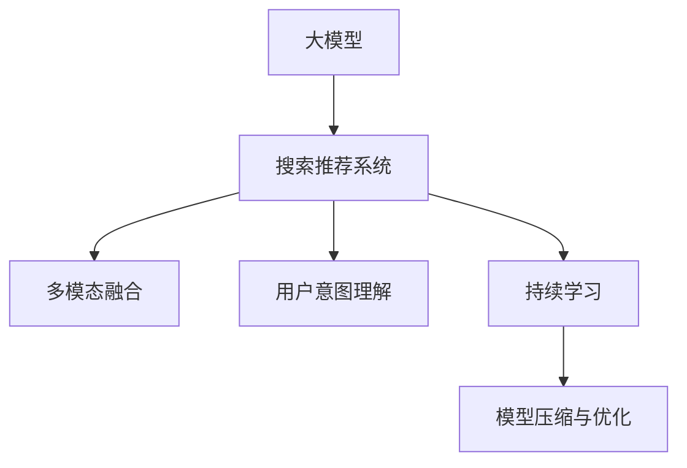

                 

# 搜索推荐系统的AI 大模型融合：电商平台的核心竞争优势与可持续发展

## 1. 背景介绍

### 1.1 问题由来

在数字化和智能化的大趋势下，电商平台正经历着一场深刻的变革。以阿里巴巴、京东、拼多多为代表的国内电商巨头，纷纷布局人工智能(AI)技术，通过智能推荐引擎，提升用户体验，增强平台粘性，驱动销售增长。AI 驱动的搜索推荐系统已经成为电商的核心竞争力之一，其性能和效果直接决定着平台的生存和发展。

搜索推荐系统的工作原理是通过分析用户历史行为数据，学习用户偏好，进而为用户提供个性化的搜索结果和推荐商品。传统的推荐系统多依赖于静态特征和统计方法，难以应对复杂多变的数据分布和用户需求。近年来，随着预训练语言模型（如BERT、GPT-3等）的兴起，越来越多的电商平台开始引入AI大模型，通过在电商领域的数据上进行微调，打造全新的搜索推荐引擎。

### 1.2 问题核心关键点

当前，基于大模型的电商搜索推荐系统的主要研究热点包括：

- **多模态数据融合**：通过融合文本、图像、语音等多模态数据，提升推荐的全面性和准确性。
- **用户意图理解**：借助大模型学习用户意图，提高推荐的针对性和相关性。
- **个性化推荐**：利用大模型进行个性化推荐，实现精准匹配。
- **动态学习和迭代**：采用持续学习的方式，实时更新模型，保持其时效性和适应性。
- **模型压缩与优化**：通过压缩与优化模型，提升推理速度和效率。

本文将系统地介绍AI大模型融合技术，探讨其在电商平台搜索推荐系统中的应用，并分析其未来发展趋势与面临的挑战。

## 2. 核心概念与联系

### 2.1 核心概念概述

为更好地理解AI大模型融合技术，本节将介绍几个密切相关的核心概念：

- **大模型**：如BERT、GPT等基于Transformer结构的预训练语言模型。通过在大规模文本数据上进行预训练，学习丰富的语言知识和特征。
- **搜索推荐系统**：基于用户历史行为数据，为用户推荐相关内容或商品的智能系统。
- **多模态融合**：通过融合文本、图像、语音等多种数据形式，丰富推荐信息，提升推荐效果。
- **用户意图理解**：通过大模型学习用户意图，提高推荐的个性化和相关性。
- **持续学习**：指模型能够持续从新数据中学习，同时保持已学习的知识，避免灾难性遗忘。
- **模型压缩与优化**：通过模型剪枝、量化等技术，优化模型参数，提升推理速度和效率。

这些概念之间的逻辑关系可以通过以下Mermaid流程图来展示：



这个流程图展示了大模型在电商搜索推荐系统中的应用路径：

1. 大模型通过预训练获得基础能力。
2. 融合多模态数据，提升推荐全面性。
3. 学习用户意图，提高推荐相关性和个性化。
4. 实时学习新数据，保持模型时效性。
5. 优化模型，提升推理速度和效率。

## 3. 核心算法原理 & 具体操作步骤

### 3.1 算法原理概述

基于大模型的电商搜索推荐系统，通过在大规模电商数据上进行预训练，学习用户行为和商品特征的表示。在用户查询时，通过多模态数据融合、用户意图理解等技术，提取查询意图和商品特征，计算相似度，生成推荐列表。其中，大模型的微调和融合是系统性能的关键。

形式化地，假设大模型为 $M_{\theta}$，其中 $\theta$ 为预训练得到的模型参数。电商搜索推荐系统的目标函数为：

$$
\max_{\theta} R(S=\{s_1,\dots,s_n\},M_{\theta}) = \sum_{s \in S} R(s,M_{\theta})
$$

其中 $S$ 为推荐商品集合，$R(s,M_{\theta})$ 为商品 $s$ 的推荐得分，可以通过向量相似度等方法计算。

### 3.2 算法步骤详解

基于大模型的电商搜索推荐系统一般包括以下几个关键步骤：

**Step 1: 准备预训练模型和数据集**
- 选择合适的预训练语言模型 $M_{\theta}$ 作为初始化参数，如 BERT、GPT等。
- 准备电商领域相关的数据集，包括用户行为数据、商品描述数据、图片数据等。

**Step 2: 添加任务适配层**
- 根据电商推荐任务，在预训练模型顶层设计合适的输出层和损失函数。
- 对于推荐评分任务，通常在顶层添加线性分类器和均方误差损失函数。
- 对于排序任务，通常使用交叉熵损失函数。

**Step 3: 设置微调超参数**
- 选择合适的优化算法及其参数，如 AdamW、SGD 等，设置学习率、批大小、迭代轮数等。
- 设置正则化技术及强度，包括权重衰减、Dropout、Early Stopping 等。
- 确定冻结预训练参数的策略，如仅微调顶层，或全部参数都参与微调。

**Step 4: 执行梯度训练**
- 将训练集数据分批次输入模型，前向传播计算损失函数。
- 反向传播计算参数梯度，根据设定的优化算法和学习率更新模型参数。
- 周期性在验证集上评估模型性能，根据性能指标决定是否触发 Early Stopping。
- 重复上述步骤直到满足预设的迭代轮数或 Early Stopping 条件。

**Step 5: 模型融合与优化**
- 结合多模态数据进行特征融合。
- 对模型输出进行后处理，如降维、归一化等。
- 根据电商领域特性，对模型进行参数剪枝和量化。
- 通过在线学习或增量学习，不断更新模型。

### 3.3 算法优缺点

基于大模型的电商搜索推荐系统具有以下优点：
1. 大幅提升推荐准确性和个性化。大模型可以学习复杂的用户行为和商品特征，提高推荐相关性和匹配度。
2. 减少数据标注成本。相比于传统方法，利用大模型微调，可以减少对标注数据的依赖。
3. 增强模型适应性。通过持续学习，保持模型时效性，应对数据分布变化。
4. 推动电商平台智能化升级。大模型融合技术可以快速部署，加速电商平台数字化转型。

同时，该方法也存在一定的局限性：
1. 模型规模大，推理复杂。大规模大模型虽然性能强，但推理复杂度较高，对计算资源要求高。
2. 数据隐私问题。电商数据涉及用户隐私，如何在保护隐私的前提下进行数据融合，是一个挑战。
3. 模型鲁棒性。大模型可能对输入噪声敏感，在电商推荐中，商品数据质量可能不一致。
4. 优化计算成本高。大模型的训练和微调成本高，且优化过程复杂。

尽管存在这些局限性，但就目前而言，基于大模型的电商推荐系统仍然是最为先进的技术范式。未来相关研究的重点在于如何进一步降低计算成本，提高模型鲁棒性，并解决数据隐私等伦理问题。

### 3.4 算法应用领域

基于大模型的电商搜索推荐系统在多个领域已经得到了广泛的应用：

- **电商推荐**：通过融合用户历史行为数据和商品特征，为用户推荐相关商品。
- **商品搜索**：利用多模态数据融合技术，提升商品搜索的准确性和多样性。
- **个性化广告**：通过用户意图理解，为用户推荐个性化的广告内容。
- **智能客服**：利用大模型进行对话理解和生成，提供智能客服支持。
- **供应链优化**：通过分析商品销售数据，优化供应链管理，提高库存周转率。
- **用户行为分析**：利用大模型学习用户行为模式，提高用户留存率。

除了上述这些经典应用外，大模型融合技术还被创新性地应用到更多场景中，如智能物流、市场分析、内容推荐等，为电商平台的发展提供了新的技术路径。

## 4. 数学模型和公式 & 详细讲解  
### 4.1 数学模型构建

本节将使用数学语言对基于大模型的电商推荐系统进行更加严格的刻画。

记大模型为 $M_{\theta}$，电商推荐任务为 $T$，用户行为数据为 $X=\{(x_i,y_i)\}_{i=1}^N$，其中 $x_i$ 为历史行为数据，$y_i$ 为商品评分或排序结果。定义模型 $M_{\theta}$ 在数据样本 $(x,y)$ 上的损失函数为 $\ell(M_{\theta}(x),y)$，则在数据集 $D$ 上的经验风险为：

$$
\mathcal{L}(\theta) = \frac{1}{N}\sum_{i=1}^N \ell(M_{\theta}(x_i),y_i)
$$

微调的优化目标是最小化经验风险，即找到最优参数：

$$
\theta^* = \mathop{\arg\min}_{\theta} \mathcal{L}(\theta)
$$

在实践中，我们通常使用基于梯度的优化算法（如SGD、Adam等）来近似求解上述最优化问题。设 $\eta$ 为学习率，$\lambda$ 为正则化系数，则参数的更新公式为：

$$
\theta \leftarrow \theta - \eta \nabla_{\theta}\mathcal{L}(\theta) - \eta\lambda\theta
$$

其中 $\nabla_{\theta}\mathcal{L}(\theta)$ 为损失函数对参数 $\theta$ 的梯度，可通过反向传播算法高效计算。

### 4.2 公式推导过程

以下我们以电商推荐评分任务为例，推导交叉熵损失函数及其梯度的计算公式。

假设模型 $M_{\theta}$ 在输入 $x$ 上的输出为 $\hat{y}=M_{\theta}(x) \in [0,1]$，表示商品 $x$ 被用户喜欢的概率。真实标签 $y \in \{0,1\}$。则二分类交叉熵损失函数定义为：

$$
\ell(M_{\theta}(x),y) = -[y\log \hat{y} + (1-y)\log (1-\hat{y})]
$$

将其代入经验风险公式，得：

$$
\mathcal{L}(\theta) = -\frac{1}{N}\sum_{i=1}^N [y_i\log M_{\theta}(x_i)+(1-y_i)\log(1-M_{\theta}(x_i))]
$$

根据链式法则，损失函数对参数 $\theta_k$ 的梯度为：

$$
\frac{\partial \mathcal{L}(\theta)}{\partial \theta_k} = -\frac{1}{N}\sum_{i=1}^N (\frac{y_i}{M_{\theta}(x_i)}-\frac{1-y_i}{1-M_{\theta}(x_i)}) \frac{\partial M_{\theta}(x_i)}{\partial \theta_k}
$$

其中 $\frac{\partial M_{\theta}(x_i)}{\partial \theta_k}$ 可进一步递归展开，利用自动微分技术完成计算。

在得到损失函数的梯度后，即可带入参数更新公式，完成模型的迭代优化。重复上述过程直至收敛，最终得到适应电商推荐任务的最优模型参数 $\theta^*$。

## 5. 项目实践：代码实例和详细解释说明
### 5.1 开发环境搭建

在进行电商推荐系统开发前，我们需要准备好开发环境。以下是使用Python进行PyTorch开发的环境配置流程：

1. 安装Anaconda：从官网下载并安装Anaconda，用于创建独立的Python环境。

2. 创建并激活虚拟环境：
```bash
conda create -n pytorch-env python=3.8 
conda activate pytorch-env
```

3. 安装PyTorch：根据CUDA版本，从官网获取对应的安装命令。例如：
```bash
conda install pytorch torchvision torchaudio cudatoolkit=11.1 -c pytorch -c conda-forge
```

4. 安装Transformers库：
```bash
pip install transformers
```

5. 安装各类工具包：
```bash
pip install numpy pandas scikit-learn matplotlib tqdm jupyter notebook ipython
```

完成上述步骤后，即可在`pytorch-env`环境中开始电商推荐系统开发。

### 5.2 源代码详细实现

这里我们以基于大模型的电商推荐评分系统为例，给出使用Transformers库进行微调的PyTorch代码实现。

首先，定义电商推荐评分任务的数据处理函数：

```python
from transformers import BertTokenizer
from torch.utils.data import Dataset
import torch

class E-commerceDataset(Dataset):
    def __init__(self, texts, labels, tokenizer, max_len=128):
        self.texts = texts
        self.labels = labels
        self.tokenizer = tokenizer
        self.max_len = max_len
        
    def __len__(self):
        return len(self.texts)
    
    def __getitem__(self, item):
        text = self.texts[item]
        label = self.labels[item]
        
        encoding = self.tokenizer(text, return_tensors='pt', max_length=self.max_len, padding='max_length', truncation=True)
        input_ids = encoding['input_ids'][0]
        attention_mask = encoding['attention_mask'][0]
        
        # 对token-wise的标签进行编码
        encoded_labels = [int(i) for i in label] 
        encoded_labels.extend([0] * (self.max_len - len(encoded_labels)))
        labels = torch.tensor(encoded_labels, dtype=torch.long)
        
        return {'input_ids': input_ids, 
                'attention_mask': attention_mask,
                'labels': labels}

# 定义标签与id的映射
label2id = {0:0, 1:1}

# 创建dataset
tokenizer = BertTokenizer.from_pretrained('bert-base-cased')

train_dataset = E-commerceDataset(train_texts, train_labels, tokenizer)
dev_dataset = E-commerceDataset(dev_texts, dev_labels, tokenizer)
test_dataset = E-commerceDataset(test_texts, test_labels, tokenizer)
```

然后，定义模型和优化器：

```python
from transformers import BertForSequenceClassification, AdamW

model = BertForSequenceClassification.from_pretrained('bert-base-cased', num_labels=2)

optimizer = AdamW(model.parameters(), lr=2e-5)
```

接着，定义训练和评估函数：

```python
from torch.utils.data import DataLoader
from tqdm import tqdm
from sklearn.metrics import classification_report

device = torch.device('cuda') if torch.cuda.is_available() else torch.device('cpu')
model.to(device)

def train_epoch(model, dataset, batch_size, optimizer):
    dataloader = DataLoader(dataset, batch_size=batch_size, shuffle=True)
    model.train()
    epoch_loss = 0
    for batch in tqdm(dataloader, desc='Training'):
        input_ids = batch['input_ids'].to(device)
        attention_mask = batch['attention_mask'].to(device)
        labels = batch['labels'].to(device)
        model.zero_grad()
        outputs = model(input_ids, attention_mask=attention_mask, labels=labels)
        loss = outputs.loss
        epoch_loss += loss.item()
        loss.backward()
        optimizer.step()
    return epoch_loss / len(dataloader)

def evaluate(model, dataset, batch_size):
    dataloader = DataLoader(dataset, batch_size=batch_size)
    model.eval()
    preds, labels = [], []
    with torch.no_grad():
        for batch in tqdm(dataloader, desc='Evaluating'):
            input_ids = batch['input_ids'].to(device)
            attention_mask = batch['attention_mask'].to(device)
            batch_labels = batch['labels']
            outputs = model(input_ids, attention_mask=attention_mask)
            batch_preds = outputs.logits.argmax(dim=2).to('cpu').tolist()
            batch_labels = batch_labels.to('cpu').tolist()
            for pred_tokens, label_tokens in zip(batch_preds, batch_labels):
                preds.append(pred_tokens)
                labels.append(label_tokens)
                
    print(classification_report(labels, preds))
```

最后，启动训练流程并在测试集上评估：

```python
epochs = 5
batch_size = 16

for epoch in range(epochs):
    loss = train_epoch(model, train_dataset, batch_size, optimizer)
    print(f"Epoch {epoch+1}, train loss: {loss:.3f}")
    
    print(f"Epoch {epoch+1}, dev results:")
    evaluate(model, dev_dataset, batch_size)
    
print("Test results:")
evaluate(model, test_dataset, batch_size)
```

以上就是使用PyTorch对BERT进行电商推荐评分任务微调的完整代码实现。可以看到，得益于Transformers库的强大封装，我们可以用相对简洁的代码完成BERT模型的加载和微调。

### 5.3 代码解读与分析

让我们再详细解读一下关键代码的实现细节：

**E-commerceDataset类**：
- `__init__`方法：初始化文本、标签、分词器等关键组件。
- `__len__`方法：返回数据集的样本数量。
- `__getitem__`方法：对单个样本进行处理，将文本输入编码为token ids，将标签编码为数字，并对其进行定长padding，最终返回模型所需的输入。

**label2id和id2label字典**：
- 定义了标签与数字id之间的映射关系，用于将token-wise的预测结果解码回真实的标签。

**训练和评估函数**：
- 使用PyTorch的DataLoader对数据集进行批次化加载，供模型训练和推理使用。
- 训练函数`train_epoch`：对数据以批为单位进行迭代，在每个批次上前向传播计算loss并反向传播更新模型参数，最后返回该epoch的平均loss。
- 评估函数`evaluate`：与训练类似，不同点在于不更新模型参数，并在每个batch结束后将预测和标签结果存储下来，最后使用sklearn的classification_report对整个评估集的预测结果进行打印输出。

**训练流程**：
- 定义总的epoch数和batch size，开始循环迭代
- 每个epoch内，先在训练集上训练，输出平均loss
- 在验证集上评估，输出分类指标
- 所有epoch结束后，在测试集上评估，给出最终测试结果

可以看到，PyTorch配合Transformers库使得BERT微调的代码实现变得简洁高效。开发者可以将更多精力放在数据处理、模型改进等高层逻辑上，而不必过多关注底层的实现细节。

当然，工业级的系统实现还需考虑更多因素，如模型的保存和部署、超参数的自动搜索、更灵活的任务适配层等。但核心的微调范式基本与此类似。

## 6. 实际应用场景
### 6.1 智能推荐系统

基于大模型的电商搜索推荐系统，可以应用于智能推荐系统的构建。传统的推荐系统依赖于静态特征和统计方法，难以应对复杂多变的数据分布和用户需求。而大模型融合技术，可以通过学习电商领域的上下文信息，为用户推荐更加精准的商品。

在技术实现上，可以收集用户浏览、点击、评价等行为数据，提取和商品交互的文本信息。将文本数据作为模型输入，通过大模型微调获得用户意图的表示。在推荐时，结合商品特征和用户意图的表示，进行相关性计算，生成推荐列表。如此构建的智能推荐系统，能大幅提升推荐的精准性和个性化程度，提升用户体验和平台粘性。

### 6.2 用户行为分析

电商搜索推荐系统可以进一步用于用户行为分析。通过分析用户浏览、点击、购买等行为数据，可以挖掘用户的兴趣偏好和消费模式。结合大模型的用户意图理解能力，可以提升用户分群和画像的精准度，为个性化营销提供有力支撑。

具体而言，可以通过大模型学习用户意图的语义表示，与行为数据进行联合建模，提取用户行为中的语义特征。利用这些特征，对用户进行聚类和细分，形成更具个性化、精准的用户画像，为电商营销提供精准定向。

### 6.3 智能客服

智能客服是电商平台的另一个重要应用。通过结合电商领域的语料，对大模型进行微调，可以构建智能客服系统，解答用户咨询。该系统可以实时理解用户查询，匹配最佳回答，提供快速响应。

在实践上，可以收集用户咨询数据，构建基于大模型的对话生成模型。在用户提出咨询时，通过输入用户查询，系统能够自动生成最合适的回复，提升客服效率和用户体验。

### 6.4 未来应用展望

随着大模型融合技术的不断发展，其在电商平台的搜索推荐系统中的应用前景将更加广阔。

未来，大模型融合技术将进一步拓展到更多场景中，如商品图片处理、语音识别、智能家居等。多模态数据的融合将提升推荐系统的全面性和准确性，增强用户体验。

在大模型融合过程中，将涌现更多前沿技术，如元学习、自监督学习、跨模态学习等，提升推荐的智能性和鲁棒性。

此外，随着数据隐私和安全问题的凸显，未来的电商推荐系统将更加注重用户隐私保护和数据安全，采用隐私保护技术如差分隐私、联邦学习等，确保数据安全和用户隐私。

总之，大模型融合技术将为电商平台的智能化转型提供强大动力，推动电商平台向更加个性化、智能化的方向发展。相信在未来的电商领域，大模型融合技术将发挥更大的作用，为电商用户带来更加精准、便捷的购物体验。

## 7. 工具和资源推荐
### 7.1 学习资源推荐

为了帮助开发者系统掌握大模型融合技术的理论基础和实践技巧，这里推荐一些优质的学习资源：

1. 《深度学习入门》系列博文：由大模型技术专家撰写，深入浅出地介绍了深度学习的基本概念和算法，适合初学者入门。

2. 《Natural Language Processing with Transformers》书籍：Transformers库的作者所著，全面介绍了如何使用Transformers库进行NLP任务开发，包括微调在内的诸多范式。

3. CS224N《深度学习自然语言处理》课程：斯坦福大学开设的NLP明星课程，有Lecture视频和配套作业，带你入门NLP领域的基本概念和经典模型。

4. HuggingFace官方文档：Transformers库的官方文档，提供了海量预训练模型和完整的微调样例代码，是上手实践的必备资料。

5. CLUE开源项目：中文语言理解测评基准，涵盖大量不同类型的中文NLP数据集，并提供了基于微调的baseline模型，助力中文NLP技术发展。

通过对这些资源的学习实践，相信你一定能够快速掌握大模型融合技术的精髓，并用于解决实际的NLP问题。
###  7.2 开发工具推荐

高效的开发离不开优秀的工具支持。以下是几款用于大模型融合开发的常用工具：

1. PyTorch：基于Python的开源深度学习框架，灵活动态的计算图，适合快速迭代研究。大部分预训练语言模型都有PyTorch版本的实现。

2. TensorFlow：由Google主导开发的开源深度学习框架，生产部署方便，适合大规模工程应用。同样有丰富的预训练语言模型资源。

3. Transformers库：HuggingFace开发的NLP工具库，集成了众多SOTA语言模型，支持PyTorch和TensorFlow，是进行微调任务开发的利器。

4. Weights & Biases：模型训练的实验跟踪工具，可以记录和可视化模型训练过程中的各项指标，方便对比和调优。与主流深度学习框架无缝集成。

5. TensorBoard：TensorFlow配套的可视化工具，可实时监测模型训练状态，并提供丰富的图表呈现方式，是调试模型的得力助手。

6. Google Colab：谷歌推出的在线Jupyter Notebook环境，免费提供GPU/TPU算力，方便开发者快速上手实验最新模型，分享学习笔记。

合理利用这些工具，可以显著提升大模型融合任务的开发效率，加快创新迭代的步伐。

### 7.3 相关论文推荐

大模型融合技术的发展源于学界的持续研究。以下是几篇奠基性的相关论文，推荐阅读：

1. Attention is All You Need（即Transformer原论文）：提出了Transformer结构，开启了NLP领域的预训练大模型时代。

2. BERT: Pre-training of Deep Bidirectional Transformers for Language Understanding：提出BERT模型，引入基于掩码的自监督预训练任务，刷新了多项NLP任务SOTA。

3. Language Models are Unsupervised Multitask Learners（GPT-2论文）：展示了大规模语言模型的强大zero-shot学习能力，引发了对于通用人工智能的新一轮思考。

4. Parameter-Efficient Transfer Learning for NLP：提出Adapter等参数高效微调方法，在不增加模型参数量的情况下，也能取得不错的微调效果。

5. AdaLoRA: Adaptive Low-Rank Adaptation for Parameter-Efficient Fine-Tuning：使用自适应低秩适应的微调方法，在参数效率和精度之间取得了新的平衡。

这些论文代表了大模型融合技术的发展脉络。通过学习这些前沿成果，可以帮助研究者把握学科前进方向，激发更多的创新灵感。

## 8. 总结：未来发展趋势与挑战

### 8.1 总结

本文对基于大模型的电商搜索推荐系统进行了全面系统的介绍。首先阐述了大模型和融合技术的研究背景和意义，明确了其在电商平台搜索推荐系统中的应用价值。其次，从原理到实践，详细讲解了融合技术的数学原理和关键步骤，给出了电商推荐评分系统的完整代码实例。同时，本文还广泛探讨了融合技术在智能推荐、用户行为分析、智能客服等多个电商领域的应用前景，展示了融合技术的巨大潜力。此外，本文精选了融合技术的各类学习资源，力求为读者提供全方位的技术指引。

通过本文的系统梳理，可以看到，基于大模型的电商搜索推荐系统已经成为电商平台的必备核心技术，其性能和效果直接决定着平台的生存和发展。未来，随着大模型融合技术的不断发展，电商平台的智能化转型将迎来新的飞跃。

### 8.2 未来发展趋势

展望未来，大模型融合技术将呈现以下几个发展趋势：

1. **多模态数据融合**：电商推荐系统将更加注重多模态数据的融合，利用图像、语音等多模态信息提升推荐效果。

2. **用户意图理解**：大模型融合技术将进一步提升用户意图理解的准确性，实现更加个性化的推荐。

3. **实时学习**：通过在线学习或增量学习，大模型推荐系统将具备实时更新的能力，保持模型时效性。

4. **模型压缩与优化**：大模型推荐系统将更加注重模型的压缩与优化，提升推理速度和效率。

5. **隐私保护**：随着数据隐私和安全问题的凸显，大模型推荐系统将更加注重用户隐私保护，采用隐私保护技术如差分隐私、联邦学习等。

6. **跨模态学习**：大模型推荐系统将更加注重跨模态学习，提升不同模态数据之间的协同建模能力。

7. **元学习**：利用元学习技术，大模型推荐系统将具备适应新任务和新领域的能力，提升模型的泛化性和鲁棒性。

以上趋势凸显了大模型融合技术的广阔前景。这些方向的探索发展，必将进一步提升电商平台的智能化水平，推动电商平台向更加个性化、智能化的方向发展。

### 8.3 面临的挑战

尽管大模型融合技术已经取得了瞩目成就，但在迈向更加智能化、普适化应用的过程中，它仍面临着诸多挑战：

1. **计算成本高**：大模型的训练和微调成本高，且优化过程复杂。

2. **模型鲁棒性不足**：电商数据质量可能不一致，大模型推荐系统对输入噪声敏感。

3. **数据隐私问题**：电商数据涉及用户隐私，如何在保护隐私的前提下进行数据融合，是一个挑战。

4. **超参数调优**：大模型推荐系统需要调优的超参数众多，且调整过程复杂。

5. **实时性问题**：大模型推荐系统需要实时更新模型，以保证推荐的实时性和准确性。

6. **跨模态数据对齐**：不同模态数据之间的特征表示差异大，难以进行有效对齐。

7. **模型可解释性不足**：大模型推荐系统的决策过程缺乏可解释性，难以对其推理逻辑进行分析和调试。

8. **动态数据处理**：电商推荐系统需要实时处理动态数据，保证推荐的实时性和准确性。

尽管存在这些挑战，但就目前而言，基于大模型的电商推荐系统仍然是最为先进的技术范式。未来相关研究的重点在于如何进一步降低计算成本，提高模型鲁棒性，并解决数据隐私等伦理问题。

### 8.4 研究展望

面对大模型融合技术所面临的种种挑战，未来的研究需要在以下几个方面寻求新的突破：

1. **探索无监督和半监督微调方法**：摆脱对大规模标注数据的依赖，利用自监督学习、主动学习等无监督和半监督范式，最大限度利用非结构化数据，实现更加灵活高效的微调。

2. **研究参数高效和计算高效的微调范式**：开发更加参数高效的微调方法，在固定大部分预训练参数的同时，只更新极少量的任务相关参数。同时优化微调模型的计算图，减少前向传播和反向传播的资源消耗，实现更加轻量级、实时性的部署。

3. **融合因果和对比学习范式**：通过引入因果推断和对比学习思想，增强大模型推荐系统的因果关系建立能力，学习更加普适、鲁棒的语言表征，从而提升推荐泛化性和抗干扰能力。

4. **引入更多先验知识**：将符号化的先验知识，如知识图谱、逻辑规则等，与神经网络模型进行巧妙融合，引导大模型推荐过程学习更准确、合理的语言模型。同时加强不同模态数据的整合，实现视觉、语音等多模态信息与文本信息的协同建模。

5. **结合因果分析和博弈论工具**：将因果分析方法引入大模型推荐系统，识别出模型决策的关键特征，增强输出解释的因果性和逻辑性。借助博弈论工具刻画人机交互过程，主动探索并规避模型的脆弱点，提高系统稳定性。

6. **纳入伦理道德约束**：在模型训练目标中引入伦理导向的评估指标，过滤和惩罚有偏见、有害的输出倾向。同时加强人工干预和审核，建立模型行为的监管机制，确保输出符合人类价值观和伦理道德。

这些研究方向的探索，必将引领大模型融合技术迈向更高的台阶，为构建安全、可靠、可解释、可控的智能系统铺平道路。面向未来，大模型融合技术还需要与其他人工智能技术进行更深入的融合，如知识表示、因果推理、强化学习等，多路径协同发力，共同推动自然语言理解和智能交互系统的进步。只有勇于创新、敢于突破，才能不断拓展语言模型的边界，让智能技术更好地造福人类社会。

## 9. 附录：常见问题与解答

**Q1：大模型融合是否适用于所有电商推荐场景？**

A: 大模型融合在大多数电商推荐场景上都能取得不错的效果，特别是对于数据量较小的任务。但对于一些特定领域的任务，如金融、教育等，由于其领域特性，可能需要进一步在特定领域语料上预训练，再进行微调，才能获得理想效果。此外，对于一些需要时效性、个性化很强的任务，如实时推荐、个性化广告等，微调方法也需要针对性的改进优化。

**Q2：如何缓解大模型融合过程中的过拟合问题？**

A: 过拟合是大模型推荐系统面临的主要挑战之一，尤其是在标注数据不足的情况下。常见的缓解策略包括：
1. 数据增强：通过回译、近义替换等方式扩充训练集
2. 正则化：使用L2正则、Dropout、Early Stopping等避免过拟合
3. 对抗训练：引入对抗样本，提高模型鲁棒性
4. 参数高效微调：只调整少量参数(如Adapter、Prefix等)，减小过拟合风险
5. 多模型集成：训练多个微调模型，取平均输出，抑制过拟合

这些策略往往需要根据具体任务和数据特点进行灵活组合。只有在数据、模型、训练、推理等各环节进行全面优化，才能最大限度地发挥大模型融合的威力。

**Q3：大模型融合在电商推荐中的计算成本高如何缓解？**

A: 大模型的训练和微调成本高，且优化过程复杂。为了缓解计算成本，可以考虑以下几点：
1. 模型裁剪：去除不必要的层和参数，减小模型尺寸，加快推理速度
2. 量化加速：将浮点模型转为定点模型，压缩存储空间，提高计算效率
3. 分布式训练：利用分布式计算资源，加速模型训练
4. 增量学习：通过在线学习或增量学习，实时更新模型，减少训练时间

合理利用这些优化技术，可以在保证模型性能的同时，显著降低计算成本。

**Q4：大模型推荐系统在电商推荐中的实时性问题如何解决？**

A: 大模型推荐系统需要实时更新模型，以保证推荐的实时性和准确性。为了解决实时性问题，可以考虑以下几点：
1. 在线学习：通过在线学习，实时更新模型参数，保证推荐的实时性。
2. 增量学习：利用增量学习技术，在原有模型基础上，实时更新小批量数据，避免全量训练。
3. 模型微调策略：通过微调策略，在推理时只更新小部分模型参数，减小计算负担。

合理利用这些技术，可以在保证推荐效果的同时，提高大模型推荐系统的实时性。

**Q5：大模型推荐系统如何保护用户隐私？**

A: 电商推荐系统需要保护用户隐私，特别是在用户行为数据涉及个人隐私的情况下。为了保护用户隐私，可以考虑以下几点：
1. 差分隐私：在数据收集和处理过程中，采用差分隐私技术，确保用户隐私不被泄露。
2. 联邦学习：在分布式环境下，采用联邦学习技术，将数据和模型在本地训练，不暴露敏感数据。
3. 数据匿名化：在数据收集和处理过程中，对数据进行匿名化处理，确保用户隐私不被泄露。

合理利用这些隐私保护技术，可以在保证模型性能的同时，保护用户隐私。

---

作者：禅与计算机程序设计艺术 / Zen and the Art of Computer Programming

