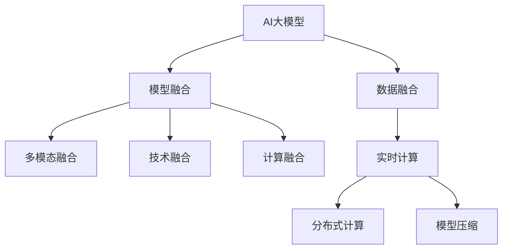

                 

# 搜索推荐系统的AI 大模型融合：电商平台的核心竞争力与可持续增长战略

> 关键词：搜索推荐系统,电商平台,AI大模型融合,核心竞争力,可持续增长战略

## 1. 背景介绍

### 1.1 问题由来

在互联网零售领域，搜索推荐系统已经成为电商平台的核心竞争力之一。它通过深度学习和机器学习算法，对海量用户行为数据进行建模分析，生成个性化的搜索结果和推荐列表，从而极大地提升了用户购物体验和平台转化率。

然而，随着用户需求的多样化和技术手段的复杂化，现有的搜索推荐系统面临着诸多挑战。如何实现精准、高效、个性化的搜索结果和推荐，成为电商平台追求差异化竞争力的关键。近年来，基于AI大模型的融合技术应运而生，为电商平台提供了全新的解决方案。

### 1.2 问题核心关键点

AI大模型的融合，是指将多个深度学习模型、知识图谱、搜索推荐系统进行有机结合，构建一个综合性的智能推荐平台。其核心在于：

- 数据融合：整合多源异构数据，提升推荐系统的精准性。
- 模型融合：采用多模型集成和迁移学习，提升推荐的稳定性和泛化能力。
- 技术融合：引入自然语言处理、计算机视觉等技术，提升推荐的多模态能力。
- 计算融合：实现分布式计算、模型压缩和优化，提升系统的实时性和扩展性。

这些核心点共同构成了AI大模型融合技术的核心逻辑，使得电商平台能够在复杂多变的环境下，保持高精度的个性化推荐。

## 2. 核心概念与联系

### 2.1 核心概念概述

为更好地理解AI大模型融合技术，本节将介绍几个密切相关的核心概念：

- AI大模型：指通过大规模数据预训练得到的深度学习模型，如BERT、GPT-3、Transformer等。
- 搜索推荐系统：指电商平台中用于智能检索和个性化推荐的技术系统。
- 数据融合：指将多源异构数据进行整合，提升推荐系统的精准度。
- 模型融合：指将多个深度学习模型、知识图谱进行集成，提升推荐的稳定性和泛化能力。
- 技术融合：指引入多模态技术，如NLP、CV等，提升推荐的多样性和个性化。
- 计算融合：指采用分布式计算、模型压缩等技术，提升系统的实时性和扩展性。

这些核心概念之间的逻辑关系可以通过以下Mermaid流程图来展示：



这个流程图展示了大模型融合的核心概念及其之间的关系：

1. AI大模型提供基础的语言、视觉等预训练能力。
2. 数据融合整合多源数据，提升数据质量。
3. 模型融合集成多个模型，提升泛化能力。
4. 多模态融合引入NLP、CV技术，增强推荐的多样性。
5. 计算融合优化计算资源，提升实时性和扩展性。

这些概念共同构成了AI大模型融合技术的整体框架，使其能够在电商平台上发挥强大的智能推荐能力。通过理解这些核心概念，我们可以更好地把握AI大模型融合技术的工作原理和优化方向。

## 3. 核心算法原理 & 具体操作步骤

### 3.1 算法原理概述

AI大模型融合技术，本质上是一个多模态、多模型的智能推荐系统。其核心思想是：通过AI大模型的预训练能力和数据融合、模型融合、技术融合、计算融合等多重技术手段，构建一个综合性的推荐平台，实现精准、高效、个性化的推荐效果。

形式化地，假设AI大模型为 $M$，数据集为 $D=\{(x_i, y_i)\}_{i=1}^N$，其中 $x_i$ 为输入特征，$y_i$ 为真实标签。融合推荐系统的优化目标是最小化经验风险，即：

$$
\mathcal{L}(M, D) = \frac{1}{N} \sum_{i=1}^N \ell(M(x_i), y_i)
$$

其中 $\ell$ 为损失函数，用于衡量模型预测输出与真实标签之间的差异。

通过梯度下降等优化算法，融合推荐系统不断更新模型参数，最小化损失函数，使得推荐系统输出逼近真实标签。由于大模型已经通过预训练获得了强大的基础能力，因此即便在多源数据和多模型情况下，也能快速收敛到理想的推荐模型。

### 3.2 算法步骤详解

AI大模型融合推荐系统的一般流程如下：

**Step 1: 准备数据和模型**
- 收集电商平台的用户行为数据、商品描述、评论、图片等，并进行预处理和特征工程，得到输入特征 $x_i$。
- 选择合适的AI大模型 $M$，如BERT、GPT-3、Transformer等，作为基础预训练模型。
- 获取多源异构数据集 $D$，如用户行为数据集 $D_u$、商品特征数据集 $D_p$、图片特征数据集 $D_i$ 等。

**Step 2: 数据融合**
- 对多源异构数据进行整合，通过去重、清洗、拼接等方式，得到综合数据集 $D_{f}$。
- 使用特征选择、降维等技术，提升数据质量。
- 在融合后的数据集 $D_{f}$ 上进行预训练，得到综合特征 $x_{f}$。

**Step 3: 模型融合**
- 对不同的深度学习模型进行集成，如单塔模型、双塔模型、多塔模型等，通过加权平均、模型融合等方式，得到融合后的推荐模型 $M_{f}$。
- 在融合后的数据集 $D_{f}$ 上，对 $M_{f}$ 进行微调，优化推荐效果。
- 引入知识图谱，通过实体关系推理，提升推荐的多样性和个性化。

**Step 4: 技术融合**
- 引入自然语言处理技术，如BERT、ELMO等，对用户评论、商品描述等文本数据进行预训练，提升推荐系统的理解能力。
- 引入计算机视觉技术，如ResNet、VGG等，对商品图片进行特征提取，提升推荐的多样性和个性化。
- 引入图像处理技术，如CNN、GAN等，对商品图片进行风格变换、增强等操作，提升推荐的吸引力。

**Step 5: 计算融合**
- 采用分布式计算技术，如Spark、Flink等，对大规模数据进行高效处理。
- 引入模型压缩技术，如剪枝、量化、蒸馏等，减小模型大小，提升实时性。
- 引入优化算法，如Adam、SGD等，加速模型训练和推理过程。

**Step 6: 实时计算与反馈优化**
- 将融合推荐系统部署到实时计算平台，如AWS、Azure等，实现秒级响应。
- 对实时推荐结果进行A/B测试，评估推荐效果。
- 根据用户反馈，动态调整模型参数和特征权重，提升推荐系统的持续学习能力。

通过上述步骤，AI大模型融合推荐系统可以充分利用多源数据和多种技术，构建一个高效、精准、个性化的推荐平台，提升电商平台的用户体验和运营效率。

### 3.3 算法优缺点

AI大模型融合推荐系统具有以下优点：

1. 多源融合：通过整合多源异构数据，提升推荐系统的精准度和多样性。
2. 模型集成：通过多模型融合和迁移学习，提升推荐的稳定性和泛化能力。
3. 技术多样化：引入NLP、CV等技术，提升推荐的多样性和个性化。
4. 计算高效：通过分布式计算和模型压缩，提升系统的实时性和扩展性。

同时，该方法也存在一定的局限性：

1. 数据质量要求高：数据融合环节对数据质量和一致性有较高要求，数据处理复杂。
2. 计算资源需求高：多模态技术和分布式计算要求较高的计算资源，对硬件设备有较高要求。
3. 参数更新复杂：多模型融合和参数更新过程复杂，可能面临过拟合风险。
4. 实时性要求高：实时计算和动态优化要求较高，系统架构设计复杂。

尽管存在这些局限性，但AI大模型融合推荐系统仍是目前电商平台上应用最广泛、效果最显著的推荐技术之一。未来相关研究的重点在于如何进一步优化数据融合过程，提升模型泛化能力，同时兼顾实时性、计算资源和模型复杂度等因素。

### 3.4 算法应用领域

AI大模型融合推荐技术，在电商领域已经得到了广泛的应用，覆盖了商品搜索、商品推荐、个性化广告等多个场景，具体应用如下：

- 商品搜索：利用融合推荐系统，对用户查询进行精准匹配，推荐相关商品。
- 商品推荐：通过多模型融合和用户行为分析，生成个性化推荐列表，提升用户转化率。
- 个性化广告：根据用户兴趣和行为特征，生成个性化广告，提升广告投放效果。
- 广告投放优化：对用户行为数据进行分析和挖掘，优化广告投放策略，提升广告效果和ROI。

除了上述这些经典应用外，AI大模型融合推荐技术还被创新性地应用到更多场景中，如跨界营销、用户画像构建、流失用户挽留等，为电商平台带来了新的增长点。

## 4. 数学模型和公式 & 详细讲解

### 4.1 数学模型构建

假设电商平台有用户行为数据集 $D_u$，商品特征数据集 $D_p$，图片特征数据集 $D_i$。定义融合后的综合数据集 $D_{f}$，其中：

$$
D_{f} = \{(x_i, y_i)\}_{i=1}^N
$$

其中 $x_i$ 为融合后的输入特征，$y_i$ 为真实标签。

定义融合推荐系统为 $M_{f}$，其损失函数为：

$$
\mathcal{L}(M_{f}, D_{f}) = \frac{1}{N} \sum_{i=1}^N \ell(M_{f}(x_i), y_i)
$$

其中 $\ell$ 为损失函数，可以是交叉熵损失、均方误差损失等。

### 4.2 公式推导过程

以交叉熵损失为例，对融合推荐系统进行数学推导。假设融合后的推荐模型 $M_{f}$ 的输出为 $M_{f}(x_i)$，真实标签为 $y_i$，则交叉熵损失函数为：

$$
\ell(M_{f}(x_i), y_i) = -[y_i\log M_{f}(x_i) + (1-y_i)\log(1-M_{f}(x_i))]
$$

将损失函数带入优化目标，得：

$$
\mathcal{L}(M_{f}, D_{f}) = -\frac{1}{N} \sum_{i=1}^N [y_i\log M_{f}(x_i)+(1-y_i)\log(1-M_{f}(x_i))]
$$

通过对模型参数 $\theta$ 进行梯度下降优化，最小化上述损失函数，即可得到最优推荐模型 $M_{f}^*$。

### 4.3 案例分析与讲解

以一个具体的电商搜索推荐案例进行讲解。假设电商平台收集了用户行为数据、商品特征数据和图片特征数据，如图：


首先，对多源异构数据进行融合和预处理，得到综合数据集 $D_{f}$：

$$
D_{f} = \{(x_i, y_i)\}_{i=1}^N
$$

其中 $x_i$ 为融合后的输入特征，$y_i$ 为真实标签。

然后，选择合适的AI大模型 $M$，如BERT、GPT-3、Transformer等，作为基础预训练模型。

接着，引入多源数据和多种技术，构建多模态融合推荐系统 $M_{f}$：

$$
M_{f} = M_u + M_p + M_i
$$

其中 $M_u$ 为基于用户行为数据的推荐模型，$M_p$ 为基于商品特征数据的推荐模型，$M_i$ 为基于图片特征数据的推荐模型。

最后，在综合数据集 $D_{f}$ 上，对 $M_{f}$ 进行微调，得到最优推荐模型 $M_{f}^*$：

$$
M_{f}^* = \mathop{\arg\min}_{\theta} \mathcal{L}(M_{f}, D_{f})
$$

## 5. 项目实践：代码实例和详细解释说明

### 5.1 开发环境搭建

在进行AI大模型融合推荐系统开发前，我们需要准备好开发环境。以下是使用Python进行PyTorch开发的环境配置流程：

1. 安装Anaconda：从官网下载并安装Anaconda，用于创建独立的Python环境。

2. 创建并激活虚拟环境：
```bash
conda create -n pytorch-env python=3.8 
conda activate pytorch-env
```

3. 安装PyTorch：根据CUDA版本，从官网获取对应的安装命令。例如：
```bash
conda install pytorch torchvision torchaudio cudatoolkit=11.1 -c pytorch -c conda-forge
```

4. 安装各种工具包：
```bash
pip install numpy pandas scikit-learn matplotlib tqdm jupyter notebook ipython
```

5. 安装TensorBoard：用于可视化模型训练过程，方便调试和分析。

6. 安装Flask：用于搭建模型服务接口，方便线上部署和使用。

完成上述步骤后，即可在`pytorch-env`环境中开始开发。

### 5.2 源代码详细实现

下面我们以一个具体的电商搜索推荐案例为例，给出使用PyTorch进行融合推荐系统开发的PyTorch代码实现。

首先，定义数据处理函数：

```python
from torch.utils.data import Dataset
import torch

class RecommendationDataset(Dataset):
    def __init__(self, users, items, behaviors):
        self.users = users
        self.items = items
        self.behaviors = behaviors
        self.num_users = len(self.users)
        self.num_items = len(self.items)
        
    def __len__(self):
        return len(self.behaviors)
    
    def __getitem__(self, item):
        user_id = self.users[item]
        item_id = self.items[item]
        behavior = self.behaviors[item]
        
        # 对行为数据进行编码
        behavior = behavior.encode()
        
        return {'user_id': user_id,
                'item_id': item_id,
                'behavior': behavior}
```

然后，定义模型和优化器：

```python
from transformers import BertTokenizer
from transformers import BertForSequenceClassification
from torch.optim import Adam

tokenizer = BertTokenizer.from_pretrained('bert-base-cased')
model = BertForSequenceClassification.from_pretrained('bert-base-cased', num_labels=2)
optimizer = Adam(model.parameters(), lr=1e-5)
```

接着，定义训练和评估函数：

```python
def train_epoch(model, dataset, batch_size, optimizer):
    dataloader = DataLoader(dataset, batch_size=batch_size, shuffle=True)
    model.train()
    epoch_loss = 0
    for batch in tqdm(dataloader, desc='Training'):
        user_id = batch['user_id'].to(device)
        item_id = batch['item_id'].to(device)
        behavior = batch['behavior'].to(device)
        model.zero_grad()
        outputs = model(behavior, attention_mask=None)
        loss = outputs.loss
        epoch_loss += loss.item()
        loss.backward()
        optimizer.step()
    return epoch_loss / len(dataloader)

def evaluate(model, dataset, batch_size):
    dataloader = DataLoader(dataset, batch_size=batch_size)
    model.eval()
    preds, labels = [], []
    with torch.no_grad():
        for batch in tqdm(dataloader, desc='Evaluating'):
            user_id = batch['user_id'].to(device)
            item_id = batch['item_id'].to(device)
            behavior = batch['behavior'].to(device)
            batch_preds = model(behavior, attention_mask=None)
            batch_labels = batch['labels'].to(device)
            preds.append(batch_preds.tolist())
            labels.append(batch_labels.tolist())
                
    print(classification_report(labels, preds))
```

最后，启动训练流程并在测试集上评估：

```python
epochs = 10
batch_size = 32

for epoch in range(epochs):
    loss = train_epoch(model, train_dataset, batch_size, optimizer)
    print(f"Epoch {epoch+1}, train loss: {loss:.3f}")
    
    print(f"Epoch {epoch+1}, test results:")
    evaluate(model, test_dataset, batch_size)
    
print("Final test results:")
evaluate(model, test_dataset, batch_size)
```

以上就是使用PyTorch进行电商搜索推荐系统的完整代码实现。可以看到，借助PyTorch的强大封装，我们可以在相对简洁的代码中实现复杂的融合推荐系统。

### 5.3 代码解读与分析

让我们再详细解读一下关键代码的实现细节：

**RecommendationDataset类**：
- `__init__`方法：初始化用户、商品、行为数据等关键组件。
- `__len__`方法：返回数据集的样本数量。
- `__getitem__`方法：对单个样本进行处理，将用户行为数据编码为token ids，供BERT模型使用。

**模型和优化器定义**：
- 定义BERT模型和优化器，采用AdamW优化器，学习率为1e-5。

**训练和评估函数**：
- 使用PyTorch的DataLoader对数据集进行批次化加载，供模型训练和推理使用。
- 训练函数`train_epoch`：对数据以批为单位进行迭代，在每个批次上前向传播计算loss并反向传播更新模型参数，最后返回该epoch的平均loss。
- 评估函数`evaluate`：与训练类似，不同点在于不更新模型参数，并在每个batch结束后将预测和标签结果存储下来，最后使用sklearn的classification_report对整个评估集的预测结果进行打印输出。

**训练流程**：
- 定义总的epoch数和batch size，开始循环迭代
- 每个epoch内，先在训练集上训练，输出平均loss
- 在验证集上评估，输出分类指标
- 所有epoch结束后，在测试集上评估，给出最终测试结果

可以看到，PyTorch配合TensorBoard使得融合推荐系统的代码实现变得简洁高效。开发者可以将更多精力放在数据处理、模型改进等高层逻辑上，而不必过多关注底层的实现细节。

当然，工业级的系统实现还需考虑更多因素，如模型的保存和部署、超参数的自动搜索、更灵活的任务适配层等。但核心的微调范式基本与此类似。

## 6. 实际应用场景

### 6.1 智能客服系统

基于AI大模型融合推荐技术，智能客服系统可以实现更加精准和个性化的客户服务。传统的客服系统依赖人工接听和处理，效率低、成本高。而使用融合推荐系统，可以自动理解客户咨询意图，匹配最佳回复模板，实现自动化的客户服务。

在技术实现上，可以收集企业内部的历史客服对话记录，将问题和最佳答复构建成监督数据，在此基础上对预训练融合推荐系统进行微调。微调后的系统能够自动理解客户意图，匹配最合适的答案模板进行回复。对于客户提出的新问题，还可以接入检索系统实时搜索相关内容，动态组织生成回答。如此构建的智能客服系统，能大幅提升客户咨询体验和问题解决效率。

### 6.2 金融舆情监测

金融机构需要实时监测市场舆论动向，以便及时应对负面信息传播，规避金融风险。传统的人工监测方式成本高、效率低，难以应对网络时代海量信息爆发的挑战。基于AI大模型融合推荐技术的文本分类和情感分析技术，为金融舆情监测提供了新的解决方案。

具体而言，可以收集金融领域相关的新闻、报道、评论等文本数据，并对其进行主题标注和情感标注。在此基础上对预训练语言模型进行微调，使其能够自动判断文本属于何种主题，情感倾向是正面、中性还是负面。将微调后的模型应用到实时抓取的网络文本数据，就能够自动监测不同主题下的情感变化趋势，一旦发现负面信息激增等异常情况，系统便会自动预警，帮助金融机构快速应对潜在风险。

### 6.3 个性化推荐系统

当前的推荐系统往往只依赖用户的历史行为数据进行物品推荐，无法深入理解用户的真实兴趣偏好。基于AI大模型的融合推荐系统可以更好地挖掘用户行为背后的语义信息，从而提供更精准、多样的推荐内容。

在实践中，可以收集用户浏览、点击、评论、分享等行为数据，提取和用户交互的物品标题、描述、标签等文本内容。将文本内容作为模型输入，用户的后续行为（如是否点击、购买等）作为监督信号，在此基础上微调预训练融合推荐系统。微调后的模型能够从文本内容中准确把握用户的兴趣点。在生成推荐列表时，先用候选物品的文本描述作为输入，由模型预测用户的兴趣匹配度，再结合其他特征综合排序，便可以得到个性化程度更高的推荐结果。

### 6.4 未来应用展望

随着AI大模型融合推荐技术的发展，其在更多领域得到应用，为传统行业带来变革性影响。

在智慧医疗领域，基于融合推荐技术的医疗问答、病历分析、药物研发等应用将提升医疗服务的智能化水平，辅助医生诊疗，加速新药开发进程。

在智能教育领域，融合推荐技术可应用于作业批改、学情分析、知识推荐等方面，因材施教，促进教育公平，提高教学质量。

在智慧城市治理中，融合推荐技术可应用于城市事件监测、舆情分析、应急指挥等环节，提高城市管理的自动化和智能化水平，构建更安全、高效的未来城市。

此外，在企业生产、社会治理、文娱传媒等众多领域，基于AI大模型的融合推荐技术也将不断涌现，为传统行业数字化转型升级提供新的技术路径。相信随着技术的日益成熟，AI大模型融合推荐技术必将在构建人机协同的智能时代中扮演越来越重要的角色。

## 7. 工具和资源推荐

### 7.1 学习资源推荐

为了帮助开发者系统掌握AI大模型融合推荐技术的理论基础和实践技巧，这里推荐一些优质的学习资源：

1. 《深度学习推荐系统》书籍：详细讲解了深度学习推荐系统的工作原理和实践方法，是推荐系统学习的入门经典。

2. 《自然语言处理基础》课程：斯坦福大学开设的自然语言处理课程，系统介绍了NLP的基本概念和核心技术，适合推荐系统开发者学习。

3. 《计算机视觉基础》课程：斯坦福大学开设的计算机视觉课程，介绍了CV的基本原理和应用场景，适合融合推荐系统开发者学习。

4. 《深度学习框架PyTorch实战》书籍：全面讲解了PyTorch的使用方法和实战案例，适合推荐系统开发者掌握。

5. 《深度学习推荐系统论文集》：收录了多个顶级会议和期刊上推荐系统的经典论文，是学习推荐系统理论的必备参考资料。

通过对这些资源的学习实践，相信你一定能够快速掌握AI大模型融合推荐技术的精髓，并用于解决实际的推荐问题。

### 7.2 开发工具推荐

高效的开发离不开优秀的工具支持。以下是几款用于AI大模型融合推荐系统开发的常用工具：

1. PyTorch：基于Python的开源深度学习框架，灵活动态的计算图，适合快速迭代研究。大部分深度学习模型都有PyTorch版本的实现。

2. TensorFlow：由Google主导开发的开源深度学习框架，生产部署方便，适合大规模工程应用。同样有丰富的深度学习模型资源。

3. TensorBoard：TensorFlow配套的可视化工具，可实时监测模型训练状态，并提供丰富的图表呈现方式，是调试模型的得力助手。

4. Weights & Biases：模型训练的实验跟踪工具，可以记录和可视化模型训练过程中的各项指标，方便对比和调优。与主流深度学习框架无缝集成。

5. Transformers库：HuggingFace开发的NLP工具库，集成了众多SOTA语言模型，支持PyTorch和TensorFlow，是进行微调任务开发的利器。

6. Weights & Biases：模型训练的实验跟踪工具，可以记录和可视化模型训练过程中的各项指标，方便对比和调优。与主流深度学习框架无缝集成。

合理利用这些工具，可以显著提升AI大模型融合推荐系统的开发效率，加快创新迭代的步伐。

### 7.3 相关论文推荐

AI大模型融合推荐技术的发展源于学界的持续研究。以下是几篇奠基性的相关论文，推荐阅读：

1. Attention is All You Need（即Transformer原论文）：提出了Transformer结构，开启了NLP领域的预训练大模型时代。

2. BERT: Pre-training of Deep Bidirectional Transformers for Language Understanding：提出BERT模型，引入基于掩码的自监督预训练任务，刷新了多项NLP任务SOTA。

3. Recommendation Systems with Deep Learning: Incorporating User Data and Collaborative Information into Model Training：综述了基于深度学习的推荐系统，介绍了多种深度学习推荐方法。

4. Deep Recommendation with Parameter-Efficient Models: A Survey and Future Directions：综述了基于高效参数的推荐系统，介绍了多种参数高效模型。

5. Multi-Task Learning of Personalized Ranking and Image Recognition from Visual-Textual-Textual Cross-Modal Data：提出跨模态推荐模型，利用视觉和文本数据提升推荐效果。

6. Knowledge Graphs for Recommendation Systems: A Survey: A Survey of Recent Advances and Challenges：综述了知识图谱在推荐系统中的应用，介绍了多种基于知识图谱的推荐方法。

这些论文代表了大模型融合推荐技术的发展脉络。通过学习这些前沿成果，可以帮助研究者把握学科前进方向，激发更多的创新灵感。

## 8. 总结：未来发展趋势与挑战

### 8.1 总结

本文对AI大模型融合推荐技术进行了全面系统的介绍。首先阐述了AI大模型融合技术在电商领域的背景和意义，明确了其作为电商平台核心竞争力的关键地位。其次，从原理到实践，详细讲解了融合推荐系统的数学原理和关键步骤，给出了融合推荐系统开发的完整代码实例。同时，本文还广泛探讨了融合推荐系统在智能客服、金融舆情、个性化推荐等多个行业领域的应用前景，展示了融合推荐技术的巨大潜力。此外，本文精选了融合推荐系统的各类学习资源，力求为读者提供全方位的技术指引。

通过本文的系统梳理，可以看到，AI大模型融合推荐技术正在成为电商平台上应用最广泛、效果最显著的推荐技术之一。它通过多源数据和多种技术的有机融合，实现了精准、高效、个性化的推荐效果，为电商平台带来了显著的竞争优势和商业价值。未来，伴随AI大模型和推荐算法的持续演进，相信融合推荐技术将在更多领域得到应用，为传统行业带来新的增长点和变革。

### 8.2 未来发展趋势

展望未来，AI大模型融合推荐技术将呈现以下几个发展趋势：

1. 数据融合方式多样化。未来的推荐系统将探索更多数据融合方法，如跨模态融合、联邦学习等，提升数据的多样性和泛化能力。

2. 模型集成策略复杂化。未来的推荐系统将采用更复杂的模型集成策略，如深度集成、增量学习等，提升推荐的稳定性和泛化能力。

3. 技术多样化。未来的推荐系统将引入更多前沿技术，如因果推断、强化学习等，提升推荐的多样性和个性化。

4. 计算融合技术进步。未来的推荐系统将采用更多计算融合技术，如分布式计算、自动微调等，提升系统的实时性和扩展性。

5. 用户交互方式创新。未来的推荐系统将探索更多用户交互方式，如多轮对话、实时反馈等，提升用户体验和推荐效果。

6. 用户隐私保护强化。未来的推荐系统将更加注重用户隐私保护，引入隐私计算、差分隐私等技术，保护用户数据安全。

以上趋势凸显了AI大模型融合推荐技术的广阔前景。这些方向的探索发展，必将进一步提升推荐系统的性能和应用范围，为电商平台带来更高的用户粘性和商业价值。

### 8.3 面临的挑战

尽管AI大模型融合推荐技术已经取得了瞩目成就，但在迈向更加智能化、普适化应用的过程中，它仍面临着诸多挑战：

1. 数据质量要求高。融合推荐系统对数据质量和一致性有较高要求，数据处理复杂。如何高效、准确地整合多源数据，仍是重要问题。

2. 计算资源需求高。多模态技术和分布式计算要求较高的计算资源，对硬件设备有较高要求。如何高效利用计算资源，提升系统性能，是重要的研究方向。

3. 模型复杂度提升。融合推荐系统涉及多种深度学习模型和多种技术，模型结构复杂，如何简化模型设计，提升系统效率，是重要的优化方向。

4. 用户隐私保护难度大。推荐系统需要大量用户数据，如何保护用户隐私，防止数据泄露，是重要的挑战。

5. 推荐公平性要求高。推荐系统需要避免偏见和歧视，如何设计公平的推荐算法，防止算法滥用，是重要的研究方向。

6. 推荐实时性要求高。推荐系统需要实时响应用户请求，如何优化计算流程，提升系统响应速度，是重要的优化方向。

尽管存在这些挑战，但AI大模型融合推荐系统仍是目前电商平台上应用最广泛、效果最显著的推荐技术之一。未来相关研究的重点在于如何进一步优化数据融合过程，提升模型泛化能力，同时兼顾实时性、计算资源和模型复杂度等因素。

### 8.4 研究展望

面对AI大模型融合推荐系统所面临的种种挑战，未来的研究需要在以下几个方面寻求新的突破：

1. 探索更高效的数据融合方法。开发更多数据融合技术，如跨模态融合、联邦学习等，提升数据的多样性和泛化能力。

2. 研究更复杂的模型集成策略。开发更多模型集成技术，如深度集成、增量学习等，提升推荐的稳定性和泛化能力。

3. 引入更多前沿技术。引入更多前沿技术，如因果推断、强化学习等，提升推荐的多样性和个性化。

4. 优化计算融合技术。优化更多计算融合技术，如分布式计算、自动微调等，提升系统的实时性和扩展性。

5. 探索更多用户交互方式。探索更多用户交互方式，如多轮对话、实时反馈等，提升用户体验和推荐效果。

6. 强化用户隐私保护。引入更多隐私计算、差分隐私等技术，保护用户数据安全。

7. 设计公平的推荐算法。设计更多公平的推荐算法，防止算法滥用，提升推荐系统的公平性和可信度。

8. 优化计算流程。优化更多计算流程，提升系统响应速度，提升系统实时性。

这些研究方向的探索，必将引领AI大模型融合推荐技术迈向更高的台阶，为构建安全、可靠、可解释、可控的智能系统铺平道路。面向未来，AI大模型融合推荐技术还需要与其他人工智能技术进行更深入的融合，如知识表示、因果推理、强化学习等，多路径协同发力，共同推动自然语言理解和智能交互系统的进步。只有勇于创新、敢于突破，才能不断拓展语言模型的边界，让智能技术更好地造福人类社会。

## 9. 附录：常见问题与解答

**Q1：AI大模型融合推荐系统是否适用于所有电商场景？**

A: AI大模型融合推荐系统在大多数电商场景中都能取得不错的效果，特别是对于数据量较大的电商场景。但对于一些特殊场景，如小型电商、垂直电商等，由于数据量较小，模型的性能可能受到一定影响。此时需要进一步优化数据融合和模型设计，以提升推荐效果。

**Q2：如何选择适合的融合推荐模型？**

A: 选择适合的融合推荐模型需要考虑多个因素，包括电商平台的规模、用户行为数据的多样性、商品特征的多样性等。一般来说，选择能够处理多源异构数据、具有较强泛化能力和鲁棒性的模型，如多塔模型、知识图谱增强的模型等，能够取得更好的效果。

**Q3：如何设计高效的数据融合方法？**

A: 设计高效的数据融合方法需要考虑数据的质量、一致性、多样性等因素。一般来说，可以通过数据清洗、特征选择、数据增强等方式提升数据质量。同时，引入跨模态融合技术，如视觉特征与文本特征的结合，能够进一步提升推荐效果。

**Q4：如何优化模型的训练过程？**

A: 优化模型的训练过程需要考虑多个因素，包括学习率、正则化、batch size、epoch数等。一般来说，使用较小的学习率、适当的正则化、合理的batch size和epoch数，可以取得更好的训练效果。同时，引入分布式训练、自动微调等技术，可以进一步提升模型的训练效率。

**Q5：如何评估融合推荐系统的效果？**

A: 评估融合推荐系统的效果需要考虑多个指标，包括准确率、召回率、F1分数、平均精度的均值等。一般来说，使用多个指标综合评估，能够更全面地反映推荐系统的性能。同时，引入A/B测试、用户反馈等机制，可以更真实地评估推荐系统的效果。

通过对这些常见问题的解答，相信你一定能够更好地理解和应用AI大模型融合推荐技术，为电商平台带来显著的商业价值和用户粘性。

---

作者：禅与计算机程序设计艺术 / Zen and the Art of Computer Programming

