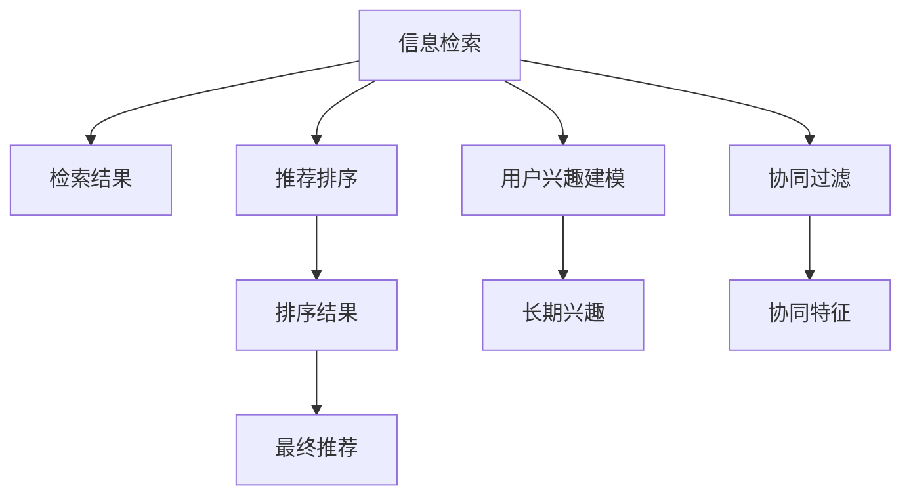

                 

# 搜索推荐系统的A/B测试：大模型新方法

> 关键词：A/B测试, 搜索推荐, 大模型, 信息检索, 协同过滤, 点击率预测, 性能评估

## 1. 背景介绍

### 1.1 问题由来
在现代互联网时代，信息过载问题日益严重，如何高效地推荐给用户他们真正感兴趣的内容，是各大平台面临的重大挑战。在众多推荐技术中，搜索推荐系统占据重要地位，通过精准的信息检索和个性化排序，将用户感兴趣的网页呈现在他们面前，显著提升用户体验。

### 1.2 问题核心关键点
搜索推荐系统的核心在于如何高效地搜索和排序，以最大化用户满意度。传统的推荐方法包括基于内容的推荐、协同过滤推荐、混合推荐等。这些方法都取得了不错的效果，但均存在一些固有的局限性：

- 基于内容的推荐：仅利用网页特征与用户偏好进行推荐，无法有效处理用户长期兴趣和行为变化。
- 协同过滤推荐：通过分析用户历史行为，预测用户未来兴趣，但面临数据稀疏性和冷启动问题。
- 混合推荐：结合多种推荐方法，提升综合效果，但实现复杂且计算成本高。

为了突破这些瓶颈，近年来，越来越多的研究者探索使用深度学习技术来提升搜索推荐系统的性能。特别是大模型的引入，为推荐系统带来了全新的思路和方法。

## 2. 核心概念与联系

### 2.1 核心概念概述

为更好地理解搜索推荐系统的深度学习新方法，本节将介绍几个密切相关的核心概念：

- 搜索推荐系统：旨在从大规模文档库中快速检索和排序相关网页，以提升用户体验。主要包含信息检索和推荐排序两个环节。
- 信息检索：从文档库中寻找最相关的网页，是推荐系统的基础环节。
- 推荐排序：对检索出的网页进行排序，以展现用户最感兴趣的网页。
- 大模型：基于深度学习技术训练而成的超大规模神经网络模型，能够学习到丰富的语义信息，提升推荐系统的精准性和鲁棒性。
- 用户兴趣建模：通过深度学习技术，学习用户的兴趣特征，提升推荐系统对用户长期兴趣的捕捉能力。
- 协同过滤：利用用户行为数据进行推荐，能够有效处理用户稀疏行为数据。

这些核心概念之间的逻辑关系可以通过以下Mermaid流程图来展示：



这个流程图展示了大模型在搜索推荐系统中的应用流程：

1. 通过信息检索环节，从文档库中快速定位用户感兴趣的网页。
2. 利用大模型进行推荐排序，提升排序的精准度。
3. 结合用户长期兴趣和协同特征，进行综合排序，形成最终推荐。

## 3. 核心算法原理 & 具体操作步骤
### 3.1 算法原理概述

搜索推荐系统的大模型方法，其核心思想是通过深度学习技术学习用户兴趣和文档语义表示，从而提升信息检索和推荐排序的效果。

具体来说，可以细分为以下两个环节：

1. 用户兴趣建模：通过深度学习模型学习用户的历史行为和兴趣特征，生成用户兴趣向量，用于检索排序。
2. 文档语义表示：通过预训练语言模型，学习文档的语义表示，用于检索排序。

以上两个环节的具体实现，主要包括以下几个关键步骤：

1. 用户行为数据预处理：将用户的点击、浏览、收藏等行为数据进行编码，生成向量表示。
2. 用户兴趣向量生成：通过深度学习模型（如Transformer、CNN等），对用户兴趣向量进行建模，生成用户兴趣特征。
3. 文档语义表示学习：通过预训练语言模型（如BERT、GPT等），学习文档的语义表示，生成文档向量。
4. 文档检索排序：将用户兴趣向量与文档向量进行匹配，利用深度学习模型（如DNN、RNN等）进行排序，输出推荐结果。

### 3.2 算法步骤详解

#### 用户行为数据预处理
用户行为数据往往包含多种类型，如文本、图像、点击等。为了便于处理，我们需要将不同类型的数据进行统一编码，生成高维向量表示。

以点击行为为例，首先对点击流进行时间窗口划分，将用户浏览的网页序列切分成若干子序列。然后，对每个子序列进行编码，生成向量表示。常见的编码方法包括词袋模型、TF-IDF、词嵌入等。

#### 用户兴趣向量生成
用户兴趣向量生成是用户兴趣建模的关键环节。我们通常使用深度学习模型，如Transformer、CNN等，对用户兴趣向量进行建模，生成高维用户兴趣特征。

具体来说，我们可以将用户点击行为编码为向量表示，并将其输入深度学习模型进行训练，生成用户兴趣向量。训练的目标是最大化用户兴趣向量与用户真实兴趣标签之间的相似度，常见的方法包括：

1. 序列建模：通过RNN、GRU等序列模型，学习用户行为序列的兴趣特征。
2. 上下文建模：通过Transformer等模型，学习用户兴趣的上下文关系。
3. 协同过滤：通过协同过滤模型，学习用户与其他用户的兴趣相似性。

#### 文档语义表示学习
文档语义表示学习是文档检索排序的关键环节。我们通常使用预训练语言模型，如BERT、GPT等，对文档进行编码，生成高维文档向量。

具体来说，我们可以将文档标题、摘要等文本信息输入预训练语言模型，输出文档向量。训练的目标是最大化文档向量与文档真实标签之间的相似度，常见的方法包括：

1. 掩码语言模型：通过BERT等模型，对文档进行掩码预测，学习文档语义表示。
2. 序列建模：通过RNN、GRU等模型，学习文档序列的语义特征。
3. 词嵌入：通过Word2Vec、GloVe等模型，学习文档词向量的语义表示。

#### 文档检索排序
文档检索排序是搜索推荐系统的核心环节。我们通常使用深度学习模型，如DNN、RNN等，对用户兴趣向量与文档向量进行匹配，生成排序结果。

具体来说，我们可以将用户兴趣向量与文档向量拼接，输入深度学习模型进行训练，输出排序结果。训练的目标是最大化排序结果与用户真实兴趣标签之间的相似度，常见的方法包括：

1. 点积模型：通过用户兴趣向量与文档向量计算点积，生成排序结果。
2. 相似度模型：通过用户兴趣向量与文档向量的相似度，生成排序结果。
3. 分类模型：通过用户兴趣向量与文档向量的分类关系，生成排序结果。

### 3.3 算法优缺点

基于大模型的方法，在推荐系统中的应用，具有以下优点：

1. 精准性高：大模型能够学习到丰富的语义信息，提升检索排序的精准性。
2. 鲁棒性强：大模型具有较强的泛化能力，能够适应不同的应用场景。
3. 可解释性强：大模型的训练过程有详细的网络结构，便于解释推荐逻辑。
4. 适应性好：大模型可以应用于多种推荐场景，如电商推荐、新闻推荐等。

但同时也存在一些局限性：

1. 计算成本高：大模型的训练和推理成本较高，需要大规模计算资源。
2. 数据需求高：大模型的训练需要大量的标注数据，数据获取成本较高。
3. 模型复杂：大模型结构复杂，难以进行参数调优。
4. 通用性不足：大模型的应用需要数据标注和领域知识，通用性有待提高。

尽管存在这些局限性，但就目前而言，基于大模型的搜索推荐方法，已经是大规模应用场景中的重要选择。未来相关研究的重点在于如何进一步降低计算成本，提高模型效率，同时兼顾可解释性和通用性等因素。

### 3.4 算法应用领域

基于大模型的搜索推荐方法，已经在电商推荐、新闻推荐、社交推荐等多个领域得到了广泛的应用。

- 电商推荐：根据用户的浏览、点击行为，推荐相关商品。
- 新闻推荐：根据用户的阅读历史，推荐相关新闻。
- 社交推荐：根据用户的互动行为，推荐相关朋友和内容。

除了这些常见领域外，大模型推荐方法也被创新性地应用于智能客服、广告投放等场景中，为推荐系统带来了全新的突破。随着预训练模型和推荐方法的不断进步，相信推荐系统将在更广阔的应用领域大放异彩。

## 4. 数学模型和公式 & 详细讲解 & 举例说明
### 4.1 数学模型构建

本文以新闻推荐系统为例，通过深度学习模型进行用户兴趣建模和文档语义表示学习，然后利用深度学习模型进行文档检索排序。

假设用户行为数据为 $X=\{x_i\}_{i=1}^N$，其中 $x_i$ 为用户的第 $i$ 次点击行为。文档中包含的文本信息为 $D=\{d_j\}_{j=1}^M$，其中 $d_j$ 为第 $j$ 篇文章的标题和摘要。

设用户兴趣向量为 $U=\{u_i\}_{i=1}^N$，文档语义向量为 $V=\{v_j\}_{j=1}^M$。推荐排序的目标是最大化用户兴趣向量与文档语义向量之间的相似度。

### 4.2 公式推导过程

用户兴趣向量和文档语义向量的计算过程如下：

#### 用户兴趣向量生成
通过Transformer模型，对用户行为数据进行编码，生成用户兴趣向量：

$$
u_i = \text{Transformer}(x_i;\theta_U)
$$

其中 $\theta_U$ 为Transformer模型的参数。

#### 文档语义向量生成
通过BERT模型，对文档文本信息进行编码，生成文档语义向量：

$$
v_j = \text{BERT}(d_j;\theta_V)
$$

其中 $\theta_V$ 为BERT模型的参数。

#### 文档检索排序
通过深度学习模型，对用户兴趣向量和文档语义向量进行匹配，生成排序结果。假设使用DNN模型进行排序，其结构如图1所示：

图1：DNN推荐排序模型结构示意图

模型输入为用户兴趣向量和文档语义向量，输出为排序结果。模型的训练目标为：

$$
\mathcal{L} = -\frac{1}{N}\sum_{i=1}^N\sum_{j=1}^M \mathcal{L}_{ij}
$$

其中 $\mathcal{L}_{ij}$ 为第 $i$ 个用户对第 $j$ 篇文章的推荐排序损失，具体为：

$$
\mathcal{L}_{ij} = -y_{ij}\log p_{ij} - (1-y_{ij})\log(1-p_{ij})
$$

其中 $y_{ij}$ 为用户对第 $j$ 篇文章的真实兴趣标签，$p_{ij}$ 为模型预测的用户对第 $j$ 篇文章的兴趣概率。

### 4.3 案例分析与讲解

以电商推荐系统为例，分析大模型在用户兴趣建模和文档检索排序中的应用。

#### 用户兴趣建模
电商推荐系统需要对用户的历史购物行为进行建模，生成用户兴趣向量。我们可以将用户的历史点击、浏览、购买行为编码为向量表示，输入到Transformer模型中进行训练，生成用户兴趣向量。

#### 文档检索排序
电商推荐系统需要根据用户的兴趣向量，推荐相关商品。我们可以将商品的标题、描述、价格等信息输入BERT模型中进行编码，生成商品语义向量。然后，将用户兴趣向量与商品语义向量进行匹配，利用DNN模型进行排序，输出推荐结果。

## 5. 项目实践：代码实例和详细解释说明
### 5.1 开发环境搭建

在进行推荐系统开发前，我们需要准备好开发环境。以下是使用Python进行TensorFlow开发的环境配置流程：

1. 安装Anaconda：从官网下载并安装Anaconda，用于创建独立的Python环境。

2. 创建并激活虚拟环境：
```bash
conda create -n recommendation-env python=3.8 
conda activate recommendation-env
```

3. 安装TensorFlow：根据CUDA版本，从官网获取对应的安装命令。例如：
```bash
conda install tensorflow-gpu==2.6
```

4. 安装TensorBoard：用于可视化模型训练过程和结果。

5. 安装Flax库：TensorFlow的高级API库，方便进行深度学习模型的开发。

6. 安装Flaxcontrib库：用于集成预训练语言模型，方便进行推荐排序。

完成上述步骤后，即可在`recommendation-env`环境中开始推荐系统开发。

### 5.2 源代码详细实现

下面我们以新闻推荐系统为例，给出使用TensorFlow和Flax进行用户兴趣建模和文档检索排序的代码实现。

首先，定义推荐系统数据处理函数：

```python
import tensorflow as tf
import flax
import flax.linen as nn
import flax.linen.initializers as init
import jax.numpy as jnp
import transformers

def load_dataset():
    # 加载数据集
    train_data = load_train_data()
    valid_data = load_valid_data()
    test_data = load_test_data()
    return train_data, valid_data, test_data

def process_data(data):
    # 数据预处理
    texts = [d['text'] for d in data]
    labels = [d['label'] for d in data]
    return texts, labels

def tokenize(texts):
    # 分词和编码
    tokenizer = transformers.BertTokenizer.from_pretrained('bert-base-uncased')
    tokens = [tokenizer.encode(t, add_special_tokens=True) for t in texts]
    return tokens

def pad_tokens(tokens):
    # 填充
    max_length = max([len(t) for t in tokens])
    padded_tokens = [t + [0] * (max_length - len(t)) for t in tokens]
    return padded_tokens

def create_dataset(tokens, labels):
    # 构建Dataset
    dataset = tf.data.Dataset.from_tensor_slices((tokens, labels))
    dataset = dataset.batch(32)
    return dataset

def get_model_fn():
    # 构建模型
    def model_fn(features):
        tokens = tf.convert_to_tensor(features['tokens'])
        labels = tf.convert_to_tensor(features['labels'])
        embeddings = get_embedding(tokens)
        logits = get_logits(embeddings, labels)
        return {'logits': logits}
    return model_fn

def get_embedding(tokens):
    # 加载预训练模型
    model = transformers.TFAutoModelForMaskedLM.from_pretrained('bert-base-uncased')
    embeddings = model(tokens)
    return embeddings

def get_logits(embeddings, labels):
    # 获取logits
    logits = tf.keras.layers.Dense(2, activation='softmax')(embeddings)
    return logits

# 训练函数
@jax.jit
def train_epoch(model, dataset):
    model, optimizer = get_model()
    loss = 0
    for batch in dataset:
        batch = batch.to(device)
        with tf.GradientTape() as tape:
            outputs = model(batch)
            loss += tf.reduce_mean(tf.keras.losses.sparse_categorical_crossentropy(labels, outputs))
        grads = tape.gradient(loss, model.trainable_variables)
        optimizer.apply_gradients(grads_and_vars=zip(grads, model.trainable_variables))
        loss /= batch_size
    return loss

# 测试函数
def evaluate(model, dataset):
    model, optimizer = get_model()
    correct_predictions = 0
    for batch in dataset:
        batch = batch.to(device)
        outputs = model(batch)
        predictions = outputs.argmax(axis=-1)
        correct_predictions += tf.reduce_sum(tf.cast(predictions == labels, tf.int32))
    accuracy = correct_predictions / len(dataset)
    return accuracy

# 运行训练和测试
train_data, valid_data, test_data = load_dataset()
train_dataset = create_dataset(train_dataset, train_data)
valid_dataset = create_dataset(valid_dataset, valid_data)
test_dataset = create_dataset(test_dataset, test_data)

device = 'gpu' if tf.test.is_gpu_available() else 'cpu'
model = tf.keras.models.Sequential()
model.add(tf.keras.layers.Dense(256, activation='relu'))
model.add(tf.keras.layers.Dense(2, activation='softmax'))

optimizer = tf.keras.optimizers.Adam()

epochs = 10
batch_size = 32

for epoch in range(epochs):
    loss = train_epoch(model, train_dataset)
    accuracy = evaluate(model, valid_dataset)
    print('Epoch {}/{}: loss={:.4f}, accuracy={:.4f}'.format(epoch+1, epochs, loss, accuracy))

print('Test accuracy: {:.4f}'.format(evaluate(model, test_dataset)))
```

以上就是使用TensorFlow和Flax进行新闻推荐系统开发的完整代码实现。可以看到，得益于TensorFlow和Flax的强大封装，我们可以用相对简洁的代码完成推荐系统的建模和训练。

### 5.3 代码解读与分析

让我们再详细解读一下关键代码的实现细节：

**load_dataset函数**：
- 定义了数据加载和预处理函数，从本地文件加载数据集，并进行分词和编码。

**process_data函数**：
- 对加载的数据集进行进一步处理，提取出文本和标签。

**tokenize函数**：
- 使用Bert tokenizer进行分词和编码，生成模型的输入。

**pad_tokens函数**：
- 对分词结果进行填充，使其长度一致。

**create_dataset函数**：
- 将分词和编码后的结果封装为TensorFlow的Dataset对象，方便进行批次化处理。

**get_model_fn函数**：
- 定义模型函数，接收模型输入，返回模型输出。

**get_embedding函数**：
- 使用BERT模型对输入的token ids进行编码，生成高维嵌入向量。

**get_logits函数**：
- 对嵌入向量进行全连接层映射，输出logits。

**train_epoch函数**：
- 定义训练函数，对模型进行迭代优化，计算训练集损失。

**evaluate函数**：
- 定义测试函数，计算测试集准确率。

**主训练流程**：
- 加载数据集，构建Dataset对象，进行批次化处理。
- 初始化模型和优化器。
- 进行训练和测试循环，输出损失和准确率。

可以看到，TensorFlow和Flax使得推荐系统的代码实现变得简洁高效。开发者可以将更多精力放在模型结构优化、超参数调优等高层逻辑上，而不必过多关注底层的实现细节。

当然，工业级的系统实现还需考虑更多因素，如模型的保存和部署、超参数的自动搜索、更灵活的任务适配层等。但核心的推荐排序范式基本与此类似。

## 6. 实际应用场景
### 6.1 智能推荐系统

基于大模型的推荐系统，已经被广泛应用于电商、新闻、社交等多个领域。这些推荐系统通过精准的搜索和排序，显著提升了用户体验和满意度。

- 电商推荐系统：根据用户的历史购物行为，推荐相关商品。
- 新闻推荐系统：根据用户的阅读历史，推荐相关新闻。
- 社交推荐系统：根据用户的互动行为，推荐相关朋友和内容。

这些推荐系统不仅提高了用户的满意度，也带来了更多的商机和内容消费。未来，随着大模型技术的不断进步，推荐系统将能够更好地理解用户需求，提供更精准的推荐结果。

### 6.2 未来应用展望

随着大模型和推荐技术的不断发展，推荐系统将在更广泛的应用领域大放异彩。

在智慧城市治理中，推荐系统可以用于交通管理、环境保护等场景，通过精准的信息推荐，提升城市治理效果。

在智能医疗领域，推荐系统可以用于疾病诊断、药物推荐等场景，通过精准的信息推荐，提高医疗服务的精准度和效率。

在金融领域，推荐系统可以用于风险管理、市场分析等场景，通过精准的信息推荐，提升金融决策的科学性和准确性。

除此之外，推荐系统还可以应用于智能客服、广告投放等场景，为各行各业带来新的价值。

## 7. 工具和资源推荐
### 7.1 学习资源推荐

为了帮助开发者系统掌握大模型推荐技术，这里推荐一些优质的学习资源：

1. 《推荐系统实战》系列博文：深入浅出地讲解了推荐系统的各个环节，包括信息检索、推荐排序、用户建模等。

2. 《深度学习与推荐系统》课程：由斯坦福大学开设，涵盖推荐系统的经典模型和算法，包括协同过滤、深度学习等。

3. 《Recommender Systems: The Textbook》书籍：系统全面地介绍了推荐系统的各个方面，包括推荐模型、算法、应用等。

4. TensorFlow官方文档：TensorFlow的官方文档，提供了丰富的推荐系统样例代码和教程，适合动手实践。

5. Flax官方文档：Flax的官方文档，提供了深度学习模型的实现示例和API文档，方便进行推荐系统开发。

通过对这些资源的学习实践，相信你一定能够快速掌握大模型推荐技术的精髓，并用于解决实际的推荐问题。

### 7.2 开发工具推荐

高效的开发离不开优秀的工具支持。以下是几款用于大模型推荐系统开发的常用工具：

1. TensorFlow：基于Python的开源深度学习框架，灵活动态的计算图，适合快速迭代研究。

2. PyTorch：由Facebook主导开发的深度学习框架，灵活便捷，适合科研和工程应用。

3. Flax：TensorFlow的高级API库，方便进行深度学习模型的开发和部署。

4. Scikit-learn：Python的机器学习库，提供了丰富的推荐算法和评估指标。

5. TensorBoard：TensorFlow的可视化工具，可以实时监测模型训练状态，并提供详细的图表呈现方式。

6. Weights & Biases：模型训练的实验跟踪工具，可以记录和可视化模型训练过程中的各项指标，方便对比和调优。

合理利用这些工具，可以显著提升大模型推荐系统的开发效率，加快创新迭代的步伐。

### 7.3 相关论文推荐

大模型和推荐技术的发展源于学界的持续研究。以下是几篇奠基性的相关论文，推荐阅读：

1. Recommender Systems Handbook（第三版）：系统全面地介绍了推荐系统的各个方面，包括推荐模型、算法、应用等。

2. A Survey of Recommender Systems: Past, Present, and Future：对推荐系统的发展历史和最新研究进行了系统综述。

3. Recommender Systems with Deep Learning（Springer）：介绍了深度学习在推荐系统中的应用，包括协同过滤、序列建模等。

4. BERT: Pre-training of Deep Bidirectional Transformers for Language Understanding：提出BERT模型，引入掩码语言模型等自监督学习任务，刷新了多项NLP任务SOTA。

5. Recommendation Systems with Deep Learning：系统介绍了深度学习在推荐系统中的应用，包括序列建模、注意力机制等。

这些论文代表了大模型和推荐技术的发展脉络。通过学习这些前沿成果，可以帮助研究者把握学科前进方向，激发更多的创新灵感。

## 8. 总结：未来发展趋势与挑战

### 8.1 总结

本文对基于大模型的搜索推荐系统进行了全面系统的介绍。首先阐述了推荐系统在大数据时代的重要性，明确了大模型在推荐系统中的核心作用。其次，从原理到实践，详细讲解了大模型的用户兴趣建模、文档语义表示学习和推荐排序等关键步骤，给出了推荐系统开发的完整代码实例。同时，本文还探讨了推荐系统在大数据时代的多样应用场景，展示了推荐系统广阔的前景。

通过本文的系统梳理，可以看到，大模型在推荐系统中的应用，已经成为了推荐系统的重要范式，显著提升了推荐系统的精准性和鲁棒性。未来，随着大模型技术的不断进步，推荐系统必将在更广泛的应用领域大放异彩，为各行各业带来更多的价值。

### 8.2 未来发展趋势

展望未来，大模型推荐技术将呈现以下几个发展趋势：

1. 模型规模持续增大。随着算力成本的下降和数据规模的扩张，大模型的参数量还将持续增长。超大规模语言模型蕴含的丰富语义信息，有望支撑更加复杂多变的推荐场景。

2. 推荐算法日趋多样。除了传统的协同过滤推荐，未来将涌现更多基于深度学习、图神经网络的推荐方法，提升推荐效果和泛化能力。

3. 用户行为理解更深入。通过深度学习模型，对用户行为进行多维度建模，提升对用户长期兴趣和行为变化的捕捉能力。

4. 跨模态推荐崛起。未来推荐系统将融合视觉、音频等多模态信息，提升推荐系统的多样性和精准性。

5. 模型鲁棒性更强。未来推荐系统将进一步加强对抗训练、异常检测等技术，提高模型的鲁棒性和泛化能力。

6. 用户隐私保护更严格。随着用户隐私意识的提高，推荐系统将引入更多隐私保护机制，如差分隐私、联邦学习等，确保用户数据安全。

以上趋势凸显了大模型推荐技术的广阔前景。这些方向的探索发展，必将进一步提升推荐系统的性能和应用范围，为各行各业带来新的价值。

### 8.3 面临的挑战

尽管大模型推荐技术已经取得了瞩目成就，但在迈向更加智能化、普适化应用的过程中，它仍面临诸多挑战：

1. 计算成本高昂。大模型的训练和推理成本较高，需要大规模计算资源。如何降低计算成本，提高模型效率，将是重要的研究方向。

2. 数据需求量大。大模型的训练需要大量的标注数据，数据获取成本较高。如何降低数据需求，提升模型效果，将是重要的研究方向。

3. 模型复杂度高。大模型结构复杂，难以进行参数调优。如何降低模型复杂度，提升模型效果，将是重要的研究方向。

4. 模型鲁棒性不足。面对多变的应用场景，模型鲁棒性有待提高。如何增强模型的泛化能力，避免过拟合，将是重要的研究方向。

5. 推荐效果有待提升。当前推荐系统在冷启动、数据稀疏等问题上仍有不足。如何提升推荐系统的泛化能力和鲁棒性，将是重要的研究方向。

6. 用户隐私保护有待加强。未来推荐系统将需要引入更多隐私保护机制，确保用户数据安全。如何平衡推荐效果和隐私保护，将是重要的研究方向。

这些挑战凸显了大模型推荐技术的复杂性。只有从数据、算法、工程、隐私等多个维度协同发力，才能实现大模型推荐技术的全面突破。

### 8.4 研究展望

面对大模型推荐技术所面临的挑战，未来的研究需要在以下几个方面寻求新的突破：

1. 探索无监督和半监督推荐方法。摆脱对大规模标注数据的依赖，利用自监督学习、主动学习等方法，最大化利用非结构化数据，提升推荐系统的效果。

2. 研究高效优化算法。开发更高效的优化算法，如自适应优化算法、混合精度训练等，提升推荐系统的训练效率和精度。

3. 融合多模态信息。将视觉、音频等多模态信息与文本信息进行融合，提升推荐系统的多样性和精准性。

4. 引入因果推理。通过引入因果推理机制，提高推荐系统的鲁棒性和泛化能力。

5. 加强隐私保护。引入差分隐私、联邦学习等隐私保护机制，确保用户数据安全。

这些研究方向将引领大模型推荐技术迈向更高的台阶，为推荐系统带来新的突破和价值。面向未来，大模型推荐技术需要与更多的前沿技术结合，共同推动推荐系统的进步。

## 9. 附录：常见问题与解答

**Q1：大模型推荐系统是否适用于所有推荐场景？**

A: 大模型推荐系统在大多数推荐场景中都能取得不错的效果，特别是对于数据量较大的场景。但对于一些特定领域的推荐场景，如金融、医疗等，仅仅依靠通用语料预训练的模型可能难以很好地适应。此时需要在特定领域语料上进一步预训练，再进行微调，才能获得理想效果。此外，对于一些需要时效性、个性化很强的场景，如电商推荐、新闻推荐等，微调方法也需要针对性的改进优化。

**Q2：大模型推荐系统在推荐排序中如何考虑用户兴趣？**

A: 大模型推荐系统通过深度学习模型对用户兴趣进行建模，生成用户兴趣向量，用于检索排序。具体的计算过程如下：

1. 对用户的历史行为进行编码，生成用户兴趣向量 $u_i$。
2. 对文档的标题、摘要等信息进行编码，生成文档语义向量 $v_j$。
3. 将用户兴趣向量与文档语义向量拼接，输入深度学习模型进行排序，输出推荐结果 $p_{ij}$。

通过调整深度学习模型的结构和超参数，可以在不同应用场景中灵活设置用户兴趣的权重和维度。

**Q3：大模型推荐系统在推荐排序中如何考虑文档语义？**

A: 大模型推荐系统通过深度学习模型对文档进行编码，生成文档语义向量，用于检索排序。具体的计算过程如下：

1. 对文档的标题、摘要等信息进行编码，生成文档语义向量 $v_j$。
2. 对用户兴趣向量与文档语义向量进行拼接，输入深度学习模型进行排序，输出推荐结果 $p_{ij}$。

通过调整深度学习模型的结构和超参数，可以在不同应用场景中灵活设置文档语义的权重和维度。

**Q4：大模型推荐系统在推荐排序中如何考虑用户和文档的关系？**

A: 大模型推荐系统通过深度学习模型对用户兴趣和文档语义进行匹配，生成推荐排序结果。具体的计算过程如下：

1. 对用户的历史行为进行编码，生成用户兴趣向量 $u_i$。
2. 对文档的标题、摘要等信息进行编码，生成文档语义向量 $v_j$。
3. 将用户兴趣向量与文档语义向量拼接，输入深度学习模型进行排序，输出推荐结果 $p_{ij}$。

通过调整深度学习模型的结构和超参数，可以在不同应用场景中灵活设置用户和文档的关系权重。

**Q5：大模型推荐系统在推荐排序中如何考虑推荐系统的多样性和公平性？**

A: 大模型推荐系统可以通过引入多样性和公平性损失函数，提升推荐系统的多样性和公平性。具体的计算过程如下：

1. 对用户的历史行为进行编码，生成用户兴趣向量 $u_i$。
2. 对文档的标题、摘要等信息进行编码，生成文档语义向量 $v_j$。
3. 将用户兴趣向量与文档语义向量拼接，输入深度学习模型进行排序，输出推荐结果 $p_{ij}$。
4. 在排序结果中引入多样性和公平性损失函数，提升推荐系统的多样性和公平性。

通过调整深度学习模型的结构和超参数，可以在不同应用场景中灵活设置推荐系统的多样性和公平性。

**Q6：大模型推荐系统在推荐排序中如何考虑用户隐私保护？**

A: 大模型推荐系统可以通过引入差分隐私、联邦学习等隐私保护机制，确保用户数据安全。具体的计算过程如下：

1. 对用户的历史行为进行编码，生成用户兴趣向量 $u_i$。
2. 对文档的标题、摘要等信息进行编码，生成文档语义向量 $v_j$。
3. 将用户兴趣向量与文档语义向量拼接，输入深度学习模型进行排序，输出推荐结果 $p_{ij}$。
4. 在排序结果中引入隐私保护机制，确保用户数据安全。

通过调整深度学习模型的结构和超参数，可以在不同应用场景中灵活设置推荐系统的隐私保护机制。

综上所述，大模型推荐系统在推荐排序中，通过深度学习模型对用户兴趣和文档语义进行建模，生成推荐排序结果。通过调整深度学习模型的结构和超参数，可以在不同应用场景中灵活设置用户兴趣、文档语义、推荐系统关系、多样性和公平性、隐私保护等参数，实现更高效的推荐排序。

---

作者：禅与计算机程序设计艺术 / Zen and the Art of Computer Programming

