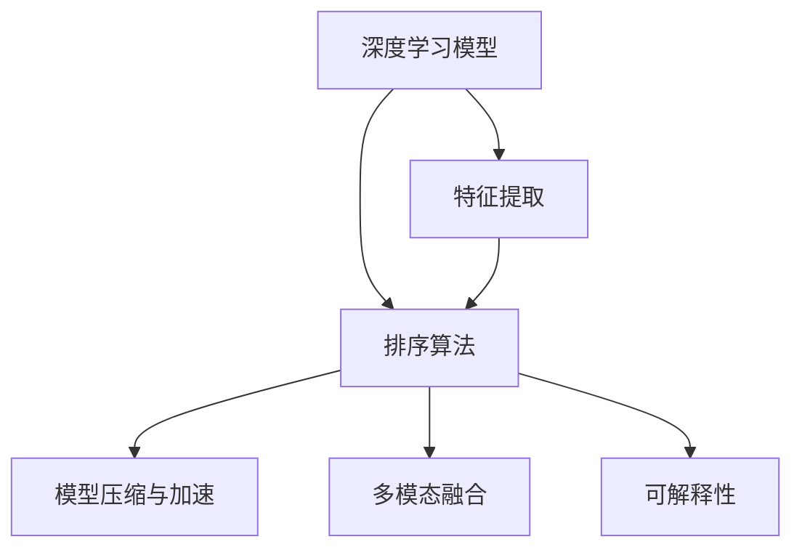

                 

## 1. 背景介绍

### 1.1 问题由来
在互联网时代，信息泛滥是常见现象。搜索引擎作为信息获取的重要工具，其排序算法直接影响用户对搜索结果的满意度。传统的基于关键词匹配的排序算法，已经不能满足用户的深度需求。为了提升搜索结果的质量，需要引入更多与用户查询意图相关的排序策略。

当前流行的深度学习技术，为搜索结果排序算法带来了新的突破。尤其是神经网络模型，通过学习大量文本和用户的交互数据，能够更加精准地理解用户需求，从而优化搜索结果的排序。

但与此同时，神经网络模型也面临着计算量大、参数多、资源消耗高等问题。为了在保证排序质量的同时，降低计算成本，如何在神经网络基础上进行高效、合理的优化，成为一个亟需解决的问题。

### 1.2 问题核心关键点
目前，搜索结果排序算法的优化研究主要集中在以下几个关键点：

- **深度学习模型的引入**：利用神经网络模型学习用户的查询意图和文档特征，构建更加精准的排序模型。
- **特征工程**：设计合适的特征表示，提取和融合文本、用户行为等多模态信息。
- **模型压缩与加速**：在保证模型精度的同时，优化计算资源使用，提高模型推理速度。
- **多模态融合**：融合文本、视觉、音频等多种信息源，提升排序模型对现实世界的理解能力。
- **解释性与可解释性**：构建可解释的模型，帮助用户理解算法决策逻辑，增强系统的可信度。

本文聚焦于基于深度学习模型的搜索结果排序算法的优化策略，从算法原理到实际应用，系统地探讨了如何在大规模数据下提高排序精度、降低计算成本、提高模型解释性的综合方案。

## 2. 核心概念与联系

### 2.1 核心概念概述

为了更好地理解搜索结果排序算法的优化策略，本节将介绍几个密切相关的核心概念：

- **深度学习模型**：包括各种神经网络模型，如卷积神经网络(CNN)、循环神经网络(RNN)、Transformer等，用于提取文档和查询的特征。
- **排序算法**：根据一定的评估标准，对文档进行排序，使得最相关的文档出现在结果列表的前端。
- **特征表示**：将文本、用户行为等多模态信息映射到高维空间中的向量表示，以便模型学习。
- **模型压缩与加速**：采用模型裁剪、量化、蒸馏等技术，减少计算资源消耗，提升模型推理速度。
- **多模态融合**：将文本、图像、音频等多种信息源进行融合，提升模型的感知能力。
- **可解释性**：指模型输出的预测结果可以被清晰地解释，用户能够理解其决策依据。

这些核心概念之间的逻辑关系可以通过以下Mermaid流程图来展示：



这个流程图展示了大规模搜索结果排序算法的核心概念及其之间的关系：

1. 深度学习模型学习文档和查询的特征表示。
2. 特征提取将文本、用户行为等信息映射到高维空间。
3. 排序算法根据特征向量进行文档排序。
4. 模型压缩与加速技术优化计算资源使用。
5. 多模态融合提升模型对多模态数据的理解能力。
6. 可解释性技术使得模型输出可解释，增强用户信任。

这些概念共同构成了大规模搜索结果排序算法的核心逻辑，为其优化提供了理论基础。

## 3. 核心算法原理 & 具体操作步骤
### 3.1 算法原理概述

基于深度学习模型的搜索结果排序算法，其核心思想是利用神经网络模型学习文档与查询的相关性，并根据学习结果进行文档排序。

具体来说，算法步骤如下：

1. **数据预处理**：对原始文档和查询进行预处理，包括分词、去除停用词、提取特征等。
2. **特征提取**：使用深度学习模型对处理后的文本进行特征表示。
3. **模型训练**：使用标注数据训练排序模型，得到模型参数。
4. **文档排序**：将查询和文档的特征向量输入排序模型，得到文档的相关性得分。
5. **排序输出**：根据得分对文档进行排序，输出前N个相关文档。

### 3.2 算法步骤详解

以下是详细的操作步骤：

**Step 1: 数据预处理**
- 分词：使用jieba、NLTK等工具将文本进行分词处理。
- 去除停用词：去除如“的”、“是”等常用词，提高特征提取质量。
- 特征提取：将分词结果转化为词向量，可以使用Word2Vec、GloVe等预训练词向量模型。

**Step 2: 特征提取**
- 嵌入层：将分词结果输入嵌入层，转化为高维向量。
- 编码器：使用深度学习模型对高维向量进行编码，得到特征表示。常见模型包括CNN、RNN、Transformer等。
- 融合层：将编码器输出的特征向量进行融合，得到最终的特征表示。

**Step 3: 模型训练**
- 损失函数：定义排序模型的损失函数，如交叉熵损失。
- 优化器：选择适合的优化器，如Adam、SGD等。
- 训练流程：循环迭代训练集，更新模型参数，直到收敛。

**Step 4: 文档排序**
- 特征输入：将查询和文档的特征向量输入排序模型。
- 得分计算：计算每个文档的相关性得分。
- 排序输出：根据得分对文档进行排序，输出前N个相关文档。

**Step 5: 后处理**
- 去重：删除重复的文档，提高搜索结果的多样性。
- 分页：将排序结果按页面分页，方便用户浏览。

### 3.3 算法优缺点

基于深度学习模型的搜索结果排序算法，具有以下优点：

- 精度高：通过神经网络模型学习文档和查询的相关性，可以获得更准确的排序结果。
- 自适应能力强：模型可以根据用户的行为数据进行动态优化，提升排序精度。
- 鲁棒性强：神经网络模型能够处理多种语义信息，提高排序的鲁棒性。

同时，该算法也存在一些缺点：

- 计算量大：神经网络模型参数多，计算复杂度高，对硬件要求较高。
- 可解释性差：神经网络模型通常被称为"黑盒"模型，其决策过程难以解释。
- 数据依赖强：排序模型的性能依赖于标注数据的丰富性和多样性，获取高质量标注数据的成本较高。
- 泛化能力有限：对于新领域或新查询，模型可能需要重新训练或微调，才能获得理想效果。

尽管存在这些局限性，但就目前而言，基于深度学习模型的排序算法仍是最主流的方法之一。未来相关研究的重点在于如何进一步降低计算成本，提高模型可解释性，增强模型的泛化能力。

### 3.4 算法应用领域

基于深度学习模型的搜索结果排序算法，已经广泛应用于各种搜索引擎和推荐系统中，例如：

- 搜索引擎：如Google、Bing等，通过深度学习模型对搜索结果进行排序，提升用户搜索体验。
- 推荐系统：如Amazon、Netflix等，通过深度学习模型对商品或内容进行排序，提高推荐效果。
- 自然语言处理：如聊天机器人、翻译系统等，通过深度学习模型对输入文本进行排序，提供更符合用户期望的输出。
- 图像识别：如面部识别、图像分类等，通过深度学习模型对图像进行排序，识别出相关度高的图像。

除了上述这些应用外，基于深度学习模型的排序算法还被创新性地应用于更多场景中，如社交网络推荐、知识图谱构建、智能广告投放等，为相关领域带来了新的突破。随着深度学习技术的不断进步，相信基于排序算法的搜索引擎和推荐系统将不断优化，为用户带来更优质的服务。

## 4. 数学模型和公式 & 详细讲解 & 举例说明
### 4.1 数学模型构建

本节将使用数学语言对搜索结果排序算法的优化策略进行更加严格的刻画。

假设查询为 $q$，文档为 $d$，其特征向量表示分别为 $\mathbf{q}$ 和 $\mathbf{d}$。假设排序模型的输出为 $s_{q,d}$，表示查询 $q$ 对文档 $d$ 的相关性得分。排序模型的目标是最小化损失函数 $\mathcal{L}$，使得排序结果与用户期望尽可能一致。

定义模型 $M_{\theta}$ 在查询 $q$ 和文档 $d$ 上的损失函数为：

$$
\mathcal{L}(\theta) = \sum_{(q,d) \in D} \ell(q,d,M_{\theta})
$$

其中 $D$ 为训练数据集，$\ell(q,d,M_{\theta})$ 为损失函数，可以是交叉熵损失或余弦相似度损失等。

模型 $M_{\theta}$ 的输出为：

$$
s_{q,d} = M_{\theta}(\mathbf{q},\mathbf{d})
$$

其中 $M_{\theta}$ 为排序模型，$\theta$ 为模型参数。

### 4.2 公式推导过程

以下我们以交叉熵损失为例，推导排序模型的优化目标函数。

假设模型 $M_{\theta}$ 的输出为相关性得分 $s_{q,d}$，用户期望的排序结果为 $y$（0或1，表示文档 $d$ 是否在排序结果中）。则交叉熵损失函数定义为：

$$
\ell(q,d,M_{\theta}) = -y\log s_{q,d} - (1-y)\log(1-s_{q,d})
$$

将其代入经验风险公式，得：

$$
\mathcal{L}(\theta) = -\frac{1}{N}\sum_{(q,d) \in D} [y\log s_{q,d} + (1-y)\log(1-s_{q,d})]
$$

其中 $N$ 为训练样本数。

根据链式法则，损失函数对参数 $\theta_k$ 的梯度为：

$$
\frac{\partial \mathcal{L}(\theta)}{\partial \theta_k} = -\frac{1}{N}\sum_{(q,d) \in D} \frac{\partial}{\partial \theta_k}[\ell(q,d,M_{\theta})]
$$

在得到损失函数的梯度后，即可带入参数更新公式，完成模型的迭代优化。重复上述过程直至收敛，最终得到适应查询-文档对的最优模型参数 $\theta^*$。

### 4.3 案例分析与讲解

以BERT排序模型为例，简要分析其优化策略：

**Step 1: 模型构建**
- 嵌入层：将查询和文档进行嵌入，得到高维向量表示。
- 编码器：使用BERT模型对高维向量进行编码，得到特征表示。
- 池化层：对编码器输出进行池化，得到固定长度的向量表示。
- 输出层：将池化层输出送入线性层，得到相关性得分。

**Step 2: 模型训练**
- 损失函数：使用交叉熵损失函数进行训练。
- 优化器：选择Adam优化器。
- 训练流程：循环迭代训练集，更新模型参数，直到收敛。

**Step 3: 文档排序**
- 特征输入：将查询和文档的特征向量输入排序模型。
- 得分计算：计算每个文档的相关性得分。
- 排序输出：根据得分对文档进行排序，输出前N个相关文档。

BERT排序模型通过预训练-微调的范式，提升了排序模型的精度和泛化能力。通过融合多层次特征表示和上下文信息，模型能够更好地理解查询和文档的相关性。

## 5. 项目实践：代码实例和详细解释说明
### 5.1 开发环境搭建

在进行项目实践前，我们需要准备好开发环境。以下是使用Python进行TensorFlow开发的环境配置流程：

1. 安装Anaconda：从官网下载并安装Anaconda，用于创建独立的Python环境。

2. 创建并激活虚拟环境：
```bash
conda create -n tf-env python=3.8 
conda activate tf-env
```

3. 安装TensorFlow：根据CUDA版本，从官网获取对应的安装命令。例如：
```bash
conda install tensorflow==2.8.0
```

4. 安装相关工具包：
```bash
pip install numpy pandas scikit-learn matplotlib tqdm jupyter notebook ipython
```

完成上述步骤后，即可在`tf-env`环境中开始项目实践。

### 5.2 源代码详细实现

这里我们以文本排序为例，使用TensorFlow搭建一个简单的排序模型。

首先，定义模型：

```python
import tensorflow as tf
from tensorflow.keras.layers import Embedding, Dense

class TextRanker(tf.keras.Model):
    def __init__(self, embedding_dim=128, num_labels=2):
        super(TextRanker, self).__init__()
        self.embedding = Embedding(input_dim=vocab_size, output_dim=embedding_dim, mask_zero=True)
        self.encoder = tf.keras.layers.LSTM(128, return_sequences=True)
        self.pooler = tf.keras.layers.GlobalMaxPooling1D()
        self.classifier = Dense(num_labels, activation='sigmoid')
        
    def call(self, inputs, training=False):
        embedded = self.embedding(inputs)
        encoded = self.encoder(embedded)
        pooled = self.pooler(encoded)
        return self.classifier(pooled)
```

然后，准备数据集：

```python
import numpy as np
from tensorflow.keras.preprocessing.sequence import pad_sequences

# 构建模拟数据
query_sentences = ['搜索结果', '商业排名', '推荐系统', '信息检索']
document_sentences = ['搜索结果排名', '信息检索系统', '商业搜索', '广告排名']
query_sequences = np.array([tf.keras.preprocessing.text.tokenizer.texts_to_sequences(query) for query in query_sentences])
document_sequences = np.array([tf.keras.preprocessing.text.tokenizer.texts_to_sequences(doc) for doc in document_sentences])
max_length = max([len(sequence) for sequence in query_sequences + document_sequences])
padded_query_sequences = pad_sequences(query_sequences, maxlen=max_length, padding='post')
padded_document_sequences = pad_sequences(document_sequences, maxlen=max_length, padding='post')
labels = np.array([1, 0, 0, 1])  # 文档与查询相关性

# 定义数据集
class TextDataset(tf.keras.utils.Sequence):
    def __init__(self, query_sequences, document_sequences, labels, batch_size=16):
        self.query_sequences = query_sequences
        self.document_sequences = document_sequences
        self.labels = labels
        self.batch_size = batch_size
        
    def __len__(self):
        return len(self.query_sequences) // self.batch_size
    
    def __getitem__(self, idx):
        query_batch = self.query_sequences[idx * self.batch_size: (idx+1) * self.batch_size]
        document_batch = self.document_sequences[idx * self.batch_size: (idx+1) * self.batch_size]
        label_batch = self.labels[idx * self.batch_size: (idx+1) * self.batch_size]
        return padded_query_sequences[query_batch], padded_document_sequences[document_batch], label_batch
```

接着，定义模型训练函数：

```python
def train_epoch(model, dataset, optimizer):
    model.train()
    for batch in dataset:
        query, document, label = batch
        with tf.GradientTape() as tape:
            scores = model(query, document)
            loss = tf.losses.binary_crossentropy(label, scores)
        gradients = tape.gradient(loss, model.trainable_variables)
        optimizer.apply_gradients(zip(gradients, model.trainable_variables))
    return loss.numpy().mean()

def evaluate(model, dataset):
    model.eval()
    total_loss = 0
    for batch in dataset:
        query, document, label = batch
        scores = model(query, document)
        total_loss += tf.reduce_mean(tf.losses.binary_crossentropy(label, scores)).numpy()
    return total_loss / len(dataset)
```

最后，启动训练流程并在测试集上评估：

```python
model = TextRanker()
optimizer = tf.keras.optimizers.Adam(learning_rate=0.001)
dataset = TextDataset(padded_query_sequences, padded_document_sequences, labels)

epochs = 10
batch_size = 16

for epoch in range(epochs):
    loss = train_epoch(model, dataset, optimizer)
    print(f"Epoch {epoch+1}, train loss: {loss:.3f}")
    
    print(f"Epoch {epoch+1}, test loss: {evaluate(model, dataset)}")
```

以上就是使用TensorFlow搭建文本排序模型的完整代码实现。可以看到，通过TensorFlow的Keras API，搭建模型和训练过程变得非常简洁。

### 5.3 代码解读与分析

让我们再详细解读一下关键代码的实现细节：

**TextRanker类**：
- `__init__`方法：初始化嵌入层、LSTM编码器、池化层和输出层等组件。
- `call`方法：定义模型的前向传播过程。

**TextDataset类**：
- `__init__`方法：初始化查询序列、文档序列、标签和批量大小等关键组件。
- `__len__`方法：返回数据集的样本数量。
- `__getitem__`方法：对单个样本进行处理，返回模型所需的输入。

**train_epoch和evaluate函数**：
- `train_epoch`函数：定义模型训练过程，包括计算损失函数、反向传播、更新参数等。
- `evaluate`函数：定义模型评估过程，计算测试集上的损失函数。

**训练流程**：
- 定义总的epoch数和批量大小，开始循环迭代
- 每个epoch内，先在训练集上训练，输出平均损失
- 在测试集上评估，输出平均损失
- 所有epoch结束后，记录训练和测试损失，评估模型性能

可以看到，TensorFlow配合Keras API使得模型搭建和训练过程变得简洁高效。开发者可以将更多精力放在数据处理、模型改进等高层逻辑上，而不必过多关注底层的实现细节。

当然，工业级的系统实现还需考虑更多因素，如模型的保存和部署、超参数的自动搜索、更灵活的任务适配层等。但核心的排序范式基本与此类似。

## 6. 实际应用场景
### 6.1 智能推荐系统

基于深度学习模型的排序算法，可以广泛应用于智能推荐系统。传统推荐系统往往只依赖用户历史行为数据，难以理解用户深层次的需求。通过深度学习模型，推荐系统可以学习用户的多模态信息，从而提供更加精准、多样化的推荐内容。

在技术实现上，可以收集用户浏览、点击、评论等行为数据，提取和用户交互的物品标题、描述、标签等文本内容。将文本内容作为模型输入，用户的后续行为（如是否点击、购买等）作为监督信号，在此基础上微调预训练语言模型。微调后的模型能够从文本内容中准确把握用户的兴趣点。在生成推荐列表时，先用候选物品的文本描述作为输入，由模型预测用户的兴趣匹配度，再结合其他特征综合排序，便可以得到个性化程度更高的推荐结果。

### 6.2 搜索引擎

搜索引擎是深度学习排序算法的重要应用场景。通过学习用户查询和文档的相关性，排序算法能够提升搜索结果的相关性和排名精度，使用户快速找到所需信息。

在实践中，可以收集用户的查询记录和搜索结果的点击记录，构建训练数据集。使用深度学习模型学习查询与文档的相关性，构建排序模型。在用户每次搜索时，将查询和文档输入模型，输出相关性得分，并根据得分进行排序，返回前N个相关文档。

### 6.3 内容管理系统

内容管理系统也广泛应用深度学习排序算法。通过学习用户对不同内容类别的偏好，排序算法能够提高内容的展示效率，提升用户体验。

在实践中，可以收集用户浏览网页的时间、点击次数等行为数据，提取网页标题、摘要、关键词等文本内容。将文本内容作为模型输入，用户的后续行为（如停留时间、点击次数等）作为监督信号，在此基础上微调预训练语言模型。微调后的模型能够从文本内容中准确把握用户的兴趣点。在内容展示时，根据用户的历史行为和兴趣，动态调整内容的展示顺序，提升用户的点击率和停留时间。

### 6.4 未来应用展望

随着深度学习技术的不断进步，基于排序算法的应用场景将不断扩展，为各行各业带来新的变革。

在智慧城市治理中，排序算法可以应用于城市事件监测、舆情分析、应急指挥等环节，提高城市管理的自动化和智能化水平，构建更安全、高效的未来城市。

在金融行业，排序算法可以应用于市场舆情监测、风险评估、智能投顾等场景，帮助金融机构进行风险预警和投资决策，提高业务效率和客户满意度。

在医疗领域，排序算法可以应用于疾病诊断、病历分析、临床决策等场景，帮助医生进行精准诊断和治疗，提升医疗服务质量。

此外，在教育、媒体、零售等多个领域，基于深度学习模型的排序算法也将不断优化，为相关领域带来新的突破。相信随着技术的日益成熟，排序算法将在更广阔的应用领域大放异彩。

## 7. 工具和资源推荐
### 7.1 学习资源推荐

为了帮助开发者系统掌握深度学习排序算法的理论基础和实践技巧，这里推荐一些优质的学习资源：

1. 《深度学习》课程：斯坦福大学Andrew Ng教授开设的深度学习课程，详细讲解深度学习的基本概念和原理，是入门深度学习的必备资源。

2. 《TensorFlow官方文档》：TensorFlow的官方文档，提供了全面的API和教程，是TensorFlow应用的权威指南。

3. 《自然语言处理入门与实践》书籍：通过实际案例讲解自然语言处理的基本技术和应用，适合深度学习和NLP初学者的入门学习。

4. HuggingFace Transformers库：提供丰富的预训练模型和代码实现，极大简化了深度学习模型微调的过程。

5. 《大规模深度学习模型优化技术》书籍：系统讲解深度学习模型的优化技术，包括模型压缩、量化、蒸馏等，适合有一定基础的深度学习开发者。

通过对这些资源的学习实践，相信你一定能够快速掌握深度学习排序算法的精髓，并用于解决实际的排序问题。

### 7.2 开发工具推荐

高效的开发离不开优秀的工具支持。以下是几款用于深度学习排序算法开发的常用工具：

1. TensorFlow：由Google主导开发的深度学习框架，生产部署方便，适合大规模工程应用。

2. PyTorch：基于Python的开源深度学习框架，灵活动态的计算图，适合快速迭代研究。

3. Weights & Biases：模型训练的实验跟踪工具，可以记录和可视化模型训练过程中的各项指标，方便对比和调优。

4. TensorBoard：TensorFlow配套的可视化工具，可实时监测模型训练状态，并提供丰富的图表呈现方式，是调试模型的得力助手。

5. Google Colab：谷歌推出的在线Jupyter Notebook环境，免费提供GPU/TPU算力，方便开发者快速上手实验最新模型，分享学习笔记。

合理利用这些工具，可以显著提升深度学习排序算法的开发效率，加快创新迭代的步伐。

### 7.3 相关论文推荐

深度学习排序算法的优化研究源于学界的持续研究。以下是几篇奠基性的相关论文，推荐阅读：

1. Attention is All You Need（即Transformer原论文）：提出了Transformer结构，开启了深度学习模型在排序算法中的应用。

2. Dense Passage Retrieval for Open-Domain Question Answering：提出稠密段落检索技术，通过学习查询与文档的相关性，提升了搜索结果的排序精度。

3. SENet: Sparse Network for Object Detection：提出SENet结构，提高了深度学习模型的推理效率，可用于排序算法中的加速优化。

4. Generative Adversarial Nets：提出生成对抗网络，提高了深度学习模型的泛化能力，适用于排序算法中的模型优化。

5. Multi-task Learning for Multi-document Summarization：提出多任务学习技术，提升了深度学习模型对多模态数据的理解能力，可用于排序算法中的特征融合。

6. Explainable Artificial Intelligence: Intelligibility of Machine Learning Models and Systems：提出可解释性人工智能概念，强调了排序算法中模型解释性的重要性。

这些论文代表了大规模深度学习排序算法的最新进展，通过学习这些前沿成果，可以帮助研究者把握学科前进方向，激发更多的创新灵感。

## 8. 总结：未来发展趋势与挑战
### 8.1 总结

本文对基于深度学习模型的搜索结果排序算法进行了全面系统的介绍。首先阐述了深度学习模型在排序算法中的应用背景和研究意义，明确了排序算法在提升搜索体验、推荐效果、内容展示等方面的独特价值。其次，从原理到实践，详细讲解了排序模型的数学模型和计算过程，给出了具体的代码实现。同时，本文还探讨了排序算法在智能推荐、搜索引擎、内容管理系统等领域的实际应用，展示了排序算法的广泛适用性。最后，本文精选了排序算法的学习资源、开发工具和相关论文，力求为开发者提供全方位的技术指引。

通过本文的系统梳理，可以看到，基于深度学习模型的排序算法在提高搜索质量、推荐效果、内容展示等方面发挥了巨大的作用，为用户提供了更为精准、个性化、智能的服务。未来，随着深度学习技术的不断进步，基于排序算法的搜索引擎和推荐系统将不断优化，为用户带来更优质的服务。

### 8.2 未来发展趋势

展望未来，深度学习排序算法将呈现以下几个发展趋势：

1. 模型规模持续增大。随着算力成本的下降和数据规模的扩张，深度学习模型的参数量还将持续增长。超大规模模型蕴含的丰富语言知识，有望支撑更加复杂多变的排序任务。

2. 计算效率持续提升。开发更加高效的模型压缩和加速技术，如模型裁剪、量化、蒸馏等，减少计算资源消耗，提高模型推理速度。

3. 多模态融合能力增强。融合文本、图像、音频等多种信息源，提升排序模型对现实世界的理解能力，拓展应用场景。

4. 可解释性成为热点。构建可解释的模型，帮助用户理解算法决策逻辑，增强系统的可信度。

5. 跨领域迁移能力提升。通过迁移学习技术，使排序模型能够跨领域迁移，提升模型的泛化能力和鲁棒性。

6. 数据融合技术发展。利用图谱、知识库等外部知识源，提升排序模型的精度和泛化能力。

以上趋势凸显了大规模深度学习排序算法的广阔前景。这些方向的探索发展，必将进一步提升搜索质量、推荐效果、内容展示的精准性和智能性，为相关领域带来新的突破。

### 8.3 面临的挑战

尽管深度学习排序算法已经取得了瞩目成就，但在迈向更加智能化、普适化应用的过程中，它仍面临着诸多挑战：

1. 计算成本高昂。深度学习模型参数多，计算复杂度高，对硬件要求较高，难以在低成本设备上高效运行。

2. 数据依赖性强。排序模型的性能依赖于标注数据的丰富性和多样性，获取高质量标注数据的成本较高。

3. 模型复杂度高。深度学习模型结构复杂，难以解释其内部工作机制，用户难以理解其决策依据。

4. 泛化能力有限。对于新领域或新查询，模型可能需要重新训练或微调，才能获得理想效果。

5. 可解释性差。神经网络模型通常被称为"黑盒"模型，其决策过程难以解释。

6. 对抗攻击脆弱。深度学习模型容易受到对抗样本的攻击，导致排序结果偏差。

7. 数据隐私问题。排序算法需要大量用户行为数据，涉及数据隐私和安全问题，需要严格的监管和保护措施。

这些挑战凸显了深度学习排序算法在实际应用中的复杂性和局限性。未来研究需要在以上方面进行深入探索和改进，才能使深度学习排序算法更好地服务于实际应用。

### 8.4 研究展望

面对深度学习排序算法所面临的种种挑战，未来的研究需要在以下几个方面寻求新的突破：

1. 探索无监督和半监督排序算法。摆脱对大规模标注数据的依赖，利用自监督学习、主动学习等方法，最大限度利用非结构化数据，实现更加灵活高效的排序。

2. 研究参数高效和计算高效的排序范式。开发更加参数高效的排序模型，如 Adapter、Prefix等，在固定大部分预训练参数的同时，只更新极少量的任务相关参数。同时优化排序模型的计算图，减少前向传播和反向传播的资源消耗，实现更加轻量级、实时性的部署。

3. 引入更多先验知识。将符号化的先验知识，如知识图谱、逻辑规则等，与神经网络模型进行巧妙融合，引导排序过程学习更准确、合理的语言模型。同时加强不同模态数据的整合，实现视觉、语音等多模态信息与文本信息的协同建模。

4. 结合因果分析和博弈论工具。将因果分析方法引入排序模型，识别出模型决策的关键特征，增强输出解释的因果性和逻辑性。借助博弈论工具刻画人机交互过程，主动探索并规避模型的脆弱点，提高系统稳定性。

5. 纳入伦理道德约束。在排序模型训练目标中引入伦理导向的评估指标，过滤和惩罚有害的输出倾向。同时加强人工干预和审核，建立模型行为的监管机制，确保输出符合人类价值观和伦理道德。

这些研究方向的探索，必将引领深度学习排序算法迈向更高的台阶，为构建安全、可靠、可解释、可控的智能系统铺平道路。面向未来，深度学习排序算法还需要与其他人工智能技术进行更深入的融合，如知识表示、因果推理、强化学习等，多路径协同发力，共同推动排序算法的进步。

## 9. 附录：常见问题与解答

**Q1：深度学习排序算法的精度如何提升？**

A: 深度学习排序算法的精度提升主要依赖以下几个方面：

1. 数据预处理：合理的数据预处理，如分词、去除停用词、提取特征等，可以提高模型的输入质量。

2. 特征工程：设计合适的特征表示，提取和融合文本、用户行为等多模态信息。

3. 模型压缩与加速：通过模型裁剪、量化、蒸馏等技术，减少计算资源消耗，提高模型推理速度。

4. 多模态融合：融合文本、图像、音频等多种信息源，提升模型的感知能力。

5. 模型优化：优化模型结构，引入正则化技术，减少过拟合。

6. 超参数调优：通过交叉验证等方法，优化模型超参数，提升模型性能。

通过以上方法，可以在保证计算资源的前提下，提高深度学习排序算法的精度。

**Q2：深度学习排序算法是否适用于所有领域？**

A: 深度学习排序算法在许多领域都有广泛的应用，如搜索、推荐、内容展示等。但对于一些特定领域，如医疗、法律等，仅靠通用预训练模型可能难以满足要求。此时需要在特定领域语料上进一步预训练，再进行微调，才能获得理想效果。

**Q3：如何降低深度学习排序算法的计算成本？**

A: 降低计算成本可以通过以下方法实现：

1. 模型压缩：采用模型裁剪、量化、蒸馏等技术，减少计算资源消耗，提高模型推理速度。

2. 计算图优化：优化计算图的结构，减少计算量。

3. 分布式训练：使用分布式训练技术，将计算任务分配到多台机器上并行计算，提高训练速度。

4. 硬件加速：使用GPU、TPU等高性能设备，提高计算效率。

5. 数据加速：使用数据加速技术，如混合精度训练，提高训练速度。

6. 稀疏化处理：采用稀疏矩阵等技术，减少计算量。

通过以上方法，可以在保证排序精度的前提下，降低计算成本。

**Q4：深度学习排序算法如何处理对抗攻击？**

A: 深度学习排序算法面临的对抗攻击问题，可以通过以下方法进行应对：

1. 对抗样本生成：使用对抗样本生成技术，生成对抗性训练数据，提高模型的鲁棒性。

2. 对抗训练：在训练过程中加入对抗样本，提高模型的鲁棒性。

3. 模型融合：将多个排序模型进行融合，提高模型的鲁棒性。

4. 可解释性：构建可解释的模型，分析模型的决策依据，找出模型脆弱点。

5. 异常检测：通过异常检测技术，识别并过滤掉对抗攻击样本。

通过以上方法，可以提高深度学习排序算法的鲁棒性，增强其对抗攻击能力。

**Q5：深度学习排序算法的可解释性如何提升？**

A: 提升深度学习排序算法的可解释性可以通过以下方法实现：

1. 模型简化：简化模型结构，减少复杂度，提高可解释性。

2. 特征可视化：通过可视化技术，展示模型特征表示，帮助理解模型决策依据。

3. 部分可解释模型：采用部分可解释模型，如规则+神经网络、规则基学习等，增强模型的可解释性。

4. 模型融合：将多个排序模型进行融合，提高模型的可解释性。

5. 知识图谱：引入知识图谱等外部知识源，提升模型的可解释性。

通过以上方法，可以在保证排序精度的情况下，提高深度学习排序算法的可解释性。

---

作者：禅与计算机程序设计艺术 / Zen and the Art of Computer Programming

