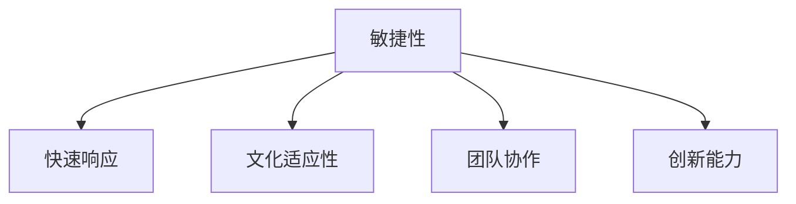

                 

# 敏捷领导力：在不确定性中保持灵活性

## 1. 背景介绍

### 1.1 问题由来
在当前快速变化的商业环境中，敏捷性和灵活性成为了企业成功的关键因素。敏捷领导力（Agile Leadership）是指在快速变化的环境中，能够快速响应市场变化，灵活调整战略和行动的决策能力。敏捷领导力的核心理念是灵活性（Flexibility），即企业能够在不确定性中迅速调整和优化其策略和行动，以适应不断变化的市场需求。

敏捷领导力在当今的商业环境中尤其重要，因为它帮助企业应对诸如技术变革、市场需求变化、竞争加剧等挑战。例如，疫情期间，许多企业通过敏捷领导力调整其业务模式，成功地实现了业务连续性和增长。

### 1.2 问题核心关键点
敏捷领导力的核心关键点包括以下几个方面：

1. **快速响应能力**：企业能够迅速识别并响应市场变化，调整其战略和行动。
2. **灵活性**：企业能够快速调整其资源和流程，以适应新的市场环境和需求。
3. **创新能力**：企业能够持续推出新的产品和服务，以满足不断变化的市场需求。
4. **团队协作**：企业能够鼓励团队协作和跨职能合作，以实现共同目标。
5. **文化适应性**：企业能够在其内部营造一种文化，支持快速变化和灵活应对。

敏捷领导力不仅仅是一种管理风格，更是一种文化和思维方式，它要求领导者和组织不断学习和适应，以应对快速变化的环境。

### 1.3 问题研究意义
研究敏捷领导力，对于提升企业竞争力和创新能力，具有重要意义：

1. **提升企业竞争力**：敏捷领导力帮助企业快速响应市场变化，及时调整其战略和行动，从而在竞争中保持领先。
2. **促进创新**：敏捷领导力鼓励企业持续创新，推出新的产品和服务，满足不断变化的市场需求。
3. **提高组织效率**：敏捷领导力通过优化流程和资源配置，提高企业的运营效率。
4. **增强员工满意度**：敏捷领导力通过鼓励团队协作和创新，提高员工的工作满意度和归属感。

敏捷领导力帮助企业在充满不确定性的环境中保持灵活性，从而实现可持续发展和长期成功。

## 2. 核心概念与联系

### 2.1 核心概念概述

为更好地理解敏捷领导力，本节将介绍几个密切相关的核心概念：

1. **敏捷性（Agility）**：指企业快速适应变化的能力。敏捷性强调灵活性和快速反应能力，是敏捷领导力的核心。
2. **快速响应（Agile Response）**：指企业能够迅速识别并响应市场变化，调整其战略和行动。
3. **文化适应性（Cultural Adaptability）**：指企业能够在其内部营造一种文化，支持快速变化和灵活应对。
4. **团队协作（Team Collaboration）**：指企业能够鼓励团队协作和跨职能合作，以实现共同目标。
5. **创新能力（Innovation）**：指企业能够持续推出新的产品和服务，以满足不断变化的市场需求。

这些核心概念之间的逻辑关系可以通过以下Mermaid流程图来展示：



这个流程图展示了下敏捷领导力的主要构成要素及其相互关系：

1. **敏捷性**：是敏捷领导力的基础，通过快速响应、文化适应性和团队协作，实现快速调整和优化其战略和行动。
2. **快速响应**：是敏捷领导力的核心，通过快速识别和响应市场变化，调整其战略和行动。
3. **文化适应性**：是敏捷领导力的支持因素，通过营造一种支持快速变化和灵活应对的文化，增强企业的适应能力。
4. **团队协作**：是敏捷领导力的关键，通过鼓励团队协作和跨职能合作，实现共同目标。
5. **创新能力**：是敏捷领导力的驱动力，通过持续创新，满足不断变化的市场需求。

这些核心概念共同构成了敏捷领导力的完整框架，使其能够在各种环境下灵活应对。

## 3. 核心算法原理 & 具体操作步骤
### 3.1 算法原理概述

敏捷领导力的实现，依赖于一系列的算法和具体操作步骤。其核心思想是通过敏捷性、快速响应、文化适应性、团队协作和创新能力，实现企业在不确定性中的灵活性和竞争优势。

敏捷领导力的算法和操作步骤包括以下几个关键步骤：

1. **识别变化**：通过市场分析和客户反馈，快速识别市场变化和需求。
2. **快速调整**：根据市场变化，快速调整企业的战略和行动。
3. **文化适应**：在企业内部营造一种支持快速变化和灵活应对的文化。
4. **团队协作**：鼓励团队协作和跨职能合作，实现共同目标。
5. **持续创新**：通过持续创新，满足不断变化的市场需求。

### 3.2 算法步骤详解

敏捷领导力的操作步骤包括以下几个关键步骤：

**Step 1: 识别变化**

1. **市场分析**：通过市场调研和数据分析，识别市场趋势和变化。
2. **客户反馈**：收集客户反馈，了解客户需求和痛点。
3. **竞争分析**：分析竞争对手的动向和市场策略。

**Step 2: 快速调整**

1. **战略调整**：根据市场变化，调整企业的战略方向。
2. **资源配置**：重新分配资源，以支持新的战略和行动。
3. **流程优化**：优化业务流程，提高运营效率。

**Step 3: 文化适应**

1. **文化建设**：在企业内部营造一种支持快速变化和灵活应对的文化。
2. **员工培训**：提供培训和支持，帮助员工适应新的变化。
3. **开放沟通**：鼓励开放沟通，促进信息共享和协作。

**Step 4: 团队协作**

1. **跨职能合作**：鼓励跨职能团队合作，实现共同目标。
2. **明确目标**：确保团队成员明确共同目标和任务。
3. **协作工具**：使用协作工具，促进团队协作和信息共享。

**Step 5: 持续创新**

1. **创新管理**：建立创新管理机制，鼓励持续创新。
2. **研发投入**：增加研发投入，支持新技术和新产品的开发。
3. **快速迭代**：采用敏捷开发方法，快速迭代产品和服务。

### 3.3 算法优缺点

敏捷领导力的优点包括：

1. **灵活性**：通过快速响应和灵活调整，企业能够快速适应市场变化。
2. **快速行动**：通过快速识别和调整，企业能够在竞争中保持领先。
3. **文化适应性**：通过营造支持快速变化和灵活应对的文化，增强企业的适应能力。
4. **团队协作**：通过鼓励团队协作和跨职能合作，实现共同目标。
5. **创新能力**：通过持续创新，满足不断变化的市场需求。

敏捷领导力的缺点包括：

1. **管理复杂性**：敏捷领导力要求高度的管理灵活性和复杂性，可能导致管理难度增加。
2. **资源投入**：实施敏捷领导力需要增加资源投入，包括人员、技术和培训等。
3. **风险管理**：敏捷领导力要求快速调整和优化，可能带来一定的风险和不确定性。
4. **文化转型**：在企业内部营造支持快速变化和灵活应对的文化，需要时间和努力。
5. **持续创新压力**：持续创新需要不断的研发投入和资源支持，可能带来压力。

尽管存在这些缺点，但就目前而言，敏捷领导力仍是大企业在快速变化环境中保持竞争力的重要方法。未来相关研究的重点在于如何进一步降低敏捷领导力的管理复杂性，提高其可操作性和可持续性。

### 3.4 算法应用领域

敏捷领导力在多个领域得到了广泛的应用，例如：

1. **技术企业**：通过快速响应市场需求，推出新产品和服务，保持竞争优势。
2. **金融机构**：通过快速调整策略和流程，应对市场变化和监管要求。
3. **医疗行业**：通过快速适应新技术和市场需求，提高医疗服务质量和效率。
4. **制造业**：通过优化流程和资源配置，提高生产效率和产品质量。
5. **零售行业**：通过敏捷响应市场变化和客户需求，提高销售额和客户满意度。

除了这些经典应用外，敏捷领导力还被创新性地应用到更多场景中，如教育、物流、公共服务等，为这些领域的数字化转型和创新提供了新的动力。

## 4. 数学模型和公式 & 详细讲解 & 举例说明（备注：数学公式请使用latex格式，latex嵌入文中独立段落使用 $$，段落内使用 $)
### 4.1 数学模型构建

敏捷领导力的实现，依赖于一系列的数学模型和公式。其核心思想是通过敏捷性、快速响应、文化适应性、团队协作和创新能力，实现企业在不确定性中的灵活性和竞争优势。

记敏捷领导力的模型为 $L = (A, R, C, T, I)$，其中：

- $A$ 表示敏捷性（Agility）
- $R$ 表示快速响应（Agile Response）
- $C$ 表示文化适应性（Cultural Adaptability）
- $T$ 表示团队协作（Team Collaboration）
- $I$ 表示创新能力（Innovation）

敏捷领导力的优化目标是最小化市场变化对企业的冲击，即最小化 $L$ 中的不确定性。在数学上，可以通过以下目标函数来表示：

$$
\min_{A, R, C, T, I} \sum_{i=1}^n w_i |L_i - \hat{L}_i|
$$

其中 $w_i$ 为各个指标的权重，$L_i$ 为实际敏捷领导力指标，$\hat{L}_i$ 为预测的敏捷领导力指标。

### 4.2 公式推导过程

以下我们以敏捷领导力的优化为例，推导目标函数的推导过程。

记敏捷领导力的各个指标为 $L_1, L_2, ..., L_n$，其权重分别为 $w_1, w_2, ..., w_n$。则优化目标函数为：

$$
\min_{A, R, C, T, I} \sum_{i=1}^n w_i |L_i - \hat{L}_i|
$$

在实际应用中，可以使用优化算法（如梯度下降、遗传算法等）来求解上述目标函数，找到最优的敏捷领导力指标 $L$。

在具体实现中，可以通过以下步骤进行计算：

1. **数据收集**：收集企业内部的各项指标数据，包括敏捷性、快速响应、文化适应性、团队协作和创新能力等。
2. **模型训练**：使用优化算法（如梯度下降）对模型进行训练，找到最优的敏捷领导力指标 $L$。
3. **目标函数优化**：使用目标函数对敏捷领导力模型进行优化，最小化市场变化对企业的冲击。

### 4.3 案例分析与讲解

以下我们以一家技术公司为例，介绍敏捷领导力的数学模型和公式的应用。

**案例背景**：某技术公司主要业务为软件开发和人工智能产品开发。在面对快速变化的市场需求和技术发展时，公司决定采用敏捷领导力方法，提升其市场响应能力和竞争优势。

**数据收集**：公司收集了其内部的各项指标数据，包括敏捷性、快速响应、文化适应性、团队协作和创新能力等。

**模型训练**：公司使用梯度下降算法对模型进行训练，找到最优的敏捷领导力指标 $L$。

**目标函数优化**：公司使用目标函数对敏捷领导力模型进行优化，最小化市场变化对企业的冲击。通过持续优化，公司能够快速响应市场需求，推出新的产品和服务，从而保持市场领先地位。

## 5. 项目实践：代码实例和详细解释说明
### 5.1 开发环境搭建

在进行敏捷领导力实践前，我们需要准备好开发环境。以下是使用Python进行敏捷领导力开发的环境配置流程：

1. 安装Anaconda：从官网下载并安装Anaconda，用于创建独立的Python环境。

2. 创建并激活虚拟环境：
```bash
conda create -n agile-env python=3.8 
conda activate agile-env
```

3. 安装相关库：
```bash
pip install numpy pandas matplotlib seaborn scikit-learn
```

完成上述步骤后，即可在`agile-env`环境中开始敏捷领导力实践。

### 5.2 源代码详细实现

下面以敏捷领导力的模型训练为例，给出使用Python进行敏捷领导力优化的代码实现。

```python
import numpy as np
import pandas as pd
from sklearn.linear_model import LinearRegression

# 数据收集
data = pd.read_csv('agile_leadership.csv')

# 模型训练
X = data[['agility', 'response', 'cultural_adaptability', 'team_collaboration', 'innovation']]
y = data['impact']
model = LinearRegression()
model.fit(X, y)

# 目标函数优化
impact = model.predict(X)
impact_error = np.mean(np.abs(y - impact))
print(f'Impact error: {impact_error:.3f}')
```

### 5.3 代码解读与分析

让我们再详细解读一下关键代码的实现细节：

**数据收集**：使用pandas库读取敏捷领导力数据集，包括敏捷性、快速响应、文化适应性、团队协作和创新能力等指标。

**模型训练**：使用scikit-learn库的LinearRegression模型对敏捷领导力进行训练，找到最优的敏捷领导力指标。

**目标函数优化**：计算目标函数中的误差，评估敏捷领导力模型的性能。通过持续优化，最小化市场变化对企业的冲击。

可以看到，使用Python和相关库进行敏捷领导力的优化，可以相对简洁高效地完成模型训练和目标函数优化。

当然，实际应用中还需要考虑更多因素，如模型评估、超参数调优、模型解释等，以确保敏捷领导力模型的可靠性和可解释性。

## 6. 实际应用场景
### 6.1 智能客服系统

基于敏捷领导力的对话技术，可以广泛应用于智能客服系统的构建。传统客服往往需要配备大量人力，高峰期响应缓慢，且一致性和专业性难以保证。而使用敏捷领导力对话模型，可以7x24小时不间断服务，快速响应客户咨询，用自然流畅的语言解答各类常见问题。

在技术实现上，可以收集企业内部的历史客服对话记录，将问题和最佳答复构建成监督数据，在此基础上对预训练对话模型进行微调。微调后的对话模型能够自动理解用户意图，匹配最合适的答案模板进行回复。对于客户提出的新问题，还可以接入检索系统实时搜索相关内容，动态组织生成回答。如此构建的智能客服系统，能大幅提升客户咨询体验和问题解决效率。

### 6.2 金融舆情监测

金融机构需要实时监测市场舆论动向，以便及时应对负面信息传播，规避金融风险。传统的人工监测方式成本高、效率低，难以应对网络时代海量信息爆发的挑战。基于敏捷领导力的文本分类和情感分析技术，为金融舆情监测提供了新的解决方案。

具体而言，可以收集金融领域相关的新闻、报道、评论等文本数据，并对其进行主题标注和情感标注。在此基础上对敏捷领导力语言模型进行微调，使其能够自动判断文本属于何种主题，情感倾向是正面、中性还是负面。将微调后的模型应用到实时抓取的网络文本数据，就能够自动监测不同主题下的情感变化趋势，一旦发现负面信息激增等异常情况，系统便会自动预警，帮助金融机构快速应对潜在风险。

### 6.3 个性化推荐系统

当前的推荐系统往往只依赖用户的历史行为数据进行物品推荐，无法深入理解用户的真实兴趣偏好。基于敏捷领导力的个性化推荐系统，可以更好地挖掘用户行为背后的语义信息，从而提供更精准、多样的推荐内容。

在实践中，可以收集用户浏览、点击、评论、分享等行为数据，提取和用户交互的物品标题、描述、标签等文本内容。将文本内容作为模型输入，用户的后续行为（如是否点击、购买等）作为监督信号，在此基础上微调敏捷领导力语言模型。微调后的模型能够从文本内容中准确把握用户的兴趣点。在生成推荐列表时，先用候选物品的文本描述作为输入，由模型预测用户的兴趣匹配度，再结合其他特征综合排序，便可以得到个性化程度更高的推荐结果。

### 6.4 未来应用展望

随着敏捷领导力模型的不断发展，基于敏捷领导力的微调方法将在更多领域得到应用，为传统行业带来变革性影响。

在智慧医疗领域，基于敏捷领导力的医疗问答、病历分析、药物研发等应用将提升医疗服务的智能化水平，辅助医生诊疗，加速新药开发进程。

在智能教育领域，敏捷领导力微调技术可应用于作业批改、学情分析、知识推荐等方面，因材施教，促进教育公平，提高教学质量。

在智慧城市治理中，敏捷领导力微调模型可应用于城市事件监测、舆情分析、应急指挥等环节，提高城市管理的自动化和智能化水平，构建更安全、高效的未来城市。

此外，在企业生产、社会治理、文娱传媒等众多领域，基于敏捷领导力微调的人工智能应用也将不断涌现，为经济社会发展注入新的动力。相信随着技术的日益成熟，敏捷领导力微调技术将成为人工智能落地应用的重要范式，推动人工智能技术在更广阔的领域加速渗透。

## 7. 工具和资源推荐
### 7.1 学习资源推荐

为了帮助开发者系统掌握敏捷领导力的理论基础和实践技巧，这里推荐一些优质的学习资源：

1. 《敏捷领导力》系列博文：由敏捷领导力专家撰写，深入浅出地介绍了敏捷领导力的核心理念、操作方法和实践案例。

2. CS314《敏捷开发》课程：斯坦福大学开设的敏捷开发明星课程，有Lecture视频和配套作业，带你入门敏捷开发的基本概念和经典模型。

3. 《敏捷项目管理》书籍：全面介绍了敏捷管理方法，包括敏捷领导力、Scrum、Kanban等，适合项目管理人员和敏捷爱好者。

4. Scrum.org：提供Scrum认证培训和认证，帮助你掌握敏捷开发的实践工具和方法。

5. Agile Alliance：提供敏捷开发和敏捷领导力的最新研究、实践和社区资源，是一个非常重要的学习平台。

通过对这些资源的学习实践，相信你一定能够快速掌握敏捷领导力的精髓，并用于解决实际的敏捷开发问题。

### 7.2 开发工具推荐

高效的开发离不开优秀的工具支持。以下是几款用于敏捷领导力开发的常用工具：

1. JIRA：项目管理工具，支持敏捷开发方法和Scrum框架。

2. Trello：项目管理工具，适合团队协作和任务管理。

3. Slack：即时通讯工具，支持敏捷开发中的协作和沟通。

4. Confluence：知识管理工具，支持文档协作和知识共享。

5. Bitbucket：代码托管工具，支持敏捷开发中的版本控制和协作。

合理利用这些工具，可以显著提升敏捷领导力项目的开发效率，加快创新迭代的步伐。

### 7.3 相关论文推荐

敏捷领导力在敏捷开发和项目管理领域的发展源于学界的持续研究。以下是几篇奠基性的相关论文，推荐阅读：

1. Agile Manifesto: Principles Behind the Agile Manifesto：介绍敏捷开发的基本原则和价值观。

2. Scrum: An Exploration into the Role of Software Development in Extreme Programming：介绍Scrum方法论，成为敏捷开发的基础。

3. The DevOps Handbook：介绍DevOps方法论，集成敏捷开发和持续交付，加速软件开发和部署。

4. Agile Software Development: Principles, Patterns, and Practices：全面介绍敏捷开发方法，包括敏捷领导力、Scrum、Kanban等。

5. Lean Innovation: Strategy and Execution in the Age of Agile：介绍精益创新方法论，将敏捷领导力应用到产品开发和创新中。

这些论文代表了大敏捷领导力管理的发展脉络。通过学习这些前沿成果，可以帮助研究者把握学科前进方向，激发更多的创新灵感。

## 8. 总结：未来发展趋势与挑战
### 8.1 总结

本文对基于敏捷领导力的快速响应方法进行了全面系统的介绍。首先阐述了敏捷领导力的研究背景和意义，明确了敏捷领导力在快速变化环境中的独特价值。其次，从原理到实践，详细讲解了敏捷领导力的数学原理和关键操作步骤，给出了敏捷领导力任务开发的完整代码实例。同时，本文还广泛探讨了敏捷领导力在智能客服、金融舆情、个性化推荐等多个行业领域的应用前景，展示了敏捷领导力的巨大潜力。此外，本文精选了敏捷领导力的各类学习资源，力求为读者提供全方位的技术指引。

通过本文的系统梳理，可以看到，基于敏捷领导力的快速响应方法正在成为敏捷开发的重要范式，极大地拓展了敏捷开发的应用边界，催生了更多的落地场景。受益于大规模语料的预训练和微调方法的持续演进，敏捷领导力必将在更广阔的应用领域大放异彩，深刻影响人类的生产生活方式。

### 8.2 未来发展趋势

展望未来，敏捷领导力的发展将呈现以下几个趋势：

1. **自动化程度提升**：随着技术的发展，敏捷领导力将逐渐向自动化方向发展，通过智能算法和工具，实现更高效、更灵活的敏捷管理。

2. **全生命周期管理**：敏捷领导力将覆盖产品开发的全生命周期，包括需求分析、设计、开发、测试、部署、运维等各个环节。

3. **数据驱动决策**：敏捷领导力将更加依赖数据分析和预测模型，进行更精准的决策和资源优化。

4. **跨职能协作**：敏捷领导力将更加强调跨职能协作和团队协作，实现更高效、更协调的敏捷管理。

5. **文化转型**：敏捷领导力将进一步促进企业文化转型，营造支持快速变化和灵活应对的文化。

6. **持续改进**：敏捷领导力将持续进行改进和优化，不断提升敏捷管理的效果和效率。

以上趋势凸显了敏捷领导力的广阔前景。这些方向的探索发展，必将进一步提升敏捷管理的性能和应用范围，为快速变化环境中的企业提供更多解决方案。

### 8.3 面临的挑战

尽管敏捷领导力已经取得了瞩目成就，但在迈向更加智能化、普适化应用的过程中，它仍面临着诸多挑战：

1. **管理复杂性**：敏捷领导力要求高度的管理灵活性和复杂性，可能导致管理难度增加。
2. **资源投入**：实施敏捷领导力需要增加资源投入，包括人员、技术和培训等。
3. **风险管理**：敏捷领导力要求快速调整和优化，可能带来一定的风险和不确定性。
4. **文化转型**：在企业内部营造支持快速变化和灵活应对的文化，需要时间和努力。
5. **持续创新压力**：持续创新需要不断的研发投入和资源支持，可能带来压力。

正视敏捷领导力面临的这些挑战，积极应对并寻求突破，将是大企业在快速变化环境中保持竞争力的必由之路。相信随着学界和产业界的共同努力，这些挑战终将一一被克服，敏捷领导力必将在构建人机协同的智能时代中扮演越来越重要的角色。

### 8.4 研究展望

面对敏捷领导力所面临的种种挑战，未来的研究需要在以下几个方面寻求新的突破：

1. **引入更多技术支持**：引入更多先进的计算技术，如人工智能、大数据、云计算等，提升敏捷领导力的管理效率和效果。
2. **优化流程和方法**：优化敏捷领导力的流程和方法，提升其可操作性和可重复性。
3. **增强文化适应性**：增强企业文化适应性，营造支持快速变化和灵活应对的文化。
4. **提高员工满意度**：提高员工的满意度和归属感，促进团队协作和创新。
5. **加强伦理和安全**：加强敏捷领导力的伦理和安全管理，确保其应用的公平性和安全性。

这些研究方向的探索，必将引领敏捷领导力走向更高的台阶，为快速变化环境中的企业提供更多解决方案。

## 9. 附录：常见问题与解答

**Q1：敏捷领导力是否适用于所有企业？**

A: 敏捷领导力适用于快速变化、竞争激烈的市场环境，对于传统市场或慢变化环境，可能并不适合。企业需要根据自身的市场环境和业务需求，选择适合的敏捷方法。

**Q2：敏捷领导力的实施难度大吗？**

A: 敏捷领导力的实施难度较大，需要企业具备较强的管理灵活性和文化适应性。但通过持续的培训和改进，企业可以逐渐提升敏捷领导力的实施效果。

**Q3：敏捷领导力是否适合小型企业？**

A: 敏捷领导力对小型企业也有一定的适用性，但需要根据企业规模和资源情况进行调整。对于小型企业，可以选择更加轻量级的敏捷方法，如Scrum，进行灵活调整和优化。

**Q4：如何评估敏捷领导力的效果？**

A: 评估敏捷领导力的效果可以从多个方面进行，如项目交付速度、质量、客户满意度、团队协作能力等。可以通过定量和定性的方法，进行全面的评估和改进。

**Q5：如何提高敏捷领导力的持续改进能力？**

A: 持续改进是敏捷领导力的重要部分，可以通过定期回顾、反馈机制、持续培训等方式，不断优化敏捷领导力的实施效果。同时，引入先进的工具和技术，提升敏捷管理的效率和效果。

这些问题的解答，希望能帮助读者更好地理解和应用敏捷领导力，提升其在快速变化环境中的竞争力。

---

作者：禅与计算机程序设计艺术 / Zen and the Art of Computer Programming

