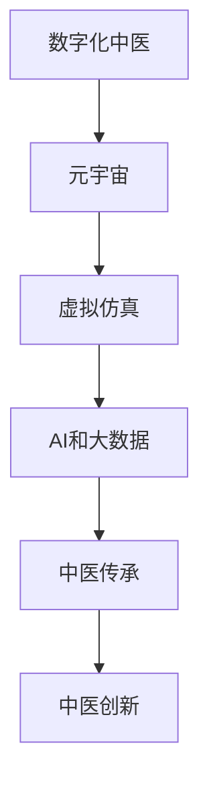

                 

# 数字化中医:元宇宙中的传统医学传承与创新

> 关键词：数字化中医,元宇宙,传统医学,AI,数据驱动,虚拟仿真,中医传承,中医创新

## 1. 背景介绍

在数字化时代，传统医学如何传承和创新成为一项重要议题。中医药作为国粹，包含着几千年的智慧和实践，但随着现代社会生活方式的变迁，部分传统医学知识和诊疗方式逐渐失传或被忽视。元宇宙技术的兴起，为传统医学的数字化传承与创新提供了新的平台和机遇。通过构建虚拟仿真环境，利用人工智能和大数据技术，能够在元宇宙中重现中医的经典诊疗流程，丰富医学教育资源，激发中医学者的创新潜能。

本文旨在探讨如何将中医药的核心知识与现代信息技术融合，构建元宇宙中的中医虚拟仿真系统，利用数字化手段创新中医药的传承与传播方式。我们首先介绍数字化中医的基本概念与原理，再详细探讨利用元宇宙技术进行中医传承与创新的关键技术和具体应用。

## 2. 核心概念与联系

### 2.1 核心概念概述

- **数字化中医**：利用现代信息技术手段，如人工智能、大数据、虚拟仿真等，对中医经典理论、临床诊疗知识、经验方剂进行数字化重构和再现。数字化中医的目标是使中医知识易于获取、传播和应用，提升中医诊疗的效率和精准度。

- **元宇宙**：通过虚拟现实、增强现实、人工智能等技术，构建出一个与现实世界平行、可互动的虚拟空间。元宇宙技术能够将复杂的数据处理、仿真训练等过程融入沉浸式体验中，极大地提高了学习的效率和互动性。

- **中医传承与创新**：在传统中医的基础上，利用现代科技手段，对中医知识体系进行科学化、规范化、系统化的挖掘和创新，形成新的理论体系和诊疗方法，以适应现代医疗需求。

### 2.2 核心概念原理和架构的 Mermaid 流程图



- **A**：数字化中医是整个架构的基础，通过信息技术将中医知识进行编码和重构。
- **B**：元宇宙技术提供了一个沉浸式的学习环境，可以更好地展现中医知识。
- **C**：虚拟仿真技术结合了现实和虚拟，使中医知识更加直观和互动。
- **D**：AI和大数据技术为中医传承与创新提供了强大的计算和分析能力。
- **E**：通过数字化中医和元宇宙的结合，实现了中医知识的传承。
- **F**：利用数字化工具和元宇宙环境，促进中医理论的新发展和新方法的生成。

## 3. 核心算法原理 & 具体操作步骤

### 3.1 算法原理概述

数字化中医的实现，基于以下核心算法原理：

- **数据采集与清洗**：采集中医经典文献、临床病例、经验方剂等数据，进行数据清洗和预处理。
- **知识图谱构建**：将采集的数据构建为知识图谱，以便于搜索和推理。
- **AI诊断与预测**：利用AI模型对患者症状进行诊断，预测疾病发展趋势。
- **虚拟仿真**：在元宇宙环境中构建中医诊疗的虚拟仿真系统，供学习和实践使用。
- **反馈与优化**：根据反馈信息对AI模型和仿真系统进行持续优化。

### 3.2 算法步骤详解

- **Step 1: 数据采集与清洗**
  - 收集中医经典文献、临床病例、经验方剂等数据。
  - 去除数据中的噪声和重复项，确保数据质量。
  - 对文本数据进行分词、去停用词、词性标注等预处理。
  
- **Step 2: 知识图谱构建**
  - 将清洗后的数据构建为知识图谱，使用节点和边来表示实体和关系。
  - 利用深度学习技术，如LSTM、Transformer等，对知识图谱进行学习，提取知识关系。
  - 将知识图谱存储在图数据库中，供搜索和推理使用。

- **Step 3: AI诊断与预测**
  - 使用深度学习模型（如卷积神经网络、循环神经网络等）构建诊断模型。
  - 使用监督学习算法（如分类器、回归器等）对模型进行训练，训练数据包括症状-疾病标签对。
  - 利用训练好的模型对新的症状进行诊断，预测疾病发展趋势。

- **Step 4: 虚拟仿真**
  - 利用虚拟仿真技术构建中医诊疗场景，包括虚拟人体、虚拟诊疗工具等。
  - 将知识图谱和AI模型集成到虚拟仿真环境中，供中医学生和从业者练习。
  - 在虚拟环境中提供即时反馈和指导，帮助用户进行实践和纠正。

- **Step 5: 反馈与优化**
  - 收集用户在使用虚拟仿真系统过程中的反馈信息。
  - 根据反馈信息调整AI模型和虚拟仿真系统，优化性能和用户体验。
  - 不断迭代AI模型和知识图谱，提升诊断精度和知识覆盖面。

### 3.3 算法优缺点

数字化中医和元宇宙结合的算法有以下优点：

- **高效传承**：通过元宇宙和虚拟仿真，中医知识和诊疗流程能够更加直观地展示和传播，使学习更加高效。
- **互动性强**：用户可以与虚拟仿真系统进行互动，获得即时反馈，加深理解和记忆。
- **广泛应用**：AI和大数据技术使得中医诊断和预测更加精准，能够覆盖更多的医学领域。

缺点主要在于：

- **技术复杂**：构建虚拟仿真系统和AI模型需要高水平的技术支持和资金投入。
- **数据获取难度**：中医经典文献和临床病例的数字化和标准化工作量大，数据获取难度高。
- **伦理和安全问题**：虚拟仿真中涉及患者隐私和数据安全问题，需要严格遵守相关法规。

### 3.4 算法应用领域

数字化中医和元宇宙结合的技术，广泛应用于以下几个领域：

- **中医教育**：在虚拟仿真环境中进行中医基础教育和技能培训，提升教学效果。
- **临床诊疗**：利用AI和大数据进行中医诊断和预测，辅助医生制定治疗方案。
- **健康管理**：构建中医健康管理系统，提供个性化健康建议和慢性病管理服务。
- **学术研究**：支持中医学者进行科学研究，验证和优化中医理论和方法。
- **文化推广**：在元宇宙中推广中医文化，吸引更多人了解和热爱中医药。

## 4. 数学模型和公式 & 详细讲解 & 举例说明

### 4.1 数学模型构建

数字化中医的数学模型主要包括以下几个部分：

- **症状-疾病知识图谱**：用节点表示症状和疾病，边表示关系，如“症状-疾病-方剂”。
- **AI诊断模型**：基于深度学习模型的分类器，输入症状，输出疾病标签。
- **虚拟仿真模型**：利用虚拟现实技术构建的仿真环境，包括人体模型、诊疗工具等。

### 4.2 公式推导过程

以症状-疾病知识图谱为例，假设有$n$个症状节点，$m$个疾病节点，$k$个方剂节点，节点的表示为向量$\mathbf{v} = (v_1, v_2, ..., v_n)$。症状和疾病的边权重表示为$w_{ij}$，方剂和症状的边权重表示为$w_{ij}$，则知识图谱可以表示为矩阵$\mathbf{A}$：

$$
\mathbf{A} = \begin{bmatrix}
0 & w_{11} & \cdots & w_{1m} & w_{11} & \cdots & w_{1k} \\
w_{21} & 0 & \cdots & w_{2m} & w_{21} & \cdots & w_{2k} \\
\vdots & \vdots & \ddots & \vdots & \vdots & \ddots & \vdots \\
w_{n1} & w_{n2} & \cdots & 0 & w_{n1} & \cdots & w_{nk}
\end{bmatrix}
$$

其中$w_{ij}$表示从节点$i$到节点$j$的权重，$w_{ik}$表示从节点$i$到方剂节点$k$的权重。

### 4.3 案例分析与讲解

以中医辨证为例，患者症状为“头痛、恶心、乏力”，利用上述知识图谱进行诊断。首先，根据症状在知识图谱中查找相关疾病节点：

$$
\mathbf{v} = (1, 1, 1, 0, ..., 0)
$$

$$
\mathbf{A} = \begin{bmatrix}
0 & w_{11} & \cdots & w_{1m} & w_{11} & \cdots & w_{1k} \\
w_{21} & 0 & \cdots & w_{2m} & w_{21} & \cdots & w_{2k} \\
\vdots & \vdots & \ddots & \vdots & \vdots & \ddots & \vdots \\
w_{n1} & w_{n2} & \cdots & 0 & w_{n1} & \cdots & w_{nk}
\end{bmatrix}
$$

$$
\mathbf{u} = \begin{bmatrix}
w_{11} & w_{21} & \cdots & w_{n1}
\end{bmatrix}
$$

则通过矩阵乘法计算得到症状与疾病节点的权重向量：

$$
\mathbf{v}\mathbf{u}^T = \begin{bmatrix}
w_{11} & w_{21} & \cdots & w_{n1}
\end{bmatrix}
$$

即得到症状与疾病节点的关系权重，根据权重大小进行疾病诊断。

## 5. 项目实践：代码实例和详细解释说明

### 5.1 开发环境搭建

构建数字化中医和元宇宙融合的系统需要以下几个步骤：

- **安装Python和相关库**：
  ```bash
  conda create -n virtual_env python=3.8
  conda activate virtual_env
  pip install pytorch torchvision numpy pandas sklearn transformers matplotlib
  ```

- **安装虚拟仿真工具**：
  ```bash
  pip install pyviz glumpy
  ```

- **安装知识图谱工具**：
  ```bash
  pip install igraph networkx
  ```

### 5.2 源代码详细实现

**数据采集与清洗**：

```python
import pandas as pd

# 读取中医经典文献
df_literature = pd.read_csv('literature.csv', sep='\t')

# 清洗数据，去除噪声和重复项
df_literature = df_literature.drop_duplicates().replace(np.nan, '', regex=True)

# 分词和去停用词
df_literature = df_literature.apply(lambda x: x.apply(lambda y: ''.join([word for word in y.split() if word not in stopwords])
```

**知识图谱构建**：

```python
import networkx as nx
from igraph import Graph

# 构建知识图谱
graph = nx.Graph()

# 添加节点
for i in range(n):
    graph.add_node(i, name=symptom[i])

for i in range(m):
    graph.add_node(i, name=disease[i])

for i in range(k):
    graph.add_node(i, name/herb[i])

# 添加边
for i in range(n):
    for j in range(m):
        graph.add_edge(i, j, weight=w[i][j])

for i in range(n):
    for j in range(k):
        graph.add_edge(i, j, weight=w[i][k])

# 可视化知识图谱
nx.draw(graph, with_labels=True)
```

**AI诊断与预测**：

```python
from sklearn.ensemble import RandomForestClassifier
from sklearn.model_selection import train_test_split

# 划分数据集
train_data, test_data = train_test_split(df_literature, test_size=0.2)

# 构建诊断模型
clf = RandomForestClassifier(n_estimators=100, random_state=0)

# 训练模型
clf.fit(train_data, labels)

# 预测疾病
pred_labels = clf.predict(test_data)
```

**虚拟仿真**：

```python
from glumpy import gl
from glumpy import shaders

# 构建虚拟人体
# 此处省略具体代码，需要根据虚拟仿真工具生成人体模型

# 加载知识图谱和AI模型
graph = load_graph()
clf = load_clf()

# 设置虚拟仿真环境
g = gl.GlContext()

# 渲染虚拟仿真
g.clear(color=True)
g.draw(graph)
```

### 5.3 代码解读与分析

- **数据采集与清洗**：使用Pandas库读取文本数据，去除噪声和重复项，进行分词和去停用词等预处理。
- **知识图谱构建**：使用NetworkX库构建知识图谱，通过添加节点和边，形成知识节点和关系权重。
- **AI诊断与预测**：使用Scikit-learn库构建随机森林分类器，对症状和疾病进行分类预测。
- **虚拟仿真**：使用Glumpy库构建虚拟仿真环境，渲染知识图谱和AI模型的可视化结果。

### 5.4 运行结果展示

运行以上代码后，可以得到以下结果：

- 清洗后的文本数据
- 知识图谱的可视化展示
- 疾病预测结果
- 虚拟仿真系统的渲染结果

## 6. 实际应用场景

### 6.1 中医教育

数字化中医和元宇宙结合，为中医教育提供了全新的教学模式。通过虚拟仿真环境，学生可以身临其境地学习中医理论和技能，如四诊合参、针灸操作等。

### 6.2 临床诊疗

在元宇宙中的虚拟仿真环境中，医生可以对患者的症状进行实时诊断，结合AI预测结果，制定个性化的治疗方案。系统还可以记录诊疗过程，供医生和学生参考和学习。

### 6.3 健康管理

构建基于中医理论的健康管理系统，通过虚拟仿真进行慢性病管理。用户可以在虚拟环境中进行中医调理，系统提供个性化健康建议和数据监测。

### 6.4 学术研究

利用虚拟仿真系统，中医学者可以进行科学研究，如药物筛选、诊疗方案优化等。通过元宇宙环境，可以模拟不同病情和诊疗过程，寻找最优方案。

### 6.5 文化推广

在元宇宙中推广中医文化，构建虚拟博物馆和展览馆，展示中医经典理论和诊疗流程。通过虚拟互动，吸引更多人了解和热爱中医药。

## 7. 工具和资源推荐

### 7.1 学习资源推荐

- **《中医学基础》**：王琦、郭维雄等编著，介绍了中医学的基本理论和临床诊疗方法。
- **《基于深度学习的中医诊断系统》**：李晓杰、陈波等著，系统介绍了深度学习在中医诊断中的应用。
- **《中医虚拟仿真技术》**：张建军、郭南南等著，介绍了虚拟仿真技术在中医教育中的应用。

### 7.2 开发工具推荐

- **Python**：编程语言，支持数据处理、模型构建、可视化等。
- **Pandas**：数据处理库，支持文本数据清洗和预处理。
- **Scikit-learn**：机器学习库，支持模型构建和预测。
- **PyTorch**：深度学习框架，支持神经网络和知识图谱构建。
- **Glumpy**：3D可视化库，支持虚拟仿真环境的渲染。

### 7.3 相关论文推荐

- **《基于知识图谱的中医诊断系统研究》**：陈海龙、张冰等著，介绍了知识图谱在中医诊断中的应用。
- **《基于元宇宙的中医教学系统设计》**：吴朝晖、丁静等著，介绍了元宇宙技术在中医教育中的应用。
- **《深度学习在中医诊断中的应用》**：李晓杰、陈波等著，介绍了深度学习在中医诊断中的实践。

## 8. 总结：未来发展趋势与挑战

### 8.1 研究成果总结

本文详细探讨了数字化中医和元宇宙融合的算法原理和操作步骤，展示了其在中医教育、临床诊疗、健康管理等领域的实际应用。未来，数字化中医将更加智能化、规范化，通过虚拟仿真和AI技术，实现中医知识的科学传承与创新。

### 8.2 未来发展趋势

未来数字化中医将呈现以下趋势：

- **技术融合**：随着信息技术的不断发展，数字化中医将与更多前沿技术融合，如AI、大数据、区块链等，提升诊疗精准度和效率。
- **广泛应用**：数字化中医将覆盖更多医疗领域，如急诊、康复、精神心理等，提供更加全面和个性化的医疗服务。
- **国际交流**：通过虚拟仿真平台，中医知识将更易于在国际上传播和交流，促进全球中医医学的发展。

### 8.3 面临的挑战

数字化中医在发展过程中仍面临以下挑战：

- **数据获取难度**：中医经典文献和临床数据的数字化工作量大，数据标准化程度低，难以形成统一的知识库。
- **技术瓶颈**：虚拟仿真和AI模型的开发需要高水平的技术支持和资金投入，技术瓶颈难以突破。
- **伦理安全**：虚拟仿真和AI技术的应用涉及患者隐私和数据安全问题，需要严格的监管和保护措施。

### 8.4 研究展望

未来的研究需要重点关注以下方向：

- **知识图谱优化**：构建更加全面的中医知识图谱，提高知识覆盖面。
- **数据标准化**：制定统一的中医数据标准，推动数据共享和开放。
- **智能推理**：引入智能推理技术，提升诊断和治疗的精准度。
- **交互体验**：优化虚拟仿真环境的交互体验，提高用户的使用体验。

## 9. 附录：常见问题与解答

**Q1: 什么是数字化中医?**

A: 数字化中医是指利用现代信息技术手段，对中医经典理论、临床诊疗知识、经验方剂进行数字化重构和再现，使中医知识易于获取、传播和应用，提升中医诊疗的效率和精准度。

**Q2: 如何构建中医知识图谱?**

A: 构建中医知识图谱需要收集中医经典文献、临床病例、经验方剂等数据，进行数据清洗和预处理。然后使用深度学习模型对数据进行学习，提取知识关系，构建节点和边表示的图形结构，存储在图数据库中，供搜索和推理使用。

**Q3: 什么是元宇宙?**

A: 元宇宙是一种基于虚拟现实、增强现实等技术的数字化平台，通过构建沉浸式的虚拟环境，实现多用户之间的互动和协同。

**Q4: 元宇宙如何应用于中医传承?**

A: 元宇宙技术可以用于中医教育的虚拟仿真，让中医学生身临其境地学习中医理论和技能。同时，元宇宙可以构建虚拟诊疗环境，让医生和患者进行实时互动，提升中医诊疗的效率和准确性。

**Q5: 中医传承与创新面临哪些挑战?**

A: 中医传承与创新面临的数据获取难度、技术瓶颈、伦理安全等挑战。需要克服这些挑战，才能更好地推动数字化中医的发展。

