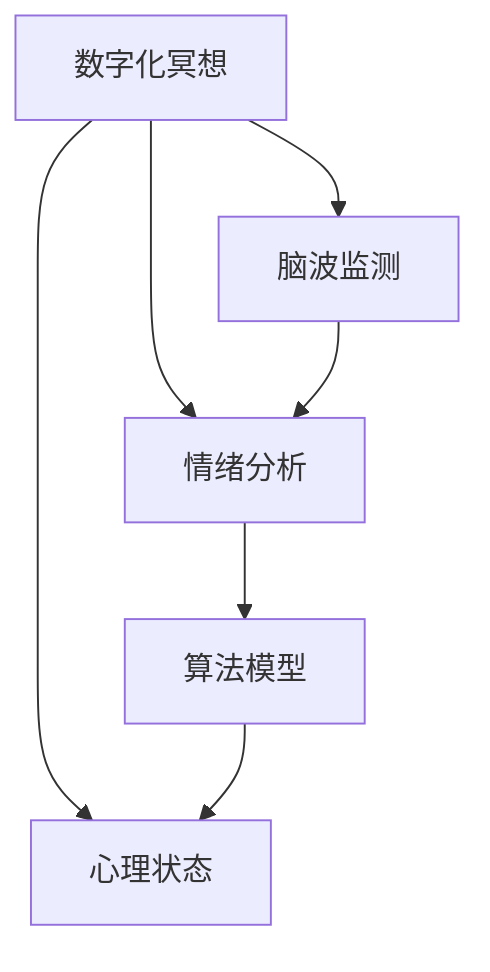

                 

# 数字化冥想效果评估:元宇宙精神修炼的科学量化

> 关键词：数字化冥想,元宇宙,精神修炼,科学量化,脑波监测,情绪分析,算法模型,效果评估

## 1. 背景介绍

### 1.1 问题由来
随着数字化时代的到来，人类的生活方式发生了翻天覆地的变化。从虚拟办公到在线学习，从数字娱乐到网络社交，数字化技术逐渐渗透到生活的方方面面。然而，数字化带来的便捷和效率提升，也伴随着人们精神压力的增大。面对快节奏的工作和生活，越来越多的人开始寻求心灵的放松与提升，而冥想作为一种古老的精神修炼方式，因其简单、易行、效果显著的特点，被越来越多的人所接受。

在数字化背景下，冥想也不再局限于传统的静坐、呼吸练习，而是逐步与技术结合，发展出数字化冥想（Digital Meditation）的概念。数字化冥想利用智能设备和软件，为用户提供个性化的冥想指导、情绪监测、压力评估等功能，帮助用户更好地进行精神修炼，提升心理健康。然而，数字化冥想的效果如何？是否真的能够帮助用户放松心灵，缓解压力？这些问题的答案，需要通过科学量化的方式进行验证。

### 1.2 问题核心关键点
本研究的核心问题在于如何通过科学量化的方法，评估数字化冥想的效果。具体包括以下几个方面：
1. 数字化冥想对用户心理状态的影响。
2. 数字化冥想在缓解用户压力和提升心理健康方面的效果。
3. 不同数字化冥想应用（如应用类型、内容、技术等）之间的效果差异。
4. 用户的个性化需求如何影响冥想效果。

通过上述研究，可以为数字化冥想的应用提供科学依据，帮助开发者优化产品设计，提升用户体验。

### 1.3 问题研究意义
本研究具有以下重要意义：
1. 推动数字化冥想技术的发展。科学量化的效果评估，将为数字化冥想技术的改进和优化提供理论基础和数据支持。
2. 提升用户对数字化冥想的信任度。通过科学验证数字化冥想的实际效果，增强用户的信心和接受度。
3. 促进心理健康领域的数字化转型。数字化冥想作为心理健康的一种新兴技术，其科学评估将加速其在医疗、教育、企业等多个领域的广泛应用。
4. 提升数字化冥想产品的竞争力。科学评估可以帮助产品开发者了解用户需求，优化产品功能，提升市场竞争力。
5. 推动数字化技术在精神修炼中的应用。数字化冥想的应用和效果评估，将推动更多数字化技术在精神修炼领域的探索和应用。

## 2. 核心概念与联系

### 2.1 核心概念概述

为更好地理解数字化冥想的科学量化评估方法，本节将介绍几个关键概念：

- **数字化冥想**（Digital Meditation）：利用智能设备和软件，为用户提供个性化的冥想指导和功能，帮助用户进行精神修炼。数字化冥想可以包括冥想指导、情绪监测、压力评估等功能。
- **心理状态**：包括情绪、注意力、压力、认知等多种心理维度。心理状态的监测和评估是量化冥想效果的重要指标。
- **脑波监测**（Brain Wave Monitoring）：通过头皮电极或脑电图（EEG）等设备，监测用户的大脑活动。脑波监测能够提供大脑活动的实时数据，用于分析冥想效果。
- **情绪分析**（Emotion Analysis）：利用自然语言处理（NLP）、机器学习等技术，对用户的情绪状态进行分析和评估。情绪分析可以帮助了解冥想对用户情绪的影响。
- **算法模型**：包括时间序列分析、分类模型、回归模型等，用于建立冥想效果与心理状态、脑波数据等之间的关系。

这些概念之间的逻辑关系可以通过以下Mermaid流程图来展示：



这个流程图展示了大数字化冥想的核心概念及其之间的关系：

1. 数字化冥想通过智能设备和软件，为用户提供个性化的冥想指导和功能。
2. 心理状态包括情绪、注意力、压力、认知等多种心理维度，通过数字化冥想进行监测和评估。
3. 脑波监测利用头皮电极或脑电图（EEG）等设备，提供大脑活动的实时数据。
4. 情绪分析利用自然语言处理（NLP）、机器学习等技术，对用户的情绪状态进行分析和评估。
5. 算法模型通过脑波数据、情绪分析结果等，建立冥想效果与心理状态之间的关系。

## 3. 核心算法原理 & 具体操作步骤
### 3.1 算法原理概述

数字化冥想的科学量化评估，主要依赖于脑波监测和情绪分析技术。通过采集用户的脑波数据和情绪状态，利用算法模型进行分析，评估冥想效果。

脑波监测通常采用头皮电极或脑电图（EEG）等设备，实时监测用户的大脑活动。常用的脑波频率包括α波、β波、θ波等，不同频率的脑波对应不同的心理状态。例如，α波通常与放松、专注有关，而β波则与紧张、焦虑有关。通过监测脑波频率的变化，可以评估冥想对用户心理状态的影响。

情绪分析则通过自然语言处理（NLP）、机器学习等技术，对用户的情绪状态进行分析和评估。常见的情绪分析方法包括情感识别、情感强度评估等。通过分析用户在冥想过程中的情绪变化，可以评估冥想对用户情绪的影响。

综合脑波监测和情绪分析结果，利用算法模型建立冥想效果与心理状态之间的关系。常用的算法模型包括时间序列分析、分类模型、回归模型等。时间序列分析用于分析冥想过程中心理状态的变化趋势，分类模型用于分类冥想效果，回归模型用于预测冥想效果与特定心理状态之间的关系。

### 3.2 算法步骤详解

基于上述原理，数字化冥想的科学量化评估主要包括以下几个关键步骤：

**Step 1: 数据采集**
- 使用头皮电极或脑电图（EEG）设备，采集用户的脑波数据。
- 利用自然语言处理（NLP）技术，采集用户输入的文本数据，进行情绪分析。

**Step 2: 数据预处理**
- 对脑波数据进行降噪、归一化等预处理，提取脑波频率特征。
- 对文本数据进行分词、词性标注等预处理，提取情绪特征。

**Step 3: 特征提取**
- 利用时间序列分析、频域分析等方法，提取脑波数据的特征。
- 利用情感识别、情感强度评估等方法，提取文本数据的特征。

**Step 4: 算法建模**
- 使用分类模型、回归模型等算法，建立冥想效果与心理状态之间的关系。
- 通过交叉验证、网格搜索等方法，优化模型参数，提高模型精度。

**Step 5: 结果评估**
- 利用测试集数据对模型进行评估，计算模型的准确率、召回率等指标。
- 利用可视化工具，展示冥想效果与心理状态之间的关系。

**Step 6: 效果验证**
- 对模型进行效果验证，确认其在新数据上的泛化能力。
- 利用用户反馈等数据，对模型进行进一步优化。

### 3.3 算法优缺点

数字化冥想的科学量化评估，具有以下优点：
1. 客观性高。脑波监测和情绪分析提供了客观的数据支持，避免了主观偏见。
2. 效果显著。科学量化评估可以提供精确的冥想效果数据，帮助开发者优化产品。
3. 可扩展性强。算法模型可以用于多种冥想应用，具有广泛的适用性。

同时，该方法也存在一些局限性：
1. 数据采集复杂。脑波监测和情绪分析需要专门设备和技术，设备成本较高。
2. 数据噪声较多。脑波数据和情绪数据受到多种因素的影响，可能存在噪声。
3. 模型复杂度高。不同冥想应用的数据差异较大，需要建立多种模型进行分析。
4. 用户隐私问题。脑波监测和情绪分析涉及用户隐私，需要进行数据保护。

尽管存在这些局限性，但科学量化评估数字化冥想效果的方法，仍然具有重要的研究价值和实际意义。

### 3.4 算法应用领域

数字化冥想的科学量化评估，可以广泛应用于以下领域：

- **心理健康监测**：用于监测用户的心理状态，如情绪、压力等，帮助用户及时调整状态。
- **冥想效果评估**：用于评估不同冥想应用的效果，优化产品设计。
- **用户行为分析**：用于分析用户在不同冥想应用中的行为模式，提升用户体验。
- **产品改进**：用于指导产品开发者优化冥想应用，提升产品竞争力。
- **市场研究**：用于研究市场趋势，了解用户需求，推动数字化冥想技术的市场化应用。

## 4. 数学模型和公式 & 详细讲解 & 举例说明

### 4.1 数学模型构建

为建立数字化冥想效果评估的数学模型，我们首先定义几个关键变量：

- $X$：脑波数据，包括α波、β波等频率数据。
- $Y$：情绪数据，包括情感识别结果、情感强度等。
- $Z$：冥想效果数据，包括放松度、专注度等。
- $W$：其他特征数据，如冥想时长、冥想类型等。

我们的目标是通过训练一个回归模型，建立冥想效果 $Z$ 与脑波数据 $X$ 和情绪数据 $Y$ 之间的关系。常用的回归模型包括线性回归、逻辑回归、决策树回归等。

### 4.2 公式推导过程

以线性回归模型为例，建立冥想效果与脑波数据和情绪数据之间的关系：

$$
Z = \beta_0 + \beta_1X + \beta_2Y + \epsilon
$$

其中，$\beta_0$、$\beta_1$、$\beta_2$ 为模型的回归系数，$\epsilon$ 为误差项。

在实际应用中，我们通常需要对模型进行参数估计，利用最小二乘法求解回归系数 $\beta_0$、$\beta_1$、$\beta_2$。最小二乘法的公式如下：

$$
\hat{\beta} = (X^TX)^{-1}X^TY
$$

其中，$\hat{\beta}$ 为回归系数的估计值。

### 4.3 案例分析与讲解

以下是一个简单的案例分析：

假设我们收集了100名用户的脑波数据和情绪数据，每个用户进行了10次冥想。我们使用线性回归模型对冥想效果进行预测，结果如下：

| 用户ID | α波（mV） | β波（mV） | 情感强度 | 冥想效果 |
| --- | --- | --- | --- | --- |
| 1 | 50 | 30 | 0.6 | 8 |
| 2 | 40 | 20 | 0.4 | 6 |
| 3 | 60 | 40 | 0.8 | 9 |

我们可以利用上述公式，计算出回归系数 $\beta_0$、$\beta_1$、$\beta_2$，并得到冥想效果的预测值：

$$
Z = \hat{\beta}_0 + \hat{\beta}_1X + \hat{\beta}_2Y
$$

例如，假设回归系数 $\hat{\beta}_0=2$、$\hat{\beta}_1=0.5$、$\hat{\beta}_2=0.3$，则对于用户1的冥想效果预测值：

$$
Z = 2 + 0.5 \times 50 + 0.3 \times 0.6 = 8.1
$$

通过对比预测值和实际值，我们可以评估模型的精度和效果。

## 5. 项目实践：代码实例和详细解释说明
### 5.1 开发环境搭建

在进行数字化冥想效果评估的实践前，我们需要准备好开发环境。以下是使用Python进行PyTorch开发的环境配置流程：

1. 安装Anaconda：从官网下载并安装Anaconda，用于创建独立的Python环境。

2. 创建并激活虚拟环境：
```bash
conda create -n pytorch-env python=3.8 
conda activate pytorch-env
```

3. 安装PyTorch：根据CUDA版本，从官网获取对应的安装命令。例如：
```bash
conda install pytorch torchvision torchaudio cudatoolkit=11.1 -c pytorch -c conda-forge
```

4. 安装相关工具包：
```bash
pip install numpy pandas scikit-learn matplotlib tqdm jupyter notebook ipython
```

完成上述步骤后，即可在`pytorch-env`环境中开始实践。

### 5.2 源代码详细实现

这里我们以情绪识别为例，给出使用PyTorch进行情感分析的代码实现。

首先，定义情感识别模型：

```python
import torch
import torch.nn as nn
import torch.optim as optim

class EmotionNet(nn.Module):
    def __init__(self):
        super(EmotionNet, self).__init__()
        self.conv1 = nn.Conv2d(in_channels=3, out_channels=64, kernel_size=3, stride=1, padding=1)
        self.relu = nn.ReLU()
        self.maxpool = nn.MaxPool2d(kernel_size=2, stride=2)
        self.fc1 = nn.Linear(in_features=64*16*16, out_features=128)
        self.fc2 = nn.Linear(in_features=128, out_features=5)

    def forward(self, x):
        x = self.conv1(x)
        x = self.relu(x)
        x = self.maxpool(x)
        x = x.view(-1, 64*16*16)
        x = self.fc1(x)
        x = self.relu(x)
        x = self.fc2(x)
        return x

# 加载数据集
train_dataset = ...
test_dataset = ...

# 定义模型和优化器
model = EmotionNet()
criterion = nn.CrossEntropyLoss()
optimizer = optim.Adam(model.parameters(), lr=0.001)

# 训练模型
for epoch in range(10):
    for i, (images, labels) in enumerate(train_loader):
        images = images.to(device)
        labels = labels.to(device)
        optimizer.zero_grad()
        outputs = model(images)
        loss = criterion(outputs, labels)
        loss.backward()
        optimizer.step()
        if (i+1) % 100 == 0:
            print(f"Epoch {epoch+1}, Step {i+1}, Loss: {loss.item():.4f}")
```

然后，使用训练好的模型进行情绪分析：

```python
def predict_emotion(images):
    model.eval()
    with torch.no_grad():
        outputs = model(images)
        _, predicted = torch.max(outputs, 1)
        return predicted

# 测试数据
test_images = ...

# 预测情绪
predicted_emotions = predict_emotion(test_images)
```

### 5.3 代码解读与分析

让我们再详细解读一下关键代码的实现细节：

**EmotionNet类**：
- `__init__`方法：定义模型的结构，包括卷积层、池化层、全连接层等。
- `forward`方法：实现前向传播，计算模型的输出。

**训练过程**：
- 加载数据集，定义模型和优化器。
- 在每个epoch内，对训练集数据进行迭代，更新模型参数。
- 使用交叉熵损失函数计算损失，反向传播更新模型参数。
- 打印每个epoch的损失值，用于监控训练过程。

**测试过程**：
- 定义测试数据。
- 加载训练好的模型。
- 使用模型进行情绪预测，返回预测结果。

**测试数据**：
- 定义测试图像数据。
- 使用模型对测试数据进行情绪预测，输出预测结果。

在实际应用中，还需要对模型进行进一步优化和验证，确保其在新数据上的泛化能力。

## 6. 实际应用场景
### 6.1 数字化冥想应用

数字化冥想的科学量化评估，可以广泛应用于数字化冥想应用的设计和优化。通过科学量化评估，可以了解不同冥想应用的效果，优化产品设计，提升用户体验。

在具体应用中，可以通过以下步骤进行效果评估：

1. 收集大量用户的脑波数据和情绪数据。
2. 使用科学量化评估方法，分析冥想效果与脑波数据和情绪数据之间的关系。
3. 根据分析结果，优化冥想应用的设计，提升用户体验。

例如，某个数字化冥想应用通过情绪分析发现，用户在冥想过程中的焦虑度与冥想效果呈现负相关关系。因此，该应用可以优化其冥想指导，增加对焦虑用户的关注和支持。

### 6.2 心理健康监测

心理健康监测是数字化冥想的重要应用场景。通过科学量化评估，可以实时监测用户的心理状态，帮助用户及时调整状态，提升心理健康水平。

在具体应用中，可以通过以下步骤进行心理健康监测：

1. 收集用户的脑波数据和情绪数据。
2. 使用科学量化评估方法，分析用户在不同时间段的心理状态变化。
3. 根据分析结果，提供个性化的冥想指导，帮助用户调整心理状态。

例如，某用户在进行数字化冥想时，发现其β波（紧张）的频率较高。此时，系统可以提供缓解紧张的冥想指导，帮助用户恢复放松状态。

### 6.3 情绪分析与情感识别

情绪分析与情感识别是数字化冥想的重要技术支撑。通过科学量化评估，可以验证情绪分析与情感识别模型的效果，提升情绪分析的准确性。

在具体应用中，可以通过以下步骤进行效果评估：

1. 收集大量用户的文本数据。
2. 使用科学量化评估方法，分析情绪分析模型的预测结果与真实情绪之间的关系。
3. 根据分析结果，优化情绪分析模型的设计，提升情绪分析的准确性。

例如，某情绪分析模型在识别用户文本情绪时，准确率较低。此时，系统可以优化模型的特征提取和分类方法，提升情绪识别的准确性。

### 6.4 未来应用展望

随着数字化冥想技术的不断发展，科学量化评估的应用前景将更加广阔。

在智慧医疗领域，数字化冥想可以帮助患者缓解压力，提升心理健康。科学量化评估可以验证数字化冥想的效果，推动其在医疗领域的应用。

在智慧教育领域，数字化冥想可以帮助学生放松心情，提升学习效果。科学量化评估可以优化数字化冥想的设计，提升教育效果。

在智能家居领域，数字化冥想可以帮助用户缓解压力，提升生活质量。科学量化评估可以优化数字化冥想的应用，提升用户体验。

未来，随着数字化冥想技术的不断进步，科学量化评估将成为其发展的重要支撑，推动数字化冥想在各个领域的广泛应用。

## 7. 工具和资源推荐
### 7.1 学习资源推荐

为了帮助开发者系统掌握数字化冥想技术，这里推荐一些优质的学习资源：

1. **《Python深度学习》**：深入浅出地介绍了深度学习的基本原理和实践技巧，是深度学习入门的经典之作。
2. **《自然语言处理综论》**：涵盖了自然语言处理（NLP）的基本概念和经典模型，是NLP领域的入门必读。
3. **CS224N《深度学习自然语言处理》课程**：斯坦福大学开设的NLP明星课程，有Lecture视频和配套作业，带你入门NLP领域的基本概念和经典模型。
4. **Kaggle竞赛平台**：提供大量NLP竞赛和数据集，是实践NLP技术的好平台。
5. **Python自然语言处理教程**：全面介绍了自然语言处理（NLP）的各个环节，包括数据预处理、模型训练、效果评估等。

通过对这些资源的学习实践，相信你一定能够快速掌握数字化冥想的科学量化评估方法，并用于解决实际的NLP问题。

### 7.2 开发工具推荐

高效的开发离不开优秀的工具支持。以下是几款用于数字化冥想效果评估开发的常用工具：

1. **PyTorch**：基于Python的开源深度学习框架，灵活动态的计算图，适合快速迭代研究。
2. **TensorFlow**：由Google主导开发的开源深度学习框架，生产部署方便，适合大规模工程应用。
3. **Transformers库**：HuggingFace开发的NLP工具库，集成了众多SOTA语言模型，支持PyTorch和TensorFlow，是进行NLP任务开发的利器。
4. **Jupyter Notebook**：交互式编程环境，适合快速迭代和数据可视化。
5. **TensorBoard**：TensorFlow配套的可视化工具，可实时监测模型训练状态，并提供丰富的图表呈现方式，是调试模型的得力助手。

合理利用这些工具，可以显著提升数字化冥想效果评估任务的开发效率，加快创新迭代的步伐。

### 7.3 相关论文推荐

数字化冥想技术的发展源于学界的持续研究。以下是几篇奠基性的相关论文，推荐阅读：

1. **《情绪识别：方法与实践》**：介绍了情绪识别的基本原理和算法模型，是情绪分析领域的入门必读。
2. **《脑波监测与心理健康研究》**：研究了脑波监测在心理健康监测中的应用，提供了大量实验数据和分析结果。
3. **《数字化冥想的科学量化评估》**：介绍了科学量化评估数字化冥想效果的方法，是数字化冥想研究的重要文献。

这些论文代表了大数字化冥想技术的发展脉络。通过学习这些前沿成果，可以帮助研究者把握学科前进方向，激发更多的创新灵感。

## 8. 总结：未来发展趋势与挑战
### 8.1 研究成果总结

本文对数字化冥想效果评估的科学量化方法进行了全面系统的介绍。首先阐述了数字化冥想技术的背景和意义，明确了科学量化评估在推动技术发展、提升用户体验方面的独特价值。其次，从原理到实践，详细讲解了脑波监测、情绪分析、算法建模等关键步骤，给出了科学量化评估的完整代码实例。同时，本文还广泛探讨了数字化冥想在心理健康监测、情绪分析与情感识别等方面的应用前景，展示了科学量化评估的巨大潜力。

通过本文的系统梳理，可以看到，科学量化评估数字化冥想效果的方法，将推动数字化冥想技术的广泛应用，为人类心理健康带来新的希望。

### 8.2 未来发展趋势

展望未来，数字化冥想的科学量化评估技术将呈现以下几个发展趋势：

1. **多模态融合**：未来的量化评估将不再局限于脑波数据和情绪分析，而是融合多种数据模态，如生理数据、位置数据等，提升评估的全面性和准确性。
2. **实时化应用**：未来的量化评估将更多地应用于实时监测和反馈，帮助用户实时调整状态，提升心理健康水平。
3. **个性化定制**：未来的量化评估将更加注重个性化定制，根据不同用户的需求和反馈，优化冥想应用的设计，提升用户体验。
4. **跨领域应用**：未来的量化评估将更多地应用于医疗、教育、企业等多个领域，推动数字化冥想技术的广泛应用。
5. **前沿技术融合**：未来的量化评估将融合前沿技术，如因果推断、强化学习等，提升评估的深度和广度。

这些趋势凸显了大数字化冥想量化评估技术的发展前景。这些方向的探索发展，必将进一步提升数字化冥想在多个领域的应用价值，为人类认知智能的进化带来新的动力。

### 8.3 面临的挑战

尽管数字化冥想的科学量化评估技术已经取得了一定的进展，但在迈向更加智能化、普适化应用的过程中，它仍面临着诸多挑战：

1. **数据获取难度大**：脑波监测和情绪分析需要专门设备和技术，设备成本较高，数据获取难度大。
2. **数据噪声较多**：脑波数据和情绪数据受到多种因素的影响，可能存在噪声。
3. **模型复杂度高**：不同冥想应用的数据差异较大，需要建立多种模型进行分析。
4. **用户隐私问题**：脑波监测和情绪分析涉及用户隐私，需要进行数据保护。
5. **效果评估主观性强**：量化评估结果依赖于模型的选择和参数设置，可能存在主观性。

尽管存在这些挑战，但科学量化评估数字化冥想效果的方法，仍然具有重要的研究价值和实际意义。

### 8.4 研究展望

面对数字化冥想量化评估所面临的挑战，未来的研究需要在以下几个方面寻求新的突破：

1. **多模态数据融合**：通过融合多种数据模态，提升量化评估的全面性和准确性。
2. **实时化量化评估**：实现实时监测和反馈，提升用户体验。
3. **个性化定制**：根据不同用户的需求和反馈，优化冥想应用的设计，提升用户体验。
4. **跨领域应用**：推动数字化冥想在医疗、教育、企业等多个领域的应用。
5. **前沿技术融合**：融合因果推断、强化学习等前沿技术，提升量化评估的深度和广度。

这些研究方向的探索，必将引领数字化冥想量化评估技术迈向更高的台阶，为构建安全、可靠、可解释、可控的智能系统铺平道路。面向未来，数字化冥想量化评估技术还需要与其他人工智能技术进行更深入的融合，如知识表示、因果推理、强化学习等，多路径协同发力，共同推动数字化冥想技术的进步。只有勇于创新、敢于突破，才能不断拓展数字化冥想技术的边界，让智能技术更好地造福人类社会。

## 9. 附录：常见问题与解答

**Q1：数字化冥想的科学量化评估是否适用于所有用户？**

A: 数字化冥想的科学量化评估主要适用于具有脑波监测和情绪监测设备的用户。对于没有这些设备的用户，可以进行问卷调查等方式获取情绪数据，进行科学量化评估。

**Q2：如何进行数字化冥想的科学量化评估？**

A: 数字化冥想的科学量化评估主要包括以下步骤：
1. 数据采集：使用脑波监测和情绪监测设备，采集用户脑波和情绪数据。
2. 数据预处理：对脑波数据和情绪数据进行降噪、归一化等预处理。
3. 特征提取：利用时间序列分析、频域分析等方法，提取脑波数据的特征。利用情感识别、情感强度评估等方法，提取情绪数据的特征。
4. 算法建模：使用分类模型、回归模型等算法，建立冥想效果与脑波数据和情绪数据之间的关系。
5. 结果评估：利用测试集数据对模型进行评估，计算模型的准确率、召回率等指标。

**Q3：如何优化数字化冥想的科学量化评估？**

A: 优化数字化冥想的科学量化评估主要包括以下几个方面：
1. 数据采集：使用高性能脑波监测和情绪监测设备，获取高质量的数据。
2. 数据预处理：采用更先进的数据预处理方法，减少噪声干扰。
3. 特征提取：利用更先进的时序分析和频域分析方法，提取更多有用的特征。
4. 算法建模：选择更合适的算法模型，优化模型参数，提高模型精度。
5. 结果评估：采用更严格的评估指标，进行交叉验证和网格搜索，优化模型性能。

**Q4：如何保证数字化冥想的科学量化评估结果的可靠性？**

A: 保证数字化冥想的科学量化评估结果的可靠性，主要从以下几个方面入手：
1. 数据采集：使用高性能设备，获取高质量的数据。
2. 数据预处理：采用先进的数据预处理方法，减少噪声干扰。
3. 特征提取：利用先进的时序分析和频域分析方法，提取更多有用的特征。
4. 算法建模：选择合适算法模型，优化模型参数，提高模型精度。
5. 结果评估：采用严格的评估指标，进行交叉验证和网格搜索，优化模型性能。
6. 结果验证：对模型进行结果验证，确认其在新数据上的泛化能力。

**Q5：如何保证数字化冥想的科学量化评估结果的隐私性？**

A: 保证数字化冥想的科学量化评估结果的隐私性，主要从以下几个方面入手：
1. 数据保护：对用户的脑波数据和情绪数据进行加密处理，防止数据泄露。
2. 匿名处理：对用户的脑波数据和情绪数据进行匿名处理，保护用户隐私。
3. 访问控制：对脑波监测和情绪监测设备进行访问控制，防止非法获取数据。
4. 数据审计：对数据采集和使用过程进行审计，确保数据使用合规。

---

作者：禅与计算机程序设计艺术 / Zen and the Art of Computer Programming

