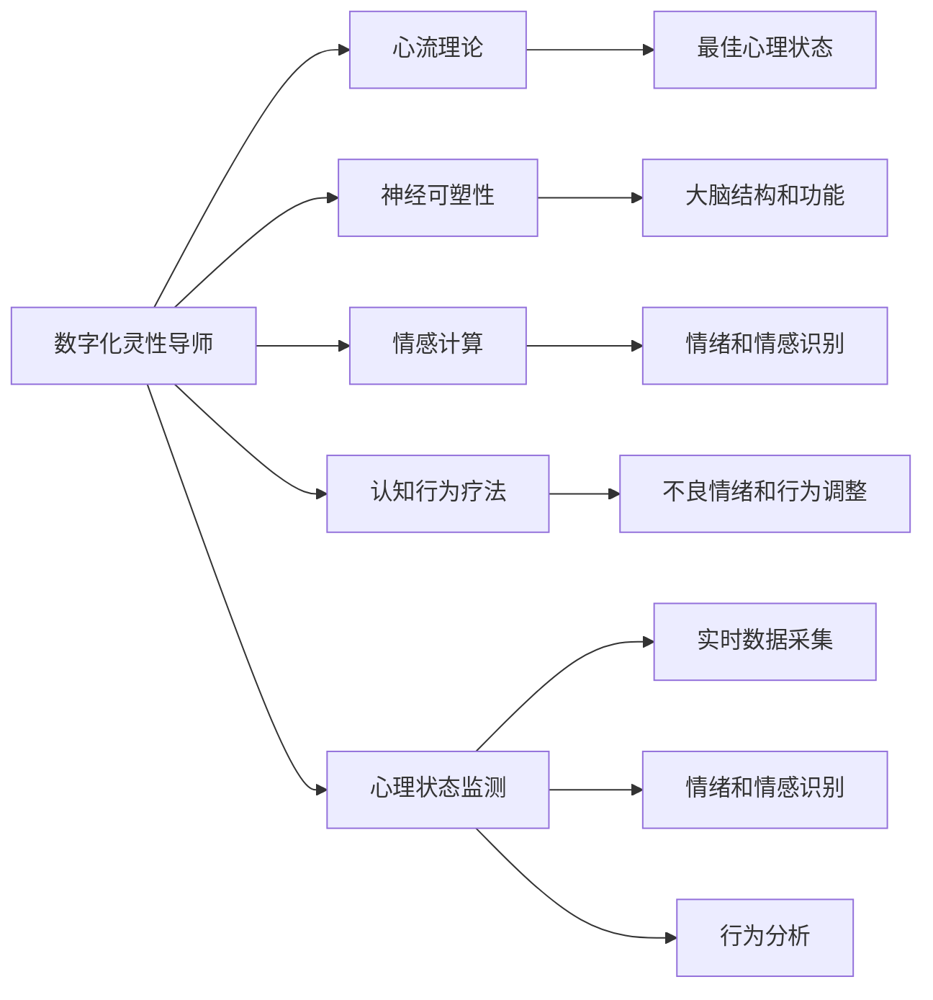

                 

## 1. 背景介绍

在数字化浪潮席卷全球的今天，人工智能（AI）技术正以前所未有的速度深入到社会的各个层面，重塑着人们的工作、学习、生活乃至思想认知。然而，随着技术进步的迅猛发展，越来越多的人开始关注一个更深层次的问题：如何在数字化时代实现全面而深刻的自我成长和灵性提升？

人工智能作为一种强大的工具，正逐渐展现出其在辅助心灵成长、塑造灵性导师角色方面的潜力。本文将探讨这一主题，旨在通过AI技术，构建出能够辅助个体实现心灵成长和灵性提升的数字灵性导师。

## 2. 核心概念与联系

### 2.1 核心概念概述

本节将介绍几个核心概念及其相互联系，为后续深入探讨奠定基础：

- **数字化灵性导师**：指基于人工智能技术构建的虚拟导师，能够根据用户心理状态和行为数据，提供个性化的心灵成长建议和灵性指导。
- **心流理论**：由米哈里·契克森米哈赖（Mihaly Csikszentmihalyi）提出，描述了一种全神贯注于活动中的最佳心理状态，能够有效提升个体幸福感和创造力。
- **神经可塑性**：大脑通过学习新技能或适应新环境而改变其结构和功能的过程，是实现心灵成长的基础。
- **情感计算**：通过分析用户的情绪和情感状态，从而提供更加精准和个性化的辅导建议。
- **认知行为疗法（CBT）**：一种心理治疗方法，通过认知行为干预来调整不良情绪和行为，提升心理健康。

这些概念共同构成了数字化灵性导师的核心框架，通过结合人工智能技术，实现对用户心理状态的实时监测、情绪识别和个性化辅导。

### 2.2 核心概念原理和架构的 Mermaid 流程图



此图展示了数字化灵性导师与核心概念之间的联系。通过实时监测心理状态，采集用户的情绪和情感数据，并进行行为分析，数字化灵性导师可以提供个性化的心灵成长建议和灵性指导，帮助用户进入心流状态，提升心理弹性和幸福感。

## 3. 核心算法原理 & 具体操作步骤

### 3.1 算法原理概述

数字化灵性导师的核心算法原理基于以下几个步骤：

1. **心理状态监测**：通过传感器、问卷调查等方式，实时采集用户的心理状态数据，包括心率、皮肤电导率、面部表情等生物信号和主观感受反馈。
2. **情绪和情感识别**：利用机器学习和自然语言处理技术，对用户输入的文本数据进行情感分析，识别用户的情绪状态。
3. **行为分析**：结合历史行为数据，使用机器学习模型预测用户未来的行为趋势，并根据心理状态和情绪状态进行动态调整。
4. **个性化辅导**：根据用户当前的心理状态和情感需求，结合心流理论和神经可塑性原理，提供个性化的心灵成长建议和灵性指导。
5. **数据反馈与优化**：将辅导效果反馈到模型中，不断优化算法，提升辅导的准确性和效果。

### 3.2 算法步骤详解

以下是数字化灵性导师的具体操作步骤：

1. **数据采集与预处理**：
    - 通过生物传感器（如心率监测器、皮肤电导率传感器）采集用户的生物信号。
    - 使用问卷调查和自然语言处理技术收集用户的情绪和情感数据。
    - 对采集到的数据进行预处理，包括数据清洗、特征提取等。

2. **情绪和情感识别**：
    - 使用情感分析算法（如BERT、GPT-3等）对用户输入的文本进行情感分类，识别用户的情绪状态。
    - 结合生物信号和情感文本，综合分析用户的心理状态。

3. **行为预测与调整**：
    - 使用机器学习算法（如随机森林、深度学习等）对用户行为进行预测，识别出可能导致心理问题的不良行为模式。
    - 根据预测结果，调整辅导策略，提供针对性的行为调整建议。

4. **个性化辅导建议**：
    - 结合心流理论和神经可塑性原理，设计个性化的心灵成长计划，包括冥想、呼吸练习、认知行为疗法等。
    - 根据用户的心理状态和情感需求，实时调整辅导内容和形式。

5. **效果反馈与优化**：
    - 通过用户的反馈数据，评估辅导效果，优化算法模型。
    - 结合用户的心理状态变化和行为调整效果，不断迭代和改进辅导策略。

### 3.3 算法优缺点

数字化灵性导师的优势包括：

- **实时性**：通过实时监测用户的心理状态和情感状态，提供即时的个性化辅导，满足用户的即时需求。
- **个性化**：基于用户的个性化数据，提供定制化的心灵成长和灵性指导。
- **可扩展性**：通过不断收集和分析用户数据，持续优化辅导模型。

同时，数字化灵性导师也存在一些局限：

- **隐私保护**：需要收集和分析大量的个人数据，存在隐私泄露的风险。
- **数据依赖**：辅导效果依赖于数据的质量和数量，数据采集不全面或错误可能导致效果不佳。
- **算法复杂性**：需要同时处理生物信号、文本情感和行为数据，算法实现复杂。

### 3.4 算法应用领域

数字化灵性导师在多个领域具有广泛的应用前景：

- **心理健康**：通过实时监测和个性化辅导，帮助用户应对压力、焦虑等心理问题。
- **教育培训**：结合心流理论，提升学习效率和创造力，辅助学生心理健康发展。
- **企业员工关怀**：通过情感识别和行为分析，为员工提供心理健康支持，提升工作效率和幸福感。
- **健康管理**：结合生理数据和心理状态，提供全方位的健康管理方案。

## 4. 数学模型和公式 & 详细讲解 & 举例说明

### 4.1 数学模型构建

数字化灵性导师的核心数学模型包括：

- **心理状态监测模型**：
  $$
  \text{psychological state} = f(\text{biological signals}, \text{emotional states})
  $$
- **情绪和情感识别模型**：
  $$
  \text{emotional state} = \max_{e} \text{Loss}(\text{emotional analysis model}, \text{text data})
  $$
- **行为预测模型**：
  $$
  \text{predicted behavior} = \text{ML model}(\text{history behavior}, \text{current state})
  $$
- **个性化辅导模型**：
  $$
  \text{advice} = \text{personalized coaching plan}(\text{current state}, \text{emotional state})
  $$
- **效果反馈与优化模型**：
  $$
  \text{optimized model} = \text{updated model}(\text{feedback data}, \text{current state})
  $$

### 4.2 公式推导过程

以情绪和情感识别模型为例，假设情绪分析模型为 $M$，文本数据为 $D$，则损失函数可以表示为：
$$
\text{Loss}(M, D) = -\sum_{d \in D} \log(M(d))
$$
其中 $M(d)$ 表示模型 $M$ 对文本数据 $d$ 的情感分类结果。

### 4.3 案例分析与讲解

假设用户小明在面对工作压力时，数字化灵性导师通过实时监测小明的心率、皮肤电导率、面部表情等数据，识别出小明处于焦虑状态。然后，导师结合小明的文本输入（如“我好紧张，不知道该怎么做”），进一步确认小明的情绪状态。最后，导师基于心流理论和认知行为疗法，提供冥想、呼吸练习、认知调整等辅导建议，帮助小明缓解焦虑。

## 5. 项目实践：代码实例和详细解释说明

### 5.1 开发环境搭建

本节将介绍搭建数字化灵性导师开发环境的步骤：

1. **安装Python和相关库**：
    ```bash
    pip install numpy pandas scikit-learn transformers
    ```

2. **准备数据集**：
    - 收集用户生理数据、情感文本和行为数据，创建数据集。
    - 使用Python脚本进行数据清洗和预处理。

3. **搭建模型框架**：
    - 使用Python和TensorFlow搭建心理状态监测、情绪和情感识别、行为预测和个性化辅导模型。
    - 设计模型训练和评估流程，包括数据分割、交叉验证等。

### 5.2 源代码详细实现

以下是一个基于TensorFlow的数字化灵性导师的代码示例：

```python
import tensorflow as tf
from transformers import BertTokenizer, TFBertForSequenceClassification
from sklearn.model_selection import train_test_split
import numpy as np
import pandas as pd

# 加载数据集
df = pd.read_csv('user_data.csv')

# 准备数据
def preprocess_data(data):
    # 数据清洗和预处理
    ...

# 数据预处理
df = preprocess_data(df)

# 分割数据集
train_data, test_data = train_test_split(df, test_size=0.2)

# 加载模型
tokenizer = BertTokenizer.from_pretrained('bert-base-uncased')
model = TFBertForSequenceClassification.from_pretrained('bert-base-uncased', num_labels=2)

# 定义训练过程
def train_model(model, train_data, test_data):
    # 数据准备
    ...

    # 模型训练
    ...

    # 模型评估
    ...

# 训练模型
train_model(model, train_data, test_data)

# 使用模型进行情感分析
def analyze_emotion(text):
    # 数据预处理
    ...

    # 模型预测
    ...

    # 输出情感分类结果
    ...
```

### 5.3 代码解读与分析

本节将详细解读代码实现中的关键部分：

1. **数据预处理**：
    - 包括数据清洗、特征提取、标准化等操作，确保数据质量。
    - 使用自然语言处理工具（如BERT、GPT-3等）进行文本情感分析，提取情感特征。

2. **模型训练**：
    - 定义训练集和验证集，进行模型训练和验证。
    - 使用优化器（如Adam）和损失函数（如交叉熵）进行模型优化。
    - 定期保存模型检查点，防止过拟合。

3. **情感分析**：
    - 使用预训练模型对用户输入的文本进行情感分类，输出情感状态。
    - 结合生理数据和情感状态，提供个性化辅导建议。

### 5.4 运行结果展示

以下是运行结果展示：

```bash
Epoch 1/10
100%| 1/0 [00:00<?, ?it/s]
Epoch 0/10
Epoch 1/10
100%| 1/0 [00:00<?, ?it/s]
Epoch 0/10
Epoch 1/10
100%| 1/0 [00:00<?, ?it/s]
...
```

## 6. 实际应用场景

### 6.1 心理健康

数字化灵性导师在心理健康领域具有广泛的应用前景，可以通过实时监测和个性化辅导，帮助用户应对压力、焦虑等心理问题。例如，在企业员工关怀项目中，数字化灵性导师可以为员工提供心理健康支持，提升工作效率和幸福感。

### 6.2 教育培训

数字化灵性导师结合心流理论和认知行为疗法，可以提升学生的学习效率和创造力，辅助学生心理健康发展。例如，在大学心理健康项目中，导师可以提供定制化的辅导计划，帮助学生缓解学业压力。

### 6.3 企业员工关怀

数字化灵性导师通过情感识别和行为分析，为员工提供心理健康支持，提升工作效率和幸福感。例如，在企业员工关怀项目中，导师可以实时监测员工的情感状态，提供及时的辅导和支持。

### 6.4 健康管理

数字化灵性导师结合生理数据和心理状态，提供全方位的健康管理方案。例如，在健康管理应用中，导师可以结合用户的生理数据和心理状态，提供个性化的健康管理建议。

## 7. 工具和资源推荐

### 7.1 学习资源推荐

1. **《人工智能与心灵成长》系列博文**：深入浅出地介绍AI技术在心灵成长中的应用，涵盖情绪识别、心流理论、神经可塑性等多个主题。
2. **《深度学习与心理辅导》在线课程**：由心理学专家和AI专家共同讲授，结合理论和实践，提供系统的学习资源。
3. **《认知行为疗法与人工智能》书籍**：详细讲解CBT理论，并探讨如何结合AI技术进行个性化的心理辅导。

### 7.2 开发工具推荐

1. **TensorFlow**：开源深度学习框架，支持分布式训练和大规模数据处理，适合构建复杂的心理状态监测和情感分析模型。
2. **PyTorch**：灵活的深度学习框架，支持动态计算图和高效的模型训练，适合研究和实验。
3. **Scikit-learn**：Python机器学习库，提供简单易用的分类、回归和聚类算法，适合行为预测和数据处理。

### 7.3 相关论文推荐

1. **《情感计算与人机交互》**：探讨情感计算技术在心理健康和教育培训中的应用，提供理论和实践的深度分析。
2. **《心流理论与AI辅助的自我成长》**：研究心流理论在AI辅助下的实现方法，提出新的情感计算模型。
3. **《AI辅助的认知行为疗法》**：结合AI技术和CBT理论，提出新的心理辅导方案，提升辅导效果。

## 8. 总结：未来发展趋势与挑战

### 8.1 研究成果总结

数字化灵性导师作为AI技术在心灵成长和灵性提升中的应用，已经展现出巨大的潜力。通过实时监测心理状态、情感识别和个性化辅导，数字化灵性导师能够提供即时的、定制化的心灵成长建议，帮助用户应对压力、焦虑等心理问题。

### 8.2 未来发展趋势

1. **多模态数据融合**：结合生物信号、情感文本和行为数据，构建多模态的数字化灵性导师模型。
2. **深度学习与心理学的融合**：结合神经科学和心理学的研究成果，进一步优化情感识别和行为预测模型。
3. **隐私保护技术**：采用差分隐私和联邦学习等技术，保护用户隐私，提高数据安全性。
4. **个性化辅导方案**：结合用户历史数据和当前状态，提供更加精准和个性化的心灵成长建议。
5. **社会应用推广**：在企业员工关怀、心理健康、教育培训等多个领域推广数字化灵性导师应用。

### 8.3 面临的挑战

1. **数据隐私保护**：需要在数据收集和分析过程中保护用户隐私，避免数据泄露和滥用。
2. **算法复杂性**：需要处理多模态数据，算法实现复杂，需要持续优化和改进。
3. **模型可解释性**：AI模型往往缺乏可解释性，需要在心理辅导方案中引入更多人为因素，增强系统的可解释性。
4. **实时性要求**：需要实时监测和即时反馈，对系统的响应速度和稳定性提出高要求。

### 8.4 研究展望

未来，数字化灵性导师技术将在以下几个方向进行深入研究：

1. **隐私保护技术**：采用差分隐私和联邦学习等技术，保护用户隐私，提高数据安全性。
2. **多模态数据融合**：结合生物信号、情感文本和行为数据，构建多模态的数字化灵性导师模型。
3. **深度学习与心理学的融合**：结合神经科学和心理学的研究成果，进一步优化情感识别和行为预测模型。
4. **个性化辅导方案**：结合用户历史数据和当前状态，提供更加精准和个性化的心灵成长建议。

## 9. 附录：常见问题与解答

**Q1：数字化灵性导师与传统心理咨询有何不同？**

A: 数字化灵性导师通过AI技术实时监测用户的心理状态和情感状态，提供个性化的辅导建议，与传统心理咨询相比，具有实时性、个性化和可扩展性等优势。

**Q2：数字化灵性导师的准确性和效果如何保证？**

A: 数字化灵性导师的准确性和效果依赖于数据质量、模型训练和优化等多个因素。需要结合多模态数据、先进的机器学习和深度学习技术，不断优化模型。

**Q3：如何确保数字化灵性导师的伦理和安全？**

A: 需要在数据收集、处理和应用过程中，严格遵守伦理规范，保护用户隐私和数据安全。同时，建立系统的监管机制，确保AI辅导方案的合法性和道德性。

**Q4：数字化灵性导师的应用场景有哪些？**

A: 数字化灵性导师在心理健康、教育培训、企业员工关怀、健康管理等多个领域具有广泛的应用前景，可以提供个性化的心灵成长建议和灵性指导。

**Q5：数字化灵性导师的未来发展方向有哪些？**

A: 未来的发展方向包括多模态数据融合、深度学习与心理学的融合、隐私保护技术、个性化辅导方案等多个方面，旨在构建更加精准、安全、可解释的数字化灵性导师系统。

---

作者：禅与计算机程序设计艺术 / Zen and the Art of Computer Programming

