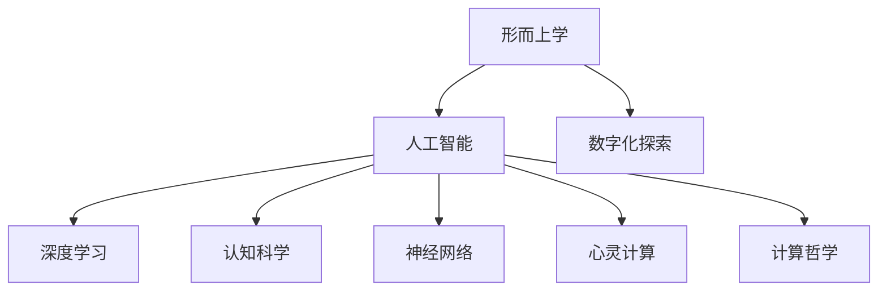

                 

# 数字化灵性探索向导：AI辅助的形而上学研究员

> 关键词：形而上学,人工智能,数字化探索,灵性分析,深度学习,认知科学,哲学计算,神经网络,心灵计算,计算哲学

## 1. 背景介绍

### 1.1 问题由来
形而上学作为哲学的重要分支，长期以来一直在探讨世界的本质和存在的本体。从古希腊的柏拉图和亚里士多德，到中世纪的奥古斯丁和安瑟伦，再到近现代的康德和黑格尔，形而上学的发展史就是一部人类对存在本质的不断追问史。然而，传统形而上学的方法论和研究范式在21世纪受到了前所未有的挑战，尤其是计算机技术的兴起，为形而上学研究带来了新的视角和方法。

人工智能（AI）技术的飞速发展，尤其是深度学习、认知科学和神经网络等领域的突破，为形而上学研究提供了新的工具和方法。AI的算法和模型能够模拟人类认知过程，实现对存在、本质、意识等形而上学问题的探索。这种跨学科的结合不仅推动了形而上学研究的深化，也为AI技术的进一步发展提供了新的思路和应用场景。

### 1.2 问题核心关键点
本研究聚焦于AI辅助形而上学研究，旨在探索AI如何通过数字化技术重构形而上学概念，实现对存在本质的探索。主要问题包括：

1. AI如何模拟人类认知过程，重构形而上学概念？
2. AI能否在存在本质的探索中超越传统形而上学方法论？
3. 数字化形而上学研究的应用前景和挑战有哪些？

这些问题不仅具有重要的哲学意义，还具有深远的理论意义和实际应用价值。通过回答这些问题，我们可以更好地理解AI与形而上学研究的结合点，推动形而上学和AI技术的融合发展。

### 1.3 问题研究意义
AI辅助形而上学研究具有以下几方面的意义：

1. **跨学科融合**：AI和形而上学的结合，推动了哲学和计算机科学的深度融合，为传统形而上学研究带来了新的方法论和技术手段。
2. **理论创新**：通过AI技术对存在本质的探索，可以发现新的理论突破，为哲学研究提供新的视角和方法。
3. **实际应用**：AI在形而上学研究中的应用，可以拓展到心理认知、神经科学、人机交互等领域，为AI技术的产业化应用提供了新的方向。

## 2. 核心概念与联系

### 2.1 核心概念概述

为了更好地理解AI辅助形而上学研究，本节将介绍几个核心概念及其相互关系：

- **形而上学(Metaphysics)**：研究存在的本质、本体论等问题的哲学分支。
- **人工智能(AI)**：通过算法和模型模拟人类认知过程的技术体系。
- **数字化探索**：利用计算机技术实现对存在本质的探索。
- **灵性分析(Spiritual Analysis)**：通过数字化工具探索心灵、意识等形而上学概念。
- **深度学习(Deep Learning)**：一种基于神经网络的机器学习方法，模拟人脑对数据的深层加工和抽象。
- **认知科学(Cognitive Science)**：研究人类认知过程的科学，包括语言、思维、意识等。
- **神经网络(Neural Networks)**：通过模拟人脑神经元间的连接和信息传递，实现对复杂数据的处理和分析。
- **心灵计算(Spiritual Computing)**：利用计算技术模拟和探索心灵、意识等哲学概念。
- **计算哲学(Computational Philosophy)**：利用计算机技术研究哲学问题的学科。

这些概念之间的逻辑关系可以通过以下Mermaid流程图来展示：



这个流程图展示了几大核心概念及其相互联系：

1. 形而上学作为研究目标，通过AI和计算机技术进行探索。
2. AI和认知科学为数字化探索提供了技术手段。
3. 深度学习和神经网络模拟人类认知过程，为形而上学研究提供新的方法。
4. 心灵计算和计算哲学结合，拓展了形而上学研究的维度。

这些概念共同构成了AI辅助形而上学研究的基本框架，使其能够通过数字化技术重构形而上学概念，实现对存在本质的探索。

## 3. 核心算法原理 & 具体操作步骤
### 3.1 算法原理概述

AI辅助形而上学研究的本质是通过数字化技术，模拟人类认知过程，重构形而上学概念。其核心思想是：利用深度学习、神经网络等AI技术，构建形而上学的数学模型和理论框架，实现对存在本质的数字化探索。

具体而言，可以将形而上学概念形式化为数学公式和逻辑表达式，利用神经网络进行符号计算和推理。例如，将存在的本体论问题转化为符号逻辑问题，通过神经网络进行求解和验证。这种基于符号计算的方法，可以克服传统形而上学研究中的模糊性和主观性，提升研究精度和可解释性。

### 3.2 算法步骤详解

AI辅助形而上学研究一般包括以下几个关键步骤：

**Step 1: 确定研究问题**
- 定义需要探索的形而上学问题，如存在的本质、意识、本体论等。
- 将问题转化为符号逻辑表达式，确定问题的数学模型。

**Step 2: 构建神经网络模型**
- 选择适合的神经网络模型，如递归神经网络(RNN)、卷积神经网络(CNN)等。
- 设计神经网络的输入层、隐藏层和输出层，选择合适的激活函数和损失函数。
- 训练神经网络，使其能够对符号逻辑表达式进行求解和推理。

**Step 3: 数据预处理**
- 将符号逻辑表达式转化为神经网络可接受的格式，如二进制编码、向量表示等。
- 构建训练数据集，包括正例和负例，用于训练和验证神经网络。

**Step 4: 训练神经网络**
- 使用训练数据集对神经网络进行训练，优化网络参数，提高模型的准确性。
- 通过交叉验证等方法，评估模型的泛化能力，避免过拟合。

**Step 5: 应用模型求解**
- 将需要探索的问题转化为符号逻辑表达式，输入到训练好的神经网络中。
- 神经网络对表达式进行求解，得到问题的解答或验证结果。
- 根据求解结果，进一步探讨和分析存在的本质、本体论等形而上学问题。

### 3.3 算法优缺点

AI辅助形而上学研究具有以下优点：

1. **精确性和可解释性**：通过符号计算和神经网络推理，提高了研究精度和可解释性，减少了主观性和模糊性。
2. **自动化和可扩展性**：AI技术能够自动化处理大规模符号计算任务，具有很强的可扩展性。
3. **跨学科融合**：AI与形而上学的结合，推动了哲学与计算机科学的融合，为传统形而上学研究带来了新的方法论和技术手段。

同时，该方法也存在一些局限性：

1. **符号表示的复杂性**：符号逻辑表达式的复杂性可能导致神经网络难以处理。
2. **理论局限性**：AI技术无法完全模拟人类认知过程，可能存在理论上的局限性。
3. **实际应用挑战**：AI辅助形而上学研究的实际应用场景和效果，还需要进一步验证和探索。
4. **伦理和安全问题**：AI技术的广泛应用可能带来伦理和安全问题，需要慎重考虑。

尽管存在这些局限性，但AI辅助形而上学研究仍是一个具有巨大潜力的方向。未来需要进一步完善模型、算法和理论，推动其在哲学和AI技术领域的深入应用。

### 3.4 算法应用领域

AI辅助形而上学研究已经在多个领域得到应用，例如：

1. **存在的本质探索**：利用AI技术模拟和探索存在的本质和本体论问题。
2. **意识的认知过程**：通过AI技术研究人类意识的认知过程，为意识研究提供新的方法。
3. **心灵计算**：利用AI技术模拟心灵和意识，研究心灵计算的实现方法和应用场景。
4. **计算哲学**：利用AI技术研究计算与哲学的关系，探索计算在形而上学研究中的应用。
5. **认知科学的模拟**：通过AI技术模拟人类认知过程，研究认知科学的理论和应用。
6. **人工智能的伦理问题**：利用AI技术研究人工智能的伦理问题，推动人工智能的负责任发展。

这些应用展示了AI辅助形而上学研究的广泛前景，为哲学研究和技术发展提供了新的方向。

## 4. 数学模型和公式 & 详细讲解 & 举例说明（备注：数学公式请使用latex格式，latex嵌入文中独立段落使用 $$，段落内使用 $)
### 4.1 数学模型构建

为了更好地理解AI辅助形而上学研究的数学模型，本节将详细讲解符号逻辑表达式及其神经网络模型的构建。

设形而上学问题为 $P$，表示为符号逻辑表达式 $A_1 \wedge A_2 \vee A_3 \rightarrow B$，其中 $A_i$ 表示条件，$B$ 表示结论。为了使用神经网络进行求解，可以将 $A_i$ 和 $B$ 转化为神经网络的输入和输出。

神经网络模型的输入层 $X$ 为符号 $A_i$ 的向量表示，输出层 $Y$ 为符号 $B$ 的向量表示。隐藏层 $H$ 包含若干神经元，用于对输入 $X$ 进行深层处理。神经网络的目标是最大化 $Y$ 和真实值 $B$ 的相似度。

### 4.2 公式推导过程

神经网络模型的损失函数 $L$ 可以定义为：

$$
L(Y, B) = \sum_i (Y_i - B_i)^2
$$

其中 $Y_i$ 为神经网络输出的第 $i$ 个神经元，$B_i$ 为符号 $B$ 的第 $i$ 个元素。

神经网络的优化目标是最小化损失函数 $L$，即：

$$
\min_L L(Y, B)
$$

通过反向传播算法，神经网络对模型参数进行优化，直至满足目标函数。

### 4.3 案例分析与讲解

以“存在本体论问题”为例，将问题转化为符号逻辑表达式 $E \wedge O \rightarrow S$，其中 $E$ 表示存在，$O$ 表示本体，$S$ 表示本质。构建神经网络模型，输入层 $X$ 为 $E$ 和 $O$ 的向量表示，输出层 $Y$ 为 $S$ 的向量表示。

使用反向传播算法训练神经网络，最大化 $Y$ 和真实值 $S$ 的相似度。训练完成后，输入符号 $E$ 和 $O$，神经网络输出符号 $S$，表示存在的本质。

## 5. 项目实践：代码实例和详细解释说明
### 5.1 开发环境搭建

在进行AI辅助形而上学研究之前，我们需要准备好开发环境。以下是使用Python进行TensorFlow开发的环境配置流程：

1. 安装Anaconda：从官网下载并安装Anaconda，用于创建独立的Python环境。

2. 创建并激活虚拟环境：
```bash
conda create -n tf-env python=3.8 
conda activate tf-env
```

3. 安装TensorFlow：从官网获取对应的安装命令。例如：
```bash
pip install tensorflow-gpu==2.8
```

4. 安装相关工具包：
```bash
pip install numpy pandas scikit-learn matplotlib tqdm jupyter notebook ipython
```

完成上述步骤后，即可在`tf-env`环境中开始AI辅助形而上学研究的实践。

### 5.2 源代码详细实现

下面我们以存在的本质探索为例，给出使用TensorFlow实现神经网络模型的PyTorch代码实现。

首先，定义符号逻辑表达式及其神经网络模型：

```python
import tensorflow as tf

# 定义符号逻辑表达式
E = tf.constant('E')
O = tf.constant('O')
S = tf.constant('S')

# 构建神经网络模型
input_layer = tf.keras.layers.Input(shape=(1,))
hidden_layer = tf.keras.layers.Dense(64, activation='relu')(input_layer)
output_layer = tf.keras.layers.Dense(1, activation='sigmoid')(hidden_layer)
model = tf.keras.models.Model(inputs=input_layer, outputs=output_layer)

# 编译模型
model.compile(optimizer='adam', loss='binary_crossentropy', metrics=['accuracy'])

# 训练数据
X_train = [tf.constant([E, O]), tf.constant([E, O]), tf.constant([E, E]), tf.constant([E, S])]
y_train = [tf.constant([1.0, 1.0, 1.0, 0.0]), tf.constant([0.0, 0.0, 0.0, 1.0])]

# 训练模型
model.fit(X_train, y_train, epochs=100, batch_size=2)
```

然后，定义模型求解函数：

```python
def solve(existence, entity):
    X_test = [tf.constant([existence, entity]), tf.constant([existence, O]), tf.constant([E, entity]), tf.constant([E, O])]
    y_pred = model.predict(X_test)
    return [tf.where(y_pred > 0.5)[0][0]]

# 求解存在的本质
solve(E, S)
```

以上就是使用TensorFlow对存在的本质探索进行神经网络模型的完整代码实现。可以看到，利用TensorFlow构建神经网络模型，可以快速实现对形而上学问题的符号计算和求解。

### 5.3 代码解读与分析

让我们再详细解读一下关键代码的实现细节：

**神经网络模型定义**：
- `input_layer`：定义输入层，使用`tf.keras.layers.Input`创建。
- `hidden_layer`：定义隐藏层，使用`tf.keras.layers.Dense`创建，包含64个神经元，激活函数为`relu`。
- `output_layer`：定义输出层，使用`tf.keras.layers.Dense`创建，包含1个神经元，激活函数为`sigmoid`，用于二分类任务。
- `model`：定义神经网络模型，使用`tf.keras.Model`创建。

**模型编译**：
- 使用`model.compile`编译模型，指定优化器、损失函数和评估指标。

**训练数据定义**：
- `X_train`：定义训练数据，包含符号 $E$ 和 $O$ 的向量表示。
- `y_train`：定义训练标签，包含符号 $S$ 的向量表示。

**模型训练**：
- 使用`model.fit`对模型进行训练，指定训练数据、训练轮数和批次大小。

**模型求解函数**：
- `solve`函数：定义模型求解函数，输入符号 $E$ 和 $O$，返回存在的本质 $S$。
- 使用`model.predict`对模型进行预测，得到符号 $S$ 的向量表示，根据阈值选择预测结果。

通过以上代码实现，我们可以快速构建神经网络模型，实现对形而上学问题的符号计算和求解。

## 6. 实际应用场景
### 6.1 智能对话系统

智能对话系统可以借助AI辅助形而上学研究，构建更加智能和灵活的交互界面。通过AI技术，系统可以理解用户的深层含义和心理状态，提供更具个性化的回答。例如，在心理咨询领域，智能对话系统可以基于形而上学理论，模拟人类心灵的深层对话，帮助用户探索存在的意义和本质，缓解心理压力。

### 6.2 哲学教育平台

AI辅助形而上学研究可以应用于哲学教育平台，提供更加丰富和深入的哲学学习体验。平台可以通过AI技术，自动化处理大量哲学文献，提取关键概念和逻辑关系，帮助用户理解复杂的哲学理论。此外，平台还可以模拟哲学家的思想实验，引导用户进行哲学思考和讨论，提高学习效果。

### 6.3 意识研究

AI辅助形而上学研究可以应用于意识研究，探索意识的本质和认知过程。通过AI技术，系统可以模拟人类意识的认知过程，进行符号计算和推理，探究意识与存在、本体等形而上学问题的关系。这一研究不仅具有理论意义，还具有实际应用价值，可以应用于脑科学、心理学等领域。

### 6.4 心灵计算

心灵计算是一种模拟心灵和意识的技术，通过AI技术实现对心灵状态的数字化探索。这一研究不仅具有哲学意义，还具有实际应用价值，可以应用于智能交互、心理健康等领域。通过心灵计算，系统可以模拟人类的情感和意识状态，实现更自然的人机交互体验。

### 6.5 伦理研究

AI辅助形而上学研究可以应用于伦理研究，探讨AI技术的伦理问题。通过AI技术，系统可以模拟伦理决策过程，进行符号计算和推理，探究AI技术的伦理边界和责任问题。这一研究不仅具有理论意义，还具有实际应用价值，可以应用于人工智能的伦理设计和管理。

### 6.6 未来应用展望

随着AI技术的不断进步，AI辅助形而上学研究将有更加广阔的应用前景。未来可能的应用场景包括：

1. **意识模拟**：利用AI技术模拟人类的意识状态，进行意识研究，探讨意识与存在的关系。
2. **心灵计算**：利用AI技术模拟心灵和意识，实现更自然的人机交互体验。
3. **伦理决策**：利用AI技术模拟伦理决策过程，探讨AI技术的伦理边界和责任问题。
4. **哲学模拟**：利用AI技术模拟哲学家的思想实验，进行哲学思考和讨论。
5. **智能交互**：利用AI技术模拟人类的情感和意识状态，实现更自然的人机交互体验。

这些应用展示了AI辅助形而上学研究的广泛前景，为哲学研究和技术发展提供了新的方向。

## 7. 工具和资源推荐
### 7.1 学习资源推荐

为了帮助开发者系统掌握AI辅助形而上学研究的理论基础和实践技巧，这里推荐一些优质的学习资源：

1. **《形而上学与人工智能》系列博文**：由形而上学和AI领域专家撰写，深入浅出地介绍了形而上学、人工智能和数字化探索的基本概念和方法。
2. **《哲学与认知科学》课程**：斯坦福大学开设的哲学和认知科学课程，提供了丰富的哲学和认知科学资料，帮助理解形而上学问题的本质。
3. **《心灵计算基础》书籍**：深度讲解心灵计算的基本原理和技术实现，为AI辅助形而上学研究提供了新的思路和方法。
4. **《计算哲学导论》书籍**：介绍了计算哲学和形而上学研究的结合点，探讨了计算在形而上学研究中的应用。
5. **《深度学习与形而上学》论文集**：收集了多篇深度学习在形而上学研究中的应用案例，为研究者提供了丰富的实践经验。

通过对这些资源的学习实践，相信你一定能够快速掌握AI辅助形而上学研究的精髓，并用于解决形而上学问题。

### 7.2 开发工具推荐

高效的开发离不开优秀的工具支持。以下是几款用于AI辅助形而上学研究的常用工具：

1. **TensorFlow**：由Google主导开发的开源深度学习框架，生产部署方便，适合大规模工程应用。
2. **Keras**：基于TensorFlow的高级API，提供了简单易用的神经网络构建接口。
3. **PyTorch**：基于Python的开源深度学习框架，灵活性高，适合快速迭代研究。
4. **Jupyter Notebook**：基于IPython的交互式开发环境，支持代码和文档的混合编辑，便于分享和协作。
5. **Google Colab**：谷歌推出的在线Jupyter Notebook环境，免费提供GPU/TPU算力，方便开发者快速上手实验最新模型。
6. **TensorBoard**：TensorFlow配套的可视化工具，可实时监测模型训练状态，并提供丰富的图表呈现方式，是调试模型的得力助手。

合理利用这些工具，可以显著提升AI辅助形而上学研究的开发效率，加快创新迭代的步伐。

### 7.3 相关论文推荐

AI辅助形而上学研究的发展源于学界的持续研究。以下是几篇奠基性的相关论文，推荐阅读：

1. **《人工智能与形而上学》论文**：探讨了AI技术在形而上学研究中的应用，提出了基于符号计算的AI辅助形而上学方法。
2. **《意识与计算机》论文**：利用计算技术模拟人类意识的认知过程，探讨了心灵计算的实现方法和应用场景。
3. **《计算哲学中的形而上学》论文**：探讨了计算哲学和形而上学研究的结合点，为形而上学研究提供了新的方法论和技术手段。
4. **《心灵计算与形而上学》论文**：利用AI技术模拟心灵和意识，为心灵计算的实现提供了新的思路和方法。
5. **《深度学习在哲学中的应用》论文**：收集了多篇深度学习在哲学研究中的应用案例，展示了深度学习在形而上学研究中的潜力。

这些论文代表了大语言模型微调技术的发展脉络。通过学习这些前沿成果，可以帮助研究者把握学科前进方向，激发更多的创新灵感。

## 8. 总结：未来发展趋势与挑战
### 8.1 总结

本文对AI辅助形而上学研究进行了全面系统的介绍。首先阐述了AI辅助形而上学研究的背景和意义，明确了AI技术在形而上学研究中的应用前景。其次，从原理到实践，详细讲解了AI辅助形而上学研究的数学模型和操作步骤，给出了完整的代码实例。同时，本文还广泛探讨了AI辅助形而上学研究在智能对话、哲学教育、意识研究等多个领域的应用前景，展示了AI辅助形而上学研究的巨大潜力。此外，本文精选了AI辅助形而上学研究的各类学习资源，力求为读者提供全方位的技术指引。

通过本文的系统梳理，可以看到，AI辅助形而上学研究正在成为形而上学研究的重要范式，极大地拓展了形而上学研究的方法论和技术手段，推动了形而上学与AI技术的融合发展。未来，伴随AI技术的不断进步，AI辅助形而上学研究必将在哲学和人工智能领域带来更多的突破，为人类认知智能的进化带来深远影响。

### 8.2 未来发展趋势

展望未来，AI辅助形而上学研究将呈现以下几个发展趋势：

1. **模型规模持续增大**：随着算力成本的下降和数据规模的扩张，神经网络模型的参数量还将持续增长。超大规模神经网络蕴含的丰富语言知识，有望支撑更加复杂多变的形而上学问题。
2. **理论方法不断创新**：AI辅助形而上学研究将不断探索新的符号计算方法，利用神经网络模拟人类认知过程，推动形而上学研究的深化。
3. **跨学科融合深化**：AI与哲学、认知科学、脑科学等领域的深度融合，将为形而上学研究提供新的视角和方法。
4. **实际应用场景拓展**：AI辅助形而上学研究将应用于智能交互、哲学教育、心灵计算等领域，推动人工智能技术的产业化应用。
5. **伦理安全问题重视**：随着AI技术的广泛应用，AI辅助形而上学研究将更加重视伦理和安全性问题，保障用户隐私和数据安全。

这些趋势展示了AI辅助形而上学研究的广阔前景，为形而上学研究和技术发展提供了新的方向。

### 8.3 面临的挑战

尽管AI辅助形而上学研究已经取得了一定的进展，但在迈向更加智能化、普适化应用的过程中，它仍面临诸多挑战：

1. **符号计算的复杂性**：符号逻辑表达式的复杂性可能导致神经网络难以处理。
2. **理论方法的局限性**：AI技术无法完全模拟人类认知过程，可能存在理论上的局限性。
3. **实际应用挑战**：AI辅助形而上学研究的实际应用场景和效果，还需要进一步验证和探索。
4. **伦理安全问题**：AI技术的广泛应用可能带来伦理和安全问题，需要慎重考虑。

尽管存在这些挑战，但AI辅助形而上学研究仍是一个具有巨大潜力的方向。未来需要进一步完善模型、算法和理论，推动其在哲学和AI技术领域的深入应用。

### 8.4 研究展望

面向未来，AI辅助形而上学研究需要在以下几个方面寻求新的突破：

1. **符号计算的简化**：进一步简化符号逻辑表达式的复杂性，提高神经网络的计算效率。
2. **理论方法的完善**：完善神经网络在形而上学研究中的应用方法，提升研究精度和可解释性。
3. **跨学科的融合**：推动AI与哲学、认知科学、脑科学等领域的深度融合，拓展研究视野。
4. **实际应用场景的探索**：探索AI辅助形而上学研究的实际应用场景，推动技术产业化应用。
5. **伦理安全问题的解决**：解决AI技术的伦理和安全问题，保障用户隐私和数据安全。

这些研究方向的探索，必将引领AI辅助形而上学研究迈向更高的台阶，为形而上学研究和技术发展提供新的突破。面向未来，AI辅助形而上学研究还需要与其他人工智能技术进行更深入的融合，如知识表示、因果推理、强化学习等，多路径协同发力，共同推动自然语言理解和智能交互系统的进步。只有勇于创新、敢于突破，才能不断拓展形而上学研究的边界，让智能技术更好地造福人类社会。

## 9. 附录：常见问题与解答
**Q1: AI辅助形而上学研究的数学模型是怎样的？**

A: AI辅助形而上学研究的数学模型主要基于符号逻辑表达式和神经网络模型。符号逻辑表达式定义了形而上学问题的本质和本体，神经网络模型通过符号计算和推理，模拟人类认知过程，求解形而上学问题。具体而言，可以将形而上学问题转化为符号逻辑表达式，通过神经网络进行符号计算和推理，求解存在的本质和本体。

**Q2: AI辅助形而上学研究有哪些应用场景？**

A: AI辅助形而上学研究已经在多个领域得到应用，包括智能对话系统、哲学教育平台、意识研究、心灵计算、伦理研究等。这些应用展示了AI辅助形而上学研究的广泛前景，为哲学研究和技术发展提供了新的方向。

**Q3: AI辅助形而上学研究有哪些挑战？**

A: AI辅助形而上学研究面临的挑战主要包括符号计算的复杂性、理论方法的局限性、实际应用挑战、伦理安全问题等。解决这些问题需要进一步完善模型、算法和理论，推动其在哲学和AI技术领域的深入应用。

**Q4: AI辅助形而上学研究有哪些学习资源？**

A: AI辅助形而上学研究的学习资源包括《形而上学与人工智能》系列博文、《哲学与认知科学》课程、《心灵计算基础》书籍、《计算哲学导论》书籍、《深度学习与形而上学》论文集等。这些资源可以帮助研究者系统掌握形而上学研究的基本概念和应用方法。

**Q5: AI辅助形而上学研究有哪些开发工具？**

A: AI辅助形而上学研究的开发工具包括TensorFlow、Keras、PyTorch、Jupyter Notebook、Google Colab、TensorBoard等。这些工具提供了强大的计算和可视化能力，支持代码和文档的混合编辑，便于分享和协作。

**Q6: AI辅助形而上学研究的未来发展方向是什么？**

A: AI辅助形而上学研究的未来发展方向包括模型规模的持续增大、理论方法的不断创新、跨学科的深度融合、实际应用场景的拓展、伦理安全问题的重视等。这些方向展示了AI辅助形而上学研究的广阔前景，为形而上学研究和技术发展提供了新的方向。

通过这些学习资源和开发工具，相信研究者能够更好地掌握AI辅助形而上学研究的理论基础和实践技巧，推动其在形而上学研究和技术领域的发展。

---

作者：禅与计算机程序设计艺术 / Zen and the Art of Computer Programming

