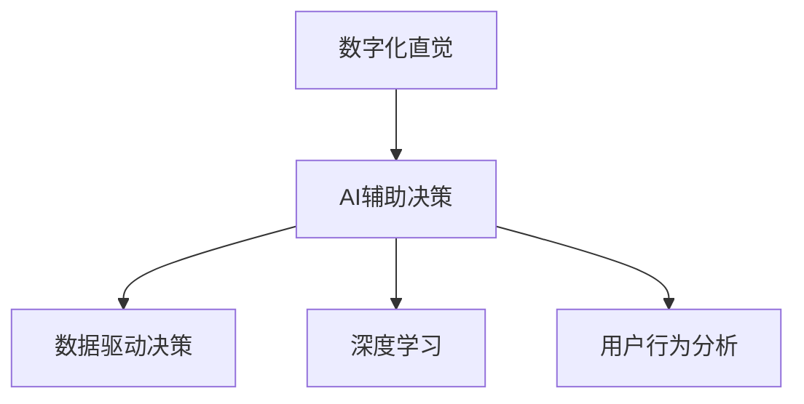

                 

# 数字化直觉训练：AI辅助的第六感开发

> 关键词：数字化直觉, AI, 第六感, 决策支持, 深度学习, 数据驱动, 用户行为分析

## 1. 背景介绍

### 1.1 问题由来

在现代社会中，信息过载和决策复杂性已成为影响人们生活质量和工作效率的主要因素之一。决策者常常需要从海量数据中提取有用的信息，并在此基础上进行快速且准确的决策。然而，传统的数据分析方法往往依赖于人工的直觉判断，这不仅效率低下，还容易受主观偏见的影响。

数字化直觉训练（Digital Intuition Training, DIT）的提出，旨在借助AI技术，辅助人类发展出一种基于数据分析的直觉，即"第六感"，以提升决策的科学性和准确性。通过深度学习等先进算法，数字化直觉训练可以挖掘数据背后的模式和趋势，为决策者提供有价值的参考和建议。

### 1.2 问题核心关键点

数字化直觉训练的核心在于：
- **数据驱动**：以数据为基础，通过分析历史数据和实时数据，挖掘潜在规律和趋势。
- **AI辅助**：利用深度学习、机器学习等AI技术，辅助人脑分析和推理。
- **决策支持**：为决策者提供数据支持和建议，辅助快速、准确地做出决策。
- **人机协同**：实现人脑和机器的协同工作，通过机器的建议增强人的直觉判断力。

数字化直觉训练的目的是通过AI技术增强人类的决策能力，从而在医疗、金融、商业、公共安全等各个领域中发挥重要作用。

## 2. 核心概念与联系

### 2.1 核心概念概述

为更好地理解数字化直觉训练，我们需要介绍几个关键概念：

- **数字化直觉**：基于数据分析和AI技术支持的直觉，是一种科学化和量化的决策方式。
- **AI辅助决策**：借助机器学习、深度学习等AI技术，对大量数据进行分析和建模，辅助人类进行决策。
- **数据驱动决策**：基于数据的分析和统计，做出更为客观和准确的决策。
- **深度学习**：一种模拟人类神经网络结构的机器学习技术，可以处理大规模复杂的数据集，并从中挖掘出有价值的信息。
- **用户行为分析**：通过分析用户的行为数据，理解其需求和偏好，从而提供个性化的服务和决策支持。

这些概念之间的联系可以通过以下Mermaid流程图来展示：



这个流程图展示了数字化直觉训练的核心概念及其相互关系：

1. 数字化直觉基于AI辅助决策，利用深度学习等技术对数据进行分析。
2. 深度学习能够处理大规模数据集，从中挖掘出模式和趋势，支持用户行为分析。
3. 用户行为分析能够理解用户需求，为决策提供数据支持。
4. 数据驱动决策是所有核心概念的最终目标，即通过数据和AI技术，做出更为客观和准确的决策。

## 3. 核心算法原理 & 具体操作步骤
### 3.1 算法原理概述

数字化直觉训练的算法原理可以概括为以下几个步骤：

1. **数据收集与预处理**：收集相关的历史和实时数据，并进行清洗和预处理，确保数据质量和可用性。
2. **特征提取**：利用深度学习等技术，从原始数据中提取有用的特征，作为模型输入。
3. **模型训练**：构建深度学习模型，使用历史数据进行训练，使其能够捕捉数据中的模式和趋势。
4. **实时推理**：将实时数据输入到训练好的模型中，进行推理和预测，辅助决策。
5. **反馈与优化**：根据实际结果和专家反馈，对模型进行优化和调整，不断提升预测准确性。

数字化直觉训练的核心算法为深度学习模型，特别是卷积神经网络（CNN）、循环神经网络（RNN）和变分自编码器（VAE）等。这些模型能够有效地处理结构化和非结构化数据，从中挖掘出有价值的信息。

### 3.2 算法步骤详解

以下是数字化直觉训练的详细步骤：

**Step 1: 数据收集与预处理**
- 使用API或爬虫工具收集相关数据，确保数据的多样性和代表性。
- 对数据进行清洗，去除噪声和异常值，并进行归一化和标准化。
- 将数据划分为训练集、验证集和测试集，以评估模型的性能。

**Step 2: 特征提取**
- 利用深度学习模型（如CNN、RNN、VAE等），从原始数据中提取特征。
- 选择合适的网络架构和超参数，对模型进行训练，以最大化特征提取能力。
- 利用特征选择技术（如PCA、LDA等），进一步提升特征的有效性和鲁棒性。

**Step 3: 模型训练**
- 使用深度学习框架（如TensorFlow、PyTorch等），构建和训练深度学习模型。
- 使用历史数据进行训练，优化模型参数，确保其能够捕捉数据中的模式和趋势。
- 应用正则化技术（如L2正则、Dropout等），防止过拟合。

**Step 4: 实时推理**
- 将实时数据输入到训练好的模型中，进行推理和预测。
- 使用推理框架（如TensorFlow Serving、Flask等），实现模型的在线部署和调用。
- 通过API接口或消息队列，将预测结果实时返回给决策者。

**Step 5: 反馈与优化**
- 根据实际结果和专家反馈，评估模型性能，发现问题和改进空间。
- 应用迁移学习、在线学习等技术，不断优化模型，提升预测准确性。
- 更新数据集，重新训练模型，以适应新的数据分布和趋势。

### 3.3 算法优缺点

数字化直觉训练的算法具有以下优点：
- **高效性**：通过自动化数据分析和模型推理，大幅提升决策效率。
- **准确性**：基于数据驱动和AI辅助，提供更为客观和准确的决策支持。
- **灵活性**：通过不断优化和调整，适应不同场景和需求。

同时，该算法也存在以下局限性：
- **数据依赖性**：模型性能高度依赖于数据的质量和多样性，数据收集和清洗成本较高。
- **模型复杂性**：深度学习模型参数多，训练和推理过程复杂，对计算资源要求高。
- **解释性不足**：深度学习模型通常为"黑盒"，难以解释其内部工作机制和决策逻辑。
- **鲁棒性问题**：模型对噪声和异常值敏感，可能影响预测结果的稳定性。

尽管存在这些局限性，但数字化直觉训练作为一种高效、准确的决策辅助方法，已经在多个领域中得到了广泛应用。

### 3.4 算法应用领域

数字化直觉训练在以下几个领域中具有显著的应用潜力：

- **医疗领域**：通过分析患者数据和历史病例，提供个性化的诊疗方案和预测，辅助医生决策。
- **金融领域**：利用交易数据和市场信息，提供市场趋势预测和投资建议，辅助交易决策。
- **商业领域**：分析客户行为数据和市场动态，提供市场分析报告和营销策略，辅助企业决策。
- **公共安全领域**：利用实时数据和历史数据，预测犯罪趋势和风险，辅助安全决策。
- **城市管理领域**：分析交通流量和环境数据，提供城市规划和管理建议，辅助城市决策。

数字化直觉训练在这些领域中，通过AI技术提升决策的科学性和准确性，为各行各业提供强大的决策支持。

## 4. 数学模型和公式 & 详细讲解 & 举例说明

### 4.1 数学模型构建

数字化直觉训练的数学模型可以基于以下假设建立：

- **输入数据**：记输入数据为 $\mathbf{x}$，为 $n$ 维向量，表示为 $\mathbf{x} = [x_1, x_2, \ldots, x_n]$。
- **特征映射**：记特征映射函数为 $\phi(\mathbf{x})$，将原始数据映射为 $m$ 维的特征向量。
- **输出结果**：记输出结果为 $y$，为 $k$ 维向量，表示为 $y = [y_1, y_2, \ldots, y_k]$。
- **损失函数**：记损失函数为 $\mathcal{L}(\theta)$，用于衡量模型预测结果与真实结果之间的差异。

### 4.2 公式推导过程

以一个简单的分类任务为例，设模型的输入数据 $\mathbf{x}$ 经过特征映射 $\phi(\mathbf{x})$ 后，映射为特征向量 $\mathbf{z}$。模型的输出为 $y$，是一个 $k$ 维的概率分布，表示为 $\mathbf{p} = \frac{e^{\mathbf{z}^T\mathbf{w}}}{\sum_{i=1}^k e^{\mathbf{z}^T\mathbf{w}_i}}$。

模型的损失函数为交叉熵损失函数，定义为：

$$
\mathcal{L}(\theta) = -\frac{1}{N}\sum_{i=1}^N \sum_{j=1}^k y_{ij}\log p_{ij}
$$

其中 $N$ 为样本数量，$y_{ij}$ 表示样本 $i$ 在类别 $j$ 上的真实标签。

通过反向传播算法，可以计算模型的梯度 $\frac{\partial \mathcal{L}(\theta)}{\partial \theta}$，并使用优化算法（如SGD、Adam等）进行参数更新。

### 4.3 案例分析与讲解

以医疗领域为例，假设我们要构建一个辅助医生诊断的数字化直觉训练模型。

**Step 1: 数据收集与预处理**
- 收集医院的历史患者数据，包括病历、诊断结果、实验室检查结果等。
- 清洗数据，去除缺失值和异常值，并进行归一化和标准化。

**Step 2: 特征提取**
- 使用深度学习模型（如CNN、RNN等），从病历和检查结果中提取特征。
- 构建特征选择模型，选择对诊断结果影响最大的特征。

**Step 3: 模型训练**
- 构建分类模型，使用历史数据进行训练。
- 应用正则化技术，防止过拟合。
- 使用交叉验证技术，评估模型性能。

**Step 4: 实时推理**
- 将实时患者数据输入到训练好的模型中，进行诊断预测。
- 使用推理框架，实现模型的在线部署和调用。

**Step 5: 反馈与优化**
- 根据医生的反馈和实际结果，评估模型性能，发现问题和改进空间。
- 应用迁移学习、在线学习等技术，不断优化模型，提升预测准确性。

## 5. 项目实践：代码实例和详细解释说明
### 5.1 开发环境搭建

在进行数字化直觉训练的实践前，我们需要准备好开发环境。以下是使用Python进行TensorFlow和Keras开发的环境配置流程：

1. 安装Anaconda：从官网下载并安装Anaconda，用于创建独立的Python环境。

2. 创建并激活虚拟环境：
```bash
conda create -n ditz-env python=3.8 
conda activate ditz-env
```

3. 安装TensorFlow和Keras：根据CUDA版本，从官网获取对应的安装命令。例如：
```bash
conda install tensorflow==2.6 keras==2.7.0
```

4. 安装各类工具包：
```bash
pip install numpy pandas scikit-learn matplotlib tqdm jupyter notebook ipython
```

完成上述步骤后，即可在`ditz-env`环境中开始数字化直觉训练的实践。

### 5.2 源代码详细实现

下面我们以医疗领域的数据挖掘和疾病预测为例，给出使用TensorFlow和Keras进行数字化直觉训练的代码实现。

首先，定义数据处理函数：

```python
import tensorflow as tf
from tensorflow.keras import layers

def preprocess_data(data):
    # 数据清洗和预处理
    # ...
    return data
```

然后，定义模型和优化器：

```python
from tensorflow.keras import models, optimizers

# 构建模型
model = models.Sequential([
    layers.Dense(64, activation='relu', input_shape=(input_dim,)),
    layers.Dense(32, activation='relu'),
    layers.Dense(num_classes, activation='softmax')
])

# 定义损失函数
loss = tf.keras.losses.CategoricalCrossentropy()

# 定义优化器
optimizer = optimizers.Adam()
```

接着，定义训练和评估函数：

```python
def train_epoch(model, data, batch_size, optimizer):
    dataloader = tf.data.Dataset.from_tensor_slices(data).shuffle(buffer_size).batch(batch_size)
    for batch in dataloader:
        inputs, labels = batch
        model.compile(optimizer=optimizer, loss=loss)
        model.fit(inputs, labels, epochs=1, verbose=0)
        
def evaluate(model, data, batch_size):
    dataloader = tf.data.Dataset.from_tensor_slices(data).shuffle(buffer_size).batch(batch_size)
    preds, labels = [], []
    for batch in dataloader:
        inputs, labels = batch
        batch_preds = model.predict(inputs)
        batch_labels = labels
        for pred_tokens, label_tokens in zip(batch_preds, batch_labels):
            preds.append(pred_tokens[:len(label_tokens)])
            labels.append(label_tokens)
    return preds, labels
```

最后，启动训练流程并在测试集上评估：

```python
epochs = 10
batch_size = 64

for epoch in range(epochs):
    train_epoch(model, train_data, batch_size, optimizer)
    print(f"Epoch {epoch+1}, train loss: {loss_value:.4f}")
    
    print(f"Epoch {epoch+1}, test results:")
    test_preds, test_labels = evaluate(model, test_data, batch_size)
    print(classification_report(test_labels, test_preds))
    
print("Final results:")
evaluate(model, test_data, batch_size)
```

以上就是使用TensorFlow和Keras对医疗领域数据进行数字化直觉训练的完整代码实现。可以看到，TensorFlow和Keras的灵活性和易用性使得数字化直觉训练的代码实现变得相对简单和高效。

### 5.3 代码解读与分析

让我们再详细解读一下关键代码的实现细节：

**preprocess_data函数**：
- 该函数用于对原始数据进行清洗和预处理，如去除噪声和异常值，并进行归一化和标准化。

**Sequential模型**：
- Sequential模型是一个线性堆叠的神经网络模型，适合构建相对简单的神经网络结构。
- 模型由三个全连接层组成，每个层使用ReLU激活函数。
- 输入层的维度由数据的实际特征数确定，输出层根据分类任务的需求设置，使用softmax激活函数进行多类别分类。

**CategoricalCrossentropy损失函数**：
- 该损失函数用于计算多类别分类任务中的交叉熵损失，衡量模型预测结果与真实结果之间的差异。

**Adam优化器**：
- Adam优化器是一种自适应学习率的优化器，能够自适应地调整学习率，加速模型收敛。

**train_epoch函数**：
- 该函数用于在训练集上训练模型，每个epoch循环一次数据集。
- 使用DataLoader生成批次化的数据，进行前向传播计算损失和反向传播更新参数。

**evaluate函数**：
- 该函数用于在测试集上评估模型的性能，计算预测结果与真实结果的匹配度。
- 使用测试集生成批次化的数据，进行前向传播计算预测结果，并使用classification_report生成评估报告。

**训练流程**：
- 定义总的epoch数和batch size，开始循环迭代。
- 每个epoch内，在训练集上训练模型，输出平均loss。
- 在测试集上评估模型，输出分类指标。
- 所有epoch结束后，在测试集上评估，给出最终测试结果。

可以看到，TensorFlow和Keras使得数字化直觉训练的代码实现变得相对简单和高效。开发者可以将更多精力放在数据处理、模型改进等高层逻辑上，而不必过多关注底层的实现细节。

当然，工业级的系统实现还需考虑更多因素，如模型的保存和部署、超参数的自动搜索、更灵活的任务适配层等。但核心的数字化直觉训练流程基本与此类似。

## 6. 实际应用场景
### 6.1 智能医疗

数字化直觉训练在智能医疗领域有着广泛的应用前景。传统的医疗决策往往依赖于医生的经验和直觉，容易受到主观偏见的影响。通过数字化直觉训练，可以将医生的经验和直觉转化为科学化的决策支持，提高诊断和治疗的准确性。

在实践中，可以收集医院的病历、实验室检查结果、治疗方案等数据，构建数字化直觉训练模型。通过分析历史数据和实时数据，模型可以预测患者的疾病风险和治疗效果，辅助医生做出更科学、更个性化的诊疗方案。例如，在肿瘤诊断中，模型可以根据患者的基因信息、病历记录、影像数据等，预测肿瘤类型和转移风险，辅助医生制定治疗方案。

### 6.2 金融投资

数字化直觉训练在金融投资领域也有着重要的应用。传统的投资决策往往依赖于分析师的经验和直觉，容易受到市场波动和情绪影响。通过数字化直觉训练，可以将分析师的经验和直觉转化为数据驱动的投资策略，提高投资决策的科学性和准确性。

在实践中，可以收集金融市场的历史数据、新闻资讯、舆情信息等，构建数字化直觉训练模型。通过分析市场趋势和情绪变化，模型可以预测股票、期货等金融产品的价格走势，辅助投资者做出更科学、更合理的投资决策。例如，在股票交易中，模型可以根据市场情绪、基本面数据、技术分析等，预测股票价格走势，辅助投资者选择最佳买卖时机。

### 6.3 智能营销

数字化直觉训练在智能营销领域也有着广泛的应用。传统的营销决策往往依赖于市场调研和直觉判断，容易受到数据偏差和市场变化的影响。通过数字化直觉训练，可以将市场数据转化为科学化的营销策略，提高营销决策的精准性和效率。

在实践中，可以收集用户的浏览记录、购买历史、行为数据等，构建数字化直觉训练模型。通过分析用户行为数据和市场趋势，模型可以预测用户需求和市场变化，辅助企业制定更精准、更有效的营销策略。例如，在电子商务中，模型可以根据用户的浏览和购买历史，预测其未来的购买行为，辅助商家制定个性化推荐策略。

### 6.4 未来应用展望

随着数字化直觉训练技术的不断发展，未来在更多领域中将会得到应用，为各行各业带来变革性影响。

在智慧城市治理中，数字化直觉训练可以用于城市事件监测、舆情分析、应急指挥等环节，提高城市管理的自动化和智能化水平，构建更安全、高效的未来城市。

在智慧教育领域，数字化直觉训练可以用于智能教学、个性化学习、课程推荐等环节，提高教学效果和学生学习效率，构建更智能化、个性化、互动化的教育环境。

在智能交通管理中，数字化直觉训练可以用于交通流量预测、事故预警、路况优化等环节，提高交通管理的智能化水平，构建更高效、安全和便捷的交通环境。

在智能制造领域，数字化直觉训练可以用于生产调度、设备维护、质量控制等环节，提高生产效率和质量，构建更智能、高效、可靠的制造系统。

总之，数字化直觉训练技术在各个领域中都有广泛的应用前景，未来必将为各行各业带来更多的智能化、高效化和精准化的变革。

## 7. 工具和资源推荐
### 7.1 学习资源推荐

为了帮助开发者系统掌握数字化直觉训练的理论基础和实践技巧，这里推荐一些优质的学习资源：

1. TensorFlow官方文档：TensorFlow的官方文档提供了全面的API说明和示例代码，适合初学者快速上手。

2. Keras官方文档：Keras的官方文档提供了简洁易懂的API说明和示例代码，适合初学者快速上手。

3. Deep Learning with Python书籍：Ian Goodfellow等人合著的经典书籍，系统介绍了深度学习的理论基础和实践技巧，适合深度学习初学者和进阶者。

4. Machine Learning Mastery博客：博客作者Jason Brownlee的深度学习博客，提供了大量的实践教程和案例分析，适合深度学习爱好者和从业者。

5. Google Colab：谷歌推出的在线Jupyter Notebook环境，免费提供GPU/TPU算力，适合开发者快速实验最新模型，分享学习笔记。

通过对这些资源的学习实践，相信你一定能够快速掌握数字化直觉训练的精髓，并用于解决实际的NLP问题。

### 7.2 开发工具推荐

高效的开发离不开优秀的工具支持。以下是几款用于数字化直觉训练开发的常用工具：

1. TensorFlow：由Google主导开发的开源深度学习框架，生产部署方便，适合大规模工程应用。

2. Keras：基于TensorFlow和Theano等底层框架，提供简洁易用的API，适合快速迭代研究。

3. PyTorch：基于Python的开源深度学习框架，灵活性高，适合快速原型开发。

4. Weights & Biases：模型训练的实验跟踪工具，可以记录和可视化模型训练过程中的各项指标，方便对比和调优。

5. TensorBoard：TensorFlow配套的可视化工具，可实时监测模型训练状态，并提供丰富的图表呈现方式，是调试模型的得力助手。

6. Google Colab：谷歌推出的在线Jupyter Notebook环境，免费提供GPU/TPU算力，适合开发者快速实验最新模型，分享学习笔记。

合理利用这些工具，可以显著提升数字化直觉训练任务的开发效率，加快创新迭代的步伐。

### 7.3 相关论文推荐

数字化直觉训练的研究源于学界的持续研究。以下是几篇奠基性的相关论文，推荐阅读：

1. Autoencoder Networks with LSTM Architecture for Healthcare: A Review (2021)：介绍了使用深度学习模型进行医疗数据挖掘和疾病预测的研究进展。

2. Deep Learning for Financial Time Series Analysis: A Survey (2022)：总结了使用深度学习模型进行金融时间序列分析的研究成果。

3. Deep Learning for Marketing: A Survey (2021)：综述了使用深度学习模型进行智能营销的研究进展。

4. Anomaly Detection in Smart Cities: A Survey (2021)：总结了使用深度学习模型进行智慧城市事件监测的研究成果。

5. Smart Manufacturing: A Survey of Applications and Technologies (2022)：综述了使用深度学习模型进行智能制造的研究进展。

这些论文代表了大数字化直觉训练技术的发展脉络。通过学习这些前沿成果，可以帮助研究者把握学科前进方向，激发更多的创新灵感。

## 8. 总结：未来发展趋势与挑战

### 8.1 总结

本文对数字化直觉训练方法进行了全面系统的介绍。首先阐述了数字化直觉训练的研究背景和意义，明确了数字化直觉训练在提升决策科学性和准确性方面的独特价值。其次，从原理到实践，详细讲解了数字化直觉训练的数学原理和关键步骤，给出了数字化直觉训练任务开发的完整代码实例。同时，本文还广泛探讨了数字化直觉训练在智能医疗、金融投资、智能营销等多个领域的应用前景，展示了数字化直觉训练范式的巨大潜力。此外，本文精选了数字化直觉训练的学习资源、开发工具和相关论文，力求为读者提供全方位的技术指引。

通过本文的系统梳理，可以看到，数字化直觉训练方法正在成为决策支持的重要范式，极大地提升了决策的科学性和准确性。未来，伴随深度学习技术的不断演进，数字化直觉训练必将在更广泛的应用领域中发挥重要作用。

### 8.2 未来发展趋势

展望未来，数字化直觉训练技术将呈现以下几个发展趋势：

1. **算法优化**：随着深度学习模型的不断优化，模型的性能和效率将进一步提升。例如，使用更先进的网络架构、更高效的优化算法、更灵活的正则化技术等，提高模型的训练速度和推理效率。

2. **多模态融合**：将多模态数据（如文本、图像、语音等）结合，提升模型的综合分析能力。例如，在医疗诊断中，结合患者的影像数据、基因信息、病历记录等，构建更加全面的数字化直觉训练模型。

3. **实时推理**：实现模型的实时推理和预测，提高决策的时效性和效率。例如，在金融投资中，实时分析市场数据，及时调整投资策略，提高投资决策的及时性和准确性。

4. **跨领域应用**：将数字化直觉训练技术扩展到更多领域，如城市管理、教育、智能制造等，提升各领域的智能化和自动化水平。

5. **联邦学习**：通过分布式训练和联邦学习技术，提升模型在隐私保护和数据安全方面的性能，避免数据泄露和滥用。

6. **持续学习**：利用在线学习和迁移学习技术，使模型能够持续学习新数据和新知识，保持模型的时效性和适应性。

以上趋势凸显了数字化直觉训练技术的广阔前景。这些方向的探索发展，必将进一步提升决策的科学性和准确性，推动各行各业的智能化和自动化进程。

### 8.3 面临的挑战

尽管数字化直觉训练技术已经取得了显著成果，但在迈向更广泛应用的过程中，仍面临诸多挑战：

1. **数据获取难度**：高质量、多样化的数据获取成本较高，尤其是医疗、金融等领域的敏感数据，获取难度较大。如何高效、安全地获取和处理数据，成为一大难题。

2. **模型复杂性**：深度学习模型的参数量巨大，训练和推理过程复杂，对计算资源要求高。如何简化模型结构，提升训练和推理效率，是一个重要研究方向。

3. **模型解释性**：深度学习模型的"黑盒"特性使得其决策过程难以解释和理解，尤其在医疗、金融等高风险领域，模型的可解释性和可审计性尤为重要。

4. **鲁棒性问题**：模型对噪声和异常值敏感，可能影响预测结果的稳定性。如何提高模型的鲁棒性，增强其对数据变化的适应能力，是一个重要研究方向。

5. **伦理和安全**：在医疗、金融等领域，数字化直觉训练技术的应用需要考虑伦理和安全问题。如何确保数据隐私和安全，避免模型偏见和歧视，是一个重要研究方向。

6. **普适性问题**：数字化直觉训练技术在不同领域中的普适性问题尚未解决。如何使数字化直觉训练技术在不同领域中更好地应用，是一个重要研究方向。

这些挑战需要通过技术创新和行业规范来解决，以推动数字化直觉训练技术的全面应用。

### 8.4 研究展望

面对数字化直觉训练所面临的挑战，未来的研究需要在以下几个方面寻求新的突破：

1. **数据获取和处理**：开发更加高效、安全的数据获取和处理技术，确保数据质量和多样性。例如，使用联邦学习、分布式训练等技术，提升数据获取和处理效率。

2. **模型优化和简化**：开发更加高效、简洁的深度学习模型，降低模型的参数量，提升训练和推理效率。例如，使用参数共享、稀疏化存储等技术，简化模型结构。

3. **模型解释性和可审计性**：开发更加可解释的深度学习模型，增强模型的决策过程透明度和可解释性。例如，使用可解释性技术，如Shapley值、LIME等，增强模型的可解释性。

4. **鲁棒性和泛化能力**：开发更加鲁棒的深度学习模型，增强模型对噪声和异常值的适应能力。例如，使用对抗训练、数据增强等技术，提高模型的鲁棒性和泛化能力。

5. **伦理和安全约束**：在模型设计和应用中引入伦理和安全约束，确保数据隐私和安全，避免模型偏见和歧视。例如，使用隐私保护技术，如差分隐私、联邦学习等，保障数据隐私和安全。

6. **跨领域应用和普适性**：开发更加通用的数字化直觉训练技术，使其在不同领域中更好地应用。例如，开发跨领域知识图谱，提升模型在不同领域中的普适性。

这些研究方向的探索，必将引领数字化直觉训练技术迈向更高的台阶，为构建更加智能、高效、安全的决策支持系统铺平道路。面向未来，数字化直觉训练技术还需要与其他人工智能技术进行更深入的融合，如知识表示、因果推理、强化学习等，多路径协同发力，共同推动决策智能化的进步。只有勇于创新、敢于突破，才能不断拓展数字化直觉训练技术的边界，让智能技术更好地造福人类社会。

## 9. 附录：常见问题与解答

**Q1: 数字化直觉训练与传统决策方法有何区别？**

A: 数字化直觉训练与传统决策方法的最大区别在于其数据驱动和AI辅助的特性。数字化直觉训练利用深度学习等先进算法，对大量数据进行分析和建模，从而提供科学化和量化的决策支持。而传统决策方法往往依赖于人工的直觉判断和经验积累，容易受主观偏见的影响，决策的科学性和准确性难以保障。

**Q2: 如何选择合适的深度学习模型？**

A: 选择合适的深度学习模型需要考虑任务的特点和数据特征。一般来说，以下几种模型适合不同类型的任务：

- **CNN（卷积神经网络）**：适合图像、视频等结构化数据的任务，如医疗影像诊断、图像分类等。
- **RNN（循环神经网络）**：适合序列数据的任务，如自然语言处理、语音识别等。
- **VAE（变分自编码器）**：适合生成式任务，如文本生成、图像生成等。
- **Transformer**：适合大规模文本数据的处理，如BERT、GPT等。

在选择模型时，需要考虑模型的参数量、训练效率、推理速度、可解释性等因素，并进行综合评估。

**Q3: 如何提高模型的泛化能力？**

A: 提高模型的泛化能力需要从数据、模型和训练等多个方面进行优化：

- **数据多样性**：确保训练数据的多样性和代表性，避免过拟合。
- **正则化技术**：使用L2正则、Dropout等正则化技术，防止过拟合。
- **迁移学习**：利用迁移学习技术，将已有模型的知识迁移到新任务中，提高泛化能力。
- **对抗训练**：使用对抗样本训练，提高模型的鲁棒性和泛化能力。
- **多任务学习**：在多个相关任务上训练模型，提高模型在不同任务上的泛化能力。

以上方法可以综合应用，提高模型的泛化能力和鲁棒性。

**Q4: 如何评估模型的性能？**

A: 评估模型的性能需要根据任务特点和应用场景，选择合适的评估指标：

- **分类任务**：使用准确率、精确率、召回率、F1值等指标进行评估。
- **回归任务**：使用均方误差、均方根误差、平均绝对误差等指标进行评估。
- **生成任务**：使用BLEU、ROUGE等指标评估生成文本的质量。

同时，需要结合实际应用场景，进行离线评估和在线测试，全面评估模型的性能。

**Q5: 如何优化模型的训练过程？**

A: 优化模型的训练过程需要从多个方面进行改进：

- **超参数优化**：使用网格搜索、贝叶斯优化等技术，找到最优的超参数组合。
- **模型裁剪和量化**：去除不必要的层和参数，减小模型尺寸，加快推理速度。
- **混合精度训练**：使用混合精度训练技术，减小计算资源消耗，提升训练效率。
- **分布式训练**：使用分布式训练技术，提升训练速度，缩短训练时间。
- **学习率调度**：使用学习率衰减、warmup等技术，优化学习率，加速模型收敛。

通过综合应用以上技术，可以显著提升模型的训练效率和性能。

---

作者：禅与计算机程序设计艺术 / Zen and the Art of Computer Programming

