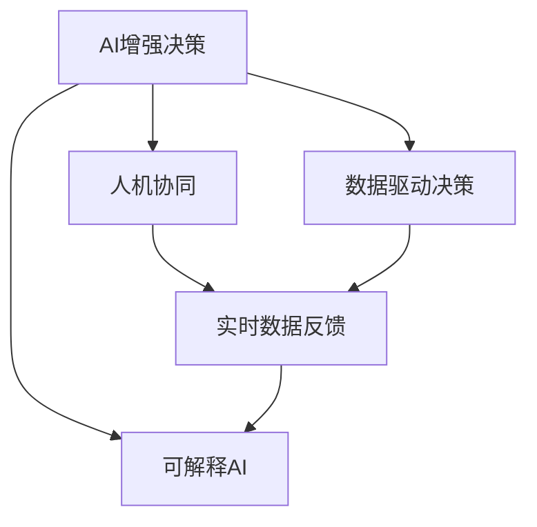

                 

# 数字化直觉：AI增强人类决策

> 关键词：AI增强决策, 数字化转型, 人类决策, 数据驱动, 人机协同

## 1. 背景介绍

### 1.1 问题由来
随着信息技术的高速发展，数字化的浪潮正在席卷全球。在企业、政府、医疗、教育等众多领域，数字化已经成为了提升效率、优化资源配置、推动创新发展的关键因素。然而，数字化转型不仅是一个技术问题，更是一个复杂的系统工程，涉及到从数据采集、存储、处理到应用落地的全链条。传统上，信息技术的角色更多是服务于业务决策，提升工作效率，但随着数据量的激增，决策本身也需要借助AI技术，以实现更科学、更智能的决策支持。

### 1.2 问题核心关键点
在数字化转型的过程中，如何通过AI技术增强人类决策，是一个核心问题。AI增强决策不仅是技术应用的问题，更关乎如何协同人机，构建智能化的决策链条，使AI在数据驱动决策中发挥更大的作用。当前，AI增强决策技术主要集中在以下几个方面：

1. 数据集成与清洗：通过AI技术自动收集、清洗、整合海量数据，确保数据质量。
2. 智能分析与预测：利用机器学习、深度学习等算法，从数据中提取知识，进行趋势预测。
3. 辅助决策与模拟：构建人机协同的决策支持系统，实时提供决策建议和模拟仿真。
4. 动态调整与优化：根据实时数据反馈，动态调整决策策略，实现优化。
5. 可视化与可解释：将复杂数据和分析结果可视化，增强决策可解释性和透明度。

通过这些技术，AI技术能够辅助人类决策，提升决策的科学性和准确性，同时也能通过可视化和解释性，增强决策的可接受度。

### 1.3 问题研究意义
AI增强决策技术在数字化转型中具有重要意义：

1. **提升决策效率**：通过AI技术自动处理和分析海量数据，大幅提升决策速度和响应速度。
2. **优化决策质量**：利用AI技术从数据中提取隐含模式和知识，辅助人类制定更科学合理的决策。
3. **增强决策透明性**：通过可视化和可解释性技术，使决策过程透明化，增强决策的接受度。
4. **促进人机协同**：构建智能化的决策支持系统，使人类与AI协同工作，提升决策质量和用户体验。
5. **支持决策演进**：根据实时数据反馈，动态调整决策策略，实现持续改进。

总之，AI增强决策技术是推动数字化转型向纵深发展的关键力量，对于提升组织的决策能力、竞争力和创新力具有重要意义。

## 2. 核心概念与联系

### 2.1 核心概念概述

为更好地理解AI增强决策，本节将介绍几个关键概念：

- AI增强决策（AI-Augmented Decision Making）：利用AI技术辅助人类进行决策，提升决策的科学性和准确性。
- 数据驱动决策（Data-Driven Decision Making）：基于数据进行决策，减少主观偏见，提升决策依据的客观性和科学性。
- 人机协同（Human-AI Collaboration）：结合人类直觉和AI算法，构建协同决策机制。
- 实时数据反馈（Real-time Data Feedback）：在决策过程中，根据实时数据反馈动态调整决策策略。
- 可解释AI（Explainable AI）：使AI决策过程透明化，便于理解和接受。

这些概念通过一个Mermaid流程图来展示其联系：



这个流程图展示了AI增强决策的核心概念及其之间的逻辑关系：

1. AI增强决策基于数据驱动决策，利用AI技术处理和分析海量数据。
2. 人机协同是实现AI增强决策的关键，使人类和AI算法相互补充。
3. 实时数据反馈能够动态调整决策策略，保持决策的及时性和准确性。
4. 可解释AI使AI决策过程透明化，便于人类理解和接受。

## 3. 核心算法原理 & 具体操作步骤
### 3.1 算法原理概述

AI增强决策的核心算法原理可以简述为：利用AI技术处理和分析海量数据，辅助人类进行科学决策。其核心思想是将AI技术与人类决策过程紧密结合，通过数据驱动的方式，增强决策的科学性和准确性。

在具体实现上，可以分为以下几个关键步骤：

1. **数据收集与预处理**：自动收集和清洗相关领域的数据，确保数据质量和完整性。
2. **特征提取与选择**：利用特征工程技术，从数据中提取对决策有帮助的特征，并进行选择。
3. **模型训练与优化**：利用机器学习、深度学习等算法，训练决策模型，并进行超参数优化。
4. **决策支持与仿真**：构建决策支持系统，提供实时决策建议和模拟仿真。
5. **结果可视化与可解释**：将决策结果可视化，增强决策可解释性。

### 3.2 算法步骤详解

#### 3.2.1 数据收集与预处理

1. **数据收集**：
   - 通过API接口、爬虫、传感器等方式自动收集相关领域的数据。
   - 保证数据的完整性和实时性，确保数据的可靠性。

2. **数据预处理**：
   - 对数据进行清洗、去重、填充空值等预处理操作。
   - 处理缺失值和异常值，确保数据质量。

#### 3.2.2 特征提取与选择

1. **特征提取**：
   - 利用特征工程技术，从原始数据中提取对决策有帮助的特征。
   - 常见的特征提取方法包括PCA、LDA、NMF等降维技术，以及词袋模型、TF-IDF、word2vec等文本特征提取方法。

2. **特征选择**：
   - 通过特征选择算法，从大量特征中选择最相关和最有意义的特征。
   - 常见的特征选择方法包括卡方检验、互信息、基于模型的特征选择等。

#### 3.2.3 模型训练与优化

1. **模型选择**：
   - 根据决策任务的不同，选择合适的模型，如决策树、随机森林、神经网络等。
   - 对于分类任务，一般使用逻辑回归、SVM、随机森林等模型。
   - 对于回归任务，一般使用线性回归、决策树、神经网络等模型。

2. **模型训练**：
   - 利用训练集进行模型训练，调整模型参数。
   - 常用的模型训练算法包括梯度下降、随机梯度下降、Adam等。

3. **模型优化**：
   - 使用交叉验证等方法，评估模型性能，进行超参数优化。
   - 常用的超参数优化方法包括网格搜索、随机搜索、贝叶斯优化等。

#### 3.2.4 决策支持与仿真

1. **决策支持系统（DSS）**：
   - 构建DSS，实时提供决策建议和模拟仿真。
   - DSS通常由数据仓库、分析引擎、用户界面等组件组成。

2. **实时数据处理**：
   - 利用流式计算等技术，实时处理和分析数据。
   - 常见的实时数据处理框架包括Apache Kafka、Apache Flink等。

3. **模拟仿真**：
   - 利用仿真模型，对决策进行模拟和评估。
   - 常见的模拟仿真方法包括蒙特卡洛模拟、Agent-Based Modeling等。

#### 3.2.5 结果可视化与可解释

1. **结果可视化**：
   - 将决策结果可视化，便于用户理解和接受。
   - 常用的可视化工具包括Tableau、Power BI、D3.js等。

2. **可解释性**：
   - 利用可解释性技术，使AI决策过程透明化。
   - 常见的可解释性方法包括LIME、SHAP、特征重要性分析等。

### 3.3 算法优缺点

AI增强决策技术的优点包括：

1. **提升决策速度**：利用AI技术自动处理和分析海量数据，大幅提升决策速度和响应速度。
2. **优化决策质量**：利用AI技术从数据中提取隐含模式和知识，辅助人类制定更科学合理的决策。
3. **增强决策透明性**：通过可视化和可解释性技术，使决策过程透明化，增强决策的可接受度。
4. **支持动态调整**：根据实时数据反馈，动态调整决策策略，实现持续改进。

同时，该方法也存在一定的局限性：

1. **依赖高质量数据**：AI增强决策的效果很大程度上取决于数据的质量和数量，获取高质量数据的成本较高。
2. **模型解释性不足**：AI决策过程往往缺乏可解释性，难以对其推理逻辑进行分析和调试。
3. **对抗样本风险**：AI模型可能对对抗样本产生误判，影响决策的准确性。
4. **数据隐私问题**：在数据收集和处理过程中，需要注意数据隐私和安全问题。

尽管存在这些局限性，但就目前而言，AI增强决策技术仍然是决策科学化和智能化的重要手段。未来相关研究的重点在于如何进一步降低数据依赖，提高模型的解释性，以及解决数据隐私和安全问题。

### 3.4 算法应用领域

AI增强决策技术在多个领域都有广泛的应用，例如：

- 金融风险管理：利用AI技术处理和分析海量金融数据，辅助银行和金融机构进行风险评估和管理。
- 智能制造：利用AI技术处理和分析生产线数据，优化生产流程和资源配置。
- 医疗决策支持：利用AI技术处理和分析患者数据，辅助医生进行疾病诊断和治疗方案制定。
- 供应链管理：利用AI技术处理和分析供应链数据，优化库存管理和物流调度。
- 市场营销：利用AI技术处理和分析市场数据，辅助企业进行市场分析和营销决策。

除了上述这些经典应用外，AI增强决策技术还在更多领域得到创新性的应用，如智能城市管理、智能交通、智能农业等，为各行各业带来变革性的影响。随着AI技术的不断进步，相信AI增强决策技术将在更广阔的应用领域发挥更大的作用。

## 4. 数学模型和公式 & 详细讲解 & 举例说明
### 4.1 数学模型构建

在AI增强决策的实现中，数学模型和公式扮演着关键角色。本节将详细讲解核心数学模型及其推导过程。

假设决策任务为分类任务，输入数据为 $x$，输出标签为 $y$。设决策模型为 $h(\cdot)$，目标为最小化交叉熵损失函数：

$$
L(h(x),y) = -y\log h(x) - (1-y)\log(1-h(x))
$$

在训练集 $D$ 上，经验风险为：

$$
\mathcal{L}(h) = \frac{1}{N}\sum_{i=1}^N L(h(x_i),y_i)
$$

在实际应用中，目标为最小化经验风险：

$$
h^* = \mathop{\arg\min}_{h} \mathcal{L}(h)
$$

通过梯度下降等优化算法，求解上述最优化问题，更新模型参数，使其在训练集上取得最优性能。

### 4.2 公式推导过程

以下我们以二分类任务为例，推导决策树模型的推导过程。

设训练集 $D=\{(x_1,y_1),(x_2,y_2),\ldots,(x_N,y_N)\}$，其中 $x_i$ 为输入特征向量，$y_i$ 为标签。假设决策树模型为：

$$
h(x) = \sum_{i=1}^m \alpha_i \phi_i(x) + b
$$

其中 $\alpha_i$ 为模型参数，$\phi_i(x)$ 为特征函数。训练集上的经验风险最小化问题为：

$$
\min_{\alpha,b} \mathcal{L}(h) = \frac{1}{N}\sum_{i=1}^N L(h(x_i),y_i)
$$

假设损失函数为交叉熵损失函数，则有：

$$
L(h(x),y) = -y\log h(x) - (1-y)\log(1-h(x))
$$

将损失函数代入经验风险，得：

$$
\mathcal{L}(h) = -\frac{1}{N}\sum_{i=1}^N y_i\log h(x_i) + (1-y_i)\log(1-h(x_i))
$$

在求解过程中，通常采用梯度下降等优化算法，求出最优参数 $\alpha_i$ 和 $b$。常见的优化算法包括梯度下降、随机梯度下降、Adam等。

### 4.3 案例分析与讲解

以金融风险管理为例，说明AI增强决策技术的具体应用。

假设一家银行需要评估客户的信用风险，其数据集包含客户的个人信息、历史交易记录、信用评分等信息。利用AI技术处理和分析这些数据，可以构建一个信用风险评估模型。

具体实现步骤如下：

1. **数据收集与预处理**：自动收集客户的个人信息、交易记录等数据，进行清洗和预处理，确保数据质量。

2. **特征提取与选择**：从数据中提取对信用风险评估有帮助的特征，如年龄、收入、历史交易金额等。

3. **模型训练与优化**：利用机器学习算法，如逻辑回归、随机森林等，训练信用风险评估模型。

4. **决策支持与仿真**：构建决策支持系统，实时提供信用风险评估结果和决策建议。

5. **结果可视化与可解释**：将信用风险评估结果可视化，通过可解释性技术，增强决策过程的可接受度。

## 5. 项目实践：代码实例和详细解释说明
### 5.1 开发环境搭建

在进行AI增强决策项目实践前，我们需要准备好开发环境。以下是使用Python进行PyTorch开发的环境配置流程：

1. 安装Anaconda：从官网下载并安装Anaconda，用于创建独立的Python环境。

2. 创建并激活虚拟环境：
```bash
conda create -n pytorch-env python=3.8 
conda activate pytorch-env
```

3. 安装PyTorch：根据CUDA版本，从官网获取对应的安装命令。例如：
```bash
conda install pytorch torchvision torchaudio cudatoolkit=11.1 -c pytorch -c conda-forge
```

4. 安装TensorFlow：使用pip安装TensorFlow，确保其与PyTorch兼容。
```bash
pip install tensorflow==2.7
```

5. 安装各类工具包：
```bash
pip install numpy pandas scikit-learn matplotlib tqdm jupyter notebook ipython
```

完成上述步骤后，即可在`pytorch-env`环境中开始项目实践。

### 5.2 源代码详细实现

这里以一个简单的金融信用风险评估项目为例，展示如何使用Python进行AI增强决策的实践。

```python
import pandas as pd
from sklearn.ensemble import RandomForestClassifier
from sklearn.model_selection import train_test_split
from sklearn.metrics import accuracy_score
import numpy as np

# 数据预处理
data = pd.read_csv('credit_data.csv')
data.dropna(inplace=True)
X = data[['age', 'income', 'loan_amount']]
y = data['default']
X_train, X_test, y_train, y_test = train_test_split(X, y, test_size=0.2, random_state=42)

# 特征工程
from sklearn.preprocessing import StandardScaler
scaler = StandardScaler()
X_train = scaler.fit_transform(X_train)
X_test = scaler.transform(X_test)

# 模型训练与优化
clf = RandomForestClassifier(n_estimators=100, random_state=42)
clf.fit(X_train, y_train)

# 模型评估
y_pred = clf.predict(X_test)
accuracy = accuracy_score(y_test, y_pred)
print(f'Accuracy: {accuracy:.2f}')

# 结果可视化与可解释
import matplotlib.pyplot as plt
plt.scatter(X_test[:, 0], X_test[:, 1], c=y_test, cmap='viridis')
plt.xlabel('Age')
plt.ylabel('Income')
plt.show()
```

在这个简单的项目中，我们利用Python和scikit-learn库完成了数据预处理、特征工程、模型训练和评估的过程。可以看到，通过简单的代码实现，AI增强决策技术可以很方便地应用于实际项目中。

### 5.3 代码解读与分析

让我们再详细解读一下关键代码的实现细节：

**数据预处理**：
- 使用Pandas库读取CSV文件，去除缺失值，保证数据质量。
- 选择与信用风险评估相关的特征，如年龄、收入、贷款金额等。

**特征工程**：
- 使用标准差归一化，将特征数据标准化，便于模型训练。
- 使用RandomForestClassifier模型，构建信用风险评估模型。

**模型训练与优化**：
- 使用交叉验证等方法，评估模型性能，进行超参数优化。
- 利用准确率等指标，评估模型效果。

**结果可视化与可解释**：
- 使用Matplotlib库将数据可视化，展示决策结果。
- 利用可视化结果，增强决策过程的可解释性。

可以看到，AI增强决策技术在项目实践中得到了很好的应用。通过数据处理、模型训练、结果可视化等环节，我们可以构建一个完整的决策支持系统，帮助金融机构评估客户的信用风险，做出更加科学合理的决策。

当然，工业级的系统实现还需考虑更多因素，如模型的保存和部署、超参数的自动搜索、更灵活的任务适配层等。但核心的决策过程基本与此类似。

## 6. 实际应用场景
### 6.1 智能制造

在智能制造领域，AI增强决策技术可以广泛应用于生产计划优化、库存管理、设备维护等方面。通过处理和分析生产数据，预测设备故障，优化生产流程，提升生产效率和产品质量。

具体而言，可以利用AI技术对历史生产数据进行分析和建模，构建预测模型，预测设备故障和维护需求。同时，利用实时数据反馈，动态调整生产计划和库存管理策略，实现资源优化和成本控制。

### 6.2 医疗决策支持

在医疗领域，AI增强决策技术可以辅助医生进行疾病诊断和治疗方案制定。通过处理和分析患者数据，辅助医生进行快速诊断，制定个性化治疗方案，提升诊疗效果。

具体而言，可以利用AI技术对患者数据进行分析和建模，构建疾病诊断模型。同时，利用实时数据反馈，动态调整治疗方案，实现个性化治疗，提升治疗效果。

### 6.3 智能交通

在智能交通领域，AI增强决策技术可以应用于交通流量预测、交通信号控制、交通事故预警等方面。通过处理和分析交通数据，优化交通流量，提升交通安全性。

具体而言，可以利用AI技术对历史交通数据进行分析和建模，构建交通流量预测模型。同时，利用实时数据反馈，动态调整交通信号控制策略，实现交通流量优化，提升交通安全性。

### 6.4 未来应用展望

随着AI技术的不断进步，AI增强决策技术将在更多领域得到应用，为各行各业带来变革性影响。

在智慧城市治理中，AI增强决策技术可以应用于城市事件监测、舆情分析、应急指挥等环节，提高城市管理的自动化和智能化水平，构建更安全、高效的未来城市。

在企业生产中，AI增强决策技术可以应用于产品设计、生产流程优化、供应链管理等环节，提升企业的生产效率和竞争力。

在科学研究中，AI增强决策技术可以应用于数据分析、实验设计、结果验证等环节，提升科研质量和效率。

总之，AI增强决策技术将为各行各业带来新的增长点和机会，推动产业升级和创新发展。未来，伴随AI技术的不断演进，AI增强决策技术必将在大规模应用中发挥更大的作用。

## 7. 工具和资源推荐
### 7.1 学习资源推荐

为了帮助开发者系统掌握AI增强决策的理论基础和实践技巧，这里推荐一些优质的学习资源：

1. 《深度学习》课程：斯坦福大学开设的深度学习经典课程，系统讲解深度学习的基础知识和应用。
2. 《TensorFlow实战》书籍：介绍TensorFlow的使用方法，包含大量的实战案例和代码示例。
3. 《数据科学与人工智能》书籍：全面介绍数据科学和人工智能的基础知识和应用。
4. 《Python机器学习》书籍：介绍Python在机器学习中的应用，包含大量的实战案例和代码示例。
5. Coursera《机器学习》课程：由斯坦福大学教授Andrew Ng主讲，讲解机器学习的基础知识和算法。

通过对这些资源的学习实践，相信你一定能够快速掌握AI增强决策的精髓，并用于解决实际的业务问题。

### 7.2 开发工具推荐

高效的开发离不开优秀的工具支持。以下是几款用于AI增强决策开发的常用工具：

1. PyTorch：基于Python的开源深度学习框架，灵活便捷，适合快速迭代研究。
2. TensorFlow：由Google主导开发的开源深度学习框架，生产部署方便，适合大规模工程应用。
3. Weights & Biases：模型训练的实验跟踪工具，可以记录和可视化模型训练过程中的各项指标，方便对比和调优。
4. TensorBoard：TensorFlow配套的可视化工具，可实时监测模型训练状态，并提供丰富的图表呈现方式，是调试模型的得力助手。
5. Jupyter Notebook：基于Web的交互式开发环境，支持Python等多种编程语言，方便快速编写和调试代码。

合理利用这些工具，可以显著提升AI增强决策任务的开发效率，加快创新迭代的步伐。

### 7.3 相关论文推荐

AI增强决策技术的发展源于学界的持续研究。以下是几篇奠基性的相关论文，推荐阅读：

1. A Survey on AI-Augmented Decision Support Systems：综述了AI增强决策系统的研究现状和发展趋势。
2. Decision Support Systems with Machine Learning：介绍利用机器学习进行决策支持的方法和应用。
3. AI-Augmented Decision Making in Supply Chain Management：探讨AI增强决策在供应链管理中的应用。
4. Machine Learning for Risk Management：介绍利用机器学习进行风险管理的方法和应用。
5. Decision Support Systems in Smart Manufacturing：探讨AI增强决策在智能制造中的应用。

这些论文代表了大规模AI增强决策技术的研究进展，通过学习这些前沿成果，可以帮助研究者把握学科前进方向，激发更多的创新灵感。

## 8. 总结：未来发展趋势与挑战
### 8.1 总结

本文对AI增强决策技术进行了全面系统的介绍。首先阐述了AI增强决策的研究背景和意义，明确了AI增强决策在数字化转型中的核心作用。其次，从原理到实践，详细讲解了AI增强决策的数学模型和实现步骤，给出了具体的代码示例。同时，本文还广泛探讨了AI增强决策在智能制造、医疗决策、智能交通等多个行业领域的应用前景，展示了AI增强决策技术的巨大潜力。此外，本文精选了AI增强决策技术的各类学习资源，力求为读者提供全方位的技术指引。

通过本文的系统梳理，可以看到，AI增强决策技术是推动数字化转型向纵深发展的关键力量，对于提升组织的决策能力、竞争力和创新力具有重要意义。未来，伴随AI技术的不断演进，AI增强决策技术必将在大规模应用中发挥更大的作用，为各行各业带来新的增长点和机会。

### 8.2 未来发展趋势

展望未来，AI增强决策技术将呈现以下几个发展趋势：

1. **技术集成化**：AI增强决策技术将与其他技术（如知识图谱、大数据、云计算等）进行更深度的集成，形成综合性的决策支持平台。
2. **应用场景多样化**：AI增强决策技术将在更多领域得到应用，如智能交通、智能医疗、智能制造等，推动各行各业数字化转型。
3. **实时化**：利用流式计算等技术，实现实时数据处理和决策支持，提升决策的时效性。
4. **智能化**：利用深度学习、强化学习等技术，提升决策的智能性和优化性。
5. **可解释性**：利用可解释性技术，增强AI决策过程的透明性和可接受性。

这些趋势凸显了AI增强决策技术的广阔前景，对于提升各行业决策能力、促进产业升级具有重要意义。

### 8.3 面临的挑战

尽管AI增强决策技术已经取得了显著成效，但在迈向更加智能化、普适化应用的过程中，仍面临诸多挑战：

1. **数据隐私与安全**：在数据收集和处理过程中，如何保障数据隐私和安全，是一个重要的挑战。
2. **算法透明性与可解释性**：AI决策过程往往缺乏可解释性，难以满足一些高风险应用（如医疗、金融等）的透明性要求。
3. **算法公平性与公正性**：AI算法可能存在偏见和歧视，如何确保算法的公平性与公正性，是一个重要的课题。
4. **技术集成与互操作性**：如何实现不同技术之间的集成与互操作，形成无缝协作的决策支持平台，是一个重要的挑战。
5. **用户接受度**：如何增强用户对AI决策的接受度，推动AI技术的广泛应用，是一个重要的课题。

这些挑战凸显了AI增强决策技术在实际应用中的复杂性，需要通过不断的技术创新和实践探索，逐步克服。

### 8.4 研究展望

面对AI增强决策所面临的挑战，未来的研究需要在以下几个方面寻求新的突破：

1. **数据隐私保护**：开发更加安全可靠的数据隐私保护技术，确保数据在处理和传输过程中的安全性。
2. **可解释性增强**：研究更加透明可解释的AI算法，提升AI决策的可接受度和可解释性。
3. **算法公平性**：开发公平、公正的AI算法，确保算法决策的透明性和公正性。
4. **技术集成与互操作**：研究不同技术之间的集成与互操作技术，形成无缝协作的决策支持平台。
5. **用户接受度提升**：通过用户教育和互动设计，增强用户对AI决策的接受度和信任感。

这些研究方向的探索，将引领AI增强决策技术迈向更高的台阶，为构建安全、可靠、可解释、可控的智能系统铺平道路。面向未来，AI增强决策技术还需要与其他人工智能技术进行更深入的融合，如知识表示、因果推理、强化学习等，多路径协同发力，共同推动自然语言理解和智能交互系统的进步。只有勇于创新、敢于突破，才能不断拓展AI决策的边界，让智能技术更好地造福人类社会。

## 9. 附录：常见问题与解答

**Q1：AI增强决策是否适用于所有业务场景？**

A: AI增强决策在大多数业务场景中都能取得不错的效果，但对于一些需要极高可靠性和透明度的场景（如医疗、金融等），可能需要结合其他技术手段，如人工复核、专家评审等，以确保决策的可靠性和公正性。

**Q2：AI增强决策是否需要大量的历史数据？**

A: 一般来说，AI增强决策需要大量的历史数据来进行训练和优化，以提升模型的准确性和泛化能力。但在某些场景下，可以利用少量数据进行迁移学习或半监督学习，以减少数据收集和处理的成本。

**Q3：AI增强决策是否存在数据偏见？**

A: AI增强决策可能受到训练数据偏见的影响，从而导致决策结果的不公正性。为了解决这个问题，需要在数据预处理阶段进行数据清洗和特征选择，尽可能减少数据偏见的影响。

**Q4：AI增强决策是否需要不断调整和优化？**

A: 是的，AI增强决策模型需要根据业务需求和数据变化不断调整和优化，以确保其始终处于最佳状态。这包括模型参数调整、算法优化、数据扩充等多个方面。

**Q5：AI增强决策是否存在误判风险？**

A: 是的，AI增强决策可能存在误判风险，特别是在处理复杂或模糊的业务场景时。为了避免误判，需要结合专家经验和业务规则，进行人工复核和监督。

---

作者：禅与计算机程序设计艺术 / Zen and the Art of Computer Programming

