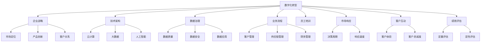

                 

# 数字化转型管理：引导传统企业迈向数字时代

## 1. 背景介绍

### 1.1 问题由来
随着信息技术的发展，数字化转型已经成为全球企业面临的重要挑战。传统企业在面临市场竞争、技术迭代、客户需求变化等压力时，如何借助数字化手段提升效率、优化流程、创造新的业务价值，成为关乎企业生存和发展的关键问题。数字化转型不仅包括IT系统的升级换代，更是组织理念、业务模式、管理方式的全方位变革。

### 1.2 问题核心关键点
数字化转型管理的关键点包括：
1. **企业战略与数字化愿景**：明确企业数字化转型的目标和方向，制定切实可行的数字化战略。
2. **技术架构与数据治理**：构建灵活可扩展的技术架构，实施严格的数据治理，确保数据的安全、完整和可用。
3. **业务流程与员工培训**：优化现有业务流程，提升员工数字化素养，推动业务流程的数字化。
4. **市场响应与客户互动**：增强市场敏捷性，改善客户体验，构建客户为中心的业务模式。
5. **绩效评估与持续改进**：建立科学的绩效评估体系，持续监控和改进数字化转型进程，确保转型效果。

## 2. 核心概念与联系

### 2.1 核心概念概述

为更好地理解数字化转型管理，本节将介绍几个密切相关的核心概念：

- **数字化转型(Digital Transformation)**：企业利用数字技术改造业务流程、优化组织架构、提升运营效率和客户体验的过程。
- **企业战略(Strategic Vision)**：企业对于未来发展方向的总体规划和目标设定，包括市场定位、产品创新、客户关系等方面。
- **技术架构(Architectural Framework)**：支撑企业数字化转型的技术基础架构，包括云计算、大数据、人工智能等关键技术。
- **数据治理(Data Governance)**：管理数据的质量、安全、治理和应用的策略和流程，确保数据的一致性、完整性和可靠性。
- **业务流程(Business Process)**：企业内部的各项业务活动及其相互作用，包括客户管理、供应链管理、财务管理等。
- **员工培训(Employee Training)**：提升员工对数字化工具的熟悉度和使用能力，使其能够适应新的业务模式和工作流程。
- **市场响应(Market Responsiveness)**：企业对市场变化和客户需求的快速反应能力，通过数字化手段缩短决策周期、提升响应速度。
- **客户互动(Customer Engagement)**：通过数字化手段改善客户体验，建立长期的客户关系，提升客户忠诚度。
- **绩效评估(Performance Evaluation)**：通过定量和定性的方法，评估数字化转型的效果，识别改进机会。

这些核心概念之间的逻辑关系可以通过以下Mermaid流程图来展示：



这个流程图展示了大规模数字化转型的核心概念及其之间的关系：

1. 数字化转型驱动企业战略、技术架构、数据治理等关键维度。
2. 企业战略和业务流程优化是数字化转型的重要目标。
3. 技术架构、数据治理、员工培训等支持数字化转型的实现。
4. 市场响应和客户互动是数字化转型的核心指标。
5. 绩效评估是数字化转型的持续监控工具。

## 3. 核心算法原理 & 具体操作步骤
### 3.1 算法原理概述

数字化转型管理的核心算法原理是基于业务驱动的数字化创新，通过数据驱动和持续优化，实现企业流程和运营效率的提升。具体来说，数字化转型管理包含以下几个关键步骤：

1. **需求分析**：通过市场调研、客户反馈、数据分析等手段，识别业务痛点和改进需求。
2. **战略规划**：制定明确的数字化转型战略目标，确定优先级和资源分配。
3. **技术选型**：选择适合企业需求的技术平台和工具，构建灵活、可扩展的技术架构。
4. **数据治理**：建立数据标准和治理流程，确保数据的质量、安全和应用。
5. **流程优化**：重新设计业务流程，引入自动化和数字化手段，提升效率和响应速度。
6. **员工培训**：提升员工对新系统的使用能力，推动业务流程的数字化。
7. **市场响应**：通过数字化手段缩短决策周期，提高市场敏捷性。
8. **客户互动**：改善客户体验，建立长期的客户关系。
9. **绩效评估**：建立科学的评估体系，持续监控和改进数字化转型进程。

### 3.2 算法步骤详解

数字化转型管理的具体操作步骤如下：

**Step 1: 需求分析**
- 进行市场调研和客户反馈，了解业务痛点和改进需求。
- 分析现有数据，识别业务流程中的瓶颈和改进点。
- 制定初步的数字化转型需求清单，明确具体的改进目标。

**Step 2: 战略规划**
- 根据需求清单，制定数字化转型战略目标。
- 确定转型的优先级和资源分配，制定实施计划和时间表。
- 明确数字化转型的关键绩效指标(KPIs)，为后续评估提供依据。

**Step 3: 技术选型**
- 评估现有IT架构，选择适合的技术平台和工具。
- 考虑云计算、大数据、人工智能等关键技术，构建灵活的技术架构。
- 引入先进的技术标准和最佳实践，确保技术选型的科学性和可扩展性。

**Step 4: 数据治理**
- 建立数据质量管理机制，确保数据的准确性、完整性和一致性。
- 制定数据安全策略，保护数据隐私和安全性。
- 制定数据应用管理流程，确保数据的高效利用和治理。

**Step 5: 流程优化**
- 重新设计业务流程，引入自动化和数字化手段。
- 优化数据流程，提升数据处理效率和质量。
- 引入敏捷开发方法，快速迭代改进业务流程。

**Step 6: 员工培训**
- 制定员工培训计划，提升员工对新系统的使用能力。
- 提供系统操作手册和培训资源，帮助员工快速上手。
- 建立培训反馈机制，持续改进培训效果。

**Step 7: 市场响应**
- 通过数据分析和市场调研，缩短决策周期。
- 引入数字化工具，提升市场敏捷性。
- 建立快速响应机制，及时应对市场变化。

**Step 8: 客户互动**
- 改善客户体验，提升客户满意度。
- 引入数字化手段，建立长期客户关系。
- 利用数据分析，提升客户忠诚度。

**Step 9: 绩效评估**
- 建立科学的绩效评估体系，包括定量评估和定性评估。
- 通过定量和定性方法，监控和改进数字化转型进程。
- 根据评估结果，调整数字化转型的方向和策略。

### 3.3 算法优缺点

数字化转型管理的优点包括：
1. 提升业务效率：通过优化流程和引入自动化，提升业务效率和响应速度。
2. 改善客户体验：通过数字化手段改善客户体验，增强客户忠诚度。
3. 增强市场响应：通过数据分析和快速决策，增强市场敏捷性。
4. 提升员工能力：通过员工培训，提升员工数字化素养和技能。
5. 数据驱动决策：通过数据驱动的决策机制，提高决策的科学性和准确性。

数字化转型管理的缺点包括：
1. 投入成本高：数字化转型需要高额的资金投入，包括硬件、软件、人员培训等。
2. 风险管理难度大：数字化转型涉及多方面因素，风险管理难度较大。
3. 组织变革挑战：数字化转型需要企业文化的变革和组织的重构，面临一定的阻力。
4. 数据隐私和安全问题：数据治理和隐私保护需要特别注意，防止数据泄露和滥用。
5. 技术复杂度高：数字化转型涉及多方面的技术选型和整合，技术复杂度较高。

尽管存在这些缺点，数字化转型管理的总体趋势是积极向前的，通过科学的管理和不断的优化，可以最大程度地发挥其优势，克服其劣势。

### 3.4 算法应用领域

数字化转型管理在多个行业领域都有广泛的应用，包括：

- **制造业**：通过数字化手段提升生产效率、优化供应链管理，实现智能制造。
- **金融业**：通过数字化转型提升服务效率、优化风控体系，实现数字化金融。
- **医疗健康**：通过数字化转型提升医疗服务效率、优化医疗资源配置，实现智慧医疗。
- **零售业**：通过数字化转型优化客户体验、提升营销效率，实现智能零售。
- **能源行业**：通过数字化转型提升能源管理效率、优化资源配置，实现绿色能源。

除了这些传统行业，数字化转型管理在更多新兴领域也有广阔的应用前景，如智慧城市、智慧农业、智慧旅游等，为各行各业带来了新的发展机遇。

## 4. 数学模型和公式 & 详细讲解
### 4.1 数学模型构建

数字化转型管理涉及多个关键领域的综合优化，其中数据驱动和业务驱动是核心。以下将从数学角度构建数字化转型管理的模型。

记数字化转型的目标为 $T$，包括业务效率、客户体验、市场响应等关键指标。设数字化转型的关键决策变量为 $\mathbf{x} = [x_1, x_2, \ldots, x_n]$，其中 $x_i$ 表示第 $i$ 个决策变量，如流程优化、技术选型等。

数字化转型的目标函数为：

$$
T = f(\mathbf{x}) = \sum_{i=1}^n w_i x_i
$$

其中 $w_i$ 为决策变量的权重，表示不同决策变量对目标的影响程度。

数字化转型的约束条件包括：
1. **成本约束**：总成本不超过预算上限，记为 $C = \sum_{i=1}^n c_i x_i$，其中 $c_i$ 为第 $i$ 个决策变量的成本系数。
2. **时间约束**：总实施时间不超过计划周期，记为 $T_{\text{total}} = \sum_{i=1}^n t_i x_i$，其中 $t_i$ 为第 $i$ 个决策变量所需的时间。
3. **资源约束**：资源需求不超过可用资源上限，记为 $R = \sum_{i=1}^n r_i x_i$，其中 $r_i$ 为第 $i$ 个决策变量的资源需求系数。

数字化转型的优化目标是最小化成本和最大化目标值，即：

$$
\min \left\{ C, \sum_{i=1}^n w_i x_i \right\}
$$

$$
\text{s.t.} \begin{cases}
C = \sum_{i=1}^n c_i x_i \leq B \\
T_{\text{total}} = \sum_{i=1}^n t_i x_i \leq T_{\text{max}} \\
R = \sum_{i=1}^n r_i x_i \leq R_{\text{max}} \\
x_i \geq 0
\end{cases}
$$

其中 $B$、$T_{\text{max}}$、$R_{\text{max}}$ 分别表示预算上限、计划周期和资源上限。

### 4.2 公式推导过程

以业务效率优化为例，通过引入数据驱动和业务驱动的指标，构建优化模型。假设业务效率 $E$ 包括生产效率、运营效率等，优化目标为：

$$
E = \max \left\{ \sum_{i=1}^n w_i x_i \right\}
$$

其中 $w_i$ 为第 $i$ 个决策变量的权重，表示不同决策变量对业务效率的影响程度。

优化模型的约束条件包括：
1. **成本约束**：总成本不超过预算上限，记为 $C = \sum_{i=1}^n c_i x_i$，其中 $c_i$ 为第 $i$ 个决策变量的成本系数。
2. **时间约束**：总实施时间不超过计划周期，记为 $T_{\text{total}} = \sum_{i=1}^n t_i x_i$，其中 $t_i$ 为第 $i$ 个决策变量所需的时间。
3. **资源约束**：资源需求不超过可用资源上限，记为 $R = \sum_{i=1}^n r_i x_i$，其中 $r_i$ 为第 $i$ 个决策变量的资源需求系数。

优化模型的数学表达式为：

$$
\max \left\{ \sum_{i=1}^n w_i x_i \right\}
$$

$$
\text{s.t.} \begin{cases}
C = \sum_{i=1}^n c_i x_i \leq B \\
T_{\text{total}} = \sum_{i=1}^n t_i x_i \leq T_{\text{max}} \\
R = \sum_{i=1}^n r_i x_i \leq R_{\text{max}} \\
x_i \geq 0
\end{cases}
$$

通过求解上述优化模型，可以找到最优的决策变量组合，实现业务效率的最优化。

### 4.3 案例分析与讲解

假设某制造业企业通过数字化转型提升生产效率，设决策变量包括引入新设备、优化生产线等。各决策变量的权重、成本、时间、资源需求如下表所示：

| 决策变量 | 权重 $w_i$ | 成本 $c_i$ | 时间 $t_i$ | 资源 $r_i$ |
|---|---|---|---|---|
| 引入新设备 | 0.5 | 1000 | 100 | 0.2 |
| 优化生产线 | 0.3 | 500 | 50 | 0.1 |
| 引入自动化系统 | 0.2 | 200 | 30 | 0.05 |

设预算上限为2000万元，计划周期为1年，资源上限为0.5，则目标函数为：

$$
E = 0.5 \times 1000 + 0.3 \times 500 + 0.2 \times 200 = 1200
$$

约束条件为：

$$
C = 1000 + 500 + 200 = 1700 \leq 2000
$$

$$
T_{\text{total}} = 100 + 50 + 30 = 180 \leq 1
$$

$$
R = 0.2 + 0.1 + 0.05 = 0.35 \leq 0.5
$$

通过求解上述优化模型，可以得到最优的决策变量组合。假设求解结果为：引入新设备500万元，优化生产线300万元，引入自动化系统100万元。则最终业务效率优化结果为：

$$
E = 0.5 \times 500 + 0.3 \times 300 + 0.2 \times 100 = 700
$$

这个案例展示了如何通过数据驱动和业务驱动的指标，构建数字化转型管理模型，优化决策变量，提升业务效率。

## 5. 项目实践：代码实例和详细解释说明
### 5.1 开发环境搭建

在进行数字化转型管理项目实践前，我们需要准备好开发环境。以下是使用Python进行PyTorch开发的环境配置流程：

1. 安装Anaconda：从官网下载并安装Anaconda，用于创建独立的Python环境。

2. 创建并激活虚拟环境：
```bash
conda create -n pytorch-env python=3.8 
conda activate pytorch-env
```

3. 安装PyTorch：根据CUDA版本，从官网获取对应的安装命令。例如：
```bash
conda install pytorch torchvision torchaudio cudatoolkit=11.1 -c pytorch -c conda-forge
```

4. 安装TensorBoard：
```bash
pip install tensorboard
```

5. 安装TensorFlow：
```bash
pip install tensorflow
```

6. 安装Pandas、Numpy、Matplotlib等辅助库：
```bash
pip install pandas numpy matplotlib
```

完成上述步骤后，即可在`pytorch-env`环境中开始数字化转型管理项目实践。

### 5.2 源代码详细实现

下面我们以制造业数字化转型为例，给出使用TensorFlow进行优化问题的代码实现。

首先，定义决策变量和目标函数：

```python
import tensorflow as tf
import numpy as np

# 决策变量
x = tf.Variable([0.0] * n)

# 目标函数
w = np.array([0.5, 0.3, 0.2])
c = np.array([1000, 500, 200])
t = np.array([100, 50, 30])
r = np.array([0.2, 0.1, 0.05])
B = 2000
T_max = 1
R_max = 0.5
E = tf.reduce_sum(w * x)
```

然后，定义约束条件：

```python
C = tf.reduce_sum(c * x)
T_total = tf.reduce_sum(t * x)
R = tf.reduce_sum(r * x)

# 约束条件
cost_constraint = tf.less_equal(C, B)
time_constraint = tf.less_equal(T_total, T_max)
resource_constraint = tf.less_equal(R, R_max)

# 目标函数约束
objective_constraint = tf.greater_equal(E, 0)

# 构建优化问题
optimization_problem = tf.keras.losses.MeanSquaredError(
    reduction=tf.keras.losses.Reduction.NONE)

# 构建优化器
optimizer = tf.keras.optimizers.Adam()
```

接着，定义优化过程：

```python
# 定义优化目标和约束条件
optimization_problem = tf.keras.losses.MeanSquaredError(
    reduction=tf.keras.losses.Reduction.NONE)

# 构建优化器
optimizer = tf.keras.optimizers.Adam()

# 定义优化目标函数
def objective(x):
    return E + optimization_problem(E - np.array([700])) + optimization_problem(E - np.array([0]))

# 定义优化器函数
def optimizer_step(x):
    optimizer.minimize(objective(x))

# 执行优化过程
def run_optimization():
    for i in range(1000):
        optimizer_step(x)
        print(f"Iteration {i+1}: E = {E.numpy()}, C = {C.numpy()}, T = {T_total.numpy()}, R = {R.numpy()}")
```

最后，启动优化流程并输出结果：

```python
run_optimization()
```

以上就是使用TensorFlow进行数字化转型管理的代码实现。可以看到，TensorFlow通过自动微分技术和优化器，高效地解决了复杂的优化问题。

### 5.3 代码解读与分析

让我们再详细解读一下关键代码的实现细节：

**决策变量和目标函数**：
- `x = tf.Variable([0.0] * n)`：定义决策变量，初始化为0向量。
- `w`、`c`、`t`、`r`、`B`、`T_max`、`R_max`、`E`：定义目标函数和约束条件的系数和参数。

**约束条件**：
- `C = tf.reduce_sum(c * x)`：计算总成本约束。
- `T_total = tf.reduce_sum(t * x)`：计算总实施时间约束。
- `R = tf.reduce_sum(r * x)`：计算资源需求约束。
- `cost_constraint`、`time_constraint`、`resource_constraint`：定义各个约束条件的布尔表达式。
- `objective_constraint`：定义目标函数约束，确保目标函数值非负。

**优化目标函数**：
- `optimization_problem`：定义优化目标函数。
- `objective`：定义优化目标函数的具体实现。
- `optimizer`：定义优化器，用于更新决策变量。

**优化过程**：
- `run_optimization`：循环执行优化过程，直到达到预设的迭代次数。
- 每轮迭代，使用优化器更新决策变量，并输出优化结果。

可以看到，TensorFlow通过强大的自动微分和优化器支持，使得复杂的优化问题能够高效求解。在实际应用中，我们只需结合具体的业务需求，调整目标函数和约束条件，即可使用TensorFlow解决实际的优化问题。

## 6. 实际应用场景
### 6.1 智能制造

数字化转型在智能制造领域的应用极为广泛。通过引入智能设备、自动化系统和数据驱动的决策机制，制造企业可以大幅提升生产效率、优化供应链管理，实现智能制造。

在技术实现上，制造企业可以借助物联网(IoT)技术，采集生产设备的实时数据，通过数据分析和机器学习模型进行预测和优化。例如，通过引入预测性维护系统，可以提前预测设备故障，减少停机时间和维护成本。通过优化生产计划和调度，可以提高资源利用率和生产效率。通过引入自动化系统和机器人，可以实现无人化生产，提高产品质量和生产灵活性。通过构建数字化平台，实现各业务系统的集成和数据共享，提升决策速度和响应速度。

### 6.2 智慧医疗

智慧医疗是数字化转型在医疗健康领域的重要应用。通过引入数字化手段，医疗企业可以提升医疗服务效率、优化医疗资源配置，实现智慧医疗。

在技术实现上，医疗企业可以借助电子病历系统(EHR)和健康管理平台，实现数据的电子化和共享。通过引入人工智能和大数据分析技术，可以实现疾病预测、个性化治疗和精准医疗。例如，通过引入医疗影像分析系统，可以实现病灶的自动诊断和分类。通过引入智能排班系统，可以实现医务人员的高效排班和资源优化。通过引入远程医疗系统，可以实现远程诊疗和健康管理，提高医疗服务的覆盖面。

### 6.3 智慧城市

智慧城市是数字化转型在城市治理领域的重要应用。通过引入数字化手段，城市管理部门可以实现智能交通、公共安全、环境监测等方面的优化，提升城市管理的自动化和智能化水平。

在技术实现上，城市管理部门可以借助城市数据平台和物联网设备，实现数据的实时采集和分析。通过引入交通管理和大数据分析技术，可以实现交通流量预测和优化，减少拥堵和污染。通过引入公共安全监控系统和大数据分析技术，可以实现安全事件的预警和应对，提高公共安全水平。通过引入环境监测和大数据分析技术，可以实现环境质量的实时监测和预警，改善城市环境。

### 6.4 未来应用展望

随着数字化转型技术的不断发展，其在各行业的应用前景将更加广阔。未来的数字化转型将不仅仅是IT系统的升级，更是组织理念、业务模式、管理方式的全面变革。

1. **工业互联网**：通过引入云计算、大数据、物联网等技术，实现工业设备和系统的数字化连接，提升生产效率和产品质量。
2. **智能供应链**：通过引入数字化手段，实现供应链的可视化、优化和自动化，提升供应链的灵活性和响应速度。
3. **智慧能源**：通过引入智能电网、能源管理系统等技术，实现能源的数字化管理，提升能源利用效率和安全性。
4. **智慧农业**：通过引入物联网设备和大数据分析技术，实现农业生产的数字化管理，提高农业生产效率和质量。
5. **智慧旅游**：通过引入数字化手段，实现旅游资源的智能化管理和游客体验的优化，提升旅游服务的质量和效率。

总之，数字化转型技术将进一步拓展各行业的应用边界，推动各行各业的数字化升级，为经济社会发展注入新的动力。未来，数字化转型将成为推动行业创新、提升企业竞争力的重要引擎。

## 7. 工具和资源推荐
### 7.1 学习资源推荐

为了帮助开发者系统掌握数字化转型管理的理论基础和实践技巧，这里推荐一些优质的学习资源：

1. **《数字化转型》系列书籍**：涵盖数字化转型的基本概念、战略规划、技术选型、实施策略等，适合企业高管和IT人员参考。
2. **《企业数字化转型实践》课程**：由知名企业咨询公司提供，涵盖数字化转型的案例分析、实践经验和操作细节。
3. **《智慧医疗》系列书籍**：介绍智慧医疗的基本概念、技术应用和实施策略，适合医疗企业和从业者参考。
4. **《智慧城市》系列书籍**：涵盖智慧城市的基本概念、技术应用和实施策略，适合城市管理部门和从业者参考。
5. **《智能制造》系列书籍**：介绍智能制造的基本概念、技术应用和实施策略，适合制造企业和从业者参考。

通过对这些资源的学习实践，相信你一定能够快速掌握数字化转型管理的精髓，并用于解决实际的业务问题。

### 7.2 开发工具推荐

高效的开发离不开优秀的工具支持。以下是几款用于数字化转型管理开发的常用工具：

1. **Python**：Python是数据科学和机器学习领域的首选语言，拥有丰富的库和工具支持。
2. **TensorFlow**：由Google主导开发的开源深度学习框架，生产部署方便，适合大规模工程应用。
3. **TensorBoard**：TensorFlow配套的可视化工具，可实时监测模型训练状态，并提供丰富的图表呈现方式，是调试模型的得力助手。
4. **Jupyter Notebook**：用于数据科学和机器学习的交互式编程环境，支持代码、文本和数学公式的混合编辑，方便快速迭代和分享。
5. **MySQL**：广泛使用的关系型数据库，适合存储和管理结构化数据。
6. **Elasticsearch**：强大的分布式搜索和分析引擎，适合处理大规模非结构化数据。

合理利用这些工具，可以显著提升数字化转型管理的开发效率，加快创新迭代的步伐。

### 7.3 相关论文推荐

数字化转型管理的发展源于学界的持续研究。以下是几篇奠基性的相关论文，推荐阅读：

1. **《数字化转型：从战略到执行》**：探讨数字化转型的理论框架和实施策略，提出数字化转型的关键成功因素。
2. **《大数据与智能决策》**：分析大数据技术在决策支持中的应用，提出基于数据的智能决策模型。
3. **《智能制造：数字化转型与未来工厂》**：探讨智能制造的基本概念、技术应用和实施策略，提出数字化转型的关键技术。
4. **《智慧医疗：大数据与人工智能在医疗中的应用》**：分析大数据和人工智能在医疗中的应用，提出智慧医疗的基本框架和实施策略。
5. **《智慧城市：数字化技术与城市治理》**：分析数字化技术在城市治理中的应用，提出智慧城市的基本框架和实施策略。

这些论文代表了大规模数字化转型的发展脉络。通过学习这些前沿成果，可以帮助研究者把握学科前进方向，激发更多的创新灵感。

## 8. 总结：未来发展趋势与挑战
### 8.1 研究成果总结

数字化转型管理的研究成果涵盖了多个关键领域，包括企业战略、技术选型、数据治理、业务流程优化、员工培训、市场响应、客户互动和绩效评估等。这些研究成果为企业提供了系统化的数字化转型方案，帮助企业提升业务效率、改善客户体验、增强市场响应，实现数字化转型目标。

### 8.2 未来发展趋势

展望未来，数字化转型管理将呈现以下几个发展趋势：

1. **技术融合**：数字化转型将更多地融合人工智能、大数据、物联网等前沿技术，推动各行业数字化升级。
2. **业务创新**：数字化转型将推动企业进行业务模式创新，探索新的业务增长点和市场机会。
3. **数据驱动**：数字化转型将更加依赖数据驱动的决策机制，提升决策的科学性和准确性。
4. **组织变革**：数字化转型将带来组织理念和文化的变革，推动企业文化的现代化。
5. **员工赋能**：数字化转型将提升员工数字化素养和技能，推动员工成长和发展。
6. **全球化发展**：数字化转型将推动全球化发展，实现跨地区、跨文化的数字化合作。

### 8.3 面临的挑战

尽管数字化转型管理取得了显著成效，但在迈向更加智能化、普适化应用的过程中，仍面临诸多挑战：

1. **技术复杂度高**：数字化转型涉及多方面的技术选型和整合，技术复杂度较高。
2. **数据隐私和安全问题**：数字化转型需要处理大量敏感数据，数据隐私和安全问题需特别注意。
3. **组织变革阻力**：数字化转型需要企业文化的变革和组织的重构，面临一定的阻力。
4. **投入成本高**：数字化转型需要高额的资金投入，包括硬件、软件、人员培训等。
5. **绩效评估难度大**：数字化转型的效果评估需要综合考虑多个维度，难度较大。

尽管存在这些挑战，数字化转型管理的总体趋势是积极向前的，通过科学的管理和不断的优化，可以最大程度地发挥其优势，克服其劣势。

### 8.4 研究展望

未来的数字化转型管理研究将在以下几个方面进行深入探索：

1. **多模态数据融合**：将符号化的先验知识，如知识图谱、逻辑规则等，与神经网络模型进行巧妙融合，引导数字化转型过程学习更准确、合理的语言模型。
2. **因果分析和博弈论工具**：将因果分析方法引入数字化转型管理，识别出模型决策的关键特征，增强输出解释的因果性和逻辑性。
3. **持续学习与优化**：通过引入持续学习与优化技术，使数字化转型管理模型能够不断从新数据中学习，提高模型的泛化性和鲁棒性。
4. **跨领域知识整合**：加强不同模态数据的整合，实现视觉、语音、文本等多模态信息与数字化转型模型的协同建模。
5. **伦理道德约束**：在模型训练目标中引入伦理导向的评估指标，过滤和惩罚有偏见、有害的输出倾向。

这些研究方向凸显了数字化转型管理技术的广阔前景。这些方向的探索发展，必将进一步提升数字化转型管理的效果和效率，推动各行业数字化转型迈向更加智能化的新高度。

## 9. 附录：常见问题与解答

**Q1：数字化转型管理的核心是什么？**

A: 数字化转型管理的核心是数据驱动的业务优化。通过采集、分析和应用数据，实现业务流程的自动化、智能化和优化。数字化转型管理的目标是提升业务效率、改善客户体验、增强市场响应，推动企业数字化升级。

**Q2：数字化转型管理对企业有什么具体的好处？**

A: 数字化转型管理对企业的好处包括：
1. 提升业务效率：通过优化业务流程和引入自动化手段，提升生产效率和服务效率。
2. 改善客户体验：通过改善客户互动和优化客户体验，提升客户满意度和忠诚度。
3. 增强市场响应：通过数据分析和快速决策，增强市场敏捷性。
4. 降低成本：通过优化资源配置和减少浪费，降低运营成本。
5. 创造新业务：通过数字化转型，探索新的业务模式和市场机会。

**Q3：数字化转型管理面临的最大挑战是什么？**

A: 数字化转型管理面临的最大挑战是技术复杂度高、投入成本高、组织变革阻力大。具体来说，数字化转型涉及多方面的技术选型和整合，技术复杂度较高。同时，数字化转型需要高额的资金投入，包括硬件、软件、人员培训等。最后，数字化转型需要企业文化的变革和组织的重构，面临一定的阻力。

**Q4：如何评估数字化转型的效果？**

A: 数字化转型的效果评估需要综合考虑多个维度，包括业务效率、客户体验、市场响应、成本控制等。具体来说，可以通过以下方法评估数字化转型的效果：
1. 定量评估：通过数据分析和建模，评估数字化转型带来的业务改进和成本节约。
2. 定性评估：通过员工反馈和客户调查，评估数字化转型带来的体验提升和满意度变化。
3. 综合评估：结合定量评估和定性评估，全面评估数字化转型的效果和改进空间。

总之，数字化转型管理是一项复杂的系统工程，需要企业在战略规划、技术选型、数据治理、业务流程优化等多个环节进行全面优化。通过科学的管理和不断的优化，可以最大限度地发挥数字化转型的优势，推动企业数字化升级，实现可持续发展。

---

作者：禅与计算机程序设计艺术 / Zen and the Art of Computer Programming

