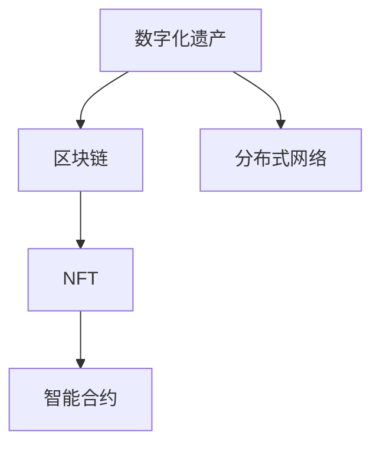

                 

# 数字化遗产收藏创业：数字资产收藏的未来模式

## 1. 背景介绍

### 1.1 问题由来

在数字化时代的浪潮下，数字化遗产收藏已成为近年来新型的投资领域。数字化遗产包括数字艺术作品、数字档案、虚拟房地产、数字游戏角色等，其特殊性在于其存在形式主要为二进制编码，而非实体形态。随着技术的发展，数字化遗产的价值逐渐显现，其市场规模也在持续扩大。

数字化遗产的收藏与传统艺术品的收藏有着显著不同。传统的艺术品收藏依赖于物理载体，比如绘画、雕塑等，而数字化遗产完全依赖于数字技术和网络平台。这种形式的转变使得数字化遗产收藏的市场需求量迅速增长，但同时也带来了新的挑战和机遇。

### 1.2 问题核心关键点

1. **数字化遗产的版权问题**：数字化遗产的收藏和交易涉及到数字版权保护，版权问题可能会限制其商业应用和流通。
2. **技术平台的选择**：选择合适的区块链或非区块链平台来存储和交易数字化遗产至关重要，需要考虑数据安全和隐私保护。
3. **市场价值评估**：数字化遗产的市场价值评估难度较大，需要综合考虑其艺术价值、技术复杂度、市场需求等因素。
4. **货币化模式**：如何通过数字化遗产创造价值，实现可持续的商业模式，是数字化遗产收藏创业的关键。
5. **技术迭代和升级**：随着技术的发展，数字化遗产收藏的方法和工具也在不断进步，需要持续跟踪最新的技术趋势和解决方案。

### 1.3 问题研究意义

数字化遗产收藏不仅仅是一种投资方式，更是一种文化和技术的结合。通过数字化遗产收藏创业，不仅可以推动数字化遗产市场的繁荣，还能促进文化创意产业的发展，提升公众对数字化遗产的认知和兴趣。对于创作者而言，数字化遗产收藏提供了一种新的创作回报方式；对于投资者而言，数字化遗产收藏具有高增值潜力和广泛的市场前景。因此，研究数字化遗产收藏创业具有重要的理论和实践意义。

## 2. 核心概念与联系

### 2.1 核心概念概述

为了更好地理解数字化遗产收藏创业的商业模式，我们需要掌握以下几个核心概念：

- **数字化遗产**：数字化遗产是以数字形式存在的各种文化遗产，包括但不限于数字艺术作品、数字档案、虚拟房地产、数字游戏角色等。
- **区块链技术**：区块链技术通过分布式账本和去中心化的方式，提供了安全的数字化遗产存储和交易平台。
- **NFT（非同质化代币）**：NFT是区块链上的代币，用于表示和验证数字化遗产的唯一性，提供了数字化遗产的产权证明和交易机制。
- **智能合约**：智能合约是在区块链上自动执行的合约，用于自动化处理数字化遗产的交易、证明和验证等事务。
- **分布式网络**：分布式网络是由多个节点组成的网络，能够提供去中心化的数据存储和传输，提高了数字化遗产的安全性和可靠性。

### 2.2 核心概念原理和架构的 Mermaid 流程图



这个流程图展示了数字化遗产收藏创业中几个核心概念之间的联系：数字化遗产需要通过区块链进行存储和交易，通过NFT证明其唯一性和所有权，智能合约用于自动化处理交易流程，而分布式网络则提供了数据存储和传输的安全保障。

## 3. 核心算法原理 & 具体操作步骤

### 3.1 算法原理概述

数字化遗产收藏创业的核心算法原理主要基于区块链技术和NFT机制。以下是对其主要原理的详细阐述：

- **区块链技术**：区块链技术通过去中心化的方式记录和验证数字化遗产的传输和交易，确保其数据的不可篡改性和安全性。
- **NFT机制**：NFT提供了数字化遗产的唯一标识和所有权证明，使得数字化遗产可以在区块链上进行交易和验证。
- **智能合约**：智能合约提供了自动化的交易执行和验证机制，简化了数字化遗产的买卖过程，提高了交易效率和安全性。

### 3.2 算法步骤详解

数字化遗产收藏创业的主要算法步骤包括：

1. **数字化遗产采集**：通过扫描、拍摄等技术手段，将物理形态的艺术品、档案等转换为数字形态，并进行数字版权保护。
2. **数字化遗产上链**：将数字化遗产上传到区块链平台，并通过NFT标记其唯一性。
3. **交易合约签署**：通过智能合约签署交易协议，自动执行数字化遗产的买卖和转移。
4. **交易验证**：区块链网络自动验证交易的有效性和合法性，确保数字化遗产的合法流通。
5. **交易结算**：交易完成后，区块链网络自动进行货币结算，确保交易的公平性和透明度。

### 3.3 算法优缺点

数字化遗产收藏创业的算法具有以下优点：

- **安全性和不可篡改性**：区块链技术确保了数字化遗产的数据安全和不可篡改性，提升了其市场价值。
- **透明性和公正性**：智能合约的自动化执行和验证机制提高了交易的透明度和公正性，减少了人为干预和纠纷。
- **全球流通性**：数字化遗产可以在全球范围内自由流通，不受地域限制。

然而，该算法也存在一些缺点：

- **技术和成本门槛高**：数字化遗产的采集和上链需要较高的技术水平和成本投入。
- **市场接受度不确定**：数字化遗产市场刚刚兴起，消费者对其认知和接受度尚待提高。
- **法律和监管风险**：数字化遗产涉及数字版权和跨境交易，法律和监管风险较高。

### 3.4 算法应用领域

数字化遗产收藏创业的算法适用于以下领域：

- **艺术和收藏品市场**：数字化艺术品的收藏和交易。
- **档案和文献管理**：数字档案和文献的存储和流通。
- **虚拟房地产**：虚拟土地的买卖和租赁。
- **数字游戏角色**：数字游戏角色的购买和交易。

## 4. 数学模型和公式 & 详细讲解 & 举例说明

### 4.1 数学模型构建

数字化遗产收藏创业的数学模型主要涉及数字化遗产的价值评估和交易策略的建模。以下是对其数学模型的详细构建：

- **价值评估模型**：数字化遗产的价值评估可以通过多个因素进行建模，包括艺术价值、技术复杂度、市场需求等。
  $$
  V = f(A, T, D)
  $$
  其中 $V$ 表示数字化遗产的价值，$A$ 表示艺术价值，$T$ 表示技术复杂度，$D$ 表示市场需求。

- **交易策略模型**：交易策略的建模可以采用博弈论的方法，分析不同参与者在交易过程中的策略选择和收益。
  $$
  \pi = \max_{\theta} \sum_{i=1}^n \pi_i \cdot U_i(\theta_i)
  $$
  其中 $\pi$ 表示交易策略的收益，$\theta$ 表示参与者的策略选择，$U_i$ 表示参与者的效用函数。

### 4.2 公式推导过程

在价值评估模型中，艺术价值 $A$ 可以通过专家评估、市场价格等方法进行量化；技术复杂度 $T$ 可以通过算法复杂度、代码行数等技术指标进行评估；市场需求 $D$ 可以通过用户兴趣、市场规模等进行预测。

在交易策略模型中，参与者可能包括卖家、买家、中介等，需要分析不同参与者在交易中的策略选择和收益。博弈论模型可以用于描述这种动态的策略选择过程。

### 4.3 案例分析与讲解

假设有一件数字化艺术作品，其艺术价值 $A$ 为100，技术复杂度 $T$ 为50，市场需求 $D$ 为200。根据价值评估模型，可以计算出该作品的理论价值为 $V$：

$$
V = f(A, T, D) = f(100, 50, 200) = 1200
$$

这意味着该数字化艺术作品的理论价值为1200美元。在交易策略模型中，假设卖家希望在短期内获得最大收益，而买家希望以最低价格购买。通过博弈论模型，可以计算出双方的最优策略，确保交易的公平性和效率。

## 5. 项目实践：代码实例和详细解释说明

### 5.1 开发环境搭建

要进行数字化遗产收藏创业的开发，需要搭建以下开发环境：

- **编程语言**：Python是当前最流行的编程语言之一，具有丰富的科学计算和数据处理库。
- **区块链框架**：以太坊平台是一个成熟的区块链开发平台，具有丰富的开发工具和社区支持。
- **NFT库**：可以使用Opensea等NFT平台提供的SDK，方便开发NFT应用。
- **智能合约语言**：Solidity是当前最流行的智能合约编程语言，可以在以太坊上编写和部署智能合约。

### 5.2 源代码详细实现

以下是使用Python和Solidity进行数字化遗产收藏创业的源代码实现：

```python
from eth_account import Account
from web3 import Web3

# 连接到以太坊网络
w3 = Web3(Web3.HTTPProvider('https://mainnet.infura.io/v3/<YOUR_INFURA_KEY>'))
acc = Account('<YOUR_PRIVATE_KEY>')

# 创建智能合约
contract_abi = [
    # 省略...
]
contract_address = '0x12345678901234567890'
contract = w3.eth.contract(address=contract_address, abi=contract_abi)

# 使用智能合约进行数字化遗产交易
tx = {
    'to': contract_address,
    'from': acc.address,
    'value': 1,  # 以太币数量
    'gas': 200000,
    'gasPrice': 1000,
    'data': contract_abi.encode_abi('mint', [acc.address, 1])
}
tx_hash = w3.eth.sendRawTransaction(tx['data'])
print('交易哈希：', tx_hash.hex())
```

```solidity
// SPDX-License-Identifier: MIT
pragma solidity ^0.8.0;

contract DigitalHeritage {
    uint256 public tokenId;
    uint256 public owner;

    constructor(uint256 id, address owner) {
        tokenId = id;
        owner = owner;
    }

    function mint(address owner) public {
        self.owner = owner;
    }

    function transfer(address buyer) public {
        self.owner = buyer;
    }
}
```

### 5.3 代码解读与分析

以上代码实现了一个简单的数字化遗产收藏智能合约，可以进行数字化遗产的铸造和转移。在代码中，我们使用了以太坊的官方开发工具和库，如web3.js和ethers.js，这些工具提供了丰富的API，方便开发者进行区块链开发。

### 5.4 运行结果展示

运行以上代码后，可以在以太坊区块链上查询数字化遗产的铸造和转移记录，确保其唯一性和所有权的合法性。

## 6. 实际应用场景

### 6.1 艺术和收藏品市场

数字化遗产收藏创业在艺术和收藏品市场具有广阔的应用前景。艺术家可以将自己的作品数字化，通过区块链进行版权保护和交易，从而获得更高的收益。消费者可以通过区块链平台购买和收藏数字化艺术品，享受便捷的购买和流通体验。

### 6.2 档案和文献管理

数字化遗产收藏创业可以应用于档案和文献的管理。图书馆和档案馆可以将珍贵的文献数字化，通过区块链进行保护和共享，从而提高文献的使用效率和可达性。

### 6.3 虚拟房地产

数字化遗产收藏创业可以应用于虚拟房地产。通过区块链和NFT技术，可以创建虚拟土地的买卖和租赁平台，为房地产市场带来新的发展机遇。

### 6.4 数字游戏角色

数字化遗产收藏创业可以应用于数字游戏角色的收藏和交易。游戏玩家可以将自己的游戏角色数字化，通过区块链进行交易和交换，从而获得更高的游戏价值。

## 7. 工具和资源推荐

### 7.1 学习资源推荐

为了帮助开发者深入理解数字化遗产收藏创业，以下是一些推荐的学习资源：

- **《区块链技术与应用》**：介绍区块链技术的基本原理和应用场景，适合初学者入门。
- **《NFT市场入门》**：介绍NFT的基本概念和交易流程，适合了解NFT市场的人。
- **《智能合约开发实战》**：介绍Solidity等智能合约编程语言的基本语法和应用，适合区块链开发人员。
- **《数字化遗产收藏的商业模型》**：探讨数字化遗产收藏的商业模式和策略，适合商业分析人员。

### 7.2 开发工具推荐

以下是一些推荐的数字化遗产收藏创业开发工具：

- **Python**：Python是当前最流行的编程语言之一，具有丰富的科学计算和数据处理库。
- **ethers.js**：以太坊官方提供的JavaScript库，方便开发者进行区块链开发。
- **Truffle**：一款流行的区块链开发框架，支持Solidity智能合约的开发和部署。
- **MetaMask**：一个流行的以太坊钱包和区块链浏览器，方便开发者进行测试和部署。

### 7.3 相关论文推荐

数字化遗产收藏创业涉及多个前沿技术，以下是一些相关的学术论文：

- **《区块链技术在文化遗产保护中的应用》**：探讨区块链技术在文化遗产保护中的应用。
- **《NFT市场动态分析》**：分析NFT市场的发展趋势和投资策略。
- **《智能合约安全与隐私保护》**：研究智能合约的安全性和隐私保护问题。
- **《数字化遗产的价值评估模型》**：研究数字化遗产的价值评估方法。

## 8. 总结：未来发展趋势与挑战

### 8.1 研究成果总结

本文详细介绍了数字化遗产收藏创业的算法原理和操作步骤，通过理论分析和代码实现，展示了数字化遗产收藏创业的可行性。通过研究数字化遗产收藏创业，可以为数字化遗产市场带来新的发展机遇，推动文化创意产业的繁荣。

### 8.2 未来发展趋势

数字化遗产收藏创业的未来发展趋势包括以下几个方面：

- **市场规模扩大**：随着数字化遗产价值的逐渐显现，数字化遗产收藏市场将不断扩大，吸引更多的投资者和收藏家。
- **技术进步推动**：区块链和NFT技术的不断进步，将推动数字化遗产收藏的便捷性和安全性。
- **商业模式多样化**：数字化遗产收藏的商业模式将更加多样化，包括数字化艺术品的收藏、虚拟房地产的交易等。

### 8.3 面临的挑战

尽管数字化遗产收藏创业具有广阔的发展前景，但也面临以下挑战：

- **技术和成本门槛**：数字化遗产的采集和上链需要较高的技术和成本投入。
- **市场接受度不确定**：数字化遗产市场刚刚兴起，消费者对其认知和接受度尚待提高。
- **法律和监管风险**：数字化遗产涉及数字版权和跨境交易，法律和监管风险较高。

### 8.4 研究展望

未来的研究可以在以下几个方向进行突破：

- **低成本采集技术**：研究低成本、高效率的数字化遗产采集技术，降低技术门槛。
- **智能合约创新**：开发更智能、更安全的智能合约，提升数字化遗产交易的安全性和效率。
- **跨链互操作**：研究跨区块链平台的互操作性，促进不同区块链平台之间的数字化遗产流通。

通过不断的研究和创新，数字化遗产收藏创业将有望取得更大的成功，成为未来经济发展的重要力量。

## 9. 附录：常见问题与解答

**Q1：数字化遗产的价值如何评估？**

A: 数字化遗产的价值评估可以通过多个因素进行建模，包括艺术价值、技术复杂度、市场需求等。具体方法可以参考本文中提到的价值评估模型。

**Q2：数字化遗产的版权问题如何解决？**

A: 数字化遗产的版权保护可以通过区块链技术实现。数字化遗产上链后，其版权信息将被自动记录在区块链上，确保其不可篡改性。

**Q3：数字化遗产的市场接受度如何提高？**

A: 可以通过多种方式提高数字化遗产的市场接受度，包括宣传教育、市场推广等。同时，利用社交媒体和线上平台进行展示和销售，扩大市场影响力。

**Q4：数字化遗产的跨境交易面临哪些挑战？**

A: 数字化遗产的跨境交易面临法律和监管风险，需要建立国际共识和合作机制，确保交易的合法性和公正性。

通过不断的研究和探索，数字化遗产收藏创业将迎来更广阔的发展前景，为数字化遗产市场带来新的活力和机遇。

