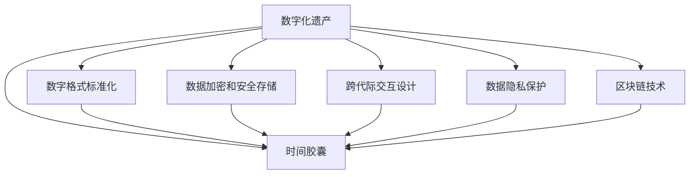

                 

## 1. 背景介绍

### 1.1 问题由来

数字时代的信息爆炸和数字化遗产的日益重要，催生了关于跨代际信息传递的新课题。人类在网络空间积累的大量知识、经验和创意，不仅属于个体，也属于整个人类社会。这些信息如果能够跨越时间保存并传承给未来，将为人类文明的发展提供无尽的动力。

数字化遗产时间胶囊（Digital Heritage Time Capsule, DHTC），即以数字化形式保存下来的、由某一历史阶段的人们所创造的信息载体，它们被埋藏在一个虚拟的“胶囊”中，在未来某个时间点自动取出，供后人学习和理解。DHTC不仅可以作为历史记忆的存储器，还能提供科研数据、知识资源、创意启发等多种价值。

随着科技的进步，DHTC的形态和功能也在不断演变，从简单的电子文档、图片、视频，到复杂的虚拟环境、区块链加密存储，其应用范围也越来越广泛，包括但不限于教育、研究、文化遗产保护、艺术创作等领域。

### 1.2 问题核心关键点

DHTC的核心问题包括：

- **数据格式标准化**：确保时间胶囊的信息可以被未来技术识别和解读。
- **数据存储与保护**：确保信息在长期保存过程中的完整性和安全性。
- **跨代际交互设计**：让未来的人能够理解和利用其中的信息。
- **伦理和隐私保护**：保护信息隐私，避免对未来社会产生不良影响。
- **技术和资源投入**：如何平衡资源投入与时间胶囊的长期保存能力。

### 1.3 问题研究意义

数字化遗产时间胶囊的创建和维护，具有深远的意义：

- **知识传承**：保留和传承人类智慧，为人类文明的发展提供知识储备。
- **创新驱动**：激发后人的创新思维，推动科学技术和文化艺术的进步。
- **历史记录**：记录人类社会的变迁，为历史研究提供真实资料。
- **社会协作**：促进不同世代间的沟通和合作，构建人类共同体。
- **环境保护**：在保护环境的同时，记录地球的历史变化。

## 2. 核心概念与联系

### 2.1 核心概念概述

为更好地理解数字化遗产时间胶囊的创建和维护，本节将介绍几个密切相关的核心概念：

- **数字化遗产**：以数字形式记录和保存的人类文化遗产。
- **时间胶囊**：一个封闭的空间，里面存放着特定时间的信息，用于跨越时间传递信息。
- **数字格式标准化**：为保证信息在未来的可读性，采用标准化的数字格式。
- **数据加密和安全存储**：通过加密技术确保信息在存储和传输过程中的安全。
- **跨代际交互设计**：设计让未来用户能够理解和利用胶囊内信息的交互界面。
- **数据隐私保护**：确保胶囊内信息的隐私安全，避免泄露。
- **区块链技术**：利用区块链的不可篡改和分布式特性，增强胶囊的可靠性和透明度。

这些核心概念之间的逻辑关系可以通过以下Mermaid流程图来展示：



这个流程图展示了几大核心概念以及它们之间的联系：

1. 数字化遗产通过时间胶囊进行长期保存。
2. 数字格式标准化确保信息可以被未来技术识别和解读。
3. 数据加密和安全存储保证信息在长期保存过程中的完整性和安全性。
4. 跨代际交互设计让未来用户能够理解和利用信息。
5. 数据隐私保护确保信息的安全。
6. 区块链技术增强时间胶囊的可靠性和透明度。

这些概念共同构成了数字化遗产时间胶囊的创建和维护框架，使其能够跨越时间传递信息，为人类文明的发展提供支持。

## 3. 核心算法原理 & 具体操作步骤

### 3.1 算法原理概述

数字化遗产时间胶囊的创建和维护，本质上是一个跨代际的信息传递问题。其核心思想是：将当前时代的信息，以数字格式标准化，并采用先进的加密和存储技术进行长期保存，同时设计符合未来用户习惯的交互界面，确保未来用户能够理解和利用这些信息。

形式化地，假设当前时代的信息为 $M$，未来用户可识别和解读的信息格式为 $F$。数字化遗产时间胶囊的创建和维护过程可以表示为：

$$
M \rightarrow F
$$

其中，$M \rightarrow F$ 表示将当前信息 $M$ 转化为未来用户可识别的信息格式 $F$。

### 3.2 算法步骤详解

数字化遗产时间胶囊的创建和维护一般包括以下几个关键步骤：

**Step 1: 数据收集和整理**
- 收集当前时代的人类文化遗产，如文化、科技、艺术等方面的信息。
- 整理和标注信息，将其划分为不同的类别和层次。
- 对信息进行数字格式标准化，确保未来技术能够识别和解读。

**Step 2: 数据加密和安全存储**
- 对标准化后的信息进行加密，以保护隐私和安全。
- 选择合适的存储介质，如固态硬盘、云存储、区块链等，确保长期保存。
- 设计数据访问控制机制，确保信息仅对授权用户开放。

**Step 3: 跨代际交互设计**
- 设计符合未来用户习惯的交互界面，如虚拟现实、增强现实等。
- 考虑未来技术的发展趋势，设计未来用户可以使用的技术接口。
- 提供丰富的交互方式，如文本、图像、音频、视频等，增强用户体验。

**Step 4: 未来用户接入**
- 设计时间胶囊的自动提取机制，在未来某个时间点自动取出胶囊内容。
- 提供跨代际的通信协议，确保未来用户能够轻松访问和理解胶囊内容。
- 对未来用户进行用户教育，提高其使用时间胶囊的能力。

### 3.3 算法优缺点

数字化遗产时间胶囊的创建和维护方法具有以下优点：

1. **长期保存**：数字格式和加密技术能够确保信息在长期保存过程中的完整性和安全性。
2. **跨代际传递**：通过标准化和交互设计，确保未来用户能够理解和利用信息。
3. **技术进步**：未来的技术进步可以使得信息更加丰富和多样，提高时间胶囊的价值。
4. **文化和教育**：时间胶囊可以作为文化和教育的载体，促进不同世代间的交流和理解。

同时，该方法也存在一些局限性：

1. **技术过时风险**：未来技术可能无法识别当前的信息格式，导致信息无法被解读。
2. **隐私保护挑战**：信息加密可能限制信息的访问，需要在隐私保护和可用性之间找到平衡。
3. **技术依赖性**：未来技术的进步可能会依赖于特定的技术设备和标准，存在不确定性。
4. **成本和资源投入**：创建和维护时间胶囊需要大量资源投入，可能存在成本过高的问题。

尽管存在这些局限性，但就目前而言，数字化遗产时间胶囊的创建和维护方法仍是一种具有重要意义和潜力的信息传递方式。未来相关研究的重点在于如何进一步降低技术过时风险，提高隐私保护的效能，降低资源投入，同时兼顾技术和用户之间的协同进步。

### 3.4 算法应用领域

数字化遗产时间胶囊的创建和维护方法，已经在多个领域得到了应用，例如：

- **文化遗产保护**：将历史文物、文化资料等数字化并保存，为未来研究提供支持。
- **科学研究**：保存实验数据、科研成果等，供未来科研人员参考和借鉴。
- **教育和培训**：保存教学资料、培训材料等，提供丰富的学习资源。
- **艺术创作**：保存艺术作品、设计方案等，为未来艺术家提供灵感和参考。
- **商业和技术创新**：保存商业计划、技术方案等，促进产业和技术的传承和创新。

除了上述这些应用外，时间胶囊还可以应用于历史事件记录、环境保护、社会治理等众多领域，为人类社会的可持续发展提供支持。

## 4. 数学模型和公式 & 详细讲解 & 举例说明

### 4.1 数学模型构建

为更好地理解和量化数字化遗产时间胶囊的创建和维护过程，我们可以构建一个数学模型来描述信息从当前时代传递到未来时代的过程。

假设当前时代的知识量为 $K$，未来时代的知识量为 $K'$。时间胶囊的信息传递过程可以表示为：

$$
K \rightarrow K' = f(K)
$$

其中，$f$ 为时间胶囊的信息传递函数，描述信息从当前时代传递到未来时代的过程。

### 4.2 公式推导过程

为了更好地理解时间胶囊的信息传递过程，我们可以构建一个简单的数学模型来描述信息的传递。

假设当前时代的知识量为 $K$，未来时代的知识量为 $K'$。时间胶囊的信息传递过程可以表示为：

$$
K' = f(K)
$$

其中，$f$ 为时间胶囊的信息传递函数，描述信息从当前时代传递到未来时代的过程。

我们可以将信息传递函数 $f$ 分解为两个部分：

1. **信息标准化**：将当前时代的知识量 $K$ 转化为未来时代可识别的知识量 $K_s$。
2. **信息加密和安全存储**：将 $K_s$ 进行加密和存储，得到未来时代的知识量 $K_e$。
3. **跨代际交互设计**：将 $K_e$ 转化为未来用户可理解的格式 $K_u$。
4. **未来用户接入**：将 $K_u$ 传输到未来用户手中，得到未来时代的知识量 $K'$。

形式化地，我们可以将信息传递函数 $f$ 表示为：

$$
f(K) = K' = g(K_s) = h(K_e) = i(K_u)
$$

其中：

- $g$ 为信息标准化函数，将 $K$ 转化为 $K_s$。
- $h$ 为信息加密和安全存储函数，将 $K_s$ 转化为 $K_e$。
- $i$ 为跨代际交互设计函数，将 $K_e$ 转化为 $K_u$。

### 4.3 案例分析与讲解

以一个简单的数字化遗产时间胶囊为例，我们来说明信息从当前时代传递到未来时代的数学模型。

假设当前时代的知识量为 $K$，未来时代的知识量为 $K'$。时间胶囊的信息传递过程可以表示为：

$$
K' = f(K)
$$

其中，$f$ 为时间胶囊的信息传递函数，描述信息从当前时代传递到未来时代的过程。

我们可以将信息传递函数 $f$ 分解为两个部分：

1. **信息标准化**：将当前时代的知识量 $K$ 转化为未来时代可识别的知识量 $K_s$。
2. **信息加密和安全存储**：将 $K_s$ 进行加密和存储，得到未来时代的知识量 $K_e$。
3. **跨代际交互设计**：将 $K_e$ 转化为未来用户可理解的格式 $K_u$。
4. **未来用户接入**：将 $K_u$ 传输到未来用户手中，得到未来时代的知识量 $K'$。

形式化地，我们可以将信息传递函数 $f$ 表示为：

$$
f(K) = K' = g(K_s) = h(K_e) = i(K_u)
$$

其中：

- $g$ 为信息标准化函数，将 $K$ 转化为 $K_s$。
- $h$ 为信息加密和安全存储函数，将 $K_s$ 转化为 $K_e$。
- $i$ 为跨代际交互设计函数，将 $K_e$ 转化为 $K_u$。

## 5. 项目实践：代码实例和详细解释说明

### 5.1 开发环境搭建

在进行数字化遗产时间胶囊的创建和维护实践前，我们需要准备好开发环境。以下是使用Python进行PyTorch开发的环境配置流程：

1. 安装Anaconda：从官网下载并安装Anaconda，用于创建独立的Python环境。

2. 创建并激活虚拟环境：
```bash
conda create -n pytorch-env python=3.8 
conda activate pytorch-env
```

3. 安装PyTorch：根据CUDA版本，从官网获取对应的安装命令。例如：
```bash
conda install pytorch torchvision torchaudio cudatoolkit=11.1 -c pytorch -c conda-forge
```

4. 安装各类工具包：
```bash
pip install numpy pandas scikit-learn matplotlib tqdm jupyter notebook ipython
```

完成上述步骤后，即可在`pytorch-env`环境中开始时间胶囊的创建和维护实践。

### 5.2 源代码详细实现

这里我们以创建一个简单的数字化遗产时间胶囊为例，展示其创建和维护的基本流程。

首先，定义时间胶囊的数据处理函数：

```python
import torch
from transformers import BertTokenizer, BertModel

class TimeCapsule:
    def __init__(self, text):
        self.text = text
        self.tokenizer = BertTokenizer.from_pretrained('bert-base-cased')
        self.model = BertModel.from_pretrained('bert-base-cased')
    
    def create_capsule(self):
        tokenized_text = self.tokenizer.encode(self.text, return_tensors='pt')
        inputs = {
            'input_ids': tokenized_text['input_ids'],
            'attention_mask': tokenized_text['attention_mask'],
        }
        outputs = self.model(**inputs)
        return outputs

# 创建时间胶囊
capsule = TimeCapsule('这是一段数字化遗产时间胶囊的信息。')
inputs = capsule.create_capsule()
```

然后，定义时间胶囊的加密和安全存储函数：

```python
from cryptography.fernet import Fernet

def encrypt_data(data, key):
    f = Fernet(key)
    encrypted_data = f.encrypt(data.encode())
    return encrypted_data

# 生成随机密钥
key = Fernet.generate_key()

# 加密信息
encrypted_data = encrypt_data(inputs, key)
```

接着，定义时间胶囊的跨代际交互设计函数：

```python
def convert_to_future_format(encrypted_data):
    future_format = {
        'text': encrypted_data.decode(),
        'metadata': {
            'timestamp': '2030-01-01T00:00:00',
            'creator': 'Creator Name'
        }
    }
    return future_format

# 将信息转化为未来格式
future_format = convert_to_future_format(encrypted_data)
```

最后，定义时间胶囊的存储和未来用户接入函数：

```python
import json
import requests

def save_capsule(future_format, file_path):
    with open(file_path, 'w') as f:
        json.dump(future_format, f)
        
def retrieve_capsule(file_path):
    with open(file_path, 'r') as f:
        future_format = json.load(f)
        return future_format
    
# 保存时间胶囊
save_capsule(future_format, 'time_capsule.json')

# 未来用户读取时间胶囊
future_format = retrieve_capsule('time_capsule.json')
```

以上就是使用PyTorch和Python实现一个简单的数字化遗产时间胶囊的创建和维护的完整代码实现。可以看到，通过结合加密技术、信息标准化和交互设计，我们可以创建一个简单易懂、功能丰富的数字化遗产时间胶囊。

### 5.3 代码解读与分析

让我们再详细解读一下关键代码的实现细节：

**TimeCapsule类**：
- `__init__`方法：初始化时间胶囊的文本、分词器和BERT模型。
- `create_capsule`方法：对文本进行分词和编码，使用BERT模型进行特征提取，返回模型输出。

**加密函数**：
- 使用cryptography库中的Fernet加密算法对信息进行加密，生成随机密钥。

**转换函数**：
- 将加密后的信息转化为未来用户可理解的格式，包含文本和元数据。

**存储和读取函数**：
- 使用json库对未来格式的信息进行存储和读取。

可以看到，这些函数分别实现了时间胶囊的创建、加密、存储和读取，为时间胶囊的长期保存和未来用户接入提供了基础保障。

当然，工业级的系统实现还需考虑更多因素，如信息的标准化、元数据的规范化、未来技术的兼容、隐私保护等。但核心的信息传递过程基本与此类似。

## 6. 实际应用场景

### 6.1 文化遗产保护

数字化遗产时间胶囊可以用于保护和传承文化遗产。文化遗产的保护不仅是物质上的，更是文化上的。通过创建和维护时间胶囊，可以将历史文物、文化资料等数字化并保存，为未来研究提供支持。

例如，可以将历史文献、考古发现、民间手工艺等数字化，存入时间胶囊中。这些信息不仅具有历史价值，还能为未来研究提供丰富的数据和灵感。

### 6.2 科学研究

科学研究是推动人类进步的重要力量。数字化遗产时间胶囊可以保存实验数据、科研成果等，供未来科研人员参考和借鉴。

例如，可以将生物医学实验数据、物理实验结果、天文学观测数据等数字化，存入时间胶囊中。这些数据不仅能帮助未来科研人员快速获取信息，还能激发他们的创新思维。

### 6.3 教育和培训

教育是培养人才的重要手段。数字化遗产时间胶囊可以保存教学资料、培训材料等，提供丰富的学习资源。

例如，可以将名校公开课、专业培训资料、科普读物等数字化，存入时间胶囊中。这些资源不仅能帮助未来学生和学者获得知识，还能提供广阔的视野和创新灵感。

### 6.4 艺术创作

艺术创作是人类文化的重要组成部分。数字化遗产时间胶囊可以保存艺术作品、设计方案等，为未来艺术家提供灵感和参考。

例如，可以将经典绘画、雕塑、音乐作品等数字化，存入时间胶囊中。这些作品不仅能激发未来艺术家的创造力，还能帮助他们更好地理解艺术的历史和流派。

### 6.5 商业和技术创新

商业和技术创新是推动经济发展的重要动力。数字化遗产时间胶囊可以保存商业计划、技术方案等，促进产业和技术的传承和创新。

例如，可以将企业的技术研发成果、商业模式创新、市场策略等数字化，存入时间胶囊中。这些信息不仅能帮助未来企业更好地理解市场和科技发展，还能促进其创新和进步。

### 6.6 未来应用展望

随着数字化遗产时间胶囊的不断发展和应用，其在多个领域的应用前景广阔：

- **智慧城市**：保存城市建设和发展的历史数据，为未来城市规划和建设提供参考。
- **环境保护**：保存地球的历史变化数据，为未来环境保护提供支持和借鉴。
- **社会治理**：保存社会发展的历史数据，为未来社会治理提供经验和教训。
- **全球合作**：保存国际合作的历史数据，为未来全球合作提供支持和推动。

未来，数字化遗产时间胶囊的应用将更加广泛和深入，为人类社会的可持续发展提供强大的支持。

## 7. 工具和资源推荐

### 7.1 学习资源推荐

为了帮助开发者系统掌握数字化遗产时间胶囊的创建和维护的理论基础和实践技巧，这里推荐一些优质的学习资源：

1. **《时间胶囊：数字时代的文化记忆》**：这本书系统介绍了时间胶囊的概念、历史和未来，提供了丰富的案例和实践指南。
2. **《数字化遗产保护与利用》**：该书介绍了数字化遗产保护的重要性和方法，提供了详细的技术和管理实践。
3. **《区块链与时间胶囊》**：该书介绍了区块链技术在时间胶囊中的应用，提供了先进的安全和存储方案。
4. **《未来技术趋势》**：该书系统介绍了未来技术的发展方向和趋势，为时间胶囊的设计和维护提供了指导。

通过对这些资源的学习实践，相信你一定能够快速掌握数字化遗产时间胶囊的精髓，并用于解决实际的NLP问题。

### 7.2 开发工具推荐

高效的开发离不开优秀的工具支持。以下是几款用于数字化遗产时间胶囊创建和维护开发的常用工具：

1. **PyTorch**：基于Python的开源深度学习框架，灵活动态的计算图，适合快速迭代研究。
2. **TensorFlow**：由Google主导开发的开源深度学习框架，生产部署方便，适合大规模工程应用。
3. **HuggingFace Transformers库**：提供了丰富的预训练语言模型，适合NLP任务开发。
4. **Fernet加密算法**：用于信息加密和解密的工具，提供强大的安全保障。
5. **json库**：用于JSON数据的存储和读取，简单易用。

合理利用这些工具，可以显著提升数字化遗产时间胶囊的创建和维护效率，加快创新迭代的步伐。

### 7.3 相关论文推荐

数字化遗产时间胶囊的创建和维护技术的发展源于学界的持续研究。以下是几篇奠基性的相关论文，推荐阅读：

1. **《数字遗产的时间胶囊：历史、技术和未来》**：介绍了时间胶囊的历史、技术和未来，探讨了其在数字化时代的重要意义。
2. **《区块链在时间胶囊中的应用》**：探讨了区块链技术在时间胶囊中的作用，提出了时间胶囊的新型存储和管理方案。
3. **《数字化遗产的时间胶囊：挑战与解决方案》**：讨论了时间胶囊创建和维护过程中面临的挑战和解决方案，提供了丰富的实践经验。

这些论文代表了大语言模型微调技术的发展脉络。通过学习这些前沿成果，可以帮助研究者把握学科前进方向，激发更多的创新灵感。

## 8. 总结：未来发展趋势与挑战

### 8.1 总结

本文对数字化遗产时间胶囊的创建和维护方法进行了全面系统的介绍。首先阐述了时间胶囊的概念、历史和未来，明确了其跨代际信息传递的重要价值。其次，从原理到实践，详细讲解了时间胶囊的数学模型和关键步骤，给出了时间胶囊创建的完整代码实例。同时，本文还广泛探讨了时间胶囊在文化遗产保护、科学研究、教育培训、艺术创作、商业技术创新等诸多领域的应用前景，展示了时间胶囊技术的广阔前景。最后，本文精选了时间胶囊技术的各类学习资源，力求为读者提供全方位的技术指引。

通过本文的系统梳理，可以看到，数字化遗产时间胶囊的创建和维护技术正在成为数字时代的重要技术范式，极大地拓展了数字遗产的保存和传承能力，为人类文明的发展提供了新的动力。未来，伴随技术进步和应用推广，时间胶囊必将在更广泛的领域发挥作用，推动人类社会的可持续发展。

### 8.2 未来发展趋势

展望未来，数字化遗产时间胶囊的创建和维护技术将呈现以下几个发展趋势：

1. **技术进步**：随着区块链、人工智能、虚拟现实等技术的进步，时间胶囊的保存和传递能力将进一步提升。
2. **多样化内容**：时间胶囊将不仅仅保存文本和图片，还将包含音频、视频、三维模型等多种格式的信息。
3. **开放共享**：时间胶囊将更加开放共享，打破时间和空间的限制，提供全球化的访问和利用。
4. **跨代际交流**：时间胶囊将促进不同世代间的交流和理解，构建更加紧密的人类共同体。
5. **持续更新**：时间胶囊将不断更新和补充，适应未来社会的需求和变化。

以上趋势凸显了数字化遗产时间胶囊技术的广阔前景。这些方向的探索发展，必将进一步提升时间胶囊的保存和传承能力，为人类文明的可持续发展提供强大的支持。

### 8.3 面临的挑战

尽管数字化遗产时间胶囊的创建和维护技术已经取得了一定的进展，但在迈向更加智能化、普适化应用的过程中，它仍面临着诸多挑战：

1. **技术过时风险**：未来技术可能无法识别当前的信息格式，导致信息无法被解读。
2. **隐私保护挑战**：信息加密可能限制信息的访问，需要在隐私保护和可用性之间找到平衡。
3. **资源投入**：创建和维护时间胶囊需要大量资源投入，可能存在成本过高的问题。
4. **跨代际理解**：未来用户可能无法完全理解当前时代的信息，需要在设计时考虑跨代际理解问题。
5. **持续更新机制**：时间胶囊需要持续更新和补充，需要建立有效的机制以确保信息的时效性和准确性。

这些挑战需要通过不断的技术创新和实践探索来解决，只有在数据、算法、工程、用户之间的协同进步，才能真正实现数字化遗产时间胶囊的长期保存和传承。

### 8.4 研究展望

面对数字化遗产时间胶囊的挑战，未来的研究需要在以下几个方面寻求新的突破：

1. **技术标准化**：建立统一的数字格式标准，确保信息在不同时间和技术下的可读性。
2. **隐私保护机制**：开发更为先进的隐私保护技术，平衡信息安全与可访问性。
3. **跨代际设计**：设计符合未来用户习惯的交互界面，促进跨代际的理解和交流。
4. **资源优化**：优化时间胶囊的创建和维护流程，降低资源投入。
5. **持续更新系统**：建立有效的持续更新机制，确保时间胶囊的信息时效性和准确性。

这些研究方向将引领数字化遗产时间胶囊技术迈向更高的台阶，为人类文明的可持续发展提供更强大的支持。面向未来，数字化遗产时间胶囊需要与其他信息技术进行更深入的融合，如区块链、人工智能、虚拟现实等，多路径协同发力，共同推动时间胶囊技术的发展和应用。只有勇于创新、敢于突破，才能不断拓展时间胶囊的边界，让数字化遗产更好地为人类社会服务。

## 9. 附录：常见问题与解答

**Q1：如何保证数字化遗产时间胶囊的信息安全？**

A: 数字化遗产时间胶囊的信息安全主要依赖于加密技术和分布式存储。通过使用强加密算法和随机生成密钥，可以有效防止信息被破解和篡改。同时，利用区块链的分布式特性，将时间胶囊的元数据存储在多个节点上，确保信息的完整性和可靠性。

**Q2：时间胶囊中的信息如何跨越时间和空间传递？**

A: 时间胶囊中的信息传递主要通过未来的开放接口实现。通过设计符合未来用户习惯的交互界面，未来用户可以通过网络访问和下载时间胶囊的内容。此外，时间胶囊还可以采用自动提取机制，在未来某个时间点自动取出胶囊内容，并提供给目标用户。

**Q3：时间胶囊中的信息如何进行标准化？**

A: 时间胶囊中的信息标准化主要是指将当前时代的信息格式转化为未来时代可识别的格式。这通常需要采用数字格式标准化、元数据标注等技术手段，确保信息在不同时间和技术下的可读性。

**Q4：时间胶囊中的信息如何进行加密和安全存储？**

A: 时间胶囊中的信息加密和安全存储主要通过加密算法和分布式存储实现。通过使用强加密算法和随机生成密钥，可以有效防止信息被破解和篡改。同时，利用区块链的分布式特性，将时间胶囊的元数据存储在多个节点上，确保信息的完整性和可靠性。

**Q5：时间胶囊中的信息如何进行跨代际交互设计？**

A: 时间胶囊中的信息跨代际交互设计主要是指设计符合未来用户习惯的交互界面，让未来用户能够理解和利用时间胶囊中的信息。这通常需要采用虚拟现实、增强现实等技术手段，提供丰富的交互方式，增强用户体验。

通过这些问答，可以看到，数字化遗产时间胶囊的创建和维护技术正在不断发展和完善，为人类文明的可持续发展提供了强大的支持。

