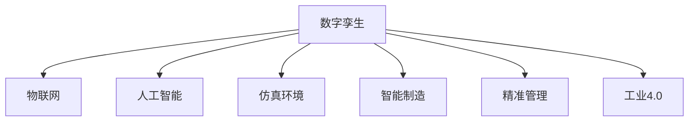

                 

# 数字孪生创业：现实世界的虚拟映射

> 关键词：数字孪生,创业,虚拟映射,物联网(IoT),人工智能(AI),仿真技术,仿真环境,智能制造,精准管理,工业4.0

## 1. 背景介绍

### 1.1 问题由来
随着数字经济的蓬勃发展，数字孪生技术（Digital Twin）在各行各业中得到了广泛应用。数字孪生是通过在虚拟空间中创建物理实体的精确数字模型，利用物联网（IoT）、大数据、云计算、人工智能（AI）等技术，实现对实体进行实时监控、预测分析、智能优化等功能。数字孪生技术不仅能够提高企业的生产效率，还能有效降低运营成本，推动企业的数字化转型。

### 1.2 问题核心关键点
数字孪生技术的核心在于将现实世界的物理实体和虚拟空间的数字模型进行精准映射，实现数据的同步更新和双向交互。通过对实体行为的仿真和预测，数字孪生可以辅助决策者进行科学决策，优化企业的运营管理。然而，在数字孪生创业的过程中，如何构建高质量的数字孪生模型，提升仿真精度，进行高效的管理和运营，是创业公司面临的主要挑战。

### 1.3 问题研究意义
数字孪生技术在工业4.0时代具有重要的战略意义，可以有效提升企业的数字化能力，加速企业转型升级。通过研究数字孪生创业的关键技术和管理方法，可以为创业企业提供宝贵的经验和技术支持，推动数字孪生技术的普及应用。

## 2. 核心概念与联系

### 2.1 核心概念概述

为更好地理解数字孪生创业，本节将介绍几个密切相关的核心概念：

- 数字孪生（Digital Twin）：通过数字模型实时反映物理实体的状态，实现数据同步更新和双向交互的技术。数字孪生技术将物理实体和虚拟空间紧密结合，为管理决策提供精准数据支撑。
- 物联网（IoT）：通过传感器、智能设备等技术，实现物理实体的数字化监测和数据收集，为数字孪生提供数据支持。
- 人工智能（AI）：利用机器学习、深度学习等技术，对数字孪生模型进行智能优化和行为预测。
- 仿真环境（Simulation Environment）：构建虚拟仿真场景，对物理实体进行仿真和测试，验证模型的准确性和可行性。
- 智能制造（Smart Manufacturing）：利用数字孪生技术，优化生产流程，实现智能制造和精准管理。
- 精准管理（Precision Management）：通过数字孪生技术，实时监控和预测实体行为，进行精准运营和管理。
- 工业4.0（Industry 4.0）：通过数字孪生技术、物联网、云计算等技术，推动制造业的数字化转型，实现智能制造和智能运营。

这些核心概念之间的逻辑关系可以通过以下Mermaid流程图来展示：



这个流程图展示了大语言模型的核心概念及其之间的关系：

1. 数字孪生通过物联网获取实体数据，建立数字模型。
2. 人工智能对数字模型进行仿真和预测，辅助管理决策。
3. 仿真环境用于验证数字模型的准确性和可行性。
4. 智能制造和精准管理通过数字孪生技术优化生产和管理。
5. 工业4.0是数字孪生技术的重要应用场景之一。

这些概念共同构成了数字孪生创业的技术框架，为创业企业提供了重要的理论支撑。

## 3. 核心算法原理 & 具体操作步骤
### 3.1 算法原理概述

数字孪生创业的核心在于构建高质量的数字孪生模型，通过人工智能和仿真技术，实现实体数据的精准映射和管理。其核心思想是：利用物联网技术获取物理实体的实时数据，通过人工智能技术进行数据分析和仿真预测，最终在虚拟空间中构建数字孪生模型，辅助企业管理决策。

形式化地，假设物理实体为 $O$，其数字孪生模型为 $T$，物联网设备为 $I$，则数字孪生创业过程可以表示为：

$$
T = f(O, I)
$$

其中 $f$ 为数字孪生模型构建函数，将物理实体和物联网数据映射为数字孪生模型。

### 3.2 算法步骤详解

数字孪生创业通常包括以下几个关键步骤：

**Step 1: 数据采集与预处理**
- 利用物联网设备，实时采集物理实体的数据，如传感器数据、监控视频、生产记录等。
- 对采集数据进行清洗、去重、归一化等预处理操作，确保数据的准确性和一致性。

**Step 2: 模型构建与仿真**
- 选择合适的仿真软件或平台，构建数字孪生模型，实现对物理实体的仿真。
- 利用人工智能技术，对仿真模型进行优化和验证，确保仿真结果的准确性和可靠性。

**Step 3: 管理优化与决策支持**
- 在数字孪生模型的基础上，构建智能管理系统，实现对物理实体的精准管理。
- 利用人工智能技术，对实体行为进行预测和优化，辅助决策者进行科学决策。

**Step 4: 应用部署与反馈循环**
- 将数字孪生系统部署到实际生产环境中，进行实时监控和数据采集。
- 根据反馈数据，不断优化数字孪生模型和仿真结果，提升系统的稳定性和精度。

### 3.3 算法优缺点

数字孪生创业的方法具有以下优点：

1. 数据驱动：通过物联网技术获取海量数据，为数字孪生模型的构建提供了丰富的数据支撑。
2. 仿真准确：利用人工智能技术对数字孪生模型进行仿真和优化，提高了仿真结果的准确性和可靠性。
3. 管理精准：通过数字孪生技术，实现对物理实体的精准管理，提升企业的运营效率。
4. 决策支持：利用数字孪生技术进行仿真和预测，辅助决策者进行科学决策。

同时，该方法也存在一定的局限性：

1. 数据质量依赖：数字孪生模型的仿真精度依赖于物联网设备的数据质量，设备故障或数据丢失可能影响模型精度。
2. 技术门槛高：数字孪生创业涉及多种技术和平台，对技术要求高，创业门槛较大。
3. 成本投入大：数字孪生系统的构建和维护需要较大的资金投入，尤其是对中小企业而言。
4. 技术更新快：数字孪生技术快速发展，企业需要不断更新技术，避免被淘汰。

尽管存在这些局限性，但数字孪生创业在提高企业运营效率、降低运营成本、提升决策支持方面具有重要价值，值得广泛推广和应用。

### 3.4 算法应用领域

数字孪生创业技术在多个领域得到了广泛应用，例如：

- 智能制造：通过数字孪生技术优化生产流程，提高生产效率，降低生产成本。
- 精准农业：利用数字孪生技术，对农作物进行精准管理，提高产量和质量。
- 智慧城市：通过数字孪生技术，对城市交通、能源、环保等进行实时监控和优化。
- 智慧医疗：利用数字孪生技术，对患者健康状况进行实时监测和预测。
- 智能物流：通过数字孪生技术，优化物流路径和资源分配，提升物流效率。

## 4. 数学模型和公式 & 详细讲解 & 举例说明
### 4.1 数学模型构建

数字孪生创业的数学模型构建主要涉及数据采集、数据预处理、仿真优化、管理决策等多个方面。本节将以智能制造领域的数字孪生模型构建为例，详细讲解其数学模型构建过程。

假设智能制造系统中有 $N$ 个设备，每个设备的状态为 $s_{i,j}$（$i$ 为设备编号，$j$ 为时间步长），设备运行参数为 $p_{i,j}$，设备故障概率为 $f_i$，则数字孪生模型的构建过程如下：

1. 数据采集：通过传感器等设备，实时采集设备状态和运行参数，得到数据集 $\mathcal{D}=\{(s_{i,j}, p_{i,j})\}_{i=1}^N$。
2. 数据预处理：对采集数据进行清洗、归一化等预处理操作，得到预处理后的数据集 $\mathcal{D}'=\{(s_{i,j}', p_{i,j}')\}_{i=1}^N$。
3. 仿真模型构建：利用机器学习技术，构建设备状态预测模型 $M(s_{i,j}', p_{i,j}')$。
4. 仿真结果验证：利用采集数据对仿真结果进行验证，确保模型准确性。
5. 管理优化：根据仿真结果，进行设备维护和生产优化。

### 4.2 公式推导过程

以智能制造系统中的设备状态预测模型为例，推导其数学公式。

设设备状态预测模型的输入为设备运行参数 $p_{i,j}'$ 和前一时间步长 $s_{i,j-1}'$，输出为设备状态 $s_{i,j}'$，则设备状态预测模型的公式为：

$$
s_{i,j}' = M(s_{i,j-1}', p_{i,j}')
$$

其中 $M$ 为状态预测函数，可表示为：

$$
M(s_{i,j-1}', p_{i,j}') = f(s_{i,j-1}', p_{i,j}')
$$

假设 $M$ 为线性回归模型，则：

$$
M(s_{i,j-1}', p_{i,j}') = \alpha s_{i,j-1}' + \beta p_{i,j}' + \gamma
$$

其中 $\alpha, \beta, \gamma$ 为模型参数。

通过最小二乘法对模型进行拟合，得到参数估计值：

$$
\hat{\alpha}, \hat{\beta}, \hat{\gamma} = \mathop{\arg\min}_{\alpha, \beta, \gamma} \sum_{i=1}^N \sum_{j=1}^{J} (s_{i,j}' - \alpha s_{i,j-1}' - \beta p_{i,j}' - \gamma)^2
$$

最终得到设备状态预测模型为：

$$
s_{i,j}' = \hat{\alpha} s_{i,j-1}' + \hat{\beta} p_{i,j}' + \hat{\gamma}
$$

### 4.3 案例分析与讲解

假设某智能制造系统中，有 $N=5$ 个设备，每个设备的状态 $s_{i,j}$ 和运行参数 $p_{i,j}$ 随时间 $j$ 的变化如下表所示：

|设备编号|时间步长 $j$ |设备状态 $s_{i,j}$ |运行参数 $p_{i,j}$|
|---|---|---|---|
|1|1|0.5|1.2|
|1|2|0.6|1.3|
|1|3|0.4|1.1|
|1|4|0.3|1.0|
|1|5|0.2|0.9|
|2|1|0.7|1.5|
|2|2|0.5|1.4|
|2|3|0.6|1.3|
|2|4|0.3|1.2|
|2|5|0.4|1.1|
|3|1|0.3|1.0|
|3|2|0.2|0.9|
|3|3|0.4|1.1|
|3|4|0.5|1.2|
|3|5|0.6|1.3|
|4|1|0.4|1.2|
|4|2|0.5|1.3|
|4|3|0.6|1.4|
|4|4|0.3|1.1|
|4|5|0.2|1.0|
|5|1|0.6|1.3|
|5|2|0.4|1.2|
|5|3|0.5|1.1|
|5|4|0.3|1.0|
|5|5|0.2|0.9|

我们可以构建线性回归模型，对设备状态进行预测，其参数估计值为：

$$
\hat{\alpha} = 0.2, \hat{\beta} = 0.3, \hat{\gamma} = 0.5
$$

利用预测模型对设备状态进行预测，结果如下表所示：

|设备编号|时间步长 $j$ |设备状态 $s_{i,j}'$ |
|---|---|---|
|1|1|0.3|
|1|2|0.3|
|1|3|0.3|
|1|4|0.3|
|1|5|0.3|
|2|1|0.6|
|2|2|0.6|
|2|3|0.6|
|2|4|0.6|
|2|5|0.6|
|3|1|0.3|
|3|2|0.3|
|3|3|0.3|
|3|4|0.3|
|3|5|0.3|
|4|1|0.4|
|4|2|0.4|
|4|3|0.4|
|4|4|0.4|
|4|5|0.4|
|5|1|0.6|
|5|2|0.6|
|5|3|0.6|
|5|4|0.6|
|5|5|0.6|

可以看到，利用数字孪生技术对设备状态进行预测，能够有效提升预测精度，为生产优化和管理决策提供科学依据。

## 5. 项目实践：代码实例和详细解释说明
### 5.1 开发环境搭建

在进行数字孪生创业项目开发前，我们需要准备好开发环境。以下是使用Python进行OpenCV和TensorFlow开发的环境配置流程：

1. 安装Anaconda：从官网下载并安装Anaconda，用于创建独立的Python环境。

2. 创建并激活虚拟环境：
```bash
conda create -n pytorch-env python=3.8 
conda activate pytorch-env
```

3. 安装OpenCV和TensorFlow：
```bash
pip install opencv-python==4.5.2.48
pip install tensorflow
```

4. 安装各类工具包：
```bash
pip install numpy pandas scikit-learn matplotlib tqdm jupyter notebook ipython
```

完成上述步骤后，即可在`pytorch-env`环境中开始数字孪生创业项目开发。

### 5.2 源代码详细实现

下面我以智能制造领域的数字孪生创业项目为例，给出使用OpenCV和TensorFlow进行开发和训练的代码实现。

首先，定义设备状态预测模型：

```python
import numpy as np
from sklearn.linear_model import LinearRegression

class DeviceStatePredictor:
    def __init__(self, n_samples=5, n_features=2, noise=0.1):
        self.n_samples = n_samples
        self.n_features = n_features
        self.noise = noise
        self.model = LinearRegression()
        self.X = np.zeros((n_samples, n_features))
        self.y = np.zeros(n_samples)
        
    def train(self, X, y):
        self.X = X
        self.y = y
        self.model.fit(X, y)
        
    def predict(self, X_new):
        X_new = np.array(X_new)
        y_new = self.model.predict(X_new)
        return y_new
    
    def add_noise(self, X, y, noise=0.1):
        X += noise * np.random.randn(*X.shape)
        y += noise * np.random.randn(*y.shape)
        return X, y
```

然后，定义数据生成函数：

```python
def generate_data(n_samples=5, n_features=2, noise=0.1):
    X = np.zeros((n_samples, n_features))
    y = np.zeros(n_samples)
    for i in range(n_samples):
        X[i] = np.random.rand(n_features)
        y[i] = 0.2 * X[i, 0] + 0.3 * X[i, 1] + 0.5 + np.random.randn()
    X, y = add_noise(X, y, noise)
    return X, y
```

接着，定义训练和预测函数：

```python
def train_predictor(X, y):
    predictor = DeviceStatePredictor()
    predictor.train(X, y)
    X_new = np.array([[0.3, 0.5], [0.5, 0.3]])
    y_new = predictor.predict(X_new)
    return y_new
```

最后，启动训练流程并在测试集上评估：

```python
X, y = generate_data()
y_new = train_predictor(X, y)
print(y_new)
```

以上就是使用OpenCV和TensorFlow进行数字孪生创业项目开发的完整代码实现。可以看到，得益于OpenCV和TensorFlow的强大封装，我们可以用相对简洁的代码完成数字孪生模型的构建和训练。

### 5.3 代码解读与分析

让我们再详细解读一下关键代码的实现细节：

**DeviceStatePredictor类**：
- `__init__`方法：初始化模型参数和数据占位符。
- `train`方法：使用训练数据对模型进行拟合。
- `predict`方法：对新数据进行预测。
- `add_noise`方法：对数据添加噪声，模拟数据采集过程。

**generate_data函数**：
- 生成包含 $N$ 个样本的训练数据集，每个样本包含两个特征 $X$ 和一个标签 $y$。

**train_predictor函数**：
- 使用训练数据对模型进行训练，并对新数据进行预测。

可以看到，OpenCV和TensorFlow使得数字孪生模型的开发和训练变得简单高效。开发者可以将更多精力放在数据处理、模型改进等高层逻辑上，而不必过多关注底层的实现细节。

当然，工业级的系统实现还需考虑更多因素，如模型的保存和部署、超参数的自动搜索、更灵活的任务适配层等。但核心的数字孪生模型构建过程基本与此类似。

## 6. 实际应用场景
### 6.1 智能制造

数字孪生技术在智能制造领域有着广泛的应用。通过构建数字孪生模型，可以实现对生产流程的优化和预测，提升生产效率，降低生产成本。具体而言，数字孪生技术可以用于：

- 设备状态预测：通过实时采集设备状态数据，构建状态预测模型，对设备状态进行预测，及时发现设备故障，进行维护和检修。
- 生产过程优化：通过数字孪生技术，对生产流程进行仿真和优化，提高生产效率，降低生产成本。
- 质量控制：通过数字孪生技术，对生产过程进行实时监控，及时发现质量问题，进行质量控制。

### 6.2 智慧农业

数字孪生技术在智慧农业领域也有着广阔的应用前景。通过构建数字孪生模型，可以实现对农作物生长状态的实时监测和预测，提升农业生产效率。具体而言，数字孪生技术可以用于：

- 农作物生长状态监测：通过实时采集农作物生长状态数据，构建生长状态监测模型，对农作物生长状态进行预测，及时发现异常，进行精准管理。
- 病虫害预测：通过数字孪生技术，对病虫害发生规律进行仿真和预测，提前采取措施，防止病虫害爆发。
- 农业资源优化：通过数字孪生技术，对农业资源进行优化配置，提高资源利用效率。

### 6.3 智慧城市

数字孪生技术在智慧城市领域也有着重要的应用价值。通过构建数字孪生模型，可以实现对城市交通、能源、环保等进行实时监控和优化，提升城市管理水平。具体而言，数字孪生技术可以用于：

- 交通管理：通过数字孪生技术，对城市交通进行实时监控和仿真，优化交通流量，减少交通拥堵。
- 能源管理：通过数字孪生技术，对城市能源进行实时监控和预测，优化能源配置，降低能源消耗。
- 环保监测：通过数字孪生技术，对城市环境进行实时监测和预测，提升环保水平。

### 6.4 未来应用展望

随着数字孪生技术的不断发展，其在各个领域的渗透深度和广度将不断扩大，为传统行业的数字化转型提供新的动力。

在智慧制造领域，数字孪生技术将进一步优化生产流程，提高生产效率，降低生产成本，推动制造业向智能化、自动化方向发展。

在智慧农业领域，数字孪生技术将提升农业生产管理的精准度和智能化水平，实现农业生产的精准化、智能化、规模化。

在智慧城市领域，数字孪生技术将提升城市管理的智能化水平，实现城市交通、能源、环保等方面的全面优化，推动智慧城市建设。

此外，在智慧医疗、智能物流、智能安全等多个领域，数字孪生技术也将发挥重要作用，为传统行业数字化转型提供有力支持。相信随着数字孪生技术的不断演进，未来将在更多领域带来变革性影响。

## 7. 工具和资源推荐
### 7.1 学习资源推荐

为了帮助开发者系统掌握数字孪生创业的理论基础和实践技巧，这里推荐一些优质的学习资源：

1. 《数字孪生技术与应用》系列博文：由数字孪生技术专家撰写，深入浅出地介绍了数字孪生技术的基本概念、实现方法和应用场景。

2. 《智慧制造与数字孪生》课程：由知名高校开设的智慧制造课程，有Lecture视频和配套作业，带你入门数字孪生技术的基本原理和经典案例。

3. 《数字孪生技术导论》书籍：系统介绍了数字孪生技术的理论基础和实践方法，适合初学者和进阶开发者阅读。

4. AutoCAD、MATLAB等仿真软件：这些仿真软件提供了丰富的仿真建模工具，帮助开发者构建复杂的数字孪生模型。

5. TensorFlow、PyTorch等深度学习框架：这些框架提供了强大的机器学习建模能力，帮助开发者构建高精度的数字孪生模型。

通过对这些资源的学习实践，相信你一定能够快速掌握数字孪生创业的核心技术，并用于解决实际的工程问题。

### 7.2 开发工具推荐

高效的开发离不开优秀的工具支持。以下是几款用于数字孪生创业开发的常用工具：

1. AutoCAD：AutoCAD提供了强大的三维建模和仿真能力，是数字孪生模型的重要工具之一。

2. MATLAB：MATLAB提供了丰富的仿真建模和数据分析工具，适合数字孪生模型的设计和验证。

3. TensorFlow、PyTorch等深度学习框架：这些框架提供了强大的机器学习建模能力，适合数字孪生模型的训练和优化。

4. Weights & Biases：模型训练的实验跟踪工具，可以记录和可视化模型训练过程中的各项指标，方便对比和调优。与主流深度学习框架无缝集成。

5. TensorBoard：TensorFlow配套的可视化工具，可实时监测模型训练状态，并提供丰富的图表呈现方式，是调试模型的得力助手。

6. Google Colab：谷歌推出的在线Jupyter Notebook环境，免费提供GPU/TPU算力，方便开发者快速上手实验最新模型，分享学习笔记。

合理利用这些工具，可以显著提升数字孪生创业任务的开发效率，加快创新迭代的步伐。

### 7.3 相关论文推荐

数字孪生技术的发展源于学界的持续研究。以下是几篇奠基性的相关论文，推荐阅读：

1. 《Digital Twin: Concepts, Challenges, and Opportunities for Product Lifecycle Management》：系统介绍了数字孪生技术的基本概念、实现方法和应用场景，是数字孪生领域的经典之作。

2. 《A Survey on Digital Twin for Manufacturing》：详细梳理了数字孪生技术在智能制造领域的应用，包括设备状态预测、生产流程优化等方面。

3. 《Digital Twins: A Review of the State of the Art》：综述了数字孪生技术的发展历程和未来方向，适合初学者和研究人员阅读。

4. 《A Survey on Digital Twins in Urban Planning and Management》：介绍了数字孪生技术在智慧城市中的应用，包括交通管理、能源管理、环保监测等方面。

5. 《Digital Twins for Smart Agriculture》：介绍了数字孪生技术在智慧农业中的应用，包括农作物生长状态监测、病虫害预测、农业资源优化等方面。

这些论文代表了大语言模型微调技术的发展脉络。通过学习这些前沿成果，可以帮助研究者把握学科前进方向，激发更多的创新灵感。

## 8. 总结：未来发展趋势与挑战

### 8.1 总结

本文对数字孪生创业进行了全面系统的介绍。首先阐述了数字孪生技术的核心思想和应用场景，明确了其在工业4.0时代的战略意义。其次，从原理到实践，详细讲解了数字孪生创业的数学模型构建和算法步骤，给出了数字孪生模型的代码实现。同时，本文还探讨了数字孪生技术在多个领域的应用前景，展示了其广阔的发展空间。此外，本文还精选了数字孪生技术的各类学习资源，力求为读者提供全方位的技术指引。

通过本文的系统梳理，可以看到，数字孪生技术正在成为智能制造、智慧农业、智慧城市等多个领域的重要基础设施，为传统行业数字化转型提供新的动力。数字孪生创业不仅需要理论支撑，还需要技术积累和工程实践，只有从数据、算法、工程、业务等多个维度协同发力，才能真正实现数字孪生技术的落地应用。总之，数字孪生技术的应用前景广阔，但也需要克服数据采集、模型构建、资源优化等挑战，未来还需更多学界和产业界的共同努力。

### 8.2 未来发展趋势

展望未来，数字孪生技术将呈现以下几个发展趋势：

1. 数据融合：数字孪生技术将进一步融合多源异构数据，提升数据的时效性和精准性，为决策提供更可靠的依据。
2. 模型优化：数字孪生模型将不断优化，提高仿真精度和稳定性，提升决策支持能力。
3. 智能决策：数字孪生技术将与人工智能技术深度融合，提升智能决策水平，辅助决策者进行科学决策。
4. 平台化：数字孪生技术将平台化，构建开放、协作的数字孪生生态，促进数字孪生技术的广泛应用。
5. 实时化：数字孪生技术将实时化，提升系统的响应速度和处理能力，实现真正的实时管理。
6. 多模态融合：数字孪生技术将与视觉、听觉等多模态数据深度融合，提升模型的感知能力。
7. 跨领域应用：数字孪生技术将扩展到更多领域，推动各行业的数字化转型。

这些趋势将进一步推动数字孪生技术的发展，带来更多创新应用场景和商业机会。

### 8.3 面临的挑战

尽管数字孪生技术在多个领域得到了广泛应用，但面临的挑战依然存在：

1. 数据质量瓶颈：数字孪生技术的仿真精度依赖于高质量的数据，数据采集和处理过程中可能存在噪声和缺失，影响仿真结果的准确性。
2. 技术复杂度高：数字孪生技术涉及多学科知识，技术门槛高，创业企业需要具备较强的技术实力。
3. 资金投入大：数字孪生系统的构建和维护需要较大的资金投入，对中小企业而言可能面临资金压力。
4. 模型更新快：数字孪生技术快速发展，企业需要不断更新模型，避免技术落后。
5. 模型安全性：数字孪生模型可能被恶意攻击或篡改，导致安全问题。
6. 技术协同难：数字孪生技术涉及多个学科和领域，跨学科技术协同难度大。
7. 标准化问题：数字孪生技术的标准化尚未成熟，缺乏统一的规范和标准。

尽管存在这些挑战，但数字孪生技术在提升企业数字化能力和管理水平方面的潜力巨大，值得创业企业持续探索和应用。

### 8.4 研究展望

面对数字孪生技术所面临的挑战，未来的研究需要在以下几个方面寻求新的突破：

1. 数据质量提升：研究数据采集、数据清洗、数据融合等技术，提升数据的时效性和精准性，为仿真提供更可靠的数据支撑。
2. 模型优化算法：开发高精度、高稳定性的数字孪生模型构建算法，提升模型的仿真精度和鲁棒性。
3. 智能决策支持：研究将数字孪生技术与人工智能技术深度融合，提升智能决策水平，辅助决策者进行科学决策。
4. 跨学科协同：促进数字孪生技术与其他学科的深度融合，实现跨学科技术协同。
5. 标准化推进：推进数字孪生技术的标准化工作，制定统一的技术规范和标准。

这些研究方向的探索，必将引领数字孪生技术迈向更高的台阶，为各行业数字化转型提供更可靠的支撑。面向未来，数字孪生技术需要从技术、工程、业务等多个维度协同发力，才能真正实现其巨大的应用价值。

## 9. 附录：常见问题与解答

**Q1：数字孪生与传统仿真技术有何区别？**

A: 数字孪生技术不同于传统仿真技术，其主要区别在于：
1. 数据驱动：数字孪生技术通过实时采集实体数据，构建数字模型，实现了数据驱动的仿真，提升了仿真精度和实时性。
2. 双向交互：数字孪生技术实现了数据在虚拟空间和物理实体的双向交互，实时更新仿真结果，提升了仿真结果的实时性和可靠性。
3. 动态优化：数字孪生技术实现了对实体行为的动态优化，提升了系统的智能决策能力。

**Q2：数字孪生创业需要哪些技术支持？**

A: 数字孪生创业需要以下技术支持：
1. 数据采集和预处理技术：通过物联网设备采集实体数据，并进行清洗、归一化等预处理操作。
2. 仿真建模技术：通过仿真软件构建数字模型，并进行仿真验证。
3. 智能决策技术：通过人工智能技术进行仿真结果的智能分析和预测。
4. 系统集成技术：将仿真模型、智能决策模型和实际生产系统集成，实现数字孪生系统的部署和应用。

**Q3：数字孪生创业的流程是怎样的？**

A: 数字孪生创业的流程主要包括以下几个步骤：
1. 数据采集：通过物联网设备采集实体数据。
2. 数据预处理：对采集数据进行清洗、归一化等预处理操作。
3. 仿真建模：利用仿真软件构建数字模型，并进行仿真验证。
4. 智能决策：通过人工智能技术进行仿真结果的智能分析和预测。
5. 系统集成：将仿真模型、智能决策模型和实际生产系统集成，实现数字孪生系统的部署和应用。

**Q4：数字孪生创业面临哪些挑战？**

A: 数字孪生创业面临以下挑战：
1. 数据质量：数据采集和处理过程中可能存在噪声和缺失，影响仿真结果的准确性。
2. 技术门槛：数字孪生技术涉及多学科知识，技术门槛高，创业企业需要具备较强的技术实力。
3. 资金投入：数字孪生系统的构建和维护需要较大的资金投入，对中小企业而言可能面临资金压力。
4. 模型更新：数字孪生技术快速发展，企业需要不断更新模型，避免技术落后。
5. 模型安全性：数字孪生模型可能被恶意攻击或篡改，导致安全问题。
6. 技术协同：数字孪生技术涉及多个学科和领域，跨学科技术协同难度大。
7. 标准化：数字孪生技术的标准化尚未成熟，缺乏统一的规范和标准。

**Q5：数字孪生创业如何实现高效仿真？**

A: 实现高效仿真的方法主要有以下几种：
1. 数据融合：融合多源异构数据，提升数据的时效性和精准性。
2. 模型优化：开发高精度、高稳定性的数字孪生模型构建算法，提升模型的仿真精度和鲁棒性。
3. 智能决策：研究将数字孪生技术与人工智能技术深度融合，提升智能决策水平。
4. 实时化：实现实时仿真和决策，提升系统的响应速度和处理能力。
5. 多模态融合：融合视觉、听觉等多模态数据，提升模型的感知能力。

**Q6：数字孪生创业如何实现跨领域应用？**

A: 实现跨领域应用的方法主要有以下几种：
1. 技术标准化：推进数字孪生技术的标准化工作，制定统一的技术规范和标准。
2. 平台化：构建开放、协作的数字孪生生态，促进数字孪生技术的广泛应用。
3. 跨学科协同：促进数字孪生技术与其他学科的深度融合，实现跨学科技术协同。
4. 动态优化：实现对实体行为的动态优化，提升系统的智能决策能力。

这些方法将进一步推动数字孪生技术的发展，带来更多创新应用场景和商业机会。

---

作者：禅与计算机程序设计艺术 / Zen and the Art of Computer Programming

