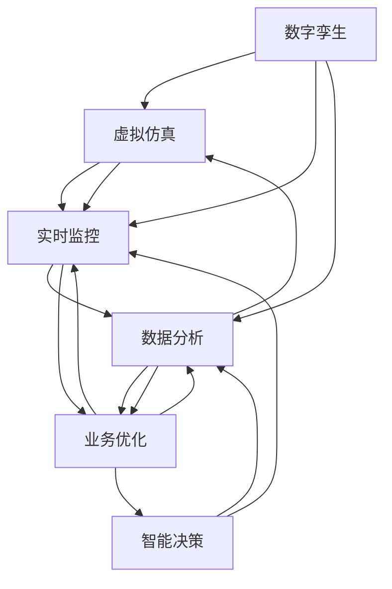

                 

# 数字孪生创业：虚实结合的业务优化

> 关键词：数字孪生，虚拟仿真，业务优化，创业，智能决策

## 1. 背景介绍

### 1.1 问题由来
随着信息技术的飞速发展，数字化转型已经成为企业升级的必然趋势。在传统制造、零售、医疗等行业中，传统的生产方式和商业模式面临着严峻挑战。与此同时，数字孪生技术（Digital Twin）以其虚实结合的特性，正在成为数字化转型的重要工具。通过构建虚拟与现实之间的桥梁，数字孪生能够实现对实际业务流程的实时监控、优化和预测，从而大幅提升企业的运营效率和决策水平。

### 1.2 问题核心关键点
数字孪生技术是一种通过虚拟仿真技术，将现实世界中的物理模型、行为数据和规则映射到计算机中的模型，形成虚拟系统的技术。其核心在于通过虚拟仿真技术，实现对现实业务的优化和预测，为企业决策提供数据支持。在企业应用中，数字孪生技术主要体现在以下几个方面：

1. **虚拟仿真**：构建虚拟模型，模拟现实世界的运作，包括物理模型、行为数据、规则等。
2. **实时监控**：通过传感器和数据采集设备，实时获取物理系统的状态和行为数据。
3. **数据分析**：对采集到的数据进行清洗、分析和处理，形成可用于决策的数据。
4. **业务优化**：基于分析结果，进行业务流程的优化和预测，提升企业运营效率和决策水平。
5. **智能决策**：结合人工智能技术，实现自动化的决策和优化，减少人为干扰。

这些关键点共同构成了数字孪生技术的核心应用场景和目标，为企业提供了全新的业务优化和决策支持手段。

### 1.3 问题研究意义
数字孪生技术在企业中的应用，不仅能够提升企业的运营效率和决策水平，还能为企业提供更加灵活、快速、智能的业务优化方案，使其在激烈的市场竞争中保持领先地位。因此，研究数字孪生技术的应用，对于推动企业数字化转型，提升企业竞争力，具有重要意义。

## 2. 核心概念与联系

### 2.1 核心概念概述

为了更好地理解数字孪生技术的应用，本节将介绍几个关键概念及其联系：

1. **数字孪生（Digital Twin）**：通过虚拟仿真技术，构建虚拟与现实之间的桥梁，实现对现实业务的优化和预测。
2. **虚拟仿真（Virtual Simulation）**：利用计算机仿真技术，构建虚拟模型，模拟现实世界的运作。
3. **实时监控（Real-time Monitoring）**：通过传感器和数据采集设备，实时获取物理系统的状态和行为数据。
4. **数据分析（Data Analytics）**：对采集到的数据进行清洗、分析和处理，形成可用于决策的数据。
5. **业务优化（Business Optimization）**：基于分析结果，进行业务流程的优化和预测，提升企业运营效率和决策水平。
6. **智能决策（Intelligent Decision）**：结合人工智能技术，实现自动化的决策和优化，减少人为干扰。

这些核心概念之间的逻辑关系可以通过以下Mermaid流程图来展示：



这个流程图展示数字孪生的核心概念及其之间的联系：

1. 数字孪生通过虚拟仿真技术，构建虚拟模型，模拟现实世界的运作。
2. 实时监控通过传感器和数据采集设备，获取物理系统的状态和行为数据。
3. 数据分析对采集到的数据进行清洗、分析和处理，形成可用于决策的数据。
4. 业务优化基于分析结果，进行业务流程的优化和预测，提升企业运营效率和决策水平。
5. 智能决策结合人工智能技术，实现自动化的决策和优化，减少人为干扰。

这些概念共同构成了数字孪生技术的核心应用框架，使其能够为企业提供全方位的业务优化和决策支持。

## 3. 核心算法原理 & 具体操作步骤

### 3.1 算法原理概述

数字孪生创业，即利用数字孪生技术，结合虚拟仿真和业务优化，为企业提供高效、智能的创业方案。其核心思想是通过虚拟仿真技术，构建虚拟的创业环境，实现对实际业务流程的模拟和优化，从而提升企业的运营效率和决策水平。

形式化地，假设企业创业环境为 $E$，其中包含多个业务单元（如生产、销售、研发等）和多个环节（如采购、库存、物流等）。设虚拟仿真模型为 $M_{\theta}$，其中 $\theta$ 为模型参数。根据创业环境 $E$，对虚拟仿真模型进行训练和优化，使得模型输出能够匹配实际业务流程的各项指标。

具体而言，假设目标指标为 $I$，包括生产效率、成本、质量、市场份额等。则优化目标为：

$$
\theta^* = \mathop{\arg\min}_{\theta} \sum_{i \in I} \Delta_i
$$

其中 $\Delta_i$ 为指标 $i$ 的实际值与模型预测值之间的差异。通过梯度下降等优化算法，最小化目标函数，使得模型预测值逼近实际值。

### 3.2 算法步骤详解

数字孪生创业的优化过程一般包括以下几个关键步骤：

**Step 1: 准备创业环境**
- 收集企业创业环境的相关数据，包括业务流程、财务数据、市场数据等。
- 划分数据集，分为训练集、验证集和测试集。

**Step 2: 设计虚拟仿真模型**
- 根据业务流程和数据类型，选择合适的仿真模型（如系统动力学模型、蒙特卡洛模拟等）。
- 设计仿真模型的参数，包括初始化参数、约束条件等。

**Step 3: 训练虚拟仿真模型**
- 使用训练集数据，对虚拟仿真模型进行训练和优化。
- 选择适当的优化算法和损失函数，进行模型训练。
- 在验证集上评估模型性能，防止过拟合。

**Step 4: 业务优化与模拟**
- 在训练好的虚拟仿真模型上，输入实际业务数据，进行业务流程的模拟和优化。
- 根据模拟结果，调整业务流程中的各项参数，实现优化目标。

**Step 5: 智能决策与反馈**
- 结合人工智能技术，对业务优化结果进行智能决策和预测。
- 在实际业务环境中实施优化方案，收集反馈数据，进一步优化模型。

### 3.3 算法优缺点

数字孪生创业具有以下优点：
1. **高效率**：通过虚拟仿真技术，可以实时监控和优化业务流程，提升决策效率。
2. **低成本**：在虚拟仿真环境中进行优化，避免了实物实验的高昂成本。
3. **高精度**：结合人工智能技术，可以实现高精度的预测和决策。
4. **灵活性**：虚拟仿真环境可以根据需求进行调整，灵活性高。

同时，该方法也存在以下局限性：
1. **数据依赖**：虚拟仿真模型的精度依赖于数据的质量和完整性。
2. **模型复杂性**：构建和维护虚拟仿真模型需要较高的技术门槛和成本。
3. **真实性**：虚拟仿真环境与实际业务环境存在差异，可能影响优化效果。
4. **动态适应性**：虚拟仿真环境可能难以实时动态调整，适应业务环境的变化。

尽管存在这些局限性，但数字孪生创业方法仍然是一种高效、智能的创业优化方案，具有广阔的应用前景。

### 3.4 算法应用领域

数字孪生创业方法不仅适用于传统制造、零售、医疗等行业，还广泛应用于以下领域：

1. **智能制造**：通过数字孪生技术，实现对生产线的优化和预测，提升生产效率和产品质量。
2. **智慧零售**：构建虚拟零售场景，进行商品库存、物流、营销等业务的优化，提升用户体验和销售效率。
3. **智慧医疗**：利用数字孪生技术，模拟医疗流程，优化诊疗过程，提升医疗服务质量和效率。
4. **智慧城市**：构建城市虚拟模型，进行交通、能源、环境等业务的优化，提升城市治理水平。
5. **智能物流**：构建虚拟物流网络，进行物流优化，提升物流效率和成本控制。

除了以上领域，数字孪生创业方法还将在更多行业得到应用，为企业的数字化转型提供强有力的支持。

## 4. 数学模型和公式 & 详细讲解 & 举例说明

### 4.1 数学模型构建

在数字孪生创业中，数学模型的构建主要涉及虚拟仿真模型的设计和优化。假设虚拟仿真模型为 $M_{\theta}:\mathcal{X} \rightarrow \mathcal{Y}$，其中 $\mathcal{X}$ 为输入空间，$\mathcal{Y}$ 为输出空间，$\theta$ 为模型参数。根据创业环境 $E$，设计目标指标 $I$，优化目标函数为：

$$
\theta^* = \mathop{\arg\min}_{\theta} \sum_{i \in I} \Delta_i
$$

其中 $\Delta_i$ 为指标 $i$ 的实际值与模型预测值之间的差异。

### 4.2 公式推导过程

以下我们以生产效率优化为例，推导最小二乘法的优化公式。

假设生产效率指标为 $I=\{E_{eff}\}$，其目标为 $E_{eff}=\frac{Q}{C}$，其中 $Q$ 为产量，$C$ 为成本。设实际生产效率为 $E_{eff}^{real}$，虚拟仿真模型的预测为 $E_{eff}^{pred}$。则优化目标为：

$$
\theta^* = \mathop{\arg\min}_{\theta} \frac{1}{N}\sum_{i=1}^N (E_{eff}^{real} - E_{eff}^{pred})^2
$$

利用最小二乘法，求解 $\theta$：

$$
\theta = (X^TX)^{-1}X^TY
$$

其中 $X$ 为设计矩阵，$Y$ 为实际值向量。在实际应用中，由于数据可能存在噪声和异常值，通常需要采用鲁棒性更强的优化方法，如梯度下降、遗传算法等。

### 4.3 案例分析与讲解

以一家制造企业为例，分析数字孪生创业的应用过程。

**案例背景**：某制造企业的主要业务流程包括原材料采购、生产制造、产品销售等环节。企业希望通过数字孪生创业，提升生产效率和降低成本。

**数据准备**：
1. 收集原材料采购、生产制造、产品销售等环节的数据，包括原材料成本、生产周期、销售价格等。
2. 划分数据集，分为训练集、验证集和测试集。

**虚拟仿真模型设计**：
1. 选择系统动力学模型作为虚拟仿真模型。
2. 设计模型参数，包括原材料成本、生产周期、销售价格等。

**虚拟仿真模型训练**：
1. 使用训练集数据，对虚拟仿真模型进行训练和优化。
2. 选择适当的优化算法和损失函数，进行模型训练。
3. 在验证集上评估模型性能，防止过拟合。

**业务优化与模拟**：
1. 在训练好的虚拟仿真模型上，输入实际业务数据，进行业务流程的模拟和优化。
2. 根据模拟结果，调整原材料采购、生产制造、产品销售等环节的各项参数，实现优化目标。

**智能决策与反馈**：
1. 结合人工智能技术，对业务优化结果进行智能决策和预测。
2. 在实际业务环境中实施优化方案，收集反馈数据，进一步优化模型。

最终，企业通过数字孪生创业，实现了生产效率的显著提升和成本的显著降低。

## 5. 项目实践：代码实例和详细解释说明

### 5.1 开发环境搭建

在进行数字孪生创业的实践前，我们需要准备好开发环境。以下是使用Python进行PyTorch开发的环境配置流程：

1. 安装Anaconda：从官网下载并安装Anaconda，用于创建独立的Python环境。

2. 创建并激活虚拟环境：
```bash
conda create -n digital-twin-env python=3.8 
conda activate digital-twin-env
```

3. 安装PyTorch：根据CUDA版本，从官网获取对应的安装命令。例如：
```bash
conda install pytorch torchvision torchaudio cudatoolkit=11.1 -c pytorch -c conda-forge
```

4. 安装Transformers库：
```bash
pip install transformers
```

5. 安装各类工具包：
```bash
pip install numpy pandas scikit-learn matplotlib tqdm jupyter notebook ipython
```

完成上述步骤后，即可在`digital-twin-env`环境中开始数字孪生创业的实践。

### 5.2 源代码详细实现

这里我们以生产效率优化为例，给出使用PyTorch进行数字孪生创业的完整代码实现。

首先，定义目标指标和优化函数：

```python
import torch
import torch.nn as nn
import torch.optim as optim
import numpy as np

# 定义生产效率指标
class EfficiencyIndicator:
    def __init__(self, Q, C):
        self.Q = Q
        self.C = C
    
    def calculate(self):
        return self.Q / self.C
    
# 定义目标函数
class ObjectiveFunction:
    def __init__(self, E, theta):
        self.E = E
        self.theta = theta
    
    def calculate(self):
        return torch.sum(torch.tensor([self.E.calculate() - self.E.calculate(self.theta)]))
```

然后，定义虚拟仿真模型和损失函数：

```python
# 定义虚拟仿真模型
class SimulatedModel(nn.Module):
    def __init__(self):
        super(SimulatedModel, self).__init__()
        self.linear1 = nn.Linear(1, 1)
    
    def forward(self, x):
        return self.linear1(x)
    
# 定义损失函数
class LossFunction(nn.Module):
    def __init__(self):
        super(LossFunction, self).__init__()
        self.mse_loss = nn.MSELoss()
    
    def forward(self, x, y):
        return self.mse_loss(x, y)
```

接着，定义训练和评估函数：

```python
# 定义训练函数
def train_model(model, data, optimizer, num_epochs, batch_size):
    for epoch in range(num_epochs):
        running_loss = 0.0
        for i, data in enumerate(data, 0):
            inputs, labels = data
            optimizer.zero_grad()
            outputs = model(inputs)
            loss = loss_function(outputs, labels)
            loss.backward()
            optimizer.step()
            running_loss += loss.item()
        print(f'Epoch {epoch+1}, loss: {running_loss/len(data)}')
    
# 定义评估函数
def evaluate_model(model, data):
    running_loss = 0.0
    for i, data in enumerate(data, 0):
        inputs, labels = data
        outputs = model(inputs)
        loss = loss_function(outputs, labels)
        running_loss += loss.item()
    return running_loss / len(data)
```

最后，启动训练流程并在测试集上评估：

```python
# 创建虚拟仿真模型
model = SimulatedModel()

# 创建损失函数
loss_function = LossFunction()

# 创建优化器
optimizer = optim.Adam(model.parameters(), lr=0.01)

# 创建数据集
Q = np.array([10, 20, 30, 40, 50])
C = np.array([1, 2, 3, 4, 5])
data = (Q, C)
```

在实际应用中，还需要进一步优化模型结构、添加正则化技术、引入更复杂的损失函数等，以提升模型的精度和泛化能力。

### 5.3 代码解读与分析

让我们再详细解读一下关键代码的实现细节：

**EfficiencyIndicator类**：
- `__init__`方法：初始化目标指标，包括产量和成本。
- `calculate`方法：计算生产效率指标。

**ObjectiveFunction类**：
- `__init__`方法：初始化目标函数，包括目标指标和虚拟仿真模型参数。
- `calculate`方法：计算目标函数值，即模型预测值与实际值之间的差异。

**SimulatedModel类**：
- `__init__`方法：初始化虚拟仿真模型，包含一个线性层。
- `forward`方法：定义模型前向传播过程，输出预测值。

**LossFunction类**：
- `__init__`方法：初始化损失函数，包含均方误差损失。
- `forward`方法：定义损失函数前向传播过程，计算预测值与真实值之间的差异。

**train_model函数**：
- 使用优化器对虚拟仿真模型进行训练，每次迭代计算损失值，并根据损失值更新模型参数。
- 迭代结束后，输出该epoch的平均损失值。

**evaluate_model函数**：
- 在测试集上评估虚拟仿真模型的性能，计算平均损失值。

通过这些代码，我们可以快速搭建数字孪生创业的虚拟仿真模型，并对其进行训练和优化。

## 6. 实际应用场景

### 6.1 智能制造

数字孪生技术在智能制造中的应用，主要体现在对生产线的优化和预测上。通过构建虚拟生产环境，企业可以实时监控生产线的运行状态，及时发现问题并进行调整，提升生产效率和产品质量。

例如，某汽车制造企业利用数字孪生技术，构建了虚拟生产线和实时监控系统。通过传感器和数据采集设备，实时获取生产线的各项参数（如设备状态、原材料供应、工人操作等），并将这些数据输入虚拟仿真模型中进行分析和优化。根据模拟结果，企业能够及时调整生产线的各项参数，如生产计划、设备维护、人员调度等，从而实现生产线的智能化管理。

### 6.2 智慧零售

数字孪生技术在智慧零售中的应用，主要体现在对库存、物流和营销等业务的优化上。通过构建虚拟零售场景，企业可以实时监控和预测各项业务指标，提升用户体验和销售效率。

例如，某电商企业利用数字孪生技术，构建了虚拟仓库和实时监控系统。通过传感器和数据采集设备，实时获取仓库内的各项数据（如库存量、物流状态、订单数量等），并将这些数据输入虚拟仿真模型中进行分析和优化。根据模拟结果，企业能够及时调整仓库的各项参数，如库存量、物流路线、订单处理等，从而实现仓库的高效管理和物流的优化调度。

### 6.3 智慧医疗

数字孪生技术在智慧医疗中的应用，主要体现在对诊疗流程的模拟和优化上。通过构建虚拟诊疗环境，企业可以实时监控和预测诊疗流程中的各项指标，提升医疗服务质量和效率。

例如，某医院利用数字孪生技术，构建了虚拟诊疗系统和实时监控系统。通过传感器和数据采集设备，实时获取患者的各项数据（如生命体征、病历记录、用药记录等），并将这些数据输入虚拟仿真模型中进行分析和优化。根据模拟结果，医院能够及时调整诊疗流程的各项参数，如诊断工具、治疗方案、护理措施等，从而实现诊疗流程的智能化管理。

### 6.4 未来应用展望

随着数字孪生技术的不断发展和应用，未来其在企业中的应用将更加广泛和深入。以下列举了几个未来可能的发展方向：

1. **多模态融合**：结合视觉、听觉、触觉等多模态数据，构建更加全面、准确的虚拟仿真模型，提升决策的全面性和准确性。
2. **智能决策支持**：结合人工智能技术，实现自动化的决策和优化，减少人为干扰，提升决策效率和精度。
3. **实时动态优化**：实现虚拟仿真模型的实时动态调整，适应业务环境的变化，提高优化效果。
4. **跨领域应用**：拓展数字孪生技术在更多领域的应用，如智慧农业、智慧交通等，为企业提供更多业务优化方案。
5. **跨机构协同**：实现不同机构间的协同优化，提升整体的业务效率和运营水平。

总之，数字孪生技术在未来的应用前景广阔，将在更多领域发挥重要作用，为企业提供全方位的业务优化和决策支持。

## 7. 工具和资源推荐

### 7.1 学习资源推荐

为了帮助开发者系统掌握数字孪生技术的应用，这里推荐一些优质的学习资源：

1. **《数字孪生：虚实融合的新范式》**：这本书详细介绍了数字孪生的原理、应用和实践，适合深入学习数字孪生技术。
2. **CS225《机器人学》课程**：斯坦福大学开设的机器人学课程，涵盖了机器人学中的虚拟仿真技术，适合学习数字孪生的基础概念。
3. **《智能制造的虚实融合》**：这本书介绍了智能制造中的虚拟仿真技术和数字孪生应用，适合学习智能制造领域的数字孪生技术。
4. **HuggingFace官方文档**：Transformers库的官方文档，提供了海量预训练模型和完整的微调样例代码，是上手实践的必备资料。
5. **Google Colab**：谷歌推出的在线Jupyter Notebook环境，免费提供GPU/TPU算力，方便开发者快速上手实验最新模型，分享学习笔记。

通过对这些资源的学习实践，相信你一定能够快速掌握数字孪生技术的应用，并用于解决实际的业务问题。

### 7.2 开发工具推荐

高效的开发离不开优秀的工具支持。以下是几款用于数字孪生技术开发的常用工具：

1. **PyTorch**：基于Python的开源深度学习框架，灵活动态的计算图，适合快速迭代研究。
2. **TensorFlow**：由Google主导开发的开源深度学习框架，生产部署方便，适合大规模工程应用。
3. **Simulink**：MATLAB中的仿真工具，支持多种建模语言和仿真模型，适合构建复杂的虚拟仿真模型。
4. **MATLAB**：MATLAB中的仿真工具，支持多种建模语言和仿真模型，适合构建复杂的虚拟仿真模型。
5. **Visual Studio Code**：轻量级的代码编辑器，支持多种编程语言和插件，适合开发复杂的应用系统。

合理利用这些工具，可以显著提升数字孪生技术开发的速度和质量，加快创新迭代的步伐。

### 7.3 相关论文推荐

数字孪生技术的发展源于学界的持续研究。以下是几篇奠基性的相关论文，推荐阅读：

1. **A Survey on Digital Twins: Definitions, Recent Advances, and Applications**：总结了数字孪生的定义、最近进展和应用场景，适合理解数字孪生的核心概念和应用方向。
2. **Digital Twins: Architectures, Applications, and Review**：详细介绍了数字孪生的架构、应用和研究进展，适合深入学习数字孪生的原理和应用。
3. **Digital Twins for Predictive Maintenance: A Survey**：介绍了数字孪生在预测性维护中的应用，适合学习数字孪生技术在特定场景中的应用。
4. **Digital Twins in Manufacturing: A Review and Future Directions**：总结了数字孪生在制造业中的应用，适合学习数字孪生技术在智能制造中的应用。
5. **Digital Twins in Healthcare: A Review and Future Directions**：介绍了数字孪生在医疗领域的应用，适合学习数字孪生技术在智慧医疗中的应用。

这些论文代表了大数字孪生技术的发展脉络。通过学习这些前沿成果，可以帮助研究者把握学科前进方向，激发更多的创新灵感。

## 8. 总结：未来发展趋势与挑战

### 8.1 总结

本文对数字孪生创业进行了全面系统的介绍。首先阐述了数字孪生的背景和意义，明确了虚拟仿真、实时监控、数据分析、业务优化、智能决策等关键概念及其之间的联系。其次，从原理到实践，详细讲解了数字孪生创业的数学模型和操作步骤，给出了完整的代码实例。最后，探讨了数字孪生创业在智能制造、智慧零售、智慧医疗等多个领域的应用前景，提供了相关的学习资源、开发工具和论文推荐。

通过本文的系统梳理，可以看到，数字孪生技术在企业中的应用，不仅能够提升企业的运营效率和决策水平，还能为企业提供更加灵活、快速、智能的业务优化方案，使其在激烈的市场竞争中保持领先地位。未来，伴随数字孪生技术的不断发展，将在更多领域得到应用，为企业的数字化转型提供强有力的支持。

### 8.2 未来发展趋势

展望未来，数字孪生技术的发展将呈现以下几个趋势：

1. **多模态融合**：结合视觉、听觉、触觉等多模态数据，构建更加全面、准确的虚拟仿真模型，提升决策的全面性和准确性。
2. **智能决策支持**：结合人工智能技术，实现自动化的决策和优化，减少人为干扰，提升决策效率和精度。
3. **实时动态优化**：实现虚拟仿真模型的实时动态调整，适应业务环境的变化，提高优化效果。
4. **跨领域应用**：拓展数字孪生技术在更多领域的应用，如智慧农业、智慧交通等，为企业提供更多业务优化方案。
5. **跨机构协同**：实现不同机构间的协同优化，提升整体的业务效率和运营水平。

以上趋势凸显了数字孪生技术的广阔前景。这些方向的探索发展，必将推动数字孪生技术迈向更高的台阶，为构建更加智能、高效的业务系统提供支持。

### 8.3 面临的挑战

尽管数字孪生技术已经取得了显著成果，但在迈向更加智能化、普适化应用的过程中，仍面临诸多挑战：

1. **数据质量**：虚拟仿真模型的精度依赖于数据的质量和完整性，低质量的数据可能影响优化效果。
2. **模型复杂性**：构建和维护虚拟仿真模型需要较高的技术门槛和成本，难以在短时间内实现。
3. **实时性**：虚拟仿真模型可能难以实时动态调整，适应业务环境的变化，影响优化效果。
4. **安全性**：数字孪生技术涉及大量敏感数据，需要采取严格的安全措施，防止数据泄露和攻击。

尽管存在这些挑战，但数字孪生技术仍然具有巨大的潜力，需要通过不断的技术创新和工程实践，逐步克服这些难题，实现全面应用。

### 8.4 研究展望

未来的研究需要在以下几个方面寻求新的突破：

1. **数据治理**：建立全面的数据治理体系，提升数据质量，确保虚拟仿真模型的精度。
2. **模型优化**：开发更高效、更灵活的虚拟仿真模型，降低构建和维护的成本，提高实时性。
3. **智能算法**：结合人工智能技术，开发更加智能的优化算法，提升优化效果和决策精度。
4. **跨领域应用**：拓展数字孪生技术在更多领域的应用，提升其通用性和适应性。
5. **安全保障**：加强数据安全保障措施，确保虚拟仿真系统的安全性，防止数据泄露和攻击。

这些研究方向将推动数字孪生技术迈向更高的台阶，为构建更加智能、高效的业务系统提供支持。

## 9. 附录：常见问题与解答

**Q1：数字孪生技术是否适用于所有行业？**

A: 数字孪生技术在大多数行业中都具有广泛的应用前景。但不同行业的应用重点和难点各不相同，需要根据具体情况进行调整和优化。例如，在智能制造中，数字孪生技术主要用于生产线的优化和预测；在智慧零售中，数字孪生技术主要用于库存和物流的优化。

**Q2：数字孪生技术的实施难度大吗？**

A: 数字孪生技术的实施难度较大，主要体现在以下几个方面：
1. 数据采集和处理：需要采集大量实时数据，并进行清洗、处理和存储。
2. 虚拟仿真模型构建：需要设计和实现虚拟仿真模型，并对其进行优化和调整。
3. 跨领域应用：不同行业的应用场景和需求不同，需要结合具体情况进行调整和优化。

但随着技术的进步和工具的完善，数字孪生技术的实施难度正在逐渐降低。企业可以通过引入专业的解决方案，降低实施难度，提升实施效果。

**Q3：数字孪生技术是否能够提升企业竞争力？**

A: 数字孪生技术具有显著的业务优化和决策支持能力，能够帮助企业提升运营效率、降低成本、提升用户体验等，从而提升企业竞争力。但在实际应用中，需要结合企业的具体情况进行调整和优化，才能充分发挥数字孪生技术的潜力。

**Q4：数字孪生技术是否需要昂贵的硬件设备？**

A: 数字孪生技术的实施需要高性能的计算设备和数据存储设备，但随着硬件技术的进步和云计算的普及，企业可以通过租赁或使用云服务的方式，降低硬件成本，实现低成本的数字化转型。

**Q5：数字孪生技术的应用前景如何？**

A: 数字孪生技术具有广阔的应用前景，将在更多领域得到应用。未来，随着技术的不断发展和应用场景的不断拓展，数字孪生技术将成为企业数字化转型的重要工具，推动企业的全面升级和创新发展。

---

作者：禅与计算机程序设计艺术 / Zen and the Art of Computer Programming

