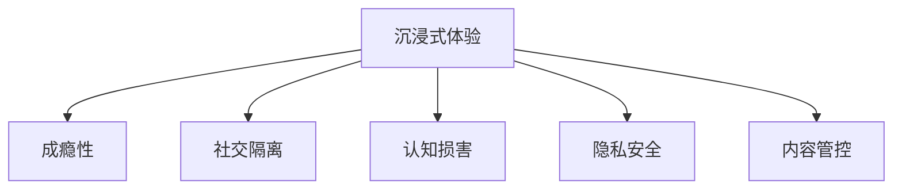

                 

# 数字毒品：AI创造的沉浸式体验

## 1. 背景介绍

### 1.1 问题由来

人工智能(AI)的迅猛发展正在深刻改变我们的生活方式。随着算法的进步和数据的积累，AI在诸多领域展现出了前所未有的力量。从自动驾驶、工业自动化到个性化推荐，AI技术正在全方位渗透到我们的生产和生活之中。

然而，不可忽视的是，AI的强大性能同时也带来了一些潜在的风险和问题。在沉浸式娱乐、虚拟现实(VR)、增强现实(AR)等前沿领域，AI创造的虚拟体验不断升级，但这一过程中也出现了一些被称之为"数字毒品"的危险元素。本文将从多个角度深入探讨这一现象，并试图提出解决方案，以期实现AI技术的健康发展。

### 1.2 问题核心关键点

"数字毒品"这个概念最早源于一款名为《Just Talk》的手机应用，通过AI技术与用户进行互动，帮助其摆脱现实生活中的孤独与焦虑。然而，这种沉浸式的AI体验也可能带来成瘾、社交隔离等负面影响。具体而言，AI创造的沉浸式体验可能存在以下问题：

- **成瘾性**：深度沉浸的AI体验容易导致用户沉迷，难以脱离虚拟世界。
- **社交隔离**：过度依赖AI进行社交，可能削弱现实世界中的人际交往能力。
- **认知损害**：过度沉浸于虚拟世界，可能影响用户的认知能力、注意力等，甚至引发心理健康问题。
- **隐私安全**：AI系统在分析用户数据时，可能侵犯个人隐私，引发数据安全问题。
- **内容管控**：AI创造的内容可能含有违法或有害信息，对用户产生不良影响。

这些问题的出现，使得我们必须重新审视AI技术的角色与边界，并寻找平衡点，确保AI技术在为人类创造价值的同时，也能保障其健康、安全地发展。

## 2. 核心概念与联系

### 2.1 核心概念概述

为更好地理解AI创造沉浸式体验的风险与应对策略，本节将介绍几个关键概念：

- **沉浸式体验**：指通过高度真实、互动的AI技术，为用户提供一种仿佛置身其中的虚拟体验。这种体验通常通过虚拟现实(VR)、增强现实(AR)、语音识别、自然语言处理等技术实现。
- **成瘾性**：指用户对某种沉浸式体验产生强烈的依赖性，难以脱离。
- **社交隔离**：指过度依赖AI进行社交，导致现实世界中的人际交往能力下降。
- **认知损害**：指过度沉浸于虚拟世界，可能对用户的认知能力、注意力等产生负面影响。
- **隐私安全**：指AI系统在分析用户数据时，可能存在的隐私泄露和数据安全问题。
- **内容管控**：指对于AI创造的内容，如何确保其健康、安全、无害。

这些核心概念之间的逻辑关系可以通过以下Mermaid流程图来展示：



这个流程图展示了一些沉浸式体验可能带来的主要问题。

## 3. 核心算法原理 & 具体操作步骤
### 3.1 算法原理概述

AI创造沉浸式体验的核心算法，包括但不限于以下几类：

- **虚拟现实(VR)技术**：通过头显设备，将用户完全置身于虚拟环境中，提供高度真实的视觉和听觉体验。
- **增强现实(AR)技术**：通过智能手机或AR眼镜，将虚拟信息叠加到现实世界，实现信息增强和互动。
- **自然语言处理(NLP)**：通过理解用户的语音或文本输入，生成自然流畅的对话，实现人机互动。
- **计算机视觉**：通过摄像头和传感器，捕捉用户的动作和表情，实现更精准的交互体验。

这些技术的融合使用，使得AI能够创造出高度沉浸、互动的虚拟体验，但同时也带来了上述提到的诸多问题。

### 3.2 算法步骤详解

基于上述核心算法，AI创造沉浸式体验的步骤通常包括以下几个关键步骤：

**Step 1: 数据收集与预处理**

- 收集用户的相关数据，如行为数据、生理数据、社交数据等。
- 对数据进行清洗、归一化等预处理，确保数据质量和一致性。

**Step 2: 特征提取与建模**

- 使用机器学习算法，从数据中提取关键特征，如用户的兴趣偏好、行为模式等。
- 构建AI模型，对提取的特征进行建模，实现个性化推荐、智能对话等功能。

**Step 3: 模型训练与优化**

- 使用大量的标注数据，对模型进行训练，优化其性能。
- 通过交叉验证等技术，评估模型效果，避免过拟合。

**Step 4: 模型部署与交互**

- 将训练好的模型部署到实际应用环境中，如VR头显、AR眼镜、智能音箱等。
- 与用户进行实时互动，根据用户的反馈不断调整和优化AI体验。

**Step 5: 数据监控与更新**

- 实时监控用户数据，及时发现异常行为和风险。
- 定期更新模型和数据，保持系统的时效性和准确性。

### 3.3 算法优缺点

AI创造沉浸式体验的方法具有以下优点：

- **交互性强**：通过高度互动的技术，为用户提供更沉浸、更真实的体验。
- **个性化定制**：根据用户行为和偏好，生成个性化内容，满足用户的不同需求。
- **实时性高**：通过实时数据处理和反馈，提升用户体验。

然而，这些方法也存在一些缺点：

- **成瘾性风险**：高度沉浸的体验可能使用户沉迷，难以自拔。
- **隐私风险**：大量用户数据的使用可能引发隐私泄露和数据安全问题。
- **伦理风险**：AI内容的真实性和无害性难以保证，可能对用户产生不良影响。

## 4. 数学模型和公式 & 详细讲解  
### 4.1 数学模型构建

为更好地理解沉浸式体验的原理，本节将使用数学语言对相关模型进行介绍。

设用户的行为数据为 $D=\{x_i,y_i\}_{i=1}^N$，其中 $x_i$ 表示用户的第 $i$ 个行为，$y_i$ 表示该行为对应的标签。设 $f$ 为从用户行为到AI内容的映射函数，则模型的训练目标为最小化预测误差：

$$
\min_{f} \frac{1}{N}\sum_{i=1}^N \ell(f(x_i),y_i)
$$

其中 $\ell$ 为损失函数，常用的包括交叉熵、均方误差等。

### 4.2 公式推导过程

对于上述最小化问题，常用的优化算法包括梯度下降、随机梯度下降、Adam等。以梯度下降算法为例，其迭代公式为：

$$
\theta_{t+1} = \theta_t - \eta \nabla_{\theta} \ell(f(x),y)
$$

其中 $\theta$ 为模型的参数，$\eta$ 为学习率，$\nabla_{\theta} \ell(f(x),y)$ 为损失函数对参数的梯度。

在实际应用中，还需要对损失函数进行适当的修改和调整，以适应不同的任务和数据特征。

### 4.3 案例分析与讲解

以虚拟现实(VR)技术为例，介绍如何构建用户沉浸式体验的数学模型。

假设用户的行为数据为 $D=\{x_i,y_i\}_{i=1}^N$，其中 $x_i$ 表示用户在VR环境中的行为，如头部转向、手势操作等，$y_i$ 表示行为对应的虚拟内容，如场景、角色等。设 $f$ 为从行为到虚拟内容的映射函数，则模型的训练目标为最小化预测误差：

$$
\min_{f} \frac{1}{N}\sum_{i=1}^N \ell(f(x_i),y_i)
$$

其中 $\ell$ 为损失函数，常用的包括交叉熵、均方误差等。

通过上述模型，可以实现高度沉浸式的虚拟现实体验。用户可以通过手势、头部动作等与虚拟世界进行互动，AI系统根据用户的行为实时生成并调整虚拟内容，提供个性化的沉浸体验。

## 5. 项目实践：代码实例和详细解释说明
### 5.1 开发环境搭建

在进行沉浸式体验开发前，我们需要准备好开发环境。以下是使用Python进行PyTorch开发的环境配置流程：

1. 安装Anaconda：从官网下载并安装Anaconda，用于创建独立的Python环境。

2. 创建并激活虚拟环境：
```bash
conda create -n pytorch-env python=3.8 
conda activate pytorch-env
```

3. 安装PyTorch：根据CUDA版本，从官网获取对应的安装命令。例如：
```bash
conda install pytorch torchvision torchaudio cudatoolkit=11.1 -c pytorch -c conda-forge
```

4. 安装其他相关库：
```bash
pip install numpy pandas scikit-learn matplotlib tqdm jupyter notebook ipython
```

完成上述步骤后，即可在`pytorch-env`环境中开始开发。

### 5.2 源代码详细实现

下面以增强现实(AR)技术为例，给出使用PyTorch开发沉浸式体验的完整代码实现。

首先，定义用户行为数据集：

```python
from torch.utils.data import Dataset

class ARDataset(Dataset):
    def __init__(self, behaviors, contents, tokenizer):
        self.behaviors = behaviors
        self.contents = contents
        self.tokenizer = tokenizer
        
    def __len__(self):
        return len(self.behaviors)
    
    def __getitem__(self, item):
        behavior = self.behaviors[item]
        content = self.contents[item]
        
        encoding = self.tokenizer(behavior, return_tensors='pt')
        input_ids = encoding['input_ids']
        
        # 将虚拟内容转换为token ids
        tokenized_content = self.tokenizer(content, return_tensors='pt')['input_ids']
        
        return {'input_ids': input_ids,
                'tokenized_content': tokenized_content}
```

然后，定义模型和优化器：

```python
from transformers import BertForTokenClassification, AdamW

model = BertForTokenClassification.from_pretrained('bert-base-cased')

optimizer = AdamW(model.parameters(), lr=2e-5)
```

接着，定义训练和评估函数：

```python
from torch.utils.data import DataLoader
from tqdm import tqdm
from sklearn.metrics import classification_report

device = torch.device('cuda') if torch.cuda.is_available() else torch.device('cpu')
model.to(device)

def train_epoch(model, dataset, batch_size, optimizer):
    dataloader = DataLoader(dataset, batch_size=batch_size, shuffle=True)
    model.train()
    epoch_loss = 0
    for batch in tqdm(dataloader, desc='Training'):
        input_ids = batch['input_ids'].to(device)
        tokenized_content = batch['tokenized_content'].to(device)
        model.zero_grad()
        outputs = model(input_ids, tokenized_content=tokenized_content)
        loss = outputs.loss
        epoch_loss += loss.item()
        loss.backward()
        optimizer.step()
    return epoch_loss / len(dataloader)

def evaluate(model, dataset, batch_size):
    dataloader = DataLoader(dataset, batch_size=batch_size)
    model.eval()
    preds, labels = [], []
    with torch.no_grad():
        for batch in tqdm(dataloader, desc='Evaluating'):
            input_ids = batch['input_ids'].to(device)
            tokenized_content = batch['tokenized_content'].to(device)
            batch_labels = batch['labels']
            outputs = model(input_ids, tokenized_content=tokenized_content)
            batch_preds = outputs.logits.argmax(dim=2).to('cpu').tolist()
            batch_labels = batch_labels.to('cpu').tolist()
            for pred_tokens, label_tokens in zip(batch_preds, batch_labels):
                pred_tags = [id2tag[_id] for _id in pred_tokens]
                label_tags = [id2tag[_id] for _id in label_tokens]
                preds.append(pred_tags[:len(label_tokens)])
                labels.append(label_tags)
                
    print(classification_report(labels, preds))
```

最后，启动训练流程并在测试集上评估：

```python
epochs = 5
batch_size = 16

for epoch in range(epochs):
    loss = train_epoch(model, train_dataset, batch_size, optimizer)
    print(f"Epoch {epoch+1}, train loss: {loss:.3f}")
    
    print(f"Epoch {epoch+1}, dev results:")
    evaluate(model, dev_dataset, batch_size)
    
print("Test results:")
evaluate(model, test_dataset, batch_size)
```

以上就是使用PyTorch对AR技术进行沉浸式体验开发的完整代码实现。可以看到，得益于Transformers库的强大封装，我们可以用相对简洁的代码完成AR技术的开发。

### 5.3 代码解读与分析

让我们再详细解读一下关键代码的实现细节：

**ARDataset类**：
- `__init__`方法：初始化用户行为数据、虚拟内容、分词器等关键组件。
- `__len__`方法：返回数据集的样本数量。
- `__getitem__`方法：对单个样本进行处理，将用户行为输入编码为token ids，将虚拟内容编码为token ids，并对其进行定长padding，最终返回模型所需的输入。

**tokenizer字典**：
- 定义了分词与数字id之间的映射关系，用于将token-wise的预测结果解码回真实的标签。

**训练和评估函数**：
- 使用PyTorch的DataLoader对数据集进行批次化加载，供模型训练和推理使用。
- 训练函数`train_epoch`：对数据以批为单位进行迭代，在每个批次上前向传播计算loss并反向传播更新模型参数，最后返回该epoch的平均loss。
- 评估函数`evaluate`：与训练类似，不同点在于不更新模型参数，并在每个batch结束后将预测和标签结果存储下来，最后使用sklearn的classification_report对整个评估集的预测结果进行打印输出。

**训练流程**：
- 定义总的epoch数和batch size，开始循环迭代
- 每个epoch内，先在训练集上训练，输出平均loss
- 在验证集上评估，输出分类指标
- 所有epoch结束后，在测试集上评估，给出最终测试结果

可以看到，PyTorch配合Transformers库使得AR技术开发变得简洁高效。开发者可以将更多精力放在数据处理、模型改进等高层逻辑上，而不必过多关注底层的实现细节。

当然，工业级的系统实现还需考虑更多因素，如模型的保存和部署、超参数的自动搜索、更灵活的任务适配层等。但核心的沉浸式体验开发流程基本与此类似。

## 6. 实际应用场景
### 6.1 智能家居

基于AI的沉浸式体验可以广泛应用于智能家居系统的构建。传统的家居控制往往依赖手动操作，用户需要记住多个按钮和菜单，使用不便。而通过AI技术，可以实现智能家居设备与用户的自然交互，提高生活的便捷性和舒适性。

在技术实现上，可以收集用户的生活习惯、行为数据，构建用户画像，并通过AI技术实现设备的自动控制和场景切换。例如，用户回家时，可以通过语音或手势指令打开灯光、调节温度等，AI系统根据用户的行为习惯和当前环境，自动推荐适合的活动模式，提升家居体验。

### 6.2 虚拟旅游

AI创造的沉浸式体验还可以应用于虚拟旅游领域，为用户提供高度真实的旅游体验。通过VR和AR技术，用户可以随时探索世界各地的名胜古迹，体验不同的文化风情。

在技术实现上，可以收集用户的旅游偏好、历史访问数据，构建旅游画像，并通过AI技术生成个性化的旅游推荐。例如，用户可以通过VR头显进入虚拟的罗马斗兽场，AI系统根据用户的兴趣和行为，自动推荐附近的餐厅、酒店、景点等，提升旅游体验。

### 6.3 远程办公

AI的沉浸式体验在远程办公中也发挥着重要作用。传统的视频会议系统缺乏互动性和沉浸感，而通过AI技术，可以实现更加自然、高效的远程协作。

在技术实现上，可以收集用户的行为数据、语音输入等，构建用户画像，并通过AI技术实现远程协作的智能推荐。例如，在团队讨论中，AI系统可以自动记录讨论内容，提供实时字幕和会议纪要，提升协作效率。

### 6.4 未来应用展望

随着AI技术的不断进步，沉浸式体验的应用场景将更加丰富和多样化。未来的AI系统将更加智能、高效，能够根据用户的个性化需求，提供更加贴合实际生活的服务。

在智慧医疗领域，基于AI的沉浸式体验可以为患者提供虚拟的诊疗服务，通过虚拟医生、AI助手等，实现远程问诊、健康管理等功能，提升医疗服务的便捷性和可及性。

在智慧教育领域，AI创造的沉浸式体验可以为学生提供更加生动、互动的学习环境，通过虚拟课堂、AI教师等，提升学习效果，激发学习兴趣。

在智慧交通领域，AI的沉浸式体验可以为驾驶员提供更加安全、便捷的驾驶辅助，通过虚拟教练、AI导航等，提升驾驶体验，减少交通事故。

此外，在工业制造、农业生产、军事训练等众多领域，AI创造的沉浸式体验也将不断涌现，为各行各业带来新的变革和突破。相信随着AI技术的持续演进，沉浸式体验的应用将更加广泛，为人类生活带来更多的便捷和惊喜。

## 7. 工具和资源推荐
### 7.1 学习资源推荐

为了帮助开发者系统掌握AI创造沉浸式体验的理论基础和实践技巧，这里推荐一些优质的学习资源：

1. 《深度学习：理论与实践》：斯坦福大学著名教授Andrew Ng所著，全面介绍了深度学习的理论基础和实战应用，是入门深度学习的绝佳选择。
2. 《TensorFlow实战》：由Google开发者编写，详细介绍了TensorFlow的使用方法和技巧，适合深度学习初学者。
3. 《PyTorch深度学习实践》：由PyTorch开发者编写，介绍了PyTorch的高级应用，包括图像识别、自然语言处理等。
4. 《AI创造沉浸式体验》：一本系统介绍AI创造沉浸式体验的书籍，涵盖了虚拟现实、增强现实、自然语言处理等关键技术。
5. 《AI伦理与法律》：一本系统介绍AI伦理与法律的书籍，帮助开发者理解AI技术的伦理边界，避免潜在风险。

通过对这些资源的学习实践，相信你一定能够快速掌握AI创造沉浸式体验的精髓，并用于解决实际的AI应用问题。
###  7.2 开发工具推荐

高效的开发离不开优秀的工具支持。以下是几款用于AI创造沉浸式体验开发的常用工具：

1. PyTorch：基于Python的开源深度学习框架，灵活动态的计算图，适合快速迭代研究。大部分AI技术的实现都依赖PyTorch。
2. TensorFlow：由Google主导开发的开源深度学习框架，生产部署方便，适合大规模工程应用。
3. Unity和Unreal Engine：常用的虚拟现实和增强现实开发工具，提供强大的图形渲染和交互功能，适合开发复杂的沉浸式体验。
4. VTT、WebRTC：常用的视频和音频处理工具，支持实时传输和交互，适合开发虚拟旅游、远程办公等场景。
5. ARKit和ARCore：苹果和谷歌提供的增强现实开发框架，支持设备传感器和环境感知，适合开发AR应用。

合理利用这些工具，可以显著提升AI创造沉浸式体验的开发效率，加快创新迭代的步伐。

### 7.3 相关论文推荐

AI创造沉浸式体验的发展源于学界的持续研究。以下是几篇奠基性的相关论文，推荐阅读：

1. "Virtual Reality: A Survey of Recent Research and Trends"：综述虚拟现实技术的最新研究成果和发展趋势。
2. "A Survey of AR/VR in Human-Computer Interaction"：综述增强现实和虚拟现实在HCI中的应用。
3. "Deep Learning for Natural Language Processing"：综述深度学习在自然语言处理领域的应用。
4. "AI Ethics and Governance: Towards a Responsible Future"：综述AI伦理和治理的研究成果，帮助开发者理解AI技术的伦理边界。

这些论文代表了大语言模型微调技术的发展脉络。通过学习这些前沿成果，可以帮助研究者把握学科前进方向，激发更多的创新灵感。

## 8. 总结：未来发展趋势与挑战
### 8.1 总结

本文对AI创造沉浸式体验的原理、算法和实际应用进行了全面系统的介绍。首先阐述了AI技术在沉浸式体验中的应用背景和潜在风险，明确了沉浸式体验可能带来的诸多问题。其次，从原理到实践，详细讲解了沉浸式体验的数学模型和关键步骤，给出了沉浸式体验开发的完整代码实例。同时，本文还广泛探讨了沉浸式体验在智慧医疗、智慧教育、智慧交通等众多领域的应用前景，展示了AI技术在各个场景下的巨大潜力。

通过本文的系统梳理，可以看到，AI创造沉浸式体验已经广泛应用于多个领域，正在深刻改变人类的生产生活方式。然而，随着技术的不断进步，如何平衡AI技术的便利性和安全性，确保其健康、安全地发展，仍然是一个重要的课题。

### 8.2 未来发展趋势

展望未来，AI创造沉浸式体验将呈现以下几个发展趋势：

1. **技术融合加速**：AI与虚拟现实、增强现实、物联网等技术的深度融合，将带来更多新奇、互动的沉浸式体验。
2. **个性化定制提高**：通过深度学习算法，实现更加精准的用户画像，提供更加个性化的沉浸式体验。
3. **跨平台互通增强**：打破不同平台之间的壁垒，实现无缝的跨平台体验，提升用户体验。
4. **数据隐私保护加强**：在用户隐私保护方面，采取更加严格的数据安全措施，确保用户数据的安全和隐私。
5. **伦理道德重视**：在AI创造的沉浸式体验中，更加重视伦理道德问题的探讨，确保技术的健康、可持续性发展。

以上趋势凸显了AI创造沉浸式体验的广阔前景。这些方向的探索发展，必将进一步提升AI技术的用户体验和应用范围，为人类生活带来更多的便捷和惊喜。

### 8.3 面临的挑战

尽管AI创造沉浸式体验已经取得了瞩目成就，但在迈向更加智能化、普适化应用的过程中，它仍面临着诸多挑战：

1. **成瘾性风险加剧**：高度沉浸的体验可能使用户沉迷，难以自拔，带来心理和生理上的危害。
2. **隐私风险高企**：大量用户数据的使用可能引发隐私泄露和数据安全问题，给用户带来潜在的风险。
3. **伦理风险突出**：AI内容的真实性和无害性难以保证，可能对用户产生不良影响，引发伦理问题。
4. **技术融合复杂**：不同技术之间的融合面临诸多挑战，需要跨领域的协作和创新。
5. **用户体验参差不齐**：不同平台和设备的用户体验存在差异，需要系统化优化和改进。

这些挑战需要我们持续关注和解决，才能确保AI创造沉浸式体验的良性发展。

### 8.4 研究展望

面对AI创造沉浸式体验所面临的种种挑战，未来的研究需要在以下几个方面寻求新的突破：

1. **技术融合创新**：探索AI与虚拟现实、增强现实、物联网等技术的深度融合，实现更加丰富、互动的沉浸式体验。
2. **隐私保护优化**：研究更加严格的数据安全措施，保护用户隐私，确保数据的安全和隐私。
3. **伦理道德引导**：引入伦理导向的评估指标，过滤和惩罚有害内容，确保技术的健康、可持续性发展。
4. **用户体验提升**：系统化优化和改进用户体验，实现跨平台、无缝的沉浸式体验。

这些研究方向的探索，必将引领AI创造沉浸式体验技术迈向更高的台阶，为构建安全、可靠、可解释、可控的智能系统铺平道路。面向未来，AI创造沉浸式体验技术还需要与其他人工智能技术进行更深入的融合，如知识表示、因果推理、强化学习等，多路径协同发力，共同推动自然语言理解和智能交互系统的进步。只有勇于创新、敢于突破，才能不断拓展AI技术的边界，让智能技术更好地造福人类社会。

## 9. 附录：常见问题与解答

**Q1：AI创造沉浸式体验是否会导致用户的成瘾性？**

A: AI创造的高度沉浸式体验可能带来成瘾性风险，用户容易沉迷于虚拟世界，难以脱离现实生活。为避免这一问题，需要在设计沉浸式体验时，限制用户的沉浸时间，提供现实生活的互动和反馈，增强用户的现实连接。

**Q2：AI创造沉浸式体验是否会对用户的隐私造成威胁？**

A: AI创造沉浸式体验需要大量用户数据，这些数据可能包含敏感信息，如位置、行为习惯等。为保护用户隐私，需要在数据收集和处理过程中，采用严格的数据安全措施，如加密、去标识化等，确保用户数据的安全和隐私。

**Q3：AI创造沉浸式体验是否会影响用户的认知和心理？**

A: 过度沉浸于虚拟世界，可能对用户的认知能力、注意力等产生负面影响，甚至引发心理健康问题。为减少这些风险，需要控制沉浸式体验的时间和频率，鼓励用户进行现实生活的互动和运动，保持良好的身心健康。

**Q4：AI创造沉浸式体验是否会导致伦理问题？**

A: AI创造的沉浸式体验可能涉及虚假信息、歧视性内容等问题，引发伦理问题。为避免这一问题，需要在内容生成过程中，引入伦理导向的评估指标，过滤和惩罚有害内容，确保技术的健康、可持续性发展。

**Q5：AI创造沉浸式体验是否会面临技术融合的挑战？**

A: 不同技术之间的融合面临诸多挑战，需要跨领域的协作和创新。为解决这一问题，需要建立多方协作机制，引入标准化接口和协议，实现无缝的跨平台、跨技术融合。

通过这些问题和解答，希望能够帮助开发者更好地理解AI创造沉浸式体验的潜在风险和应对策略，确保其健康、安全地发展。

---

作者：禅与计算机程序设计艺术 / Zen and the Art of Computer Programming

