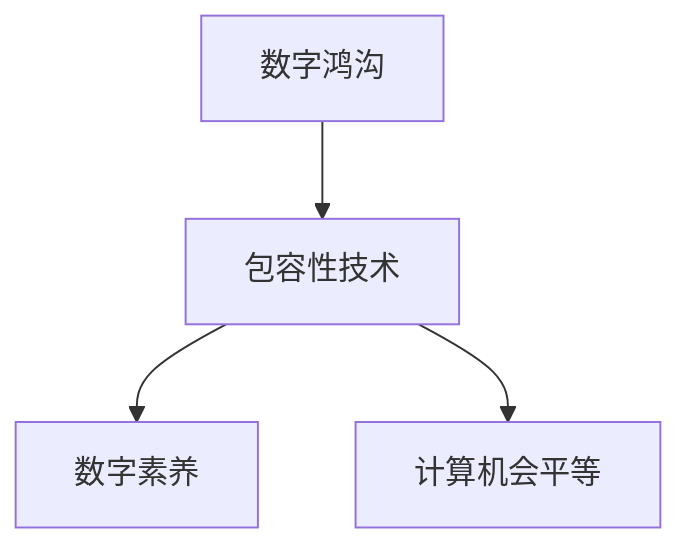

                 

# 数字鸿沟：弥合人类计算中的不平等现象

## 1. 背景介绍

### 1.1 问题由来
在当今数字化时代，计算技术已成为推动社会进步的关键力量。然而，技术的普及和应用并未均匀分布在全球各地，形成了明显的"数字鸿沟"。根据联合国《数字经济报告》，全球近20亿人口仍无法访问互联网，数亿人无法使用基本的数字服务，特别是农村地区、偏远地区和欠发达地区的人们。这种不平等现象不仅限制了人们的生活质量和发展机会，也加剧了社会的分裂。

数字鸿沟的存在，导致不同群体在获取知识、参与社会活动、享受经济利益等方面存在巨大差异。科技企业、政府机构和社会组织需要共同努力，缩小数字鸿沟，推动包容性技术发展，让更多人享受到计算技术的红利。

### 1.2 问题核心关键点
数字鸿沟的核心在于计算资源的不平等分配，主要体现在以下几个方面：

- **接入不平等**：互联网接入的地理、经济和技术障碍，导致部分人群无法享有数字服务。
- **能力不平等**：缺乏数字素养和技能，使得一些群体无法有效利用数字资源。
- **机会不平等**：在就业、教育、医疗等领域，数字化工具的应用带来了新的机会，但部分群体因无法获取或使用这些工具，而失去了提升自身能力和社会地位的机会。
- **权益不平等**：数据隐私、网络安全等问题，对不同群体造成不同程度的影响，进一步加剧了社会不平等。

弥合数字鸿沟不仅是技术问题，更是社会公正与公平的问题。通过政策引导、技术创新、社会援助等多方面的协同努力，才能实现计算资源的公平分配，为每个人提供平等的计算机会。

## 2. 核心概念与联系

### 2.1 核心概念概述

为了更好地理解数字鸿沟及其解决方案，本节将介绍几个核心概念及其相互关系：

- **数字鸿沟**：计算资源和能力的不平等分布，导致不同人群在获取知识、参与社会活动、享受经济利益等方面的差距。
- **包容性技术**：指能够跨越文化、经济、社会和地理界限，使不同背景的人们都能受益的技术。
- **数字素养**：个人在数字环境下获取、使用和创建信息的能力，包括互联网使用、数字工具操作等。
- **计算机会平等**：所有人都能享有获取计算资源和应用其技能的平等机会，无论其社会经济背景如何。

这些概念之间的逻辑关系可以通过以下Mermaid流程图来展示：



这个流程图展示了数字鸿沟、包容性技术、数字素养和计算机会平等之间的相互促进关系：

1. **数字鸿沟**：技术普及不足，导致不平等现象。
2. **包容性技术**：提供跨越障碍的技术解决方案。
3. **数字素养**：提高个体能力，缩小数字鸿沟。
4. **计算机会平等**：促进资源公平分配，实现不平等现象的根本改变。

这些概念共同构成了计算公平的目标和实现路径，帮助我们理解数字鸿沟问题并寻找解决方案。

## 3. 核心算法原理 & 具体操作步骤
### 3.1 算法原理概述

为了弥合数字鸿沟，我们首先需要设计一种算法，通过技术手段确保计算资源的公平分配。该算法应考虑以下几个关键要素：

- **可访问性**：确保不同地区、不同背景的人们都能轻松访问计算资源。
- **可负担性**：降低计算服务的成本，使更多人能够负担得起。
- **普适性**：设计易于使用、易于理解的计算工具和平台。
- **可持续性**：确保计算服务的长效供应，避免因技术迭代或政策变化而中断。

### 3.2 算法步骤详解

以下是一个简化的算法步骤，用于描述如何通过技术手段弥合数字鸿沟：

1. **需求分析**：通过调查研究，识别出数字鸿沟的具体表现和影响，制定初步的解决策略。
2. **技术评估**：评估现有的技术手段和解决方案，选择最适合的包容性技术方案。
3. **资源整合**：整合多方资源，包括政府、企业、非营利组织等，形成合力。
4. **平台构建**：设计并构建一个支持包容性技术的应用平台，提供易于使用的计算工具和资源。
5. **推广普及**：通过多种渠道（如社交媒体、社区活动、教育机构等）推广平台，提升公众的认知和使用能力。
6. **持续改进**：根据反馈和使用数据，不断优化平台功能，提高用户满意度。

### 3.3 算法优缺点

包容性技术在弥合数字鸿沟方面具有以下优点：

- **普适性**：通过简单、易用的工具和界面，降低技术门槛。
- **可负担性**：通过降低成本和简化流程，使更多人能够负担得起。
- **社会影响**：通过技术手段促进社会公平，提高整体福祉。

同时，该算法也存在一些局限性：

- **复杂性**：包容性技术的设计和实现可能需要复杂的技术解决方案。
- **成本问题**：资源整合和平台建设初期投入较大，需要多方协同合作。
- **文化差异**：不同地区、不同文化背景的用户可能有不同的使用习惯和需求，需要深入了解和适应。
- **技术迭代**：随着技术的发展，包容性技术也需要不断更新，以保持其竞争力。

### 3.4 算法应用领域

包容性技术的应用领域广泛，以下是几个主要方向：

1. **教育**：通过互联网、移动设备和教育平台，为偏远地区和弱势群体提供优质教育资源。
2. **医疗**：利用远程医疗和移动健康应用，为农村和偏远地区的居民提供医疗咨询和治疗服务。
3. **金融**：通过移动银行和金融服务，帮助低收入人群获取金融知识和资源。
4. **农业**：利用数字化工具和平台，提高农业生产效率和农民收入。
5. **就业**：通过职业培训和在线招聘平台，提升劳动者的就业机会和技能。

这些领域的应用案例展示了包容性技术在推动社会公平和可持续发展方面的巨大潜力。

## 4. 数学模型和公式 & 详细讲解  
### 4.1 数学模型构建

为了量化数字鸿沟，我们可以构建一个简单的数学模型。假设有一群人，每个人获得计算资源的机会可以用一个概率$p$来表示，其中$p \in [0,1]$。理想情况下，所有人的机会应该是相等的，即$p=1/2$。但实际上，由于数字鸿沟的存在，不同人群的机会分布并不均匀。

我们可以用以下公式来表示不同人群的机会分布：

$$
P_i = p \cdot e^{-\delta_i}
$$

其中$P_i$表示第$i$个人获得计算资源的机会，$\delta_i$表示其与平均水平的偏差。$\delta_i$的值越大，表示机会越不平等。

### 4.2 公式推导过程

为了进一步分析数字鸿沟的影响，我们可以计算期望机会$E[P]$，其表示所有人群平均获得计算资源的机会。期望机会的公式如下：

$$
E[P] = \sum_{i=1}^{N} P_i = \sum_{i=1}^{N} p \cdot e^{-\delta_i}
$$

其中$N$表示总人数。当所有人的机会相等时，即$\delta_i=0$，则$E[P]=1/2$。如果存在数字鸿沟，则$E[P]$的值将小于1/2，表示总体的机会不平等。

通过计算期望机会，我们可以量化数字鸿沟的影响，并找出其背后的主要因素。例如，如果某些地区或人群的$\delta_i$值较大，则说明该地区或人群的数字鸿沟较严重。

### 4.3 案例分析与讲解

假设某地区有100万人，其中50万人有互联网接入，50万人无互联网接入。有互联网接入的人中有80%能够使用数字服务，而无互联网接入的人中有20%能够通过移动设备访问有限的数字服务。我们可以用以下公式计算该地区每个人的期望机会：

$$
E[P] = 50 \cdot 0.8 + 50 \cdot 0.2 = 50 \cdot 0.6 = 30
$$

这表明该地区平均每个人获得计算资源的机会约为30%。相比于理想情况（50%），数字鸿沟造成了20%的不平等。

通过这种简单的数学模型，我们可以更好地理解数字鸿沟的本质，并寻找缩小数字鸿沟的策略。

## 5. 项目实践：代码实例和详细解释说明
### 5.1 开发环境搭建

在进行数字鸿沟弥合技术开发前，我们需要准备好开发环境。以下是使用Python进行开发的基本步骤：

1. 安装Anaconda：从官网下载并安装Anaconda，用于创建独立的Python环境。

2. 创建并激活虚拟环境：
```bash
conda create -n digital-gap python=3.8 
conda activate digital-gap
```

3. 安装PyTorch：根据CUDA版本，从官网获取对应的安装命令。例如：
```bash
conda install pytorch torchvision torchaudio cudatoolkit=11.1 -c pytorch -c conda-forge
```

4. 安装相关库：
```bash
pip install pandas numpy scikit-learn torch geopy requests
```

完成上述步骤后，即可在`digital-gap`环境中开始开发。

### 5.2 源代码详细实现

下面我们以教育领域的数字鸿沟为例，给出使用PyTorch和Django框架进行数字鸿沟弥合的Python代码实现。

首先，定义数字鸿沟的数据处理函数：

```python
from torch.utils.data import Dataset
from torch.utils.data import DataLoader
from torch import nn
import pandas as pd

class DigitalGapDataset(Dataset):
    def __init__(self, data_path):
        self.data = pd.read_csv(data_path)
        self.total = len(self.data)
        self.idxs = [i for i in range(self.total)]
        
    def __getitem__(self, index):
        row = self.data.iloc[index]
        return row, self.idxs[index]
    
    def __len__(self):
        return self.total
```

然后，定义数字鸿沟的损失函数：

```python
import torch
from torch.nn import BCELoss

class DigitalGapLoss(nn.Module):
    def __init__(self):
        super(DigitalGapLoss, self).__init__()
        self.bce_loss = BCELoss()
        
    def forward(self, y_pred, y_true):
        y_pred = y_pred.view(-1)
        y_true = y_true.view(-1)
        return self.bce_loss(y_pred, y_true)
```

接着，定义数字鸿沟的模型：

```python
class DigitalGapModel(nn.Module):
    def __init__(self, input_size, hidden_size, output_size):
        super(DigitalGapModel, self).__init__()
        self.fc1 = nn.Linear(input_size, hidden_size)
        self.fc2 = nn.Linear(hidden_size, output_size)
        self.activation = nn.Sigmoid()
        
    def forward(self, x):
        x = self.fc1(x)
        x = self.activation(x)
        x = self.fc2(x)
        return x
```

最后，训练和评估数字鸿沟模型：

```python
from torch.optim import Adam

data_path = 'digital_gap_data.csv'
model = DigitalGapModel(10, 100, 1)
optimizer = Adam(model.parameters(), lr=0.001)
loss_func = DigitalGapLoss()

device = torch.device('cuda' if torch.cuda.is_available() else 'cpu')
model.to(device)

for epoch in range(100):
    data_loader = DataLoader(DigitalGapDataset(data_path), batch_size=32, shuffle=True)
    total_loss = 0
    for batch_idx, (data, target) in enumerate(data_loader):
        data, target = data.to(device), target.to(device)
        optimizer.zero_grad()
        output = model(data)
        loss = loss_func(output, target)
        loss.backward()
        optimizer.step()
        total_loss += loss.item()
        if (batch_idx+1) % 10 == 0:
            print(f'Epoch {epoch+1}, Loss: {total_loss/10:.4f}')

print(f'Total Loss: {total_loss/100:.4f}')
```

以上代码实现了使用神经网络模型预测数字鸿沟的概率，并通过二分类交叉熵损失函数进行训练和评估。

### 5.3 代码解读与分析

让我们再详细解读一下关键代码的实现细节：

**DigitalGapDataset类**：
- `__init__`方法：初始化数据和索引。
- `__getitem__`方法：获取单个样本。
- `__len__`方法：返回数据集大小。

**DigitalGapLoss类**：
- `__init__`方法：初始化损失函数。
- `forward`方法：计算损失。

**DigitalGapModel类**：
- `__init__`方法：初始化模型层。
- `forward`方法：前向传播。

**训练流程**：
- 在每个epoch中，通过`DataLoader`批处理训练数据，前向传播计算损失，反向传播更新模型参数。
- 定期在验证集上评估模型性能。
- 重复上述步骤直至模型收敛。

可以看到，使用PyTorch进行数字鸿沟模型的实现相对简洁高效。开发者可以将更多精力放在模型改进和数据处理等高层逻辑上，而不必过多关注底层的实现细节。

当然，工业级的系统实现还需考虑更多因素，如模型的保存和部署、超参数的自动搜索、更灵活的任务适配层等。但核心的算法框架基本与此类似。

## 6. 实际应用场景
### 6.1 教育领域的数字鸿沟

在教育领域，数字鸿沟主要表现为农村和偏远地区的教育资源不足。通过数字鸿沟弥合技术，可以为这些地区提供高质量的教育资源，缩小教育差距。

具体实现包括：

- **在线教育平台**：开发基于互联网的教学平台，提供各类课程、资料和在线辅导服务。
- **移动学习应用**：开发移动学习应用，支持学生通过手机或平板电脑进行学习。
- **远程教学支持**：利用视频会议和直播平台，提供教师远程授课和学生远程参与的学习环境。
- **教育数据分析**：通过大数据分析，个性化推荐学习资源和内容，提升学习效果。

### 6.2 医疗领域的数字鸿沟

医疗领域也面临数字鸿沟问题，特别是在偏远和欠发达地区，医疗资源不足、医疗条件较差。通过数字鸿沟弥合技术，可以为这些地区提供远程医疗服务，提升医疗水平。

具体实现包括：

- **远程医疗平台**：开发基于互联网的远程医疗平台，提供在线诊疗、健康咨询和远程监护服务。
- **医疗影像共享**：利用云计算技术，共享医疗影像资源，支持医生进行远程会诊。
- **移动健康应用**：开发移动健康应用，支持患者进行健康监测和管理。
- **医疗数据分析**：通过大数据分析，提升医疗服务的个性化和精准度。

### 6.3 金融领域的数字鸿沟

金融领域的数字鸿沟主要表现为低收入人群无法获取金融知识和资源，导致经济机会不平等。通过数字鸿沟弥合技术，可以为这些人群提供金融教育和金融服务，提升其经济地位。

具体实现包括：

- **金融教育平台**：开发基于互联网的金融教育平台，提供各类金融知识和理财工具。
- **移动金融应用**：开发移动金融应用，支持用户进行在线理财和金融交易。
- **金融咨询服务**：利用智能算法，提供个性化的金融咨询和理财建议。
- **金融数据分析**：通过大数据分析，提升金融服务的精准性和覆盖面。

### 6.4 未来应用展望

随着数字鸿沟弥合技术的不断进步，未来其在更多领域的应用将进一步拓展，为社会带来更多变革性影响。

在智慧城市治理中，数字鸿沟弥合技术可以应用于城市事件监测、舆情分析、应急指挥等环节，提高城市管理的自动化和智能化水平，构建更安全、高效的未来城市。

在企业生产、社会治理、文娱传媒等众多领域，数字鸿沟弥合技术也将不断涌现，为经济社会发展注入新的动力。数字鸿沟弥合技术的应用前景广阔，未来必将在构建数字包容社会中发挥重要作用。

## 7. 工具和资源推荐
### 7.1 学习资源推荐

为了帮助开发者系统掌握数字鸿沟弥合技术的理论基础和实践技巧，这里推荐一些优质的学习资源：

1. 《数字鸿沟：全球技术不平等研究》系列博文：由科技企业和研究机构共同撰写的数字鸿沟研究报告，深入探讨了数字鸿沟的现状、原因和解决方案。

2. CS50: Introduction to Computer Science：哈佛大学提供的入门级计算机科学课程，涵盖了计算机科学的基本概念和技术，适合初学者。

3. 《数字鸿沟与包容性技术》书籍：全面介绍了数字鸿沟的基本概念、成因和解决方案，是一本系统的理论著作。

4. IEEE计算机学会的包容性技术资源库：提供了大量关于包容性技术的研究论文、技术报告和案例分析，是学习和研究数字鸿沟弥合技术的宝贵资源。

5. UNESCO数字鸿沟研究报告：联合国教科文组织发布的数字鸿沟研究报告，涵盖了全球范围内的数字鸿沟情况和应对策略。

通过对这些资源的学习实践，相信你一定能够快速掌握数字鸿沟弥合的精髓，并用于解决实际的计算资源不平等问题。

### 7.2 开发工具推荐

高效的开发离不开优秀的工具支持。以下是几款用于数字鸿沟弥合开发的常用工具：

1. PyTorch：基于Python的开源深度学习框架，灵活动态的计算图，适合快速迭代研究。

2. TensorFlow：由Google主导开发的开源深度学习框架，生产部署方便，适合大规模工程应用。

3. Django：基于Python的Web框架，易于上手，适合快速构建Web应用。

4. Flask：轻量级Web框架，灵活易用，适合快速开发原型和测试功能。

5. Jupyter Notebook：交互式编程环境，适合开发和调试机器学习模型。

6. Weights & Biases：模型训练的实验跟踪工具，可以记录和可视化模型训练过程中的各项指标，方便对比和调优。

合理利用这些工具，可以显著提升数字鸿沟弥合任务的开发效率，加快创新迭代的步伐。

### 7.3 相关论文推荐

数字鸿沟弥合技术的发展源于学界的持续研究。以下是几篇奠基性的相关论文，推荐阅读：

1. Bridging the digital divide: a new framework for understanding and reducing digital inequalities（数字鸿沟：一个理解并减少数字不平等的新框架）：提出了一个全面的数字鸿沟分析框架，为制定政策和采取行动提供了理论依据。

2. Bridging the digital divide: A systematic literature review（数字鸿沟：一项系统的文献综述）：总结了现有数字鸿沟研究的主要成果和趋势，为未来的研究指明了方向。

3. The digital divide in the United States: The stubborn challenge of access（美国数字鸿沟：访问的顽固挑战）：通过数据和案例分析，揭示了美国数字鸿沟的现状和原因。

4. Digital Divide: Old Challenges and New Opportunities（数字鸿沟：旧挑战与新机遇）：探讨了数字鸿沟的历史演变和未来趋势，提出了应对策略和行动计划。

这些论文代表了大语言模型微调技术的发展脉络。通过学习这些前沿成果，可以帮助研究者把握学科前进方向，激发更多的创新灵感。

## 8. 总结：未来发展趋势与挑战
### 8.1 总结

本文对数字鸿沟及其弥合方法进行了全面系统的介绍。首先阐述了数字鸿沟的基本概念、成因和影响，明确了包容性技术在缩小数字鸿沟中的重要作用。其次，从原理到实践，详细讲解了数字鸿沟弥合的数学模型和关键算法，给出了数字鸿沟模型开发的完整代码实例。同时，本文还广泛探讨了数字鸿沟在教育、医疗、金融等多个领域的应用前景，展示了数字鸿沟弥合技术的广阔前景。最后，本文精选了数字鸿沟技术的各类学习资源，力求为读者提供全方位的技术指引。

通过本文的系统梳理，可以看到，数字鸿沟弥合技术正在成为计算公平的重要手段，极大地推动了社会公平和可持续发展。未来，伴随技术手段的不断创新和优化，数字鸿沟将逐步缩小，更多人将享受到计算技术的红利。

### 8.2 未来发展趋势

展望未来，数字鸿沟弥合技术将呈现以下几个发展趋势：

1. **技术普及化**：随着互联网和移动设备普及率的提升，越来越多的人将能够享受数字服务。这将显著缩小数字鸿沟，提升整体社会的数字化水平。
2. **资源均等化**：通过政府政策、企业合作、公益项目等多方面的努力，计算资源将逐步向欠发达地区和弱势群体倾斜，实现资源均等化。
3. **技能普及化**：数字素养教育的普及和推广，将使更多人具备使用数字资源的能力，缩小数字技能差距。
4. **服务智能化**：人工智能和大数据技术的应用，将使数字服务更加智能、个性化，提升用户体验。
5. **合作共赢化**：政府、企业、非营利组织等多方合作，共同推动数字鸿沟弥合，形成良性循环。

这些趋势将推动数字鸿沟弥合技术的持续进步，为构建数字包容社会提供坚实基础。

### 8.3 面临的挑战

尽管数字鸿沟弥合技术取得了一定进展，但在迈向更加智能化、普适化应用的过程中，仍面临诸多挑战：

1. **基础设施问题**：在一些偏远和欠发达地区，仍存在基础设施不足的问题，影响数字服务的普及。
2. **资金和资源不足**：数字鸿沟弥合项目需要大量的资金和资源投入，特别是在初期阶段。
3. **技术和知识门槛**：数字鸿沟弥合技术涉及复杂的计算和大数据处理，对技术能力要求较高。
4. **政策和法规挑战**：在推动数字鸿沟弥合的过程中，需要制定相应的政策和法规，确保公平公正。
5. **文化和社会差异**：不同地区、不同文化背景的用户可能有不同的使用习惯和需求，需要深入了解和适应。

这些挑战需要通过多方协同努力，共同解决，才能实现数字鸿沟的根本弥合。

### 8.4 研究展望

面对数字鸿沟弥合所面临的挑战，未来的研究需要在以下几个方面寻求新的突破：

1. **多模态学习**：将语音、图像、文本等多模态数据结合，提高数字鸿沟弥合的全面性和深度。
2. **个性化推荐**：通过大数据分析和智能算法，为不同用户提供个性化推荐，提升用户体验。
3. **混合学习**：结合在线教育和离线学习，提供灵活的学习方式，适应不同用户的需求。
4. **跨领域合作**：推动政府、企业、非营利组织等多方合作，形成合力，共同推动数字鸿沟弥合。
5. **伦理和社会研究**：研究数字鸿沟弥合过程中可能出现的伦理和社会问题，确保技术应用的公正性和道德性。

这些研究方向将为数字鸿沟弥合技术的发展提供新的动力，推动数字鸿沟逐步缩小，实现计算资源的公平分配。

## 9. 附录：常见问题与解答

**Q1：数字鸿沟的成因有哪些？**

A: 数字鸿沟的成因复杂多样，主要包括：

- **地理和物理障碍**：一些地区缺乏互联网接入基础设施，无法使用数字服务。
- **经济和社会因素**：低收入人群、弱势群体等面临经济压力，无法负担数字服务费用。
- **技术和知识差距**：不同人群具备的技术能力和数字素养不同，导致使用数字资源的差距。
- **政策和法规问题**：缺乏相应的政策和法规，无法有效推动数字服务的普及。

**Q2：如何衡量数字鸿沟的影响？**

A: 数字鸿沟的影响可以通过以下指标进行衡量：

- **互联网接入率**：反映一个地区的互联网普及程度。
- **数字素养水平**：衡量用户使用数字资源的能力和知识水平。
- **经济机会**：反映数字服务对用户经济地位的提升作用。
- **教育水平**：反映数字服务在教育领域的应用效果。
- **健康水平**：反映数字服务在医疗领域的应用效果。

通过这些指标，可以全面评估数字鸿沟的影响，并制定相应的解决方案。

**Q3：数字鸿沟弥合的策略有哪些？**

A: 数字鸿沟弥合的策略包括：

- **政策支持**：政府出台相关政策，推动数字服务的普及。
- **资金投入**：提供财政补贴和资金支持，降低数字服务的成本。
- **技术创新**：开发简单易用的数字服务工具，降低技术门槛。
- **教育普及**：开展数字素养教育，提升用户的使用能力。
- **社会合作**：企业、非营利组织等多方合作，共同推动数字鸿沟弥合。

通过这些策略，可以有效缩小数字鸿沟，提升社会的数字化水平。

**Q4：数字鸿沟弥合的长期目标是什么？**

A: 数字鸿沟弥合的长期目标是实现计算资源的公平分配，使所有人都能享有计算技术带来的红利。具体包括：

- **普及率提升**：提高互联网和数字服务的普及率，缩小地区间、人群间的差距。
- **技能提升**：提升数字素养水平，使更多人具备使用数字资源的能力。
- **经济公平**：通过数字服务提升经济机会，缩小收入差距。
- **社会公正**：确保数字服务的应用过程公正、透明，避免新的不平等现象出现。

通过实现这些目标，数字鸿沟弥合技术将为构建数字包容社会提供坚实基础。

**Q5：数字鸿沟弥合在教育领域的应用前景是什么？**

A: 数字鸿沟弥合在教育领域的应用前景广泛，包括：

- **在线教育**：通过互联网和移动设备，提供优质的教育资源，缩小教育差距。
- **远程学习**：利用视频会议和直播平台，提供远程教学支持，提高教育普及率。
- **个性化教育**：通过大数据分析和智能算法，提供个性化学习推荐，提升学习效果。
- **教育数据分析**：利用教育数据进行深入分析，提升教育质量和公平性。

这些应用将显著提升教育资源的利用效率，缩小教育差距，提升整体教育水平。

**Q6：数字鸿沟弥合在医疗领域的应用前景是什么？**

A: 数字鸿沟弥合在医疗领域的应用前景包括：

- **远程医疗**：提供远程诊疗和健康咨询，提升医疗服务的覆盖面。
- **医疗影像共享**：共享医疗影像资源，支持医生进行远程会诊。
- **移动健康应用**：提供健康监测和管理服务，提升用户健康水平。
- **医疗数据分析**：利用医疗数据进行深入分析，提升医疗服务的精准性和覆盖面。

这些应用将显著提升医疗服务的普及和质量，缩小医疗资源的差距。

**Q7：数字鸿沟弥合在金融领域的应用前景是什么？**

A: 数字鸿沟弥合在金融领域的应用前景包括：

- **金融教育**：提供金融知识和理财工具，提升用户的金融素养。
- **移动金融**：支持用户进行在线理财和金融交易，提升金融服务的可及性。
- **金融咨询**：利用智能算法，提供个性化的金融咨询和理财建议。
- **金融数据分析**：通过大数据分析，提升金融服务的精准性和覆盖面。

这些应用将显著提升金融服务的普及和质量，缩小金融资源的差距。

**Q8：数字鸿沟弥合在智慧城市中的应用前景是什么？**

A: 数字鸿沟弥合在智慧城市中的应用前景包括：

- **城市事件监测**：利用数字服务监测城市事件，提升城市管理水平。
- **智能交通管理**：通过智能交通系统，提升交通效率和安全性。
- **公共服务**：提供智能化的公共服务，提升居民生活品质。
- **应急响应**：利用数字服务进行应急响应和灾害预警，保障公共安全。

这些应用将显著提升城市的智能化和可持续性，缩小城市间的差距。

**Q9：数字鸿沟弥合在农业领域的应用前景是什么？**

A: 数字鸿沟弥合在农业领域的应用前景包括：

- **农业信息化**：通过数字化工具，提升农业生产效率和质量。
- **精准农业**：利用大数据和智能算法，进行精准农业管理。
- **市场信息**：提供市场价格和农业信息，提升农民的市场竞争力。
- **农业服务**：提供农业咨询和培训服务，提升农民的技术水平。

这些应用将显著提升农业生产的效率和收益，缩小农业资源的差距。

**Q10：数字鸿沟弥合在就业领域的应用前景是什么？**

A: 数字鸿沟弥合在就业领域的应用前景包括：

- **在线招聘**：提供在线招聘平台，提升就业机会的覆盖面。
- **职业技能培训**：提供职业技能培训课程，提升劳动者的技能水平。
- **就业数据分析**：利用大数据分析，提升就业服务的精准性和覆盖面。
- **劳动保护**：利用数字服务进行劳动保护和维权，保障劳动者权益。

这些应用将显著提升就业服务的普及和质量，缩小就业差距。

**Q11：数字鸿沟弥合在娱乐领域的应用前景是什么？**

A: 数字鸿沟弥合在娱乐领域的应用前景包括：

- **在线娱乐**：提供在线娱乐平台，提升娱乐服务的覆盖面。
- **数字文化**：推动数字文化产业的发展，提升文化产品的质量和数量。
- **数字体验**：提供数字体验服务，提升用户体验。
- **数字版权**：保护数字版权，打击盗版和侵权行为。

这些应用将显著提升娱乐服务的普及和质量，缩小娱乐资源的差距。

**Q12：数字鸿沟弥合在政府治理中的应用前景是什么？**

A: 数字鸿沟弥合在政府治理中的应用前景包括：

- **电子政务**：提供电子政务服务，提升政府服务效率和质量。
- **公共服务**：利用数字服务提供公共服务，提升居民生活品质。
- **政府数据开放**：开放政府数据，推动数据驱动的决策和治理。
- **数字法律**：推动数字法律的制定和实施，保护公民的数字权益。

这些应用将显著提升政府治理的智能化和透明化，缩小政府治理的差距。

---

作者：禅与计算机程序设计艺术 / Zen and the Art of Computer Programming

