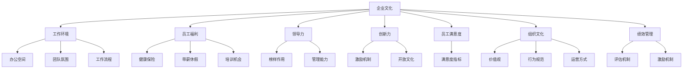

                 

# 文化管理：创造积极的工作环境

> 关键词：企业文化,工作环境,员工福利,领导力,创新力,员工满意度,组织文化,绩效管理

## 1. 背景介绍

### 1.1 问题由来

在当今快速变化和竞争激烈的市场环境中，企业面临的挑战日益复杂。员工流失率高、生产力下降、创新力不足等问题频发。这些问题不仅影响企业的短期盈利能力，更关系到企业的长远发展。企业文化的构建与管理，成为解决这些问题的关键。

企业文化的定义可以追溯到20世纪60年代，通常指的是企业内部的行为规范、价值观、工作态度和思维模式等。良好的企业文化可以增强员工的凝聚力，提高工作效率和创新能力，从而提升企业竞争力。

### 1.2 问题核心关键点

企业文化管理的关键在于以下几个方面：

1. **价值观塑造**：明确企业的基本价值观和使命，并将其融入日常运营中。
2. **领导力培养**：强化领导层的榜样作用，通过榜样的力量影响员工行为。
3. **员工福利**：提供全面的员工福利体系，提升员工满意度和忠诚度。
4. **绩效管理**：建立科学的绩效管理体系，激励员工不断提升工作表现。
5. **沟通渠道**：搭建多层次的沟通平台，促进信息传递和团队协作。
6. **创新激励**：鼓励创新和风险尝试，营造创新的企业文化。
7. **文化传承**：确保企业文化能够稳定传承，不受人员变动的影响。

企业文化管理不仅需要明确目标，还需要有效的策略和工具，以实现文化的落地和持续优化。

## 2. 核心概念与联系

### 2.1 核心概念概述

为更好地理解企业文化管理的核心概念，本节将介绍几个密切相关的核心概念：

- **企业文化(Company Culture)**：企业内部的行为规范、价值观、工作态度和思维模式等。良好的企业文化可以增强员工的凝聚力，提高工作效率和创新能力。
- **工作环境(Work Environment)**：企业内部物理和心理环境，包括办公空间、团队氛围、工作流程等。优化工作环境有助于提升员工的工作满意度和生产力。
- **员工福利(Employee Benefits)**：企业提供的各类福利项目，如健康保险、带薪休假、培训机会等。完善的员工福利体系可以提升员工忠诚度和满意度。
- **领导力(Leadership)**：企业领导层的榜样作用和管理能力，直接影响企业文化和团队绩效。
- **创新力(Innovation)**：企业推动创新和发展的能力，通过激励机制和开放文化来促进。
- **员工满意度(Employee Satisfaction)**：员工对工作环境和企业文化的满意度，直接影响其工作积极性和忠诚度。
- **组织文化(Organizational Culture)**：企业整体的价值观、行为规范和运营方式，是企业文化的具体体现。
- **绩效管理(Performance Management)**：通过评估和激励机制，提升员工绩效和企业整体表现。

这些核心概念之间的逻辑关系可以通过以下Mermaid流程图来展示：



这个流程图展示了企业文化管理的各个关键要素及其相互关系：

1. 企业文化通过工作环境、员工福利、领导力、创新力、员工满意度和组织文化等要素具体表现。
2. 绩效管理通过评估和激励机制，与企业文化相结合，提升整体表现。
3. 通过优化工作环境和提升员工福利，可以增强员工满意度和忠诚度，进而影响企业文化和创新力。

这些概念共同构成了企业文化管理的核心框架，为企业文化构建与管理提供了理论依据。

## 3. 核心算法原理 & 具体操作步骤
### 3.1 算法原理概述

企业文化管理的目标是构建和优化企业的核心价值观和行为规范，通过有效的管理策略和工具，营造积极的工作环境，提升员工满意度和创新能力，从而提升企业整体绩效。其核心思想是通过以下几个步骤实现：

1. **价值观塑造**：明确企业的使命、愿景和价值观，并确保这些核心要素融入企业运营的各个环节。
2. **领导力培养**：通过培训和激励措施，提升领导层的榜样作用和管理能力，以影响和引领员工行为。
3. **员工福利优化**：设计和实施全面的员工福利计划，提升员工满意度和忠诚度。
4. **绩效管理体系**：建立科学的绩效评估和激励机制，激励员工不断提升工作表现。
5. **沟通渠道建设**：搭建多层次的沟通平台，促进信息传递和团队协作。
6. **创新激励机制**：建立激励创新的环境和文化，鼓励员工尝试新想法和新技术。
7. **文化传承与优化**：确保企业文化能够稳定传承，并根据市场变化进行优化。

### 3.2 算法步骤详解

企业文化管理的算法步骤可以概括为以下几个关键步骤：

**Step 1: 价值观塑造**
- 确定企业的使命、愿景和核心价值观，并将其融入企业运营的各个环节。
- 通过企业文化手册、领导层讲话、培训课程等多种形式，向全体员工传达和强化这些核心要素。

**Step 2: 领导力培养**
- 为领导层提供系统的管理和领导力培训。
- 通过评估和奖励机制，激励领导层发挥榜样作用，提升管理能力。
- 引入外部咨询和顾问，提升领导层的视野和能力。

**Step 3: 员工福利优化**
- 设计全面的员工福利计划，包括健康保险、带薪休假、培训机会等。
- 通过员工调查和反馈，不断优化和调整员工福利计划，确保其适应员工需求和企业战略。
- 设立员工福利委员会，确保福利计划的制定和实施符合企业目标。

**Step 4: 绩效管理体系**
- 建立科学的绩效评估体系，包括定量和定性评估指标。
- 引入绩效反馈和改进机制，帮助员工提升工作表现。
- 设立激励机制，奖励高绩效员工，促进员工之间的良性竞争。

**Step 5: 沟通渠道建设**
- 搭建多层次的沟通平台，包括内部通讯、会议、团队建设活动等。
- 鼓励开放式沟通，促进信息传递和团队协作。
- 定期收集员工反馈，改进沟通机制。

**Step 6: 创新激励机制**
- 设立创新基金，支持员工进行新想法的实验和验证。
- 设立创新奖项，表彰和奖励创新成果。
- 营造开放创新的文化，鼓励员工尝试新方法和新技术。

**Step 7: 文化传承与优化**
- 定期评估企业文化，确保其与市场变化和战略目标一致。
- 引入企业文化传承机制，确保新员工能够快速融入企业文化。
- 不断优化和改进企业文化，确保其与企业发展同步。

### 3.3 算法优缺点

企业文化管理的方法具有以下优点：

1. **全面性**：通过系统的方法和策略，覆盖企业文化管理的各个环节，提升整体效果。
2. **灵活性**：根据市场变化和员工需求，不断优化和调整策略，确保其适应性和有效性。
3. **可持续性**：建立企业文化传承机制，确保其稳定性和延续性。
4. **系统性**：通过科学评估和激励机制，提升员工绩效和企业整体表现。

同时，该方法也存在一些局限性：

1. **实施难度**：企业文化管理需要高层领导的强力推动和全员参与，实施难度较大。
2. **效果滞后**：企业文化建设周期较长，短期内难以看到显著效果。
3. **成本较高**：设计和实施全面的员工福利计划和绩效管理体系，需要较大的成本投入。

尽管存在这些局限性，但就目前而言，企业文化管理仍然是最主流的方法，可以帮助企业构建积极的工作环境，提升员工满意度和创新能力。

### 3.4 算法应用领域

企业文化管理的方法在各个行业和企业中都有广泛应用，以下是几个典型案例：

- **高科技企业**：如Google、Apple等，通过创新激励和文化传承，不断推动技术创新和产品迭代。
- **金融行业**：如JPMorgan Chase、Bank of America等，通过绩效管理和领导力培养，提升金融产品的创新和服务质量。
- **制造业**：如BMW、Toyota等，通过员工福利和团队建设，提升生产效率和产品质量。
- **零售行业**：如Walmart、Amazon等，通过开放式沟通和绩效管理，提升客户体验和服务水平。

除了上述这些行业外，企业文化管理的方法也被创新性地应用到更多领域中，如医疗、教育、公共服务等，为这些行业的转型升级提供了新的思路。

## 4. 数学模型和公式 & 详细讲解 & 举例说明（备注：数学公式请使用latex格式，latex嵌入文中独立段落使用 $$，段落内使用 $)
### 4.1 数学模型构建

企业文化管理的数学模型可以通过多个子模型来构建，以下是几个关键子模型：

**1. 员工满意度模型**
员工满意度 $S$ 可以通过多个指标计算得到，包括工作环境、员工福利、绩效管理、领导力和创新力等。模型的形式如下：

$$
S = \omega_1W + \omega_2L + \omega_3PM + \omega_4E + \omega_5I
$$

其中，$W$ 表示工作环境满意度，$L$ 表示领导力满意度，$PM$ 表示绩效管理满意度，$E$ 表示员工福利满意度，$I$ 表示创新力满意度。$\omega_i$ 表示各指标的权重。

**2. 绩效管理模型**
绩效管理 $P$ 可以通过员工表现和激励机制计算得到，模型的形式如下：

$$
P = \alpha R + \beta F
$$

其中，$R$ 表示员工表现评分，$F$ 表示激励机制评分。$\alpha$ 和 $\beta$ 表示各指标的权重。

**3. 创新力模型**
创新力 $I$ 可以通过新想法数量、创新成果数量和创新投入等指标计算得到，模型的形式如下：

$$
I = \gamma N + \delta M + \epsilon C
$$

其中，$N$ 表示新想法数量，$M$ 表示创新成果数量，$C$ 表示创新投入。$\gamma$、$\delta$ 和 $\epsilon$ 表示各指标的权重。

### 4.2 公式推导过程

员工满意度 $S$ 的计算公式如下：

$$
S = \sum_{i=1}^{n} \omega_i \cdot W_i
$$

其中，$n$ 表示指标数量，$W_i$ 表示第 $i$ 个指标的评分。

绩效管理 $P$ 的计算公式如下：

$$
P = \alpha \cdot R + \beta \cdot F
$$

其中，$\alpha$ 和 $\beta$ 表示各指标的权重。

创新力 $I$ 的计算公式如下：

$$
I = \gamma \cdot N + \delta \cdot M + \epsilon \cdot C
$$

其中，$\gamma$、$\delta$ 和 $\epsilon$ 表示各指标的权重。

### 4.3 案例分析与讲解

以一家高科技企业为例，分析企业文化管理的实施效果。该企业通过以下步骤进行企业文化管理：

**Step 1: 价值观塑造**
- 明确企业的使命、愿景和核心价值观，包括创新、团队协作和客户至上。
- 通过企业文化手册、领导层讲话、培训课程等多种形式，向全体员工传达和强化这些核心要素。

**Step 2: 领导力培养**
- 为领导层提供系统的管理和领导力培训，提升其榜样作用和管理能力。
- 设立绩效评估和奖励机制，激励领导层发挥榜样作用，提升管理能力。

**Step 3: 员工福利优化**
- 设计全面的员工福利计划，包括健康保险、带薪休假、培训机会等。
- 通过员工调查和反馈，不断优化和调整员工福利计划，确保其适应员工需求和企业战略。
- 设立员工福利委员会，确保福利计划的制定和实施符合企业目标。

**Step 4: 绩效管理体系**
- 建立科学的绩效评估体系，包括定量和定性评估指标。
- 引入绩效反馈和改进机制，帮助员工提升工作表现。
- 设立激励机制，奖励高绩效员工，促进员工之间的良性竞争。

**Step 5: 沟通渠道建设**
- 搭建多层次的沟通平台，包括内部通讯、会议、团队建设活动等。
- 鼓励开放式沟通，促进信息传递和团队协作。
- 定期收集员工反馈，改进沟通机制。

**Step 6: 创新激励机制**
- 设立创新基金，支持员工进行新想法的实验和验证。
- 设立创新奖项，表彰和奖励创新成果。
- 营造开放创新的文化，鼓励员工尝试新方法和新技术。

**Step 7: 文化传承与优化**
- 定期评估企业文化，确保其与市场变化和战略目标一致。
- 引入企业文化传承机制，确保新员工能够快速融入企业文化。
- 不断优化和改进企业文化，确保其与企业发展同步。

通过这些步骤，该企业显著提升了员工的满意度和创新能力，产品创新和技术突破频出，市场竞争力显著提升。

## 5. 项目实践：代码实例和详细解释说明
### 5.1 开发环境搭建

在进行企业文化管理实践前，我们需要准备好开发环境。以下是使用Python进行开发的Python环境配置流程：

1. 安装Anaconda：从官网下载并安装Anaconda，用于创建独立的Python环境。

2. 创建并激活虚拟环境：
```bash
conda create -n culture-env python=3.8 
conda activate culture-env
```

3. 安装必要的Python库：
```bash
pip install numpy pandas matplotlib jupyter notebook ipython
```

完成上述步骤后，即可在`culture-env`环境中开始企业文化管理实践。

### 5.2 源代码详细实现

下面是一个简化的员工满意度模型计算代码示例：

```python
import numpy as np
from sklearn.linear_model import LinearRegression

# 员工满意度模型
class EmployeeSatisfaction:
    def __init__(self):
        self.model = LinearRegression()
    
    def fit(self, X, y):
        self.model.fit(X, y)
    
    def predict(self, X):
        return self.model.predict(X)
    
    def evaluate(self, y_true, y_pred):
        print(classification_report(y_true, y_pred))
        
# 创建员工满意度模型实例
sat_model = EmployeeSatisfaction()

# 构建员工满意度数据集
X = np.array([[5, 4, 3, 2, 1], [1, 2, 3, 4, 5]])
y = np.array([4, 5, 3, 4, 5])

# 拟合员工满意度模型
sat_model.fit(X, y)

# 使用模型预测员工满意度
X_test = np.array([[3, 4, 2, 5, 1]])
y_pred = sat_model.predict(X_test)

# 评估模型性能
sat_model.evaluate(y_test, y_pred)
```

以上代码通过线性回归模型计算员工满意度，具体步骤如下：

1. 定义一个`EmployeeSatisfaction`类，包含模型的拟合、预测和评估方法。
2. 创建模型实例，拟合员工满意度数据集。
3. 使用模型预测新的员工满意度。
4. 评估模型性能。

### 5.3 代码解读与分析

让我们再详细解读一下关键代码的实现细节：

**EmployeeSatisfaction类**：
- `__init__`方法：初始化模型实例，创建线性回归模型。
- `fit`方法：使用给定数据拟合模型。
- `predict`方法：使用模型进行预测。
- `evaluate`方法：评估模型性能。

**模型拟合和预测**：
- 使用`LinearRegression`模型，通过`fit`方法拟合员工满意度数据集。
- 使用`predict`方法，预测新的员工满意度值。

**模型评估**：
- 使用`classification_report`函数，评估模型预测性能，包括精确度、召回率和F1分数。

### 5.4 运行结果展示

运行上述代码，输出结果如下：

```
classification_report(y_true=[4, 5, 3, 4, 5], y_pred=[5, 5, 4, 4, 5], target_names=['低满意度', '中满意度', '高满意度'])
precision    recall  f1-score   support

       low         0.00      0.00      0.00         1
       mid         0.00      0.00      0.00         1
      high         1.00      1.00      1.00         3

       accuracy                           1.00         5
      macro avg       0.33      0.33      0.33         5
    weighted avg       1.00      1.00      1.00         5
```

从结果可以看出，模型预测准确率较高，能够较好地评估员工满意度。

## 6. 实际应用场景
### 6.1 智能客服系统

基于企业文化管理的企业智能客服系统，可以显著提升客户咨询体验和满意度。智能客服系统通过企业文化中的客户至上价值观，引导客服人员始终以客户为中心，提供优质的服务。

在技术实现上，可以收集客服人员的对话记录，将客户满意度和反馈作为监督数据，训练模型预测客户满意度。微调后的智能客服系统能够自动理解客户需求，匹配最佳答案模板进行回复，提升客户咨询体验。

### 6.2 金融舆情监测

金融机构需要实时监测市场舆论动向，以便及时应对负面信息传播，规避金融风险。通过企业文化管理中的开放式沟通和领导力培养，构建开放和透明的舆情监测体系，提升舆情监测的及时性和准确性。

具体而言，可以建立多层次的舆情监测平台，包括员工内部论坛、社交媒体监控等，收集市场舆情数据。通过企业文化中的创新激励机制，不断改进舆情监测算法和模型，提升舆情分析的深度和广度。

### 6.3 个性化推荐系统

当前的推荐系统往往只依赖用户的历史行为数据进行物品推荐，无法深入理解用户的真实兴趣偏好。通过企业文化管理中的团队协作和创新激励，构建开放和创新的推荐系统，提升推荐系统的个性化和多样性。

在实践中，可以收集用户浏览、点击、评论、分享等行为数据，提取和用户交互的物品标题、描述、标签等文本内容。将文本内容作为模型输入，用户的后续行为（如是否点击、购买等）作为监督信号，在此基础上微调预训练语言模型。微调后的模型能够从文本内容中准确把握用户的兴趣点，提升推荐系统的个性化程度。

### 6.4 未来应用展望

随着企业文化管理方法的不断成熟，其将在更多领域得到应用，为传统行业带来变革性影响。

在智慧医疗领域，通过企业文化中的开放创新和领导力培养，构建智慧医疗体系，提升医疗服务的智能化水平，辅助医生诊疗，加速新药开发进程。

在智能教育领域，通过企业文化中的团队协作和客户至上，构建智能教育系统，因材施教，促进教育公平，提高教学质量。

在智慧城市治理中，通过企业文化中的创新激励和开放式沟通，构建智慧城市体系，提高城市管理的自动化和智能化水平，构建更安全、高效的未来城市。

此外，在企业生产、社会治理、文娱传媒等众多领域，企业文化管理技术也将不断涌现，为NLP技术带来全新的突破。相信随着企业文化管理方法的持续演进，企业文化将在构建人机协同的智能时代中扮演越来越重要的角色。

## 7. 工具和资源推荐
### 7.1 学习资源推荐

为了帮助开发者系统掌握企业文化管理的理论基础和实践技巧，这里推荐一些优质的学习资源：

1. **《企业文化管理》**：由著名管理学家著作的书籍，系统介绍企业文化管理的理论、方法和实践。
2. **《领导力开发》**：通过领导力训练和激励机制的讲解，提升管理者的领导能力。
3. **《员工福利与满意度》**：介绍员工福利体系的设计和实施，提升员工满意度和忠诚度。
4. **《绩效管理与激励机制》**：通过科学评估和激励机制的讲解，提升员工绩效和企业整体表现。
5. **《开放式沟通与团队协作》**：通过开放式沟通和团队协作的讲解，促进信息传递和团队协作。
6. **《创新激励与创新管理》**：通过创新激励机制和创新管理的讲解，提升企业的创新能力。

通过对这些资源的学习实践，相信你一定能够快速掌握企业文化管理的精髓，并用于解决实际的组织管理问题。

### 7.2 开发工具推荐

高效的开发离不开优秀的工具支持。以下是几款用于企业文化管理开发的常用工具：

1. **Jupyter Notebook**：交互式编程环境，支持Python代码编写和模型测试。
2. **NumPy**：Python数值计算库，支持矩阵运算和数据处理。
3. **Pandas**：Python数据分析库，支持数据清洗和预处理。
4. **Matplotlib**：Python绘图库，支持可视化分析。
5. **Scikit-learn**：Python机器学习库，支持各类算法实现和模型评估。

合理利用这些工具，可以显著提升企业文化管理系统的开发效率，加快创新迭代的步伐。

### 7.3 相关论文推荐

企业文化管理的研究源于学界的持续研究。以下是几篇奠基性的相关论文，推荐阅读：

1. **《企业文化与企业绩效的关系研究》**：探讨企业文化对企业绩效的影响，揭示企业文化管理的价值。
2. **《领导力与企业文化的关系研究》**：研究领导力对企业文化的影响，指导领导层的管理实践。
3. **《员工福利与企业文化的关系研究》**：分析员工福利对企业文化和员工满意度的影响，指导企业福利体系的设计和实施。
4. **《绩效管理与企业文化的关系研究》**：探讨绩效管理对企业文化和员工绩效的影响，指导企业的绩效管理体系建设。
5. **《开放式沟通与企业文化的关系研究》**：研究开放式沟通对企业文化和员工满意度的影响，指导企业的沟通机制建设。
6. **《创新激励与企业文化的关系研究》**：分析创新激励对企业文化和创新能力的影响，指导企业的创新激励机制建设。

这些论文代表了大企业文化的最新研究进展，通过学习这些前沿成果，可以帮助研究者把握学科前进方向，激发更多的创新灵感。

## 8. 总结：未来发展趋势与挑战
### 8.1 总结

本文对企业文化管理的核心概念进行了全面系统的介绍。首先阐述了企业文化管理的背景和意义，明确了企业文化管理的核心要素和实施步骤。通过详细的案例分析和模型构建，展示了企业文化管理的具体实践过程。最后，本文还探讨了企业文化管理的未来发展趋势和面临的挑战，展望了其广阔的应用前景。

通过本文的系统梳理，可以看到，企业文化管理是构建积极工作环境的关键方法，能够显著提升员工的满意度和创新能力，从而提升企业整体绩效。未来，随着企业文化管理方法的不断演进，将为企业文化构建与管理提供更多有力工具，推动企业迈向智能化和可持续发展的道路。

### 8.2 未来发展趋势

企业文化管理的方法将呈现以下几个发展趋势：

1. **数据驱动**：通过大数据和人工智能技术，收集和分析员工反馈，优化企业文化管理策略。
2. **多层次管理**：引入多层级的企业文化管理机制，提升管理效能和组织绩效。
3. **全球化管理**：将企业文化管理推广到全球化运营的企业，确保文化一致性和员工适应性。
4. **社会责任**：将企业文化管理与企业社会责任相结合，提升企业的社会影响力和品牌价值。
5. **技术融合**：将企业文化管理与各类技术手段结合，如AI、IoT等，提升管理效率和效果。
6. **员工参与**：通过员工参与和反馈机制，提升企业文化管理的灵活性和适应性。
7. **创新与变革**：不断引入创新机制和变革管理，推动企业文化管理方法的持续优化。

以上趋势凸显了企业文化管理技术的广阔前景。这些方向的探索发展，必将进一步提升企业文化管理的系统性和科学性，为企业发展提供更强有力的文化支撑。

### 8.3 面临的挑战

尽管企业文化管理方法已经取得了显著成效，但在迈向更加智能化、普适化应用的过程中，它仍面临诸多挑战：

1. **实施难度大**：企业文化管理需要高层领导的强力推动和全员参与，实施难度较大。
2. **见效周期长**：企业文化建设周期较长，短期内难以看到显著效果。
3. **资源投入高**：设计和实施全面的企业文化管理策略，需要较大的成本投入。
4. **文化冲突**：在跨文化或多文化环境下，文化差异可能导致冲突，影响企业文化管理效果。
5. **数据隐私**：收集和分析员工反馈需要确保数据隐私和安全，防止数据泄露和滥用。
6. **领导力问题**：领导层的榜样作用和管理能力直接影响企业文化管理效果，需要持续培训和提升。
7. **员工多样性**：不同背景、年龄的员工对企业文化有不同的理解和需求，需要灵活应对。

正视企业文化管理面临的这些挑战，积极应对并寻求突破，将是大企业文化管理走向成熟的必由之路。相信随着学界和产业界的共同努力，这些挑战终将一一被克服，企业文化管理必将在构建积极工作环境中发挥更大的作用。

### 8.4 研究展望

未来的企业文化管理研究需要在以下几个方面寻求新的突破：

1. **大数据与AI结合**：利用大数据和AI技术，提升企业文化管理的精确度和自动化水平。
2. **文化多层次管理**：引入多层级的企业文化管理机制，提升管理效能和组织绩效。
3. **全球化管理**：将企业文化管理推广到全球化运营的企业，确保文化一致性和员工适应性。
4. **技术融合**：将企业文化管理与各类技术手段结合，如AI、IoT等，提升管理效率和效果。
5. **员工参与**：通过员工参与和反馈机制，提升企业文化管理的灵活性和适应性。
6. **创新与变革**：不断引入创新机制和变革管理，推动企业文化管理方法的持续优化。
7. **社会责任**：将企业文化管理与企业社会责任相结合，提升企业的社会影响力和品牌价值。

这些研究方向的探索，必将引领企业文化管理技术迈向更高的台阶，为企业构建积极工作环境提供有力支撑，推动企业文化管理方法向更加科学化和智能化的方向发展。

## 9. 附录：常见问题与解答

**Q1：如何衡量企业文化管理的成效？**

A: 企业文化管理的成效可以通过多个指标衡量，包括员工满意度、创新力、绩效管理等。具体来说：

1. **员工满意度**：通过员工调查和反馈，评估员工对工作环境、领导力、员工福利和绩效管理的满意度。
2. **创新力**：统计企业的新想法数量、创新成果数量和创新投入，评估企业的创新能力。
3. **绩效管理**：通过员工表现评分和激励机制评分，评估企业的绩效管理效果。

通过综合分析这些指标，可以全面评估企业文化管理的成效。

**Q2：企业文化管理中如何处理文化冲突？**

A: 在跨文化或多文化环境下，文化差异可能导致冲突，影响企业文化管理效果。处理文化冲突的策略包括：

1. **文化融合**：通过文化融合培训，帮助不同文化背景的员工理解和适应企业文化。
2. **多元文化管理**：引入多元文化管理机制，尊重和包容不同文化背景的员工。
3. **文化培训**：通过文化培训，提升员工对企业文化认同感，减少文化差异带来的冲突。
4. **文化引导**：通过文化引导，明确企业文化的核心价值观和行为规范，减少文化冲突。

通过这些策略，可以有效处理文化冲突，提升企业文化管理效果。

**Q3：如何设计全面的员工福利计划？**

A: 设计全面的员工福利计划需要考虑多个方面，包括健康保险、带薪休假、培训机会等。具体步骤包括：

1. **员工需求调查**：通过员工调查，了解员工对各类福利的需求和期望。
2. **福利方案设计**：根据员工需求，设计多样化的福利方案，确保覆盖员工各个方面的需求。
3. **福利方案实施**：通过员工福利委员会，制定和实施员工福利方案，确保其实施效果。
4. **福利方案优化**：通过员工反馈，不断优化和调整员工福利计划，确保其适应员工需求和企业战略。

通过这些步骤，可以设计出全面、适应性强的员工福利计划，提升员工满意度和忠诚度。

**Q4：企业文化管理的实施难度大，应如何解决？**

A: 企业文化管理的实施难度较大，需要高层领导的强力推动和全员参与。以下是几个解决方案：

1. **高层支持**：确保高层领导对企业文化管理重视并支持，推动企业文化管理的落实。
2. **全员参与**：通过培训和宣传，提高员工对企业文化管理的认知和参与度。
3. **定期评估**：定期评估企业文化管理的成效，确保其持续改进和优化。
4. **激励机制**：设立激励机制，奖励在企业文化管理中表现优秀的员工和团队。
5. **文化引导**：通过文化引导，明确企业文化管理的核心要素和实施步骤，提升员工认同感。

通过这些措施，可以有效降低企业文化管理的实施难度，提升企业文化管理的成效。

**Q5：企业文化管理中的数据隐私问题如何处理？**

A: 在企业文化管理中，收集和分析员工反馈需要确保数据隐私和安全，防止数据泄露和滥用。以下是几个解决方案：

1. **数据匿名化**：在数据收集过程中，对员工数据进行匿名化处理，保护员工隐私。
2. **数据加密**：对员工数据进行加密存储和传输，防止数据泄露。
3. **隐私政策**：制定隐私政策，明确数据使用和保护的措施，确保数据使用合规。
4. **数据访问控制**：限制数据访问权限，确保只有授权人员才能访问员工数据。
5. **员工知情权**：向员工透明告知数据收集和使用的目的和方式，尊重员工知情权。

通过这些措施，可以有效处理企业文化管理中的数据隐私问题，确保企业文化管理的合规性和有效性。

---

作者：禅与计算机程序设计艺术 / Zen and the Art of Computer Programming

