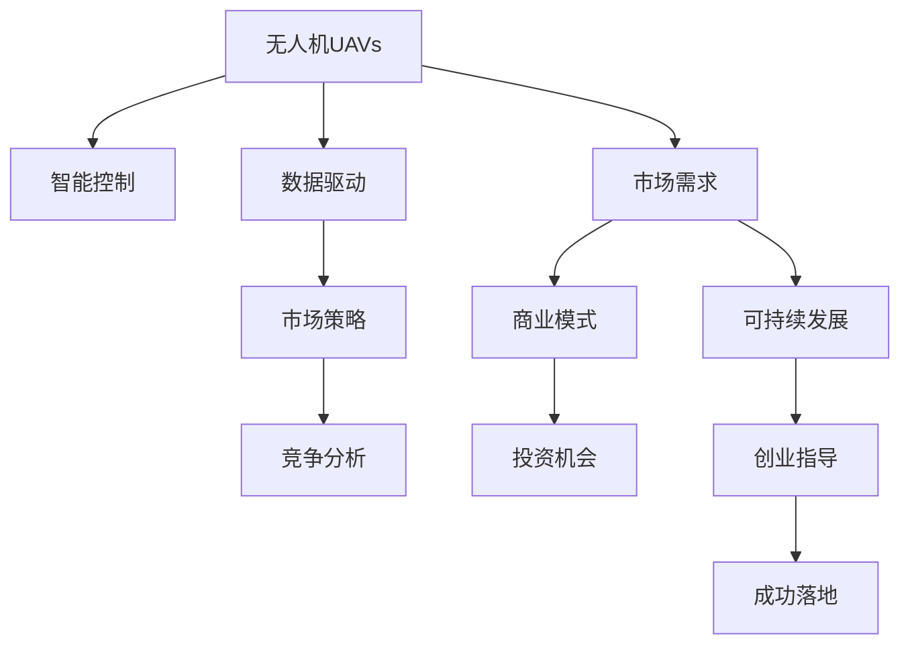

                 

# 无人机创业：空中视角的商业应用

> 关键词：无人机,商业应用,智能控制,数据驱动,市场策略,竞争分析,可持续发展,投资机会,创业指导

## 1. 背景介绍

### 1.1 问题由来
近年来，随着科技的飞速发展，无人机（Unmanned Aerial Vehicles, UAVs）已成为全球科技和商业领域的热点话题。无人机技术在航拍、物流、农业、环境保护等多个领域展现出巨大潜力，吸引了无数创业者和投资者。然而，想要在无人机领域取得成功并非易事，不仅需要深厚的技术积累，还需要精准的市场定位和丰富的运营经验。本文旨在从空中视角，探讨无人机创业的商业应用、挑战与未来发展趋势，希望能为有意进入该领域的创业者提供有价值的参考。

### 1.2 问题核心关键点
无人机创业涉及的商业应用广泛，但核心关键点包括：

1. **技术可行性**：保证无人机具备高可靠性、稳定性与智能控制能力。
2. **市场需求**：明确无人机服务的市场需求，并确定目标用户群体。
3. **商业模式**：选择合适的盈利模式，如按服务收费、租赁、订阅等。
4. **数据驱动**：利用数据分析优化无人机性能和服务质量。
5. **市场策略**：制定有效市场推广和品牌营销策略。
6. **可持续发展**：考虑环境与资源利用效率，促进企业的绿色发展。
7. **竞争分析**：分析竞争对手的优劣势，制定差异化竞争策略。
8. **投资机会**：识别和把握投资热点，吸引风险投资。
9. **创业指导**：提供全面的创业指导，帮助创业者成功落地。

## 2. 核心概念与联系

### 2.1 核心概念概述

为更好地理解无人机创业的商业应用，本节将介绍几个核心概念：

- **无人机（UAVs）**：具备自主飞行和控制能力的航空器，广泛应用于航拍、物流、农业、环境监测等领域。
- **智能控制**：通过自动化和智能算法，实现无人机的自主飞行、避障等功能。
- **数据驱动**：基于数据分析和机器学习，优化无人机系统性能和服务质量。
- **市场需求**：根据用户需求设计无人机服务，并不断优化以满足市场需求。
- **商业模式**：选择适合的市场盈利模式，确保商业可持续性。
- **市场策略**：制定有效的市场推广和品牌营销策略，拓展市场份额。
- **可持续发展**：考虑环境与资源利用效率，促进企业的绿色发展。
- **竞争分析**：分析竞争对手的市场策略和技术优势，制定差异化竞争策略。
- **投资机会**：识别和把握投资热点，吸引风险投资。
- **创业指导**：提供全面的创业指导，帮助创业者成功落地。

这些核心概念之间的逻辑关系可以通过以下Mermaid流程图来展示：



这个流程图展示了大无人机创业过程中涉及的关键概念及其之间的关系：

1. 无人机通过智能控制和数据驱动实现飞行和任务执行。
2. 根据市场需求设计商业模型和市场策略，确定盈利方式。
3. 通过竞争分析确定差异化策略，把握投资机会。
4. 可持续发展和创业指导帮助企业成功落地，实现商业价值。

## 3. 核心算法原理 & 具体操作步骤

### 3.1 算法原理概述

无人机创业的商业应用涉及多种算法和技术的综合应用，核心算法原理主要包括以下几个方面：

1. **路径规划算法**：用于无人机在空中进行自动导航和避障。
2. **智能控制算法**：包括姿态控制、飞行稳定性等，确保无人机安全飞行。
3. **数据分析算法**：利用机器学习和数据挖掘技术，优化无人机性能和服务质量。
4. **图像识别与处理算法**：在农业、环境监测等领域应用，进行图像识别和分析。

这些算法和技术的综合应用，是无人机实现商业价值的重要基础。

### 3.2 算法步骤详解

基于无人机创业的商业应用，具体的算法步骤可以分为以下几个方面：

1. **需求分析与目标确定**：
   - 明确目标用户群体，了解用户需求。
   - 分析市场需求，确定无人机的服务内容。

2. **技术方案设计**：
   - 设计无人机硬件和软件架构，确保高可靠性和智能控制。
   - 选择合适的路径规划算法和智能控制算法。

3. **算法开发与测试**：
   - 根据设计方案开发算法，并进行充分的测试和优化。
   - 确保算法在各种场景下都能稳定运行，避免错误。

4. **数据分析与优化**：
   - 利用数据挖掘和机器学习技术，优化无人机性能。
   - 分析飞行数据和用户反馈，持续改进无人机系统。

5. **市场推广与品牌建设**：
   - 制定有效的市场推广策略，提升品牌知名度。
   - 通过广告、公关等方式，吸引用户关注和信任。

6. **竞争分析与策略制定**：
   - 分析竞争对手的优势和劣势。
   - 制定差异化竞争策略，抢占市场先机。

7. **投资评估与融资策略**：
   - 评估投资机会，吸引风险投资。
   - 制定融资策略，确保企业有足够的资金支持。

8. **创业指导与落地实施**：
   - 提供全面的创业指导，帮助创业者成功落地。
   - 优化商业计划书，提高融资成功率。

### 3.3 算法优缺点

无人机创业涉及的算法和技术的综合应用，具有以下优点和缺点：

**优点**：
1. **高效自动化**：无人机通过智能控制和路径规划算法，实现高效自动化的空中作业。
2. **数据驱动**：利用数据分析技术，不断优化无人机性能和服务质量，提升用户体验。
3. **市场适应性强**：根据市场需求设计商业模型，灵活适应不同市场环境。

**缺点**：
1. **技术复杂度高**：无人机硬件和软件系统复杂，开发和维护成本高。
2. **数据隐私和安全问题**：无人机采集和处理大量数据，涉及数据隐私和安全问题。
3. **法规和政策风险**：无人机飞行需要遵守相关法规和政策，风险较大。

### 3.4 算法应用领域

基于无人机的商业应用，主要涉及以下几个领域：

1. **物流与配送**：利用无人机进行货物运输和配送，减少人力成本，提升物流效率。
2. **农业**：在农业领域进行病虫害防治、农情监测、精准施肥等。
3. **环境监测**：用于森林防火、环境污染监测、地形测绘等。
4. **航拍与摄影**：提供航拍服务，应用于影视制作、广告宣传、安防监控等。
5. **搜索与救援**：在紧急情况下进行人员搜救，提供实时数据支持。
6. **地产测绘**：进行高空测绘和地籍调查，提供高精度的地理信息。
7. **智慧城市**：应用于智慧城市建设，如监控、紧急响应等。

这些应用领域展示了无人机技术的广阔前景，为无人机创业提供了丰富的市场机会。

## 4. 数学模型和公式 & 详细讲解 & 举例说明

### 4.1 数学模型构建

无人机创业涉及的数学模型主要包括以下几个方面：

1. **路径规划模型**：用于无人机在三维空间中的自动导航。
2. **飞行稳定性模型**：确保无人机在飞行过程中保持稳定。
3. **数据驱动模型**：利用机器学习和数据挖掘技术，优化无人机系统。

### 4.2 公式推导过程

以路径规划算法为例，其基本原理是通过构建数学模型，计算最优路径。公式推导如下：

1. **路径规划模型**：
   - 假设无人机在三维空间中的位置为 $(x,y,z)$，目标位置为 $(x',y',z')$。
   - 利用A*搜索算法，计算从起始点到目标点的最优路径。

2. **飞行稳定性模型**：
   - 假设无人机姿态为 $(\phi,\theta,\psi)$，需要满足：
   - $$ \ddot{\phi} = k_1(\phi - \phi_0) + \dot{\theta} - \omega \sin(\phi - \phi_0) + \tau_1 $$
   - $$ \ddot{\theta} = k_2(\theta - \theta_0) + \dot{\phi} \cos(\phi - \phi_0) + \tau_2 $$
   - $$ \ddot{\psi} = k_3(\psi - \psi_0) + \tau_3 $$

其中，$k_1, k_2, k_3$ 为控制参数，$\phi_0, \theta_0, \psi_0$ 为初始姿态，$\tau_1, \tau_2, \tau_3$ 为控制力矩。

### 4.3 案例分析与讲解

以农业无人机为例，进行数据分析和优化：

1. **数据收集与处理**：
   - 收集无人机在农田中的飞行数据，包括位置、速度、姿态等。
   - 对数据进行处理，去除异常值，确保数据准确性。

2. **数据分析**：
   - 利用统计分析，识别影响飞行效率的关键因素。
   - 使用机器学习模型，预测飞行路径和能源消耗。

3. **优化算法**：
   - 设计优化算法，如遗传算法、粒子群优化，优化飞行路径和参数设置。
   - 通过实际飞行测试，验证算法的有效性。

4. **结果展示**：
   - 展示优化前后的飞行效率对比，提升用户体验。
   - 提供数据分析报告，为进一步改进提供依据。

## 5. 项目实践：代码实例和详细解释说明

### 5.1 开发环境搭建

在进行无人机创业的商业应用开发前，需要先搭建好开发环境。以下是使用Python进行无人机的开发环境配置流程：

1. **安装Python**：从官网下载并安装最新版本的Python，确保环境稳定。

2. **安装必要的库**：
   - 安装PIL（Python Imaging Library），用于图像处理。
   - 安装OpenCV，用于计算机视觉。
   - 安装NumPy、SciPy等科学计算库。
   - 安装PySerial，用于串口通信。
   - 安装GCS（Ground Control System）库，用于地面控制站开发。

3. **配置硬件设备**：
   - 确保计算机具备足够的计算资源，支持多线程和多进程。
   - 配置无人机硬件设备，如飞行控制器、电机、遥控器等。

4. **连接GCS与无人机**：
   - 通过串口或Wi-Fi连接地面控制站与无人机。
   - 配置地面控制站界面，支持飞行参数设置、路径规划等功能。

### 5.2 源代码详细实现

这里我们以无人机的路径规划算法为例，展示Python代码的实现：

```python
import math
import numpy as np

class AStarPathPlanner:
    def __init__(self, start, goal, obstacles):
        self.start = start
        self.goal = goal
        self.obstacles = obstacles
        self.open_set = []
        self.closed_set = []

    def heuristic(self, node):
        return math.sqrt((node[0] - self.goal[0]) ** 2 + (node[1] - self.goal[1]) ** 2)

    def astar(self):
        self.open_set.append(self.start)
        while self.open_set:
            current = min(self.open_set, key=self.heuristic)
            if current == self.goal:
                return self.get_path(current)
            self.open_set.remove(current)
            self.closed_set.append(current)
            for neighbor in self.get_neighbors(current):
                if neighbor not in self.closed_set:
                    g = self.get_cost(current, neighbor)
                    if neighbor not in self.open_set or g < self.get_cost(self.open_set[0], neighbor):
                        self.open_set.append(neighbor)
        return None

    def get_neighbors(self, node):
        neighbors = []
        for dx, dy in [(-1, 0), (1, 0), (0, -1), (0, 1)]:
            x, y = node[0] + dx, node[1] + dy
            if 0 <= x < len(self.obstacles) and 0 <= y < len(self.obstacles[0]):
                if self.obstacles[x][y] == 0:
                    neighbors.append((x, y))
        return neighbors

    def get_cost(self, node1, node2):
        return math.sqrt((node2[0] - node1[0]) ** 2 + (node2[1] - node1[1]) ** 2)

    def get_path(self, end):
        path = [end]
        current = end
        while current != self.start:
            for neighbor in self.get_neighbors(current):
                if neighbor == self.start:
                    path.insert(0, self.start)
                    break
            current = path[-2]
        return path
```

### 5.3 代码解读与分析

这里我们对路径规划算法的代码进行详细解读：

1. **初始化**：
   - 设置起点和终点。
   - 定义障碍物，初始化开放集和封闭集。

2. **启发式函数**：
   - 利用曼哈顿距离作为启发式函数，计算每个节点的优先级。

3. **A*搜索算法**：
   - 遍历开放集，选取优先级最低的节点作为当前节点。
   - 如果当前节点是终点，返回路径。
   - 否则，将当前节点从开放集移除，添加到封闭集中。
   - 遍历当前节点的邻居，更新邻居节点的g值（当前节点到邻居节点的距离）。
   - 如果邻居节点不在开放集中或者新的g值小于已有值，更新开放集。

4. **获取路径**：
   - 从终点节点逆推到起点，构建路径。

5. **结果展示**：
   - 在地面控制站界面上显示路径。

## 6. 实际应用场景

### 6.1 物流与配送

无人机在物流与配送领域具有广阔的应用前景。通过无人机进行货物运输，可以大幅提升物流效率，降低人力成本。在物流配送场景中，无人机可以实现点对点的快速运输，尤其在紧急情况下，能够迅速响应需求，确保货物的及时送达。此外，无人机还可以应用于城市配送，提升配送效率，减少交通拥堵。

### 6.2 农业

在农业领域，无人机可以通过搭载高清摄像头和传感器，进行农田监测和病虫害防治。通过高精度的图像识别技术，无人机可以自动检测和分析农田的病虫害情况，并及时采取措施进行防治。同时，无人机还可以进行精准施肥和喷洒农药，提升农业生产效率和质量。

### 6.3 环境监测

无人机在环境监测领域也有广泛应用。通过无人机搭载传感器和摄像设备，可以实时监测森林火灾、河流污染、荒漠化等情况，提供准确的数据支持。例如，在森林火灾监测中，无人机可以通过热成像技术，快速定位火源，及时发出警报。

### 6.4 未来应用展望

未来，无人机将在更多领域展现出广泛的应用前景。例如，在医疗领域，无人机可以用于医疗物资运输、远程医疗诊断等。在教育领域，无人机可以用于远程教学、教育资源配送等。在紧急救援领域，无人机可以用于灾害预警、人员搜救等。随着技术的不断进步，无人机的应用将更加广泛，带来更多的商业机会和社会价值。

## 7. 工具和资源推荐

### 7.1 学习资源推荐

为了帮助开发者系统掌握无人机创业的理论基础和实践技巧，这里推荐一些优质的学习资源：

1. **《无人机飞行控制系统设计与实现》**：介绍无人机的飞行控制算法和系统设计，适合入门学习。
2. **《机器人系统基础》**：由斯坦福大学开设的机器人课程，涵盖无人机控制系统、传感器融合等。
3. **《机器人视觉与控制》**：利用机器学习技术进行无人机视觉识别和控制，适合深入研究。
4. **《无人机应用开发手册》**：详细介绍了无人机的硬件和软件开发，适合实战操作。
5. **《无人驾驶技术与安全》**：涵盖无人机飞行控制、安全保障等方面的内容，适合高级开发人员。

### 7.2 开发工具推荐

高效的开发离不开优秀的工具支持。以下是几款用于无人机开发常用的工具：

1. **QGroundControl**：地面控制站软件，支持飞行器的飞行控制和参数设置。
2. **ROS（Robot Operating System）**：用于无人机的开源机器人操作系统，支持模块化开发。
3. **PX4**：开源飞行控制软件，支持多平台飞行器。
4. **OpenCV**：计算机视觉库，用于图像处理和目标识别。
5. **Gazebo**：模拟环境，用于无人机的飞行仿真测试。

### 7.3 相关论文推荐

无人机创业涉及的数学模型和算法开发，需参考以下论文：

1. **《基于路径规划的无人机自主飞行控制》**：介绍了无人机的路径规划算法和飞行控制策略。
2. **《无人机环境感知与避障技术》**：详细介绍了无人机的环境感知和避障技术，确保安全飞行。
3. **《无人机自动飞行路径规划算法》**：研究了无人机的自动路径规划算法，优化飞行效率。
4. **《基于机器学习的无人机目标识别》**：利用机器学习技术进行无人机目标识别和分类，提高飞行精度。
5. **《无人机数据驱动的飞行控制与优化》**：研究了无人机数据驱动的飞行控制策略，提升系统性能。

## 8. 总结：未来发展趋势与挑战

### 8.1 研究成果总结

无人机创业涉及的商业应用具有广泛的应用前景，但也需要面对诸多挑战。通过技术创新和市场策略的优化，能够克服这些挑战，实现商业价值。

### 8.2 未来发展趋势

无人机创业的未来发展趋势主要包括以下几个方面：

1. **技术进步**：随着计算机视觉、机器学习等技术的不断进步，无人机的性能将不断提升。
2. **市场扩展**：无人机将进一步扩展到更多领域，如医疗、教育、紧急救援等。
3. **法规规范**：无人机法规规范逐步完善，确保安全飞行。
4. **成本降低**：技术成熟度提升，生产成本下降，增强市场竞争力。
5. **应用场景丰富**：无人机将在更多场景中发挥作用，推动行业发展。

### 8.3 面临的挑战

无人机创业面临的挑战主要包括：

1. **技术复杂度高**：无人机的硬件和软件系统复杂，开发和维护成本高。
2. **数据隐私和安全问题**：无人机采集和处理大量数据，涉及数据隐私和安全问题。
3. **法规和政策风险**：无人机飞行需要遵守相关法规和政策，风险较大。
4. **市场竞争激烈**：无人机市场竞争激烈，需不断创新以保持竞争力。
5. **资金投入高**：无人机研发和生产需要大量资金投入，需有效管理。

### 8.4 研究展望

未来的研究应在以下几个方面进行探索：

1. **技术优化**：进一步优化无人机飞行控制算法，提升飞行效率和安全性。
2. **数据安全**：加强数据隐私保护，确保用户数据安全。
3. **法规建设**：积极参与无人机法规建设，制定标准规范。
4. **市场推广**：制定有效的市场推广策略，提升品牌知名度。
5. **可持续发展**：推动绿色环保发展，实现可持续发展。

## 9. 附录：常见问题与解答

**Q1：无人机在物流配送中的应用如何提升效率？**

A: 无人机在物流配送中的应用主要通过以下几个方面提升效率：
1. **快速响应**：无人机可以在数分钟内完成货物运输，缩短运输时间。
2. **灵活调度**：无人机能够按照用户需求进行灵活调度，提高物流配送的响应速度。
3. **减少人力成本**：无人机的自动化操作降低了人力成本，提高了运营效率。
4. **降低运输成本**：无人机在空中飞行，避免了地面交通的拥堵，降低了运输成本。
5. **数据驱动优化**：利用数据分析技术，优化无人机飞行路径，提升配送效率。

**Q2：无人机在农业中的作用有哪些？**

A: 无人机在农业中的作用主要包括以下几个方面：
1. **农田监测**：通过搭载高清摄像头和传感器，进行农田监测和病虫害防治。
2. **精准施肥**：利用无人机进行精准施肥，提高农业生产效率和质量。
3. **农药喷洒**：进行农药喷洒，确保病虫害防治效果。
4. **无人机植保**：利用无人机进行植保作业，提升作业效率。
5. **农作物监测**：监测农作物生长情况，及时调整种植方案。
6. **农田地图绘制**：进行农田地图绘制，提供高精度的地理信息。

**Q3：无人机创业的商业模式有哪些？**

A: 无人机创业的商业模式主要包括以下几种：
1. **按服务收费**：根据无人机提供的服务进行收费，如物流配送、农业植保等。
2. **租赁模式**：将无人机租赁给其他企业或个人，收取租赁费用。
3. **订阅模式**：用户按月或按年订阅无人机服务，享受持续服务。
4. **按需服务**：根据用户需求提供定制化服务，灵活应对市场变化。
5. **合作模式**：与其他企业或机构合作，共同开发市场。

**Q4：无人机的飞行控制算法包括哪些内容？**

A: 无人机的飞行控制算法主要包括以下内容：
1. **姿态控制算法**：利用PID控制算法，控制无人机的姿态稳定性。
2. **路径规划算法**：利用A*搜索算法，规划无人机的飞行路径。
3. **避障算法**：利用障碍物检测和避障技术，确保无人机安全飞行。
4. **飞行稳定性算法**：利用自适应控制算法，确保无人机在各种环境下的稳定性。
5. **自动着陆算法**：利用自动控制算法，实现无人机的安全着陆。

**Q5：无人机的数据驱动优化有哪些技术手段？**

A: 无人机的数据驱动优化主要包括以下技术手段：
1. **统计分析**：利用统计分析技术，识别影响飞行效率的关键因素。
2. **机器学习**：利用机器学习算法，预测飞行路径和能源消耗。
3. **数据融合**：利用数据融合技术，提高飞行数据的准确性和可靠性。
4. **自适应控制**：利用自适应控制算法，根据飞行数据实时调整控制参数。
5. **路径优化**：利用优化算法，优化飞行路径和参数设置。

---

作者：禅与计算机程序设计艺术 / Zen and the Art of Computer Programming

