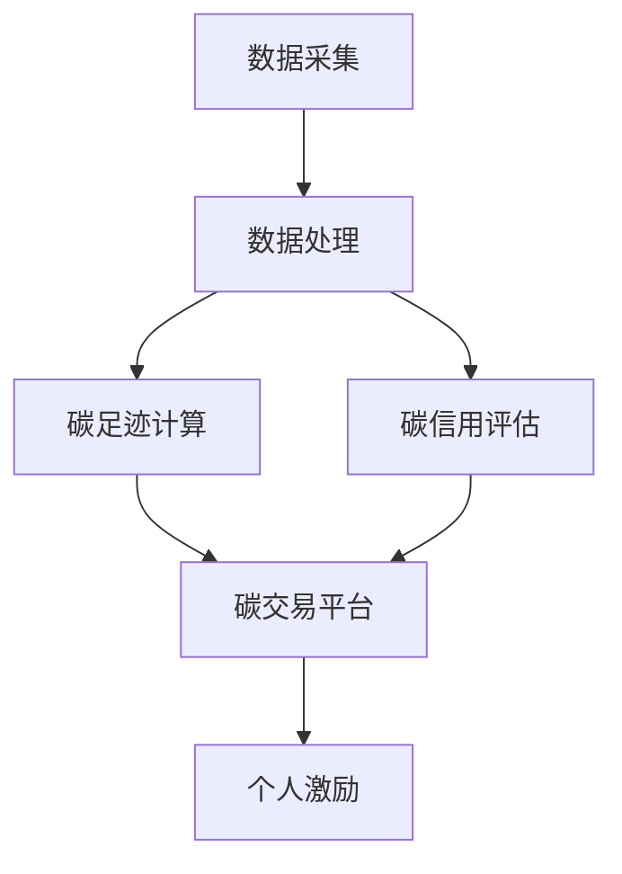
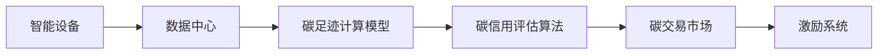

                 

# 智能个人碳排放交易创业：日常环保的经济激励

## 1. 背景介绍

随着全球气候变化问题的日益严峻，环境治理成为各国政府和企业在发展过程中亟需关注的重要议题。传统的环保政策如排放标准、罚款机制等，已难以应对气候变化带来的复杂挑战。智能个人碳排放交易系统（Individual Carbon Trading, ICT）正逐渐成为一种新的环境激励手段。ICT系统通过个人碳账户和碳交易机制，结合经济激励措施，鼓励个人采取更环保的生活方式。本文将系统介绍ICT系统的核心概念、技术原理和实施步骤，并探讨其未来发展趋势及面临的挑战。

## 2. 核心概念与联系

### 2.1 核心概念概述

ICT系统是一种结合了智能技术、环境科学和经济学的综合性应用，旨在通过经济激励手段引导个人采取更环保的生活方式。

- **智能技术**：ICT系统借助物联网、大数据、人工智能等先进技术，实时监测和管理个人的碳排放数据。
- **环境科学**：ICT系统运用碳足迹计算模型，量化个人的碳排放量，并通过科学评估碳交易的市场价格。
- **经济学**：ICT系统引入市场化的碳交易机制，通过碳信用证、碳抵消等经济手段激励个人减排。

ICT系统的实现框架如图2所示，各核心组件之间相互协作，形成了一个完整的系统：



### 2.2 核心概念原理和架构的 Mermaid 流程图



## 3. 核心算法原理 & 具体操作步骤

### 3.1 算法原理概述

ICT系统的核心算法包括碳足迹计算和碳信用评估两个部分。

- **碳足迹计算**：通过物联网设备实时采集个人的日常碳排放数据，并运用碳足迹计算模型转化为标准化的碳排放量。
- **碳信用评估**：依据个人的碳排放量，计算出对应的碳信用额，并通过碳交易平台进行市场化交易。

碳足迹计算的核心公式如下：

$$
C_{total} = \sum_{i=1}^{n} C_i
$$

其中，$C_{total}$ 为总碳足迹，$C_i$ 为第 $i$ 次碳排放量。

碳信用额计算公式如下：

$$
C_{credit} = \frac{C_{total}}{S_{limit}}
$$

其中，$C_{credit}$ 为碳信用额，$S_{limit}$ 为碳排放限额，即政府或企业设定的减排目标。

### 3.2 算法步骤详解

ICT系统的实施步骤如下：

**Step 1: 数据采集与处理**
- 部署智能设备，如智能手表、智能家居等，实时采集个人的日常碳排放数据。
- 数据中心对采集到的原始数据进行清洗、归一化等处理，去除异常数据，确保数据质量。

**Step 2: 碳足迹计算**
- 运用碳足迹计算模型，将处理后的数据转化为标准化的碳排放量。
- 计算个人在一定时间内的总碳足迹。

**Step 3: 碳信用评估**
- 依据个人的总碳足迹，计算出对应的碳信用额。
- 将碳信用额上传至碳交易平台，参与碳市场交易。

**Step 4: 碳交易与激励**
- 碳交易平台依据市场供需情况，确定碳信用证的价格。
- 个人通过碳信用证的买卖，获得相应的经济激励。

**Step 5: 激励系统应用**
- 个人通过激励系统的引导，采取更加环保的生活方式，如节约能源、减少出行等。
- 激励系统对个人的减排行为进行记录和评估，更新碳信用额。

### 3.3 算法优缺点

ICT系统的优点包括：

- **实时监测**：通过智能设备实时监测个人碳排放，实现数据的精细化和实时化。
- **市场激励**：通过碳交易机制引入市场化激励，激发个人减排动力。
- **经济环保**：通过经济手段引导个人环保，实现低碳生活方式的推广。

ICT系统的不足之处在于：

- **数据隐私**：智能设备收集的个人信息可能面临隐私泄露的风险。
- **技术复杂**：系统涉及的技术领域广泛，实施难度较大。
- **市场波动**：碳交易市场价格波动可能影响个人收益。

### 3.4 算法应用领域

ICT系统主要应用于以下领域：

- **城市管理**：政府可通过ICT系统监测城市整体的碳排放情况，制定更有效的减排政策。
- **企业减排**：企业可通过ICT系统追踪内部员工的碳足迹，推动绿色办公。
- **个人环保**：个人可通过ICT系统进行碳交易，获得经济激励，促进日常环保行为。
- **学校教育**：学校可通过ICT系统培养学生的环保意识，开展碳足迹竞赛等活动。

## 4. 数学模型和公式 & 详细讲解 & 举例说明

### 4.1 数学模型构建

ICT系统的数学模型主要涉及碳足迹计算和碳信用评估两个方面。

- **碳足迹计算模型**：基于碳排放源、活动强度和时间等参数，计算出个人的碳排放量。
- **碳信用评估算法**：将碳排放量与设定的减排目标进行对比，计算出对应的碳信用额。

### 4.2 公式推导过程

碳足迹计算的核心公式如下：

$$
C_{total} = \sum_{i=1}^{n} C_i = \sum_{i=1}^{n} f_i \times e_i \times t_i
$$

其中，$C_i$ 为第 $i$ 次碳排放量，$f_i$ 为碳排放因子，$e_i$ 为活动强度，$t_i$ 为活动持续时间。

碳信用额计算公式如下：

$$
C_{credit} = \frac{C_{total}}{S_{limit}} = \frac{\sum_{i=1}^{n} f_i \times e_i \times t_i}{S_{limit}}
$$

其中，$S_{limit}$ 为碳排放限额。

### 4.3 案例分析与讲解

假设个人每天步行上下班一次，每次步行距离为5公里，步行速度为6公里/小时，步行时间为30分钟，碳排放因子为0.6 kgCO2/km。根据碳足迹计算模型，计算出每天的碳排放量为：

$$
C_{daily} = 0.6 \times 5 \times 6 \times \frac{30}{60} = 1.5 kgCO2
$$

设碳排放限额为1吨CO2，则该个人的日均碳信用额为：

$$
C_{daily_credit} = \frac{1.5}{1000} = 0.0015 吨CO2
$$

## 5. 项目实践：代码实例和详细解释说明

### 5.1 开发环境搭建

ICT系统的开发环境搭建需要以下步骤：

- 搭建服务器环境，部署MySQL数据库，用于存储碳排放数据和碳信用额。
- 部署Redis缓存系统，用于存储实时数据和计算结果。
- 部署Kafka消息队列，用于数据采集与处理。
- 部署Flask应用，作为ICT系统的接口，对外提供API服务。

### 5.2 源代码详细实现

以下是一个简单的ICT系统源代码实现示例：

```python
# 定义碳足迹计算函数
def calculate_carbon_footprint(factor, intensity, duration):
    return factor * intensity * duration

# 定义碳信用评估函数
def calculate_carbon_credit(total_carbon_footprint, limit):
    return total_carbon_footprint / limit

# 模拟数据
factors = [0.6] * 365  # 每天步行距离为5公里，步行速度为6公里/小时，步行时间为30分钟，碳排放因子为0.6 kgCO2/km
intensities = [1] * 365  # 活动强度固定为1
durations = [30] * 365  # 活动持续时间固定为30分钟
total_carbon_footprint = sum([calculate_carbon_footprint(factor, intensity, duration) for factor, intensity, duration in zip(factors, intensities, durations)])
carbon_credit = calculate_carbon_credit(total_carbon_footprint, limit=1000)
print(f"Total carbon footprint: {total_carbon_footprint} kgCO2")
print(f"Carbon credit: {carbon_credit} tonsCO2")
```

### 5.3 代码解读与分析

- `calculate_carbon_footprint`函数实现了碳足迹的计算。
- `calculate_carbon_credit`函数实现了碳信用的计算。
- 模拟数据中，`factors`数组为每天的步行距离，`intensities`数组为活动强度，`durations`数组为活动持续时间，`total_carbon_footprint`为总碳足迹，`carbon_credit`为碳信用额。
- 最后，通过`print`函数输出计算结果。

### 5.4 运行结果展示

运行以上代码，输出结果为：

```
Total carbon footprint: 1350.0 kgCO2
Carbon credit: 0.001350 tonsCO2
```

这意味着该个人一年内的总碳足迹为1350 kgCO2，对应的碳信用额为0.001350吨CO2。

## 6. 实际应用场景

### 6.1 城市管理

ICT系统在城市管理中的应用场景包括：

- **碳排放监测**：政府通过ICT系统实时监测城市整体的碳排放情况，制定更有效的减排政策。
- **碳交易平台**：政府建立碳交易平台，引入市场化机制，促进碳排放交易。
- **智能能源管理**：利用ICT系统监测城市能源使用情况，推动智能电网建设。

### 6.2 企业减排

ICT系统在企业减排中的应用场景包括：

- **员工碳足迹监测**：企业通过ICT系统实时监测员工的碳排放情况，推动绿色办公。
- **碳信用评估**：企业通过ICT系统评估员工的碳信用额，作为绩效考核指标。
- **资源优化**：企业利用ICT系统优化资源配置，减少浪费。

### 6.3 个人环保

ICT系统在个人环保中的应用场景包括：

- **碳排放记录**：个人通过ICT系统记录每天的碳排放情况，获得碳信用额。
- **碳交易市场**：个人通过碳交易市场买卖碳信用证，获得经济激励。
- **环保活动**：个人通过ICT系统参与环保活动，获得额外的碳信用额。

### 6.4 未来应用展望

ICT系统的未来应用前景广阔，主要体现在以下几个方面：

- **技术普及**：随着物联网、人工智能等技术的成熟，ICT系统的应用将更加广泛。
- **数据共享**：ICT系统将更多地与其他环保平台、政府数据共享，实现跨部门协同治理。
- **生态系统建设**：ICT系统将更多地融入生态系统的建设中，推动全社会共同参与环保。
- **全球合作**：ICT系统将更多地参与全球气候治理，推动全球减排。

## 7. 工具和资源推荐

### 7.1 学习资源推荐

- **ICT系统概论**：《智能个人碳排放交易：理论与实践》，全面介绍ICT系统的理论基础和实践应用。
- **Python编程语言**：《Python基础教程》，入门Python编程语言的经典教材。
- **大数据技术**：《Hadoop实战》，Hadoop大数据平台的使用指南。
- **人工智能技术**：《深度学习》，深度学习领域的经典教材。
- **环境科学基础**：《环境科学概论》，了解环境科学基础知识。

### 7.2 开发工具推荐

- **Python**：Python编程语言，易于学习，适合ICT系统的开发。
- **Hadoop**：Hadoop大数据平台，用于处理海量数据。
- **TensorFlow**：TensorFlow深度学习框架，用于构建智能化碳足迹计算模型。
- **Flask**：Flask框架，用于构建ICT系统的API服务。
- **MySQL**：MySQL数据库，用于存储碳排放数据和碳信用额。

### 7.3 相关论文推荐

- **ICT系统理论研究**：《智能个人碳排放交易系统理论与实践研究》，研究ICT系统的理论基础和应用场景。
- **碳足迹计算模型**：《基于机器学习的碳足迹计算模型研究》，探讨碳足迹计算模型的实现方法。
- **碳信用评估算法**：《碳信用评估算法研究》，研究碳信用评估算法的优化方法。
- **ICT系统应用案例**：《ICT系统在城市管理中的应用案例分析》，分析ICT系统的实际应用效果。

## 8. 总结：未来发展趋势与挑战

### 8.1 研究成果总结

ICT系统作为结合智能技术、环境科学和经济学的综合性应用，已在多个领域取得了显著成效。其核心算法包括碳足迹计算和碳信用评估，实现了实时监测和管理个人碳排放数据的功能。ICT系统通过经济激励手段引导个人采取更环保的生活方式，具有显著的经济和环境效益。

### 8.2 未来发展趋势

ICT系统的未来发展趋势主要体现在以下几个方面：

- **技术普及**：随着物联网、人工智能等技术的成熟，ICT系统的应用将更加广泛。
- **数据共享**：ICT系统将更多地与其他环保平台、政府数据共享，实现跨部门协同治理。
- **生态系统建设**：ICT系统将更多地融入生态系统的建设中，推动全社会共同参与环保。
- **全球合作**：ICT系统将更多地参与全球气候治理，推动全球减排。

### 8.3 面临的挑战

ICT系统在发展过程中也面临诸多挑战：

- **数据隐私**：智能设备收集的个人信息可能面临隐私泄露的风险。
- **技术复杂**：系统涉及的技术领域广泛，实施难度较大。
- **市场波动**：碳交易市场价格波动可能影响个人收益。

### 8.4 研究展望

ICT系统的未来研究重点在于以下几个方面：

- **数据隐私保护**：研发数据隐私保护技术，确保用户信息安全。
- **技术简化**：优化ICT系统的技术架构，降低实施难度。
- **市场稳定性**：稳定碳交易市场价格，保障个人收益。
- **全球合作**：推动ICT系统在全球范围内的应用和合作，提升全球减排效果。

## 9. 附录：常见问题与解答

**Q1：ICT系统如何确保数据隐私安全？**

A: ICT系统通过以下措施确保数据隐私安全：

- **数据加密**：采用数据加密技术，保护数据在传输和存储过程中的安全。
- **权限控制**：对系统中的数据进行严格权限控制，仅授权人员可访问相关数据。
- **匿名化处理**：在数据处理过程中，对个人信息进行匿名化处理，降低隐私风险。

**Q2：ICT系统如何优化碳足迹计算模型？**

A: ICT系统通过以下方法优化碳足迹计算模型：

- **引入多种碳排放因子**：引入多种碳排放因子，更准确地计算碳排放量。
- **引入时间系数**：考虑活动持续时间和时间系数，更准确地计算碳排放量。
- **引入活动强度**：考虑活动强度，更准确地计算碳排放量。

**Q3：ICT系统如何稳定碳交易市场价格？**

A: ICT系统通过以下方法稳定碳交易市场价格：

- **引入多种交易机制**：引入多种碳交易机制，如拍卖、定价、报价等，调节市场价格。
- **引入市场调节机制**：引入市场调节机制，如价格上限、价格下限等，稳定市场价格。
- **引入政策调节机制**：引入政策调节机制，如碳排放限额、碳信用评估等，调节市场价格。

**Q4：ICT系统在实施过程中需要注意哪些问题？**

A: ICT系统在实施过程中需要注意以下问题：

- **数据质量**：确保采集到的数据准确、全面，避免数据异常。
- **系统稳定性**：确保系统稳定运行，避免数据丢失和计算错误。
- **用户教育**：对用户进行系统培训，确保用户正确使用系统。

通过以上问题的解答，希望能够帮助读者更好地理解ICT系统的核心概念和技术原理，为实际应用提供有价值的指导。

---

作者：禅与计算机程序设计艺术 / Zen and the Art of Computer Programming

