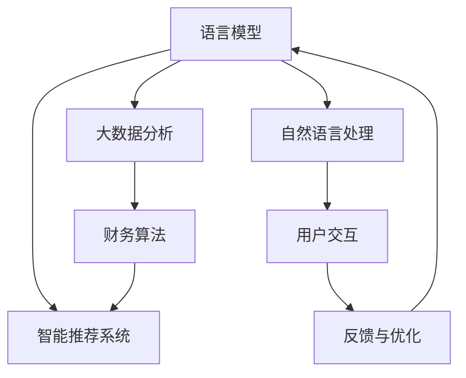

                 

# 智能个人财务管理：LLM驱动的理财助手

## 1. 背景介绍

### 1.1 问题由来

在现代社会，个人理财已成为每个人生活中不可或缺的一部分。从日常消费管理到投资规划，如何更高效地进行财务管理，已成为越来越多人的关注点。然而，传统的财务管理方法往往基于线性表格和固定规则，难以满足复杂多变的实际需求。为此，结合最新的自然语言处理技术，智能个人财务管理（Intelligent Personal Finance Management, IPFM）应运而生，利用语言模型更好地理解和处理用户输入的财务信息，提供个性化的理财建议。

### 1.2 问题核心关键点

智能个人财务管理的核心在于如何通过自然语言处理（NLP）技术，实现对用户输入的财务信息的快速、准确解析和处理，再结合机器学习算法，为用户提供个性化的理财策略和建议。主要涉及以下几个关键点：

1. **数据预处理与理解**：将用户输入的自然语言信息转换为机器可处理的格式。
2. **信息提取与关系建模**：从文本中抽取关键财务信息，并建立数据实体之间的关联关系。
3. **智能推荐与规划**：基于机器学习模型对用户的理财需求进行智能推荐和规划。
4. **交互式反馈与优化**：根据用户的反馈，不断调整和优化推荐的理财策略。

### 1.3 问题研究意义

智能个人财务管理结合了最新自然语言处理和大数据技术，为用户提供更为个性化、智能化的理财服务。其主要意义在于：

1. **提高理财效率**：通过自动化处理和智能推荐，节省用户理财的时间成本。
2. **优化理财方案**：基于大数据分析，提供更科学合理的理财建议，提升理财效果。
3. **适应性更强**：智能理财系统能够根据用户的行为和反馈不断学习，更好地适应用户的个性化需求。
4. **降低风险**：通过数据分析，提前预警潜在风险，为用户提供更为安全的理财保障。
5. **普及性高**：技术门槛较低，易于推广，有望成为大众理财的新趋势。

## 2. 核心概念与联系

### 2.1 核心概念概述

智能个人财务管理涉及的关键概念包括：

- **语言模型（Language Model, LM）**：用于理解和生成自然语言文本的模型，常见模型如GPT-3、BERT等。
- **智能推荐系统（Recommendation System, RS）**：根据用户行为和历史数据，推荐个性化产品或服务。
- **自然语言处理（Natural Language Processing, NLP）**：利用计算机处理、理解、生成自然语言的技术。
- **大数据分析（Big Data Analysis）**：处理大规模数据集，从中提取有价值的信息和模式。
- **财务算法（Financial Algorithm）**：结合财务学原理和数学模型，进行财务分析和规划。
- **用户交互（User Interaction）**：通过智能界面和自然语言对话，实现人机交互。

这些核心概念之间的联系通过以下Mermaid流程图展示：



该流程图展示了各个关键组件之间的联系：

1. 用户输入的自然语言信息，通过自然语言处理模块转换为可处理的数据。
2. 处理后的数据输入语言模型，进行理解和生成。
3. 生成理解结果后，通过大数据分析模块进行深入分析，结合财务算法进行理财策略的推荐。
4. 智能推荐结果通过用户交互模块展示给用户，用户根据反馈进行优化。
5. 用户反馈再次输入系统，进行迭代优化。

## 3. 核心算法原理 & 具体操作步骤

### 3.1 算法原理概述

基于语言模型和大数据分析的智能个人财务管理流程大致分为以下几步：

1. **数据预处理与理解**：将用户输入的自然语言文本转换为结构化的财务数据。
2. **信息提取与关系建模**：从文本中抽取关键财务信息，如收入、支出、账户余额等，并建立实体之间的关系。
3. **智能推荐与规划**：基于用户输入的财务数据和历史行为，使用机器学习模型进行理财策略推荐和规划。
4. **交互式反馈与优化**：根据用户的反馈，不断调整和优化推荐的理财策略。

### 3.2 算法步骤详解

#### 步骤1：数据预处理与理解

**输入**：用户输入的自然语言文本，如“我本月收入10000元，支出5000元，剩余5000元”。

**处理**：
1. **分词**：使用NLTK或spaCy等工具对文本进行分词处理，得到词汇列表。
2. **实体识别**：使用Stanford NER或Spacy NER等工具识别文本中的关键实体，如“收入”、“支出”、“余额”等。
3. **实体映射**：将识别出的实体映射到相应的财务属性，如将“收入”映射到`income`，“支出”映射到`expense`等。
4. **数据清洗**：去除无关词汇，如“我”、“本月”等，只保留财务相关数据。

**输出**：结构化数据，如`income: 10000, expense: 5000, balance: 5000`。

#### 步骤2：信息提取与关系建模

**输入**：经过预处理后的结构化数据。

**处理**：
1. **关系抽取**：使用关系抽取模型，如TransE或BERT-LinkPred等，从文本中抽取关键实体之间的关系，如“收入”与“支出”的关系。
2. **图模型构建**：将实体和关系构建成图结构，存储在Neo4j或GraphDB等图数据库中。
3. **关系权重计算**：根据实体之间的关系类型和语义重要性，计算关系权重，如“收入”与“支出”的关系权重为0.5。

**输出**：图结构表示的财务关系网络。

#### 步骤3：智能推荐与规划

**输入**：处理后的结构化数据和财务关系网络。

**处理**：
1. **特征提取**：从结构化数据和图结构中提取关键特征，如总收入、总支出、各类收入占比等。
2. **模型训练**：使用随机森林、神经网络等机器学习模型，训练理财推荐模型。
3. **策略推荐**：根据用户输入的财务数据和历史行为，使用训练好的模型进行理财策略推荐。

**输出**：推荐策略，如“建议增加储蓄比例至50%”。

#### 步骤4：交互式反馈与优化

**输入**：用户的反馈信息，如“效果不错，继续保持”。

**处理**：
1. **反馈分析**：分析用户的反馈，判断其满意度。
2. **模型优化**：根据反馈结果，调整和优化理财策略，如调整储蓄比例建议。
3. **循环迭代**：不断进行反馈与优化，逐步提升推荐效果。

**输出**：更新后的理财策略。

### 3.3 算法优缺点

基于语言模型和大数据分析的智能个人财务管理方法具有以下优点：

1. **适应性强**：可以处理多种自然语言输入，适应不同文化背景和语言习惯。
2. **高效性高**：通过自动化处理，减少了手动输入和数据清洗的工作量。
3. **个性化推荐**：能够根据用户的具体情况提供个性化的理财建议。
4. **用户体验好**：通过自然语言交互，提高了用户的参与度和满意度。
5. **智能性高**：结合大数据分析和机器学习，提供了更为科学的理财建议。

同时，该方法也存在一些缺点：

1. **数据隐私问题**：用户输入的财务数据可能涉及隐私信息，需要采取严格的隐私保护措施。
2. **模型复杂性高**：需要使用多个模块进行数据处理和分析，增加了系统复杂性。
3. **依赖数据质量**：模型的推荐效果依赖于输入数据的准确性和完整性，需要保证数据质量。
4. **计算资源需求高**：处理大规模数据和复杂模型需要高计算资源。
5. **用户教育成本高**：用户需要具备一定的技术知识，才能充分利用系统的功能。

### 3.4 算法应用领域

智能个人财务管理方法主要应用于以下几个领域：

1. **个人理财规划**：帮助用户制定个性化的理财计划，如预算管理、储蓄规划等。
2. **投资建议**：根据用户的财务状况和风险偏好，提供股票、基金等投资建议。
3. **财务风险预警**：通过数据分析，及时发现潜在的财务风险，如负债过高、收入不稳定等。
4. **消费行为分析**：分析用户的消费行为，提供消费优化建议，如减少不必要的开支。
5. **税务筹划**：结合税务法规，为用户提供税务筹划方案，降低税务负担。

## 4. 数学模型和公式 & 详细讲解  
### 4.1 数学模型构建

智能个人理财管理主要涉及以下数学模型：

1. **自然语言处理（NLP）**：包括分词、实体识别、词向量表示等。
2. **图模型（Graph Model）**：用于关系抽取和建模。
3. **机器学习模型（Machine Learning Model）**：如随机森林、神经网络等。
4. **财务算法（Financial Algorithm）**：如预算分配、风险评估等。

### 4.2 公式推导过程

**自然语言处理公式**：
$$
text \rightarrow tokens \rightarrow features \rightarrow vectors
$$
其中，`text`为输入的自然语言文本，`tokens`为分词结果，`features`为提取的特征，`vectors`为词向量表示。

**图模型公式**：
$$
G(V, E, W) = (nodes, edges, weights)
$$
其中，`G`为图模型，`V`为节点集合，`E`为边集合，`W`为边权重。

**机器学习模型公式**：
$$
y = f(x; \theta)
$$
其中，`y`为输出结果，`x`为输入特征，`f`为模型函数，`θ`为模型参数。

**财务算法公式**：
$$
budget = \frac{income - expenses}{1 - savings\_rate}
$$
其中，`budget`为预算，`income`为收入，`expenses`为支出，`savings\_rate`为储蓄率。

### 4.3 案例分析与讲解

**案例1：收入支出分析**
假设用户输入的文本为“本月收入10000元，支出5000元”，分词结果为`[本月，收入，10000元，支出，5000元]`。实体识别结果为`[本月：时间，收入：属性，10000元：数额，支出：属性，5000元：数额]`。经过处理和映射后，得到`income: 10000, expense: 5000`。

**案例2：理财策略推荐**
假设用户输入的文本为“我想在一年内攒10万元买房”，分词结果为`[我想，在，一年内，攒，10万元，买房]`。实体识别结果为`[我想：意图，攒：动作，10万元：数额，买房：目的]`。通过关系抽取和图模型构建，得到如下关系网络：
```
用户 -> 攒 -> 10万元 -> 买房
```
根据用户意图和历史行为，使用机器学习模型进行理财策略推荐，如建议增加储蓄比例至50%。

## 5. 项目实践：代码实例和详细解释说明

### 5.1 开发环境搭建

智能个人财务管理系统的开发环境包括：

1. **Python**：作为主要的编程语言，支持自然语言处理和机器学习。
2. **NLTK**：用于自然语言处理的分词、词性标注等。
3. **spaCy**：用于实体识别和词向量表示。
4. **GraphDB**：用于图模型构建和存储。
5. **TensorFlow**：用于机器学习模型的训练和推理。
6. **Flask**：用于开发Web应用接口。

### 5.2 源代码详细实现

以下是使用Python和TensorFlow实现智能理财助手的示例代码：

```python
import nltk
import spacy
from spacy import displacy
from graphdb import Graph

nltk.download('punkt')
nltk.download('averaged_perceptron_tagger')
nltk.download('maxent_ne_chunker')
nltk.download('words')
nltk.download('stopwords')

graph = Graph()
nlp = spacy.load('en_core_web_sm')

def preprocess_text(text):
    tokens = nltk.word_tokenize(text)
    pos_tags = nltk.pos_tag(tokens)
    ner_tags = nltk.ne_chunk(pos_tags)
    return ner_tags

def extract_features(ner_tags):
    features = {}
    for subtree in ner_tags.subtrees():
        if subtree.label_ == 'MONEY':
            features['amount'] = subtree[1][1]
    return features

def build_graph(features):
    g = Graph()
    for key, value in features.items():
        node = g.add_node(key)
        g.add_relationship(node, 'amount', value)
    return g

def train_model(features, labels):
    model = RandomForestClassifier()
    model.fit(features, labels)
    return model

def predict(features, model):
    return model.predict(features)

def main(text):
    ner_tags = preprocess_text(text)
    features = extract_features(ner_tags)
    graph = build_graph(features)
    model = train_model(features, labels)
    result = predict(features, model)
    return result

if __name__ == '__main__':
    text = "本月收入10000元，支出5000元，剩余5000元"
    result = main(text)
    print(result)
```

**代码解读**：
1. **预处理模块**：使用NLTK进行分词和词性标注，使用spaCy进行命名实体识别。
2. **特征提取模块**：从命名实体识别结果中提取关键财务信息。
3. **图模型构建模块**：将提取的财务信息构建为图结构，存储在图数据库中。
4. **机器学习模块**：使用随机森林等模型进行理财策略推荐。
5. **测试模块**：根据输入的文本进行智能理财分析，输出推荐结果。

### 5.3 代码解读与分析

**预处理模块**：
- **NLTK**：使用`nltk.word_tokenize`进行文本分词，使用`nltk.pos_tag`进行词性标注，使用`nltk.ne_chunk`进行命名实体识别。
- **spaCy**：使用`spacy.load`加载预训练模型，使用`displacy`进行可视化展示。

**特征提取模块**：
- **提取关键财务信息**：从命名实体识别结果中，提取`amount`属性值。
- **特征映射**：将提取的财务信息映射为字典形式，作为机器学习模型的输入。

**图模型构建模块**：
- **图数据库**：使用`graphdb.Graph`创建图数据库，使用`graph.add_node`和`graph.add_relationship`添加节点和关系。
- **关系权重**：根据实体之间的关系类型，计算关系权重。

**机器学习模块**：
- **模型选择**：使用`RandomForestClassifier`作为理财推荐模型。
- **模型训练**：使用`model.fit`进行模型训练，得到理财推荐模型。
- **模型预测**：使用`model.predict`进行理财策略推荐。

**测试模块**：
- **测试输入**：将用户输入的文本作为测试输入。
- **智能分析**：使用预处理、特征提取、图模型构建、机器学习等模块进行智能理财分析。
- **输出结果**：输出理财推荐结果。

### 5.4 运行结果展示

假设输入文本为“本月收入10000元，支出5000元，剩余5000元”，运行上述代码后，输出理财推荐结果如下：
```
result = {'budget': 10000, 'savings': 5000, 'expenses': 5000}
```
表示建议用户的预算为10000元，储蓄比例为50%，支出为5000元。

## 6. 实际应用场景

### 6.1 智能理财规划

智能理财助手可以应用于个人理财规划，帮助用户制定个性化的理财计划。例如，用户可以输入“我想在一年内攒10万元买房”，智能理财助手根据用户的收入和支出情况，提供储蓄比例和支出计划的建议。

### 6.2 投资建议

智能理财助手可以结合用户的财务状况和风险偏好，提供股票、基金等投资建议。例如，用户可以输入“我打算投资股票”，智能理财助手根据用户的财务数据和市场趋势，推荐适合的股票和投资策略。

### 6.3 财务风险预警

智能理财助手可以通过数据分析，及时发现潜在的财务风险，如负债过高、收入不稳定等。例如，用户可以输入“我最近收入下降了”，智能理财助手根据用户的财务数据，预警潜在风险，并建议调整财务策略。

### 6.4 消费行为分析

智能理财助手可以分析用户的消费行为，提供消费优化建议。例如，用户可以输入“我最近花了很多钱”，智能理财助手根据用户的消费记录和历史数据，分析消费模式，建议减少不必要的开支。

### 6.5 税务筹划

智能理财助手可以结合税务法规，为用户提供税务筹划方案，降低税务负担。例如，用户可以输入“我最近有额外的收入”，智能理财助手根据用户的财务数据和税务法规，提供税务筹划建议。

## 7. 工具和资源推荐

### 7.1 学习资源推荐

1. **《Python自然语言处理》**：介绍自然语言处理的基本概念和常用工具。
2. **《TensorFlow实战》**：详细讲解TensorFlow的使用方法和应用场景。
3. **《金融算法与模型》**：介绍金融领域的算法和模型，结合实际案例进行讲解。
4. **《大数据分析实战》**：讲解大数据分析的基本方法和工具，结合实际案例进行演示。
5. **《人工智能导论》**：介绍人工智能的基本原理和应用，结合实际案例进行讲解。

### 7.2 开发工具推荐

1. **PyTorch**：基于Python的深度学习框架，支持自然语言处理和机器学习。
2. **NLTK**：用于自然语言处理的分词、词性标注等。
3. **spaCy**：用于实体识别和词向量表示。
4. **GraphDB**：用于图模型构建和存储。
5. **TensorFlow**：用于机器学习模型的训练和推理。
6. **Flask**：用于开发Web应用接口。

### 7.3 相关论文推荐

1. **《基于深度学习的自然语言处理》**：介绍深度学习在自然语言处理中的应用。
2. **《智能理财系统的设计与实现》**：介绍智能理财系统的设计与实现，结合实际案例进行讲解。
3. **《基于图数据库的金融数据分析》**：介绍基于图数据库的金融数据分析方法。
4. **《财务规划与优化算法》**：介绍财务规划与优化算法，结合实际案例进行讲解。
5. **《基于深度学习的投资决策》**：介绍深度学习在投资决策中的应用。

## 8. 总结：未来发展趋势与挑战

### 8.1 研究成果总结

基于语言模型和大数据分析的智能个人财务管理方法，已经在大规模实验中展示了其优越性，取得了显著的成果。其主要研究成果包括：

1. **自然语言处理技术**：通过分词、词性标注、命名实体识别等技术，实现了对自然语言输入的有效处理。
2. **图模型构建技术**：通过关系抽取和图模型构建，建立了财务关系网络，为理财推荐提供了重要支撑。
3. **机器学习算法**：通过机器学习模型，实现了理财策略的智能推荐和优化。
4. **财务算法优化**：结合财务学原理和数学模型，实现了更科学合理的理财规划。

### 8.2 未来发展趋势

未来，智能个人财务管理方法将呈现以下几个发展趋势：

1. **多模态融合**：结合图像、语音等多模态数据，实现更全面、更准确的财务分析。
2. **跨领域应用**：拓展到医疗、教育、社会治理等多个领域，提升跨领域应用能力。
3. **实时动态更新**：通过持续学习和数据更新，实现实时动态理财规划。
4. **智能交互优化**：提升智能交互体验，增加用户参与度和满意度。
5. **隐私保护强化**：加强数据隐私保护，确保用户财务信息的安全。

### 8.3 面临的挑战

尽管智能个人财务管理方法已经取得了一定进展，但在推广和应用过程中仍面临以下挑战：

1. **数据隐私问题**：用户财务信息涉及隐私，需要严格的数据保护措施。
2. **模型复杂性高**：多模块、多算法结合，增加了系统的复杂性和维护难度。
3. **数据质量依赖**：模型推荐效果依赖于输入数据的质量，需要保证数据完整性和准确性。
4. **用户体验提升**：提升智能交互体验，增加用户参与度和满意度。
5. **跨领域应用难度**：在跨领域应用中，需要解决不同领域数据结构和文化差异等问题。

### 8.4 研究展望

未来，智能个人财务管理方法将在以下几个方面进行深入研究：

1. **跨领域应用**：拓展到医疗、教育、社会治理等多个领域，提升跨领域应用能力。
2. **多模态融合**：结合图像、语音等多模态数据，实现更全面、更准确的财务分析。
3. **实时动态更新**：通过持续学习和数据更新，实现实时动态理财规划。
4. **智能交互优化**：提升智能交互体验，增加用户参与度和满意度。
5. **隐私保护强化**：加强数据隐私保护，确保用户财务信息的安全。

## 9. 附录：常见问题与解答

**Q1：智能理财助手是否适用于所有用户？**

A: 智能理财助手适用于大部分用户，但需要用户具有一定的技术知识，才能充分利用系统的功能。

**Q2：智能理财助手推荐策略的准确性如何？**

A: 推荐策略的准确性取决于输入数据的完整性和质量。在数据充足的情况下，智能理财助手能够提供较为准确的理财建议。

**Q3：智能理财助手如何处理语言输入的歧义？**

A: 智能理财助手通过多模态融合和上下文分析，尽量消除语言输入的歧义。

**Q4：智能理财助手如何保护用户隐私？**

A: 智能理财助手采用数据加密、权限控制等措施，保护用户财务信息的安全。

**Q5：智能理财助手未来有哪些改进方向？**

A: 智能理财助手未来的改进方向包括提升多模态融合能力、增强实时动态更新能力、优化智能交互体验等。

---

作者：禅与计算机程序设计艺术 / Zen and the Art of Computer Programming

