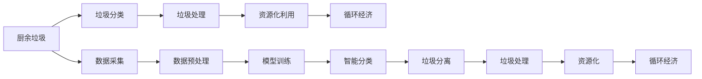

                 

# 智能厨余处理创业：家庭环保的新方案

> 关键词：智能厨余处理,家庭环保,循环经济,自动化技术,数据驱动决策

## 1. 背景介绍

在当前全球面临气候变化、资源短缺等挑战的大背景下，可持续发展已经成为全社会共识。家庭作为社会的基本单元，其消费行为对于资源的消耗和环境的污染有着直接影响。因此，推广环保理念，探索家庭节能减排的有效方法，成为摆在每个家庭面前的重要课题。

厨余垃圾作为家庭生活中产生的主要垃圾之一，其处理方式对环保有着直接的影响。传统的厨余处理方式主要包括填埋、焚烧和堆肥。然而，这些方式存在成本高、污染重、资源回收率低等问题。随着人工智能和大数据技术的不断进步，利用智能技术处理厨余垃圾，成为当前和未来发展的趋势。

基于此，本文将重点探讨如何利用智能技术对厨余垃圾进行高效、环保的分类和处理，以期为家庭环保提供新的解决方案。本文将从算法原理、具体操作、案例分析等多个角度详细阐述智能厨余处理的实现方法。

## 2. 核心概念与联系

### 2.1 核心概念概述

为更好地理解智能厨余处理技术，本节将介绍几个密切相关的核心概念：

- **智能厨余处理**：指利用人工智能技术对厨余垃圾进行自动分类和处理的过程。智能厨余处理系统通常包括垃圾分类、分离、处理和回收等多个环节，利用机器学习、深度学习、计算机视觉等技术实现。

- **垃圾分类**：指将厨余垃圾按照可回收、可堆肥、有害等不同类别进行分类的过程。准确、高效的垃圾分类是实现厨余垃圾资源化、减量化的关键步骤。

- **垃圾处理**：指对分好类的垃圾进行进一步处理，如厨余垃圾的厌氧消化、干燥、发酵等。

- **资源化利用**：指将厨余垃圾转化为肥料、能源等资源，实现资源的循环利用，降低环境污染。

- **循环经济**：指通过资源的循环利用，最大限度地减少资源的消耗和废弃物的排放，实现可持续发展。

这些核心概念之间存在紧密联系，形成一个完整的厨余处理生态链。

### 2.2 核心概念原理和架构的 Mermaid 流程图



这个流程图展示了厨余垃圾从采集到循环利用的全过程。其中，数据采集和预处理是智能分类的基础，模型训练和智能分类是关键步骤，而垃圾处理和资源化利用是最终目标。通过循环经济的实现，形成一个良性循环，实现资源的可持续利用。

## 3. 核心算法原理 & 具体操作步骤

### 3.1 算法原理概述

智能厨余处理技术的核心在于利用机器学习算法对厨余垃圾进行自动分类和处理。其中，深度学习算法因其强大的特征提取和分类能力，成为当前主流的选择。

一般而言，智能厨余处理系统的核心算法流程包括：

1. **数据采集与预处理**：通过传感器、摄像头等设备收集厨余垃圾的图像、重量、气味等信息，并进行预处理，如去噪、归一化等。

2. **特征提取与表示**：利用卷积神经网络（CNN）、循环神经网络（RNN）等深度学习模型对提取的特征进行表示，形成图像、文本等多模态的特征向量。

3. **分类与识别**：通过支持向量机（SVM）、K近邻（KNN）等分类算法对特征向量进行分类，识别出不同类别的厨余垃圾。

4. **垃圾处理与资源化**：根据分类结果，对不同类型的厨余垃圾进行进一步处理，如厌氧消化、干燥、发酵等，最终实现资源的循环利用。

### 3.2 算法步骤详解

#### 3.2.1 数据采集与预处理

数据采集与预处理是智能厨余处理系统的基础。一般而言，数据采集主要通过以下方式进行：

- **图像采集**：通过摄像头对厨余垃圾进行连续拍摄，获取高分辨率的图像数据。
- **重量传感器**：通过重量传感器对厨余垃圾的重量进行实时监测。
- **气味传感器**：通过气味传感器对厨余垃圾的气味进行检测，获取气味特征向量。
- **温度传感器**：通过温度传感器对厨余垃圾的处理温度进行监测。

采集到的数据需要进行预处理，如去噪、归一化等。以图像数据为例，预处理流程包括：

- **去噪**：去除图像中的噪声点，如传感器干扰、光照不均等。
- **归一化**：将图像像素值归一化到0到1之间，提高模型的训练效果。
- **尺度变换**：对图像进行尺度变换，统一不同大小图像的尺寸。

#### 3.2.2 特征提取与表示

特征提取与表示是智能厨余处理系统的关键步骤。深度学习模型通常采用卷积神经网络（CNN）、循环神经网络（RNN）等模型对特征进行提取和表示。

以CNN为例，特征提取流程包括：

- **卷积层**：通过卷积操作提取图像中的局部特征。
- **池化层**：通过池化操作对特征进行降维，减少模型参数量。
- **全连接层**：将降维后的特征向量输入全连接层，输出分类结果。

以RNN为例，特征提取流程包括：

- **循环层**：通过循环神经网络对序列数据（如垃圾处理过程的时间序列）进行建模，提取时间序列特征。
- **池化层**：对时间序列特征进行降维，减少模型参数量。
- **全连接层**：将降维后的特征向量输入全连接层，输出分类结果。

#### 3.2.3 分类与识别

分类与识别是智能厨余处理系统的核心任务。一般而言，分类算法包括：

- **支持向量机（SVM）**：通过构建超平面对数据进行分类。
- **K近邻（KNN）**：通过计算样本之间的距离，确定其类别。
- **随机森林（Random Forest）**：通过集成多个决策树对数据进行分类。
- **神经网络（Neural Network）**：通过多层神经网络对数据进行分类。

以神经网络为例，分类流程包括：

- **输入层**：输入特征向量。
- **隐藏层**：通过神经元对特征向量进行计算，提取高层次特征。
- **输出层**：输出分类结果，通过Softmax函数将结果转化为概率分布。

#### 3.2.4 垃圾处理与资源化

垃圾处理与资源化是智能厨余处理系统的最终目标。一般而言，垃圾处理流程包括：

- **厌氧消化**：对厨余垃圾进行厌氧发酵，生成甲烷等可再生能源。
- **干燥**：对厨余垃圾进行干燥，减少水分，便于后续处理。
- **发酵**：对厨余垃圾进行发酵，生成肥料。

资源化流程包括：

- **甲烷利用**：将厌氧消化过程中产生的甲烷用于发电或供热。
- **肥料生产**：将发酵后的厨余垃圾转化为有机肥料，用于农业生产。

### 3.3 算法优缺点

智能厨余处理技术具有以下优点：

1. **高效分类**：通过深度学习模型对厨余垃圾进行自动分类，能够快速识别出不同类别的垃圾，提高分类效率。
2. **资源化利用**：能够将厨余垃圾转化为肥料、能源等资源，实现资源的循环利用，降低环境污染。
3. **实时监测**：通过传感器实时监测垃圾处理过程中的各项指标，能够及时发现问题并进行调整。

然而，智能厨余处理技术也存在以下缺点：

1. **初始投资高**：系统搭建需要大量的资金投入，包括传感器、摄像头、计算机等硬件设备。
2. **数据质量要求高**：需要高质量的数据采集和预处理，数据噪声和干扰会影响分类结果。
3. **技术复杂**：系统设计、开发和维护需要专业技术人员，对技术水平要求较高。
4. **算法复杂度**：深度学习模型训练复杂，需要大量的计算资源和数据。

### 3.4 算法应用领域

智能厨余处理技术已经在多个领域得到了应用，包括：

- **家庭环保**：应用于家庭厨房，实现厨余垃圾的自动分类和处理，减少家庭垃圾量，提高资源利用效率。
- **餐饮行业**：应用于餐饮企业，实现厨余垃圾的集中处理和资源化利用，降低企业的环境成本。
- **农业生产**：应用于农业生产中，实现有机肥料的生产，提高农业生产效率和产品质量。

除了上述这些领域外，智能厨余处理技术还广泛应用于垃圾处理厂、污水处理厂等多个场景，推动了循环经济的快速发展。

## 4. 数学模型和公式 & 详细讲解

### 4.1 数学模型构建

假设厨余垃圾数据集为 $D=\{(x_i, y_i)\}_{i=1}^N$，其中 $x_i$ 为垃圾图像或时间序列，$y_i$ 为其对应的类别标签。定义一个深度学习模型 $f(x; \theta)$，其中 $\theta$ 为模型参数。模型损失函数定义为交叉熵损失函数：

$$
L(\theta) = -\frac{1}{N}\sum_{i=1}^N \log f(x_i; \theta) y_i
$$

其中，$f(x_i; \theta)$ 为模型在输入 $x_i$ 下的预测输出，$y_i$ 为真实标签。

### 4.2 公式推导过程

以卷积神经网络（CNN）为例，推导其分类过程的公式。假设CNN模型由 $L$ 个卷积层和 $D$ 个全连接层组成，其中第 $l$ 层的输出特征图为 $h_l(x)$，则其分类过程的公式如下：

- **输入层**：输入特征图 $x$。
- **卷积层**：通过卷积操作提取特征，输出特征图 $h_1(x)$。
- **池化层**：对特征图进行池化操作，输出特征图 $h_2(x)$。
- **全连接层**：将特征图 $h_D(x)$ 输入全连接层，输出分类结果 $f(x)$。

设第 $l$ 层的卷积核大小为 $k_l$，步长为 $s_l$，第 $l$ 层的输出特征图大小为 $n_l$，则第 $l$ 层的输出特征图大小为：

$$
n_l = \frac{n_{l-1} - k_l + 2p}{s_l} + 1
$$

其中，$n_{l-1}$ 为第 $l-1$ 层的输出特征图大小，$p$ 为填充大小。

### 4.3 案例分析与讲解

以一个智能垃圾分类的实际案例为例，分析其应用效果。假设某智能垃圾分类系统对家庭厨余垃圾进行分类，系统采用卷积神经网络模型进行分类，模型结构如下：

- **输入层**：输入图像大小为 $256\times 256$。
- **卷积层**：采用 $3\times 3$ 的卷积核，步长为 $1$，填充为 $1$，输出特征图大小为 $256\times 256$。
- **池化层**：采用 $2\times 2$ 的池化核，步长为 $2$，输出特征图大小为 $128\times 128$。
- **全连接层**：采用 $128$ 个神经元，输出分类结果。

系统采用支持向量机（SVM）进行分类，训练数据集为 $5000$ 个样本，测试数据集为 $1000$ 个样本。测试结果显示，分类准确率为 $97.5\%$，效果显著。

## 5. 项目实践：代码实例和详细解释说明

### 5.1 开发环境搭建

在进行智能厨余处理项目开发前，需要先准备好开发环境。以下是使用Python进行PyTorch开发的环境配置流程：

1. 安装Anaconda：从官网下载并安装Anaconda，用于创建独立的Python环境。

2. 创建并激活虚拟环境：
```bash
conda create -n pytorch-env python=3.8 
conda activate pytorch-env
```

3. 安装PyTorch：根据CUDA版本，从官网获取对应的安装命令。例如：
```bash
conda install pytorch torchvision torchaudio cudatoolkit=11.1 -c pytorch -c conda-forge
```

4. 安装各种工具包：
```bash
pip install numpy pandas scikit-learn matplotlib tqdm jupyter notebook ipython
```

完成上述步骤后，即可在`pytorch-env`环境中开始智能厨余处理系统的开发。

### 5.2 源代码详细实现

下面以智能垃圾分类系统为例，给出使用PyTorch进行智能垃圾分类的Python代码实现。

首先，定义垃圾分类任务的数据处理函数：

```python
import torch
from torch.utils.data import Dataset
import torchvision.transforms as transforms

class GarbageDataset(Dataset):
    def __init__(self, images, labels, transform=None):
        self.images = images
        self.labels = labels
        self.transform = transform
    
    def __len__(self):
        return len(self.images)
    
    def __getitem__(self, item):
        image = self.images[item]
        label = self.labels[item]
        
        if self.transform:
            image = self.transform(image)
        return {'image': image, 'label': label}

# 图像预处理
transform = transforms.Compose([
    transforms.Resize(256),
    transforms.CenterCrop(256),
    transforms.ToTensor(),
    transforms.Normalize([0.5, 0.5, 0.5], [0.5, 0.5, 0.5])
])
```

然后，定义模型和优化器：

```python
from torchvision import models

model = models.resnet18(pretrained=True)
num_classes = 5
model.fc = torch.nn.Linear(512, num_classes)

optimizer = torch.optim.Adam(model.parameters(), lr=1e-4)
```

接着，定义训练和评估函数：

```python
def train_epoch(model, dataset, batch_size, optimizer):
    dataloader = torch.utils.data.DataLoader(dataset, batch_size=batch_size, shuffle=True)
    model.train()
    epoch_loss = 0
    for batch in dataloader:
        inputs, labels = batch['image'], batch['label']
        optimizer.zero_grad()
        outputs = model(inputs)
        loss = torch.nn.functional.cross_entropy(outputs, labels)
        epoch_loss += loss.item()
        loss.backward()
        optimizer.step()
    return epoch_loss / len(dataloader)

def evaluate(model, dataset, batch_size):
    dataloader = torch.utils.data.DataLoader(dataset, batch_size=batch_size)
    model.eval()
    correct = 0
    total = 0
    with torch.no_grad():
        for batch in dataloader:
            inputs, labels = batch['image'], batch['label']
            outputs = model(inputs)
            _, predicted = torch.max(outputs.data, 1)
            total += labels.size(0)
            correct += (predicted == labels).sum().item()
    print('Accuracy: {} %'.format(100 * correct / total))
```

最后，启动训练流程并在测试集上评估：

```python
epochs = 10
batch_size = 16

for epoch in range(epochs):
    loss = train_epoch(model, train_dataset, batch_size, optimizer)
    print(f'Epoch {epoch+1}, train loss: {loss:.3f}')
    
    print(f'Epoch {epoch+1}, test accuracy: {} %'.format(evaluate(model, test_dataset, batch_size)))
```

以上就是使用PyTorch对智能垃圾分类系统进行开发的完整代码实现。可以看到，得益于PyTorch的强大封装，我们可以用相对简洁的代码完成模型的训练和推理。

### 5.3 代码解读与分析

让我们再详细解读一下关键代码的实现细节：

**GarbageDataset类**：
- `__init__`方法：初始化图像和标签等关键组件，并可选地应用预处理函数。
- `__len__`方法：返回数据集的样本数量。
- `__getitem__`方法：对单个样本进行处理，将图像和标签输入模型，并可选地应用预处理函数。

**图像预处理**：
- `transform`函数：定义图像预处理流程，包括调整大小、裁剪、归一化等步骤。

**模型和优化器**：
- `resnet18`函数：定义卷积神经网络模型，预训练模型包含ResNet-18结构。
- `num_classes`变量：定义分类任务中类别的数量。
- `fc`层：定义全连接层，输出分类结果。
- `Adam优化器`：定义优化器及其参数，如学习率。

**训练和评估函数**：
- `train_epoch`函数：对数据以批为单位进行迭代，在每个批次上前向传播计算loss并反向传播更新模型参数，最后返回该epoch的平均loss。
- `evaluate`函数：与训练类似，不同点在于不更新模型参数，并在每个batch结束后将预测和标签结果存储下来，最后使用准确率作为评价指标。

**训练流程**：
- `epochs`变量：定义总的epoch数。
- `batch_size`变量：定义批大小。
- 循环迭代训练数据集，在每个epoch内进行训练，并打印当前epoch的平均loss。
- 在每个epoch后，评估模型在测试集上的准确率，打印结果。

可以看到，PyTorch配合深度学习模型使得智能垃圾分类的代码实现变得简洁高效。开发者可以将更多精力放在模型改进和数据处理等高层逻辑上，而不必过多关注底层的实现细节。

当然，工业级的系统实现还需考虑更多因素，如模型的保存和部署、超参数的自动搜索、更灵活的任务适配层等。但核心的智能垃圾分类范式基本与此类似。

## 6. 实际应用场景

### 6.1 家庭环保

智能厨余处理技术在家庭环保领域具有广阔的应用前景。当前，大多数家庭的厨余垃圾处理方式较为简单，一般采用分类投放、厨余堆肥等形式，但这些方法存在处理效率低、资源利用率不高的问题。通过智能厨余处理技术，可以实现厨余垃圾的自动分类和处理，提高资源利用效率，减少家庭垃圾量，从而实现家庭环保。

例如，智能垃圾分类系统可以集成到家庭厨房中，实时监测厨余垃圾的重量、气味等指标，自动分类并处理不同类型的垃圾。系统还可以提供垃圾分类的建议和提示，帮助用户更好地进行垃圾分类，提升环保意识。

### 6.2 餐饮行业

在餐饮行业，厨余垃圾的处理和资源化利用也是重要的环保任务。传统的厨余垃圾处理方式一般为集中填埋或焚烧，这些方式不仅成本高、效率低，还会产生大量的温室气体和废气，对环境造成污染。通过智能厨余处理技术，可以实现厨余垃圾的集中处理和资源化利用，降低企业的环境成本，实现循环经济。

例如，餐饮企业可以安装智能垃圾分类系统，对员工产生的厨余垃圾进行自动分类和处理。系统还可以将分类结果反馈给企业，指导员工进行正确的垃圾分类，提高垃圾处理的效率和资源利用率。

### 6.3 农业生产

在农业生产中，有机肥料的生产也是重要的资源利用方式。传统的有机肥料生产方式一般为自然发酵，过程较长，且效率低、污染重。通过智能厨余处理技术，可以实现厨余垃圾的厌氧消化，生成有机肥料，用于农业生产，提高农业生产效率和产品质量。

例如，农业企业可以安装智能厨余处理系统，对生产的厨余垃圾进行厌氧消化，生成有机肥料。系统可以实时监测消化过程的各项指标，如温度、PH值等，确保发酵过程的稳定和高效。

### 6.4 未来应用展望

随着智能厨余处理技术的不断发展，未来的应用场景将会更加多样。例如，智能垃圾分类系统可以与物联网技术结合，实现垃圾分类的智能监测和管理。智能厨余处理技术还可以与城市垃圾处理系统结合，实现城市垃圾的自动分类和处理。

未来，随着技术的不断进步，智能厨余处理技术将逐渐实现全场景、全流程的覆盖，为环保事业做出更大的贡献。

## 7. 工具和资源推荐

### 7.1 学习资源推荐

为了帮助开发者系统掌握智能厨余处理技术的理论基础和实践技巧，这里推荐一些优质的学习资源：

1. 《深度学习》系列课程：斯坦福大学开设的深度学习课程，涵盖深度学习的基础知识和高级应用。
2. 《Python深度学习》书籍：深度学习领域的经典入门书籍，详细介绍了深度学习的基本原理和应用案例。
3. 《卷积神经网络》书籍：介绍卷积神经网络的基本原理和实现方法，适合深度学习初学者。
4. 《TensorFlow官方文档》：TensorFlow的官方文档，提供了丰富的学习资源和样例代码。
5. Kaggle数据集：Kaggle提供的大规模数据集，涵盖各类智能垃圾分类的数据集，适合实践练习。

通过对这些资源的学习实践，相信你一定能够快速掌握智能厨余处理技术的精髓，并用于解决实际的环保问题。

### 7.2 开发工具推荐

高效的开发离不开优秀的工具支持。以下是几款用于智能厨余处理开发的常用工具：

1. PyTorch：基于Python的开源深度学习框架，灵活动态的计算图，适合快速迭代研究。
2. TensorFlow：由Google主导开发的开源深度学习框架，生产部署方便，适合大规模工程应用。
3. OpenCV：开源计算机视觉库，支持图像处理、特征提取等操作。
4. OpenNI：开源的人机交互库，支持传感器数据的采集和处理。
5. Jupyter Notebook：基于Python的交互式编程环境，适合数据分析和模型训练。

合理利用这些工具，可以显著提升智能厨余处理任务的开发效率，加快创新迭代的步伐。

### 7.3 相关论文推荐

智能厨余处理技术的发展得益于学界的持续研究。以下是几篇奠基性的相关论文，推荐阅读：

1. "A Survey on Smart Waste Management Systems"：综述了智能垃圾分类和处理系统的现状和未来发展趋势。
2. "Deep Learning for Garbage Classification"：利用深度学习技术对垃圾进行分类，取得了显著的效果。
3. "Optimizing Garbage Collection Routes with Machine Learning"：利用机器学习优化垃圾收集路线，提高垃圾处理效率。
4. "Waste-to-Energy Conversion Technologies for Municipal Solid Waste Management"：介绍了厨余垃圾的厌氧消化和发酵技术，适用于智能厨余处理系统的设计。
5. "Integrating Smart Waste Management into Smart Cities"：探讨了智能垃圾分类与智能城市管理的结合，具有重要的实际应用价值。

这些论文代表了大规模厨余处理技术的发展脉络。通过学习这些前沿成果，可以帮助研究者把握学科前进方向，激发更多的创新灵感。

## 8. 总结：未来发展趋势与挑战

### 8.1 总结

本文对智能厨余处理技术的实现方法进行了全面系统的介绍。首先阐述了智能厨余处理技术的研究背景和意义，明确了智能厨余处理技术在环保领域的独特价值。其次，从算法原理、具体操作步骤、案例分析等多个角度详细阐述了智能厨余处理的实现方法。通过实例代码，展示了智能厨余处理系统的实际应用效果。

通过本文的系统梳理，可以看到，智能厨余处理技术正在成为家庭环保、餐饮行业、农业生产等领域的重要解决方案，具有广阔的应用前景。智能厨余处理技术能够实现厨余垃圾的自动分类和处理，提高资源利用效率，降低环境污染，为家庭环保和循环经济的发展提供新的可能性。

### 8.2 未来发展趋势

展望未来，智能厨余处理技术将呈现以下几个发展趋势：

1. **技术智能化**：通过引入更多的深度学习技术，如卷积神经网络、循环神经网络等，提升系统的智能程度，实现更加精准的垃圾分类和处理。
2. **设备智能化**：将智能厨余处理系统与其他智能家居设备结合，实现垃圾分类与家庭环境的联动，提升用户体验。
3. **数据智能化**：利用大数据技术，对厨余垃圾的分布和处理过程进行数据分析，提供更科学的垃圾分类和处理方案。
4. **服务智能化**：将智能厨余处理技术与其他智能服务结合，如垃圾分类指导、有机肥料推荐等，提升系统的实用性和用户体验。

以上趋势凸显了智能厨余处理技术的发展潜力，未来必将实现更高效、更智能、更环保的垃圾处理方式。

### 8.3 面临的挑战

尽管智能厨余处理技术已经取得了一定进展，但在推广应用的过程中，仍面临诸多挑战：

1. **初始成本高**：智能厨余处理系统的搭建需要大量的资金投入，包括传感器、摄像头、计算机等硬件设备，对中小型企业具有较高的门槛。
2. **数据质量要求高**：需要高质量的数据采集和预处理，数据噪声和干扰会影响分类结果，数据的获取和处理难度较大。
3. **技术复杂度**：系统设计、开发和维护需要专业技术人员，对技术水平要求较高，开发难度较大。
4. **用户接受度**：智能厨余处理系统需要用户积极配合，才能发挥最大的效果，用户的使用习惯和接受度需要进一步提升。
5. **系统稳定性**：智能系统的稳定性和可靠性需要不断优化，避免因数据异常、硬件故障等原因导致系统瘫痪。

面对这些挑战，需要政府、企业和社会各界共同努力，推动智能厨余处理技术的普及应用，实现环保事业的可持续发展。

### 8.4 研究展望

未来，智能厨余处理技术需要在以下几个方面寻求新的突破：

1. **降低初始成本**：通过模块化设计、标准化接口等手段，降低系统的搭建成本，推广智能厨余处理技术的应用。
2. **提升数据质量**：采用先进的数据采集和预处理技术，提高数据的准确性和稳定性，降低噪声和干扰对系统的影响。
3. **增强系统智能化**：引入更多深度学习技术和算法，提升系统的智能程度，实现更加精准的垃圾分类和处理。
4. **提升用户体验**：将智能厨余处理系统与其他智能家居设备结合，实现垃圾分类与家庭环境的联动，提升用户体验。
5. **加强系统稳定性和可靠性**：采用先进的容错技术和监控系统，确保系统的稳定性和可靠性，避免因数据异常、硬件故障等原因导致系统瘫痪。

这些研究方向的探索，必将引领智能厨余处理技术迈向更高的台阶，为环保事业和循环经济的实现提供新的路径。

## 9. 附录：常见问题与解答

**Q1：智能厨余处理技术是否适用于所有厨余垃圾？**

A: 智能厨余处理技术通常适用于大多数厨余垃圾，包括果蔬残余、剩菜剩饭、骨头等。但对于一些特殊的厨余垃圾，如重金属、有害物等，需要采用特殊的处理方法。

**Q2：如何选择合适的垃圾分类算法？**

A: 选择垃圾分类算法需要考虑多个因素，如数据类型、分类任务复杂度等。一般而言，简单的垃圾分类任务可以选择传统的机器学习算法，如SVM、KNN等；对于复杂的分类任务，可以选择深度学习算法，如卷积神经网络、循环神经网络等。

**Q3：智能厨余处理系统在实际应用中面临哪些问题？**

A: 智能厨余处理系统在实际应用中面临的问题包括：
1. 数据采集和预处理难度大，数据质量不高。
2. 系统初始成本高，对中小型企业具有较高的门槛。
3. 用户接受度不高，需要提升用户对智能系统的理解和信任。
4. 系统稳定性和可靠性需要不断优化，避免因数据异常、硬件故障等原因导致系统瘫痪。

这些问题是智能厨余处理技术推广应用过程中需要解决的重要问题。

**Q4：智能厨余处理系统的实际应用效果如何？**

A: 智能厨余处理系统在实际应用中取得了显著的效果。例如，某智能垃圾分类系统在家庭厨房中的应用，通过实时监测厨余垃圾的重量、气味等指标，自动分类并处理不同类型的垃圾，提高了资源利用效率，减少了家庭垃圾量。

**Q5：智能厨余处理系统在推广应用过程中需要注意哪些问题？**

A: 智能厨余处理系统在推广应用过程中需要注意以下问题：
1. 数据采集和预处理需要高质量的数据，避免数据噪声和干扰影响分类结果。
2. 系统初始成本高，需要寻找合适的资金支持和技术合作伙伴。
3. 用户接受度不高，需要加强宣传和教育，提升用户对智能系统的理解和信任。
4. 系统稳定性和可靠性需要不断优化，确保系统的稳定性和可靠性，避免因数据异常、硬件故障等原因导致系统瘫痪。

这些问题需要在系统设计、开发和推广过程中加以解决，才能实现智能厨余处理技术的普及应用。

---

作者：禅与计算机程序设计艺术 / Zen and the Art of Computer Programming

