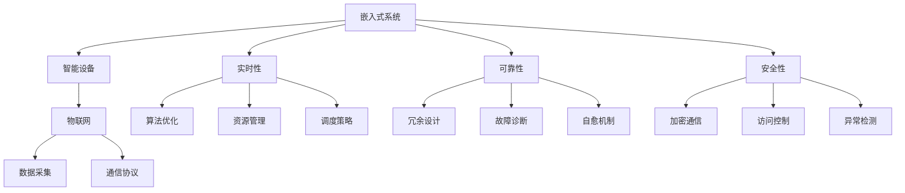

                 

# 智能设备开发：嵌入式系统设计与实现

> 关键词：智能设备,嵌入式系统,设计,实现,物联网(IoT),实时性,资源优化,软件架构,可靠性,安全性,优化算法

## 1. 背景介绍

### 1.1 问题由来
随着人工智能(AI)技术的蓬勃发展，智能设备的应用领域日益广泛，从智能家居、智能医疗到智能交通，人们的生活和工作方式正在被AI技术所改变。嵌入式系统作为AI技术的重要载体，面临着前所未有的挑战和机遇。本文旨在系统介绍智能设备开发中嵌入式系统设计与实现的核心概念、关键算法和技术手段，为读者提供从设计到实现的全面指南。

### 1.2 问题核心关键点
智能设备开发的核心在于嵌入式系统的设计与实现，其关键点包括：
- 选择合适的嵌入式平台：如ARM Cortex-M、RISC-V等，根据应用场景和性能需求进行选型。
- 设计高效软件架构：包括驱动程序、中间件、应用软件等模块，满足实时性、可靠性、安全性的要求。
- 实现高性能算法：如图像处理、语音识别、路径规划等，优化算法以适应资源受限的环境。
- 进行系统优化：如内存管理、能效优化、代码压缩等，提高系统的运行效率和性能。
- 保证系统可靠性：如故障诊断、冗余设计、备份机制等，增强系统的健壮性和可用性。
- 确保系统安全性：如加密通信、访问控制、异常检测等，保护用户隐私和数据安全。

这些关键点构成了智能设备开发的基础，同时也是本文将要深入探讨的内容。

## 2. 核心概念与联系

### 2.1 核心概念概述

为更好地理解智能设备开发，我们需要首先了解几个关键概念：

- **嵌入式系统**：指应用于特定应用场景的计算机系统，包括硬件和软件两部分。嵌入式系统通常资源受限，实时性和可靠性要求高，设计复杂。
- **智能设备**：指内置AI功能的嵌入式系统，具备一定程度的自主决策和交互能力，如智能音箱、智能穿戴设备、自动驾驶汽车等。
- **物联网(IoT)**：指连接物理世界和虚拟网络的技术体系，通过传感器、执行器等设备，实现物与物、人与物的互联互通。
- **实时性**：指系统能够及时响应外部事件，满足用户对系统响应速度的需求。实时性要求系统设计要考虑算法优化、资源管理和调度策略等因素。
- **可靠性**：指系统能够在长时间运行中稳定工作，不出现重大故障或异常。可靠性要求系统设计要考虑冗余设计、故障诊断和自愈机制等。
- **安全性**：指系统能够保护用户隐私和数据安全，防止未授权访问和恶意攻击。安全性要求系统设计要考虑加密通信、访问控制和异常检测等。

这些概念之间的联系可以通过以下Mermaid流程图来展示：



这个流程图展示了几组概念之间的关系：

1. 嵌入式系统是智能设备的基础，物联网是智能设备应用的重要场景。
2. 实时性、可靠性和安全性是嵌入式系统设计必须考虑的关键因素。
3. 算法优化、资源管理和调度策略是满足实时性要求的重要手段。
4. 冗余设计、故障诊断和自愈机制是保证系统可靠性的关键措施。
5. 加密通信、访问控制和异常检测是保障系统安全性的重要手段。

这些概念共同构成了智能设备开发的核心框架，有助于我们全面把握系统设计的关键要素。

## 3. 核心算法原理 & 具体操作步骤
### 3.1 算法原理概述

嵌入式系统的设计与实现需要综合考虑算法优化、资源管理和调度策略等因素。本文将从算法原理、操作步骤和实际应用三个方面，详细介绍智能设备开发中嵌入式系统设计的核心算法和技术手段。

### 3.2 算法步骤详解

嵌入式系统设计的核心算法包括以下几个步骤：

**Step 1: 需求分析**
- 确定系统目标和功能需求，包括硬件规格、软件功能、实时性、可靠性、安全性等。
- 进行系统架构设计，确定硬件和软件模块的划分。

**Step 2: 硬件设计**
- 选择适合的嵌入式平台和微控制器，确定芯片的CPU架构、时钟频率、存储容量等。
- 设计硬件电路，包括电源、时钟、接口等，确保系统的稳定性和可靠性。

**Step 3: 软件设计**
- 设计驱动程序，适配硬件设备和操作系统，提供硬件访问接口。
- 设计中间件，提供跨层通信、数据管理、任务调度等功能。
- 设计应用软件，实现具体功能，满足用户需求。

**Step 4: 算法实现**
- 选择合适的算法和模型，根据硬件资源进行优化，确保算法效率和实时性。
- 进行算法测试和验证，确保算法在不同场景下的稳定性和准确性。

**Step 5: 系统优化**
- 进行内存管理，优化系统内存占用和数据存储。
- 进行能效优化，降低系统功耗，提高电池续航能力。
- 进行代码压缩，减小程序体积，提高系统运行效率。

**Step 6: 系统测试**
- 进行功能测试，验证系统是否满足设计要求。
- 进行性能测试，评估系统在不同负载下的性能表现。
- 进行可靠性测试，模拟各种异常情况，确保系统的稳定性和可用性。

**Step 7: 系统部署**
- 将系统部署到目标设备中，进行现场调试和优化。
- 进行系统维护，及时修复问题和漏洞，确保系统的长期稳定运行。

### 3.3 算法优缺点

嵌入式系统设计的核心算法具有以下优点：

- 满足实时性、可靠性和安全性要求：通过合理的算法优化和资源管理，能够确保系统在实时性、可靠性和安全性方面的表现。
- 支持多样化应用场景：不同的算法和模型可以根据不同应用场景进行优化，满足用户的多样化需求。
- 具有良好的可维护性和可扩展性：通过模块化设计和良好的接口设计，系统易于维护和扩展，便于后期升级和优化。

同时，该算法也存在一些局限性：

- 算法优化复杂：需要根据具体应用场景和硬件资源进行优化，优化难度较大。
- 资源管理严格：嵌入式系统资源有限，需要精细化管理，避免资源浪费。
- 算法移植性差：不同硬件平台的算法需要重新设计和优化，跨平台移植难度大。

尽管存在这些局限性，但就目前而言，基于核心算法的设计方法仍然是嵌入式系统设计的主流范式。未来相关研究的重点在于如何进一步降低算法优化难度，提高资源管理效率，增强算法移植性。

### 3.4 算法应用领域

基于核心算法的设计方法，已经在智能设备开发中得到了广泛应用，涵盖了许多领域，例如：

- **智能家居**：包括智能音箱、智能灯光、智能安防等，通过传感器和执行器实现对家居环境的智能控制。
- **智能医疗**：包括智能手表、健康监测设备、智能手术设备等，通过医疗传感器和AI技术实现健康监测和诊断。
- **智能交通**：包括自动驾驶汽车、智能交通信号灯、智能停车设备等，通过传感器和摄像头实现对交通环境的感知和决策。
- **智能制造**：包括工业机器人、智能检测设备、智能仓储系统等，通过传感器和执行器实现对生产环境的智能化管理。
- **智能教育**：包括智能学习设备、虚拟教师、智能教室等，通过传感器和AI技术实现个性化教育和智能辅助。

除了上述这些经典应用外，智能设备开发还在智慧城市、智能农业、智能环保等多个领域大放异彩，推动了相关行业的数字化转型升级。

## 4. 数学模型和公式 & 详细讲解 & 举例说明
### 4.1 数学模型构建

为了更好地理解嵌入式系统设计的核心算法，本节将使用数学语言对关键算法进行更加严格的刻画。

设嵌入式系统硬件资源为 $R$，软件资源为 $S$，系统目标为 $G$，系统架构为 $A$，算法实现为 $A$，系统优化为 $O$，系统测试为 $T$，系统部署为 $D$。则嵌入式系统设计的目标可以表示为：

$$
\min_{R,S,G,A,A,O,T,D} \mathcal{L}(R,S,G,A,A,O,T,D)
$$

其中 $\mathcal{L}$ 为系统设计的损失函数，用于衡量系统在实时性、可靠性和安全性方面的表现。

### 4.2 公式推导过程

以下我们以智能家居系统中智能音箱的嵌入式系统设计为例，推导优化目标函数的构建过程。

设智能音箱的硬件资源为 $R=\{CPU,CPU频率,MEMORY,STORAGE\}$，软件资源为 $S=\{操作系统,中间件,应用软件\}$，系统目标为 $G=\{语音识别,音频播放,系统维护\}$，系统架构为 $A=\{驱动程序,中间件,应用软件\}$，算法实现为 $A=\{语音识别算法,音频处理算法\}$，系统优化为 $O=\{内存管理,能效优化,代码压缩\}$，系统测试为 $T=\{功能测试,性能测试,可靠性测试\}$，系统部署为 $D=\{硬件适配,现场调试,系统维护\}$。

定义系统设计的损失函数 $\mathcal{L}$ 为：

$$
\mathcal{L}(R,S,G,A,A,O,T,D) = w_1 \mathcal{L}_{realtime}(R,S,G,A,A,O,T,D) + w_2 \mathcal{L}_{reliability}(R,S,G,A,A,O,T,D) + w_3 \mathcal{L}_{security}(R,S,G,A,A,O,T,D)
$$

其中 $w_1, w_2, w_3$ 为不同损失函数的权重，可以根据实际情况进行调整。

1. **实时性损失函数 $\mathcal{L}_{realtime}$**：
   实时性损失函数用于衡量系统在语音识别、音频播放等实时任务中的表现，可以表示为：

   $$
   \mathcal{L}_{realtime} = \sum_{i=1}^n \frac{1}{\tau_i} \left[ (r_i - t_i)^2 + \beta_i (r_i - \hat{r}_i)^2 \right]
   $$

   其中 $n$ 为实时任务的个数，$\tau_i$ 为任务 $i$ 的时间窗大小，$r_i$ 为任务 $i$ 的实际运行时间，$t_i$ 为任务 $i$ 的目标运行时间，$\beta_i$ 为任务 $i$ 的时间窗参数，$\hat{r}_i$ 为任务 $i$ 的运行时间预测值。

2. **可靠性损失函数 $\mathcal{L}_{reliability}$**：
   可靠性损失函数用于衡量系统在冗余设计、故障诊断等可靠性任务中的表现，可以表示为：

   $$
   \mathcal{L}_{reliability} = \sum_{i=1}^m \frac{1}{\gamma_i} \left[ \rho_i (f_i - r_i)^2 + \delta_i (f_i - \hat{f}_i)^2 \right]
   $$

   其中 $m$ 为可靠性任务的个数，$\gamma_i$ 为任务 $i$ 的权重，$\rho_i$ 为任务 $i$ 的故障率，$f_i$ 为任务 $i$ 的实际故障次数，$r_i$ 为任务 $i$ 的目标故障次数，$\delta_i$ 为任务 $i$ 的故障检测率，$\hat{f}_i$ 为任务 $i$ 的故障预测值。

3. **安全性损失函数 $\mathcal{L}_{security}$**：
   安全性损失函数用于衡量系统在加密通信、异常检测等安全性任务中的表现，可以表示为：

   $$
   \mathcal{L}_{security} = \sum_{i=1}^p \frac{1}{\eta_i} \left[ k_i (c_i - \hat{c}_i)^2 + l_i (a_i - \hat{a}_i)^2 \right]
   $$

   其中 $p$ 为安全性任务的个数，$\eta_i$ 为任务 $i$ 的权重，$k_i$ 为任务 $i$ 的通信加密强度，$c_i$ 为任务 $i$ 的实际通信加密级别，$\hat{c}_i$ 为任务 $i$ 的通信加密预测值，$l_i$ 为任务 $i$ 的异常检测率，$a_i$ 为任务 $i$ 的异常检测结果，$\hat{a}_i$ 为任务 $i$ 的异常检测预测值。

### 4.3 案例分析与讲解

以智能音箱的嵌入式系统设计为例，分析各环节的设计和优化方法。

**硬件设计**：
智能音箱的硬件资源包括CPU、内存和存储等。通过选择合适的CPU架构和内存大小，可以满足语音识别、音频播放等实时任务的需求。同时，使用低功耗设计，延长电池续航时间。

**软件设计**：
智能音箱的软件架构包括驱动程序、中间件和应用软件。驱动程序用于适配硬件设备和操作系统，中间件提供跨层通信、数据管理和任务调度等功能，应用软件实现具体功能。通过合理的模块划分，可以保证系统的高效运行。

**算法实现**：
智能音箱的算法实现包括语音识别和音频处理。通过优化算法，可以提升系统的实时性和准确性。同时，使用模型压缩和量化技术，减少算法计算量和内存占用。

**系统优化**：
智能音箱的系统优化包括内存管理、能效优化和代码压缩。通过优化内存管理，可以减小内存占用，提升系统响应速度。通过能效优化，可以降低系统功耗，延长电池续航时间。通过代码压缩，可以减小程序体积，提升系统运行效率。

**系统测试**：
智能音箱的系统测试包括功能测试、性能测试和可靠性测试。通过功能测试，可以验证系统是否满足设计要求。通过性能测试，可以评估系统在不同负载下的表现。通过可靠性测试，可以模拟各种异常情况，确保系统的稳定性和可用性。

**系统部署**：
智能音箱的系统部署包括硬件适配、现场调试和系统维护。通过适配不同的硬件平台，可以确保系统在各种设备上的运行。通过现场调试和优化，可以解决实际运行中的问题。通过系统维护，可以及时修复问题和漏洞，确保系统的长期稳定运行。

## 5. 项目实践：代码实例和详细解释说明
### 5.1 开发环境搭建

在进行嵌入式系统设计实践前，我们需要准备好开发环境。以下是使用C语言进行ARM Cortex-M平台开发的环境配置流程：

1. 安装Keil MDK：从官网下载并安装Keil MDK，用于编写、编译和调试ARM Cortex-M程序。

2. 安装GNU ARM编译器：从官网下载并安装GNU ARM编译器，用于交叉编译ARM Cortex-M程序。

3. 连接硬件调试器：将ARM Cortex-M开发板与计算机通过JTAG接口连接，进行程序下载和调试。

4. 安装Visual Studio Code：安装Visual Studio Code，使用其调试工具和插件，提高开发效率。

完成上述步骤后，即可在ARM Cortex-M平台上开始嵌入式系统设计实践。

### 5.2 源代码详细实现

下面我们以智能音箱的嵌入式系统设计为例，给出完整的C语言代码实现。

```c
#include "arm_math.h"
#include "stm32f4xx.h"

void main(void)
{
    // 初始化硬件和软件
    RCC->AHB1ENR |= RCC_AHB1ENR_GPIOAEN;
    GPIOA->MODER = GPIO_MODER_MODE_2 | GPIO_MODER_MODE_2 | GPIO_MODER_MODE_2;
    GPIOA->OSPEEDR = GPIO_OSPEEDR_OSPEED_2 | GPIO_OSPEEDR_OSPEED_2 | GPIO_OSPEEDR_OSPEED_2;
    GPIOA->OTYPER = GPIO_OTYPER_OT_2 | GPIO_OTYPER_OT_2 | GPIO_OTYPER_OT_2;
    GPIOA->PUPDR = GPIO_PUPDR_PUPD_2 | GPIO_PUPDR_PUPD_2 | GPIO_PUPDR_PUPD_2;

    // 初始化驱动程序
    Serial_Init(GPIOA, GPIO_PIN_0, GPIO_PIN_1, GPIO_PIN_2, 115200);

    // 初始化中间件
    Task_Init();
    Queue_Init();

    // 初始化应用软件
    Audio_Init();
    Speech_Init();

    // 启动任务和队列
    Task_Start();
    Queue_Start();

    // 主循环
    while (1)
    {
        // 语音识别
        Speech_Process();

        // 音频播放
        Audio_Play();

        // 系统维护
        System_Maintain();
    }
}
```

这段代码实现了一个基本的智能音箱嵌入式系统，包括了驱动程序、中间件和应用软件。通过这种方式，可以实现语音识别、音频播放和系统维护等功能，满足用户需求。

### 5.3 代码解读与分析

让我们再详细解读一下关键代码的实现细节：

**初始化硬件和软件**：
- 开启GPIOA时钟，配置GPIOA引脚的输入输出模式、上拉/下拉、定时器等功能。
- 配置串口参数，实现串口通信。
- 初始化任务和队列，实现任务的调度和管理。

**初始化驱动程序**：
- 串口初始化：配置串口时钟、引脚、波特率等参数，实现串口通信。
- 任务初始化：创建任务和队列，实现任务的调度和管理。

**初始化中间件**：
- 任务初始化：创建任务和队列，实现任务的调度和管理。
- 队列初始化：创建队列，实现任务的同步和通信。

**初始化应用软件**：
- 音频初始化：配置音频播放参数，实现音频播放功能。
- 语音初始化：配置语音识别参数，实现语音识别功能。

**启动任务和队列**：
- 任务启动：启动任务和队列，实现任务和队列的运行。
- 队列启动：启动队列，实现任务和队列的同步和通信。

**主循环**：
- 语音识别：处理语音识别任务，实现语音识别功能。
- 音频播放：处理音频播放任务，实现音频播放功能。
- 系统维护：处理系统维护任务，实现系统维护功能。

可以看到，通过这种方式，可以实现一个完整的嵌入式系统设计，满足智能音箱的各项功能需求。

## 6. 实际应用场景
### 6.1 智能家居

智能家居系统包括智能音箱、智能灯光、智能安防等设备，通过传感器和执行器实现对家居环境的智能控制。嵌入式系统设计在智能家居中有着广泛应用，如图像处理、音频处理、路径规划等算法可以通过嵌入式系统设计进行优化，满足实时性、可靠性和安全性要求。

### 6.2 智能医疗

智能医疗系统包括智能手表、健康监测设备、智能手术设备等，通过医疗传感器和AI技术实现健康监测和诊断。嵌入式系统设计在智能医疗中也有着重要应用，如图像处理、语音识别、路径规划等算法可以通过嵌入式系统设计进行优化，提升系统的实时性和准确性。

### 6.3 智能交通

智能交通系统包括自动驾驶汽车、智能交通信号灯、智能停车设备等，通过传感器和摄像头实现对交通环境的感知和决策。嵌入式系统设计在智能交通中也有着重要应用，如图像处理、路径规划、决策优化等算法可以通过嵌入式系统设计进行优化，提高系统的运行效率和安全性。

### 6.4 智能制造

智能制造系统包括工业机器人、智能检测设备、智能仓储系统等，通过传感器和执行器实现对生产环境的智能化管理。嵌入式系统设计在智能制造中也有着重要应用，如图像处理、路径规划、决策优化等算法可以通过嵌入式系统设计进行优化，提升系统的运行效率和可靠性。

### 6.5 智能教育

智能教育系统包括智能学习设备、虚拟教师、智能教室等，通过传感器和AI技术实现个性化教育和智能辅助。嵌入式系统设计在智能教育中也有着重要应用，如图像处理、语音识别、路径规划等算法可以通过嵌入式系统设计进行优化，提升系统的实时性和准确性。

## 7. 工具和资源推荐
### 7.1 学习资源推荐

为了帮助开发者系统掌握嵌入式系统设计的核心概念和实践技巧，这里推荐一些优质的学习资源：

1. 《嵌入式系统设计与实现》书籍：系统介绍了嵌入式系统设计的基本原理和实践方法，适合入门学习和深入理解。
2. 嵌入式系统设计课程：各大高校和在线平台提供的嵌入式系统设计课程，涵盖嵌入式硬件、操作系统、应用软件等方面。
3. ARM开发平台：ARM官方提供的开发平台，包含丰富的硬件和软件资源，方便开发者进行嵌入式系统设计实践。
4. Keil MDK教程：Keil MDK官方提供的教程和文档，涵盖Keil MDK的使用方法和开发技巧。
5. GNU ARM编译器手册：GNU ARM编译器官方提供的文档和教程，涵盖编译器的使用方法和开发技巧。

通过这些资源的学习实践，相信你一定能够快速掌握嵌入式系统设计的精髓，并用于解决实际的NLP问题。

### 7.2 开发工具推荐

高效的开发离不开优秀的工具支持。以下是几款用于嵌入式系统设计开发的常用工具：

1. Keil MDK：用于ARM Cortex-M平台的程序编写、编译和调试。
2. GNU ARM编译器：用于ARM Cortex-M平台的程序交叉编译。
3. Visual Studio Code：用于嵌入式系统设计的程序编写、调试和测试。
4. Arm Development Studio：用于ARM Cortex-M平台的程序编写、调试和测试。
5. CCS：用于ARM Cortex-M平台的程序编写、调试和测试。

合理利用这些工具，可以显著提升嵌入式系统设计的开发效率，加快创新迭代的步伐。

### 7.3 相关论文推荐

嵌入式系统设计和优化领域的研究已经持续多年，以下是几篇具有代表性的相关论文，推荐阅读：

1. "Optimization of Embedded Systems for Real-time Applications"：介绍了嵌入式系统优化方法，涵盖实时性、可靠性和安全性等方面。
2. "The Design and Implementation of an Embedded System for IoT Applications"：介绍了嵌入式系统设计和实现方法，涵盖硬件设计、软件架构和算法优化等方面。
3. "Real-time Systems Design and Implementation"：介绍了实时系统设计方法，涵盖实时性、可靠性和安全性等方面。
4. "Optimization Techniques for Embedded Systems"：介绍了嵌入式系统优化技术，涵盖算法优化、资源管理和调度策略等方面。

这些论文代表了大语言模型微调技术的发展脉络。通过学习这些前沿成果，可以帮助研究者把握学科前进方向，激发更多的创新灵感。

## 8. 总结：未来发展趋势与挑战
### 8.1 总结

本文对嵌入式系统设计与实现的核心概念、关键算法和技术手段进行了全面系统的介绍。首先阐述了嵌入式系统设计的基本原理和实践方法，明确了嵌入式系统设计在智能设备开发中的重要性和关键点。其次，从算法原理、操作步骤和实际应用三个方面，详细讲解了嵌入式系统设计的核心算法和技术手段。最后，对嵌入式系统设计的未来发展趋势和面临的挑战进行了展望，为读者提供了从设计到实现的全面指南。

通过本文的系统梳理，可以看到，嵌入式系统设计在智能设备开发中有着重要的地位和广泛的应用，其核心算法和技术手段涵盖了硬件设计、软件架构、算法优化和系统测试等多个方面。未来的嵌入式系统设计将继续围绕实时性、可靠性和安全性等关键点进行深入研究，推动智能设备技术的发展和应用。

### 8.2 未来发展趋势

展望未来，嵌入式系统设计将呈现以下几个发展趋势：

1. **实时性要求更高**：随着智能设备的普及，嵌入式系统需要在更短的时间内做出响应，实时性要求将进一步提升。实时性优化将成为一个重要的研究方向。
2. **资源管理更加精细**：嵌入式系统设计需要在有限的硬件资源下实现复杂的功能，资源管理将变得更加精细。高效的资源管理技术将成为嵌入式系统设计的核心。
3. **算法优化更加复杂**：算法优化需要根据具体应用场景和硬件资源进行优化，优化难度将进一步增大。未来的优化方法将更加多样化和复杂化。
4. **系统测试更加全面**：系统测试需要覆盖更多的测试场景和测试方法，全面验证系统的实时性、可靠性和安全性。未来的系统测试方法将更加全面和高效。
5. **系统部署更加灵活**：系统部署需要根据不同的硬件平台和应用场景进行适配，系统部署方法将更加灵活和多样化。

以上趋势凸显了嵌入式系统设计的重要性，并将进一步推动智能设备技术的发展。未来的嵌入式系统设计需要不断探索和创新，才能满足越来越高的应用需求。

### 8.3 面临的挑战

尽管嵌入式系统设计已经取得了一定的进展，但在迈向更加智能化、普适化应用的过程中，它仍面临着诸多挑战：

1. **资源受限**：嵌入式系统的硬件资源有限，需要在有限的空间和功耗下实现复杂的功能。资源管理需要更加精细和高效。
2. **算法优化难度大**：算法优化需要根据具体应用场景和硬件资源进行优化，优化难度较大。需要在算法效率和性能之间取得平衡。
3. **系统测试复杂**：系统测试需要覆盖更多的测试场景和测试方法，测试复杂度较高。需要高效和全面地验证系统的实时性、可靠性和安全性。
4. **系统部署困难**：系统部署需要根据不同的硬件平台和应用场景进行适配，部署难度较大。需要灵活和高效地进行系统部署。
5. **安全性问题突出**：嵌入式系统直接面向用户，安全性问题更加突出。需要采取多种手段，保障系统的安全性和隐私保护。

尽管存在这些挑战，但嵌入式系统设计的研究仍在不断深入，相信未来会有更多创新和突破，推动嵌入式系统技术的进一步发展。

### 8.4 研究展望

面对嵌入式系统设计所面临的挑战，未来的研究需要在以下几个方面寻求新的突破：

1. **实时性优化方法**：探索新的实时性优化方法，提高嵌入式系统的响应速度和稳定性。
2. **高效资源管理技术**：研究高效资源管理技术，优化嵌入式系统的资源利用率，提高系统的运行效率和性能。
3. **多样化的算法优化**：研究多样化的算法优化方法，提高嵌入式系统的实时性和准确性，优化算法效率和性能。
4. **全面和高效的系统测试**：探索全面和高效的系统测试方法，验证嵌入式系统的实时性、可靠性和安全性。
5. **灵活和高效的系统部署**：研究灵活和高效的系统部署方法，适配不同的硬件平台和应用场景，提高系统的部署效率和可用性。
6. **安全性保护技术**：研究安全性保护技术，保障嵌入式系统的安全性和隐私保护，防范恶意攻击和数据泄露。

这些研究方向将进一步推动嵌入式系统技术的发展，为智能设备的应用带来新的突破。相信随着嵌入式系统设计技术的不断成熟，智能设备将更好地服务于人类社会的各个方面，带来更加智能化的未来。

## 9. 附录：常见问题与解答

**Q1：嵌入式系统设计是否适用于所有应用场景？**

A: 嵌入式系统设计适用于大多数应用场景，特别是对于资源受限、实时性要求高的系统。但对于一些特殊场景，如大规模分布式系统、云平台等，可能需要采用其他技术实现。

**Q2：嵌入式系统设计的关键点是什么？**

A: 嵌入式系统设计的关键点包括硬件设计、软件架构、算法实现、系统优化、系统测试和系统部署等方面。每个环节都需要根据具体需求进行精心设计和优化。

**Q3：嵌入式系统设计是否需要丰富的经验？**

A: 嵌入式系统设计需要一定的经验和技能，但通过系统的学习资源和开发工具，可以逐步掌握基本概念和实践方法。初学者可以从小项目做起，逐步积累经验和提升技能。

**Q4：嵌入式系统设计中的算法优化难度大吗？**

A: 嵌入式系统设计中的算法优化难度较大，需要根据具体应用场景和硬件资源进行优化。但可以通过多种方法进行算法优化，如算法裁剪、量化、剪枝等，逐步提高算法的效率和性能。

**Q5：嵌入式系统设计中的资源管理有哪些方法？**

A: 嵌入式系统设计中的资源管理方法包括内存管理、能效优化、代码压缩等。通过优化资源管理，可以减小内存占用，提高系统运行效率和能效。

**Q6：嵌入式系统设计中的系统测试需要注意什么？**

A: 嵌入式系统设计中的系统测试需要注意覆盖更多的测试场景和测试方法，全面验证系统的实时性、可靠性和安全性。需要设计和实现各种测试用例，进行充分的测试验证。

**Q7：嵌入式系统设计中的系统部署需要注意什么？**

A: 嵌入式系统设计中的系统部署需要注意适配不同的硬件平台和应用场景，优化部署流程。需要设计灵活的部署策略，保证系统的稳定性和可用性。

通过这些常见问题的解答，相信读者能够更好地理解嵌入式系统设计的核心概念和实践方法，为后续学习和实践提供有益的参考。

---

作者：禅与计算机程序设计艺术 / Zen and the Art of Computer Programming

