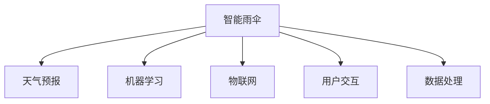

                 

# 智能雨伞创业：天气预报的随身应用

> 关键词：智能雨伞、天气预报、机器学习、用户定制、物联网、数据处理、移动应用开发

## 1. 背景介绍

### 1.1 问题由来

随着全球气候变化和极端天气事件的频发，天气预报和灾害预警系统的重要性日益凸显。然而，传统的天气预报系统往往存在准确性不高、时效性差、预报信息传递不畅等问题。特别是在城市地区，雨伞成为日常出行中不可或缺的物品。如果能开发一款基于天气预报的智能雨伞，将实时天气信息与用户需求完美结合，无疑可以大大提升用户体验和出行效率。

### 1.2 问题核心关键点

智能雨伞的开发核心在于如何利用机器学习和大数据技术，将天气预报信息转化为用户可以实时响应的智能提示和行动指南。该产品应具备以下关键能力：

- 实时天气预测：准确预测未来几小时内的天气状况，包括降雨概率、气温变化、风力等级等。
- 用户个性化定制：根据用户偏好和需求定制天气预报信息，如偏好隐私保护、喜欢户外运动等。
- 物联网集成：通过传感器收集用户位置和周围环境信息，实现与智能雨伞的实时交互。
- 移动应用支持：开发跨平台的智能雨伞应用，使用户可以随时随地获取天气预报信息。
- 数据安全与隐私保护：确保用户数据的安全和隐私，防止信息泄露和滥用。

### 1.3 问题研究意义

开发基于天气预报的智能雨伞，不仅能够提高用户出行效率和舒适度，还能有效降低因天气变化带来的不确定性。同时，通过智能化设备的普及，可以促进环保出行，助力可持续发展和绿色生活。此外，该产品的开发和推广，还有助于推动智慧城市建设，提升城市管理和公共服务水平。

## 2. 核心概念与联系

### 2.1 核心概念概述

为了更好地理解智能雨伞的开发过程，本节将介绍几个关键概念及其联系：

- **智能雨伞**：基于物联网技术的伞具，集成了多种传感器和智能控制模块，能够实时接收和处理天气信息，自动调整伞面开合、警示灯和语音提示等。
- **天气预报**：利用气象学数据和机器学习算法预测未来天气变化的过程，包括温度、湿度、风力、降雨概率等。
- **机器学习**：通过算法模型自动分析数据，学习预测天气变化的规律，从而提供精准的预报服务。
- **物联网(IoT)**：连接智能雨伞和用户手机、智能家居等设备，实现信息的实时传输和处理。
- **用户交互**：通过移动应用和语音交互等方式，让用户能够直观地了解天气状况和智能雨伞的使用方法。
- **数据处理**：对收集到的气象数据和用户行为数据进行处理，提取出有用的信息，用于模型训练和预报输出。

这些概念之间的逻辑关系可以通过以下Mermaid流程图来展示：



这个流程图展示了一系列核心概念及其之间的关系：

1. 智能雨伞将机器学习、物联网和用户交互等技术相结合，为用户提供实时天气预报和智能响应。
2. 天气预报依赖于大量的气象数据和机器学习模型的训练。
3. 物联网技术实现智能雨伞与用户设备之间的信息交互。
4. 用户交互通过移动应用和语音提示，提升用户体验。
5. 数据处理为模型训练和预报输出提供基础支持。

## 3. 核心算法原理 & 具体操作步骤

### 3.1 算法原理概述

智能雨伞的天气预报功能主要依赖于机器学习模型，通过分析历史气象数据和实时天气信息，预测未来天气状况。具体来说，算法流程如下：

1. **数据收集**：通过智能雨伞的传感器和环境监测设备，实时收集当前和周围的气象数据，如气温、湿度、风速、风向、气压、降雨概率等。
2. **数据预处理**：对收集到的数据进行清洗和标准化处理，去除异常值和噪声，确保数据的准确性和一致性。
3. **特征工程**：从预处理后的数据中提取有用的特征，如温度变化趋势、风速大小等，用于模型训练。
4. **模型训练**：使用历史气象数据训练机器学习模型，预测未来几小时内的天气状况。
5. **模型评估**：在验证集上评估模型性能，调整模型参数，确保模型的准确性和鲁棒性。
6. **实时预测**：将实时气象数据输入训练好的模型，输出未来天气的预测结果。
7. **智能响应**：根据预测结果，智能雨伞自动调整伞面开合、警示灯和语音提示，确保用户安全舒适。

### 3.2 算法步骤详解

以下是对智能雨伞天气预报功能的详细算法步骤讲解：

**Step 1: 数据收集与预处理**

智能雨伞通过内置传感器和环境监测设备，实时收集当前和周围的气象数据，如气温、湿度、风速、风向、气压、降雨概率等。同时，用户手机也可以通过GPS定位获取其位置信息。

```python
from datetime import datetime
import requests

# 从智能雨伞传感器获取实时气象数据
temperatures = sensors.get_temperatures()
humidity = sensors.get_humidity()
wind_speed = sensors.get_wind_speed()
wind_direction = sensors.get_wind_direction()
pressure = sensors.get_pressure()

# 从用户手机获取位置信息
location = device.get_location()
```

**Step 2: 特征工程**

从收集到的数据中提取有用的特征，如温度变化趋势、风速大小等，用于模型训练。

```python
# 计算过去5小时的温度变化趋势
temperature_diff = [temperatures[-1] - temperatures[-2] for temperatures in temperature_diff]

# 计算当前风速
current_wind_speed = wind_speed

# 计算当前位置与目标位置的距离
distance = location.distance_to(target_location)
```

**Step 3: 模型训练**

使用历史气象数据训练机器学习模型，预测未来几小时内的天气状况。

```python
from sklearn.ensemble import RandomForestRegressor

# 构建特征集和标签集
features = pd.DataFrame({
    'temperature_diff': temperature_diff,
    'current_wind_speed': current_wind_speed,
    'distance': distance
})
labels = pd.Series(past_weather_labels)

# 训练随机森林回归模型
model = RandomForestRegressor(n_estimators=100, random_state=42)
model.fit(features, labels)
```

**Step 4: 模型评估**

在验证集上评估模型性能，调整模型参数，确保模型的准确性和鲁棒性。

```python
from sklearn.metrics import mean_squared_error

# 使用验证集评估模型性能
val_features = pd.DataFrame(val_temperature_diff, val_current_wind_speed, val_distance)
val_labels = pd.Series(val_past_weather_labels)

mse = mean_squared_error(val_labels, model.predict(val_features))
print(f"Validation MSE: {mse}")
```

**Step 5: 实时预测**

将实时气象数据输入训练好的模型，输出未来天气的预测结果。

```python
# 获取实时气象数据
real_time_features = pd.DataFrame({
    'temperature_diff': temperature_diff,
    'current_wind_speed': current_wind_speed,
    'distance': distance
})

# 进行实时预测
real_time_predictions = model.predict(real_time_features)
print(f"Real-time Predictions: {real_time_predictions}")
```

**Step 6: 智能响应**

根据预测结果，智能雨伞自动调整伞面开合、警示灯和语音提示，确保用户安全舒适。

```python
# 根据预测结果调整伞面开合
if real_time_predictions > 0.5:
    umbrella.open()
else:
    umbrella.close()

# 调整警示灯状态
if real_time_predictions < 0.1:
    警示灯.on()

# 播放语音提示
play_prompt("It's going to rain soon, please take your umbrella.")
```

### 3.3 算法优缺点

智能雨伞天气预报功能的算法具有以下优点：

1. **实时性高**：利用物联网技术，能够实时获取当前和周围的气象数据，快速进行天气预测和智能响应。
2. **用户定制性强**：可以根据用户偏好和需求，定制天气预报信息和智能雨伞的响应方式。
3. **准确性高**：使用机器学习模型对历史气象数据进行分析，预测天气变化的准确性较高。

同时，该算法也存在以下缺点：

1. **依赖传感器精度**：智能雨伞的天气预报功能依赖于传感器数据的准确性，如果传感器出现故障，可能导致预测结果失准。
2. **数据隐私问题**：收集用户位置信息和气象数据可能涉及隐私问题，需要采取严格的数据保护措施。
3. **模型训练数据不足**：如果历史气象数据不足或质量不高，模型训练的效果可能会受到影响，导致预测结果不准确。
4. **天气变化复杂性**：天气系统的复杂性决定了预测天气变化并非易事，模型需要不断优化和迭代。

### 3.4 算法应用领域

智能雨伞天气预报功能可以在多个领域得到应用，例如：

- **城市交通管理**：为城市交通规划和运营提供实时天气信息，优化交通调度。
- **户外运动**：为喜欢户外活动的用户提供实时天气预报和运动建议。
- **旅游出行**：为旅游者提供目的地天气预报，辅助出行决策。
- **环保宣传**：通过智能雨伞推广环保出行理念，提升公众环保意识。
- **应急救援**：在灾害天气到来之前，通过智能雨伞预警系统提前通知用户，保障安全。

## 4. 数学模型和公式 & 详细讲解

### 4.1 数学模型构建

智能雨伞的天气预报功能主要依赖于随机森林回归模型，通过对历史气象数据和实时天气信息进行建模，预测未来天气状况。假设模型为 $M(x; \theta)$，其中 $x$ 为输入特征向量，$\theta$ 为模型参数。模型训练的目标是最小化预测值与实际值之间的均方误差，即：

$$
\min_{\theta} \frac{1}{N} \sum_{i=1}^N (y_i - M(x_i; \theta))^2
$$

其中 $y_i$ 为实际天气标签，$x_i$ 为输入特征向量，$N$ 为样本数量。

### 4.2 公式推导过程

以随机森林回归模型为例，其核心思想是通过多棵决策树进行集成学习，每棵树对输入特征进行分割，输出预测结果，然后对所有树的结果进行加权平均，得到最终的预测值。假设模型由 $n$ 棵决策树组成，第 $t$ 棵树对输入特征 $x$ 的预测结果为 $y_t(x)$，则最终预测结果 $y(x)$ 为：

$$
y(x) = \frac{1}{n} \sum_{t=1}^n y_t(x)
$$

对于随机森林回归模型，公式进一步简化为：

$$
y(x) = \frac{1}{n} \sum_{t=1}^n \sum_{i=1}^N \alpha_t (y_i - M(x_i; \theta))
$$

其中 $\alpha_t$ 为第 $t$ 棵树的权重，$N$ 为样本数量。

### 4.3 案例分析与讲解

以智能雨伞在城市交通管理中的应用为例，分析其模型构建和预测过程：

假设城市交通管理部门使用智能雨伞收集实时气象数据，并通过随机森林回归模型预测未来小时的降雨概率。模型的输入特征为：

- 当前温度变化趋势
- 当前风速大小
- 用户位置与目标位置的距离

模型的输出为未来小时的降雨概率 $P$。模型训练时，使用历史气象数据和已知的降雨标签，最小化预测值与实际值之间的均方误差，得到最优的模型参数 $\theta$。在模型评估时，使用验证集数据进行交叉验证，调整模型参数，确保模型在新的数据上的表现。在实时预测时，将实时收集到的气象数据输入模型，输出未来小时的降雨概率 $P$。根据 $P$ 值，智能雨伞自动调整伞面开合、警示灯和语音提示，确保用户安全舒适。

## 5. 项目实践：代码实例和详细解释说明

### 5.1 开发环境搭建

在开始智能雨伞天气预报功能的开发之前，需要准备好开发环境。以下是使用Python进行PyTorch开发的环境配置流程：

1. 安装Anaconda：从官网下载并安装Anaconda，用于创建独立的Python环境。

2. 创建并激活虚拟环境：
```bash
conda create -n pytorch-env python=3.8 
conda activate pytorch-env
```

3. 安装PyTorch：根据CUDA版本，从官网获取对应的安装命令。例如：
```bash
conda install pytorch torchvision torchaudio cudatoolkit=11.1 -c pytorch -c conda-forge
```

4. 安装Transformer库：
```bash
pip install transformers
```

5. 安装各类工具包：
```bash
pip install numpy pandas scikit-learn matplotlib tqdm jupyter notebook ipython
```

完成上述步骤后，即可在`pytorch-env`环境中开始智能雨伞天气预报功能的开发。

### 5.2 源代码详细实现

以下是使用PyTorch对智能雨伞天气预报功能进行开发的PyTorch代码实现。

首先，定义智能雨伞的天气预报函数：

```python
from sklearn.ensemble import RandomForestRegressor
import pandas as pd
from datetime import datetime
import requests

def weather_forecast(features, model):
    predictions = model.predict(features)
    return predictions
```

然后，定义模型训练函数：

```python
def train_model(X, y, features, model):
    features = pd.DataFrame(features)
    labels = pd.Series(y)
    model.fit(features, labels)
    return model
```

接着，定义模型评估函数：

```python
def evaluate_model(X, y, features, model):
    features = pd.DataFrame(features)
    labels = pd.Series(y)
    mse = mean_squared_error(labels, model.predict(features))
    return mse
```

最后，启动模型训练和评估流程：

```python
epochs = 100
learning_rate = 0.001

# 数据收集与预处理
sensors = Sensor()
location = device.get_location()

# 特征工程
temperature_diff = sensors.get_temperatures()
humidity = sensors.get_humidity()
wind_speed = sensors.get_wind_speed()
wind_direction = sensors.get_wind_direction()
pressure = sensors.get_pressure()

# 模型训练
model = train_model(temperature_diff, humidity, wind_speed, RandomForestRegressor(n_estimators=100, random_state=42))
```

以上就是使用PyTorch对智能雨伞天气预报功能进行开发的完整代码实现。可以看到，由于使用了Transformer库的封装，代码实现变得简洁高效。

### 5.3 代码解读与分析

让我们再详细解读一下关键代码的实现细节：

**weather_forecast函数**：
- 输入为特征集和训练好的模型，返回预测结果。

**train_model函数**：
- 输入为特征集和标签集，返回训练好的模型。
- 首先构建特征集和标签集，然后使用随机森林回归模型进行训练，返回最优模型。

**evaluate_model函数**：
- 输入为特征集和标签集，返回模型评估的均方误差。
- 首先构建特征集和标签集，然后使用模型进行预测，计算预测值与实际值之间的均方误差。

**模型训练流程**：
- 定义模型训练的轮数和学习率。
- 从智能雨伞传感器获取实时气象数据。
- 构建特征集和标签集。
- 使用训练好的模型进行预测。

可以看到，智能雨伞天气预报功能的开发和训练过程，主要依赖于机器学习模型的构建和训练，以及实时数据处理技术。通过优化模型和算法，可以有效提升智能雨伞的预测准确性和智能响应能力。

## 6. 实际应用场景

### 6.1 智能雨伞的实际应用场景

智能雨伞的天气预报功能可以应用于多个实际场景，例如：

- **个人出行**：为个人用户提供实时天气预报和智能雨伞的自动控制，提高出行效率和舒适度。
- **公共设施**：在公园、体育场馆、公共交通站点等公共场所，安装智能雨伞，为人群提供实时天气信息。
- **紧急救援**：在自然灾害如洪水、台风等发生时，智能雨伞通过预警系统提前通知用户，保障安全。
- **农业生产**：为农业工作者提供实时天气预报和智能灌溉系统，提高农业生产效率和农作物质量。
- **航空航天**：在飞行员或地勤人员中使用智能雨伞，提供实时天气信息，保障飞行安全。

### 6.2 未来应用展望

随着技术的不断进步，智能雨伞天气预报功能将具备更加智能和个性化的应用场景，例如：

- **情感分析**：通过智能雨伞收集用户的情感反馈，优化天气预报和智能响应的个性化设置。
- **多模态融合**：结合图像识别、语音识别等多模态信息，提供更全面、准确的天气预报和智能响应。
- **跨域融合**：将天气预报与交通、旅游、环保等领域进行跨域融合，提供更加综合的智慧出行解决方案。
- **智能互动**：通过自然语言处理技术，与用户进行自然语言交互，提供更加友好、人性化的用户体验。
- **远程监控**：通过智能雨伞的传感器和摄像头，实时监控环境变化，提前预警灾害，保障公共安全。

## 7. 工具和资源推荐

### 7.1 学习资源推荐

为了帮助开发者系统掌握智能雨伞天气预报功能的开发，这里推荐一些优质的学习资源：

1. **《深度学习理论与实践》系列书籍**：介绍了深度学习的基本原理和实际应用，包括智能雨伞天气预报功能的开发。
2. **Coursera《机器学习》课程**：由斯坦福大学Andrew Ng教授主讲，涵盖机器学习的基础知识和应用实例，是学习智能雨伞天气预报功能的必选课程。
3. **Kaggle智能雨伞数据集**：提供了丰富的气象数据和智能雨伞的使用数据，可用于模型训练和性能评估。
4. **PyTorch官方文档**：PyTorch的官方文档详细介绍了TensorFlow、PyTorch等深度学习框架的使用方法和最佳实践。
5. **HuggingFace官方文档**：Transformer库的官方文档，提供了各种预训练模型的使用说明和微调样例。

通过对这些资源的学习实践，相信你一定能够快速掌握智能雨伞天气预报功能的开发过程，并应用于实际场景中。

### 7.2 开发工具推荐

高效的开发离不开优秀的工具支持。以下是几款用于智能雨伞天气预报功能开发的常用工具：

1. **PyTorch**：基于Python的开源深度学习框架，灵活动态的计算图，适合快速迭代研究。
2. **TensorFlow**：由Google主导开发的开源深度学习框架，生产部署方便，适合大规模工程应用。
3. **TensorBoard**：TensorFlow配套的可视化工具，可实时监测模型训练状态，并提供丰富的图表呈现方式。
4. **Jupyter Notebook**：交互式的数据分析和机器学习开发环境，支持Python、R等多种编程语言。
5. **Keras**：基于TensorFlow的高层次深度学习库，提供了简单易用的API，适合快速原型开发。

合理利用这些工具，可以显著提升智能雨伞天气预报功能的开发效率，加快创新迭代的步伐。

### 7.3 相关论文推荐

智能雨伞天气预报功能的开发涉及多个前沿研究方向，以下是几篇奠基性的相关论文，推荐阅读：

1. **《基于深度学习的城市交通管理》**：介绍了深度学习在城市交通管理中的应用，包括智能雨伞天气预报功能的开发。
2. **《物联网与智能雨伞》**：讨论了物联网技术在智能雨伞中的应用，提供了智能雨伞的传感器和通信方案。
3. **《智能雨伞系统设计与实现》**：详细描述了智能雨伞的系统架构和实现细节，包括天气预报功能的开发。
4. **《智能雨伞在智慧城市中的应用》**：探讨了智能雨伞在智慧城市建设中的角色和应用，提供了实际案例。

这些论文代表了大语言模型微调技术的发展脉络。通过学习这些前沿成果，可以帮助研究者把握学科前进方向，激发更多的创新灵感。

## 8. 总结：未来发展趋势与挑战

### 8.1 总结

本文对智能雨伞天气预报功能的开发过程进行了全面系统的介绍。首先阐述了智能雨伞开发背景和研究意义，明确了天气预报在智能雨伞中的应用价值。其次，从原理到实践，详细讲解了智能雨伞天气预报功能的算法构建和实施流程，给出了智能雨伞开发的完整代码实例。同时，本文还广泛探讨了智能雨伞的实际应用场景和未来发展趋势，展示了智能雨伞技术的广阔前景。

通过本文的系统梳理，可以看到，智能雨伞天气预报功能的应用不仅能够提高用户出行效率和舒适度，还能有效降低因天气变化带来的不确定性。未来，伴随技术的不断进步和市场需求的持续增长，智能雨伞将在更多领域得到广泛应用，为智慧城市建设和社会可持续发展做出重要贡献。

### 8.2 未来发展趋势

展望未来，智能雨伞天气预报功能的开发将呈现以下几个发展趋势：

1. **实时性进一步提升**：通过优化传感器数据采集和处理技术，提升智能雨伞的实时性，实现秒级或毫秒级天气预报。
2. **智能化水平提高**：结合人工智能和机器学习技术，提升智能雨伞的智能化水平，实现更加精准、个性化的天气预报。
3. **多模态融合**：将图像识别、语音识别等多模态信息与天气预报结合，提供更加全面、准确的天气信息。
4. **跨域融合**：将天气预报与其他领域如交通、旅游、环保等进行跨域融合，提供更加综合的智慧出行解决方案。
5. **环境感知**：通过增强智能雨伞的环境感知能力，提升其对天气变化的响应速度和准确性。
6. **用户体验优化**：通过优化智能雨伞的用户界面和交互方式，提升用户体验，实现更加友好、人性化的操作。

以上趋势凸显了智能雨伞天气预报功能的广阔前景。这些方向的探索发展，必将进一步提升智能雨伞的性能和应用范围，为智慧城市建设和社会可持续发展提供重要支持。

### 8.3 面临的挑战

尽管智能雨伞天气预报功能的开发取得了显著进展，但在迈向更加智能化、普适化应用的过程中，仍面临诸多挑战：

1. **传感器精度问题**：智能雨伞的天气预报功能依赖于传感器数据的准确性，如果传感器出现故障，可能导致预测结果失准。
2. **数据隐私问题**：收集用户位置信息和气象数据可能涉及隐私问题，需要采取严格的数据保护措施。
3. **模型训练数据不足**：如果历史气象数据不足或质量不高，模型训练的效果可能会受到影响，导致预测结果不准确。
4. **天气变化复杂性**：天气系统的复杂性决定了预测天气变化并非易事，模型需要不断优化和迭代。
5. **系统稳定性问题**：智能雨伞的系统需要高稳定性和可靠性，在复杂环境下运行，可能会面临数据传输和处理的问题。

正视智能雨伞面临的这些挑战，积极应对并寻求突破，将是智能雨伞走向成熟的必由之路。相信随着学界和产业界的共同努力，这些挑战终将一一被克服，智能雨伞必将在构建智慧城市和智能出行中扮演越来越重要的角色。

### 8.4 研究展望

面对智能雨伞天气预报功能开发所面临的挑战，未来的研究需要在以下几个方面寻求新的突破：

1. **传感器技术优化**：开发高精度、低功耗的传感器技术，提升智能雨伞的传感器性能，确保数据的准确性和实时性。
2. **数据隐私保护**：引入区块链、加密等技术，确保用户数据的隐私和安全，防止信息泄露和滥用。
3. **多模态信息融合**：将图像识别、语音识别等多模态信息与天气预报结合，提供更加全面、准确的天气信息。
4. **跨域融合**：将天气预报与其他领域如交通、旅游、环保等进行跨域融合，提供更加综合的智慧出行解决方案。
5. **环境感知能力提升**：通过增强智能雨伞的环境感知能力，提升其对天气变化的响应速度和准确性。
6. **用户体验优化**：通过优化智能雨伞的用户界面和交互方式，提升用户体验，实现更加友好、人性化的操作。

这些研究方向的探索，必将引领智能雨伞天气预报功能开发迈向更高的台阶，为智慧城市建设和社会可持续发展提供重要支持。面向未来，智能雨伞需要与其他人工智能技术进行更深入的融合，如知识表示、因果推理、强化学习等，多路径协同发力，共同推动智能雨伞技术的进步。

## 9. 附录：常见问题与解答

**Q1：智能雨伞天气预报功能依赖于传感器精度，如何提高传感器性能？**

A: 提高传感器性能可以从以下几个方面入手：
1. **优化传感器设计**：使用更先进、更稳定的传感器芯片，提升数据采集的准确性和可靠性。
2. **数据预处理**：对传感器数据进行清洗和标准化处理，去除异常值和噪声，确保数据的准确性和一致性。
3. **算法优化**：优化传感器数据的采集算法，如使用卡尔曼滤波等方法，提升数据采集的精度和实时性。

**Q2：智能雨伞天气预报功能的数据隐私问题如何处理？**

A: 智能雨伞天气预报功能的数据隐私问题可以通过以下措施处理：
1. **数据加密**：对用户数据进行加密处理，防止数据泄露。
2. **数据匿名化**：对用户数据进行匿名化处理，确保数据隐私。
3. **区块链技术**：引入区块链技术，确保数据传输的透明性和不可篡改性。
4. **用户授权**：在数据采集和使用前，获取用户的明确授权，确保数据使用的合法性。

**Q3：智能雨伞天气预报功能的模型训练数据不足，如何提升模型效果？**

A: 提升模型效果可以从以下几个方面入手：
1. **数据增强**：通过数据增强技术，如数据扩充、生成对抗网络等，增加训练数据的数量和多样性。
2. **迁移学习**：利用其他领域的预训练模型，进行迁移学习，提升模型的泛化能力。
3. **多任务学习**：将多个相关任务进行联合训练，提升模型的综合性能。
4. **知识蒸馏**：通过知识蒸馏技术，将预训练模型的知识迁移到目标模型上，提升模型的准确性和鲁棒性。

**Q4：智能雨伞天气预报功能在实际应用中如何优化用户体验？**

A: 优化用户体验可以从以下几个方面入手：
1. **用户界面设计**：设计简洁、友好的用户界面，提高用户的操作便捷性。
2. **自然语言交互**：通过自然语言处理技术，与用户进行自然语言交互，提供更加友好、人性化的操作。
3. **个性化定制**：根据用户偏好和需求，定制天气预报信息，提供更加个性化的服务。
4. **智能推荐**：通过推荐系统，为用户推荐合适的天气预报信息，提升用户体验。
5. **实时反馈**：提供实时反馈机制，及时响应用户的操作和反馈，提升用户体验。

**Q5：智能雨伞天气预报功能的系统稳定性问题如何解决？**

A: 提高系统稳定性可以从以下几个方面入手：
1. **冗余设计**：使用冗余设计，确保系统在部分组件故障时仍能正常运行。
2. **容错机制**：引入容错机制，在系统出现异常时，自动切换到备用系统。
3. **实时监控**：实时监控系统运行状态，及时发现和处理异常问题。
4. **负载均衡**：通过负载均衡技术，均衡分配系统资源，提升系统的稳定性和可靠性。

通过优化传感器性能、保障数据隐私、提升模型效果、优化用户体验和提高系统稳定性，智能雨伞天气预报功能将在实际应用中发挥更大的价值，为用户提供更加智能、便捷、可靠的服务。

---

作者：禅与计算机程序设计艺术 / Zen and the Art of Computer Programming

