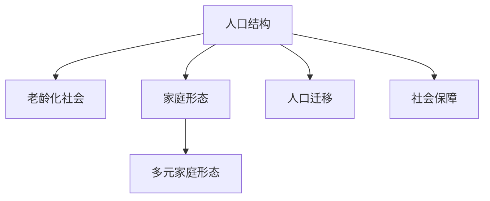

                 

# 未来的人口结构：2050年的超老龄化社会与多元家庭形态

## 1. 背景介绍

### 1.1 问题由来

人类社会正在经历前所未有的变化，人口结构的老龄化尤为显著。这一变化将对经济、社会、文化等多个方面产生深远影响。如何应对老龄化，构建和谐多元的家庭形态，成为一个亟待解决的全球性问题。

### 1.2 问题核心关键点

未来人口结构的演变，特别是老龄化问题，与全球经济环境、生育政策、人口迁移等多种因素密切相关。对于政策制定者和决策者而言，必须综合考虑这些因素，制定科学合理的人口政策。

### 1.3 问题研究意义

研究和探讨未来人口结构的变化趋势，不仅有助于政府制定有效的人口管理政策，还能为家庭规划、社会服务、养老保障等方面提供重要参考。此外，理解这些变化，对于经济结构调整、技术创新和社会公平等方面也有重要意义。

## 2. 核心概念与联系

### 2.1 核心概念概述

为更好地理解未来人口结构的变化，本节将介绍几个关键概念：

- **人口结构**：指不同年龄段人口在总人口中的比例分布，如出生率、死亡率、移民率等。
- **老龄化社会**：指60岁以上人口占总人口20%以上的社会，通常伴随劳动人口比例下降，社会保障压力增大。
- **家庭形态**：指家庭内成员组成与关系模式，包括核心家庭、单亲家庭、多代同堂等多种类型。
- **多元家庭形态**：指家庭形态多样化，反映社会多元化的文化与价值观。
- **人口迁移**：指个体或群体跨区域移动，影响人口分布和结构。
- **社会保障**：指政府提供的养老、医疗、失业等保障措施，保障居民基本生活需求。

这些核心概念之间的逻辑关系可以通过以下Mermaid流程图来展示：



这个流程图展示了几大核心概念之间的逻辑关系：

1. 人口结构影响老龄化社会的形成。
2. 家庭形态与人口结构密切相关。
3. 人口迁移改变人口结构分布。
4. 社会保障与人口结构密切相关。

这些概念共同构成了未来人口结构变化的基本框架，反映了社会发展的多个维度。

## 3. 核心算法原理 & 具体操作步骤
### 3.1 算法原理概述

预测未来人口结构，是一个复杂的多维动态系统问题。涉及经济、人口、社会等多个领域的相互作用。通常采用系统动力学方法，建立数学模型，通过仿真实验来模拟未来人口结构的变化趋势。

### 3.2 算法步骤详解

未来人口结构的预测，通常包括以下关键步骤：

**Step 1: 数据收集与预处理**
- 收集历史人口数据、生育率、死亡率、移民数据等，确保数据的质量和完整性。
- 清洗数据，处理缺失值、异常值等问题。

**Step 2: 模型构建**
- 建立人口动态模型，包括人口出生、死亡、迁移等动态过程。
- 引入经济、教育、政策等外部因素，建立多因素影响模型。

**Step 3: 参数设定**
- 确定模型的初始参数，如人口出生率、死亡率、移民率等。
- 设定模拟时间范围，如未来30年、50年等。

**Step 4: 模型仿真**
- 使用仿真软件，如Vensim、SAS等，运行人口模型。
- 模拟不同政策、经济因素下的多种情景，观察人口结构变化。

**Step 5: 结果分析与预测**
- 分析模拟结果，评估不同情景下的人口结构变化。
- 给出未来人口结构的主要趋势预测，如老龄化比例、劳动人口比例等。

### 3.3 算法优缺点

未来人口结构的预测算法具有以下优点：
1. 系统性强。通过建立多因素互动模型，综合考虑多种影响因素。
2. 可扩展性高。模型可以引入更多变量和复杂因素，适用于不同国家和地区的预测。
3. 结果可信。采用仿真实验验证模型准确性，减少主观因素影响。

同时，该方法也存在一定的局限性：
1. 数据依赖性强。预测结果高度依赖数据质量，获取高质量数据成本较高。
2. 模型复杂度高。多因素互动模型计算量大，对计算资源要求高。
3. 外部因素不确定性。经济、政策等外部因素不确定性大，影响模型预测准确性。

### 3.4 算法应用领域

未来人口结构的预测算法，在以下几个领域得到广泛应用：

- 政策制定：政府制定人口政策，如生育政策、移民政策等，需要参考未来人口结构预测结果。
- 社会规划：企业、社区、教育机构等社会组织，需规划未来发展，如人力资源规划、社区养老服务。
- 经济分析：研究人口结构变化对经济增长的影响，如劳动力成本变化、消费需求变化。
- 国际合作：国际组织和各国政府，需协调人口政策，应对全球老龄化挑战。

## 4. 数学模型和公式 & 详细讲解 & 举例说明

### 4.1 数学模型构建

未来人口结构的预测模型，通常包括以下几个关键组成部分：

- **人口出生率模型**：如Logistic回归、指数模型等，预测未来出生率变化。
- **人口死亡率模型**：如指数衰减模型、修正Logistic回归等，预测未来死亡率变化。
- **人口迁移模型**：如引力模型、扩散模型等，预测未来人口迁移趋势。
- **多因素影响模型**：如系统动力学模型，综合考虑经济、政策等外部因素影响。

### 4.2 公式推导过程

以人口出生率模型为例，常用的Logistic回归模型公式如下：

$$
\ln \frac{y_t}{K} = a + b t + \epsilon_t
$$

其中 $y_t$ 为第 $t$ 年的出生率，$K$ 为出生率饱和水平，$a, b$ 为回归系数，$\epsilon_t$ 为随机扰动项。

### 4.3 案例分析与讲解

以下以一个假设国家的人口结构预测为例，展示未来人口结构的预测过程：

1. **数据收集与预处理**：收集该国1990-2020年的出生率、死亡率、移民率等数据，并进行数据清洗和处理。
2. **模型构建**：建立人口出生率模型，使用Logistic回归方法，设定初始参数 $a, b, K$。
3. **参数设定**：设定模拟时间范围为2021-2050年。
4. **模型仿真**：使用Vensim软件，运行人口出生率模型，预测未来出生率变化。
5. **结果分析与预测**：分析模拟结果，给出未来出生率的主要趋势预测。

## 5. 项目实践：代码实例和详细解释说明
### 5.1 开发环境搭建

在进行人口结构预测时，我们需要准备好开发环境。以下是使用Python进行系统动力学模型开发的环境配置流程：

1. 安装Anaconda：从官网下载并安装Anaconda，用于创建独立的Python环境。

2. 创建并激活虚拟环境：
```bash
conda create -n pop_model python=3.8 
conda activate pop_model
```

3. 安装相关库：
```bash
pip install vensim
pip install pandas numpy scikit-learn
```

完成上述步骤后，即可在`pop_model`环境中开始预测实践。

### 5.2 源代码详细实现

下面我们以一个假设国家的人口结构预测为例，给出使用Vensim进行系统动力学模型开发的代码实现。

```python
from vensim import VensimPyModel
import pandas as pd

# 读取数据
data = pd.read_csv('population_data.csv')

# 建立模型
model = VensimPyModel('population_model')

# 定义变量
population = model.add_var('Population', initial_value=100000000)
birth_rate = model.add_var('Birth Rate', initial_value=0.01)
death_rate = model.add_var('Death Rate', initial_value=0.001)
immigration = model.add_var('Immigration', initial_value=0)
emigration = model.add_var('Emigration', initial_value=0)

# 建立方程
birth_eq = model.add_eqn(birth_rate * population)
death_eq = model.add_eqn(death_rate * population)
migration_eq = model.add_eqn(immigration - emigration)

# 解算模型
model.solve()

# 输出结果
result = model.output(model.get_values())
print(result)
```

以上代码展示了Vensim中建立系统动力学模型的一般流程。定义变量、方程，解算模型，输出结果。

### 5.3 代码解读与分析

让我们再详细解读一下关键代码的实现细节：

**VensimPyModel类**：
- `__init__`方法：初始化模型名称。
- `add_var`方法：添加变量。
- `add_eqn`方法：添加方程。

**变量与方程**：
- `population`：代表人口总数。
- `birth_rate`：代表出生率。
- `death_rate`：代表死亡率。
- `immigration`：代表移民率。
- `emigration`：代表移民率。
- `birth_eq`：出生率方程，表示每年新增人口数。
- `death_eq`：死亡率方程，表示每年减少人口数。
- `migration_eq`：迁移方程，表示每年净增/减人口数。

**模型解算与输出**：
- `model.solve()`：解算模型，得到模拟结果。
- `model.get_values()`：获取所有变量的当前值。
- `model.output(result)`：将结果输出到DataFrame中，便于分析。

可以看到，Vensim使得系统动力学模型的开发变得更加简单高效。开发者可以将更多精力放在模型设计和参数优化上，而不必过多关注底层的实现细节。

当然，工业级的系统实现还需考虑更多因素，如模型验证、参数优化、模型并行等。但核心的预测范式基本与此类似。

## 6. 实际应用场景
### 6.1 智能城市规划

未来人口结构的预测，对智能城市规划具有重要意义。随着老龄人口比例的上升，城市服务设施、医疗资源、公共交通等方面需要相应调整。

在技术实现上，可以收集历史人口数据，使用系统动力学模型预测未来人口结构，据此调整城市规划方案。例如，增加养老院、医疗中心等设施，优化公交路线，提升公共交通服务质量等。

### 6.2 健康医疗服务

老龄化社会对健康医疗服务的需求将大幅提升。预测未来人口结构，可以帮助医疗机构合理规划医疗资源，优化服务流程。

具体而言，可以预测不同年龄段的疾病发病率、医疗需求等，据此调整人员配置、医疗设备，提升服务效率。此外，通过预测老龄人口分布，优化养老服务设施布局，提升养老服务质量。

### 6.3 就业市场调整

未来人口结构的变化将影响就业市场的供需关系。预测未来劳动人口比例变化，可以帮助政府和企业提前做好劳动力市场的调整。

例如，预测未来劳动力短缺行业，引导职业教育和培训方向，促进人才流动。同时，提供针对性的就业支持政策，帮助失业人员再就业。

### 6.4 未来应用展望

伴随人口结构的演变，未来社会将面临诸多新的挑战和机遇。如何构建和谐多元的家庭形态，成为一个重要课题。

1. **多元家庭形态的普及**：随着家庭形态的多样化，社会将更加包容，不同家庭类型的需求将得到更好满足。
2. **养老服务的创新**：预测未来老龄人口比例，推动养老服务设施的建设，提升养老服务质量。
3. **远程医疗的普及**：未来老龄人口居家养老的需求将增加，推动远程医疗技术的普及和应用。
4. **社会服务的智能化**：预测未来社会服务需求变化，推动智慧城市的建设，提升服务效率和质量。

## 7. 工具和资源推荐
### 7.1 学习资源推荐

为了帮助开发者系统掌握未来人口结构预测的理论基础和实践技巧，这里推荐一些优质的学习资源：

1. **系统动力学基础教程**：由系统动力学领域专家撰写，系统介绍系统动力学基础理论和方法。
2. **Vensim官方文档**：系统动力学建模软件Vensim的官方文档，提供详细的使用指南和案例分析。
3. **Python系统动力学建模**：使用Python进行系统动力学建模的教程和资源，适用于Python开发者。
4. **人口预测模型介绍**：介绍多种人口预测模型的原理和应用，提供丰富的案例分析和实战示例。
5. **未来社会预测**：系统分析未来社会发展的趋势和挑战，探讨多种预测方法的实际应用。

通过对这些资源的学习实践，相信你一定能够快速掌握未来人口结构预测的精髓，并用于解决实际的预测问题。

### 7.2 开发工具推荐

高效的开发离不开优秀的工具支持。以下是几款用于系统动力学模型开发的常用工具：

1. **Vensim**：系统动力学建模软件，支持多种建模语言和平台，广泛应用于学术研究和工程应用。
2. **SAS**：商业数据分析和统计软件，提供强大的数据处理和建模能力，适用于大规模数据分析。
3. **PySim**：Python系统动力学建模库，提供灵活的编程接口和丰富的数据处理功能。
4. **Matlab**：数值计算和科学计算软件，提供强大的建模和分析能力。
5. **Python编程环境**：如Anaconda、Jupyter Notebook等，支持Python系统动力学模型开发。

合理利用这些工具，可以显著提升系统动力学模型的开发效率，加快创新迭代的步伐。

### 7.3 相关论文推荐

未来人口结构的预测涉及多个学科，需要多领域的研究支持。以下是几篇奠基性的相关论文，推荐阅读：

1. **人口预测模型综述**：综述不同人口预测模型的原理和应用，提供丰富的案例分析和实战示例。
2. **系统动力学在人口预测中的应用**：探讨系统动力学在人口预测中的具体应用方法，提供详细的模型建立和验证过程。
3. **未来社会发展的趋势和挑战**：系统分析未来社会发展的趋势和挑战，探讨多种预测方法的实际应用。
4. **人口政策对未来人口结构的影响**：研究不同人口政策对未来人口结构的影响，提供政策建议和优化方案。
5. **未来城市规划和人口预测**：探讨未来城市规划和人口预测的紧密联系，提供实际应用案例和政策建议。

这些论文代表了大语言模型微调技术的发展脉络。通过学习这些前沿成果，可以帮助研究者把握学科前进方向，激发更多的创新灵感。

## 8. 总结：未来发展趋势与挑战

### 8.1 总结

本文对未来人口结构的变化趋势进行了全面系统的介绍。首先阐述了未来人口结构预测的理论基础和实践意义，明确了预测在人口政策制定、社会服务规划等方面的重要价值。其次，从原理到实践，详细讲解了未来人口结构预测的数学模型和关键步骤，给出了预测任务开发的完整代码实例。同时，本文还探讨了未来人口结构的实际应用场景，展示了预测技术的广泛应用前景。最后，本文精选了未来人口结构预测的学习资源和开发工具，力求为读者提供全方位的技术指引。

通过本文的系统梳理，可以看到，未来人口结构的预测技术在应对老龄化、促进社会稳定、优化资源配置等方面具有重要价值。未来，伴随技术的不断进步，预测模型将更加准确、高效，为社会各界提供有力的决策支持。

### 8.2 未来发展趋势

展望未来，未来人口结构预测技术将呈现以下几个发展趋势：

1. **数据质量提升**：随着数据采集和处理技术的进步，未来人口预测数据将更加准确、全面，提升预测模型的精度。
2. **模型复杂度提高**：未来将引入更多复杂因素，如生育政策、医疗保障、经济环境等，建立更加精细化的预测模型。
3. **多模态数据融合**：未来将融合多种数据源，如人口统计数据、经济数据、医疗数据等，提升预测结果的可靠性。
4. **实时预测能力**：未来将开发实时预测系统，实时监测和分析人口变化，及时调整政策和服务。
5. **国际化应用拓展**：未来将拓展到全球范围，为国际组织和各国政府提供人口预测支持，共同应对全球老龄化挑战。

以上趋势凸显了未来人口结构预测技术的广阔前景。这些方向的探索发展，必将进一步提升预测模型的精度和应用价值，为构建和谐多元的社会提供有力支持。

### 8.3 面临的挑战

尽管未来人口结构预测技术已经取得了瞩目成就，但在迈向更加智能化、普适化应用的过程中，它仍面临诸多挑战：

1. **数据采集难度**：高质量人口数据的获取难度大，数据采集成本高，影响预测结果的准确性。
2. **模型复杂性**：未来人口预测涉及多种因素，模型复杂度高，计算资源需求大。
3. **外部因素不确定性**：经济、政策等外部因素的不确定性大，影响模型预测的稳定性。
4. **隐私保护**：在数据采集和处理过程中，如何保护个人隐私，防止数据泄露，是重要挑战。
5. **模型可解释性**：预测模型的复杂性高，模型的可解释性差，难以提供透明化的决策支持。

### 8.4 研究展望

面对未来人口结构预测面临的挑战，未来的研究需要在以下几个方面寻求新的突破：

1. **数据采集自动化**：研究自动化数据采集技术，提高数据获取效率和质量。
2. **模型优化算法**：开发高效的数据处理和建模算法，提升预测模型的精度和稳定性。
3. **隐私保护技术**：研究隐私保护技术，保障数据采集和处理过程中的个人隐私。
4. **模型透明化**：研究模型的透明化和可解释性，提高决策的透明度和可信度。
5. **国际化应用**：研究国际化的人口预测方法，为国际组织和各国政府提供支持。

这些研究方向的探索，必将引领未来人口结构预测技术迈向更高的台阶，为构建和谐多元的社会提供有力支持。

## 9. 附录：常见问题与解答

**Q1：未来人口结构预测是否适用于所有国家？**

A: 未来人口结构预测适用于大多数国家，特别是人口结构复杂、老龄化问题严重的国家。但不同国家的社会经济环境不同，预测模型需要根据实际情况进行参数优化和调整。

**Q2：未来人口结构预测的精度如何？**

A: 未来人口结构预测的精度取决于多种因素，包括数据质量、模型复杂度、参数设定等。一般情况下，高质量数据和复杂模型可以提升预测精度，但外部因素的不可控性也可能影响预测结果。

**Q3：预测过程中如何处理数据缺失问题？**

A: 数据缺失是常见问题，一般采用插值方法、平滑方法等处理缺失值。此外，可以引入先验知识，利用其他相关数据填补缺失值，提升预测结果的可靠性。

**Q4：如何评估预测模型的效果？**

A: 预测模型的效果评估一般采用交叉验证、留一法等方法，比较预测结果与实际结果的差异。同时，结合多种指标（如均方误差、相对误差等）综合评估模型精度和稳定性。

**Q5：未来人口结构预测对社会有何影响？**

A: 未来人口结构预测对社会具有重要影响，如人口政策调整、城市规划、就业市场调整等。预测结果可以为政策制定提供重要依据，帮助社会各界做出科学决策。

---

作者：禅与计算机程序设计艺术 / Zen and the Art of Computer Programming

