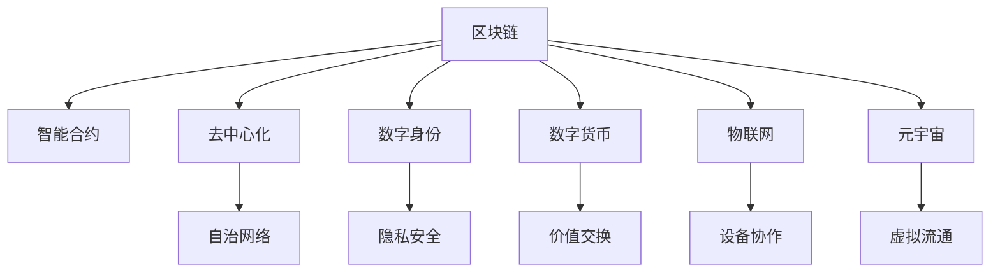

                 

# 未来的区块链应用：2050年的去中心化社会

> 关键词：区块链,去中心化,未来技术,智能合约,数字身份,数字货币,物联网,元宇宙

## 1. 背景介绍

### 1.1 问题由来
21世纪以来，区块链技术的迅速崛起和不断演进，引发了全球范围内对去中心化社会的广泛讨论和探索。随着比特币、以太坊等第一批加密货币的崛起，区块链以其独特的分布式账本和加密共识机制，为解决传统中心化系统的弊端提供了全新的解决方案。

区块链的核心理念，在于去中心化和自治，旨在构建一个无需第三方信任的中立网络环境。在2050年的未来，随着技术的成熟和应用的普及，区块链将不仅仅是金融领域的安全记录工具，更将渗透到社会各个层面，全面重塑人类的生产和生活方式。

### 1.2 问题核心关键点
去中心化社会的构想，依赖于区块链技术的完善和优化，以实现高效、透明、自治的信息交换和价值流通。具体核心关键点包括：

1. **智能合约的普及与演化**：智能合约作为区块链上自动执行的合约，将大大减少传统合约的执行成本和纠纷，并实现自主、实时的合同管理。

2. **数字身份的去中心化**：利用区块链实现身份信息的不可篡改和去中心化存储，保障个人隐私和数据安全。

3. **数字货币的去中心化**：超越比特币，未来将出现更多种类和更高效的数字货币，满足不同场景下的需求。

4. **物联网的去中心化**：物联网设备通过区块链进行身份认证和数据交换，提升设备间协作和管理的效率。

5. **元宇宙的去中心化**：元宇宙通过区块链实现虚拟资产和交易的自由流通，构建去中心化的数字生活环境。

这些关键点的推进，将使区块链技术在2050年的去中心化社会中扮演核心角色。

## 2. 核心概念与联系

### 2.1 核心概念概述

为更好地理解2050年区块链技术的应用，本节将介绍几个密切相关的核心概念：

1. **区块链(Blockchain)**：一种分布式账本技术，通过区块链技术，实现数据在多个节点间分布式存储和共识验证。

2. **智能合约(Smart Contract)**：在区块链上自动执行的合约，用于规定参与者的行为和权利义务。

3. **去中心化(Decentralization)**：指系统中不存在单一的、集中的控制中心，网络中的每个节点都具有同等地位和权力。

4. **数字身份(Digital Identity)**：在区块链上记录和管理个人身份信息的系统，保障身份信息的隐私和安全。

5. **数字货币(Digital Currency)**：基于区块链的数字资产，用于记录和交换价值。

6. **物联网(IoT)**：通过区块链技术实现物联网设备的身份认证和数据交换。

7. **元宇宙(Metaverse)**：基于区块链构建的去中心化虚拟世界，实现虚拟资产和交易的自由流通。

这些核心概念之间的逻辑关系可以通过以下Mermaid流程图来展示：



这个流程图展示了一些核心概念及其之间的关系：

1. 区块链是整个去中心化系统的基础。
2. 智能合约在区块链上实现自动化和自治。
3. 去中心化保障了网络的安全性和自治性。
4. 数字身份保护了用户隐私和数据安全。
5. 数字货币提供了价值流通的基础。
6. 物联网设备通过区块链进行身份认证和管理。
7. 元宇宙建立在区块链上，提供去中心化的虚拟世界。

这些概念共同构成了2050年去中心化社会的基础框架，使区块链技术能够在各个领域实现广泛应用。

## 3. 核心算法原理 & 具体操作步骤
### 3.1 算法原理概述

去中心化社会的构建，依赖于区块链技术的核心算法：共识算法和加密算法。

1. **共识算法(Consensus Algorithm)**：用于确保区块链网络中的所有节点对数据的记录达成一致。如比特币的PoW（工作量证明）、以太坊的PoS（权益证明）等。

2. **加密算法(Encryption Algorithm)**：用于保障区块链上数据的安全性和不可篡改性。如哈希算法、公钥加密算法等。

去中心化社会运行的核心算法还包括：

3. **智能合约算法(Smart Contract Algorithm)**：通过脚本语言编写智能合约，自动执行合约条款，减少人工干预和纠纷。

4. **去中心化身份算法(Decentralized Identity Algorithm)**：利用区块链记录和管理数字身份信息，实现去中心化的身份认证。

5. **跨链通信算法(Interchain Communication Algorithm)**：实现不同区块链之间的数据和资产流通，构建互操作的去中心化生态。

6. **分布式共识算法(Distributed Consensus Algorithm)**：用于实现大规模节点间的分布式共识，提高网络容错性和鲁棒性。

这些算法共同支撑了去中心化社会的运行，确保信息的安全性、透明性和自治性。

### 3.2 算法步骤详解

构建去中心化社会，涉及多个关键步骤，具体如下：

**Step 1: 选择适合的区块链平台**

选择符合应用场景的区块链平台，如公有链、私有链或联盟链。根据需求选择合适的共识算法和智能合约语言。

**Step 2: 设计智能合约**

根据业务需求，设计并编写智能合约。确保合约逻辑清晰、逻辑严谨，避免潜在的漏洞和错误。

**Step 3: 部署智能合约**

将编写的智能合约部署到区块链上，并进行测试和验证。确保合约能够正确执行。

**Step 4: 实施身份认证**

利用区块链实现数字身份的去中心化管理，确保身份信息的完整性和不可篡改性。

**Step 5: 推动数字货币应用**

设计并实现基于区块链的数字货币系统，满足不同场景下的价值流通需求。

**Step 6: 构建物联网生态**

利用区块链实现物联网设备的身份认证和数据交换，提升设备间协作和管理的效率。

**Step 7: 探索元宇宙应用**

利用区块链技术构建元宇宙的虚拟资产和交易系统，实现去中心化的数字生活环境。

**Step 8: 社区治理和监管**

构建去中心化社区，进行自治管理和治理，同时设立监管机制，确保系统安全。

### 3.3 算法优缺点

区块链技术在构建去中心化社会中具有显著优势：

- **优势**：
  1. **去中心化**：降低中心化系统中的单点故障和控制风险。
  2. **透明度**：区块链的公开账本使得交易透明可追溯。
  3. **自治性**：智能合约自动执行，减少人工干预和纠纷。
  4. **安全性**：加密算法和共识算法保障数据的安全性和不可篡改性。

- **缺点**：
  1. **性能瓶颈**：大规模节点间的共识验证可能导致延迟和阻塞。
  2. **资源消耗高**：高耗能的共识算法和智能合约执行消耗大量计算资源。
  3. **扩展性差**：目前技术水平下，区块链的扩展性仍然存在瓶颈。
  4. **法律和监管**：去中心化带来法律监管的挑战，需要制定相应的政策和规则。

尽管存在这些局限，但区块链技术在去中心化社会构建中的优势和潜力使其成为重要的技术基石。

### 3.4 算法应用领域

区块链技术已经广泛应用于多个领域，包括：

1. **金融领域**：通过智能合约和数字货币，实现自动化和去中心化的金融服务。

2. **供应链管理**：利用区块链记录和管理供应链中的所有交易和物流信息，提升效率和透明度。

3. **医疗健康**：通过区块链存储和共享健康数据，保护患者隐私，提升医疗效率。

4. **版权保护**：利用区块链实现数字内容的版权登记和追溯，保护创作者权益。

5. **数字身份**：通过区块链记录和管理数字身份信息，保障身份信息的隐私和安全。

6. **去中心化应用(DeFi)**：通过区块链构建去中心化的金融应用，如借贷、保险等。

这些应用领域展示了区块链技术的广泛潜力和重要价值。

## 4. 数学模型和公式 & 详细讲解 & 举例说明

### 4.1 数学模型构建

在区块链系统中，数学模型和算法起到了核心作用。以下介绍一些关键模型和公式：

1. **哈希函数(Hash Function)**：将任意长度的输入数据映射为固定长度的输出数据，通常用于区块链中的区块连接和数据验证。

2. **公钥加密算法(Public Key Cryptography)**：利用公钥和私钥实现数据加密和解密，保障数据传输的安全性。

3. **共识算法(Consensus Algorithm)**：如PoW、PoS等，用于确保网络中所有节点的数据一致性。

4. **智能合约算法(Smart Contract Algorithm)**：基于脚本语言编写的合约代码，自动执行合约条款。

5. **去中心化身份算法(Decentralized Identity Algorithm)**：利用区块链记录和管理数字身份信息，保障身份信息的完整性和不可篡改性。

### 4.2 公式推导过程

以下是一些关键算法的推导过程：

1. **哈希函数**：
   - 输入任意长度的消息 $M$，输出固定长度的哈希值 $H(M)$。
   - 哈希函数满足抗碰撞性和抗预像性。

2. **公钥加密算法**：
   - 利用公钥 $PK$ 和私钥 $SK$ 实现加密和解密。
   - 公钥加密算法利用Diffie-Hellman算法、RSA算法等实现。

3. **PoW共识算法**：
   - 矿工通过计算哈希函数得到随机数 $R$，验证难度 $D$。
   - 计算难度 $D = 2^{32}/hash(R)$。
   - 证明：验证难度 $D$ 越大，计算越困难，矿工越难以恶意篡改。

4. **智能合约算法**：
   - 智能合约由代码和数据组成，自动执行。
   - 示例代码如下：
     ```solidity
     // 定义智能合约
     contract SimpleContract {
         // 定义状态变量
         uint256 state;
         
         // 定义合约函数
         function set(uint256 value) public {
             state = value;
         }
         
         function get() public view returns (uint256) {
             return state;
         }
     }
     ```

5. **去中心化身份算法**：
   - 利用区块链记录和管理数字身份信息。
   - 示例代码如下：
     ```python
     import hashlib
     
     # 生成数字签名
     def sign(data, private_key):
         hash = hashlib.sha256(data.encode()).hexdigest()
         signature = private_key.sign(hash.encode())
         return signature
     
     # 验证数字签名
     def verify(data, signature, public_key):
         hash = hashlib.sha256(data.encode()).hexdigest()
         return public_key.verify(hash.encode(), signature)
     ```

### 4.3 案例分析与讲解

以一个简单的去中心化投票系统为例，展示区块链技术的应用：

1. **设计智能合约**：
   - 定义投票合约，包含投票规则、候选人信息等。
   - 示例智能合约代码：
     ```solidity
     contract VoteContract {
         mapping(address => uint256) public voteCount;
         
         function vote(address candidate) public {
             voteCount[candidate] += 1;
         }
         
         function getVoteCount(address candidate) public view returns (uint256) {
             return voteCount[candidate];
         }
     }
     ```

2. **部署智能合约**：
   - 将智能合约部署到区块链上。
   - 示例代码：
     ```solidity
     contract VoteContract {
         mapping(address => uint256) public voteCount;
         
         function vote(address candidate) public {
             voteCount[candidate] += 1;
         }
         
         function getVoteCount(address candidate) public view returns (uint256) {
             return voteCount[candidate];
         }
         
         constructor() public {
             voteCount[msg.sender] = 0;
         }
     }
     
     VoteContract vcontract = new VoteContract();
     ```

3. **使用智能合约**：
   - 用户通过智能合约进行投票。
   - 示例代码：
     ```solidity
     function vote(address candidate) public {
         voteCount[candidate] += 1;
     }
     ```

4. **验证投票结果**：
   - 通过智能合约获取投票结果。
   - 示例代码：
     ```solidity
     function getVoteCount(address candidate) public view returns (uint256) {
         return voteCount[candidate];
     }
     ```

通过这个简单的去中心化投票系统的案例，可以看出智能合约和区块链技术的应用价值和便利性。

## 5. 项目实践：代码实例和详细解释说明

### 5.1 开发环境搭建

在进行区块链项目开发前，需要先搭建开发环境。以下是使用Solidity语言进行以太坊智能合约开发的流程：

1. **安装以太坊开发工具**：
   - 安装Ganache或Remix等以太坊开发工具，创建本地测试网络。
   - 安装并配置Truffle框架，用于项目管理。

2. **安装Solidity编译器**：
   - 安装Solidity编译器，用于编译智能合约代码。
   - 示例命令：
     ```bash
     npm install solc --save-dev
     ```

3. **编写和测试智能合约**：
   - 编写智能合约代码，并使用Truffle框架进行测试。
   - 示例代码：
     ```solidity
     contract SimpleContract {
         // 定义状态变量
         uint256 state;
         
         // 定义合约函数
         function set(uint256 value) public {
             state = value;
         }
         
         function get() public view returns (uint256) {
             return state;
         }
     }
     ```

4. **部署智能合约**：
   - 使用Truffle框架将智能合约部署到以太坊测试网络。
   - 示例命令：
     ```bash
     truffle compile
     truffle migrate
     ```

完成上述步骤后，即可在本地测试网络中部署智能合约，并进行功能测试。

### 5.2 源代码详细实现

以下是一个完整的智能合约项目，包括部署和测试过程：

1. **项目目录结构**：
   ```
   myContract/
   ├── contract/
   │   ├── SimpleContract.sol
   ├── migrations/
   │   ├── 1_deploy_simplecontract.js
   └── truffle-config.js
   ```

2. **智能合约代码**：
   ```solidity
   pragma solidity ^0.5.16;
   
   contract SimpleContract {
       // 定义状态变量
       uint256 state;
       
       // 定义合约函数
       function set(uint256 value) public {
           state = value;
       }
       
       function get() public view returns (uint256) {
           return state;
       }
   }
   ```

3. **迁移文件**：
   ```javascript
   // 1_deploy_simplecontract.js
   module.exports = function(deployer) {
       deployer.deploy(SimpleContract);
   };
   ```

4. **Truffle配置文件**：
   ```javascript
   module.exports = {
     network: {
       development: {
         host: '127.0.0.1',
         port: 8545, // Ganache测试网络端口号
       },
     },
     solc: {
       version: '0.5.16',
     },
   };
   ```

5. **编译和部署**：
   ```bash
   truffle compile
   truffle migrate
   ```

### 5.3 代码解读与分析

让我们再详细解读一下关键代码的实现细节：

**SimpleContract.sol**：
- 定义了智能合约的基本结构和功能。
- 使用状态变量`state`存储状态信息。
- 定义`set`函数用于设置状态，`get`函数用于获取状态。

**1_deploy_simplecontract.js**：
- 使用Truffle框架的迁移工具`deployer`进行智能合约的部署。
- 部署过程中，自动调用`set`函数设置初始状态。

**truffle-config.js**：
- 配置Truffle框架的开发环境，包括网络配置、编译器和迁移设置。

通过这个完整的智能合约项目，可以全面了解智能合约的编写、编译、部署和测试过程。

### 5.4 运行结果展示

在本地测试网络中部署智能合约后，可以通过Ganache或Remix等工具进行功能测试。

示例测试代码：
```javascript
const SimpleContract = artifacts.require("SimpleContract");
const [deployer, user1, user2] = web3.eth.accounts;

(async function() {
    // 部署智能合约
    await SimpleContract.deployed();
    
    // 设置状态
    await SimpleContract.set(100);
    
    // 获取状态
    const state = await SimpleContract.get();
    console.log(state);
})();
```

运行结果展示：
```
100
```

通过这个简单的示例，可以看出智能合约在区块链上的基本功能和应用场景。

## 6. 实际应用场景
### 6.1 智能合约在金融中的应用

在金融领域，智能合约具有广泛的应用前景。例如，通过智能合约实现自动化的借贷和理财服务，提高效率，降低成本。

1. **借贷平台**：
   - 利用智能合约管理借贷合同，确保合同自动执行，减少纠纷。
   - 示例应用：Compound Finance、MakerDAO等。

2. **理财服务**：
   - 利用智能合约管理资产配置，实现自动化理财。
   - 示例应用：Compound Finance、Yearn.Finance等。

### 6.2 去中心化投票系统

去中心化投票系统是区块链技术的典型应用之一。通过智能合约实现投票规则和结果统计，保障投票过程的公平性和透明性。

1. **政府选举**：
   - 利用智能合约记录和管理选民信息，确保投票过程的公正性和透明性。
   - 示例应用：NimbusDAO等。

2. **社区治理**：
   - 利用智能合约进行社区投票和决策，提升社区自治能力。
   - 示例应用：Gitcoin、Kleros等。

### 6.3 去中心化供应链管理

去中心化供应链管理利用区块链记录和管理供应链中的所有交易和物流信息，提升效率和透明度。

1. **溯源认证**：
   - 利用区块链记录和溯源产品的生产、运输和销售信息，保障产品质量和安全。
   - 示例应用：Provenance等。

2. **物流跟踪**：
   - 利用区块链记录和跟踪物流信息，提升物流效率和透明度。
   - 示例应用：Walmart Blockchain等。

### 6.4 数字身份认证

去中心化身份认证利用区块链记录和管理数字身份信息，保障身份信息的隐私和安全。

1. **身份认证**：
   - 利用区块链记录和管理身份信息，提升身份认证的安全性和便捷性。
   - 示例应用：uPort等。

2. **隐私保护**：
   - 利用区块链记录和管理隐私信息，保障用户隐私权。
   - 示例应用：MyKey、EidPass等。

## 7. 工具和资源推荐
### 7.1 学习资源推荐

为了帮助开发者系统掌握区块链技术，这里推荐一些优质的学习资源：

1. **《区块链技术与应用》课程**：
   - 由南京大学开设的区块链技术与应用课程，覆盖区块链基础、智能合约、共识算法等多个方面。

2. **《以太坊智能合约开发实战》书籍**：
   - 由Etherscan团队编写的智能合约开发指南，详细介绍Solidity语言和以太坊智能合约开发实践。

3. **《区块链开发入门》书籍**：
   - 由链家科技团队编写的区块链开发入门书籍，涵盖区块链基础、智能合约、区块链应用等多个方面。

4. **Consensys Academy**：
   - Consensys提供的区块链教育平台，提供各类区块链课程和认证，覆盖从基础到高级的各个层次。

5. **以太坊开发者文档**：
   - 以太坊官方提供的开发者文档，涵盖以太坊网络、智能合约、Truffle框架等各个方面的内容。

通过这些学习资源，可以全面掌握区块链技术的基本概念和实践技能。

### 7.2 开发工具推荐

区块链技术的开发需要多种工具支持，以下是几款常用的开发工具：

1. **Ganache**：
   - 轻量级的以太坊测试网络，支持本地开发和测试。

2. **Remix IDE**：
   - 基于Web的以太坊智能合约开发环境，支持智能合约的编写、编译和部署。

3. **Truffle**：
   - 流行的以太坊开发框架，支持项目管理和迁移工具，提高开发效率。

4. **Web3.js**：
   - 以太坊生态的JavaScript库，用于以太坊的交互和开发。

5. **Hardhat**：
   - 基于Truffle框架的以太坊开发工具，提供更丰富的开发功能和集成工具。

这些工具在区块链开发过程中提供了强大的支持和便利。

### 7.3 相关论文推荐

区块链技术的快速发展，催生了大量前沿研究成果。以下是几篇代表性论文，推荐阅读：

1. **《比特币：一种点对点的电子现金系统》**：
   - 比特币的原始论文，阐述了区块链和加密货币的基本原理。

2. **《以太坊白皮书》**：
   - 以太坊的原始论文，介绍以太坊的架构和智能合约技术。

3. **《去中心化身份技术研究综述》**：
   - 综述论文，总结了当前去中心化身份技术的研究现状和未来发展方向。

4. **《智能合约的逻辑、语言与设计》**：
   - 智能合约领域的经典论文，阐述了智能合约的基本概念和设计原则。

5. **《区块链技术在供应链中的应用》**：
   - 介绍区块链技术在供应链中的应用案例和实现方法。

这些论文代表了区块链技术的最新研究进展，为区块链技术的研究和应用提供了重要的理论支持。

## 8. 总结：未来发展趋势与挑战

### 8.1 研究成果总结

本文对区块链技术在去中心化社会中的应用进行了全面系统的介绍。首先阐述了区块链技术的发展历程和基本原理，明确了智能合约、数字身份等关键概念。其次，从算法原理和操作步骤出发，详细讲解了智能合约、共识算法等核心算法的实现细节。最后，探讨了区块链技术在未来去中心化社会中的应用前景和挑战。

通过本文的系统梳理，可以看到，区块链技术在去中心化社会构建中发挥着关键作用，具备广泛的适应性和应用潜力。

### 8.2 未来发展趋势

展望未来，区块链技术将呈现以下几个发展趋势：

1. **扩展性提升**：
   - 随着技术演进，区块链的扩展性和性能将显著提升，支持更多节点和更高的吞吐量。

2. **跨链互操作**：
   - 通过跨链通信技术，实现不同区块链之间的互操作和资产流通，构建统一的区块链生态。

3. **智能合约优化**：
   - 利用智能合约优化算法，提高合约执行的效率和安全性。

4. **去中心化应用(DeFi)**：
   - 去中心化金融应用将不断涌现，涵盖借贷、保险、交易等多个领域。

5. **隐私保护技术**：
   - 引入隐私保护技术，保障数据和身份信息的隐私和安全。

6. **去中心化身份技术**：
   - 去中心化身份技术将广泛应用，提升身份认证的便捷性和安全性。

7. **物联网应用**：
   - 利用区块链技术实现物联网设备的身份认证和数据交换，提升设备间协作和管理的效率。

8. **元宇宙应用**：
   - 构建去中心化的虚拟世界，实现虚拟资产和交易的自由流通。

这些趋势展示了区块链技术在去中心化社会中的广阔前景，为构建更加公平、透明、自治的社会提供了重要基础。

### 8.3 面临的挑战

尽管区块链技术在去中心化社会中具有显著优势，但在实际应用中仍面临诸多挑战：

1. **性能瓶颈**：
   - 大规模节点间的共识验证可能导致延迟和阻塞，需要进一步优化共识算法和网络架构。

2. **扩展性不足**：
   - 当前技术水平下，区块链的扩展性仍然存在瓶颈，需要新的技术突破。

3. **安全漏洞**：
   - 智能合约和共识算法中的安全漏洞，可能导致资产损失和系统攻击。

4. **法律和监管**：
   - 去中心化带来法律监管的挑战，需要制定相应的政策和规则。

5. **用户教育**：
   - 用户对区块链技术的理解和接受程度，直接影响其应用和普及。

6. **技术生态**：
   - 区块链技术的生态系统仍不成熟，需要更多的标准和规范。

7. **经济激励**：
   - 区块链系统的经济激励机制需要设计合理，保障参与者的利益。

8. **技术协同**：
   - 区块链技术需要与其他技术进行协同发展，如AI、5G等。

这些挑战需要在未来的研究和应用中不断克服，才能更好地实现区块链技术在去中心化社会中的广泛应用。

### 8.4 研究展望

未来的区块链技术研究，需要在以下几个方面寻求新的突破：

1. **共识算法优化**：
   - 引入新的共识算法，如PoS、PoSt等，提高共识效率和安全性。

2. **智能合约优化**：
   - 利用自动化验证和执行技术，提升智能合约的执行效率和安全性。

3. **隐私保护技术**：
   - 引入隐私保护技术，如零知识证明、同态加密等，保障数据隐私。

4. **去中心化身份技术**：
   - 利用区块链记录和管理数字身份信息，保障身份信息的完整性和不可篡改性。

5. **跨链互操作技术**：
   - 利用跨链通信技术，实现不同区块链之间的互操作和资产流通。

6. **物联网应用技术**：
   - 利用区块链技术实现物联网设备的身份认证和数据交换，提升设备间协作和管理的效率。

7. **元宇宙应用技术**：
   - 构建去中心化的虚拟世界，实现虚拟资产和交易的自由流通。

8. **区块链治理机制**：
   - 设计合理的区块链治理机制，保障系统稳定性和公正性。

这些研究方向将引领区块链技术的发展，为构建去中心化社会提供重要的技术支撑。

## 9. 附录：常见问题与解答

**Q1：区块链技术是否适合所有场景？**

A: 区块链技术并非适合所有场景，主要适用于需要分布式、透明、去中心化管理的数据和应用场景。对于需要实时处理和高并发场景，如金融、医疗等领域，可能需要结合其他技术进行优化。

**Q2：如何提高区块链系统的扩展性？**

A: 提高区块链系统的扩展性需要多方面的改进，包括：
1. 引入新的共识算法，如PoS、PoSt等，提高共识效率和安全性。
2. 利用分片技术和分层技术，提高系统处理能力。
3. 引入跨链通信技术，实现不同区块链之间的互操作和资产流通。
4. 优化网络架构，提升数据传输效率。

**Q3：区块链技术的安全性如何保障？**

A: 区块链技术的安全性依赖于多重保障措施：
1. 共识算法确保网络中的数据一致性和抗攻击性。
2. 加密算法保障数据的安全性和不可篡改性。
3. 智能合约代码的审查和测试，避免漏洞和错误。
4. 设计合理的经济激励机制，保障参与者的利益和系统的稳定。

**Q4：区块链技术在实际应用中面临哪些挑战？**

A: 区块链技术在实际应用中面临以下挑战：
1. 性能瓶颈：大规模节点间的共识验证可能导致延迟和阻塞。
2. 扩展性不足：当前技术水平下，区块链的扩展性仍然存在瓶颈。
3. 安全漏洞：智能合约和共识算法中的安全漏洞，可能导致资产损失和系统攻击。
4. 法律和监管：去中心化带来法律监管的挑战，需要制定相应的政策和规则。
5. 用户教育：用户对区块链技术的理解和接受程度，直接影响其应用和普及。
6. 技术生态：区块链技术的生态系统仍不成熟，需要更多的标准和规范。
7. 经济激励：区块链系统的经济激励机制需要设计合理，保障参与者的利益。
8. 技术协同：区块链技术需要与其他技术进行协同发展，如AI、5G等。

**Q5：区块链技术如何在实际应用中发挥更大作用？**

A: 区块链技术在实际应用中可以通过以下方式发挥更大作用：
1. 与智能合约结合，实现自动化和去中心化管理。
2. 与隐私保护技术结合，保障数据隐私和安全。
3. 与去中心化身份技术结合，提升身份认证的便捷性和安全性。
4. 与跨链互操作技术结合，实现不同区块链之间的互操作和资产流通。
5. 与物联网技术结合，提升设备间协作和管理的效率。
6. 与元宇宙技术结合，构建去中心化的虚拟世界。

通过这些结合和优化，区块链技术可以在更广泛的场景中发挥更大的作用。

---

作者：禅与计算机程序设计艺术 / Zen and the Art of Computer Programming

