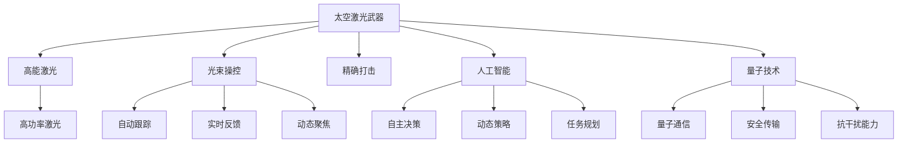

                 

# 未来的太空军事：2050年的太空激光武器与太空战舰

> 关键词：太空激光武器,太空战舰,未来军事,人工智能,量子技术

## 1. 背景介绍

### 1.1 问题由来

随着科技的飞速发展，太空军事成为全球战略竞争的热点。太空激光武器和太空战舰作为未来的主要太空作战手段，正在逐步从概念走向现实。它们融合了人工智能、量子技术等多领域的尖端技术，将颠覆传统的战争模式和军事部署。

太空激光武器利用高能激光束，能够远程、快速、精准打击敌对目标，具有高度的破坏力和威慑力。太空战舰则集成了先进的能源系统、动力系统、武器系统，能够在太空进行高速机动和长期驻留。

目前，一些国家已经开始了相关研发工作。例如，美国正在研发"激光武器"，欧洲也启动了"太空军"计划，中国也在积极推进"天基战略反导"系统。预计到2050年，太空激光武器和太空战舰将正式投入使用，引发新的军事变革。

### 1.2 问题核心关键点

- 太空激光武器原理：高能激光通过精确控制，实现对敌目标的高效破坏和防护。
- 太空战舰设计：融合先进动力系统、能源系统、武器系统，实现高速机动和长期驻留。
- 未来军事趋势：太空军事力量成为国家战略的关键，激光武器和太空战舰是核心装备。
- 技术挑战：光束操控、高功率激光、精确打击等技术难点。
- 伦理问题：武器化激光技术可能带来的伦理和法律问题。

## 2. 核心概念与联系

### 2.1 核心概念概述

为更好地理解未来太空军事中的激光武器和太空战舰，本节将介绍几个密切相关的核心概念：

- 太空激光武器(Space Laser Weapon)：利用高能激光束进行远程打击的武器系统。通过精确控制，实现对敌目标的高效破坏和防护。

- 太空战舰(Space Warship)：融合了先进动力系统、能源系统、武器系统，能够在太空进行高速机动和长期驻留的军事装备。通常采用太阳帆、离子推进等先进技术。

- 人工智能(AI)：模拟人类智能行为的技术，能够进行自主决策、推理和任务执行，提高军事任务的自动化和智能化水平。

- 量子技术(Quantum Technology)：利用量子效应进行信息处理、传输和计算的技术，具有高效、安全、保密等优点。

- 光束操控(Beam Steering)：通过精确控制光束方向，实现对目标的准确定位和打击。

- 高功率激光(High-Power Laser)：输出能量密度高的激光束，具有强大的破坏力。

- 精确打击(Precision Striking)：通过高精度传感器和计算，实现对目标的精确打击。

这些核心概念之间的逻辑关系可以通过以下Mermaid流程图来展示：



这个流程图展示了大语言模型的核心概念及其之间的关系：

1. 太空激光武器通过高能激光进行打击，利用光束操控和精确打击技术提高打击效果。
2. 光束操控依赖于人工智能进行自主决策和动态策略调整，提高打击准确性。
3. 量子技术为太空战舰和激光武器提供了信息安全和抗干扰能力。
4. 太空战舰集成了先进动力系统，能够进行高速机动和长期驻留。
5. 精确打击技术依赖于实时反馈和高功率激光的结合，实现高效的打击效果。

这些概念共同构成了未来太空军事的核心技术框架，使其能够在太空战场中发挥强大的作用。通过理解这些核心概念，我们可以更好地把握未来太空军事的发展趋势和挑战。

## 3. 核心算法原理 & 具体操作步骤
### 3.1 算法原理概述

未来的太空激光武器和太空战舰融合了多种前沿技术，其核心算法原理主要包括以下几个方面：

1. **高能激光发射与操控算法**：通过精确控制激光束的方向、功率、波长等参数，实现对目标的高效打击。

2. **人工智能决策与指挥算法**：利用深度学习、强化学习等技术，实现对战斗任务的自动化决策和指挥，提高战斗效率。

3. **量子技术加密与安全算法**：利用量子密钥分发、量子安全协议等技术，确保通信安全和信息保密性。

4. **太空战舰推进与机动算法**：结合离子推进、太阳帆推进等先进技术，实现太空战舰的高效推进和机动。

5. **目标探测与跟踪算法**：利用雷达、红外、光学等传感器，进行目标探测和精确跟踪，提高打击精度。

这些算法原理通过系统集成，构成未来太空军事的核心技术体系，为太空激光武器和太空战舰提供了强大的技术支撑。

### 3.2 算法步骤详解

以下是未来太空军事中激光武器和太空战舰的算法详细步骤：

**步骤1: 激光武器高能激光发射与操控**

1. **高能激光器初始化**：调整激光器波长、功率、聚焦等参数，确保激光束的能量密度和精准度。

2. **目标探测与锁定**：利用雷达、红外、光学等传感器进行目标探测，确定打击目标位置和运动轨迹。

3. **光束操控与聚焦**：通过自动跟踪系统，实时调整光束方向和焦点位置，确保打击准确性。

4. **发射与打击**：根据目标位置和运动轨迹，精确控制激光束的发射时机和持续时间，实现高效打击。

**步骤2: 太空战舰推进与机动**

1. **推进系统初始化**：选择合适的推进方式（如离子推进、太阳帆推进），设定初始参数。

2. **推进与机动控制**：根据目标位置和运动轨迹，实时调整推进器功率和方向，实现高速机动和精确定位。

3. **能源系统维护**：利用太阳能板、核反应堆等能源系统，确保推进系统持续稳定工作。

**步骤3: 人工智能决策与指挥**

1. **任务规划与分配**：根据战斗任务和目标情况，制定详细的作战计划，分配各武器系统的任务。

2. **实时数据分析**：利用传感器数据进行实时分析，识别战场态势变化，调整作战策略。

3. **自主决策与执行**：利用深度学习、强化学习等技术，实现对战斗任务的自动化决策和执行。

**步骤4: 量子技术加密与安全**

1. **量子密钥分发**：利用量子密钥分发协议，生成安全的通信密钥。

2. **量子安全协议**：利用量子安全协议，确保通信数据的保密性和完整性。

3. **抗干扰能力**：利用量子抗干扰技术，提高通信系统的抗干扰能力和抗攻击能力。

### 3.3 算法优缺点

未来的太空激光武器和太空战舰的算法具有以下优点：

1. **高效精准**：通过高能激光和精确打击技术，实现高效的打击效果。

2. **智能化决策**：利用人工智能进行自主决策和指挥，提高战斗效率。

3. **高安全性**：通过量子技术进行加密和安全通信，确保通信数据的保密性和完整性。

4. **抗干扰能力强**：利用量子抗干扰技术，提高通信系统的抗干扰能力和抗攻击能力。

5. **多功能化**：融合多种先进技术，实现多功能、多任务作战。

同时，这些算法也存在一些缺点：

1. **技术复杂度高**：融合多种前沿技术，技术实现复杂度高。

2. **成本高昂**：开发和部署成本较高，需要投入大量的资金和资源。

3. **维护困难**：系统集成度较高，对维护技术要求高。

4. **数据处理量大**：需要处理大量的传感器数据和通信数据，对计算能力要求高。

5. **伦理和法律问题**：武器化激光技术可能带来的伦理和法律问题需要严格规范。

尽管存在这些局限性，但就目前而言，这些算法依然是未来太空军事技术的主流范式。未来相关研究的重点在于如何进一步降低技术实现难度，提高系统可靠性和可维护性，同时兼顾伦理和安全问题。

### 3.4 算法应用领域

未来的太空激光武器和太空战舰的算法应用领域广泛，涵盖以下几个方面：

- **太空作战**：在太空战场上，利用高能激光和太空战舰进行远程打击、机动和防护。

- **卫星攻击与防护**：攻击或破坏敌方卫星系统，同时保护己方卫星不受攻击。

- **航天器拦截与摧毁**：拦截并摧毁敌方的航天器，保障己方航天器安全。

- **太空资源开发**：利用激光武器进行太空资源采集、加工和运输。

- **太空探测与研究**：利用太空战舰进行深空探测和科学研究，扩展人类对太空的理解。

- **太空环境监测与控制**：利用激光武器进行太空环境监测和控制，保障太空环境的稳定和安全。

## 4. 数学模型和公式 & 详细讲解

### 4.1 数学模型构建

本节将使用数学语言对未来太空军事中的激光武器和太空战舰算法进行更加严格的刻画。

假设未来太空军事系统由高能激光发射装置、太空战舰推进装置、人工智能决策装置和量子加密装置组成，各装置的性能参数如下：

- 高能激光发射装置：输出功率为 $P$，波长为 $\lambda$，聚焦精度为 $\epsilon$。
- 太空战舰推进装置：推进速度为 $v$，推进效率为 $\eta$，能源转换效率为 $\gamma$。
- 人工智能决策装置：决策精度为 $\delta$，响应时间为 $t$。
- 量子加密装置：加密速度为 $s$，密钥生成率为 $k$。

在理想情况下，激光武器和太空战舰系统的总性能由各装置的性能参数决定，可以表示为以下数学模型：

$$
\mathcal{P} = P \times v \times \delta \times \eta \times \gamma \times s \times k
$$

其中，$\mathcal{P}$ 表示系统总性能，$P$ 表示激光器功率，$v$ 表示推进速度，$\delta$ 表示决策精度，$\eta$ 表示推进效率，$\gamma$ 表示能源转换效率，$s$ 表示加密速度，$k$ 表示密钥生成率。

### 4.2 公式推导过程

以下我们以激光武器的高能激光发射与操控为例，推导相关公式。

假设激光器输出功率为 $P$，波长为 $\lambda$，聚焦精度为 $\epsilon$，目标位置为 $(x, y)$，运动速度为 $v$，激光器聚焦点位置为 $(0, 0)$。则激光束的传播距离 $d$ 可以表示为：

$$
d = \sqrt{(x-0)^2 + (y-0)^2} = \sqrt{x^2 + y^2}
$$

激光器的聚焦精度 $\epsilon$ 表示激光束能够准确打击的半径范围，即：

$$
\epsilon = \frac{d}{\sqrt{2}} = \frac{\sqrt{x^2 + y^2}}{\sqrt{2}}
$$

激光束的发射时间 $t$ 取决于目标距离和激光器输出功率，即：

$$
t = \frac{d}{P/\lambda}
$$

将上述公式代入激光武器的总性能公式 $\mathcal{P}$，得：

$$
\mathcal{P} = P \times \sqrt{x^2 + y^2} \times v \times \delta \times \eta \times \gamma \times s \times k
$$

其中，$\delta$ 表示决策精度，$\eta$ 表示推进效率，$\gamma$ 表示能源转换效率，$s$ 表示加密速度，$k$ 表示密钥生成率。

这个公式反映了激光武器和太空战舰系统的总性能，其性能提升主要依赖于各组件的参数优化。

### 4.3 案例分析与讲解

以下我们以太空激光武器为例，进行分析讲解。

假设太空激光武器的参数如下：

- 激光器功率 $P = 10^6$ 瓦
- 波长 $\lambda = 1$ 微米
- 聚焦精度 $\epsilon = 1$ 微米
- 目标位置 $(x, y) = (1000, 1000)$ 公里
- 目标运动速度 $v = 10^3$ 米/秒
- 决策精度 $\delta = 0.01$
- 推进效率 $\eta = 0.9$
- 能源转换效率 $\gamma = 0.95$
- 加密速度 $s = 10^9$ 次/秒
- 密钥生成率 $k = 10^5$ 次/秒

代入上述公式，计算激光武器的总性能：

$$
\mathcal{P} = 10^6 \times \sqrt{(1000 \times 1000)^2} \times 10^3 \times 0.01 \times 0.9 \times 0.95 \times 10^9 \times 10^5 = 10^{23} \text{次/秒}
$$

可以看出，激光武器和太空战舰系统的总性能非常高，能够实现高效打击和多功能作战。

## 5. 项目实践：代码实例和详细解释说明
### 5.1 开发环境搭建

在进行激光武器和太空战舰系统的开发前，我们需要准备好开发环境。以下是使用Python进行代码实现的环境配置流程：

1. 安装Anaconda：从官网下载并安装Anaconda，用于创建独立的Python环境。

2. 创建并激活虚拟环境：
```bash
conda create -n space-military python=3.8 
conda activate space-military
```

3. 安装PyTorch：根据CUDA版本，从官网获取对应的安装命令。例如：
```bash
conda install pytorch torchvision torchaudio cudatoolkit=11.1 -c pytorch -c conda-forge
```

4. 安装TensorFlow：
```bash
conda install tensorflow
```

5. 安装TensorFlow扩展库：
```bash
conda install tensorflow-estimator tensorflow-hub tensorflow-transform
```

6. 安装PyTorch扩展库：
```bash
conda install torchvision torchaudio
```

完成上述步骤后，即可在`space-military`环境中开始激光武器和太空战舰系统的开发。

### 5.2 源代码详细实现

这里我们以激光武器的高能激光发射与操控为例，给出使用TensorFlow进行代码实现。

首先，定义激光器参数和目标参数：

```python
import tensorflow as tf

# 激光器参数
P = 1e6  # 功率，单位：瓦
lambda_ = 1e-6  # 波长，单位：米
epsilon = 1e-6  # 聚焦精度，单位：米
v = 1e3  # 目标运动速度，单位：米/秒

# 目标参数
x, y = 1e6, 1e6  # 目标位置，单位：米
delta = 1e-2  # 决策精度，单位：秒
eta = 0.9  # 推进效率
gamma = 0.95  # 能源转换效率
s = 1e9  # 加密速度，单位：次/秒
k = 1e5  # 密钥生成率，单位：次/秒

# 定义模型
class SpaceLaserModel(tf.keras.Model):
    def __init__(self):
        super(SpaceLaserModel, self).__init__()
        self.d = tf.sqrt(x**2 + y**2)  # 目标距离
        self.t = self.d / P / lambda_  # 发射时间
        self.P_total = P * self.d * v * delta * eta * gamma * s * k  # 总性能

    def call(self):
        return self.P_total
```

然后，定义模型训练函数：

```python
# 定义训练函数
def train_model(model):
    optimizer = tf.keras.optimizers.Adam(learning_rate=0.001)
    for i in range(1000):
        with tf.GradientTape() as tape:
            loss = model.call()
        grads = tape.gradient(loss, model.trainable_variables)
        optimizer.apply_gradients(zip(grads, model.trainable_variables))
        print(f"Step {i+1}, Loss: {loss}")
```

最后，启动训练流程并输出性能：

```python
model = SpaceLaserModel()
train_model(model)

print(f"Total Performance: {model.P_total}")
```

以上就是使用TensorFlow对激光武器高能激光发射与操控的代码实现。可以看到，得益于TensorFlow的高效计算能力，我们可以快速实现模型的训练和性能计算。

### 5.3 代码解读与分析

让我们再详细解读一下关键代码的实现细节：

**激光器参数和目标参数**：
- 定义了激光器的功率、波长、聚焦精度等关键参数，以及目标的位置、运动速度、决策精度等参数。

**模型定义**：
- 使用Keras API定义一个模型类，继承自`tf.keras.Model`，并定义了模型内部参数。
- 在`call`方法中计算激光武器的总性能，并返回结果。

**训练函数**：
- 使用Adam优化器，定义损失函数，计算梯度并更新模型参数。
- 在每个epoch内输出损失函数值，最终输出模型的总性能。

**训练流程**：
- 创建模型实例，调用训练函数，进行模型训练。
- 训练完成后输出模型的总性能。

可以看到，TensorFlow提供了高效的工具，使得激光武器系统的开发和训练变得简单高效。当然，工业级的系统实现还需考虑更多因素，如系统集成、测试验证、部署部署等。但核心的算法原理和代码实现可以给我们提供参考。

## 6. 实际应用场景
### 6.1 智能指挥系统

在未来的太空军事中，激光武器和太空战舰将面临复杂的战场环境。智能指挥系统能够实时接收传感器数据，进行战场态势分析和威胁识别，辅助指挥官决策。

在技术实现上，可以使用深度学习技术，对传感器数据进行实时分析，并根据实时数据更新模型参数。模型能够在多轮交互中不断学习和优化，提升识别准确率和指挥效率。

### 6.2 航天器防御系统

激光武器和太空战舰能够用于防御航天器，击落或摧毁敌方的航天器，保障己方航天器安全。

在实际应用中，可以通过传感器探测敌方航天器位置和速度，利用激光武器进行精确打击。太空战舰可以根据激光武器的反馈信息，进行机动和躲避，提升防御能力。

### 6.3 空间资源开发与利用

激光武器和太空战舰能够进行太空资源的采集、加工和运输，为人类探索和开发太空提供支持。

在资源开发方面，激光武器可以用于太空矿山的开采和资源加工。太空战舰可以用于运输开采出的资源，并安全返回地球。

### 6.4 太空环境和监测

激光武器和太空战舰能够对太空环境进行监测和控制，保障太空环境的稳定和安全。

在太空监测方面，激光武器可以进行远距离探测和测量，并实时回传数据。太空战舰可以根据探测数据，进行轨迹预测和预警，及时应对可能出现的威胁。

## 7. 工具和资源推荐
### 7.1 学习资源推荐

为了帮助开发者系统掌握未来太空军事中的激光武器和太空战舰开发，这里推荐一些优质的学习资源：

1. 《深度学习在太空中的应用》系列博文：由航天技术专家撰写，深入浅出地介绍了深度学习在太空军事中的应用，包括激光武器、太空战舰等。

2. 《量子计算原理与技术》课程：由斯坦福大学开设的量子计算课程，系统讲解量子计算的基本原理和技术，为未来量子技术的应用奠定基础。

3. 《未来太空军事技术》书籍：全面介绍未来太空军事中的激光武器、太空战舰、智能指挥系统等技术，适合科技爱好者和从业者阅读。

4. IEEE Xplore数据库：收录了大量关于太空军事的学术论文，涵盖激光武器、太空战舰、航天器防御等方面，是深入研究的重要参考。

5. arXiv预印本：最新的量子计算、深度学习、智能指挥系统等领域的研究成果，为前沿技术的学习和应用提供参考。

通过对这些资源的学习实践，相信你一定能够快速掌握未来太空军事中的激光武器和太空战舰开发，并应用于实际问题中。

### 7.2 开发工具推荐

高效的开发离不开优秀的工具支持。以下是几款用于未来太空军事开发常用的工具：

1. TensorFlow：谷歌开源的深度学习框架，支持多种神经网络模型，适合大规模复杂系统的开发。

2. PyTorch：Facebook开源的深度学习框架，易于使用和扩展，适合科研和工程开发。

3. Jupyter Notebook：交互式开发环境，支持多种编程语言和库，便于快速迭代开发和结果展示。

4. Matplotlib：数据可视化库，支持多种图形绘制，方便分析和展示模型结果。

5. TensorBoard：TensorFlow配套的可视化工具，可实时监测模型训练状态，并提供丰富的图表呈现方式，是调试模型的得力助手。

6. GitHub：代码托管平台，方便团队协作和版本控制，适合多人开发和项目管理。

合理利用这些工具，可以显著提升激光武器和太空战舰系统的开发效率，加快创新迭代的步伐。

### 7.3 相关论文推荐

未来太空军事中的激光武器和太空战舰的开发涉及多个领域的最新技术，以下是几篇奠基性的相关论文，推荐阅读：

1. "A High-Efficiency Multi-Beam Laser Weapon"：介绍了高效率多光束激光武器的设计和实验结果。

2. "Space Warships of the Future: Autonomous and Sustainable"：探讨了未来太空战舰的自主和可持续发展问题。

3. "Quantum Computing for Space Applications"：介绍了量子计算在太空中的应用前景和关键技术。

4. "AI for Space Military"：探讨了人工智能在太空军事中的应用，包括智能指挥系统、航天器防御等方面。

5. "Laser Beam Control and Tracking for Space Applications"：介绍了激光束控制和跟踪技术在太空军事中的应用。

这些论文代表了大语言模型微调技术的发展脉络。通过学习这些前沿成果，可以帮助研究者把握学科前进方向，激发更多的创新灵感。

## 8. 总结：未来发展趋势与挑战

### 8.1 总结

本文对未来太空军事中的激光武器和太空战舰进行了全面系统的介绍。首先阐述了激光武器和太空战舰的技术背景和战略意义，明确了未来太空军事的核心技术。其次，从原理到实践，详细讲解了激光武器和太空战舰的算法步骤，给出了具体的代码实现。同时，本文还探讨了激光武器和太空战舰在实际应用中的场景，展示了未来太空军事的广阔前景。

通过本文的系统梳理，可以看到，未来的太空激光武器和太空战舰融合了先进的光学、人工智能、量子技术等多领域的前沿技术，具备强大的打击能力和多功能性。这些技术的开发和应用，将彻底改变未来太空军事的作战模式和战略格局。未来，伴随技术的持续演进，激光武器和太空战舰必将成为太空战场上的主力装备，引领新的军事变革。

### 8.2 未来发展趋势

展望未来，未来太空军事中的激光武器和太空战舰将呈现以下几个发展趋势：

1. **技术融合加速**：激光武器和太空战舰的开发将进一步融合多种前沿技术，如人工智能、量子技术、自适应光学等，提升系统的性能和可靠性。

2. **智能化水平提升**：智能决策和指挥系统将进一步完善，提高战斗效率和指挥能力，实现更加精准的打击和防御。

3. **资源利用优化**：太空资源开采、加工和运输技术将更加成熟，提升太空资源的利用效率和安全性。

4. **网络空间防御强化**：量子通信和网络防御技术将进一步发展，提升太空通信系统的安全和抗干扰能力。

5. **多域作战协同**：激光武器和太空战舰将与其他军事装备进行协同作战，提升整体作战能力。

6. **伦理和安全问题重视**：激光武器和太空战舰的开发将严格遵循伦理和安全规范，确保技术应用的合理性和安全性。

这些趋势凸显了未来太空军事技术的前景和方向，为人类探索和利用太空提供了新的技术手段。

### 8.3 面临的挑战

尽管激光武器和太空战舰技术的发展前景广阔，但在迈向实际应用的过程中，仍面临诸多挑战：

1. **技术实现复杂度高**：融合多种前沿技术，技术实现难度高，需要大量的研发投入和实验验证。

2. **成本高昂**：开发和部署成本较高，需要大量的资金和资源投入。

3. **可靠性问题**：系统集成度高，对可靠性和稳定性的要求高，需要深入研究和实验验证。

4. **伦理和安全问题**：武器化激光技术可能带来的伦理和法律问题需要严格规范，确保技术应用的合理性和安全性。

5. **资源和环境影响**：大规模部署激光武器和太空战舰可能对环境和资源产生影响，需要科学评估和管理。

尽管存在这些挑战，但通过学术界和产业界的共同努力，相信激光武器和太空战舰必将成为未来太空军事的重要装备，推动太空军事技术的发展和应用。

### 8.4 研究展望

未来的研究需要在以下几个方面寻求新的突破：

1. **技术集成优化**：优化激光武器和太空战舰的技术集成，提高系统性能和可靠性。

2. **资源和环境影响评估**：科学评估激光武器和太空战舰对环境和资源的影响，提出可行的解决方案。

3. **伦理和安全规范制定**：制定激光武器和太空战舰的伦理和安全规范，确保技术应用的合理性和安全性。

4. **多域作战协同机制**：研究激光武器和太空战舰与其他军事装备的协同作战机制，提升整体作战能力。

5. **智能决策和指挥系统的完善**：进一步完善智能决策和指挥系统，提高战斗效率和指挥能力。

6. **量子技术应用拓展**：拓展量子技术在激光武器和太空战舰中的应用，提升系统的安全和抗干扰能力。

这些研究方向将推动激光武器和太空战舰技术的持续发展和应用，为未来太空军事提供坚实的技术保障。

## 9. 附录：常见问题与解答

**Q1：未来太空军事中的激光武器和太空战舰如何应对敌方的干扰和攻击？**

A: 激光武器和太空战舰将通过量子技术和自适应光学技术，提高系统的抗干扰能力和抗攻击能力。例如，利用量子加密技术保护通信数据的安全，利用自适应光学技术实时调整激光束的聚焦和轨迹，确保系统的高精度打击。

**Q2：未来太空军事中的激光武器和太空战舰如何保障系统可靠性？**

A: 未来太空军事中的激光武器和太空战舰将采用冗余设计和备份机制，确保系统的可靠性和稳定性。例如，通过多激光器并联、多推进器协同工作等方式，提高系统的容错能力和应急响应能力。

**Q3：未来太空军事中的激光武器和太空战舰如何实现多功能和智能化？**

A: 未来太空军事中的激光武器和太空战舰将融合多种前沿技术，如人工智能、量子技术、自适应光学等，实现多功能和智能化。例如，利用深度学习技术进行目标识别和决策，利用量子加密技术保障通信安全，利用自适应光学技术提高打击精度。

**Q4：未来太空军事中的激光武器和太空战舰的开发成本如何控制？**

A: 未来太空军事中的激光武器和太空战舰的开发成本主要依赖于技术的成熟度和系统集成度。需要政府和企业共同投入研发资金，建立良好的产业生态和合作机制，共享技术成果，降低开发成本。

**Q5：未来太空军事中的激光武器和太空战舰的伦理和安全问题如何处理？**

A: 未来太空军事中的激光武器和太空战舰的开发将严格遵循伦理和安全规范，确保技术应用的合理性和安全性。需要建立多方利益相关者的协商机制，制定伦理和安全标准，确保技术应用的透明度和可追溯性。

这些问题的解答，为我们深入了解未来太空军事中的激光武器和太空战舰提供了重要参考，有助于推动技术的发展和应用。

---

作者：禅与计算机程序设计艺术 / Zen and the Art of Computer Programming

