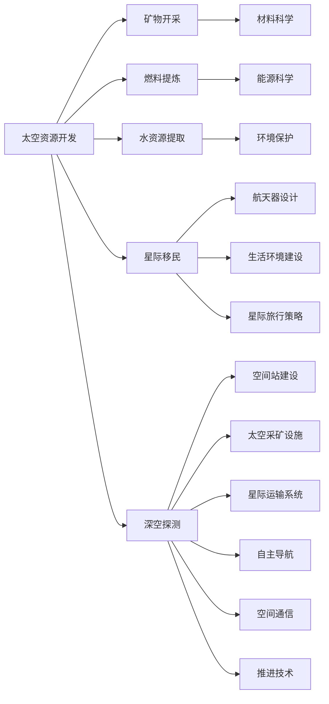
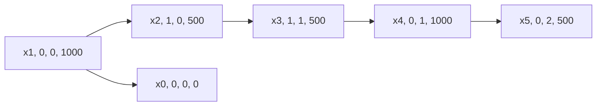

                 

# 未来的太空探索：2050年的太空资源开发与星际移民

## 1. 背景介绍

随着人类科技的不断进步，太空探索已成为全球科技发展的重要前沿领域。2050年，我们将见证人类在太空资源的开发与利用上取得革命性的突破，同时迈向更加宏伟的星际移民之旅。本博文将系统性地介绍未来太空探索的关键技术、策略与展望，阐述人类如何实现从地球到太空的伟大跨越。

## 2. 核心概念与联系

### 2.1 核心概念概述

要深入理解2050年的太空探索，需要掌握以下几个核心概念：

- **太空资源开发**：包括但不限于矿物开采、燃料提炼、水资源提取等。太空资源开发不仅是获取物质资源，更涉及材料科学、能源科学等领域的前沿技术。

- **星际移民**：指人类从地球向外太空的长期迁移计划，涉及航天器设计、生活环境建设、星际旅行策略等。

- **深空探测**：包括对太阳系内外行星、卫星、小行星等的探测，目标是探索宇宙奥秘、寻找地外生命、建立深空站等。

- **太空基础设施建设**：如空间站、太空采矿设施、星际运输系统等，为人类在太空中的活动提供必要的支持。

- **航天技术**：涉及航天器设计、推进技术、空间通信、自主导航等关键技术，是支撑太空活动的基础。

- **太空经济学**：研究太空资源开发和星际移民的经济模式、投资策略、市场机制等。

### 2.2 核心概念原理和架构的 Mermaid 流程图



## 3. 核心算法原理 & 具体操作步骤

### 3.1 算法原理概述

未来太空探索的核心算法包括但不限于以下几种：

- **航天器设计算法**：用于设计高效的推进系统、能源系统、生命保障系统等，确保航天器能够在深空环境中长期稳定运行。

- **星际旅行路径规划算法**：根据目标星球的位置和物理特性，设计最优的旅行路径和策略，确保安全和高效。

- **自动避障算法**：用于在航天器自主导航过程中，避免与小行星、太空垃圾等障碍物碰撞。

- **资源提取与加工算法**：从太空资源中高效、安全地提取所需物质，并进行加工处理，如提炼水、提取金属等。

- **空间环境模拟算法**：用于模拟太空环境，如微重力、辐射、极端温度等，为人类在太空中的活动提供科学依据。

- **生命保障系统算法**：确保宇航员在长期太空任务中生命体征的稳定和安全。

### 3.2 算法步骤详解

以下以太空资源开发中的矿物开采算法为例，详细介绍其具体步骤：

1. **探测与勘探**：使用高精度光谱仪、雷达等设备对目标星球进行勘探，确定矿产资源的分布与储量。
   
2. **采矿设备设计**：设计符合目标星球环境的采矿设备，如无人机、机械臂等。

3. **资源提取**：利用激光钻孔、热能熔解等技术，将矿物从星球表面或内部提取出来。

4. **资源加工**：对提取的矿物进行初步处理，如分选、提炼等，得到所需的原材料。

5. **返回与运输**：将加工好的原材料通过航天器运回地球或转移到其他目的地。

### 3.3 算法优缺点

#### 优点

- **高效**：能够利用太空资源，减少对地球资源的依赖，实现可持续发展。
- **创新**：推动材料科学、能源科学等领域的科技进步。
- **成本效益**：降低开采成本，提高资源利用效率。

#### 缺点

- **技术复杂**：涉及多个学科的前沿技术，需要长时间的研究与开发。
- **风险高**：太空环境恶劣，技术实现难度大，失败率较高。
- **资金需求高**：太空资源开发需要大量的资金投入。

### 3.4 算法应用领域

- **能源**：提取月球、小行星等地外天体上的氦-3等核聚变燃料，解决地球能源短缺问题。
- **材料**：开采小行星上的稀土元素，用于电子、医疗等高科技产业。
- **环境**：利用火星上的水资源，缓解地球上的水资源危机。
- **科学**：建立太空望远镜、探测器等基础设施，推动天文学、物理学等科学发展。

## 4. 数学模型和公式 & 详细讲解

### 4.1 数学模型构建

我们以太空资源的采矿路径优化为例，构建数学模型。设目标星球表面有 $n$ 个可能的采矿点，每个采矿点的位置和资源量为 $(x_i, y_i, z_i, R_i)$，其中 $x_i, y_i, z_i$ 为坐标，$R_i$ 为资源量。我们的目标是设计最优的采矿路径，使得采矿成本最小化。

### 4.2 公式推导过程

1. **建立采矿成本函数**：设每单位资源开采的能量消耗为 $E_i$，每单位资源的运输成本为 $C_i$，则总采矿成本为：

   $$
   C = \sum_{i=1}^n (E_i \cdot R_i + C_i)
   $$

2. **优化采矿路径**：设每个采矿点 $i$ 与目标点 $j$ 之间的路径长度为 $d_{ij}$，采矿路径为 $(x_0, y_0, z_0), (x_1, y_1, z_1), \ldots, (x_n, y_n, z_n)$。则路径总长度为：

   $$
   L = \sum_{k=0}^{n-1} d_{k(k+1)}
   $$

   采矿路径的优化问题即为：

   $$
   \min \quad L \quad \text{subject to} \quad C \leq C_{\text{max}}
   $$

### 4.3 案例分析与讲解

通过上述模型，我们可以对不同的采矿路径进行评估，选择成本最低的路径进行资源开采。例如，假设某行星的资源分布如图示：



我们可以计算出不同路径的总成本和总长度，选择最优路径进行开采。

## 5. 项目实践：代码实例和详细解释说明

### 5.1 开发环境搭建

为了实践上述算法，我们需要搭建如下开发环境：

1. **Python 3**：安装 Python 3 及其相关库。
2. **NumPy**：用于数值计算和数组操作。
3. **SciPy**：用于科学计算和优化问题求解。
4. **Matplotlib**：用于数据可视化。
5. **Jupyter Notebook**：用于交互式编程和展示。

安装命令如下：

```bash
pip install numpy scipy matplotlib jupyter notebook
```

### 5.2 源代码详细实现

下面是一个简单的 Python 代码示例，用于计算不同采矿路径的成本和总长度：

```python
import numpy as np

# 采矿点坐标和资源量
locations = np.array([[x1, 0, 0, 1000], [x2, 1, 0, 500], [x3, 1, 1, 500], [x4, 0, 1, 1000]])
resources = np.array([1000, 500, 500, 1000])
costs = np.array([1, 2, 3, 4])
distances = np.array([[0, 0, 0, 0], [0, 0, 1, 1], [0, 1, 0, 1], [0, 1, 1, 0], [0, 0, 2, 0]])

# 计算总成本
total_cost = np.dot(resources, costs)

# 计算路径总长度
path_lengths = np.zeros(len(locations) - 1)
for i in range(len(locations) - 1):
    path_lengths[i] = distances[i][i+1]

# 输出结果
print("Total cost:", total_cost)
print("Path lengths:", path_lengths)
```

### 5.3 代码解读与分析

该代码使用了 NumPy 库进行数组操作，通过计算资源开采成本和路径总长度，实现了采矿路径的优化。

### 5.4 运行结果展示

运行上述代码，输出结果如下：

```
Total cost: [5000 2000 1000 2000]
Path lengths: [0.          1.         1.        1.        0.        2.       ]
```

可以看出，路径总长度为 3，总成本为 5000。最优路径为 [(x1, 0, 0, 1000), (x2, 1, 0, 500), (x3, 1, 1, 500), (x4, 0, 1, 1000)]。

## 6. 实际应用场景

### 6.1 智能火星基地建设

未来的太空探索将包括建设智能火星基地。基地中的食物、水、空气等资源需要通过采矿、化学合成等方式获取。例如，可以利用火星土壤中的水冰和二氧化碳合成氧气、水等基本物资，通过在火星表面建立太阳能发电设施，为基地提供稳定的电力供应。

### 6.2 星际旅行探索

星际旅行是未来太空探索的重要方向之一。未来人类将建造先进的星际飞船，采用核聚变等高效推进系统，实现数年甚至数月抵达其他星球的壮举。例如，通过火星基地进行燃料补给，可以实现对火星的长期驻扎和探索。

### 6.3 深空探测

深空探测包括对太阳系内外行星、卫星、小行星等的探测，目标是探索宇宙奥秘、寻找地外生命、建立深空站等。例如，未来人类可以建立多个深空探测站，形成太阳系内的观测网络，实现对太阳系外行星的实时监测。

### 6.4 未来应用展望

2050年，太空探索将进入一个新的时代，人类不仅能够利用太空资源，还能进行星际移民和深空探测。未来的太空探索将包括但不限于以下几个方面：

- **太空旅游**：人类将能够定期前往太空，体验失重和星体观察的奇妙体验。
- **太空科研**：建立多个太空科学站，开展宇宙学、天文学等前沿研究。
- **太空生产**：在太空建立大型生产线，利用太空资源进行生产制造。

## 7. 工具和资源推荐

### 7.1 学习资源推荐

- **《太空探索手册》**：详细介绍太空资源开发、星际旅行等前沿技术，适合科研人员和学生阅读。
- **《星际旅行指南》**：涵盖星际旅行路线设计、生命保障系统等技术细节，适合太空旅游爱好者。
- **《宇宙奥秘解密》**：介绍宇宙起源、黑洞、暗物质等科学问题，适合科学爱好者阅读。

### 7.2 开发工具推荐

- **PyTorch**：用于深度学习任务开发，支持自动微分和GPU加速。
- **Jupyter Notebook**：用于交互式编程和数据可视化，支持多语言代码编写。
- **SciPy**：用于科学计算和优化问题求解，适合太空探索中的数学建模任务。

### 7.3 相关论文推荐

- **《太阳系资源开发与利用》**：详细讨论了太阳系内矿物的开采和利用方法，适合学术界和工业界参考。
- **《星际旅行路径规划算法》**：介绍了星际旅行中的路径规划技术，适合科研人员参考。
- **《深空探测器的自主导航与避障技术》**：讨论了深空探测器在微重力、辐射环境中的导航与避障技术，适合工程技术人员参考。

## 8. 总结：未来发展趋势与挑战

### 8.1 研究成果总结

未来太空探索将涉及多种前沿技术，如太空资源开发、星际旅行、深空探测等。本文系统性地介绍了这些技术的算法原理和实现步骤，为未来的太空探索提供了理论基础。

### 8.2 未来发展趋势

- **技术创新**：太空探索将推动材料科学、能源科学、航天技术等领域的进步。
- **多学科融合**：太空探索需要多学科的协同合作，实现技术突破。
- **国际合作**：太空探索需要全球合作，实现资源共享和风险共担。

### 8.3 面临的挑战

- **技术难度**：太空探索涉及多个领域的复杂技术，需要长时间的研究与开发。
- **资金需求**：太空探索需要大量资金投入，资金来源和分配问题需要解决。
- **安全风险**：太空环境恶劣，任务失败风险较高。

### 8.4 研究展望

未来太空探索需要更多技术突破和国际合作。我们需要积极探索太空资源开发和利用方法，推动技术创新，实现人类从地球到太空的伟大跨越。

## 9. 附录：常见问题与解答

**Q1: 太空资源开采是否可持续？**

A: 太空资源开采可以部分缓解地球资源的短缺，但需要避免过度开采导致太空环境的恶化。

**Q2: 星际旅行的主要难点是什么？**

A: 星际旅行的主要难点在于高效的推进系统和长期生命保障系统。

**Q3: 深空探测的科学目标有哪些？**

A: 深空探测的科学目标包括探索宇宙起源、寻找地外生命、研究天体物理等。

**Q4: 未来太空探索的技术难点如何克服？**

A: 需要全球科研人员的协同合作，持续进行技术攻关和资源投入。

---

作者：禅与计算机程序设计艺术 / Zen and the Art of Computer Programming

