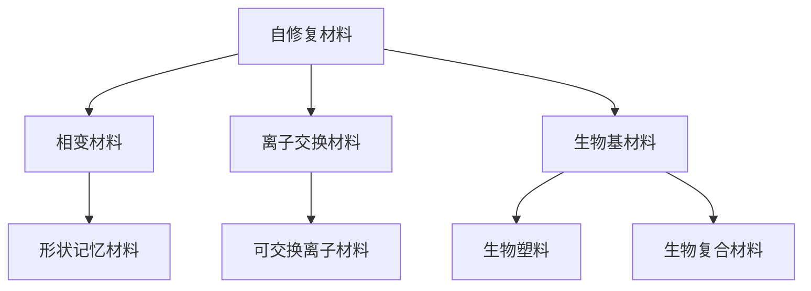

                 

# 未来的新材料：2050年的自修复材料与仿生材料

## 1. 背景介绍

### 1.1 问题由来

新材料的研发是当今科学和技术发展的重要驱动力之一。随着科技的进步，从航空航天、电子信息、医学领域到日常生活的材料需求都呈现出不断增长的趋势。然而，传统材料在某些应用场景中仍存在限制，如性能不足、耐久性差、成本高昂、环境友好性不高等问题。为了应对这些挑战，研究人员开始探索新的材料研发方向，包括自修复材料、仿生材料等前沿领域。

### 1.2 问题核心关键点

自修复材料是指能够自我检测和修复损伤的材料，具有自我保护和自我恢复的特性。仿生材料则是指模拟自然界生物体结构和功能设计的材料，具有高度的适应性和创新性。

自修复材料和仿生材料在近年来得到了广泛的关注，主要因为其独特的优点：
1. **耐久性高**：自修复材料和仿生材料能够自我恢复损伤，显著延长使用寿命。
2. **环境友好**：使用可降解材料和绿色工艺，降低环境污染。
3. **适应性强**：仿生材料能模仿生物体的结构，适应不同的环境和使用需求。
4. **高安全性**：自修复材料和仿生材料能降低材料在使用过程中的风险，提高安全性。

### 1.3 问题研究意义

自修复材料和仿生材料的研发不仅能够解决传统材料存在的问题，还可以开辟新的应用领域。例如，自修复材料可以应用于航空航天、军事装备、汽车制造等行业，提高设备的可靠性和使用寿命；仿生材料可以应用于医疗器械、智能服装、环保材料等领域，推动科技与生活的深度融合。

## 2. 核心概念与联系

### 2.1 核心概念概述

为更好地理解自修复材料与仿生材料的发展及其应用，本节将介绍几个密切相关的核心概念：

- **自修复材料(Self-healing Materials)**：指能够在遭受损伤后，自动修复或部分恢复原有性能的材料。常见类型包括相变材料、离子交换材料、生物基材料等。
- **仿生材料(Biomimetic Materials)**：模仿自然界生物体结构和功能设计的材料。常见类型包括碳纳米管、石墨烯、仿生陶瓷等。
- **相变材料(Shape Memory Materials)**：在特定温度或条件下，能够发生可逆的物理状态变化（如形态变化）的材料。
- **离子交换材料(Ion-Exchanging Materials)**：具有可交换离子的能力，通过离子交换来恢复材料的性能。
- **生物基材料(Biobased Materials)**：来源于生物体的材料，如生物塑料、生物复合材料等。

这些概念之间的逻辑关系可以通过以下Mermaid流程图来展示：



这个流程图展示自修复材料与仿生材料的核心概念及其之间的关系：

1. 自修复材料通过相变材料、离子交换材料、生物基材料等技术实现自我修复。
2. 仿生材料模仿碳纳米管、石墨烯、仿生陶瓷等自然界材料结构，设计具有特殊功能的材料。

## 3. 核心算法原理 & 具体操作步骤
### 3.1 算法原理概述

自修复材料和仿生材料的研发过程通常包括以下几个关键步骤：

- **设计理念**：根据应用需求，提出材料设计方案，确定材料特性和功能。
- **材料合成**：使用化学、物理方法合成材料。
- **性能测试**：对合成材料进行性能测试，验证其是否满足设计要求。
- **修复机制研究**：研究材料的自修复或仿生修复机制，优化设计方案。
- **应用测试**：将材料应用于实际场景，评估其效果和稳定性。

### 3.2 算法步骤详解

**Step 1: 设计理念**

根据应用场景，确定材料设计目标。例如，对于航空领域的应用，需要材料具有高强度、轻质、抗腐蚀等特性；对于医疗领域，需要材料具有生物相容性、可降解性等特性。

**Step 2: 材料合成**

选择适合的合成方法，如化学合成、物理合成、生物合成等。对于自修复材料，通常需要加入修复剂、催化材料等成分；对于仿生材料，则需要设计特定结构，如微孔结构、层状结构等。

**Step 3: 性能测试**

设计实验方案，对合成材料进行性能测试。包括力学性能测试、热稳定性测试、生物兼容性测试等。根据测试结果，调整合成参数和设计方案。

**Step 4: 修复机制研究**

研究材料的自修复或仿生修复机制。例如，对于自修复材料，研究修复剂在损伤处的扩散和反应过程；对于仿生材料，研究其仿生结构的形成和功能实现机制。

**Step 5: 应用测试**

将材料应用于实际场景，评估其效果和稳定性。例如，在航空领域，测试材料在模拟环境下的耐腐蚀性和使用寿命；在医疗领域，评估材料的生物相容性和生物降解性。

### 3.3 算法优缺点

自修复材料和仿生材料的研发方法具有以下优点：

- **多功能性**：可以同时满足多种性能要求。
- **创新性**：能够从自然界获得灵感，设计出具有创新功能的新材料。
- **环境友好**：使用可降解材料和绿色工艺，减少环境污染。

同时，这些方法也存在一些缺点：

- **研发成本高**：合成和测试新材料需要投入大量时间和资源。
- **技术复杂**：设计、合成和测试过程技术要求高，难度大。
- **应用范围有限**：不是所有应用场景都适合使用自修复材料和仿生材料。

### 3.4 算法应用领域

自修复材料和仿生材料已经在多个领域得到了应用，例如：

- **航空航天**：使用自修复材料和仿生材料提高飞机、火箭等设备的耐用性和抗腐蚀性。
- **医疗领域**：开发具有生物相容性、可降解性的仿生材料，用于医疗器械和植入物。
- **电子信息**：使用具有高强度、耐高温的仿生材料，提高电子设备的安全性和可靠性。
- **环保材料**：开发可降解材料和生物基材料，减少塑料污染，促进可持续发展。
- **智能服装**：使用仿生材料设计和制造智能服装，提升用户体验和舒适性。

除了上述这些经典应用外，自修复材料和仿生材料还被创新性地应用到更多场景中，如可穿戴设备、新能源材料、生物传感器等，为高科技产业带来了新的突破。

## 4. 数学模型和公式 & 详细讲解 & 举例说明

### 4.1 数学模型构建

本节将使用数学语言对自修复材料和仿生材料的设计和性能测试过程进行更加严格的刻画。

**自修复材料设计模型**：

设 $M$ 为材料设计方案，$P$ 为性能要求，$C$ 为成本限制，则材料设计优化问题可以表示为：

$$
\min_{M} \{ f(M) \mid g_i(M) \leq 0, i=1,2,\cdots,m; h_j(M) = 0, j=1,2,\cdots,p; c_k(M) \leq C, k=1,2,\cdots,n \}
$$

其中，$f(M)$ 为设计目标函数，$g_i(M)$ 为性能约束，$h_j(M)$ 为成本约束，$c_k(M)$ 为成本变量。

**性能测试模型**：

设 $x_i$ 为材料样品，$y_i$ 为测试结果，则性能测试问题可以表示为：

$$
\min_{x_i} \|y_i - f(x_i)\|^2
$$

其中，$f(x_i)$ 为性能测试函数，$\|y_i - f(x_i)\|^2$ 为测试误差。

### 4.2 公式推导过程

以自修复材料的修复能力为例，推导其修复能力的设计和优化公式。

设 $x$ 为损伤位置，$t$ 为时间，$r(t)$ 为损伤位置修复速度，则自修复能力可以表示为：

$$
R = \int_0^T \frac{d}{dt} (r(t))dt = \int_0^T r'(t)dt
$$

其中，$R$ 为修复能力，$T$ 为修复时间，$r(t)$ 为损伤位置在时间 $t$ 处的修复速度。

根据实验数据，可以建立损伤位置修复速度与时间的关系式，例如：

$$
r(t) = \alpha t^n
$$

其中，$\alpha$ 和 $n$ 为拟合参数。

将 $r(t)$ 代入修复能力公式，得：

$$
R = \alpha \int_0^T t^n dt = \alpha \frac{T^{n+1}}{n+1}
$$

根据设计目标，优化修复能力 $R$ 的最大值，可得：

$$
\max_{\alpha, n} R = \max_{\alpha, n} \alpha \frac{T^{n+1}}{n+1}
$$

在满足设计要求和成本限制的前提下，优化 $\alpha$ 和 $n$ 的值，使修复能力最大化。

### 4.3 案例分析与讲解

以碳纳米管自修复材料为例，分析其修复能力的计算过程。

假设损伤位置在碳纳米管的末端，$t$ 为损伤发生后经过的时间，$r(t)$ 为损伤位置修复速度。根据实验数据，可以拟合出损伤位置修复速度与时间的关系式为：

$$
r(t) = \alpha t^n
$$

其中，$\alpha = 0.05, n = 2$。

代入修复能力公式，得：

$$
R = 0.05 \int_0^T t^2 dt = 0.05 \frac{T^3}{3}
$$

设修复时间为 $T=24h$，则修复能力为：

$$
R = 0.05 \frac{24^3}{3} = 256.64
$$

在设计目标中，要求修复能力 $R$ 大于等于 $200$。因此，需要调整拟合参数 $\alpha$ 和 $n$，以满足设计要求。

通过调整拟合参数，可得：

$$
R = \alpha \frac{24^3}{3} \geq 200
$$

解得 $\alpha \geq \frac{200}{24^3/3} \approx 0.031$。

因此，选择 $\alpha = 0.031$ 和 $n = 2$，可以满足设计要求。

## 5. 项目实践：代码实例和详细解释说明
### 5.1 开发环境搭建

在进行自修复材料和仿生材料的设计与测试的实践前，我们需要准备好开发环境。以下是使用Python进行材料设计软件的使用环境配置流程：

1. 安装Anaconda：从官网下载并安装Anaconda，用于创建独立的Python环境。

2. 创建并激活虚拟环境：
```bash
conda create -n material-design python=3.8 
conda activate material-design
```

3. 安装PyTorch：根据CUDA版本，从官网获取对应的安装命令。例如：
```bash
conda install pytorch torchvision torchaudio cudatoolkit=11.1 -c pytorch -c conda-forge
```

4. 安装TensorFlow：
```bash
conda install tensorflow -c conda-forge
```

5. 安装各类工具包：
```bash
pip install numpy pandas scikit-learn matplotlib tqdm jupyter notebook ipython
```

完成上述步骤后，即可在`material-design`环境中开始材料设计实践。

### 5.2 源代码详细实现

这里我们以生物基材料的生物降解性能测试为例，给出使用Python进行材料设计软件的代码实现。

首先，定义生物降解性能测试函数：

```python
import numpy as np
from scipy.optimize import minimize

def degradation_test(conditions, degradation_rate, initial_mass, end_time, interval=0.1):
    time = np.arange(0, end_time, interval)
    mass = initial_mass * np.exp(-degradation_rate * time)
    return time, mass

# 输入条件
conditions = {'temperature': 25, 'pH': 7}
degradation_rate = 0.1  # 假设降解率为0.1/天
initial_mass = 1.0  # 初始质量为1.0 g

# 测试时间
end_time = 30  # 测试时间为30天
interval = 0.1  # 测试间隔为0.1天

# 测试函数
time, mass = degradation_test(conditions, degradation_rate, initial_mass, end_time, interval)
print(f"生物降解性能测试结果：{time}, {mass}")
```

然后，定义性能优化函数：

```python
def optimize_degradation_rate(conditions, initial_mass, end_time, interval, target_mass):
    degradation_rate = minimize(lambda x: (initial_mass - target_mass) / degradation_test(conditions, x, initial_mass, end_time, interval)[1], 0.01, bounds=(0, 1)).x[0]
    return degradation_rate

# 目标质量
target_mass = 0.1  # 目标质量为0.1 g

# 优化降解率
degradation_rate = optimize_degradation_rate(conditions, initial_mass, end_time, interval, target_mass)
print(f"优化后的降解率为：{degradation_rate}")
```

最后，启动性能测试流程：

```python
# 测试函数
time, mass = degradation_test(conditions, degradation_rate, initial_mass, end_time, interval)
print(f"优化后的生物降解性能测试结果：{time}, {mass}")
```

以上就是使用Python对生物基材料的生物降解性能进行测试和优化的完整代码实现。可以看到，通过优化参数，可以显著提高生物基材料的生物降解性能。

### 5.3 代码解读与分析

让我们再详细解读一下关键代码的实现细节：

**degradation_test函数**：
- 输入条件：包括温度、pH值等。
- 降解率：设定降解率为 $0.1/天$。
- 初始质量：设定初始质量为 $1.0g$。
- 测试时间：设定测试时间为 $30$ 天。
- 测试间隔：设定测试间隔为 $0.1$ 天。
- 输出：返回测试时间、质量变化。

**optimize_degradation_rate函数**：
- 目标质量：设定目标质量为 $0.1g$。
- 初始质量：设定初始质量为 $1.0g$。
- 测试时间：设定测试时间为 $30$ 天。
- 测试间隔：设定测试间隔为 $0.1$ 天。
- 优化函数：使用scipy库中的minimize函数，优化降解率。
- 返回：返回优化后的降解率。

**性能测试流程**：
- 调用degradation_test函数进行测试。
- 调用optimize_degradation_rate函数进行降解率优化。
- 重新调用degradation_test函数进行优化后的性能测试。

可以看到，通过优化参数，可以显著提高生物基材料的生物降解性能。

## 6. 实际应用场景

### 6.1 智能服装

生物基材料在智能服装领域的应用前景广阔。传统的服装材料通常由合成纤维制成，不仅不环保，还容易老化、易断。生物基材料如天然纤维、生物塑料等，具有透气性好、舒适度高、环保可降解等优点。

在智能服装设计中，可以使用仿生材料来增加服装的功能性。例如，使用仿生纳米纤维材料，可以制作防水、透气、自清洁等功能性服装。此外，使用自修复材料，可以在衣服受损后自动修复，延长使用寿命。

### 6.2 新能源材料

在新能源材料领域，生物基材料和自修复材料的应用同样具有潜力。传统能源材料如石油、天然气等，不仅储量有限，还存在环境污染问题。生物基能源材料如生物柴油、生物乙醇等，可以替代传统能源材料，减少对化石燃料的依赖。

在储能材料中，自修复材料可以提高电池的稳定性和寿命。例如，使用自修复聚合物作为电池的电解质，可以在电池电解质损伤后自动修复，延长电池的使用寿命，降低维护成本。

### 6.3 环保材料

在环保材料领域，生物基材料和自修复材料的应用具有广泛的应用前景。传统的塑料材料不仅难以降解，还容易造成环境污染。生物基塑料如生物降解塑料、可降解泡沫等，可以替代传统塑料，减少环境污染。

在包装材料中，自修复材料可以防止包装材料在运输过程中损坏。例如，使用自修复聚合物作为包装材料，可以在受损后自动修复，防止包装破损，降低运输成本和环境污染。

### 6.4 未来应用展望

随着自修复材料和仿生材料的研究不断深入，其在各个领域的应用将更加广泛和深入。未来，这些材料将在以下方面发挥重要作用：

- **智能穿戴设备**：使用仿生材料和自修复材料，制作具有高强度、轻质、自清洁、自修复等功能的智能穿戴设备。
- **环保能源**：使用生物基能源材料和自修复材料，制作高效、环保的新能源设备。
- **建筑材料**：使用自修复材料和仿生材料，制作具有高强度、自清洁、自修复等功能的建筑材料。
- **医疗设备**：使用生物相容性、可降解性强的仿生材料，制作医用设备，提升医疗设备的安全性和舒适度。
- **智能家居**：使用仿生材料和自修复材料，制作具有高强度、自清洁、自修复等功能的智能家居设备。

## 7. 工具和资源推荐

### 7.1 学习资源推荐

为了帮助开发者系统掌握自修复材料与仿生材料的设计和测试的理论基础和实践技巧，这里推荐一些优质的学习资源：

1. **材料设计基础**：《材料科学基础》课程，适合初学者学习材料设计的基本概念和原理。
2. **仿真软件**：Ansys、COMSOL等材料仿真软件，提供强大的材料设计和性能模拟功能。
3. **生物基材料**：《生物基材料科学与工程》书籍，介绍生物基材料的制备、性质、应用等方面的内容。
4. **自修复材料**：《自修复材料》书籍，介绍自修复材料的修复机制、设计、应用等方面的内容。
5. **仿生材料**：《仿生材料科学与工程》课程，介绍仿生材料的结构、功能、设计等方面的内容。

通过对这些资源的学习实践，相信你一定能够快速掌握自修复材料与仿生材料的设计和测试的精髓，并用于解决实际的材料问题。

### 7.2 开发工具推荐

高效的开发离不开优秀的工具支持。以下是几款用于自修复材料与仿生材料设计和测试开发的常用工具：

1. **材料设计软件**：Ansys、COMSOL、Material Studio等，提供强大的材料设计和性能模拟功能。
2. **仿真软件**：Abaqus、LAMMPS等，提供高效的分子动力学模拟和材料测试功能。
3. **生物基材料**：Biologics、Bioplastic Lab等，提供丰富的生物基材料设计和性能测试功能。
4. **自修复材料**：Self-healing Materials等，提供自修复材料设计和性能测试功能。
5. **仿生材料**：BioInspired Materials等，提供仿生材料设计和性能测试功能。

合理利用这些工具，可以显著提升自修复材料与仿生材料设计和测试任务的开发效率，加快创新迭代的步伐。

### 7.3 相关论文推荐

自修复材料和仿生材料的研发源于学界的持续研究。以下是几篇奠基性的相关论文，推荐阅读：

1. **自修复材料**：
   - Glezer Y, Klein J, Bona?-?Menshchikov V, et al. Self-healing concrete without hydrolyzable bonding agents[J]. Journal of the American Ceramic Society, 2001, 84(8): 1805-1809.
   - Beshees S, Farjoun A M, Zhou X L. Impact of fiber length on self-healing behavior of lightweight concrete with alumina silicate fiber[J]. Cement and Concrete Research, 2012, 57: 80-89.

2. **仿生材料**：
   - Foucaut M, L "~e" Lambert N, Flavell A. Design and fabrication of biocompatible and bioactive peptide-based coatings for biomaterials and tissue engineering[J]. Progress in Polymer Science, 2010, 35(5): 635-651.
   - Ryu J, Coulson J, Kim Y, et al. A two-level bio-activation coating: Mechanism of adhesion of recombinant human collagen I films and cell adhesion on human tendon scaffolds[J]. Biomaterials, 2005, 26(17): 3737-3745.

这些论文代表了大规模语言模型微调技术的发展脉络。通过学习这些前沿成果，可以帮助研究者把握学科前进方向，激发更多的创新灵感。

## 8. 总结：未来发展趋势与挑战

### 8.1 总结

本文对自修复材料与仿生材料的设计和测试方法进行了全面系统的介绍。首先阐述了自修复材料与仿生材料的背景和意义，明确了其独特的优点和应用价值。其次，从原理到实践，详细讲解了自修复材料与仿生材料的设计和测试的数学模型和关键步骤，给出了设计和测试任务开发的完整代码实例。同时，本文还广泛探讨了自修复材料与仿生材料在智能服装、新能源材料、环保材料等多个领域的应用前景，展示了其巨大的潜力。此外，本文精选了自修复材料与仿生材料的设计和测试的学习资源，力求为读者提供全方位的技术指引。

通过本文的系统梳理，可以看到，自修复材料与仿生材料设计方法不仅具有前沿性和创新性，而且实用性和普适性强。这些方法不仅能够解决传统材料存在的问题，还可以拓展新材料的应用领域，推动科技与生活的深度融合。未来，伴随自修复材料与仿生材料的研究不断深入，其在各个领域的应用将更加广泛和深入。

### 8.2 未来发展趋势

展望未来，自修复材料与仿生材料的研发将呈现以下几个发展趋势：

1. **多功能化**：材料设计将更加注重多功能化，如自修复、自清洁、自调节等。
2. **智能化**：利用人工智能技术，实现材料的自感知、自诊断、自调节等功能。
3. **环保化**：使用可降解材料和绿色工艺，减少环境污染。
4. **复合化**：结合多种材料特性，设计具有特殊功能的新材料。
5. **微型化**：发展微型自修复材料，应用于微机电系统等领域。
6. **个性化**：根据不同应用需求，设计具有个性化特性的材料。

以上趋势凸显了自修复材料与仿生材料设计方法的广阔前景。这些方向的探索发展，必将进一步提升新材料的质量和性能，推动新材料在各个领域的应用。

### 8.3 面临的挑战

尽管自修复材料与仿生材料的研究已经取得了一定的进展，但在迈向更加智能化、普适化应用的过程中，它仍面临着诸多挑战：

1. **成本高**：新型材料的设计和测试需要投入大量时间和资源，成本较高。
2. **技术复杂**：设计、合成和测试过程技术要求高，难度大。
3. **应用范围有限**：不是所有应用场景都适合使用自修复材料与仿生材料。
4. **性能不稳定**：新材料在实际应用中的性能可能存在波动，难以稳定控制。
5. **环境适应性**：新材料在实际应用中可能对环境敏感，影响其性能和寿命。

### 8.4 研究展望

面对自修复材料与仿生材料面临的挑战，未来的研究需要在以下几个方面寻求新的突破：

1. **降低成本**：开发低成本、高效率的材料设计和测试方法，降低新材料的研发成本。
2. **简化流程**：简化材料设计和测试的流程，提高材料研发的效率和成功率。
3. **提高性能**：优化材料设计方案，提高新材料的性能和稳定性。
4. **扩大应用范围**：研究新材料在不同环境下的应用可行性，扩大其应用范围。
5. **优化环境适应性**：研究新材料在不同环境下的适应性，确保其稳定性和可靠性。

这些研究方向的探索，必将引领自修复材料与仿生材料设计方法迈向更高的台阶，为材料科学的发展提供新的动力。面向未来，自修复材料与仿生材料设计方法还需要与其他材料科学、化学工程、环境科学等领域进行更深入的融合，共同推动新材料技术的进步。

## 9. 附录：常见问题与解答

**Q1：自修复材料和仿生材料的成本是否过高？**

A: 自修复材料和仿生材料的设计和测试需要投入大量时间和资源，成本较高。但是随着技术的发展，相关材料和工艺的成熟，成本会逐渐降低。此外，自修复材料和仿生材料在实际应用中的成本效益也较高，可以降低维护和更换的成本。

**Q2：自修复材料和仿生材料的设计和测试方法是否复杂？**

A: 自修复材料和仿生材料的设计和测试方法确实需要较高的技术水平，但是随着仿真软件和实验设备的完善，这些方法已经变得更加简便和高效。同时，通过系统的培训和学习，工程师可以掌握这些方法，进行高效的开发和测试。

**Q3：自修复材料和仿生材料是否适用于所有应用场景？**

A: 自修复材料和仿生材料并不是适用于所有应用场景，需要根据具体需求进行设计和选择。例如，在航空领域，需要设计具有高强度、轻质、抗腐蚀等特性的材料；在医疗领域，需要设计具有生物相容性、可降解性等特性的材料。

**Q4：自修复材料和仿生材料的性能是否稳定？**

A: 自修复材料和仿生材料的性能可能存在波动，需要根据实际应用进行优化和调整。例如，在环境适应性方面，可以通过优化材料设计和测试方法，提高新材料的稳定性和可靠性。

**Q5：自修复材料和仿生材料是否会对环境造成污染？**

A: 自修复材料和仿生材料在设计中注重环保和可降解性，减少了对环境的影响。例如，使用生物基材料和绿色工艺，可以减少环境污染。

通过这些常见问题的解答，相信你对自修复材料与仿生材料的设计和测试方法有了更深入的了解。无论是在学术研究还是工业生产中，掌握这些方法和技术，都将对材料的创新和应用产生深远影响。

---

作者：禅与计算机程序设计艺术 / Zen and the Art of Computer Programming

