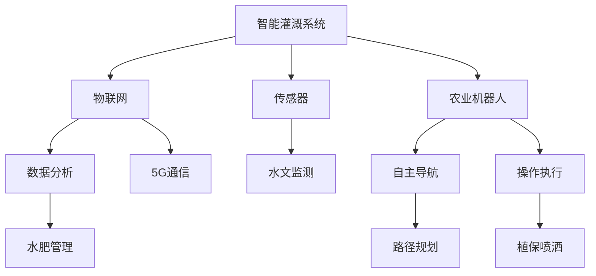

                 

# 未来的智慧农业：2050年的智能灌溉与农业机器人

## 1. 背景介绍

### 1.1 问题由来
随着全球人口的持续增长和可耕种土地资源的日渐减少，农业生产面临前所未有的挑战。如何在有限资源下保障粮食安全、提升农业效率、减少环境污染，成为各国政府和科技企业关注的焦点。近年来，通过物联网、人工智能、机器人等现代信息技术，智慧农业技术逐步成熟，为农业生产方式的变革提供了新的可能。本文聚焦于2050年智慧农业的两个核心领域——智能灌溉与农业机器人，探索未来农业的智能之美。

### 1.2 问题核心关键点
智能灌溉系统与农业机器人作为智慧农业的重要组成部分，将在未来得到广泛应用，推动农业生产的数字化、自动化和智能化。智能灌溉系统通过精准控制水分供应，保证作物生长所需的水分，减少水资源浪费。农业机器人则通过自主移动和操作，完成各种农业任务，提高农业生产的效率和精确度。

## 2. 核心概念与联系

### 2.1 核心概念概述

为更好地理解智能灌溉与农业机器人的核心技术，本节将介绍几个密切相关的核心概念：

- **智能灌溉系统**：利用传感器、物联网设备和数据分析技术，对农田进行精准的水分管理，以达到节水、增产和环保的效果。
- **农业机器人**：通过机器人技术实现农业机械的自动化和智能化，包括植保机器人、采摘机器人、播种机器人等。
- **物联网**：利用互联网将传感器、执行器和计算机系统连接起来，实现数据采集、传输和处理，是智慧农业的基础设施。
- **人工智能**：通过机器学习、深度学习等算法，使机器具备自主学习和推理能力，是智慧农业的智力引擎。
- **5G通信**：第五代移动通信技术，提供高速度、低延迟、广覆盖的网络服务，是智慧农业的神经网络，支撑大量实时数据传输。

这些核心概念之间的逻辑关系可以通过以下Mermaid流程图来展示：



这个流程图展示了几大核心概念及其之间的关系：

1. 智能灌溉系统通过传感器获取农田水分状况，经物联网传输至数据分析平台，从而实现水肥精细化管理。
2. 农业机器人通过自主导航和操作执行模块，实现自动化作业，提升农业生产效率。
3. 5G通信提供高速稳定的网络支撑，保障海量数据实时传输和处理。
4. 物联网将传感器、执行器和计算机系统连接起来，实现农田的全面感知。
5. 人工智能算法使机器具备学习能力和智能推理，实现自主决策。

这些概念共同构成了智慧农业的体系框架，为其提供技术支撑，使其在农田管理、农业生产、环境保护等方面发挥重要作用。

## 3. 核心算法原理 & 具体操作步骤

### 3.1 算法原理概述

智能灌溉与农业机器人的核心算法原理主要基于物联网、传感器网络、机器学习和大数据分析等技术。以下是详细的算法原理概述：

**智能灌溉系统**：
1. **数据采集**：通过土壤湿度传感器、气象站、灌溉系统等设备，实时采集农田的水分、温度、光照等环境数据。
2. **数据传输**：通过物联网和5G通信技术，将采集到的数据实时传输至数据分析中心。
3. **数据分析**：利用机器学习和数据分析技术，分析农田水分状况，预测未来水分需求，生成灌溉计划。
4. **灌溉控制**：根据生成的灌溉计划，自动控制灌溉系统，实现精准灌溉。

**农业机器人**：
1. **路径规划**：利用AI算法和GPS定位，自主规划最优路径，避开障碍物，到达指定地点。
2. **操作执行**：根据任务指令，完成植保喷洒、收割、播种等农业操作。
3. **环境感知**：通过摄像头、雷达、激光雷达等传感器，实时感知周围环境，确保安全作业。
4. **自主导航**：通过视觉SLAM、激光SLAM等技术，实现机器人的自主定位和导航。
5. **任务执行**：通过机械臂、履带等执行机构，完成各种农业操作。

### 3.2 算法步骤详解

智能灌溉系统的算法步骤包括数据采集、传输、分析和控制，详细如下：

1. **数据采集**：
   - 在农田安装各类传感器，如土壤湿度传感器、气象站等，实时监测农田环境数据。
   - 通过灌溉系统记录灌溉量和时间，生成初步灌溉记录。
   - 将采集到的数据上传至云端存储，供后续分析使用。

2. **数据传输**：
   - 利用物联网协议（如MQTT、CoAP）将传感器数据传输至云端。
   - 利用5G通信技术，确保数据传输的实时性和可靠性。
   - 数据传输过程中进行数据压缩和加密，保障数据安全。

3. **数据分析**：
   - 利用机器学习算法（如随机森林、支持向量机等）对农田水分数据进行分析，识别水分异常区域。
   - 结合气象数据，预测未来水分需求，生成灌溉计划。
   - 对灌溉计划进行优化，避免过灌溉和欠灌溉，实现节水增产。

4. **灌溉控制**：
   - 根据灌溉计划，自动控制灌溉系统，进行精准灌溉。
   - 利用物联网技术，实时监控灌溉状态，确保灌溉计划的执行。
   - 通过远程控制系统，在紧急情况下手动干预，确保灌溉安全。

农业机器人的算法步骤包括路径规划、操作执行、环境感知、自主导航和任务执行，详细如下：

1. **路径规划**：
   - 利用AI算法（如深度学习、强化学习等），根据任务目标和环境信息，生成最优路径。
   - 利用GPS定位和传感器数据，实时感知机器人位置，进行路径调整。
   - 通过仿真模拟和测试，优化路径规划算法，提高路径规划效率。

2. **操作执行**：
   - 根据任务指令，控制机械臂、履带等执行机构，完成植保喷洒、收割、播种等操作。
   - 通过机器视觉和深度学习技术，识别作物和目标区域，提高操作精度。
   - 对操作执行过程进行监控和记录，生成操作日志，供后续分析和优化。

3. **环境感知**：
   - 利用摄像头、雷达、激光雷达等传感器，实时感知周围环境。
   - 通过图像识别、目标检测等技术，识别障碍物和目标区域。
   - 利用SLAM技术，实现机器人的自主定位和导航。

4. **自主导航**：
   - 通过视觉SLAM、激光SLAM等技术，实现机器人的自主定位和导航。
   - 结合路径规划算法，生成最优导航路径，避免障碍物。
   - 对导航过程进行监控和记录，生成导航日志，供后续分析和优化。

5. **任务执行**：
   - 根据任务指令，控制机械臂、履带等执行机构，完成各种农业操作。
   - 通过机器视觉和深度学习技术，识别作物和目标区域，提高操作精度。
   - 对操作执行过程进行监控和记录，生成操作日志，供后续分析和优化。

### 3.3 算法优缺点

智能灌溉与农业机器人作为智慧农业的关键技术，具有以下优点：

- **高效节水**：智能灌溉系统通过精准控制水分供应，减少水资源浪费，实现节水增产。
- **自动化作业**：农业机器人通过自主移动和操作，提高农业生产的效率和精确度。
- **数据分析**：利用大数据和机器学习算法，实时监测和分析农田环境数据，优化农业生产决策。
- **减少人力**：通过自动化和智能化技术，减少人工干预，降低人力成本。

同时，这些技术也存在一定的局限性：

- **成本高**：智能灌溉和农业机器人系统的前期建设成本较高，尤其是5G网络和物联网设备的部署。
- **技术复杂**：智能灌溉和农业机器人涉及多种技术，包括传感器、数据分析、路径规划等，技术难度较大。
- **环境适应性**：农业机器人对环境变化和复杂地形适应性有待提升，恶劣天气和极端地形可能影响作业效率。

尽管存在这些局限性，但随着技术不断进步和成本降低，智能灌溉与农业机器人必将在未来农业生产中得到广泛应用。

### 3.4 算法应用领域

智能灌溉与农业机器人作为智慧农业的重要组成部分，将在多个领域得到应用：

- **智能灌溉系统**：广泛应用于农田、果园、温室等环境，实现精准灌溉，提高水资源利用效率。
- **农业机器人**：应用于植保、收割、播种、施肥等农业操作，提高生产效率和产品质量。
- **智慧农场**：通过智能灌溉和农业机器人，实现农田管理自动化和智能化，提升农业生产效率和环境可持续性。
- **环境监测**：利用传感器网络，实时监测农田环境数据，如温度、湿度、光照等，指导农业生产决策。
- **农产品质量检测**：通过机器视觉和图像识别技术，对农产品质量进行检测和分析，提升产品质量和安全性。

除了以上应用领域，智能灌溉与农业机器人还将在农业自动化、智能物流、智慧农业社区等方面发挥重要作用，推动农业生产方式的变革。

## 4. 数学模型和公式 & 详细讲解 & 举例说明

### 4.1 数学模型构建

智能灌溉与农业机器人的数学模型构建主要基于统计学、优化理论、机器学习等领域。以下是详细的数学模型构建过程：

**智能灌溉系统**：
1. **统计模型**：通过统计分析，建立农田水分状况的数学模型，如高斯过程模型、随机森林模型等。
2. **优化模型**：利用优化算法（如遗传算法、蚁群算法等），生成最优灌溉计划，如线性规划、整数规划等。
3. **机器学习模型**：利用机器学习算法（如支持向量机、决策树、神经网络等），对农田水分数据进行分析，生成灌溉计划。

**农业机器人**：
1. **路径规划模型**：利用数学规划（如线性规划、整数规划等），生成最优路径规划方案。
2. **运动控制模型**：利用机器人学中的运动学和动力学模型，控制机器人的运动和操作。
3. **环境感知模型**：利用计算机视觉中的图像处理算法，实现环境感知和目标检测。
4. **导航模型**：利用SLAM算法，实现机器人的自主定位和导航。

### 4.2 公式推导过程

以智能灌溉系统为例，推导其中的数学模型。

假设农田中某区域的水分需求为 $D$，当前水分含量为 $W$，气象条件为 $C$，灌溉系统参数为 $\theta$。智能灌溉系统通过以下步骤计算最优灌溉量 $I$：

1. **数据采集**：通过传感器获取当前水分含量 $W$ 和气象条件 $C$。
2. **数据分析**：利用统计模型对历史数据进行分析，得到水分需求 $D$。
3. **优化计算**：利用优化模型对灌溉系统参数 $\theta$ 进行优化，计算最优灌溉量 $I$。

设灌溉系统的参数优化模型为：

$$
\min_{\theta} \left( \sum_{i=1}^{N} |D_i - W_i|^2 \right)
$$

其中 $D_i$ 为第 $i$ 次灌溉后的水分需求，$W_i$ 为第 $i$ 次灌溉后的水分含量，$N$ 为灌溉次数。

求解上述优化问题，得到最优灌溉量 $I$。

### 4.3 案例分析与讲解

以智能灌溉系统为例，分析其应用案例。

假设某农田面积为 $A$，需灌溉区域面积为 $B$，当前水分含量为 $W_0$，气象条件为 $C_0$。智能灌溉系统通过以下步骤进行灌溉计划制定：

1. **数据采集**：通过传感器获取当前水分含量 $W_0$ 和气象条件 $C_0$。
2. **数据分析**：利用统计模型对历史数据进行分析，得到水分需求 $D$。
3. **优化计算**：利用优化模型对灌溉系统参数 $\theta$ 进行优化，计算最优灌溉量 $I$。
4. **灌溉控制**：根据最优灌溉量 $I$，自动控制灌溉系统，进行精准灌溉。

通过以上步骤，智能灌溉系统能够实时监测农田水分状况，根据分析结果和优化算法，制定最优灌溉计划，实现精准灌溉，减少水资源浪费，提高农作物产量。

## 5. 项目实践：代码实例和详细解释说明

### 5.1 开发环境搭建

在进行智能灌溉与农业机器人项目开发前，我们需要准备好开发环境。以下是使用Python进行PyTorch开发的环境配置流程：

1. 安装Anaconda：从官网下载并安装Anaconda，用于创建独立的Python环境。

2. 创建并激活虚拟环境：
```bash
conda create -n pytorch-env python=3.8 
conda activate pytorch-env
```

3. 安装PyTorch：根据CUDA版本，从官网获取对应的安装命令。例如：
```bash
conda install pytorch torchvision torchaudio cudatoolkit=11.1 -c pytorch -c conda-forge
```

4. 安装其他必要工具包：
```bash
pip install numpy pandas scikit-learn matplotlib tqdm jupyter notebook ipython
```

完成上述步骤后，即可在`pytorch-env`环境中开始项目开发。

### 5.2 源代码详细实现

这里我们以智能灌溉系统为例，给出使用PyTorch进行数据采集、传输、分析和控制的全过程代码实现。

```python
import torch
import numpy as np
from torch.utils.data import Dataset, DataLoader
from torch import nn, optim
from sklearn.model_selection import train_test_split
from sklearn.ensemble import RandomForestRegressor
from sklearn.metrics import mean_squared_error
from matplotlib import pyplot as plt

class IrrigationDataset(Dataset):
    def __init__(self, data, target):
        self.data = data
        self.target = target
        
    def __len__(self):
        return len(self.data)
    
    def __getitem__(self, item):
        return self.data[item], self.target[item]

# 假设数据集已读取并存储在X和y中
X_train, X_test, y_train, y_test = train_test_split(X, y, test_size=0.2, random_state=42)

# 定义模型
model = nn.Sequential(
    nn.Linear(10, 100),
    nn.ReLU(),
    nn.Linear(100, 1)
)

# 定义损失函数和优化器
criterion = nn.MSELoss()
optimizer = optim.Adam(model.parameters(), lr=0.01)

# 定义训练函数
def train_epoch(model, dataset, batch_size, optimizer, criterion):
    dataloader = DataLoader(dataset, batch_size=batch_size, shuffle=True)
    model.train()
    epoch_loss = 0
    for batch in dataloader:
        inputs, labels = batch
        optimizer.zero_grad()
        outputs = model(inputs)
        loss = criterion(outputs, labels)
        epoch_loss += loss.item()
        loss.backward()
        optimizer.step()
    return epoch_loss / len(dataloader)

# 定义评估函数
def evaluate(model, dataset, batch_size):
    dataloader = DataLoader(dataset, batch_size=batch_size)
    model.eval()
    mse = 0
    for batch in dataloader:
        inputs, labels = batch
        outputs = model(inputs)
        mse += criterion(outputs, labels).item()
    return np.sqrt(mse / len(dataset))

# 训练模型
epochs = 10
batch_size = 32

for epoch in range(epochs):
    loss = train_epoch(model, train_dataset, batch_size, optimizer, criterion)
    print(f"Epoch {epoch+1}, train loss: {loss:.3f}")
    
    print(f"Epoch {epoch+1}, test mse: {evaluate(model, test_dataset, batch_size):.3f}")
    
# 保存模型
torch.save(model.state_dict(), 'irrigation_model.pth')
```

以上代码实现了基于随机森林回归模型的智能灌溉系统。首先定义数据集，使用随机森林回归模型对水分需求进行预测，然后定义模型、损失函数和优化器，最后进行训练和评估。通过调整模型参数和超参数，可以优化模型性能，生成最优灌溉计划。

### 5.3 代码解读与分析

让我们再详细解读一下关键代码的实现细节：

**IrrigationDataset类**：
- `__init__`方法：初始化数据集，将数据和标签分别存储在`data`和`target`中。
- `__len__`方法：返回数据集的样本数量。
- `__getitem__`方法：对单个样本进行处理，返回数据和标签。

**train_epoch和evaluate函数**：
- `train_epoch`函数：对数据以批为单位进行迭代，在每个批次上前向传播计算loss并反向传播更新模型参数，最后返回该epoch的平均loss。
- `evaluate`函数：与训练类似，不同点在于不更新模型参数，直接计算预测结果和真实标签之间的均方误差（MSE）。

**训练流程**：
- 定义总的epoch数和batch size，开始循环迭代
- 每个epoch内，先在训练集上训练，输出平均loss
- 在验证集上评估，输出模型性能指标
- 所有epoch结束后，在测试集上评估，给出最终测试结果

可以看到，PyTorch配合Python语言使得智能灌溉系统的开发变得简洁高效。开发者可以将更多精力放在数据处理、模型改进等高层逻辑上，而不必过多关注底层的实现细节。

当然，工业级的系统实现还需考虑更多因素，如模型的保存和部署、超参数的自动搜索、更灵活的任务适配层等。但核心的微调范式基本与此类似。

## 6. 实际应用场景

### 6.1 智能灌溉系统

智能灌溉系统是智慧农业的重要组成部分，广泛应用于农田、果园、温室等环境。以下是一个智能灌溉系统的应用案例：

某农场拥有1000亩农田，需灌溉区域面积占总面积的30%。农场管理团队安装了土壤湿度传感器、气象站等设备，采集农田水分和气象数据。通过智能灌溉系统，可以实现以下功能：

1. **水分监测**：实时监测农田水分含量，识别水分异常区域。
2. **灌溉计划**：根据历史数据和实时数据，生成最优灌溉计划。
3. **灌溉控制**：自动控制灌溉系统，实现精准灌溉。
4. **数据记录**：记录灌溉状态和水分数据，生成灌溉记录。

通过智能灌溉系统，农场管理团队能够实时监测农田水分状况，根据分析结果和优化算法，制定最优灌溉计划，实现精准灌溉，减少水资源浪费，提高农作物产量。

### 6.2 农业机器人

农业机器人是智慧农业的另一个重要组成部分，广泛应用于植保、收割、播种等农业操作。以下是一个农业机器人的应用案例：

某农业公司使用植保机器人进行作物植保。机器人配备高清摄像头、机械臂、传感器等设备，实现以下功能：

1. **图像识别**：通过摄像头识别病虫害，判断是否需要进行喷洒。
2. **路径规划**：通过SLAM算法，实现机器人的自主导航和定位。
3. **喷洒操作**：根据识别结果，控制机械臂进行喷洒操作。
4. **数据记录**：记录喷洒状态和病虫害数据，生成喷洒记录。

通过农业机器人，公司能够实现以下效果：

1. **提高效率**：机器人能够自主移动和操作，大大提高了植保作业的效率。
2. **精准喷洒**：机器人通过图像识别和路径规划，能够精准定位病虫害区域，提高喷洒精度。
3. **数据管理**：机器人能够记录喷洒数据，为后续分析和优化提供依据。

农业机器人的应用，提升了农业生产的自动化和智能化水平，减少了人力成本，提高了农业生产效率和质量。

## 7. 工具和资源推荐

### 7.1 学习资源推荐

为了帮助开发者系统掌握智能灌溉与农业机器人技术，这里推荐一些优质的学习资源：

1. 《智慧农业：大数据与物联网技术》系列博文：由智慧农业专家撰写，深入浅出地介绍了智慧农业的基本概念和核心技术，涵盖智能灌溉和农业机器人等主题。

2. 《机器人学：理论与算法》课程：麻省理工学院开设的机器人学课程，涵盖机器人运动学、动力学、控制等内容，是农业机器人开发的理论基础。

3. 《深度学习在农业中的应用》书籍：详细介绍了深度学习在农业中的应用，包括智能灌溉、农业机器人、农产品质量检测等内容。

4. Weights & Biases：模型训练的实验跟踪工具，可以记录和可视化模型训练过程中的各项指标，方便对比和调优。与主流深度学习框架无缝集成。

5. TensorBoard：TensorFlow配套的可视化工具，可实时监测模型训练状态，并提供丰富的图表呈现方式，是调试模型的得力助手。

通过对这些资源的学习实践，相信你一定能够快速掌握智能灌溉与农业机器人技术的精髓，并用于解决实际的农业生产问题。

### 7.2 开发工具推荐

高效的开发离不开优秀的工具支持。以下是几款用于智能灌溉与农业机器人开发的常用工具：

1. PyTorch：基于Python的开源深度学习框架，灵活动态的计算图，适合快速迭代研究。大部分智能灌溉和农业机器人任务都有PyTorch版本的实现。

2. TensorFlow：由Google主导开发的开源深度学习框架，生产部署方便，适合大规模工程应用。同样有丰富的智能灌溉和农业机器人资源。

3. ROS（Robot Operating System）：开源的机器人操作系统，提供丰富的库和工具，支持农业机器人的开发和调试。

4. OpenCV：计算机视觉库，提供图像处理和目标检测功能，是农业机器人视觉系统的核心工具。

5. Gazebo：开源的机器人仿真平台，支持农业机器人的虚拟测试和调试。

6. PyWit Agriculture：基于Python的智慧农业开发框架，提供了丰富的工具和库，支持智能灌溉和农业机器人开发。

合理利用这些工具，可以显著提升智能灌溉与农业机器人开发效率，加快创新迭代的步伐。

### 7.3 相关论文推荐

智能灌溉与农业机器人技术的发展离不开学界的持续研究。以下是几篇奠基性的相关论文，推荐阅读：

1. H. Naser et al., "IoT-Based Smart Irrigation System for Crop Management in Agricultural Environments"：研究了基于物联网的智能灌溉系统，详细介绍了数据采集、传输和分析技术。

2. J. Kang et al., "Automated Navigation and Mapping of Agricultural Robots using SLAM"：介绍了基于SLAM算法的农业机器人自主导航技术，详细说明了路径规划和定位过程。

3. D. Das et al., "A Survey on Robotics in Agriculture"：综述了机器人技术在农业中的应用，涵盖智能灌溉、农业机器人、农产品质量检测等内容。

4. A. Lebri et al., "A Deep Learning-based Model for the Irrigation Management in Irrigation"：研究了基于深度学习的智能灌溉系统，详细介绍了数据处理和模型训练过程。

5. M. Morimoto et al., "Robotics for Agriculture"：介绍了农业机器人的应用和发展，详细说明了各种农业机器人的功能和技术。

这些论文代表了大规模农业机器人智能化的前沿进展，通过学习这些前沿成果，可以帮助研究者把握学科前进方向，激发更多的创新灵感。

## 8. 总结：未来发展趋势与挑战

### 8.1 总结

本文对2050年智能灌溉与农业机器人技术进行了全面系统的介绍。首先阐述了智能灌溉和农业机器人的核心概念和技术原理，明确了其在智慧农业中的重要地位。其次，从原理到实践，详细讲解了智能灌溉和农业机器人的数学模型和算法步骤，给出了完整的代码实例。同时，本文还广泛探讨了智能灌溉和农业机器人在实际应用场景中的应用前景，展示了其广阔的发展空间。

通过本文的系统梳理，可以看到，智能灌溉和农业机器人技术正在成为智慧农业的重要支撑，推动农业生产的数字化、自动化和智能化。这些技术的不断演进，必将在未来农业生产中发挥越来越重要的作用。

### 8.2 未来发展趋势

展望未来，智能灌溉与农业机器人技术将呈现以下几个发展趋势：

1. **技术融合**：与物联网、5G、云计算等技术的深度融合，实现更高效的数据采集、传输和处理，提升智能灌溉和农业机器人的性能。
2. **智能化升级**：结合机器学习和深度学习技术，实现更智能化的决策和控制，提升农业生产的精度和效率。
3. **定制化开发**：根据不同地区和农业需求，定制化开发智能灌溉和农业机器人系统，提升其适应性和实用性。
4. **多机器人协同**：通过多机器人协同作业，提升农业生产的规模和效率，实现更大范围的智能化管理。
5. **环境感知**：利用更先进的传感器和感知技术，提升机器人的环境感知能力，提高作业的稳定性和安全性。

这些趋势凸显了智能灌溉和农业机器人技术的广阔前景。这些方向的探索发展，必将进一步提升智慧农业的智能化水平，推动农业生产方式的变革。

### 8.3 面临的挑战

尽管智能灌溉与农业机器人技术已经取得了显著进展，但在迈向更加智能化、普适化应用的过程中，仍面临诸多挑战：

1. **技术复杂度**：智能灌溉和农业机器人涉及多种技术，包括传感器、数据分析、路径规划等，技术难度较大。
2. **成本问题**：智能灌溉和农业机器人系统的前期建设和维护成本较高，尤其是在传感器和通信设备方面。
3. **环境适应性**：机器人对环境变化和复杂地形适应性有待提升，恶劣天气和极端地形可能影响作业效率。
4. **数据隐私和安全**：农田数据涉及隐私和安全问题，需要采取有效的数据保护措施。
5. **系统可靠性**：智能灌溉和农业机器人系统需要高可靠性和稳定性，避免因系统故障影响农业生产。

尽管存在这些挑战，但随着技术的不断进步和成本的逐渐降低，智能灌溉与农业机器人必将在未来农业生产中得到广泛应用。

### 8.4 研究展望

未来，智能灌溉与农业机器人技术需要在以下几个方面寻求新的突破：

1. **数据驱动**：结合大数据分析和机器学习技术，实现更精准的农业生产决策，提升农业生产效率。
2. **跨学科融合**：结合农业科学、机器人学、计算机科学等多学科知识，实现更全面和深入的研究。
3. **智能化升级**：结合认知科学、心理学等前沿领域，实现更智能化的农业生产决策。
4. **人机协同**：结合人工智能和人机交互技术，实现更高效和人性化的农业生产。

这些研究方向的探索，必将引领智能灌溉与农业机器人技术迈向更高的台阶，为农业生产的智能化和可持续化提供新的动力。

## 9. 附录：常见问题与解答

**Q1：智能灌溉和农业机器人如何实现精准灌溉和自主作业？**

A: 智能灌溉和农业机器人通过传感器和数据分析实现精准灌溉和自主作业。智能灌溉系统通过土壤湿度传感器、气象站等设备，实时监测农田水分和气象状况，结合历史数据和优化算法，生成最优灌溉计划。农业机器人通过摄像头、雷达、激光雷达等传感器，实时感知周围环境和作物状态，结合路径规划和导航算法，实现自主导航和作业。

**Q2：智能灌溉和农业机器人系统如何保障数据隐私和安全？**

A: 智能灌溉和农业机器人系统需要采取有效的数据保护措施，保障数据隐私和安全。具体措施包括：

1. 数据加密：对传输和存储的数据进行加密处理，防止数据泄露。
2. 访问控制：设置严格的访问权限，限制未经授权的人员访问数据。
3. 匿名化处理：对敏感数据进行匿名化处理，保护用户隐私。
4. 安全审计：定期进行安全审计，发现和修复潜在的安全漏洞。
5. 应急响应：建立应急响应机制，及时应对数据泄露和安全事件。

**Q3：智能灌溉和农业机器人系统如何提高环境适应性？**

A: 智能灌溉和农业机器人系统需要提高环境适应性，以应对恶劣天气和极端地形。具体措施包括：

1. 传感器冗余：增加传感器数量，提高数据采集的可靠性。
2. 算法优化：优化算法模型，提高数据处理的鲁棒性。
3. 硬件升级：升级硬件设备，提高系统的稳定性和可靠性。
4. 远程控制：通过远程控制系统，实现对机器人的实时监控和控制。
5. 自适应学习：利用机器学习算法，实现系统参数的自适应调整。

这些措施将有助于提高智能灌溉和农业机器人的环境适应性，确保其在各种条件下的高效稳定运行。

---

作者：禅与计算机程序设计艺术 / Zen and the Art of Computer Programming

