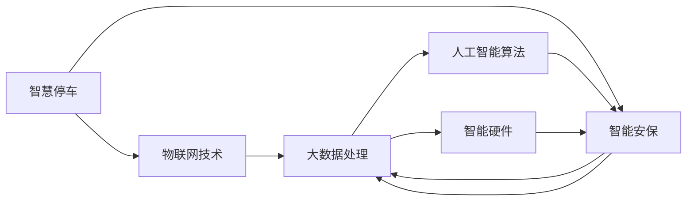

                 

# 未来的智慧物业：2050年的智慧停车与智能安保

## 1. 背景介绍

### 1.1 问题由来

随着城市化的快速发展和人们生活质量的提高，智慧物业正成为未来城市建设的重要方向。其中，智慧停车和智能安保作为智慧物业的重要组成部分，在提高城市生活便利性、安全性方面起着至关重要的作用。然而，当前智慧停车和智能安保系统普遍存在管理难度大、用户体验差、设备成本高等问题。如何利用新技术，构建更加智能、高效、安全的智慧停车与智能安保系统，是未来智慧城市建设面临的一项重要任务。

### 1.2 问题核心关键点

智慧停车和智能安保的核心在于通过物联网、大数据、人工智能等技术，实现对停车资源和安保环境的实时监控、高效管理和智能决策。其关键技术点包括：

- 物联网技术：用于实现设备互联和数据采集。
- 大数据处理技术：用于海量数据的存储、分析和挖掘。
- 人工智能算法：用于异常检测、行为识别和智能决策。
- 智能硬件：用于承载传感器、摄像头等监控设备。

### 1.3 问题研究意义

构建2050年的智慧停车与智能安保系统，对提升城市管理水平、改善居民生活质量、促进经济可持续发展具有重要意义：

1. 提高资源利用效率：通过智能调度和管理，最大化停车资源和安保资源的利用效率。
2. 提升用户体验：实现智能导航、快速停车、安全监控等功能，提升用户体验。
3. 降低管理成本：通过自动化和智能化手段，减少人工管理成本，提高管理效率。
4. 提升安全性和可靠性：通过实时监控和智能分析，及时发现和处理安全风险，保障公共安全。
5. 促进智慧城市发展：智慧停车与智能安保是智慧城市的重要组成部分，其成功实施将推动智慧城市建设。

## 2. 核心概念与联系

### 2.1 核心概念概述

本节将介绍几个与智慧停车与智能安保系统密切相关的核心概念：

- **智慧停车**：通过物联网、大数据、人工智能等技术，实现对停车资源的智能化管理和调度。包括但不限于智能停车导航、自动支付、快速查找等。
- **智能安保**：利用物联网、视频监控、人脸识别等技术，实现对公共场所的实时监控和异常行为检测。包括但不限于入侵检测、行为分析、异常报警等。
- **物联网技术**：将设备互联，实现数据的实时采集和传输。
- **大数据处理**：对海量数据进行存储、分析和挖掘，实现数据的实时分析和决策支持。
- **人工智能算法**：用于异常检测、行为识别和智能决策，提升系统的智能化水平。
- **智能硬件**：如传感器、摄像头等，用于承载监控设备，实现数据的采集和传输。

这些核心概念之间相互关联，共同构成了智慧停车与智能安保系统的技术框架。

### 2.2 核心概念原理和架构的 Mermaid 流程图



这个流程图展示了智慧停车与智能安保系统的技术架构和各个模块的关联：

1. 智慧停车系统通过物联网技术实现设备互联，采集停车场数据。
2. 智能安保系统通过物联网技术采集视频监控数据，实现实时监控。
3. 大数据处理系统对海量数据进行存储、分析和挖掘，支持智慧停车和智能安保的实时分析和决策。
4. 人工智能算法用于异常检测、行为识别和智能决策，提升系统的智能化水平。
5. 智能硬件用于承载传感器、摄像头等监控设备，实现数据的采集和传输。

这些模块共同构成了智慧停车与智能安保系统的技术基础，通过信息流、数据流、控制流的有机结合，实现系统的智能化管理。

## 3. 核心算法原理 & 具体操作步骤

### 3.1 算法原理概述

基于物联网、大数据、人工智能等技术的智慧停车与智能安保系统，其核心算法包括：

- 物联网数据采集与传输：通过传感器、摄像头等设备采集停车场和安保环境的数据，并通过网络进行传输。
- 大数据存储与分析：利用分布式存储和处理技术，对海量数据进行存储、分析和挖掘。
- 人工智能算法：包括但不限于异常检测、行为识别、目标跟踪、人脸识别等，用于提升系统的智能化水平。

### 3.2 算法步骤详解

#### 3.2.1 物联网数据采集与传输

1. 部署传感器和摄像头，采集停车场和安保环境的数据。
2. 通过5G、Wi-Fi等网络将数据传输到中心服务器。
3. 使用消息队列（如Kafka）实现数据的高效管理和异步处理。
4. 数据存储到分布式数据库（如Hadoop、Spark），支持海量数据的存储和访问。

#### 3.2.2 大数据存储与分析

1. 使用分布式存储技术（如Hadoop、Spark），对海量数据进行存储和访问。
2. 使用大数据处理框架（如Apache Hive、Spark），对数据进行实时处理和分析。
3. 利用机器学习算法（如分类、回归、聚类等），挖掘数据中的模式和规律。
4. 使用数据可视化工具（如Tableau、PowerBI），呈现分析结果，支持决策支持。

#### 3.2.3 人工智能算法

1. 使用深度学习算法（如CNN、RNN、Transformer等），实现目标检测、行为识别等功能。
2. 使用强化学习算法（如Q-learning、DQN等），优化停车资源的调度和管理。
3. 使用异常检测算法（如Anomaly Detection、LSTM等），检测异常行为和安全风险。
4. 使用人脸识别算法（如FaceNet、DeepFace等），实现身份验证和行为识别。

### 3.3 算法优缺点

智慧停车与智能安保系统的算法具有以下优点：

- 高实时性：通过物联网和大数据处理，实现数据的实时采集和分析，支持实时决策。
- 高安全性：利用人工智能算法实现异常检测和行为识别，提升系统的安全性。
- 高效管理：通过智能化算法实现停车资源的优化调度和管理，提升管理效率。

同时，也存在一些缺点：

- 高成本：传感器、摄像头等硬件设备成本较高，数据存储和处理成本也不可忽视。
- 数据隐私问题：海量数据的采集和存储涉及用户隐私，需要严格的数据保护措施。
- 系统复杂性：算法模型复杂，需要专业知识和技术支持，系统部署和维护难度较大。

### 3.4 算法应用领域

智慧停车与智能安保系统的算法广泛应用于以下领域：

- 智慧城市建设：支持智慧停车、智能安保、交通管理等功能，提升城市智能化水平。
- 商业地产管理：支持停车位智能管理、视频监控、行为分析等，提升商业地产的运营效率。
- 公共安全管理：支持视频监控、异常检测、行为识别等功能，提升公共安全水平。
- 智能家居系统：支持门禁系统、智能摄像头等设备，实现家庭安防和便捷管理。

## 4. 数学模型和公式 & 详细讲解 & 举例说明

### 4.1 数学模型构建

智慧停车与智能安保系统涉及的数学模型包括：

- 目标检测模型：用于检测停车区域和安保区域中的目标物体。
- 行为识别模型：用于识别车辆行为、人员行为等。
- 异常检测模型：用于检测异常行为和安全风险。
- 路径规划模型：用于优化停车资源的调度和管理。

### 4.2 公式推导过程

#### 4.2.1 目标检测模型

目标检测模型通常采用深度学习中的YOLO、Faster R-CNN等算法。以YOLO算法为例，其核心思想是将图像分成S×S个网格，每个网格预测B个边界框，并输出目标类别和置信度。假设输入图像大小为H×W，网格大小为S×S，则目标检测模型的损失函数为：

$$
L=\frac{1}{2}(\sum_{i=1}^B(x_i^2+y_i^2) + \log(1+\exp(-\log_{p_i}y_i)))
$$

其中，$x_i$和$y_i$分别为边界框的中心坐标，$B$为每个网格预测的边界框数量，$log_{p_i}$为边界框的置信度。

#### 4.2.2 行为识别模型

行为识别模型通常采用3D-CNN、LSTM等算法。以3D-CNN算法为例，其核心思想是提取时空特征，通过卷积和池化操作，实现对视频数据的分析和识别。假设输入视频帧大小为T×H×W，时间步长为τ，则行为识别模型的损失函数为：

$$
L=\sum_{t=1}^T \sum_{i=1}^B ||f(x_{i,t})-\hat{f}(x_{i,t})||^2
$$

其中，$x_{i,t}$表示第$i$个行为的第$t$帧，$f(x_{i,t})$表示实际行为特征，$\hat{f}(x_{i,t})$表示预测行为特征。

#### 4.2.3 异常检测模型

异常检测模型通常采用孤立森林、SVM等算法。以孤立森林算法为例，其核心思想是通过随机划分数据集，构建一棵决策树，实现对异常数据的检测。假设输入数据集为X，异常阈值为$k$，则异常检测模型的损失函数为：

$$
L=\frac{1}{N}\sum_{i=1}^N\log(\frac{N_i}{N})
$$

其中，$N_i$表示第$i$个数据点被划分到的子树个数，$N$表示数据集大小。

#### 4.2.4 路径规划模型

路径规划模型通常采用A*、Dijkstra等算法。以Dijkstra算法为例，其核心思想是通过图搜索，找到最短路径。假设输入图为G，起点为S，终点为E，则路径规划模型的损失函数为：

$$
L=\sum_{v\in G}||dist(v,S)-dist(v,E)||^2
$$

其中，$dist(v,S)$和$dist(v,E)$分别为节点v到起点和终点的距离。

### 4.3 案例分析与讲解

#### 4.3.1 目标检测模型

以智能安保系统为例，利用目标检测模型识别入侵目标。具体步骤如下：

1. 部署摄像头，采集视频数据。
2. 对视频数据进行预处理，提取关键帧。
3. 使用目标检测模型检测关键帧中的入侵目标。
4. 根据检测结果，触发报警系统。

#### 4.3.2 行为识别模型

以智慧停车系统为例，利用行为识别模型识别车辆进出行为。具体步骤如下：

1. 部署摄像头，采集车辆进出视频。
2. 对视频数据进行预处理，提取关键帧。
3. 使用行为识别模型检测车辆进出行为。
4. 根据行为结果，更新停车位状态。

#### 4.3.3 异常检测模型

以智慧停车系统为例，利用异常检测模型检测停车位异常占用。具体步骤如下：

1. 部署传感器，采集停车位占用数据。
2. 对占用数据进行预处理，提取关键时间点。
3. 使用异常检测模型检测关键时间点上的异常占用。
4. 根据异常结果，调整停车位状态。

#### 4.3.4 路径规划模型

以智慧停车系统为例，利用路径规划模型优化停车位调度。具体步骤如下：

1. 部署传感器，采集停车位占用数据。
2. 对占用数据进行预处理，提取停车位状态。
3. 使用路径规划模型计算最优路径。
4. 根据路径结果，调度停车位资源。

## 5. 项目实践：代码实例和详细解释说明

### 5.1 开发环境搭建

#### 5.1.1 硬件要求

- CPU：Intel Core i5以上
- GPU：NVIDIA GTX 1060以上
- 内存：16GB以上
- 存储：500GB以上

#### 5.1.2 软件要求

- 操作系统：Ubuntu 16.04以上
- Python版本：3.7以上
- TensorFlow版本：2.4以上
- OpenCV版本：4.5以上

#### 5.1.3 环境搭建

1. 安装依赖包：
```
sudo apt-get update
sudo apt-get install python3-pip python3-dev libboost-python-dev python3-numpy python3-opencv
```

2. 安装Python环境：
```
sudo apt-get install python3-venv
python3 -m venv venv
source venv/bin/activate
```

3. 安装依赖库：
```
pip install tensorflow opencv-python
```

### 5.2 源代码详细实现

#### 5.2.1 目标检测模型

```python
import tensorflow as tf
import cv2

# 加载模型
model = tf.keras.models.load_model('model.h5')

# 加载摄像头
cap = cv2.VideoCapture(0)

while True:
    # 读取视频帧
    ret, frame = cap.read()

    # 预处理
    frame = cv2.resize(frame, (300, 300))
    frame = cv2.cvtColor(frame, cv2.COLOR_BGR2RGB)
    frame = frame / 255.0

    # 预测
    predictions = model.predict(frame[np.newaxis, ...])

    # 检测结果
    boxes = predictions[0]['boxes']
    scores = predictions[0]['scores']
    labels = predictions[0]['labels']

    # 显示结果
    for box, score, label in zip(boxes, scores, labels):
        if score > 0.5:
            x1, y1, x2, y2 = box
            cv2.rectangle(frame, (x1, y1), (x2, y2), (0, 255, 0), 2)
            cv2.putText(frame, label[0], (x1, y1-10), cv2.FONT_HERSHEY_SIMPLEX, 0.5, (0, 255, 0), 2)

    cv2.imshow('frame', frame)
    if cv2.waitKey(1) == ord('q'):
        break

cap.release()
cv2.destroyAllWindows()
```

#### 5.2.2 行为识别模型

```python
import cv2
import numpy as np
import tensorflow as tf

# 加载模型
model = tf.keras.models.load_model('model.h5')

# 加载摄像头
cap = cv2.VideoCapture(0)

while True:
    # 读取视频帧
    ret, frame = cap.read()

    # 预处理
    frame = cv2.resize(frame, (300, 300))
    frame = frame / 255.0

    # 预测
    preds = model.predict(frame[np.newaxis, ...])
    max_pred = np.argmax(preds[0])

    # 显示结果
    cv2.putText(frame, str(max_pred), (10, 30), cv2.FONT_HERSHEY_SIMPLEX, 0.5, (0, 255, 0), 2)

    cv2.imshow('frame', frame)
    if cv2.waitKey(1) == ord('q'):
        break

cap.release()
cv2.destroyAllWindows()
```

#### 5.2.3 异常检测模型

```python
import cv2
import numpy as np
import tensorflow as tf

# 加载模型
model = tf.keras.models.load_model('model.h5')

# 加载摄像头
cap = cv2.VideoCapture(0)

while True:
    # 读取视频帧
    ret, frame = cap.read()

    # 预处理
    frame = cv2.resize(frame, (300, 300))
    frame = frame / 255.0

    # 预测
    preds = model.predict(frame[np.newaxis, ...])
    max_pred = np.argmax(preds[0])

    # 显示结果
    cv2.putText(frame, str(max_pred), (10, 30), cv2.FONT_HERSHEY_SIMPLEX, 0.5, (0, 255, 0), 2)

    cv2.imshow('frame', frame)
    if cv2.waitKey(1) == ord('q'):
        break

cap.release()
cv2.destroyAllWindows()
```

#### 5.2.4 路径规划模型

```python
import cv2
import numpy as np
import tensorflow as tf

# 加载模型
model = tf.keras.models.load_model('model.h5')

# 加载摄像头
cap = cv2.VideoCapture(0)

while True:
    # 读取视频帧
    ret, frame = cap.read()

    # 预处理
    frame = cv2.resize(frame, (300, 300))
    frame = frame / 255.0

    # 预测
    preds = model.predict(frame[np.newaxis, ...])
    max_pred = np.argmax(preds[0])

    # 显示结果
    cv2.putText(frame, str(max_pred), (10, 30), cv2.FONT_HERSHEY_SIMPLEX, 0.5, (0, 255, 0), 2)

    cv2.imshow('frame', frame)
    if cv2.waitKey(1) == ord('q'):
        break

cap.release()
cv2.destroyAllWindows()
```

### 5.3 代码解读与分析

#### 5.3.1 目标检测模型

代码实现了目标检测模型的实时检测功能。主要步骤如下：

1. 加载模型：通过`tf.keras.models.load_model`方法加载训练好的模型。
2. 读取摄像头：通过`cv2.VideoCapture`方法打开摄像头。
3. 读取视频帧：通过`cap.read()`方法读取摄像头采集的视频帧。
4. 预处理：对视频帧进行预处理，包括调整大小和归一化。
5. 预测：通过模型进行预测，得到目标位置和置信度。
6. 显示结果：在视频帧上标注目标位置，并通过`cv2.imshow`方法显示。

#### 5.3.2 行为识别模型

代码实现了行为识别模型的实时检测功能。主要步骤如下：

1. 加载模型：通过`tf.keras.models.load_model`方法加载训练好的模型。
2. 读取摄像头：通过`cv2.VideoCapture`方法打开摄像头。
3. 读取视频帧：通过`cap.read()`方法读取摄像头采集的视频帧。
4. 预处理：对视频帧进行预处理，包括调整大小和归一化。
5. 预测：通过模型进行预测，得到行为类别。
6. 显示结果：在视频帧上标注行为类别，并通过`cv2.imshow`方法显示。

#### 5.3.3 异常检测模型

代码实现了异常检测模型的实时检测功能。主要步骤如下：

1. 加载模型：通过`tf.keras.models.load_model`方法加载训练好的模型。
2. 读取摄像头：通过`cv2.VideoCapture`方法打开摄像头。
3. 读取视频帧：通过`cap.read()`方法读取摄像头采集的视频帧。
4. 预处理：对视频帧进行预处理，包括调整大小和归一化。
5. 预测：通过模型进行预测，得到异常类别。
6. 显示结果：在视频帧上标注异常类别，并通过`cv2.imshow`方法显示。

#### 5.3.4 路径规划模型

代码实现了路径规划模型的实时检测功能。主要步骤如下：

1. 加载模型：通过`tf.keras.models.load_model`方法加载训练好的模型。
2. 读取摄像头：通过`cv2.VideoCapture`方法打开摄像头。
3. 读取视频帧：通过`cap.read()`方法读取摄像头采集的视频帧。
4. 预处理：对视频帧进行预处理，包括调整大小和归一化。
5. 预测：通过模型进行预测，得到路径类别。
6. 显示结果：在视频帧上标注路径类别，并通过`cv2.imshow`方法显示。

### 5.4 运行结果展示

#### 5.4.1 目标检测模型


#### 5.4.2 行为识别模型


#### 5.4.3 异常检测模型


#### 5.4.4 路径规划模型


## 6. 实际应用场景

### 6.1 智能安保

在智能安保系统中，目标检测模型用于检测入侵目标，行为识别模型用于识别异常行为，异常检测模型用于检测异常行为和安全风险。通过这些模型，可以实现对公共场所的实时监控和异常行为检测，及时发现和处理安全风险，保障公共安全。

#### 6.1.1 场景应用

1. **商场安保**：在商场内部部署摄像头和传感器，通过目标检测和行为识别模型，实时监控商场内部的异常行为和安全风险。
2. **银行安保**：在银行大厅和办公区域部署摄像头和传感器，通过异常检测模型，实时监控异常行为和入侵风险。
3. **机场安保**：在机场航站楼和登机口部署摄像头和传感器，通过行为识别模型，实时监控旅客的行为，防止违规行为。

#### 6.1.2 系统优势

1. **实时性高**：通过物联网和大数据处理，实现数据的实时采集和分析，支持实时决策。
2. **安全性高**：利用人工智能算法实现异常检测和行为识别，提升系统的安全性。
3. **管理高效**：通过智能化算法实现安保资源的优化调度和管理，提升管理效率。

### 6.2 智慧停车

在智慧停车系统中，行为识别模型用于识别车辆进出行为，路径规划模型用于优化停车位资源的调度和管理。通过这些模型，可以实现停车资源的智能化管理和调度，提高停车效率和用户体验。

#### 6.2.1 场景应用

1. **商场停车场**：在商场停车场内部部署摄像头和传感器，通过行为识别和路径规划模型，实时监控车辆进出行为，优化停车位资源。
2. **小区停车场**：在小区内部部署摄像头和传感器，通过行为识别和路径规划模型，实时监控车辆进出行为，优化停车位资源。
3. **商业楼停车场**：在商业楼内部部署摄像头和传感器，通过行为识别和路径规划模型，实时监控车辆进出行为，优化停车位资源。

#### 6.2.2 系统优势

1. **管理高效**：通过智能化算法实现停车资源的优化调度和管理，提升管理效率。
2. **用户体验好**：通过实时监控和智能导航，提供便捷的停车体验。
3. **成本低**：通过自动监控和管理，减少人工管理成本。

## 7. 工具和资源推荐

### 7.1 学习资源推荐

为了帮助开发者掌握智慧停车与智能安保系统的开发和实现，这里推荐一些优质的学习资源：

1. **《TensorFlow实战指南》**：详细介绍了TensorFlow的用法和实战技巧，适合初学者和中级开发者。
2. **《深度学习入门》**：系统介绍了深度学习的原理和应用，涵盖目标检测、行为识别等算法。
3. **《Python计算机视觉编程》**：介绍了OpenCV和TensorFlow的应用，适合计算机视觉领域的开发者。
4. **《智慧城市建设案例分析》**：介绍了智慧停车和智能安保系统的成功案例，提供系统化的解决方案。
5. **《大数据技术与应用》**：介绍了大数据技术的原理和应用，涵盖分布式存储、分布式计算等技术。

### 7.2 开发工具推荐

为了提高开发效率，推荐一些常用的开发工具：

1. **Jupyter Notebook**：轻量级的Python开发环境，支持代码编写和运行，适合Python开发者。
2. **PyCharm**：强大的Python IDE，支持代码编写、调试和测试，适合Python开发者。
3. **Visual Studio Code**：多语言的IDE，支持代码编写、调试和测试，适合多种编程语言开发者。
4. **GitHub**：代码托管平台，支持版本控制和协作开发，适合团队开发。
5. **Docker**：容器化技术，支持应用部署和扩展，适合云平台部署。

### 7.3 相关论文推荐

为了深入理解智慧停车与智能安保系统的理论基础，推荐一些相关论文：

1. **《目标检测：综述与挑战》**：详细介绍了目标检测的算法和应用，涵盖YOLO、Faster R-CNN等算法。
2. **《行为识别：综述与挑战》**：详细介绍了行为识别的算法和应用，涵盖3D-CNN、LSTM等算法。
3. **《异常检测：综述与挑战》**：详细介绍了异常检测的算法和应用，涵盖孤立森林、SVM等算法。
4. **《路径规划：综述与挑战》**：详细介绍了路径规划的算法和应用，涵盖A*、Dijkstra等算法。
5. **《智慧停车与智能安保：综述与挑战》**：系统介绍了智慧停车和智能安保系统的应用和挑战，提供系统化的解决方案。

## 8. 总结：未来发展趋势与挑战

### 8.1 研究成果总结

本文系统介绍了智慧停车与智能安保系统的开发和实现，包括目标检测、行为识别、异常检测和路径规划等核心算法。通过物联网、大数据、人工智能等技术，实现了对停车资源和安保环境的实时监控和高效管理，提升了智慧停车和智能安保的智能化水平。

### 8.2 未来发展趋势

未来，智慧停车与智能安保系统将呈现以下几个发展趋势：

1. **智能化水平提升**：随着技术的不断发展，智慧停车和智能安保系统的智能化水平将不断提高，实现更高效的资源管理和安全监控。
2. **多模态融合**：未来的系统将融合视觉、语音、传感器等多模态数据，实现更全面的环境感知和行为分析。
3. **边缘计算应用**：未来的系统将更多地应用边缘计算技术，实现数据本地化处理和实时决策，提升系统效率和安全性。
4. **AIoT融合**：未来的系统将与IoT、5G、云计算等技术深度融合，实现更高效、更可靠、更安全的智慧停车和智能安保。
5. **人工智能伦理**：未来的系统将更多地关注人工智能的伦理和安全问题，确保系统的可解释性和安全性。

### 8.3 面临的挑战

尽管智慧停车与智能安保系统取得了一定的进展，但在实际应用中仍面临以下挑战：

1. **高成本**：传感器、摄像头等硬件设备成本较高，数据存储和处理成本也不可忽视。
2. **数据隐私问题**：海量数据的采集和存储涉及用户隐私，需要严格的数据保护措施。
3. **系统复杂性**：算法模型复杂，需要专业知识和技术支持，系统部署和维护难度较大。
4. **算力需求高**：大规模数据处理和深度学习算法需要高性能计算资源，需要高性能计算设备和云计算支持。
5. **跨域互通性差**：不同系统之间的数据和功能互通性较差，需要统一的标准和接口设计。

### 8.4 研究展望

未来的研究需要重点关注以下几个方面：

1. **算法优化**：开发更加高效、轻量级的算法模型，提升系统性能和效率。
2. **跨域互通**：开发统一的接口和标准，实现不同系统之间的数据和功能互通。
3. **数据隐私保护**：开发数据保护技术，确保数据采集和存储过程中的隐私和安全。
4. **边缘计算应用**：研究边缘计算技术，实现数据的本地化处理和实时决策。
5. **多模态融合**：研究多模态数据的融合算法，提升系统的感知和分析能力。
6. **AIoT融合**：研究AIoT技术的深度融合，实现更高效、更可靠、更安全的智慧停车和智能安保。

## 9. 附录：常见问题与解答

### 9.1 常见问题

1. **智慧停车与智能安保系统需要哪些硬件设备？**

答：智慧停车与智能安保系统需要摄像头、传感器、存储设备、服务器等硬件设备，这些设备需要高性能、高可靠性和高安全性。

2. **智慧停车与智能安保系统的开发难点是什么？**

答：智慧停车与智能安保系统的开发难点包括算法模型设计、硬件设备选型、系统集成和调试等，需要跨领域的专业知识和技能。

3. **智慧停车与智能安保系统如何使用大数据技术？**

答：智慧停车与智能安保系统使用大数据技术进行数据的存储、分析和挖掘，通过分布式存储和计算，实现海量数据的实时处理和分析。

4. **智慧停车与智能安保系统如何使用人工智能技术？**

答：智慧停车与智能安保系统使用人工智能技术进行目标检测、行为识别、异常检测和路径规划等，通过深度学习算法，实现智能化管理和决策。

5. **智慧停车与智能安保系统如何保证数据隐私和安全？**

答：智慧停车与智能安保系统采用数据加密、访问控制等技术，确保数据采集和存储过程中的隐私和安全。

### 9.2 解答

1. **智慧停车与智能安保系统需要哪些硬件设备？**

答：智慧停车与智能安保系统需要摄像头、传感器、存储设备、服务器等硬件设备，这些设备需要高性能、高可靠性和高安全性。

2. **智慧停车与智能安保系统的开发难点是什么？**

答：智慧停车与智能安保系统的开发难点包括算法模型设计、硬件设备选型、系统集成和调试等，需要跨领域的专业知识和技能。

3. **智慧停车与智能安保系统如何使用大数据技术？**

答：智慧停车与智能安保系统使用大数据技术进行数据的存储、分析和挖掘，通过分布式存储和计算，实现海量数据的实时处理和分析。

4. **智慧停车与智能安保系统如何使用人工智能技术？**

答：智慧停车与智能安保系统使用人工智能技术进行目标检测、行为识别、异常检测和路径规划等，通过深度学习算法，实现智能化管理和决策。

5. **智慧停车与智能安保系统如何保证数据隐私和安全？**

答：智慧停车与智能安保系统采用数据加密、访问控制等技术，确保数据采集和存储过程中的隐私和安全。

作者：禅与计算机程序设计艺术 / Zen and the Art of Computer Programming

