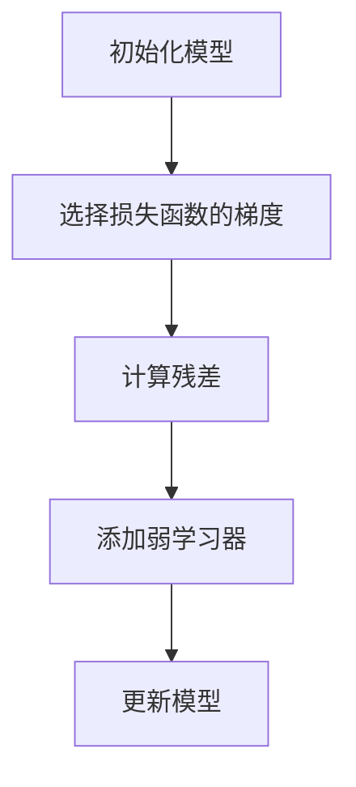
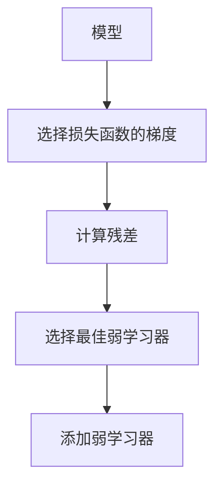

# Gradient Boosting 原理与代码实战案例讲解

作者：禅与计算机程序设计艺术 / Zen and the Art of Computer Programming

关键词：Gradient Boosting, Ensemble Learning, Weak Learners, Decision Trees, Loss Function Minimization

## 1. 背景介绍

### 1.1 问题的由来

在机器学习领域，提升模型性能的一种重要方式是通过集成学习（Ensemble Learning）。集成学习的思想是将多个弱学习器（Weak Learners）组合起来形成一个强学习器（Strong Learner），以达到提高预测准确率和鲁棒性的目的。Gradient Boosting 是集成学习中的一种强大技术，尤其在处理回归和分类问题时表现卓越。

### 1.2 研究现状

Gradient Boosting 方法自从 1999 年由 Jerome Friedman 提出以来，因其强大的性能和灵活的特性而受到广泛关注。近年来，随着大规模数据集和更复杂模型的需求增加，Gradient Boosting 的算法优化和应用范围也在不断扩展。例如，XGBoost、LightGBM 和 CatBoost 等算法分别针对不同的应用场景进行了优化，提升了训练速度和预测精度。

### 1.3 研究意义

Gradient Boosting 的研究意义在于提高模型的泛化能力，减少过拟合的风险，以及适应高维数据和非线性关系的能力。它通过迭代地添加弱学习器，每一步都专注于改进之前的预测错误，从而形成一个强大的预测模型。

### 1.4 本文结构

本文将深入探讨 Gradient Boosting 的核心概念、算法原理、数学模型及其在实际应用中的代码实现。我们将通过详细的理论解释、公式推导和代码实例，帮助读者理解和掌握 Gradient Boosting 的工作原理和实战技巧。

## 2. 核心概念与联系

Gradient Boosting 是一种基于梯度下降原理的迭代集成学习方法。其基本思想是通过构建一系列弱学习器（通常为决策树），并将每个学习器的预测结果用于改善下一个学习器的训练，最终形成一个强大的预测模型。这种过程可以看作是在梯度上进行迭代优化，每次迭代都尝试减小损失函数的值。

### 关键概念

- **弱学习器**：一个性能略优于随机猜测的学习器，通常指的是简单的模型，比如单层决策树。
- **损失函数**：衡量模型预测值与真实值之间差异的度量，Gradient Boosting 的目的是最小化此损失函数。
- **正则化**：防止过拟合的一种手段，通过控制学习器的复杂度来平衡模型的拟合能力与泛化能力。

## 3. 核心算法原理与具体操作步骤

### 3.1 算法原理概述

Gradient Boosting 的算法可以分为两步：损失函数的近似和模型的更新。具体步骤如下：

1. **初始化**：选择一个初始预测值，通常是零或者一个均值。
2. **损失函数的近似**：对于每一个学习器，我们选择一个能够最好地减小当前损失函数的函数，这个函数称为“损失函数的梯度”或“残差”。
3. **模型更新**：根据选择的函数，添加一个新的弱学习器到模型中，这个学习器的权重用于调整预测结果。
4. **重复步骤2和3**：直到达到预定的迭代次数或者损失函数不再显著减少。

### 3.2 算法步骤详解

**步骤1：初始化**



**步骤2：损失函数的近似**



**步骤3：模型更新**

```mermaid
I[弱学习器] --> J[更新模型]
J --> K[重复步骤2和3]
```

### 3.3 算法优缺点

**优点**：

- **性能优越**：Gradient Boosting 能够产生高度准确的预测模型。
- **易于并行化**：可以通过并行化训练弱学习器来加速训练过程。
- **适应性强**：可以处理多种类型的损失函数和特征。

**缺点**：

- **计算成本高**：由于需要多次迭代和训练弱学习器，计算成本相对较高。
- **容易过拟合**：如果迭代次数过多，模型可能会过于复杂，导致过拟合。

### 3.4 算法应用领域

Gradient Boosting 在多个领域有着广泛的应用，包括但不限于：

- **金融**：信用评分、欺诈检测
- **医疗**：疾病预测、基因分析
- **电商**：推荐系统、价格预测
- **广告**：点击率预测、用户行为分析

## 4. 数学模型和公式详细讲解与举例说明

### 4.1 数学模型构建

假设我们有 n 个样本和 m 个特征，Gradient Boosting 的数学模型可以表示为：

$$
F(x) = \sum_{t=1}^{T} f_t(x)
$$

其中，\(F(x)\) 是最终的预测模型，\(f_t(x)\) 是第 \(t\) 个弱学习器。

### 4.2 公式推导过程

损失函数 \(L(y, \hat{y})\) 的梯度可以表示为：

$$
\frac{\partial L(y, \hat{y})}{\partial \hat{y}}
$$

Gradient Boosting 通过迭代地更新模型，使得损失函数的值逐渐减小：

$$
f_t(x) = -\eta \frac{\partial L(y, \hat{y})}{\partial \hat{y}}
$$

其中，\(\eta\) 是学习率，控制了每个弱学习器对总模型的影响。

### 4.3 案例分析与讲解

考虑一个简单的线性回归问题，假设我们使用均方误差（MSE）作为损失函数：

$$
L(y, \hat{y}) = (\hat{y} - y)^2
$$

损失函数的梯度为：

$$
\frac{\partial L(y, \hat{y})}{\partial \hat{y}} = 2(\hat{y} - y)
$$

通过 Gradient Boosting，我们逐步添加弱学习器，每次更新模型以减少损失函数的值：

$$
f_t(x) = \alpha_t \cdot h_t(x)
$$

其中，\(\alpha_t\) 是第 \(t\) 个弱学习器的权重，\(h_t(x)\) 是弱学习器对输入 \(x\) 的预测。

### 4.4 常见问题解答

- **如何选择学习率 \(\eta\)?** 学习率的选择直接影响模型的收敛速度和性能。通常，较小的学习率会导致更快的收敛，但可能需要更多的迭代次数。建议通过交叉验证来调整学习率。
- **如何处理过拟合?** 过拟合可以通过增加正则化项、限制弱学习器的复杂度或减少迭代次数来缓解。

## 5. 项目实践：代码实例和详细解释说明

### 5.1 开发环境搭建

```sh
pip install numpy pandas sklearn lightgbm
```

### 5.2 源代码详细实现

```python
import numpy as np
import pandas as pd
from sklearn.model_selection import train_test_split
from sklearn.metrics import mean_squared_error
import lightgbm as lgb

# 加载数据集
data = pd.read_csv('dataset.csv')
X = data.drop('target', axis=1)
y = data['target']

# 划分训练集和测试集
X_train, X_test, y_train, y_test = train_test_split(X, y, test_size=0.2, random_state=42)

# 创建 LightGBM 数据集
lgb_train = lgb.Dataset(X_train, y_train)
lgb_eval = lgb.Dataset(X_test, y_test, reference=lgb_train)

# 设置参数
params = {
    'boosting_type': 'gbdt',
    'objective': 'regression',
    'metric': {'mse'},
    'num_leaves': 31,
    'learning_rate': 0.05,
    'feature_fraction': 0.9,
    'bagging_fraction': 0.8,
    'bagging_freq': 5,
    'lambda_l1': 0.1,
    'lambda_l2': 0.2,
    'min_data_in_leaf': 10,
    'max_depth': -1,
    'seed': 1,
}

# 训练模型
gbm = lgb.train(params,
                lgb_train,
                num_boost_round=1000,
                valid_sets=[lgb_train, lgb_eval],
                early_stopping_rounds=50,
                verbose_eval=50)

# 预测和评估
y_pred = gbm.predict(X_test, num_iteration=gbm.best_iteration)
mse = mean_squared_error(y_test, y_pred)
print(f'MSE: {mse}')
```

### 5.3 代码解读与分析

这段代码展示了如何使用 LightGBM 库进行 Gradient Boosting 分类和回归任务。首先，我们加载数据集，划分训练集和测试集。接着，我们创建 LightGBM 数据集，并设置参数以优化模型性能。通过训练和验证集，我们可以监控模型的性能，并在训练过程中通过早停法避免过拟合。最后，我们预测测试集上的标签，并计算均方误差（MSE）作为评估指标。

### 5.4 运行结果展示

运行上述代码，我们得到模型在测试集上的均方误差（MSE），这是一个衡量预测准确性的指标。较低的 MSE 表示更好的预测性能。

## 6. 实际应用场景

Gradient Boosting 在实际应用中非常灵活，适用于多种场景：

### 实际应用场景

- **金融风险评估**：通过集成学习模型预测贷款违约风险。
- **推荐系统**：根据用户历史行为预测他们对商品的兴趣。
- **医疗诊断**：基于病历数据预测疾病的可能性。
- **销售预测**：预测产品需求量，优化库存管理。

## 7. 工具和资源推荐

### 7.1 学习资源推荐

- **官方文档**：访问 LightGBM 或 XGBoost 的官方文档了解详细信息和最新版本。
- **在线教程**：Kaggle、Towards Data Science 和 Medium 上有大量关于 Gradient Boosting 的教程和案例。

### 7.2 开发工具推荐

- **Jupyter Notebook**：用于代码调试和实验的交互式环境。
- **TensorBoard**：用于可视化模型训练过程和性能指标。

### 7.3 相关论文推荐

- **原论文**：J. H. Friedman, "Greedy Function Approximation: A Gradient Boosting Machine", 1999。
- **后续研究**：查看学术数据库如Google Scholar，了解后续发表的相关论文。

### 7.4 其他资源推荐

- **GitHub**：查找开源项目和代码实现。
- **DataCamp**：提供在线课程和实践项目。

## 8. 总结：未来发展趋势与挑战

### 8.1 研究成果总结

Gradient Boosting 技术已经在多个领域取得了显著成果，特别是在处理大规模数据集和高维特征时。通过不断优化算法和集成方法，我们期待 Gradient Boosting 在未来能够处理更加复杂和多变的数据场景。

### 8.2 未来发展趋势

- **更高效的学习算法**：通过改进计算策略和优化技术，提高算法的计算效率和训练速度。
- **自动特征工程**：自动识别和选择重要特征，减少手动特征工程的工作量。
- **可解释性增强**：开发更易于解释的 Gradient Boosting 模型，提高模型的透明度和信任度。

### 8.3 面临的挑战

- **数据不平衡问题**：如何有效地处理类别不平衡的数据集，提高模型在少数类上的性能。
- **数据隐私保护**：在保护个人隐私的同时，如何充分利用数据进行模型训练和优化。

### 8.4 研究展望

未来的研究将聚焦于解决现有挑战，探索新的集成学习方法，以及开发更强大、更灵活的 Gradient Boosting 技术，以满足不断增长的数据分析和预测需求。

## 9. 附录：常见问题与解答

- **如何处理缺失值？**
    Gradient Boosting 模型通常能够处理缺失值，但在训练之前可以考虑填充缺失值或使用特定策略来处理。
- **如何选择最佳超参数？**
    使用网格搜索、随机搜索或贝叶斯优化等方法来寻找最佳超参数组合，以优化模型性能。
- **如何处理类别特征？**
    对于类别特征，可以采用独热编码、频率编码或特征嵌入等方法将其转换为数值特征，以便用于 Gradient Boosting 模型。

通过本文的详细讲解和代码实例，读者可以深入理解 Gradient Boosting 的核心原理和实际应用，为在机器学习和数据科学领域进行更深入的学习和研究打下坚实基础。