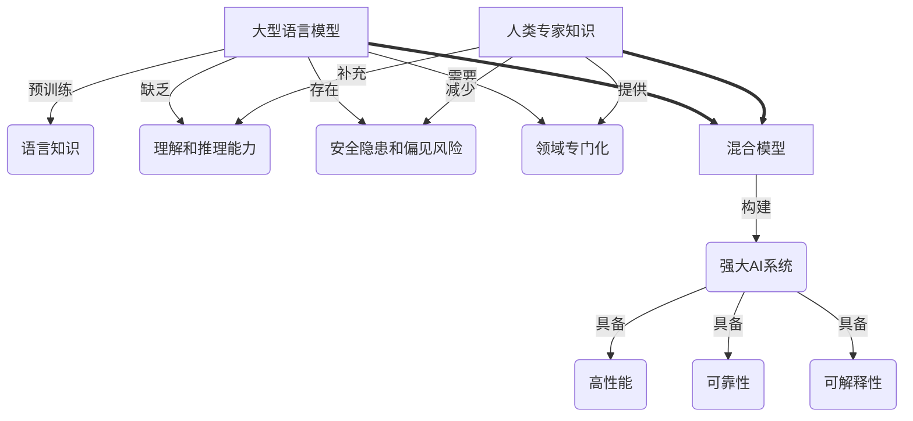

# 大语言模型原理基础与前沿 专家混合

## 1. 背景介绍

### 1.1 问题的由来

在过去的几年中,大型语言模型(Large Language Models,LLMs)在自然语言处理(NLP)领域取得了令人瞩目的成就。这些模型通过在海量文本数据上进行预训练,学习了丰富的语言知识和上下文信息,展现出令人惊叹的生成能力和理解能力。然而,尽管取得了巨大进展,现有的大型语言模型仍然存在一些局限性和挑战。

首先,这些模型缺乏真正的"理解"能力,它们只是在语言模式上进行了高度拟合,而无法形成对世界的深层次理解和推理能力。其次,大型语言模型的训练过程需要消耗大量的计算资源,而且存在一定的安全隐患和偏见风险。此外,这些模型在特定领域的表现往往不尽如人意,需要进一步的专门化训练和优化。

为了解决这些问题,研究人员提出了一种新的范式:大型语言模型与人类专家知识的混合(Hybrid of Large Language Models and Human Expert Knowledge)。这种方法旨在将人类专家的知识和经验与大型语言模型的强大语言能力相结合,从而构建出更加强大、更加可靠、更加可解释的人工智能系统。

### 1.2 研究现状

目前,大型语言模型与人类专家知识混合的研究正在蓬勃发展。一些主要的研究方向包括:

1. **知识注入(Knowledge Injection)**:通过各种方式将人类专家知识注入到大型语言模型中,如prompt engineering、知识蒸馏、模型微调等。
2. **人机协作(Human-AI Collaboration)**:设计人机协作的框架和流程,让人类专家与大型语言模型协同工作,实现互补和优势互补。
3. **可解释性和可控性(Interpretability and Controllability)**:提高大型语言模型的可解释性和可控性,使其更加透明和可信赖。
4. **安全性和公平性(Safety and Fairness)**:减少大型语言模型中存在的安全隐患和偏见风险,确保其在实际应用中的安全性和公平性。

一些知名的研究机构和公司,如OpenAI、Google、Meta等,都在积极推进这一领域的研究和应用。

### 1.3 研究意义

将大型语言模型与人类专家知识相结合,具有重要的理论意义和应用价值:

- **理论意义**:有助于我们更好地理解人类智能的本质,探索人工智能系统与人类智能之间的关系和差异。
- **应用价值**:可以显著提升人工智能系统的性能、可靠性和可解释性,为各个领域带来革命性的变革和创新。

### 1.4 本文结构

本文将全面介绍大型语言模型与人类专家知识混合的基础理论、核心技术、实际应用和未来发展趋势。具体内容安排如下:

1. 核心概念与联系
2. 核心算法原理与具体操作步骤
3. 数学模型和公式详细讲解与案例分析
4. 项目实践:代码实例和详细解释说明
5. 实际应用场景
6. 工具和资源推荐
7. 总结:未来发展趋势与挑战
8. 附录:常见问题与解答

## 2. 核心概念与联系

在深入探讨大型语言模型与人类专家知识混合的细节之前,我们先来了解一些核心概念及其相互关系。

如上图所示,大型语言模型(LLMs)通过在海量文本数据上进行预训练,获得了丰富的语言知识。然而,它们缺乏真正的理解和推理能力,存在安全隐患和偏见风险,并且在特定领域的表现有待提高。

人类专家知识可以补充大型语言模型缺乏的理解和推理能力,减少其安全隐患和偏见风险,并为其提供所需的领域专门化知识。将大型语言模型与人类专家知识相结合,可以构建出更加强大、高性能、可靠和可解释的人工智能系统。

## 3. 核心算法原理与具体操作步骤

### 3.1 算法原理概述

大型语言模型与人类专家知识混合的核心算法原理可以概括为以下三个主要步骤:

1. **知识表示(Knowledge Representation)**:将人类专家知识以结构化或非结构化的形式表示出来,使其可以被机器理解和处理。
2. **知识融合(Knowledge Fusion)**:设计有效的算法和策略,将表示出来的人类专家知识融合到大型语言模型中。
3. **模型优化(Model Optimization)**:优化融合了人类专家知识的大型语言模型,使其在特定任务或领域上表现出优异的性能。

### 3.2 算法步骤详解

1. **知识表示(Knowledge Representation)**

   - 结构化知识表示:将人类专家知识转换为机器可理解的形式,如本体、知识图谱、规则库等。
   - 非结构化知识表示:直接利用人类专家撰写的文本、视频、音频等非结构化数据。

2. **知识融合(Knowledge Fusion)**

   - 基于Prompt的知识融合:通过设计巧妙的Prompt,将人类专家知识注入到大型语言模型中。
   - 基于知识蒸馏的知识融合:利用知识蒸馏技术,将人类专家知识从教师模型迁移到大型语言模型中。
   - 基于模型微调的知识融合:在大型语言模型的基础上,利用带有人类专家知识的数据进行进一步的微调训练。

3. **模型优化(Model Optimization)**

   - 损失函数优化:设计合理的损失函数,引导模型在融合人类专家知识的同时,保持原有的语言生成能力。
   - 架构优化:探索更加高效的模型架构,以更好地融合和利用人类专家知识。
   - 训练策略优化:采用诸如对抗训练、元学习等策略,提高模型的泛化能力和鲁棒性。

### 3.3 算法优缺点

**优点**:

- 充分利用了大型语言模型的强大语言能力和人类专家的丰富知识,两者相得益彰。
- 可以显著提升人工智能系统的性能、可靠性和可解释性。
- 具有良好的可扩展性和通用性,可应用于多个领域。

**缺点**:

- 知识表示和融合过程存在一定的复杂性和挑战。
- 需要大量高质量的人类专家知识作为输入,获取成本较高。
- 模型优化过程计算开销较大,需要强大的硬件支持。

### 3.4 算法应用领域

大型语言模型与人类专家知识混合的算法可以广泛应用于多个领域,包括但不限于:

- 问答系统:融合专家知识,提供更加准确和全面的问答服务。
- 智能写作辅助:利用专家知识,为用户提供高质量的写作建议和优化。
- 决策支持系统:结合专家经验,为决策者提供可靠的决策支持。
- 智能教育:融入教师专业知识,为学生提供个性化的教学辅助。
- 医疗诊断:利用医学专家知识,提高疾病诊断的准确性和可解释性。

## 4. 数学模型和公式详细讲解与举例说明

### 4.1 数学模型构建

在大型语言模型与人类专家知识混合的过程中,我们需要构建合适的数学模型来描述和优化这一过程。一种常见的方法是将其建模为一个多任务学习问题,同时优化语言模型的生成能力和融合专家知识的能力。

假设我们有一个大型语言模型 $M$,其参数为 $\theta$,我们希望在保持其原有语言生成能力的同时,融合人类专家知识 $K$。我们可以将整个过程建模为以下优化问题:

$$
\begin{aligned}
\min_{\theta} \mathcal{L}_{LM}(\theta) + \lambda \mathcal{L}_{K}(\theta, K)
\end{aligned}
$$

其中:

- $\mathcal{L}_{LM}(\theta)$ 是语言模型的损失函数,用于保持其原有的语言生成能力。
- $\mathcal{L}_{K}(\theta, K)$ 是融合人类专家知识的损失函数,用于引导模型学习和利用专家知识。
- $\lambda$ 是一个超参数,用于平衡两个损失函数的权重。

具体来说,语言模型的损失函数 $\mathcal{L}_{LM}(\theta)$ 可以是传统的语言模型损失函数,如交叉熵损失或者自回归损失。而融合专家知识的损失函数 $\mathcal{L}_{K}(\theta, K)$ 则需要根据具体的知识表示形式和融合策略来设计。

### 4.2 公式推导过程

接下来,我们将推导一种基于知识蒸馏的融合专家知识的损失函数。假设我们有一个教师模型 $T$,它已经融合了人类专家知识 $K$,我们希望将其知识迁移到学生模型 $M$ 中。

我们可以采用知识蒸馏的思路,让学生模型 $M$ 的输出分布 $P_M$ 尽可能地接近教师模型 $T$ 的输出分布 $P_T$。具体来说,我们可以最小化两个分布之间的 KL 散度:

$$
\begin{aligned}
\mathcal{L}_{KD}(\theta) &= \mathbb{E}_{x \sim \mathcal{D}} \left[ \mathrm{KL}\left(P_T(y|x) \| P_M(y|x, \theta)\right) \right] \
&= \mathbb{E}_{x \sim \mathcal{D}} \left[ \sum_{y} P_T(y|x) \log \frac{P_T(y|x)}{P_M(y|x, \theta)} \right]
\end{aligned}
$$

其中 $\mathcal{D}$ 是训练数据的分布,而 $x$ 和 $y$ 分别代表输入和输出。

为了进一步提高知识融合的效果,我们可以引入一个额外的正则项,鼓励学生模型 $M$ 的中间表示 $h_M$ 接近教师模型 $T$ 的中间表示 $h_T$。这个正则项可以定义为:

$$
\mathcal{L}_{REG}(\theta) = \mathbb{E}_{x \sim \mathcal{D}} \left[ \left\| h_T(x) - h_M(x, \theta) \right\|_2^2 \right]
$$

综合以上两个损失函数,我们可以得到融合专家知识的总体损失函数:

$$
\mathcal{L}_{K}(\theta, K) = \mathcal{L}_{KD}(\theta) + \beta \mathcal{L}_{REG}(\theta)
$$

其中 $\beta$ 是另一个超参数,用于平衡两个损失函数的权重。

通过优化上述损失函数,我们可以将教师模型 $T$ 中融合的人类专家知识 $K$ 迁移到学生模型 $M$ 中,从而构建出一个融合了专家知识的强大语言模型。

### 4.3 案例分析与讲解

为了更好地理解上述数学模型和公式,我们来分析一个具体的案例。假设我们希望构建一个融合了医学专家知识的语言模型,用于辅助医疗诊断。

在这个案例中,我们可以将一个预训练的大型语言模型 $M$ 作为学生模型,而将一个由医学专家构建的知识库 $K$ 注入到一个教师模型 $T$ 中。我们的目标是将教师模型 $T$ 中的医学专家知识迁