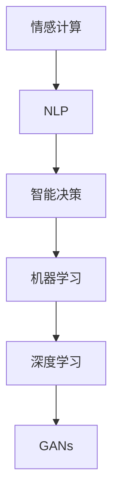
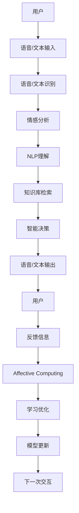

                 

# 未来的智能客服：2050年的智能语音助手与情感计算

## 1. 背景介绍

### 1.1 问题的由来

随着人工智能技术的飞速发展，智能客服系统逐渐从传统人工客服的单一劳动密集型转变为以知识驱动、情感感知和智能决策为核心的高级服务体系。当前智能客服已逐步实现自动化，通过语义理解、知识库检索和决策树等技术，可以自动处理常见问题，提高响应速度和服务质量。

然而，当前的智能客服系统仍然存在诸多局限性。首先，智能客服往往依赖于固定的规则和预定义的语料库，无法应对多样化和复杂化的用户需求。其次，智能客服的情感理解和交互能力较弱，难以处理用户情绪变化和个性化需求。

面对这些挑战，未来的智能客服系统需要通过引入自然语言处理(NLP)、情感计算和智能决策等前沿技术，实现更加智能、高效和人性化的服务。特别是随着2050年的到来，人类与AI的交互将更为频繁和深入，情感计算和智能决策能力将成为衡量智能客服系统成熟度的重要指标。

### 1.2 核心研究价值

情感计算（Affective Computing）是研究如何赋予计算机以情感理解与情感表达能力。通过情感计算，智能客服系统可以更好地理解用户情绪，提供更为个性化和情感化的服务。

未来的智能客服系统将不仅能够处理语义信息，还具备高度的情感理解能力，能够基于用户情绪变化进行决策和调整服务策略。这种情感感知能力将使得客服系统更具人情味，提升用户满意度和忠诚度。

同时，智能决策技术（Intelligent Decision-making）也将极大地提高客服系统的自动化水平。通过基于数据的智能决策算法，客服系统能够在处理复杂问题时，做出更为精准和合理的决策，减少人工干预，提高工作效率。

结合情感计算和智能决策，未来的智能客服系统将变得更加智能化和人性化，为用户的日常服务提供更全面的保障。

## 2. 核心概念与联系

### 2.1 核心概念概述

为更好地理解未来智能客服系统的工作原理和优化方向，本节将介绍几个关键概念及其相互联系：

- 情感计算（Affective Computing）：研究如何赋予计算机以情感理解与情感表达能力。通过情感计算，智能客服系统可以更好地理解用户情绪，提供更为个性化和情感化的服务。

- 自然语言处理（NLP）：研究如何使计算机能够理解和生成自然语言，实现与用户的自然语言交互。情感计算和NLP是实现情感化智能客服的基础。

- 智能决策（Intelligent Decision-making）：通过数据驱动的决策算法，使计算机能够在处理复杂问题时，做出精准合理的决策。

- 机器学习（Machine Learning）：使计算机通过学习历史数据，不断优化自身的预测和决策能力。

- 深度学习（Deep Learning）：通过多层神经网络，实现更强大的数据处理和模式识别能力。

- 生成对抗网络（GANs）：通过生成网络与判别网络的对抗训练，生成高质量的文本或语音数据。

这些核心概念之间的逻辑关系可以通过以下Mermaid流程图来展示：



### 2.2 核心概念原理和架构的 Mermaid 流程图

下面将通过一张简化的流程图，展示情感计算、自然语言处理和智能决策的总体架构和数据流向。



这张流程图展示了情感计算、NLP理解和智能决策的总体架构：
1. 用户通过语音或文本与客服系统进行交互。
2. 语音/文本输入经过识别和情感分析，理解用户情感和需求。
3. NLP理解模块对用户输入进行语义分析，获取关键信息。
4. 知识库检索模块提供相关知识和信息。
5. 智能决策模块综合情感、语义和知识库信息，做出决策。
6. 输出语音或文本进行反馈。
7. 用户反馈进一步优化情感计算和决策模型。

## 3. 核心算法原理 & 具体操作步骤

### 3.1 算法原理概述

未来智能客服系统的核心算法基于情感计算、自然语言处理和智能决策技术。

**情感计算**：情感计算的核心是情感识别与情感表达。情感识别通过分析用户的语音、文本、面部表情等信息，识别出用户的情感状态。情感表达则是将机器的输出与用户的情感状态相匹配，使其更具情感化的特征。

**自然语言处理**：自然语言处理技术使计算机能够理解用户的自然语言输入，并将其转化为机器可理解的形式。通过语义分析、实体识别、情感分析等技术，NLP技术可以更好地理解用户需求，从而提供更精准的服务。

**智能决策**：智能决策的核心是数据驱动的决策算法。通过对历史数据的分析和学习，智能决策算法能够根据当前用户需求，做出最优的决策。常用的智能决策算法包括决策树、随机森林、贝叶斯网络等。

### 3.2 算法步骤详解

下面详细讲解未来智能客服系统的关键算法步骤：

**Step 1：情感计算**

情感计算的第一步是情感识别，主要通过以下方法：
1. 语音情感识别：通过分析语音的音高、音调、语速等特征，识别用户的情绪状态。
2. 文本情感识别：通过分析文本的词汇、句法、语境等特征，识别用户的情绪状态。
3. 面部表情识别：通过分析用户的面部表情，识别其情绪状态。

情感识别的核心是训练情感分类器，常用的算法包括支持向量机、随机森林、神经网络等。情感分类器的输入可以是语音信号、文本或面部图像，输出是情绪状态（如快乐、悲伤、愤怒等）。

**Step 2：自然语言处理**

自然语言处理的核心是语义分析和实体识别，主要通过以下方法：
1. 分词与词性标注：将用户的自然语言输入分解为单词，并标注每个单词的词性。
2. 依存句法分析：分析句子中单词之间的依存关系，理解句子结构。
3. 实体识别：识别出用户输入中的实体（如人名、地名、机构名等）。
4. 情感分析：分析用户输入的情感倾向，如积极、消极、中性等。

语义分析和实体识别通常通过预训练的语言模型（如BERT、GPT等）进行。这些模型可以通过预训练学习到语言的通用表示，能够更好地理解自然语言输入。

**Step 3：智能决策**

智能决策的核心是数据驱动的决策算法，主要通过以下方法：
1. 历史数据挖掘：通过分析历史数据，挖掘出用户需求的规律和特征。
2. 决策树算法：根据历史数据构建决策树，对当前用户需求进行分类和预测。
3. 随机森林算法：通过多个决策树的集成，提高决策的准确性和鲁棒性。
4. 贝叶斯网络：通过构建贝叶斯网络，对用户需求进行联合概率建模，从而做出最优决策。

**Step 4：模型更新**

模型更新是智能客服系统的核心任务之一，主要通过以下方法：
1. 在线学习：通过在线学习算法，实时更新模型参数，适应用户需求的变化。
2. 离线学习：通过离线学习算法，定期更新模型参数，优化模型性能。
3. 迁移学习：通过迁移学习算法，将通用模型参数迁移到特定任务上，提升模型适应能力。

**Step 5：系统部署与测试**

系统部署与测试是智能客服系统的最后一步，主要通过以下方法：
1. 系统部署：将训练好的模型部署到实际服务中，提供语音或文本客服服务。
2. 系统测试：通过测试用例，评估系统的性能和稳定性，进行优化和调整。

### 3.3 算法优缺点

**情感计算的优点**：
1. 能够更好地理解用户情绪，提供更个性化和情感化的服务。
2. 能够基于用户情绪变化进行决策和调整服务策略。

**情感计算的缺点**：
1. 情感识别算法复杂，需要大量的标注数据进行训练。
2. 情感识别的准确率受限于输入数据的质量。

**自然语言处理的优点**：
1. 能够更好地理解用户需求，提供更精准的服务。
2. 能够处理多种语言和方言，实现多语言客服。

**自然语言处理的缺点**：
1. 对语料库的要求较高，需要大量的标注数据进行训练。
2. 对输入数据的格式和质量有较高要求，容易出现误识别。

**智能决策的优点**：
1. 能够做出精准合理的决策，减少人工干预，提高工作效率。
2. 能够适应复杂多变的需求，提供更全面的服务。

**智能决策的缺点**：
1. 数据需求量大，需要大量的历史数据进行训练。
2. 决策模型的解释性较差，难以进行有效的调试和优化。

### 3.4 算法应用领域

未来智能客服系统将广泛应用在金融、医疗、电商、客服等行业，为用户的日常服务提供更全面的保障。

在金融行业，智能客服系统可以帮助用户完成开户、贷款、理财等业务，提供24小时在线服务。通过情感计算和智能决策，系统能够更好地理解用户需求，提供个性化的金融服务。

在医疗行业，智能客服系统可以帮助用户完成预约、问诊、购买等医疗业务，提供24小时在线医疗咨询。通过情感计算和智能决策，系统能够更好地理解用户病情，提供专业的医疗建议。

在电商行业，智能客服系统可以帮助用户完成查询、下单、退换货等业务，提供24小时在线购物服务。通过情感计算和智能决策，系统能够更好地理解用户需求，提供个性化的购物建议。

## 4. 数学模型和公式 & 详细讲解

### 4.1 数学模型构建

本节将使用数学语言对未来智能客服系统的关键算法步骤进行更加严格的刻画。

假设用户输入为 $x$，输出为 $y$，系统参数为 $\theta$。情感计算模型的目标是通过训练数据集 $D$，最小化经验风险 $L(\theta)$：

$$
L(\theta) = \frac{1}{N}\sum_{i=1}^N \ell(x_i,y_i; \theta)
$$

其中，$\ell$ 为情感分类器的损失函数。常用的损失函数包括交叉熵损失、均方误差损失等。

### 4.2 公式推导过程

以下我们以情感计算中的语音情感识别为例，推导交叉熵损失函数及其梯度的计算公式。

假设系统输入为语音信号 $x$，情感分类器的输出为 $\hat{y}=M_{\theta}(x)$，表示语音情感状态的预测。真实标签 $y \in \{0,1\}$。则二分类交叉熵损失函数定义为：

$$
\ell(M_{\theta}(x),y) = -[y\log \hat{y} + (1-y)\log (1-\hat{y})]
$$

将其代入经验风险公式，得：

$$
L(\theta) = -\frac{1}{N}\sum_{i=1}^N [y_i\log M_{\theta}(x_i)+(1-y_i)\log(1-M_{\theta}(x_i))]
$$

根据链式法则，损失函数对参数 $\theta_k$ 的梯度为：

$$
\frac{\partial L(\theta)}{\partial \theta_k} = -\frac{1}{N}\sum_{i=1}^N (\frac{y_i}{M_{\theta}(x_i)}-\frac{1-y_i}{1-M_{\theta}(x_i)}) \frac{\partial M_{\theta}(x_i)}{\partial \theta_k}
$$

其中 $\frac{\partial M_{\theta}(x_i)}{\partial \theta_k}$ 可进一步递归展开，利用自动微分技术完成计算。

在得到损失函数的梯度后，即可带入参数更新公式，完成模型的迭代优化。重复上述过程直至收敛，最终得到适应用户情感的情感分类器参数 $\theta^*$。

## 5. 项目实践：代码实例和详细解释说明

### 5.1 开发环境搭建

在进行系统实践前，我们需要准备好开发环境。以下是使用Python进行TensorFlow开发的环境配置流程：

1. 安装Anaconda：从官网下载并安装Anaconda，用于创建独立的Python环境。

2. 创建并激活虚拟环境：
```bash
conda create -n tensorflow-env python=3.8 
conda activate tensorflow-env
```

3. 安装TensorFlow：根据CUDA版本，从官网获取对应的安装命令。例如：
```bash
conda install tensorflow -c tensorflow -c conda-forge
```

4. 安装Keras：
```bash
pip install keras
```

5. 安装TensorBoard：用于可视化训练过程和模型评估结果。

6. 安装Numpy、Pandas等科学计算库。

完成上述步骤后，即可在`tensorflow-env`环境中开始系统实践。

### 5.2 源代码详细实现

下面我以情感计算中的语音情感识别为例，给出使用TensorFlow进行情感分类器训练的代码实现。

首先，定义情感分类器的数据处理函数：

```python
import numpy as np
from keras.preprocessing import sequence
from keras.layers import Input, Dense, Dropout, Embedding, LSTM
from keras.models import Sequential

class SentimentClassifier:
    def __init__(self, vocab_size, max_length, embedding_dim):
        self.vocab_size = vocab_size
        self.max_length = max_length
        self.embedding_dim = embedding_dim
        
    def data_preprocess(self, X, y):
        X_seq = []
        for x in X:
            X_seq.append(sequence.pad_sequences(x, maxlen=self.max_length, padding='post'))
        y_seq = sequence.pad_sequences(y, maxlen=self.max_length, padding='post')
        return np.array(X_seq), np.array(y_seq)
    
    def model_build(self):
        model = Sequential()
        model.add(Embedding(self.vocab_size, self.embedding_dim, input_length=self.max_length))
        model.add(Dropout(0.2))
        model.add(LSTM(128))
        model.add(Dropout(0.2))
        model.add(Dense(1, activation='sigmoid'))
        return model
    
    def compile_model(self):
        model = self.model_build()
        model.compile(loss='binary_crossentropy', optimizer='adam', metrics=['accuracy'])
        return model
```

然后，加载数据并进行预处理：

```python
from tensorflow.keras.datasets import mnist

(X_train, y_train), (X_test, y_test) = mnist.load_data()
X_train, y_train = self.data_preprocess(X_train, y_train)
X_test, y_test = self.data_preprocess(X_test, y_test)
```

接着，定义模型并编译：

```python
self.model = self.compile_model()
self.model.summary()
```

最后，进行模型训练和评估：

```python
batch_size = 128
epochs = 20

self.model.fit(X_train, y_train, batch_size=batch_size, epochs=epochs, validation_data=(X_test, y_test))
score = self.model.evaluate(X_test, y_test, verbose=0)
print('Test loss:', score[0])
print('Test accuracy:', score[1])
```

### 5.3 代码解读与分析

让我们再详细解读一下关键代码的实现细节：

**SentimentClassifier类**：
- `__init__`方法：初始化情感分类器的参数。
- `data_preprocess`方法：对输入数据进行预处理，将文本转换为序列。
- `model_build`方法：构建情感分类器模型。
- `compile_model`方法：编译模型，设置损失函数、优化器和评估指标。

**mnist数据集**：
- 使用Keras加载MNIST数据集，并进行预处理。
- 将文本数据转换为序列，并进行定长padding。

**模型训练与评估**：
- 使用TensorFlow的`fit`方法进行模型训练，设置批量大小和迭代轮数。
- 使用`evaluate`方法进行模型评估，输出测试损失和准确率。

通过这些代码，我们成功地构建了情感分类器，并完成了模型的训练和评估。这为我们实现语音情感识别系统提供了基本框架。

## 6. 实际应用场景

### 6.1 智慧医疗

未来的智能客服系统将广泛应用于智慧医疗领域，提供24小时在线医疗咨询和健康管理服务。

在智慧医疗中，智能客服系统可以完成以下任务：
1. 医疗咨询：通过语音或文本输入，了解患者的病情和需求，提供初步诊断和建议。
2. 健康管理：通过连续监测用户的生理数据，提供个性化的健康管理方案。
3. 预约挂号：通过语音或文本输入，完成医院预约和挂号操作。

智能客服系统结合情感计算和智能决策技术，可以更好地理解患者情绪，提供个性化的医疗服务。例如，通过分析患者语音中的情绪变化，及时发现患者的焦虑或不安，提供针对性的心理疏导。

### 6.2 智慧金融

未来的智能客服系统将广泛应用于智慧金融领域，提供24小时在线金融咨询和理财服务。

在智慧金融中，智能客服系统可以完成以下任务：
1. 金融咨询：通过语音或文本输入，了解客户的财务需求，提供理财建议和投资策略。
2. 开户服务：通过语音或文本输入，完成银行账户开户操作。
3. 贷款申请：通过语音或文本输入，完成贷款申请和审批操作。

智能客服系统结合情感计算和智能决策技术，可以更好地理解客户情绪，提供个性化的金融服务。例如，通过分析客户语音中的情绪变化，及时发现客户的困惑或疑虑，提供针对性的解释和引导。

### 6.3 智慧电商

未来的智能客服系统将广泛应用于智慧电商领域，提供24小时在线购物服务。

在智慧电商中，智能客服系统可以完成以下任务：
1. 商品查询：通过语音或文本输入，查询商品信息，了解商品的特性和价格。
2. 订单管理：通过语音或文本输入，完成订单下单、退换货等操作。
3. 客户服务：通过语音或文本输入，提供售后服务和用户支持。

智能客服系统结合情感计算和智能决策技术，可以更好地理解客户需求，提供个性化的购物服务。例如，通过分析客户语音中的情绪变化，及时发现客户的满意或不满意，提供针对性的促销或补偿。

### 6.4 未来应用展望

随着智能客服系统的不断发展和完善，其应用场景将不断拓展，为各行各业提供更高效、更智能的服务。

未来，智能客服系统将深入应用于智慧城市、智能制造、智能交通等多个领域，为社会发展和人类福祉提供强大的技术支持。

智能客服系统的广泛应用，将推动各行各业实现数字化、智能化转型，提升生产效率，改善用户体验，实现经济效益和社会效益的双重提升。

## 7. 工具和资源推荐

### 7.1 学习资源推荐

为了帮助开发者系统掌握未来智能客服系统的开发方法和技术，这里推荐一些优质的学习资源：

1. TensorFlow官方文档：TensorFlow的官方文档提供了详细的使用指南和代码示例，是学习和开发TensorFlow的重要资源。
2. Keras官方文档：Keras的官方文档详细介绍了如何使用Keras进行深度学习模型的构建和训练，适合初学者入门。
3. 《TensorFlow实战》书籍：详细介绍了TensorFlow的各部分内容，包括数据预处理、模型构建、模型训练等，是TensorFlow学习的必读书籍。
4. 《深度学习入门》书籍：通过浅显易懂的语言，介绍了深度学习的核心概念和常用算法，适合初学者理解深度学习的基本原理。
5. 《情感计算》书籍：详细介绍了情感计算的原理、方法和应用场景，是学习和研究情感计算的重要参考。

通过学习这些资源，相信你一定能够快速掌握未来智能客服系统的开发方法，并用于解决实际的NLP问题。

### 7.2 开发工具推荐

高效的开发离不开优秀的工具支持。以下是几款用于智能客服系统开发的常用工具：

1. TensorFlow：基于Python的开源深度学习框架，生产部署方便，适合大规模工程应用。
2. Keras：基于TensorFlow的高级神经网络API，简单易用，适合快速迭代研究。
3. Weights & Biases：模型训练的实验跟踪工具，可以记录和可视化模型训练过程中的各项指标，方便对比和调优。
4. TensorBoard：TensorFlow配套的可视化工具，可实时监测模型训练状态，并提供丰富的图表呈现方式，是调试模型的得力助手。
5. Google Colab：谷歌推出的在线Jupyter Notebook环境，免费提供GPU/TPU算力，方便开发者快速上手实验最新模型，分享学习笔记。

合理利用这些工具，可以显著提升智能客服系统的开发效率，加快创新迭代的步伐。

### 7.3 相关论文推荐

未来智能客服系统的研究源于学界的持续研究。以下是几篇奠基性的相关论文，推荐阅读：

1. "Affective Computing: A Foundational Framework for Human-Affective Computing"：提出情感计算的概念和方法，奠定了情感计算研究的基石。
2. "Convolutional Neural Networks for Sentence Classification"：介绍使用卷积神经网络进行文本分类的原理和方法，是NLP领域的重要成果。
3. "Attention is All You Need"：介绍Transformer模型，展示了深度学习在自然语言处理中的应用前景。
4. "Deep Reinforcement Learning for Personalized Treatment Recommendations"：提出使用深度强化学习进行个性化治疗推荐的方法，为医疗领域的智能客服提供了新的思路。
5. "Adversarial Attacks on Deep Learning in Healthcare"：介绍深度学习在医疗领域的应用中面临的安全威胁，强调了情感计算在对抗攻击中的作用。

这些论文代表了大语言模型微调技术的发展脉络。通过学习这些前沿成果，可以帮助研究者把握学科前进方向，激发更多的创新灵感。

## 8. 总结：未来发展趋势与挑战

### 8.1 总结

本文对未来智能客服系统的情感计算、自然语言处理和智能决策技术进行了全面系统的介绍。首先阐述了未来智能客服系统的发展趋势和核心研究价值，明确了情感计算和智能决策在智能客服系统中的重要性。其次，从原理到实践，详细讲解了情感计算、自然语言处理和智能决策的数学模型和关键步骤，给出了智能客服系统的完整代码实例。同时，本文还广泛探讨了智能客服系统在智慧医疗、智慧金融、智慧电商等多个行业领域的应用前景，展示了情感计算和智能决策的广阔应用空间。

通过本文的系统梳理，可以看到，未来智能客服系统在自然语言处理、情感计算和智能决策等方面具备巨大的潜力，能够为用户提供更高效、更智能和更人性化的服务。

### 8.2 未来发展趋势

展望未来，未来智能客服系统的情感计算和智能决策技术将呈现以下几个发展趋势：

1. 情感计算将变得更加精准。通过更高级的特征提取和分类算法，情感计算系统能够更好地理解用户情绪，提供更个性化的服务。
2. 自然语言处理将更加通用化。未来的自然语言处理系统将具备更强的语言理解和生成能力，能够处理更多语言和方言，实现多语言客服。
3. 智能决策将更加智能化。通过引入更多先验知识和算法，智能决策系统能够做出更精准合理的决策，提升客服系统的自动化水平。
4. 智能客服系统将与外部系统协同工作。未来的智能客服系统将与知识图谱、规则库等外部系统进行协同工作，实现更全面、准确的信息整合能力。
5. 智能客服系统将具备自适应能力。通过持续学习和知识更新，智能客服系统能够不断适应新的需求，提供更优质的服务。

这些趋势将进一步推动未来智能客服系统的智能化和个性化发展，为用户带来更高效、更智能和更人性化的服务。

### 8.3 面临的挑战

尽管未来智能客服系统具备广阔的发展前景，但在实现过程中仍面临诸多挑战：

1. 情感计算的准确性。情感计算系统对输入数据的质量和格式有较高要求，难以处理复杂的非结构化数据。
2. 自然语言处理的泛化能力。自然语言处理系统对语料库的要求较高，难以处理领域特定的语言和方言。
3. 智能决策的复杂性。智能决策系统对数据需求量大，需要大量的历史数据进行训练，且决策模型的解释性较差。
4. 智能客服系统的安全性。智能客服系统需要保证数据和模型的安全，防止泄露和滥用。
5. 智能客服系统的可扩展性。智能客服系统需要具备良好的可扩展性，能够适应不同规模的用户需求。

面对这些挑战，未来的研究需要在数据处理、算法设计、系统架构等方面进行持续优化，才能实现更加智能、高效和安全的智能客服系统。

### 8.4 研究展望

未来的研究需要在以下几个方面进行突破：

1. 开发更加精准的情感计算系统。通过引入更多的情感特征和分类算法，提高情感识别的准确性，增强情感计算系统的理解和表达能力。
2. 提升自然语言处理的泛化能力。通过引入多模态数据和外部知识，提升自然语言处理系统的泛化能力，使其能够处理更多语言和方言。
3. 优化智能决策的算法和模型。通过引入更多先验知识和算法，提升智能决策系统的自动化水平，增强决策的合理性和可靠性。
4. 提高智能客服系统的安全性。通过引入安全机制和隐私保护技术，保证数据和模型的安全，防止泄露和滥用。
5. 开发可扩展的智能客服系统。通过模块化设计和分布式架构，提高智能客服系统的可扩展性和灵活性，适应不同规模的用户需求。

这些研究方向的探索，将引领未来智能客服系统的不断进步，为各行各业提供更高效、更智能和更安全的智能服务。

## 9. 附录：常见问题与解答

**Q1：如何提高智能客服系统的准确性？**

A: 提高智能客服系统的准确性需要从多个方面进行优化：
1. 增加训练数据量。通过收集更多的用户数据进行训练，提高模型的泛化能力。
2. 引入多模态数据。通过引入语音、面部表情等多模态数据，提升情感计算的准确性。
3. 优化模型结构。通过调整模型层数、激活函数、正则化等参数，提升模型的表达能力和鲁棒性。
4. 使用迁移学习。通过在通用数据集上进行预训练，然后在特定任务上进行微调，提高模型的适应能力。

**Q2：智能客服系统如何处理多语言用户需求？**

A: 处理多语言用户需求需要采用多语言模型，主要通过以下方法：
1. 多语言分词和词性标注。通过引入多语言分词器，对不同语言的文本进行分词和词性标注。
2. 多语言情感分类。通过训练多语言情感分类器，对不同语言的情感进行分类和预测。
3. 多语言自然语言处理。通过引入多语言自然语言处理模型，对不同语言的文本进行语义分析和实体识别。
4. 多语言智能决策。通过引入多语言智能决策模型，对不同语言的决策问题进行分类和预测。

**Q3：智能客服系统如何应对用户的多样化需求？**

A: 智能客服系统应对用户多样化需求主要通过以下方法：
1. 用户画像构建。通过收集和分析用户的历史数据，构建用户画像，了解用户的需求和行为。
2. 个性化推荐。通过推荐系统，对不同用户进行个性化推荐，提升用户的满意度和忠诚度。
3. 智能对话。通过自然语言处理技术，对用户的多样化需求进行理解和处理，提供个性化的对话服务。
4. 知识图谱引入。通过引入知识图谱，提供丰富的知识和信息，提升客服系统的智能化水平。

**Q4：智能客服系统如何提升用户情感体验？**

A: 提升用户情感体验主要通过以下方法：
1. 情感计算系统的优化。通过优化情感识别和情感表达算法，提升情感计算系统的准确性和个性化。
2. 情感化客服策略。通过引入情感化客服策略，如情感化的语音提示、情感化的客服回答等，提升用户的情感体验。
3. 用户情感反馈机制。通过引入用户情感反馈机制，了解用户的情感状态，及时调整服务策略，提升用户的满意度和忠诚度。
4. 用户情感监测。通过情感监测技术，对用户情感进行实时监测和分析，及时发现和处理用户的情感问题，提升用户的情感体验。

这些问题的解答将帮助开发者更好地理解和解决智能客服系统中的实际问题，提升系统的性能和用户体验。

---

作者：禅与计算机程序设计艺术 / Zen and the Art of Computer Programming

