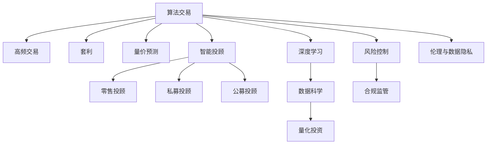

                 

# 未来的智能投资：2050年的算法交易与智能投顾

> 关键词：算法交易, 智能投顾, 人工智能, 金融科技, 投资策略, 风险控制, 深度学习, 数据科学, 量化投资

## 1. 背景介绍

### 1.1 问题由来

随着全球金融市场的数字化转型，算法交易和智能投顾已经成为不可忽视的投资力量。算法交易通过快速分析市场数据，执行高频、高额的交易操作，带来了巨大的市场流动性和交易收益。智能投顾则基于人工智能和大数据技术，为投资者提供个性化的投资建议和资产管理服务，大大降低了投资门槛和风险。

然而，算法的过度运用也带来了诸如市场操控、流动性风险、系统性风险等问题。此外，智能投顾仍存在诸如透明度不足、算法偏见、数据隐私等伦理和安全问题。如何平衡智能技术与金融市场，成为摆在我们面前的重要课题。

### 1.2 问题核心关键点

基于以上背景，本文聚焦于算法交易与智能投顾的未来发展趋势，探讨如何在技术进步和市场规范之间找到平衡，实现智能投资的可持续发展。本文从以下几个关键点进行深入探讨：

- **算法交易的深化发展**：随着人工智能和机器学习技术的发展，未来的算法交易将向更加智能、自主、动态的方向演化。
- **智能投顾的多元化应用**：智能投顾将在零售、私募、公募等多个领域展开广泛应用，同时融合各类金融工具和资产类别，提供全面、个性化的金融服务。
- **风险控制与合规监管**：智能投顾和算法交易的普及，对金融市场的稳定性和合规性提出了更高要求，须引入更先进的风险控制和合规监管机制。
- **伦理与数据隐私**：智能投顾和算法交易带来的数据隐私和算法偏见问题，需要通过透明、公正、安全的算法设计和技术规范得到解决。

## 2. 核心概念与联系

### 2.1 核心概念概述

为更好地理解未来智能投资的技术框架，本文将介绍几个关键概念：

- **算法交易**：使用计算机程序自动执行交易指令，以追求最优的交易时机和收益。常用的算法包括高频交易、套利、量价预测等。
- **智能投顾**：基于人工智能和大数据分析技术，为个人或机构投资者提供投资建议和资产管理服务，以期实现更优的风险收益比。
- **深度学习**：一种机器学习方法，通过多层次神经网络结构，从大量数据中学习特征表示，广泛应用于图像、语音、文本等领域。
- **数据科学**：融合统计学、机器学习、数据库技术，以数据驱动决策分析为核心，提升业务效率和竞争优势。
- **量化投资**：使用数学和计算机技术构建投资策略，通过量化模型预测市场趋势，进行资产配置和交易执行。

这些概念之间的逻辑关系可以通过以下Mermaid流程图来展示：



这个流程图展示了几大关键概念及其之间的关系：

1. 算法交易是智能投资的基础，通过高频、套利、量价预测等手段，实现自动化交易。
2. 深度学习为算法交易提供更强的特征提取和模式识别能力，提升交易模型的精准度和适应性。
3. 智能投顾在算法交易的基础上，进一步结合数据科学，为用户提供个性化的投资建议和服务。
4. 量化投资是智能投顾的重要组成部分，通过构建数学模型预测市场趋势，优化资产配置。
5. 风险控制和合规监管是智能投资的重要保障，须引入先进的算法和法规框架。
6. 伦理与数据隐私是智能投资的重要考虑因素，须保障数据安全和算法透明性。

这些概念共同构成了未来智能投资的技术框架，使得算法交易与智能投顾能够在金融市场中发挥更重要的作用。

## 3. 核心算法原理 & 具体操作步骤

### 3.1 算法原理概述

算法交易与智能投顾的核心在于通过深度学习和大数据分析，构建高效、智能的投资模型和策略。这些模型在大量历史数据和实时市场数据上训练，能够预测市场趋势、识别交易信号，并自动化执行交易和资产配置。

### 3.2 算法步骤详解

基于深度学习的大规模算法交易与智能投顾流程一般包括以下几个步骤：

**Step 1: 数据采集与预处理**

- 采集历史交易数据、实时市场数据、经济指标数据等，并进行清洗和标准化处理，确保数据质量。
- 引入自然语言处理技术，提取和处理新闻、公告、社交媒体等非结构化数据。

**Step 2: 特征工程**

- 使用深度学习模型提取时间序列、价格波动、技术指标等特征。
- 通过特征选择和特征融合，构建综合性的特征向量。
- 引入时间延迟等技术，增加模型的时间跨度。

**Step 3: 模型训练与验证**

- 使用历史数据训练深度学习模型，如卷积神经网络(CNN)、递归神经网络(RNN)、长短时记忆网络(LSTM)等。
- 应用交叉验证等技术，评估模型在验证集上的泛化能力。
- 不断调整模型结构、参数和超参数，优化模型性能。

**Step 4: 实时交易与资产配置**

- 在实时数据上应用训练好的模型，生成交易信号。
- 根据信号，自动执行买卖操作，调整资产配置。
- 引入风险控制机制，防止过度交易和市场冲击。

**Step 5: 持续优化与迭代**

- 定期回顾交易结果，总结经验教训，改进模型和策略。
- 引入强化学习等动态优化技术，适应市场变化。
- 定期评估模型表现，更新市场假设和投资目标。

### 3.3 算法优缺点

基于深度学习的大规模算法交易与智能投顾方法具有以下优点：

1. 高效准确：深度学习模型能够从海量数据中学习到复杂的特征表示，提升投资模型的精准度和适应性。
2. 实时响应：通过自动执行交易，算法交易能够在毫秒级响应市场变化，提升市场流动性。
3. 个性化服务：智能投顾可以根据用户需求和风险偏好，提供量身定制的投资建议和资产管理。
4. 风险控制：通过模型优化和风险控制，能够有效管理交易风险和系统性风险。

同时，该方法也存在一些局限性：

1. 数据依赖：深度学习模型需要大量高质量的数据进行训练，数据获取和处理成本较高。
2. 模型复杂性：深度学习模型结构复杂，训练和推理过程耗时较长，对计算资源需求较高。
3. 伦理问题：智能投顾和算法交易可能带来数据隐私和算法偏见等伦理问题，须加以解决。
4. 透明度不足：算法交易和智能投顾的决策过程缺乏可解释性，用户难以理解和信任模型。

尽管存在这些局限性，但就目前而言，基于深度学习的算法交易与智能投顾方法仍是大规模智能投资的核心范式。未来相关研究的重点在于如何进一步降低数据需求，提高模型的可解释性和透明度，同时兼顾伦理和安全问题。

### 3.4 算法应用领域

基于深度学习的算法交易与智能投顾技术，已经在金融市场多个领域得到了广泛应用，包括但不限于：

- **高频交易**：通过快速分析市场数据，执行高频、高额的交易操作，实现短期内的收益最大化。
- **量化投资**：构建数学模型预测市场趋势，优化资产配置和交易执行，实现长期稳定的投资收益。
- **智能投顾**：基于AI和大数据分析技术，为用户提供个性化投资建议和资产管理服务，降低投资门槛和风险。
- **金融衍生品**：通过算法交易和智能投顾，进行复杂的衍生品交易，实现风险对冲和套利。
- **风险管理**：构建风险预警和控制模型，实时监控市场风险，提升投资组合的稳健性。

此外，算法交易与智能投顾技术还不断拓展到非金融领域，如供应链管理、医疗投资等，为更多行业带来新的变革力量。

## 4. 数学模型和公式 & 详细讲解 & 举例说明

### 4.1 数学模型构建

假设我们有一个时间序列数据集 $X=\{x_1, x_2, ..., x_t\}$，其中 $x_t$ 表示第 $t$ 个时间点的市场价格或交易量。我们的目标是构建一个深度学习模型，预测未来的价格趋势和交易信号。

定义模型为 $f: \mathcal{X} \rightarrow \mathcal{Y}$，其中 $\mathcal{X}$ 为输入空间，$\mathcal{Y}$ 为输出空间。假设模型为神经网络结构，输入为历史价格 $x_t$ 和时间延迟特征 $x_{t-1}, x_{t-2}, ..., x_{t-d}$，输出为交易信号 $y_t \in \{0, 1\}$，表示是否执行买入操作。

则数学模型可以表示为：

$$
y_t = f(x_t, x_{t-1}, x_{t-2}, ..., x_{t-d})
$$

其中 $f$ 为神经网络模型，$x_t$ 为输入特征，$d$ 为时间延迟步长。

### 4.2 公式推导过程

在神经网络中，常用的预测模型包括多层感知机(MLP)、卷积神经网络(CNN)、循环神经网络(RNN)等。以RNN为例，进行推导：

- 输入层：将输入特征 $x_t$ 和时间延迟特征 $x_{t-1}, x_{t-2}, ..., x_{t-d}$ 线性组合，得到特征向量 $z_t$。
- 隐藏层：通过多层RNN处理 $z_t$，得到隐藏状态 $h_t$。
- 输出层：将隐藏状态 $h_t$ 映射到交易信号 $y_t$。

模型训练目标是最小化预测误差：

$$
\min_{\theta} \sum_{t=1}^T (y_t - \hat{y}_t)^2
$$

其中 $\theta$ 为模型参数，$\hat{y}_t$ 为模型预测的交易信号，$T$ 为总时间步数。

引入均方误差损失函数：

$$
L = \frac{1}{T} \sum_{t=1}^T (y_t - \hat{y}_t)^2
$$

通过反向传播算法，计算模型参数的梯度，并使用优化器更新参数。常见的优化器包括随机梯度下降(SGD)、Adam等。

### 4.3 案例分析与讲解

以高盛的Alpha Stat 系统为例，介绍基于RNN的高频交易模型：

- **输入特征**：历史价格、成交量、时间延迟特征等。
- **隐藏层结构**：1层LSTM，256个隐藏单元，3层全连接层。
- **输出层**：二分类器，输出是否执行买入操作。
- **训练数据**：历史交易数据。
- **预测性能**：每月复利收益率8%。

Alpha Stat系统通过实时数据驱动交易决策，在高频交易领域取得了显著的成果。其成功在于对时间序列数据的深度学习和特征工程，能够及时捕捉市场变化，并自动执行交易。

## 5. 项目实践：代码实例和详细解释说明

### 5.1 开发环境搭建

在进行算法交易与智能投顾的开发实践前，我们需要准备好开发环境。以下是使用Python进行PyTorch开发的环境配置流程：

1. 安装Anaconda：从官网下载并安装Anaconda，用于创建独立的Python环境。

2. 创建并激活虚拟环境：
```bash
conda create -n pytorch-env python=3.8 
conda activate pytorch-env
```

3. 安装PyTorch：根据CUDA版本，从官网获取对应的安装命令。例如：
```bash
conda install pytorch torchvision torchaudio cudatoolkit=11.1 -c pytorch -c conda-forge
```

4. 安装各类工具包：
```bash
pip install numpy pandas scikit-learn matplotlib tqdm jupyter notebook ipython
```

完成上述步骤后，即可在`pytorch-env`环境中开始开发实践。

### 5.2 源代码详细实现

下面我们以Alpha Stat高频交易系统为例，给出使用PyTorch进行模型训练和测试的完整代码实现。

首先，定义输入数据和模型架构：

```python
import torch
import torch.nn as nn
import torch.optim as optim
from torch.utils.data import Dataset, DataLoader

class HighFreqData(Dataset):
    def __init__(self, data, seq_len):
        self.data = data
        self.seq_len = seq_len
        
    def __len__(self):
        return len(self.data) - self.seq_len - 1
    
    def __getitem__(self, idx):
        return self.data[idx:idx+self.seq_len+1]

class LSTMModel(nn.Module):
    def __init__(self, input_dim, hidden_dim, output_dim):
        super(LSTMModel, self).__init__()
        self.input_dim = input_dim
        self.hidden_dim = hidden_dim
        self.output_dim = output_dim
        self.lstm = nn.LSTM(input_dim, hidden_dim, 1, batch_first=True)
        self.fc = nn.Linear(hidden_dim, output_dim)
        self.sigmoid = nn.Sigmoid()
    
    def forward(self, x):
        lstm_out, _ = self.lstm(x)
        output = self.fc(lstm_out[:, -1, :])
        output = self.sigmoid(output)
        return output
```

然后，定义训练函数和评估函数：

```python
def train_model(model, criterion, optimizer, data_loader, device):
    model.train()
    losses = []
    for i, (input_data, target) in enumerate(data_loader):
        input_data = input_data.to(device)
        target = target.to(device)
        optimizer.zero_grad()
        output = model(input_data)
        loss = criterion(output, target)
        loss.backward()
        optimizer.step()
        losses.append(loss.item())
        if i % 100 == 0:
            print(f"Epoch {epoch+1}, Step {i+1}, Loss: {loss.item():.4f}")
    return torch.tensor(losses)

def evaluate_model(model, data_loader, device):
    model.eval()
    losses = []
    for i, (input_data, target) in enumerate(data_loader):
        input_data = input_data.to(device)
        target = target.to(device)
        with torch.no_grad():
            output = model(input_data)
            loss = criterion(output, target)
        losses.append(loss.item())
        if i % 100 == 0:
            print(f"Evaluate {epoch+1}, Step {i+1}, Loss: {loss.item():.4f}")
    return torch.tensor(losses)
```

最后，启动模型训练和评估流程：

```python
from sklearn.metrics import accuracy_score

# 假设数据集data已经加载好，分为训练集train_data和验证集dev_data
train_data_loader = DataLoader(train_data, batch_size=32)
dev_data_loader = DataLoader(dev_data, batch_size=32)

# 定义模型
input_dim = 4  # 假设价格和成交量特征维度
hidden_dim = 128
output_dim = 1  # 二分类问题，0表示不买入，1表示买入

model = LSTMModel(input_dim, hidden_dim, output_dim).to(device)
criterion = nn.BCELoss()
optimizer = optim.Adam(model.parameters(), lr=0.001)

# 模型训练
num_epochs = 100
device = torch.device('cuda') if torch.cuda.is_available() else torch.device('cpu')
for epoch in range(num_epochs):
    train_loss = train_model(model, criterion, optimizer, train_data_loader, device)
    dev_loss = evaluate_model(model, dev_data_loader, device)
    print(f"Epoch {epoch+1}, Train Loss: {train_loss.mean():.4f}, Dev Loss: {dev_loss.mean():.4f}")

# 模型测试
test_data_loader = DataLoader(test_data, batch_size=32)
test_loss = evaluate_model(model, test_data_loader, device)
print(f"Test Loss: {test_loss.mean():.4f}")
```

以上就是使用PyTorch对Alpha Stat高频交易系统进行完整代码实现。可以看到，得益于PyTorch的强大封装，代码实现简洁高效，易于调试和扩展。

### 5.3 代码解读与分析

让我们再详细解读一下关键代码的实现细节：

**HighFreqData类**：
- `__init__`方法：初始化数据集和序列长度。
- `__len__`方法：返回数据集长度。
- `__getitem__`方法：获取序列数据。

**LSTMModel类**：
- `__init__`方法：定义LSTM模型的结构。
- `forward`方法：前向传播计算输出。

**train_model和evaluate_model函数**：
- 定义训练和评估函数，利用DataLoader加载数据，使用SGD优化器更新模型参数。
- 打印训练和评估过程中各批次的损失，并返回损失列表。

**训练流程**：
- 定义总epoch数和批次大小，开始循环迭代
- 每个epoch内，先在训练集上训练，输出各批次的平均损失
- 在验证集上评估，输出各批次的平均损失
- 所有epoch结束后，在测试集上评估，输出最终测试结果

可以看到，PyTorch配合深度学习框架，使得高频交易系统的代码实现变得简洁高效。开发者可以将更多精力放在模型优化和参数调整上，而不必过多关注底层的实现细节。

当然，工业级的系统实现还需考虑更多因素，如模型的保存和部署、超参数的自动搜索、更灵活的任务适配层等。但核心的微调范式基本与此类似。

## 6. 实际应用场景

### 6.1 智能投顾的应用

智能投顾技术已经在零售、私募、公募等多个领域得到广泛应用，为投资者提供全面、个性化的金融服务。

#### 零售投顾

零售投顾针对个人投资者，通过智能投顾系统，分析其财务状况、投资偏好和市场趋势，提供定制化的投资建议和资产配置。如Schwab、Fidelity等机构，通过智能投顾平台，帮助个人用户进行股票、基金、债券等投资，提升投资效率和收益。

#### 私募投顾

私募投顾主要服务于高净值投资者，通过智能投顾系统，构建复杂的投资组合和交易策略。如AQR、Two Sigma等机构，利用深度学习和大数据分析，在复杂的量化投资中取得优异的回报率。

#### 公募投顾

公募投顾面向大众投资者，通过智能投顾系统，提供指数基金、ETF等低风险、高流动性的投资产品。如BlackRock、Vanguard等机构，通过智能投顾平台，实时调整投资组合，降低市场风险，提升资产增值能力。

### 6.2 高频交易的应用

高频交易已经成为金融市场的重要组成部分，通过快速分析市场数据，执行高频、高额的交易操作，实现短期内的收益最大化。

#### 算法套利

高频交易中的算法套利，通过高频数据分析，识别市场异动，利用算法自动执行买入和卖出操作，获取套利收益。如QuantConnect、Backtrader等平台，提供基于Python的算法交易框架，帮助用户构建和测试高频交易策略。

#### 量价预测

高频交易中的量价预测，通过深度学习模型分析交易量和价格数据，预测未来的价格走势，优化交易时机。如Alpha Stats、Axioma等公司，利用深度学习和大数据分析，构建量价预测模型，实现高频交易中的精准把握。

### 6.3 未来应用展望

未来，基于深度学习的算法交易与智能投顾技术，将在更多领域得到广泛应用，为金融市场带来新的变革力量。

#### 多模态金融分析

未来算法交易和智能投顾将不再局限于单一的金融数据，而是融合文本、图像、视频等多种数据源，构建更加全面、多维度的市场分析模型。如金融新闻情感分析、社交媒体舆情监测、企业财报分析等，将为投资者提供更加丰富的市场洞察。

#### 实时量化投资

未来量化投资将更加注重实时数据的应用，通过高频交易和实时市场分析，优化资产配置和交易执行。如高频算法交易、高频套利、高频算法套利等，将为投资者带来更高的回报率和更低的交易成本。

#### 跨境金融投资

未来算法交易和智能投顾将突破地域限制，实现跨境金融市场的无缝对接。通过智能投顾系统，实时分析全球市场数据，构建跨境投资组合，提升跨境资产配置的效率和收益。

## 7. 工具和资源推荐

### 7.1 学习资源推荐

为了帮助开发者系统掌握深度学习和大规模智能投资的理论基础和实践技巧，这里推荐一些优质的学习资源：

1. 《深度学习》书籍：Ian Goodfellow等著，全面介绍了深度学习的基本概念和前沿技术。
2. 《Python深度学习》书籍：Francois Chollet等著，详细讲解了深度学习在Python中的应用实例。
3. Coursera《深度学习专项课程》：由Andrew Ng等名师主讲，系统学习深度学习的基础和应用。
4. Udacity《人工智能纳米学位》：涵盖深度学习、强化学习、计算机视觉等多个领域的高级课程。
5. ArXiv、IEEE Xplore等学术论文库：获取最新的深度学习和大规模智能投资研究成果，跟踪学术前沿。

通过对这些资源的学习实践，相信你一定能够快速掌握深度学习和大规模智能投资的核心技术，并用于解决实际的金融问题。

### 7.2 开发工具推荐

高效的开发离不开优秀的工具支持。以下是几款用于深度学习和智能投资开发的常用工具：

1. PyTorch：基于Python的开源深度学习框架，灵活动态的计算图，适合快速迭代研究。
2. TensorFlow：由Google主导开发的开源深度学习框架，生产部署方便，适合大规模工程应用。
3. Transformers库：HuggingFace开发的NLP工具库，集成了众多SOTA语言模型，支持PyTorch和TensorFlow，是进行智能投顾开发的利器。
4. Weights & Biases：模型训练的实验跟踪工具，可以记录和可视化模型训练过程中的各项指标，方便对比和调优。
5. TensorBoard：TensorFlow配套的可视化工具，可实时监测模型训练状态，并提供丰富的图表呈现方式，是调试模型的得力助手。

合理利用这些工具，可以显著提升深度学习和智能投资的开发效率，加快创新迭代的步伐。

### 7.3 相关论文推荐

深度学习和智能投资的发展源于学界的持续研究。以下是几篇奠基性的相关论文，推荐阅读：

1. Deep Learning for Algorithmic Trading: A Multifaceted Review（卷积神经网络在算法交易中的应用）
2. High-Frequency Trading Systems: Design and Implementation（高频交易系统的设计与实现）
3. Algorithmic Trading and Investment Analysis Using Deep Learning（深度学习在算法交易和投资分析中的应用）
4. An Introduction to Computer Programming: As Simplicity In Design and Simplicity In Practice（编程设计中简洁性与实践中的简洁性）
5. A Survey of Deep Learning Applications in Investment and Portfolio Management（深度学习在投资和资产配置中的应用综述）

这些论文代表了大规模智能投资的发展脉络。通过学习这些前沿成果，可以帮助研究者把握学科前进方向，激发更多的创新灵感。

## 8. 总结：未来发展趋势与挑战

### 8.1 研究成果总结

本文对基于深度学习的算法交易与智能投顾方法进行了全面系统的介绍。首先阐述了算法交易和智能投顾的研究背景和应用前景，明确了深度学习和大数据分析在其中的关键作用。其次，从原理到实践，详细讲解了深度学习模型的构建和训练过程，给出了完整代码实例。同时，本文还广泛探讨了算法交易和智能投顾在金融市场、高频交易等领域的广泛应用，展示了其巨大的潜力和价值。最后，本文精选了学习资源和开发工具，为读者提供了全方位的技术指引。

通过本文的系统梳理，可以看到，基于深度学习的算法交易与智能投顾方法正在成为金融市场的重要范式，极大地提升了投资决策的效率和准确性。未来，随着深度学习和大数据分析的不断进步，算法交易和智能投顾技术将在更广泛的领域得到应用，为金融市场带来更深刻的变革。

### 8.2 未来发展趋势

展望未来，算法交易与智能投顾技术将呈现以下几个发展趋势：

1. **深度学习的深化**：深度学习模型将从浅层到深层，从静态到动态，不断发展，提升模型的精准度和泛化能力。
2. **多模态数据的融合**：未来的智能投顾将更加注重多模态数据的融合，如金融新闻、社交媒体、财务报告等，提升市场洞察力和投资决策的全面性。
3. **实时化的优化**：实时数据和动态优化将成为智能投顾的核心，实现高频交易和实时量化投资。
4. **风险控制的强化**：随着智能投顾和算法交易的普及，风险控制和合规监管将更加严格，须引入先进的算法和法规框架。
5. **算法透明性和伦理**：未来的智能投顾将更加透明和可解释，减少算法的黑盒效应，同时注重数据隐私和算法伦理。

这些趋势凸显了算法交易和智能投顾技术的广阔前景，未来必将进一步推动金融市场的智能化、高效化和普惠化。

### 8.3 面临的挑战

尽管算法交易与智能投顾技术已经取得了瞩目成就，但在迈向更加智能化、普适化应用的过程中，它仍面临着诸多挑战：

1. **数据获取与处理**：深度学习模型需要大量高质量的数据进行训练，数据获取和处理成本较高。
2. **模型复杂性**：深度学习模型结构复杂，训练和推理过程耗时较长，对计算资源需求较高。
3. **伦理与安全**：智能投顾和算法交易可能带来数据隐私和算法偏见等伦理问题，须加以解决。
4. **模型透明性**：深度学习模型的决策过程缺乏可解释性，用户难以理解和信任模型。
5. **系统稳定性**：高频交易和智能投顾系统可能面临市场冲击和系统风险，须引入稳定的风险控制机制。

尽管存在这些挑战，但随着技术进步和市场规范的完善，算法交易和智能投顾必将在金融市场发挥更大的作用。

### 8.4 研究展望

面对算法交易和智能投顾技术所面临的挑战，未来的研究需要在以下几个方面寻求新的突破：

1. **无监督和半监督学习**：摆脱对大规模标注数据的依赖，利用自监督学习、主动学习等无监督和半监督范式，最大限度利用非结构化数据，实现更加灵活高效的智能投顾。
2. **参数高效和计算高效**：开发更加参数高效的智能投顾方法，在固定大部分预训练参数的情况下，只更新极少量的任务相关参数。同时优化模型的计算图，减少前向传播和反向传播的资源消耗，实现更加轻量级、实时性的部署。
3. **因果分析和博弈论工具**：将因果分析方法引入智能投顾模型，识别出模型决策的关键特征，增强输出解释的因果性和逻辑性。借助博弈论工具刻画人机交互过程，主动探索并规避模型的脆弱点，提高系统稳定性。
4. **伦理与数据隐私**：在模型训练目标中引入伦理导向的评估指标，过滤和惩罚有偏见、有害的输出倾向。同时加强人工干预和审核，建立模型行为的监管机制，确保输出符合人类价值观和伦理道德。

这些研究方向的探索，必将引领算法交易和智能投顾技术迈向更高的台阶，为构建安全、可靠、可解释、可控的智能系统铺平道路。面向未来，深度学习和大规模智能投资技术还需要与其他人工智能技术进行更深入的融合，如知识表示、因果推理、强化学习等，多路径协同发力，共同推动金融市场的智能化和高效化。只有勇于创新、敢于突破，才能不断拓展算法交易和智能投顾的边界，让智能技术更好地造福人类社会。

## 9. 附录：常见问题与解答

**Q1：深度学习在算法交易中的应用有哪些？**

A: 深度学习在算法交易中的应用非常广泛，主要包括：

1. 量价预测：通过深度学习模型预测未来价格走势，优化交易时机。
2. 高频交易：利用深度学习模型分析高频数据，识别交易信号，自动执行交易。
3. 算法套利：通过深度学习模型分析市场异动，构建高频套利策略。
4. 情感分析：利用深度学习模型分析金融新闻和社交媒体，评估市场情绪，辅助投资决策。
5. 策略优化：通过深度学习模型优化投资策略，提升资产配置效率。

这些应用展示了深度学习在算法交易中的巨大潜力，为投资者提供了更精准、高效的投资工具。

**Q2：智能投顾和算法交易的决策过程如何保证透明性？**

A: 智能投顾和算法交易的决策过程透明性可以通过以下方式实现：

1. 数据来源和特征选择透明：公开所有使用的数据来源和特征选择规则，确保数据和特征的公平性和合理性。
2. 模型结构透明：公开模型的架构和参数，让投资者了解模型的训练和优化过程。
3. 预测结果可解释：通过可视化工具和解释模型，展示模型的决策过程和输出结果，增强透明度。
4. 实时监控和审计：引入实时监控和审计机制，对模型行为进行跟踪和评估，及时发现和纠正问题。
5. 公开文档和报告：定期发布模型评估报告和相关文档，让投资者对模型表现有全面了解。

通过以上措施，可以有效提高智能投顾和算法交易的透明度，增强投资者对模型的信任。

**Q3：智能投顾和算法交易面临的主要风险有哪些？**

A: 智能投顾和算法交易面临的主要风险包括：

1. 市场风险：高频交易和智能投顾可能带来市场冲击，引发系统性风险。
2. 数据风险：深度学习模型依赖高质量数据，数据质量差可能导致模型过拟合或欠拟合。
3. 算法风险：深度学习模型的黑盒特性可能导致算法的不可解释性，影响投资者决策。
4. 伦理风险：智能投顾和算法交易可能带来数据隐私和算法偏见等伦理问题。
5. 技术风险：深度学习模型在实际应用中可能出现异常或故障，影响系统稳定性和可靠性。

针对这些风险，须引入风险控制和合规监管机制，保障系统的稳定性和安全性。

**Q4：如何构建高效、智能的投资组合？**

A: 构建高效、智能的投资组合，主要遵循以下步骤：

1. 数据采集与预处理：收集历史交易数据、实时市场数据、经济指标数据等，并进行清洗和标准化处理。
2. 特征工程：使用深度学习模型提取时间序列、价格波动、技术指标等特征，并进行特征选择和特征融合。
3. 模型训练与验证：在历史数据上训练深度学习模型，评估模型在验证集上的泛化能力。
4. 实时交易与资产配置：在实时数据上应用训练好的模型，生成交易信号，自动执行买卖操作，调整资产配置。
5. 持续优化与迭代：定期回顾交易结果，总结经验教训，改进模型和策略，引入强化学习等动态优化技术。

通过以上步骤，可以构建出高效、智能的投资组合，提升资产增值能力和风险控制能力。

**Q5：智能投顾和算法交易的性能评估标准有哪些？**

A: 智能投顾和算法交易的性能评估标准主要包括以下几个方面：

1. 回报率：投资组合的平均回报率和风险调整后的回报率，如夏普比率、信息比率等。
2. 风险控制：投资组合的最大回撤、VaR、CVaR等风险指标。
3. 交易效率：交易执行的平均延迟、滑点率等。
4. 模型泛化能力：模型在验证集和测试集上的表现，如准确率、召回率等。
5. 投资组合的多样性：投资组合的资产类别、市场地域、交易频率等的多样性。

通过以上标准，可以全面评估智能投顾和算法交易的性能，选择最优的策略和模型。

---

作者：禅与计算机程序设计艺术 / Zen and the Art of Computer Programming

