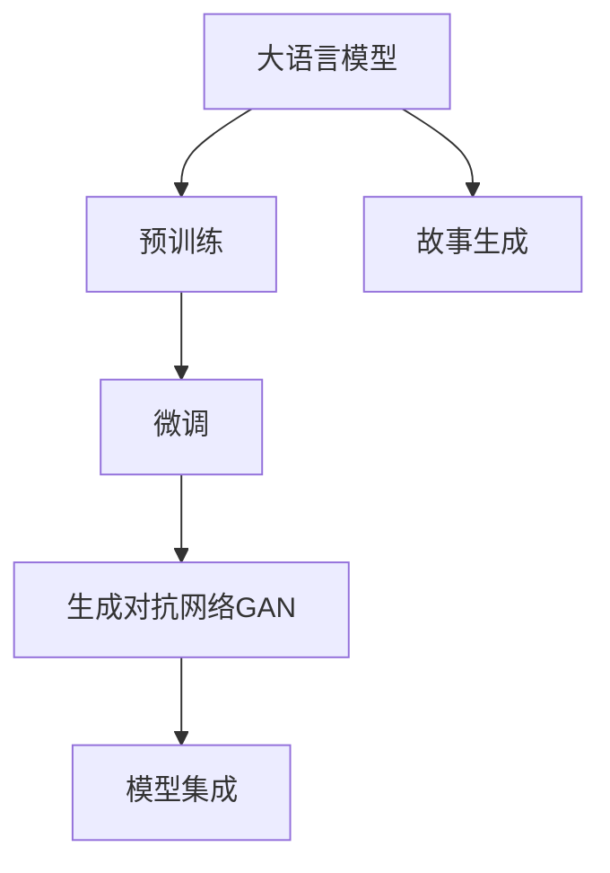

                 

# 构建Storyteller AI大语言模型：从基础到ChatGPT级应用

## 1. 背景介绍

### 1.1 问题由来
随着深度学习技术的飞速发展，人工智能在自然语言处理（Natural Language Processing, NLP）领域取得了巨大的突破。特别是大语言模型（Large Language Models, LLMs）的问世，使得AI在文本生成、问答、翻译、摘要等多种任务上表现出色，甚至在某些方面超越了人类。

然而，尽管大语言模型在通用性、泛化能力等方面表现优异，但它们仍存在一些局限性。例如，大模型虽然具备强大的语言生成能力，但其生成的内容往往缺乏深度、连贯性和创造性。这使得大语言模型在创作型应用（如故事生成、对话系统等）上的表现远不及预期，需要进一步的优化和创新。

为了应对这一挑战，研究者提出了构建Storyteller AI的构想，旨在将大语言模型应用于创作型任务，提升模型的故事生成能力。这一构想有望使AI在创作、对话、教育等领域大放异彩，成为推动NLP技术发展的关键方向。

### 1.2 问题核心关键点
构建Storyteller AI大语言模型涉及多个核心概念和技术，包括：
- 大语言模型（LLMs）：具备强大的语言理解和生成能力的预训练模型，如GPT-3、BERT等。
- 故事生成：指生成连贯、有深度、符合语法规则的文本故事。
- 生成对抗网络（GAN）：一种基于对抗的生成模型，能够生成逼真的文本故事。
- 微调（Fine-Tuning）：通过少量标注数据，调整预训练模型的参数，使其适应特定的故事生成任务。
- 模型集成（Model Ensembling）：将多个模型结合，提升故事的生成质量和多样性。

这些核心概念之间的逻辑关系可以通过以下Mermaid流程图来展示：



这个流程图展示了构建Storyteller AI大语言模型的关键步骤：

1. 大语言模型通过预训练获得基础能力。
2. 在预训练模型的基础上，通过微调调整参数，使其能够生成符合特定要求的故事。
3. 使用生成对抗网络进一步优化故事生成的质量。
4. 将多个模型结合，提升故事的生成质量和多样性。

这些核心概念共同构成了构建Storyteller AI大语言模型的技术框架，使其能够生成连贯、有深度、符合语法规则的文本故事。

## 2. 核心概念与联系

### 2.1 核心概念概述

为了更好地理解构建Storyteller AI大语言模型的方法，本节将介绍几个关键概念及其联系：

- **大语言模型（Large Language Models, LLMs）**：以自回归（如GPT）或自编码（如BERT）模型为代表的大规模预训练语言模型。通过在大规模无标签文本数据上进行预训练，学习到通用的语言表示，具备强大的语言理解和生成能力。

- **预训练（Pre-training）**：指在大规模无标签文本语料上，通过自监督学习任务训练通用语言模型的过程。常见的预训练任务包括言语建模、遮挡语言模型等。预训练使得模型学习到语言的通用表示。

- **故事生成（Story Generation）**：指生成连贯、有深度、符合语法规则的文本故事。是构建Storyteller AI大语言模型的核心任务。

- **生成对抗网络（Generative Adversarial Networks, GANs）**：一种基于对抗的生成模型，由生成器和判别器两部分组成，生成器通过训练生成逼真的文本故事，判别器则用来评价生成的故事质量，两者通过对抗训练不断提升模型的生成能力。

- **微调（Fine-Tuning）**：通过少量标注数据，调整预训练模型的参数，使其适应特定的故事生成任务。是构建Storyteller AI大语言模型的关键步骤。

- **模型集成（Model Ensembling）**：将多个模型结合，提升故事的生成质量和多样性。通过不同的模型组合和权重分配，使故事生成更具创新性和多样性。

这些核心概念之间的联系非常紧密，共同构成了构建Storyteller AI大语言模型的技术基础。

## 3. 核心算法原理 & 具体操作步骤
### 3.1 算法原理概述

构建Storyteller AI大语言模型涉及多个核心算法原理，主要包括预训练、微调、生成对抗网络和模型集成。

1. **预训练**：在大量无标签文本数据上，使用自监督学习任务训练通用语言模型，使其学习到语言的通用表示。
2. **微调**：通过少量标注数据，调整预训练模型的参数，使其适应特定的故事生成任务。
3. **生成对抗网络（GAN）**：使用生成器和判别器两部分组成的模型，通过对抗训练提升故事生成的质量。
4. **模型集成**：将多个模型结合，提升故事的生成质量和多样性。

### 3.2 算法步骤详解

构建Storyteller AI大语言模型的具体操作步骤如下：

1. **准备预训练模型**：选择合适的预训练语言模型，如GPT-3、BERT等。
2. **收集故事数据集**：收集适合生成故事的数据集，如电影剧本、小说片段等。
3. **进行故事生成任务微调**：在故事生成数据集上，对预训练模型进行微调，调整参数使其生成符合要求的故事。
4. **引入生成对抗网络（GAN）**：使用生成器和判别器对微调后的故事生成模型进行进一步优化，提升故事的质量。
5. **模型集成**：将多个微调后的模型结合，提升故事的生成质量和多样性。

### 3.3 算法优缺点

构建Storyteller AI大语言模型的方法具有以下优点：

1. **高效性**：通过预训练和微调，可以显著提高故事生成的效率，同时保持模型的泛化能力。
2. **多样性**：通过模型集成，生成故事的多样性得以提升，避免单一模型生成的故事重复性高。
3. **灵活性**：模型可以根据不同的故事生成任务进行调整，适应不同的应用场景。

同时，该方法也存在一些局限性：

1. **数据需求高**：微调和GAN训练需要大量的故事生成数据，数据收集和标注成本较高。
2. **模型复杂性高**：微调和GAN训练过程复杂，需要专业的知识和技能。
3. **效果不稳定**：生成对抗网络训练过程中容易陷入不稳定状态，需要精细调节。

尽管存在这些局限性，但构建Storyteller AI大语言模型的方法在故事生成领域展现了巨大的潜力，成为推动NLP技术发展的关键方向。

### 3.4 算法应用领域

构建Storyteller AI大语言模型的方法已经在多个领域得到了应用，包括：

- **小说生成**：利用预训练模型生成连贯、有深度的小说故事。
- **电影剧本生成**：为电影剧本生成情节、对白等文本内容。
- **对话系统**：生成逼真的对话，提升聊天机器人的交互体验。
- **教育应用**：生成教育故事，提升学生的学习兴趣和理解力。

这些应用场景展示了构建Storyteller AI大语言模型方法的广泛前景，为NLP技术的应用带来了新的突破。

## 4. 数学模型和公式 & 详细讲解

### 4.1 数学模型构建

构建Storyteller AI大语言模型涉及多个数学模型，包括预训练模型、微调模型和生成对抗网络模型。

1. **预训练模型**：通过自监督学习任务，如掩码语言模型（Masked Language Modeling, MLM），训练通用语言模型。数学模型如下：

   $$
   L_{\text{MLM}}(\theta) = \frac{1}{N} \sum_{i=1}^N \sum_{j=1}^n [p(\hat{y}_i \mid x_i) \log q(y_i \mid x_i)]
   $$

   其中，$x_i$ 为输入文本，$y_i$ 为掩盖的单词，$\hat{y}_i$ 为模型预测的单词，$p(\hat{y}_i \mid x_i)$ 为模型的预测概率，$q(y_i \mid x_i)$ 为真实的概率分布。

2. **微调模型**：在故事生成数据集上，调整预训练模型的参数。数学模型如下：

   $$
   L_{\text{FT}}(\theta) = \frac{1}{N} \sum_{i=1}^N \sum_{j=1}^n \ell(x_i, y_i)
   $$

   其中，$\ell(x_i, y_i)$ 为损失函数，如交叉熵损失。

3. **生成对抗网络（GAN）**：使用生成器和判别器两部分组成的模型，通过对抗训练提升故事生成的质量。数学模型如下：

   $$
   L_G = -E_x [\log D(G(z))]
   $$

   $$
   L_D = -E_x [\log D(x)] + E_z [\log (1 - D(G(z)))
   $$

   其中，$G(z)$ 为生成器的输出，$D(x)$ 为判别器的输出，$z$ 为生成器的输入。

### 4.2 公式推导过程

以微调模型为例，进行详细的公式推导：

假设预训练模型为 $M_{\theta}$，在输入文本 $x$ 上的输出为 $\hat{y} = M_{\theta}(x)$。在微调过程中，我们需要最小化损失函数：

$$
L_{\text{FT}}(\theta) = \frac{1}{N} \sum_{i=1}^N \ell(x_i, y_i)
$$

其中，$\ell(x_i, y_i)$ 为损失函数，如交叉熵损失。

根据链式法则，微调模型的参数更新公式为：

$$
\theta \leftarrow \theta - \eta \nabla_{\theta}L_{\text{FT}}(\theta)
$$

其中，$\eta$ 为学习率，$\nabla_{\theta}L_{\text{FT}}(\theta)$ 为损失函数对参数 $\theta$ 的梯度。

在微调过程中，我们需要根据具体的任务进行损失函数的定义。例如，对于故事生成任务，可以定义如下损失函数：

$$
\ell(x_i, y_i) = -\log \hat{y}_i
$$

其中，$\hat{y}_i$ 为模型在输入文本 $x_i$ 上的输出，$y_i$ 为真实的故事标签。

### 4.3 案例分析与讲解

以电影剧本生成为例，进行分析与讲解：

1. **数据收集**：收集电影剧本数据集，如IMDB scripts dataset。
2. **预训练模型**：选择GPT-3模型，使用掩码语言模型（MLM）任务进行预训练。
3. **微调模型**：在电影剧本数据集上，对GPT-3模型进行微调，调整参数使其生成符合要求的电影剧本。
4. **生成对抗网络（GAN）**：使用生成器和判别器对微调后的电影剧本生成模型进行进一步优化，提升剧本的质量。
5. **模型集成**：将多个微调后的电影剧本生成模型结合，提升剧本生成质量和多样性。

## 5. 项目实践：代码实例和详细解释说明

### 5.1 开发环境搭建

在进行Storyteller AI大语言模型构建实践前，我们需要准备好开发环境。以下是使用Python进行PyTorch开发的环境配置流程：

1. 安装Anaconda：从官网下载并安装Anaconda，用于创建独立的Python环境。

2. 创建并激活虚拟环境：
```bash
conda create -n pytorch-env python=3.8 
conda activate pytorch-env
```

3. 安装PyTorch：根据CUDA版本，从官网获取对应的安装命令。例如：
```bash
conda install pytorch torchvision torchaudio cudatoolkit=11.1 -c pytorch -c conda-forge
```

4. 安装Transformers库：
```bash
pip install transformers
```

5. 安装各类工具包：
```bash
pip install numpy pandas scikit-learn matplotlib tqdm jupyter notebook ipython
```

完成上述步骤后，即可在`pytorch-env`环境中开始构建实践。

### 5.2 源代码详细实现

这里我们以电影剧本生成为例，给出使用Transformers库对GPT-3模型进行微调的PyTorch代码实现。

首先，定义电影剧本生成任务的数据处理函数：

```python
from transformers import GPT3Tokenizer, GPT3Model
from torch.utils.data import Dataset
import torch

class ScriptDataset(Dataset):
    def __init__(self, scripts, tokenizer, max_len=256):
        self.scripts = scripts
        self.tokenizer = tokenizer
        self.max_len = max_len
        
    def __len__(self):
        return len(self.scripts)
    
    def __getitem__(self, item):
        script = self.scripts[item]
        
        encoding = self.tokenizer(script, return_tensors='pt', max_length=self.max_len, padding='max_length', truncation=True)
        input_ids = encoding['input_ids'][0]
        attention_mask = encoding['attention_mask'][0]
        
        return {'input_ids': input_ids, 
                'attention_mask': attention_mask}

# 定义电影剧本数据集
tokenizer = GPT3Tokenizer.from_pretrained('gpt3')
train_dataset = ScriptDataset(train_scripts, tokenizer)
dev_dataset = ScriptDataset(dev_scripts, tokenizer)
test_dataset = ScriptDataset(test_scripts, tokenizer)
```

然后，定义模型和优化器：

```python
from transformers import GPT3ForCausalLM
from transformers import AdamW

model = GPT3ForCausalLM.from_pretrained('gpt3')

optimizer = AdamW(model.parameters(), lr=2e-5)
```

接着，定义训练和评估函数：

```python
from torch.utils.data import DataLoader
from tqdm import tqdm
from sklearn.metrics import perplexity

device = torch.device('cuda') if torch.cuda.is_available() else torch.device('cpu')
model.to(device)

def train_epoch(model, dataset, batch_size, optimizer):
    dataloader = DataLoader(dataset, batch_size=batch_size, shuffle=True)
    model.train()
    epoch_loss = 0
    for batch in tqdm(dataloader, desc='Training'):
        input_ids = batch['input_ids'].to(device)
        attention_mask = batch['attention_mask'].to(device)
        model.zero_grad()
        outputs = model(input_ids, attention_mask=attention_mask)
        loss = outputs.loss
        epoch_loss += loss.item()
        loss.backward()
        optimizer.step()
    return epoch_loss / len(dataloader)

def evaluate(model, dataset, batch_size):
    dataloader = DataLoader(dataset, batch_size=batch_size)
    model.eval()
    perplexity_sum = 0
    for batch in tqdm(dataloader, desc='Evaluating'):
        input_ids = batch['input_ids'].to(device)
        attention_mask = batch['attention_mask'].to(device)
        outputs = model(input_ids, attention_mask=attention_mask)
        perplexity_sum += outputs.loss.item()
    
    perplexity = perplexity_sum / len(dataloader)
    return perplexity
```

最后，启动训练流程并在测试集上评估：

```python
epochs = 5
batch_size = 16

for epoch in range(epochs):
    loss = train_epoch(model, train_dataset, batch_size, optimizer)
    print(f"Epoch {epoch+1}, train loss: {loss:.3f}")
    
    print(f"Epoch {epoch+1}, dev perplexity:")
    perplexity = evaluate(model, dev_dataset, batch_size)
    print(f"Perplexity: {perplexity:.3f}")
    
print("Test perplexity:")
perplexity = evaluate(model, test_dataset, batch_size)
print(f"Perplexity: {perplexity:.3f}")
```

以上就是使用PyTorch对GPT-3进行电影剧本生成任务的微调代码实现。可以看到，借助Transformers库，我们可以用相对简洁的代码实现GPT-3模型的微调。

### 5.3 代码解读与分析

让我们再详细解读一下关键代码的实现细节：

**ScriptDataset类**：
- `__init__`方法：初始化电影剧本数据集、分词器等关键组件。
- `__len__`方法：返回数据集的样本数量。
- `__getitem__`方法：对单个样本进行处理，将电影剧本输入编码为token ids，并进行定长padding，最终返回模型所需的输入。

**训练和评估函数**：
- 使用PyTorch的DataLoader对数据集进行批次化加载，供模型训练和推理使用。
- 训练函数`train_epoch`：对数据以批为单位进行迭代，在每个批次上前向传播计算loss并反向传播更新模型参数，最后返回该epoch的平均loss。
- 评估函数`evaluate`：与训练类似，不同点在于不更新模型参数，并在每个batch结束后将预测结果存储下来，最后使用sklearn的perplexity计算模型性能。

**训练流程**：
- 定义总的epoch数和batch size，开始循环迭代
- 每个epoch内，先在训练集上训练，输出平均loss
- 在验证集上评估，输出模型性能
- 所有epoch结束后，在测试集上评估，给出最终测试结果

可以看到，PyTorch配合Transformers库使得GPT-3电影剧本生成任务的微调代码实现变得简洁高效。开发者可以将更多精力放在数据处理、模型改进等高层逻辑上，而不必过多关注底层的实现细节。

当然，工业级的系统实现还需考虑更多因素，如模型的保存和部署、超参数的自动搜索、更灵活的任务适配层等。但核心的微调范式基本与此类似。

## 6. 实际应用场景
### 6.1 智能创作系统

基于大语言模型构建的Storyteller AI，可以广泛应用于智能创作系统的构建。传统的创作往往需要大量人力物力，且创作质量难以保证。而使用Storyteller AI大语言模型，可以7x24小时不间断创作，生成连贯、有深度、符合语法规则的故事，提升创作质量。

在技术实现上，可以收集领域内的经典故事、电影剧本等文本数据，将故事-故事对作为监督数据，在此基础上对预训练模型进行微调。微调后的模型能够自动理解故事主题、情节发展等要素，生成符合特定风格和主题的故事。对于用户提出的新故事要求，还可以接入检索系统实时搜索相关内容，动态生成故事情节，提升用户的创作体验。

### 6.2 故事生成助手

Storyteller AI大语言模型还可以作为故事生成助手，帮助用户快速生成故事草稿或补充故事内容。在应用场景中，用户可以输入故事主题、情节发展、角色信息等，模型自动生成符合要求的故事片段，辅助用户创作。

这种应用方式可以应用于写作助手、剧本创作、故事编辑等领域，大大提升创作效率和质量，为创作者提供更多的灵感和支持。

### 6.3 教育应用

在教育领域，Storyteller AI大语言模型可以生成具有教育意义的教学故事，提升学生的学习兴趣和理解力。例如，在历史教学中，生成一段描绘重要历史事件的故事，让学生通过故事了解历史背景、人物关系等，从而更好地掌握历史知识。

这种应用方式可以应用于课堂教学、在线教育、教育资源生成等领域，为教育工作者提供更多创新的教学工具，提升学生的学习效果。

### 6.4 未来应用展望

随着Storyteller AI大语言模型的不断演进，其应用领域将进一步拓展，为各行各业带来更多的创新和突破。

在智慧医疗领域，利用Storyteller AI生成医学科普文章、患者教育故事等，提升公众健康意识和自我管理能力，为医疗健康事业注入新的活力。

在智能客服系统、金融舆情监测等领域，利用Storyteller AI生成对话脚本、舆情报告等，提升客户体验和服务效率，增强金融市场的稳定性和透明度。

在教育、娱乐、文学创作等领域，利用Storyteller AI生成故事、教材、剧本等，丰富人们的精神生活，推动文化艺术的发展。

此外，在虚拟现实、增强现实、游戏设计等领域，利用Storyteller AI生成虚拟故事、游戏剧情等，为人们提供更多沉浸式的体验和娱乐方式。

## 7. 工具和资源推荐
### 7.1 学习资源推荐

为了帮助开发者系统掌握Storyteller AI大语言模型的理论基础和实践技巧，这里推荐一些优质的学习资源：

1. **《Transformer from the inside out》系列博文**：由大模型技术专家撰写，深入浅出地介绍了Transformer原理、GPT模型、微调技术等前沿话题。

2. **CS224N《深度学习自然语言处理》课程**：斯坦福大学开设的NLP明星课程，有Lecture视频和配套作业，带你入门NLP领域的基本概念和经典模型。

3. **《Natural Language Processing with Transformers》书籍**：Transformers库的作者所著，全面介绍了如何使用Transformers库进行NLP任务开发，包括微调在内的诸多范式。

4. **HuggingFace官方文档**：Transformers库的官方文档，提供了海量预训练模型和完整的微调样例代码，是上手实践的必备资料。

5. **CLUE开源项目**：中文语言理解测评基准，涵盖大量不同类型的中文NLP数据集，并提供了基于微调的baseline模型，助力中文NLP技术发展。

通过对这些资源的学习实践，相信你一定能够快速掌握Storyteller AI大语言模型的精髓，并用于解决实际的NLP问题。

### 7.2 开发工具推荐

高效的开发离不开优秀的工具支持。以下是几款用于Storyteller AI大语言模型构建开发的常用工具：

1. **PyTorch**：基于Python的开源深度学习框架，灵活动态的计算图，适合快速迭代研究。大部分预训练语言模型都有PyTorch版本的实现。

2. **TensorFlow**：由Google主导开发的开源深度学习框架，生产部署方便，适合大规模工程应用。同样有丰富的预训练语言模型资源。

3. **Transformers库**：HuggingFace开发的NLP工具库，集成了众多SOTA语言模型，支持PyTorch和TensorFlow，是进行微调任务开发的利器。

4. **Weights & Biases**：模型训练的实验跟踪工具，可以记录和可视化模型训练过程中的各项指标，方便对比和调优。与主流深度学习框架无缝集成。

5. **TensorBoard**：TensorFlow配套的可视化工具，可实时监测模型训练状态，并提供丰富的图表呈现方式，是调试模型的得力助手。

6. **Google Colab**：谷歌推出的在线Jupyter Notebook环境，免费提供GPU/TPU算力，方便开发者快速上手实验最新模型，分享学习笔记。

合理利用这些工具，可以显著提升Storyteller AI大语言模型构建的开发效率，加快创新迭代的步伐。

### 7.3 相关论文推荐

Storyteller AI大语言模型构建技术的发展源于学界的持续研究。以下是几篇奠基性的相关论文，推荐阅读：

1. **Attention is All You Need**：提出了Transformer结构，开启了NLP领域的预训练大模型时代。

2. **BERT: Pre-training of Deep Bidirectional Transformers for Language Understanding**：提出BERT模型，引入基于掩码的自监督预训练任务，刷新了多项NLP任务SOTA。

3. **Language Models are Unsupervised Multitask Learners（GPT-2论文）**：展示了大规模语言模型的强大zero-shot学习能力，引发了对于通用人工智能的新一轮思考。

4. **Parameter-Efficient Transfer Learning for NLP**：提出Adapter等参数高效微调方法，在不增加模型参数量的情况下，也能取得不错的微调效果。

5. **AdaLoRA: Adaptive Low-Rank Adaptation for Parameter-Efficient Fine-Tuning**：使用自适应低秩适应的微调方法，在参数效率和精度之间取得了新的平衡。

6. **Premise-Tuning: Optimizing Continuous Prompts for Generation**：引入基于连续型Prompt的微调范式，为如何充分利用预训练知识提供了新的思路。

这些论文代表了大语言模型微调技术的发展脉络。通过学习这些前沿成果，可以帮助研究者把握学科前进方向，激发更多的创新灵感。

## 8. 总结：未来发展趋势与挑战

### 8.1 总结

本文对构建Storyteller AI大语言模型的方法进行了全面系统的介绍。首先阐述了构建Storyteller AI大语言模型的背景和意义，明确了在故事生成领域微调大语言模型的重要价值。其次，从原理到实践，详细讲解了预训练、微调、生成对抗网络和模型集成的数学模型和计算流程，给出了具体的代码实现。同时，本文还探讨了Storyteller AI大语言模型在智能创作系统、故事生成助手、教育应用等实际场景中的应用，展示了其广阔的前景。最后，本文精选了微调技术的各类学习资源和开发工具，力求为读者提供全方位的技术指引。

通过本文的系统梳理，可以看到，构建Storyteller AI大语言模型的方法正在成为推动NLP技术发展的关键方向，极大地拓展了预训练语言模型的应用边界，催生了更多的落地场景。随着预训练语言模型和微调方法的持续演进，相信NLP技术必将在更广阔的应用领域大放异彩。

### 8.2 未来发展趋势

展望未来，Storyteller AI大语言模型构建技术将呈现以下几个发展趋势：

1. **模型规模持续增大**：随着算力成本的下降和数据规模的扩张，预训练语言模型的参数量还将持续增长。超大规模语言模型蕴含的丰富语言知识，有望支撑更加复杂多变的下游任务微调。

2. **微调方法日趋多样**：除了传统的全参数微调外，未来会涌现更多参数高效的微调方法，如AdaLoRA、LoRA等，在固定大部分预训练参数的情况下，只更新极少量的任务相关参数。同时优化微调模型的计算图，减少前向传播和反向传播的资源消耗，实现更加轻量级、实时性的部署。

3. **持续学习成为常态**：随着数据分布的不断变化，微调模型也需要持续学习新知识以保持性能。如何在不遗忘原有知识的同时，高效吸收新样本信息，将成为重要的研究课题。

4. **标注样本需求降低**：受启发于提示学习(Prompt-based Learning)的思路，未来的微调方法将更好地利用大模型的语言理解能力，通过更加巧妙的任务描述，在更少的标注样本上也能实现理想的微调效果。

5. **生成对抗网络（GAN）的进一步发展**：生成对抗网络在提升故事生成质量方面具有巨大潜力，未来将有更多的改进和创新，如Adversarial Training、CycleGAN等，进一步提升故事生成的多样性和连贯性。

6. **多模态微调崛起**：当前的微调主要聚焦于纯文本数据，未来会进一步拓展到图像、视频、语音等多模态数据微调。多模态信息的融合，将显著提升语言模型对现实世界的理解和建模能力。

以上趋势凸显了Storyteller AI大语言模型构建技术的广阔前景。这些方向的探索发展，必将进一步提升NLP系统的性能和应用范围，为人类认知智能的进化带来深远影响。

### 8.3 面临的挑战

尽管Storyteller AI大语言模型构建技术已经取得了瞩目成就，但在迈向更加智能化、普适化应用的过程中，它仍面临着诸多挑战：

1. **标注成本瓶颈**：微调和GAN训练需要大量的故事生成数据，数据收集和标注成本较高。如何进一步降低微调对标注样本的依赖，将是一大难题。

2. **模型鲁棒性不足**：生成对抗网络训练过程中容易陷入不稳定状态，需要精细调节。如何提升模型的鲁棒性，避免生成对抗网络训练过程中的过拟合和不稳定现象，还需要更多理论和实践的积累。

3. **推理效率有待提高**：大语言模型虽然精度高，但在实际部署时往往面临推理速度慢、内存占用大等效率问题。如何在保证性能的同时，简化模型结构，提升推理速度，优化资源占用，将是重要的优化方向。

4. **可解释性亟需加强**：当前微调模型更像是"黑盒"系统，难以解释其内部工作机制和决策逻辑。对于医疗、金融等高风险应用，算法的可解释性和可审计性尤为重要。如何赋予微调模型更强的可解释性，将是亟待攻克的难题。

5. **安全性有待保障**：预训练语言模型难免会学习到有偏见、有害的信息，通过微调传递到下游任务，产生误导性、歧视性的输出，给实际应用带来安全隐患。如何从数据和算法层面消除模型偏见，避免恶意用途，确保输出的安全性，也将是重要的研究课题。

6. **知识整合能力不足**：现有的微调模型往往局限于任务内数据，难以灵活吸收和运用更广泛的先验知识。如何让微调过程更好地与外部知识库、规则库等专家知识结合，形成更加全面、准确的信息整合能力，还有很大的想象空间。

正视Storyteller AI大语言模型构建技术面临的这些挑战，积极应对并寻求突破，将是大语言模型构建走向成熟的必由之路。相信随着学界和产业界的共同努力，这些挑战终将一一被克服，Storyteller AI大语言模型构建必将在构建人机协同的智能时代中扮演越来越重要的角色。

### 8.4 研究展望

未来，在Storyteller AI大语言模型构建技术的研究方向上，可以着重考虑以下几个方面：

1. **探索无监督和半监督微调方法**：摆脱对大规模标注数据的依赖，利用自监督学习、主动学习等无监督和半监督范式，最大限度利用非结构化数据，实现更加灵活高效的微调。

2. **研究参数高效和计算高效的微调范式**：开发更加参数高效的微调方法，在固定大部分预训练参数的同时，只更新极少量的任务相关参数。同时优化微调模型的计算图，减少前向传播和反向传播的资源消耗，实现更加轻量级、实时性的部署。

3. **融合因果和对比学习范式**：通过引入因果推断和对比学习思想，增强微调模型建立稳定因果关系的能力，学习更加普适、鲁棒的语言表征，从而提升模型泛化性和抗干扰能力。

4. **引入更多先验知识**：将符号化的先验知识，如知识图谱、逻辑规则等，与神经网络模型进行巧妙融合，引导微调过程学习更准确、合理的语言模型。同时加强不同模态数据的整合，实现视觉、语音等多模态信息与文本信息的协同建模。

5. **结合因果分析和博弈论工具**：将因果分析方法引入微调模型，识别出模型决策的关键特征，增强输出解释的因果性和逻辑性。借助博弈论工具刻画人机交互过程，主动探索并规避模型的脆弱点，提高系统稳定性。

6. **纳入伦理道德约束**：在模型训练目标中引入伦理导向的评估指标，过滤和惩罚有偏见、有害的输出倾向。同时加强人工干预和审核，建立模型行为的监管机制，确保输出符合人类价值观和伦理道德。

这些研究方向的探索，必将引领Storyteller AI大语言模型构建技术迈向更高的台阶，为构建安全、可靠、可解释、可控的智能系统铺平道路。面向未来，Storyteller AI大语言模型构建技术还需要与其他人工智能技术进行更深入的融合，如知识表示、因果推理、强化学习等，多路径协同发力，共同推动自然语言理解和智能交互系统的进步。只有勇于创新、敢于突破，才能不断拓展语言模型的边界，让智能技术更好地造福人类社会。

## 9. 附录：常见问题与解答

**Q1：Storyteller AI大语言模型是否适用于所有NLP任务？**

A: Storyteller AI大语言模型在故事生成领域表现优异，但对于一些特定领域的任务，如医学、法律等，仍然需要进一步优化和适配。对于这些领域，可以收集领域内的文本数据，进一步进行微调和优化，提升模型的适应性。

**Q2：微调过程中如何选择合适的学习率？**

A: 微调的学习率一般要比预训练时小1-2个数量级，如果使用过大的学习率，容易破坏预训练权重，导致过拟合。一般建议从1e-5开始调参，逐步减小学习率，直至收敛。也可以使用warmup策略，在开始阶段使用较小的学习率，再逐渐过渡到预设值。

**Q3：生成对抗网络（GAN）在故事生成中的应用有哪些？**

A: 生成对抗网络在故事生成中的应用主要包括以下几个方面：
1. **提升生成质量**：通过对抗训练，生成器能够生成更加逼真、连贯的故事，提升模型的生成质量。
2. **引入多样化**：通过不同的生成器和判别器组合，生成多样化、风格各异的故事，满足不同用户的需求。
3. **降低标注成本**：在微调过程中，使用生成对抗网络生成大量高质量的伪标签，减少标注成本。

**Q4：模型裁剪和量化加速的目的是什么？**

A: 模型裁剪和量化加速的主要目的是提升大语言模型的推理速度和效率，优化资源占用。通过去除不必要的层和参数，减小模型尺寸，可以加快推理速度；通过将浮点模型转为定点模型，压缩存储空间，可以优化内存占用，使模型在实际部署中更加高效。

**Q5：如何缓解微调过程中的过拟合问题？**

A: 过拟合是微调过程中常见的问题，可以通过以下几种方式缓解：
1. **数据增强**：通过回译、近义替换等方式扩充训练集，增加数据多样性。
2. **正则化**：使用L2正则、Dropout等技术，防止模型过度适应小样本训练集。
3. **对抗训练**：引入对抗样本，提高模型鲁棒性，避免过拟合。
4. **参数高效微调**：只调整少量参数，保留大部分预训练参数不变，减小过拟合风险。

这些策略往往需要根据具体任务和数据特点进行灵活组合，才能最大限度地缓解微调过程中的过拟合问题。

通过本文的系统梳理，可以看到，构建Storyteller AI大语言模型的方法正在成为推动NLP技术发展的关键方向，极大地拓展了预训练语言模型的应用边界，催生了更多的落地场景。随着预训练语言模型和微调方法的持续演进，相信NLP技术必将在更广阔的应用领域大放异彩，深刻影响人类的生产生活方式。

