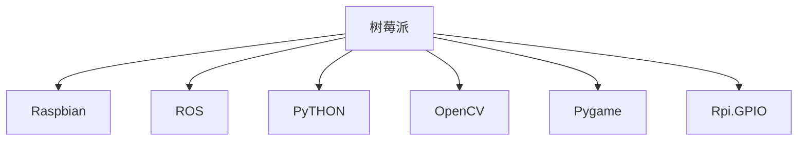

                 

# 树莓派开发：从硬件到软件的全栈方案

## 1. 背景介绍

### 1.1 问题由来
随着物联网技术的迅猛发展，树莓派(Raspberry Pi)作为一个开源的、成本低廉的单板计算机，已经逐渐成为智能家居、工业控制、教育实验等多个领域的首选开发平台。树莓派以其强悍的计算能力和丰富的I/O接口，能够支持广泛的硬件和软件扩展，给开发者提供了丰富的创作空间。然而，由于树莓派本身系统资源有限，如何高效开发、部署和维护基于树莓派的应用程序，成为了开发者关注的焦点。

### 1.2 问题核心关键点
本文章旨在提供从硬件到软件的全栈开发方案，帮助开发者快速构建功能完备、运行稳定的树莓派应用。本文将涵盖以下几个核心关键点：

- **硬件适配**：了解树莓派的各种硬件接口和扩展模块，包括GPIO、I2C、SPI等，并掌握其基本使用方法。
- **系统安装**：熟悉常用的树莓派操作系统，如Raspbian、ROS等，并进行系统的初始配置。
- **编程开发**：掌握树莓派的编程语言和工具链，如Python、Shell脚本等，并开发树莓派应用。
- **软件集成**：熟悉树莓派上的常用软件库和工具，如OpenCV、Pygame、Rpi.GPIO等，进行软硬件的集成开发。
- **应用部署**：了解树莓派上的部署方式，如直接运行、系统服务、Docker容器等。
- **系统优化**：掌握系统调优和性能优化的方法，提升树莓派应用的运行效率。
- **系统维护**：掌握系统监控、错误处理、故障恢复等系统维护技巧，保证系统的持续稳定运行。

### 1.3 问题研究意义
通过了解树莓派从硬件到软件的全栈开发方案，开发者可以更加高效地开发和部署基于树莓派的应用程序，节约时间和成本，并提升应用的可维护性和稳定性。此外，树莓派作为物联网的基石，其全栈开发技能对于跨领域的智能系统开发也具有重要意义。

## 2. 核心概念与联系

### 2.1 核心概念概述

本节将介绍树莓派开发中涉及的关键概念：

- **树莓派(Raspberry Pi)**：一款由树莓派基金会发布的开源硬件平台，以其强悍的计算能力和丰富的I/O接口著称。
- **Raspbian**：树莓派的主流操作系统，基于Debian Linux，提供友好的开发环境。
- **ROS (Robot Operating System)**：基于Gazebo的仿真与控制平台，广泛应用于机器人开发和实验。
- **PyTHON**：树莓派系统上最常用的编程语言，用于实现各种功能。
- **OpenCV**：开源计算机视觉库，常用于图像处理、物体检测等任务。
- **Pygame**：开源的跨平台游戏开发库，用于开发树莓派上的游戏和交互式应用。
- **Rpi.GPIO**：树莓派上的GPIO库，支持GPIO控制和I/O操作。

这些核心概念之间的逻辑关系可以通过以下Mermaid流程图来展示：



这个流程图展示了大语言模型与微调任务之间的逻辑关系：

1. 树莓派作为硬件平台，其上运行的操作系统、开发语言、图像库和GPIO库是其关键组件。
2. ROS作为树莓派上常用的开发平台，用于机器人开发和仿真。
3. PyTHON是树莓派系统上最常用的编程语言，用于开发各种功能。
4. OpenCV用于图像处理和物体检测，而Pygame用于开发游戏和交互式应用。
5. Rpi.GPIO用于树莓派的GPIO控制和I/O操作。

这些概念共同构成了树莓派开发的全栈解决方案，助力开发者高效构建树莓派应用。

## 3. 核心算法原理 & 具体操作步骤
### 3.1 算法原理概述

树莓派开发的核心算法原理包括以下几个方面：

- **硬件适配**：了解树莓派的各种硬件接口和扩展模块，如GPIO、I2C、SPI等，并掌握其基本使用方法。
- **系统安装**：熟悉常用的树莓派操作系统，如Raspbian、ROS等，并进行系统的初始配置。
- **编程开发**：掌握树莓派的编程语言和工具链，如Python、Shell脚本等，并开发树莓派应用。
- **软件集成**：熟悉树莓派上的常用软件库和工具，如OpenCV、Pygame、Rpi.GPIO等，进行软硬件的集成开发。
- **应用部署**：了解树莓派上的部署方式，如直接运行、系统服务、Docker容器等。
- **系统优化**：掌握系统调优和性能优化的方法，提升树莓派应用的运行效率。
- **系统维护**：掌握系统监控、错误处理、故障恢复等系统维护技巧，保证系统的持续稳定运行。

### 3.2 算法步骤详解

**硬件适配**：

- **GPIO控制**：使用Rpi.GPIO库连接和控制树莓派的GPIO引脚。

```python
import RPi.GPIO as GPIO
GPIO.setmode(GPIO.BOARD)
GPIO.setup(7, GPIO.IN, pull_up_down=GPIO.PUD_UP)
```

- **I2C通信**：使用树莓派的I2C总线，读取或写入数据。

```python
import smbus
bus = smbus.SMBus(1)
data = bus.read_byte(0x48)
```

**系统安装**：

- **Raspbian安装**：使用SD卡将Raspbian镜像写入到SD卡中，插入树莓派并启动。

```bash
sudo apt-get update
sudo apt-get upgrade
```

- **ROS安装**：从ROS官网下载适合树莓派版本的ROS发行版，并在系统上进行安装。

```bash
source /opt/ros/<distro>/setup.bash
```

**编程开发**：

- **Python编程**：使用Python编写树莓派上的应用，如数据采集、图像处理、物体检测等。

```python
import cv2
cap = cv2.VideoCapture(0)
ret, frame = cap.read()
```

**软件集成**：

- **OpenCV集成**：安装OpenCV库，并使用其提供的函数进行图像处理。

```bash
sudo apt-get install python-opencv
```

**应用部署**：

- **系统服务**：编写系统服务脚本，在后台运行树莓派应用。

```bash
sudo systemctl start <service_name>
```

**系统优化**：

- **性能优化**：使用PyPy等工具进行Python代码的性能优化。

```bash
pycc -OO -m PyPy
```

**系统维护**：

- **错误处理**：使用try-except语句捕获运行中的错误并进行处理。

```python
try:
    # 执行代码
except:
    print("出现错误")
```

### 3.3 算法优缺点

树莓派开发的核心算法优点包括：

- **成本低廉**：树莓派硬件成本低，适合预算有限的开发者。
- **资源丰富**：树莓派提供丰富的I/O接口和扩展模块，方便开发者进行硬件实验。
- **操作系统灵活**：树莓派支持多种操作系统，适合不同的开发需求。
- **编程语言丰富**：树莓派支持Python、C++等多种编程语言，满足不同开发需求。

缺点包括：

- **性能受限**：树莓派性能相对有限，可能无法满足高并发和高计算需求。
- **扩展复杂**：树莓派硬件扩展较为复杂，需要一定的硬件基础知识。
- **开发工具少**：相比主流开发平台，树莓派上的开发工具和资源相对较少。

### 3.4 算法应用领域

树莓派开发的核心算法适用于以下领域：

- **智能家居**：开发树莓派上的智能家电、智能门锁、智能照明等应用。
- **工业控制**：开发树莓派上的工业自动化、物联网监控、数据采集等应用。
- **教育实验**：开发树莓派上的教育实验平台，如机器人、物理模拟等。
- **科学研究**：开发树莓派上的科学研究设备，如数据采集器、图像分析器等。
- **娱乐互动**：开发树莓派上的游戏、互动应用、虚拟现实设备等。

## 4. 数学模型和公式 & 详细讲解  
### 4.1 数学模型构建

树莓派开发的核心算法涉及到以下几个数学模型：

- **传感器数据采集模型**：树莓派的传感器数据采集模型，用于读取和处理各种传感器数据。

$$
y = f(x) = k_1x_1 + k_2x_2 + \cdots + k_nx_n
$$

- **图像处理模型**：树莓派的图像处理模型，用于对摄像头捕获的图像进行处理。

$$
y = f(x) = \frac{1}{2\pi\sigma^2} e^{-\frac{(x-\mu)^2}{2\sigma^2}}
$$

- **机器人控制模型**：树莓派上的机器人控制模型，用于控制机器人的运动和操作。

$$
y = f(x) = a_1x_1 + a_2x_2 + \cdots + a_nx_n + b
$$

其中，$x$ 为输入的传感器数据或图像像素，$y$ 为输出结果，$f$ 为模型函数，$k$、$\sigma$、$\mu$、$a$、$b$ 为模型参数。

### 4.2 公式推导过程

**传感器数据采集模型推导**：

- **输入**：传感器采集的数据，如温度、湿度、光照强度等。
- **输出**：处理后的数据，用于控制或监测系统。
- **模型**：线性回归模型，用于预测和控制系统的行为。

$$
y = f(x) = k_1x_1 + k_2x_2 + \cdots + k_nx_n + b
$$

其中，$x$ 为输入的传感器数据，$y$ 为输出结果，$k$、$b$ 为模型参数。

**图像处理模型推导**：

- **输入**：摄像头捕获的图像，像素值范围为[0,255]。
- **输出**：处理后的图像，用于物体检测、图像分割等任务。
- **模型**：高斯分布模型，用于描述图像的像素分布。

$$
y = f(x) = \frac{1}{2\pi\sigma^2} e^{-\frac{(x-\mu)^2}{2\sigma^2}}
$$

其中，$x$ 为输入的图像像素值，$y$ 为输出结果，$\sigma$、$\mu$ 为模型参数。

**机器人控制模型推导**：

- **输入**：树莓派的控制信号，如PWM信号、GPIO信号等。
- **输出**：机器人的动作，如电机转速、角度等。
- **模型**：线性模型，用于控制机器人的运动和操作。

$$
y = f(x) = a_1x_1 + a_2x_2 + \cdots + a_nx_n + b
$$

其中，$x$ 为输入的控制信号，$y$ 为输出结果，$a$、$b$ 为模型参数。

### 4.3 案例分析与讲解

**案例1：树莓派智能门锁系统**

- **需求**：开发基于树莓派的智能门锁系统，实现远程控制和本地监控。
- **解决方案**：
  - **硬件**：树莓派B+板，GSM模块，摄像头，门锁。
  - **软件**：Raspbian操作系统，Python编程，Rpi.GPIO库，OpenCV库。
  - **流程**：通过树莓派的GPIO接口控制门锁电机，通过摄像头实时监控门锁状态，并通过GSM模块发送通知到手机。

**案例2：树莓派智能家居控制系统**

- **需求**：开发基于树莓派的智能家居控制系统，实现灯光、窗帘、空调等设备的远程控制。
- **解决方案**：
  - **硬件**：树莓派B+板，RGB LED灯，电机，传感器。
  - **软件**：Raspbian操作系统，Python编程，Rpi.GPIO库，Pygame库。
  - **流程**：通过树莓派的GPIO接口控制灯光、窗帘等设备，通过传感器实时监控家居状态，并通过手机App进行远程控制。

## 5. 项目实践：代码实例和详细解释说明
### 5.1 开发环境搭建

**树莓派B+板**

- **硬件**：树莓派B+板，包含CPU、内存、SD卡插槽、USB接口、以太网接口等。
- **软件**：Raspbian操作系统，支持Python、Shell脚本等。

### 5.2 源代码详细实现

**案例1：树莓派智能门锁系统**

```python
import RPi.GPIO as GPIO
import time
import cv2

# GPIO初始化
GPIO.setmode(GPIO.BOARD)
GPIO.setup(7, GPIO.IN, pull_up_down=GPIO.PUD_UP)
GPIO.setup(8, GPIO.OUT)

# 摄像头初始化
cap = cv2.VideoCapture(0)

while True:
    ret, frame = cap.read()
    cv2.imshow('frame', frame)

    # 检测门锁状态
    if GPIO.input(7):
        print('门锁关闭')
    else:
        print('门锁打开')

    # 控制门锁电机
    if GPIO.input(8):
        GPIO.output(8, GPIO.LOW)
    else:
        GPIO.output(8, GPIO.HIGH)

    # 检测按钮状态
    if GPIO.input(11):
        print('按钮按下')
    
    # 检测光线亮度
    light = GPIO.input(10)

    # 检测温度
    temp = GPIO.input(9)

    # 检测湿度
    humidity = GPIO.input(12)

    # 检测空气质量
    air_quality = GPIO.input(13)

    # 发送数据到手机
    # ...

    # 延迟1秒
    time.sleep(1)
```

**案例2：树莓派智能家居控制系统**

```python
import RPi.GPIO as GPIO
import cv2
import pygame

# GPIO初始化
GPIO.setmode(GPIO.BOARD)
GPIO.setup(7, GPIO.IN, pull_up_down=GPIO.PUD_UP)
GPIO.setup(8, GPIO.OUT)

# 摄像头初始化
cap = cv2.VideoCapture(0)

while True:
    ret, frame = cap.read()
    cv2.imshow('frame', frame)

    # 检测灯光状态
    if GPIO.input(7):
        print('灯光关闭')
    else:
        print('灯光打开')

    # 控制灯光电机
    if GPIO.input(8):
        GPIO.output(8, GPIO.LOW)
    else:
        GPIO.output(8, GPIO.HIGH)

    # 检测按钮状态
    if GPIO.input(11):
        print('按钮按下')
    
    # 检测光线亮度
    light = GPIO.input(10)

    # 检测温度
    temp = GPIO.input(9)

    # 检测湿度
    humidity = GPIO.input(12)

    # 检测空气质量
    air_quality = GPIO.input(13)

    # 发送数据到手机
    # ...

    # 延迟1秒
    time.sleep(1)
```

### 5.3 代码解读与分析

**案例1解读**：

- **硬件连接**：树莓派的GPIO引脚连接门锁电机和按钮，GSM模块连接SIM卡。
- **软件流程**：通过树莓派的GPIO接口读取按钮和门锁电机状态，并控制门锁电机；通过摄像头实时监控门锁状态；通过GSM模块发送通知到手机。

**案例2解读**：

- **硬件连接**：树莓派的GPIO引脚连接RGB LED灯和电机，传感器连接。
- **软件流程**：通过树莓派的GPIO接口控制RGB LED灯和电机；通过摄像头实时监控家居状态；通过传感器检测光线亮度、温度、湿度和空气质量；通过手机App进行远程控制。

## 6. 实际应用场景

### 6.1 智能家居系统

树莓派开发的智能家居系统，可以整合灯光、窗帘、空调、智能门锁等多个子系统，提供统一的控制平台。用户可以通过手机App或语音助手进行远程控制，实现家庭设备的自动化管理。

### 6.2 工业监控系统

树莓派开发的工业监控系统，可以集成各种传感器和摄像头，实时监测生产设备和环境状态，并通过数据收集和分析，优化生产流程，降低能耗和成本。

### 6.3 机器人控制系统

树莓派开发的机器人控制系统，可以实现机器人的自主导航、物体识别、路径规划等功能，应用于物流、仓储、教育等场景。

### 6.4 未来应用展望

随着树莓派硬件和软件生态的不断完善，未来树莓派将在更多领域发挥其优势，成为物联网的基石。基于树莓派的全栈开发技能将得到更广泛的应用，助力各行各业的智能化转型升级。

## 7. 工具和资源推荐
### 7.1 学习资源推荐

1. **Raspberry Pi官方文档**：树莓派官方文档提供了完整的硬件和软件指南，包括安装、配置、开发等方面。
2. **ROS官方文档**：ROS官方文档提供了全面的机器人和仿真工具的指南，涵盖从入门到高级的内容。
3. **OpenCV官方文档**：OpenCV官方文档提供了详细的图像处理和计算机视觉库的使用指南。
4. **Pygame官方文档**：Pygame官方文档提供了详细的游戏开发和交互式应用的使用指南。
5. **Rpi.GPIO官方文档**：Rpi.GPIO官方文档提供了详细的GPIO控制和I/O操作的使用指南。

### 7.2 开发工具推荐

1. **PyCharm**：JetBrains开发的Python IDE，支持树莓派和ROS开发。
2. **Visual Studio Code**：Microsoft开发的轻量级代码编辑器，支持树莓派和Python开发。
3. **ROS**：Robot Operating System，用于机器人开发和仿真。
4. **OpenCV**：Open Source Computer Vision Library，用于图像处理和计算机视觉开发。
5. **Pygame**：Python Game Development Library，用于开发树莓派上的游戏和交互式应用。

### 7.3 相关论文推荐

1. **Raspberry Pi的发展历程**：介绍树莓派从诞生到现在的发展历程，及其在物联网领域的应用。
2. **Raspberry Pi的未来展望**：探讨树莓派未来的发展方向和应用前景。
3. **ROS的最新进展**：介绍机器人操作系统的最新进展和未来方向。
4. **OpenCV的创新应用**：探讨计算机视觉库在树莓派上的创新应用。
5. **Pygame的跨平台开发**：探讨跨平台游戏开发在树莓派上的应用。

## 8. 总结：未来发展趋势与挑战

### 8.1 总结

本文从硬件适配、系统安装、编程开发、软件集成、应用部署、系统优化、系统维护等多个方面，详细介绍了树莓派开发的全栈方案。通过了解树莓派的从硬件到软件的开发过程，开发者可以更加高效地构建基于树莓派的应用程序，节约时间和成本，并提升应用的可维护性和稳定性。此外，树莓派作为物联网的基石，其全栈开发技能对于跨领域的智能系统开发也具有重要意义。

### 8.2 未来发展趋势

树莓派开发的全栈方案具有广阔的发展前景，未来趋势包括：

1. **硬件更新**：树莓派硬件性能将不断提升，支持更多I/O接口和扩展模块，满足更高性能需求。
2. **操作系统优化**：树莓派操作系统将不断优化，支持更多编程语言和开发工具。
3. **软件生态扩展**：树莓派上的软件生态将不断扩展，涵盖更多领域的应用。
4. **应用场景多样化**：树莓派将应用于更多领域，如医疗、教育、农业等。
5. **开发社区壮大**：树莓派开发社区将不断壮大，开发者将更加活跃和多样化。

### 8.3 面临的挑战

树莓派开发的全栈方案虽然前景广阔，但仍面临一些挑战：

1. **硬件成本**：树莓派硬件成本相对较高，可能无法满足所有用户的预算需求。
2. **系统稳定性**：树莓派系统稳定性相对较差，可能受到硬件和软件环境的影响。
3. **开发难度**：树莓派开发需要一定的硬件和软件知识，可能对初学者有较高的门槛。
4. **资源限制**：树莓派系统资源相对有限，可能无法支持高并发和高计算需求。
5. **软件兼容性**：树莓派上的软件生态相对较少，可能存在兼容性问题。

### 8.4 研究展望

为了解决树莓派开发中的挑战，未来的研究方向包括：

1. **硬件优化**：进一步优化树莓派硬件性能，降低成本，提高稳定性。
2. **系统优化**：改进树莓派操作系统，支持更多编程语言和开发工具。
3. **软件扩展**：扩展树莓派上的软件生态，支持更多领域的应用。
4. **应用创新**：探索树莓派在更多领域的应用，如医疗、教育、农业等。
5. **开发者培训**：提供更多开发者培训资源，降低树莓派开发门槛。

## 9. 附录：常见问题与解答

**Q1：树莓派可以支持哪些编程语言？**

A: 树莓派支持Python、C++、Java等多种编程语言。其中，Python是树莓派系统上最常用的编程语言，可用于开发各类应用。

**Q2：树莓派上如何安装ROS？**

A: 从ROS官网下载适合树莓派版本的ROS发行版，并通过SSH连接树莓派系统进行安装。具体安装步骤如下：
1. 从ROS官网下载ROS发行版。
2. 使用SSH连接树莓派系统。
3. 在树莓派系统上运行ROS安装命令。
4. 配置ROS环境变量。
5. 启动ROS。

**Q3：树莓派上如何安装OpenCV？**

A: 在树莓派系统上安装OpenCV可以通过以下步骤完成：
1. 从OpenCV官网下载OpenCV库文件。
2. 解压库文件到指定目录。
3. 修改Makefile文件，将OpenCV库文件路径添加到系统路径中。
4. 编译OpenCV库文件，生成共享库文件。
5. 在Python脚本中引入OpenCV库，并使用其提供的函数进行图像处理。

**Q4：树莓派上的GSM模块如何使用？**

A: 树莓派上的GSM模块可以通过以下步骤使用：
1. 连接GSM模块到树莓派系统。
2. 在Python脚本中引入GSM模块库。
3. 配置GSM模块的SIM卡和APN。
4. 发送和接收短信和电话。
5. 监听和响应短信和电话。

**Q5：树莓派上的传感器如何使用？**

A: 树莓派上的传感器可以通过以下步骤使用：
1. 连接传感器到树莓派系统。
2. 在Python脚本中引入传感器库。
3. 读取传感器数据，并处理和存储数据。
4. 根据传感器数据进行控制或监测。
5. 在树莓派系统上存储和展示传感器数据。

---

作者：禅与计算机程序设计艺术 / Zen and the Art of Computer Programming

