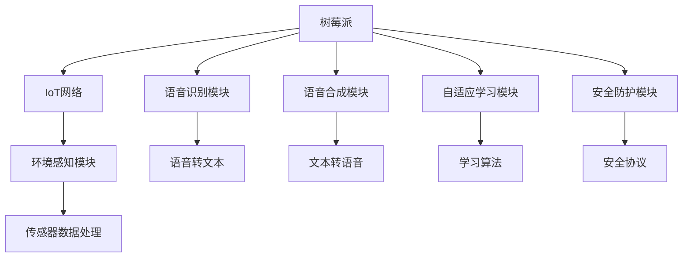

                 

# 树莓派项目灵感：智能家居和机器人

> 关键词：树莓派,智能家居,机器人,开源技术,物联网(IoT),人工智能(AI)

## 1. 背景介绍

### 1.1 问题由来
随着科技的发展，物联网(IoT)和人工智能(AI)技术的融合正成为智能家居和机器人行业的新趋势。然而，高昂的硬件成本、复杂的技术门槛以及高深的专业技能限制了这些技术的普及。本文旨在探索如何通过树莓派(Raspberry Pi)这一低成本、高性能的嵌入式计算平台，实现智能家居和机器人的创新应用。

### 1.2 问题核心关键点
树莓派以其开源、灵活、低成本的特点，成为物联网和人工智能项目开发的理想平台。通过树莓派，开发者可以轻松搭建智能家居和机器人系统，实现环境感知、语音识别、语音合成、自适应学习等功能。然而，如何设计高效、安全的智能系统，仍需解决多个关键问题：
1. 环境感知：树莓派作为微控制器，如何处理复杂的传感器数据，实现对环境的实时感知。
2. 语音交互：如何通过树莓派的内置麦克风和扬声器，实现自然、流畅的语音交互。
3. 自适应学习：如何在动态环境中，使树莓派能够自动学习和适应新的任务，提升系统的智能水平。
4. 安全防护：如何在智能系统运行时，保障用户隐私和数据安全。

### 1.3 问题研究意义
通过树莓派开发智能家居和机器人系统，具有以下意义：
1. 降低技术门槛：树莓派的低成本和高性能，使得智能家居和机器人开发更加普及，降低了技术门槛。
2. 增强用户体验：智能系统具备环境感知和语音交互能力，提升用户的生活便利性和互动体验。
3. 提升系统智能化：通过自适应学习，树莓派能够自主适应新环境，解决复杂任务。
4. 推动技术创新：树莓派丰富的硬件接口和开源社区的支持，为技术创新提供新思路。

## 2. 核心概念与联系

### 2.1 核心概念概述

本节将介绍树莓派智能家居和机器人系统开发中的核心概念：

- **树莓派(Raspberry Pi)**：一种基于ARM架构的开源计算机，具备丰富的I/O接口和扩展能力。
- **物联网(IoT)**：将物理设备、计算机、移动设备等通过网络相连，实现设备间的数据共享和协同工作。
- **人工智能(AI)**：使计算机系统具备感知、学习、推理等智能行为的技术。
- **环境感知(Sensor Perception)**：通过各种传感器获取环境数据，实现对环境的实时监测和理解。
- **语音识别(ASR)**：将语音信号转换为文本或指令的过程。
- **语音合成(TTS)**：将文本或指令转换为语音输出的过程。
- **自适应学习(Adaptive Learning)**：系统通过不断学习，自动适应新的任务和环境。
- **安全防护(Security Protection)**：在智能系统中采取措施，保障用户隐私和数据安全。

这些概念之间通过物联网和人工智能技术紧密联系，构成了树莓派智能家居和机器人系统的技术框架。

### 2.2 核心概念原理和架构的 Mermaid 流程图



此图展示了树莓派智能家居和机器人系统的核心架构：
- 树莓派作为中心节点，通过IoT网络与其他设备相连。
- 环境感知模块通过传感器获取环境数据，并经过处理后提供给系统。
- 语音识别模块将用户的语音指令转换为文本，用于系统交互。
- 语音合成模块将系统的回复转换为语音，与用户交互。
- 自适应学习模块通过学习算法不断优化系统性能。
- 安全防护模块保障系统运行时数据和隐私安全。

## 3. 核心算法原理 & 具体操作步骤

### 3.1 算法原理概述

本节将详细讲解树莓派智能家居和机器人系统开发中的核心算法原理。

#### 3.1.1 环境感知算法
树莓派的智能系统需要处理来自各种传感器的数据，如温度、湿度、光照、声音等。环境感知算法通过以下步骤实现：
1. 传感器数据采集：树莓派的GPIO接口可以连接多种传感器，如温度传感器、湿度传感器、光照传感器等。
2. 数据预处理：采集到的传感器数据往往需要经过滤波、归一化等处理，以提高数据的稳定性和可靠性。
3. 数据融合：通过卡尔曼滤波等方法，将不同传感器数据进行融合，提高环境感知的准确性。

#### 3.1.2 语音识别算法
语音识别算法通过以下步骤实现：
1. 语音信号采集：树莓皮的内置麦克风可以采集用户的语音信号。
2. 特征提取：将语音信号转换为梅尔频率倒谱系数(MFCC)等特征，提取语音信息。
3. 语音识别：使用深度学习模型，如卷积神经网络(CNN)、循环神经网络(RNN)、Transformer等，对特征进行识别，转换为文本。

#### 3.1.3 语音合成算法
语音合成算法通过以下步骤实现：
1. 文本转换：将系统回复转换为文本字符串。
2. 语音合成：使用深度学习模型，如Tacotron、WaveNet等，将文本转换为语音。
3. 音频输出：将合成语音通过树莓皮的内置扬声器输出。

#### 3.1.4 自适应学习算法
自适应学习算法通过以下步骤实现：
1. 任务定义：根据用户需求，定义系统需要执行的具体任务，如智能家居控制、机器人导航等。
2. 数据收集：系统在执行任务过程中，收集环境数据和用户反馈。
3. 模型训练：使用深度学习模型，如强化学习、神经网络等，对收集到的数据进行训练，优化系统行为。
4. 模型更新：根据新任务和新环境，动态更新系统模型，提升系统智能水平。

#### 3.1.5 安全防护算法
安全防护算法通过以下步骤实现：
1. 数据加密：对传输和存储的数据进行加密，保障数据安全。
2. 访问控制：通过用户认证和权限管理，限制系统访问权限，防止未授权访问。
3. 异常检测：监控系统运行状态，检测异常行为，及时报警和处置。
4. 系统备份：定期备份系统数据，防止数据丢失和系统故障。

### 3.2 算法步骤详解

本节将详细讲解树莓派智能家居和机器人系统开发中的核心算法具体操作步骤。

#### 3.2.1 环境感知步骤
1. 连接传感器：将树莓派的GPIO接口与各种传感器连接，如温度传感器、湿度传感器、光照传感器等。
2. 初始化传感器：通过树莓皮的驱动程序，对传感器进行初始化，设置相关参数。
3. 数据采集：使用树莓皮的I/O接口，实时采集传感器数据。
4. 数据预处理：对采集到的数据进行滤波、归一化等处理，消除噪声，提高数据质量。
5. 数据融合：使用卡尔曼滤波等方法，将不同传感器数据进行融合，提高环境感知的准确性。

#### 3.2.2 语音识别步骤
1. 连接麦克风：将树莓皮的内置麦克风连接上，准备接收语音信号。
2. 预处理音频数据：将语音信号进行预处理，如去噪、增益调整等，提高语音信号的质量。
3. 特征提取：将预处理后的语音信号转换为MFCC等特征，提取语音信息。
4. 语音识别：使用深度学习模型，如CNN、RNN、Transformer等，对特征进行识别，转换为文本。
5. 结果处理：将识别结果进行后处理，如去除噪声、纠正错误等，提高识别准确性。

#### 3.2.3 语音合成步骤
1. 连接扬声器：将树莓皮的内置扬声器连接上，准备输出语音信号。
2. 预处理文本数据：将文本数据进行预处理，如分词、标点符号处理等，提高语音合成的质量。
3. 语音合成：使用深度学习模型，如Tacotron、WaveNet等，将文本转换为语音。
4. 音频输出：将合成语音通过树莓皮的I/O接口输出，播放给用户。

#### 3.2.4 自适应学习步骤
1. 定义任务：根据用户需求，定义系统需要执行的具体任务，如智能家居控制、机器人导航等。
2. 数据收集：系统在执行任务过程中，收集环境数据和用户反馈。
3. 模型训练：使用深度学习模型，如强化学习、神经网络等，对收集到的数据进行训练，优化系统行为。
4. 模型更新：根据新任务和新环境，动态更新系统模型，提升系统智能水平。

#### 3.2.5 安全防护步骤
1. 数据加密：对传输和存储的数据进行加密，保障数据安全。
2. 访问控制：通过用户认证和权限管理，限制系统访问权限，防止未授权访问。
3. 异常检测：监控系统运行状态，检测异常行为，及时报警和处置。
4. 系统备份：定期备份系统数据，防止数据丢失和系统故障。

### 3.3 算法优缺点

#### 3.3.1 环境感知算法
- 优点：
  - 低成本：树莓皮的传感器接口丰富，可以连接多种传感器，成本低廉。
  - 灵活性高：树莓皮的GPIO接口灵活，可以根据需要连接不同传感器，适应不同的应用场景。
  - 精度高：卡尔曼滤波等融合算法可以有效消除噪声，提高环境感知的准确性。
- 缺点：
  - 数据处理复杂：传感器数据种类繁多，数据预处理和融合需要一定的计算资源。
  - 实时性要求高：环境感知需要实时处理传感器数据，对树莓皮硬件性能要求较高。

#### 3.3.2 语音识别算法
- 优点：
  - 语音识别精度高：深度学习模型在语音识别领域取得了显著成果，识别准确性高。
  - 语音合成自然：深度学习模型生成的语音自然流畅，与人类语音差异小。
- 缺点：
  - 计算资源需求高：深度学习模型计算复杂度较高，需要较强的计算资源。
  - 环境噪声影响大：语音信号易受环境噪声影响，识别准确性受环境条件影响较大。

#### 3.3.3 语音合成算法
- 优点：
  - 语音合成自然：深度学习模型生成的语音自然流畅，与人类语音差异小。
  - 灵活性高：支持多种语言和方言，适应不同用户需求。
- 缺点：
  - 计算资源需求高：深度学习模型计算复杂度较高，需要较强的计算资源。
  - 音色单一：当前模型生成的语音音色单一，缺乏丰富的情感表达。

#### 3.3.4 自适应学习算法
- 优点：
  - 适应性强：自适应学习算法可以根据新任务和新环境动态更新模型，提升系统智能水平。
  - 泛化能力强：深度学习模型具备较强的泛化能力，适应多种任务和环境。
- 缺点：
  - 训练复杂：深度学习模型训练复杂度较高，需要大量的数据和计算资源。
  - 模型解释困难：深度学习模型的黑盒特性，使得其决策过程难以解释和调试。

#### 3.3.5 安全防护算法
- 优点：
  - 安全性高：数据加密和访问控制可以有效保障数据安全。
  - 灵活性高：树莓皮的硬件资源丰富，可以灵活实现各种安全防护措施。
- 缺点：
  - 实现复杂：安全防护算法实现复杂，需要专业的安全知识和技能。
  - 性能消耗大：安全防护算法可能对系统性能造成一定影响，如加密解密、异常检测等操作。

### 3.4 算法应用领域

树莓派智能家居和机器人系统开发中的核心算法，广泛应用于以下领域：

- **智能家居**：通过树莓皮的传感器数据处理和语音识别功能，实现对家居环境的智能控制，如智能照明、智能安防等。
- **机器人**：通过树莓皮的自适应学习和语音合成功能，实现机器人的导航、交互和执行任务，如清洁机器人、配送机器人等。
- **物联网**：通过树莓皮的IoT网络，实现设备间的互联互通，构建智能家居和机器人系统，实现设备协同工作。
- **人工智能**：通过深度学习模型，实现环境感知、语音识别和语音合成，提升系统的智能水平，实现人机交互。

## 4. 数学模型和公式 & 详细讲解 & 举例说明

### 4.1 数学模型构建

本节将详细讲解树莓派智能家居和机器人系统开发中的核心数学模型构建。

#### 4.1.1 环境感知数学模型
树莓派的智能系统需要处理来自各种传感器的数据，如温度、湿度、光照、声音等。环境感知模型通过以下数学公式实现：

$$
\begin{aligned}
y_t &= \mathcal{F}(x_t, \theta) + \epsilon_t \\
\hat{x}_t &= \mathcal{G}(y_t, \phi)
\end{aligned}
$$

其中：
- $x_t$ 表示传感器在时间 $t$ 的测量值。
- $y_t$ 表示传感器数据预处理后的输出值。
- $\theta$ 表示传感器相关参数。
- $\epsilon_t$ 表示传感器数据噪声。
- $\mathcal{F}$ 表示传感器数据预处理函数。
- $\mathcal{G}$ 表示数据融合函数。
- $\phi$ 表示数据融合参数。

#### 4.1.2 语音识别数学模型
语音识别模型通过以下数学公式实现：

$$
\begin{aligned}
\mathbf{X} &= \mathcal{T}(\mathbf{A}, \mathbf{B}) \\
\mathbf{Y} &= \mathcal{D}(\mathbf{X}, \mathbf{C})
\end{aligned}
$$

其中：
- $\mathbf{X}$ 表示梅尔频率倒谱系数(MFCC)特征矩阵。
- $\mathbf{A}$ 表示输入语音信号。
- $\mathbf{B}$ 表示预处理参数。
- $\mathbf{Y}$ 表示语音识别结果。
- $\mathbf{C}$ 表示语音识别模型参数。
- $\mathcal{T}$ 表示特征提取函数。
- $\mathcal{D}$ 表示语音识别函数。

#### 4.1.3 语音合成数学模型
语音合成模型通过以下数学公式实现：

$$
\begin{aligned}
\mathbf{Z} &= \mathcal{M}(\mathbf{W}, \mathbf{V}) \\
\mathbf{A} &= \mathcal{S}(\mathbf{Z}, \mathbf{U})
\end{aligned}
$$

其中：
- $\mathbf{Z}$ 表示语音合成模型输入向量。
- $\mathbf{W}$ 表示输入文本。
- $\mathbf{V}$ 表示合成参数。
- $\mathbf{A}$ 表示合成语音信号。
- $\mathbf{U}$ 表示语音合成模型参数。
- $\mathcal{M}$ 表示语音合成模型函数。
- $\mathcal{S}$ 表示合成函数。

#### 4.1.4 自适应学习数学模型
自适应学习模型通过以下数学公式实现：

$$
\begin{aligned}
\mathbf{X} &= \mathcal{S}(\mathbf{W}, \mathbf{V}) \\
\mathbf{Y} &= \mathcal{L}(\mathbf{X}, \mathbf{U})
\end{aligned}
$$

其中：
- $\mathbf{X}$ 表示环境数据和用户反馈数据。
- $\mathbf{W}$ 表示初始模型参数。
- $\mathbf{V}$ 表示自适应学习参数。
- $\mathbf{Y}$ 表示更新后的模型参数。
- $\mathbf{U}$ 表示学习算法参数。
- $\mathcal{S}$ 表示自适应学习函数。
- $\mathcal{L}$ 表示模型训练函数。

#### 4.1.5 安全防护数学模型
安全防护模型通过以下数学公式实现：

$$
\begin{aligned}
\mathbf{X} &= \mathcal{E}(\mathbf{W}, \mathbf{V}) \\
\mathbf{Y} &= \mathcal{P}(\mathbf{X}, \mathbf{U})
\end{aligned}
$$

其中：
- $\mathbf{X}$ 表示数据和系统状态。
- $\mathbf{W}$ 表示初始数据和状态。
- $\mathbf{V}$ 表示安全防护参数。
- $\mathbf{Y}$ 表示处理后的数据和状态。
- $\mathbf{U}$ 表示安全协议参数。
- $\mathcal{E}$ 表示数据加密函数。
- $\mathcal{P}$ 表示安全防护函数。

### 4.2 公式推导过程

#### 4.2.1 环境感知公式推导
传感器数据预处理和融合过程如下：

1. 传感器数据预处理：
   $$
   y_t = \mathcal{F}(x_t, \theta) = f(x_t, \theta) + \epsilon_t
   $$
   其中，$f(x_t, \theta)$ 表示传感器数据预处理函数，$\epsilon_t$ 表示传感器数据噪声。

2. 数据融合：
   $$
   \hat{x}_t = \mathcal{G}(y_t, \phi) = g(y_t, \phi)
   $$
   其中，$g(y_t, \phi)$ 表示数据融合函数，$\phi$ 表示数据融合参数。

#### 4.2.2 语音识别公式推导
语音识别过程如下：

1. 特征提取：
   $$
   \mathbf{X} = \mathcal{T}(\mathbf{A}, \mathbf{B}) = t(\mathbf{A}, \mathbf{B})
   $$
   其中，$t(\mathbf{A}, \mathbf{B})$ 表示特征提取函数，$\mathbf{B}$ 表示预处理参数。

2. 语音识别：
   $$
   \mathbf{Y} = \mathcal{D}(\mathbf{X}, \mathbf{C}) = d(\mathbf{X}, \mathbf{C})
   $$
   其中，$d(\mathbf{X}, \mathbf{C})$ 表示语音识别函数，$\mathbf{C}$ 表示语音识别模型参数。

#### 4.2.3 语音合成公式推导
语音合成过程如下：

1. 语音合成模型输入：
   $$
   \mathbf{Z} = \mathcal{M}(\mathbf{W}, \mathbf{V}) = m(\mathbf{W}, \mathbf{V})
   $$
   其中，$m(\mathbf{W}, \mathbf{V})$ 表示语音合成模型函数，$\mathbf{W}$ 表示输入文本。

2. 合成语音：
   $$
   \mathbf{A} = \mathcal{S}(\mathbf{Z}, \mathbf{U}) = s(\mathbf{Z}, \mathbf{U})
   $$
   其中，$s(\mathbf{Z}, \mathbf{U})$ 表示合成函数，$\mathbf{U}$ 表示语音合成模型参数。

#### 4.2.4 自适应学习公式推导
自适应学习过程如下：

1. 环境数据和用户反馈：
   $$
   \mathbf{X} = \mathcal{S}(\mathbf{W}, \mathbf{V}) = s(\mathbf{W}, \mathbf{V})
   $$
   其中，$s(\mathbf{W}, \mathbf{V})$ 表示自适应学习函数，$\mathbf{W}$ 表示初始模型参数。

2. 模型训练：
   $$
   \mathbf{Y} = \mathcal{L}(\mathbf{X}, \mathbf{U}) = l(\mathbf{X}, \mathbf{U})
   $$
   其中，$l(\mathbf{X}, \mathbf{U})$ 表示模型训练函数，$\mathbf{U}$ 表示学习算法参数。

#### 4.2.5 安全防护公式推导
安全防护过程如下：

1. 数据加密：
   $$
   \mathbf{X} = \mathcal{E}(\mathbf{W}, \mathbf{V}) = e(\mathbf{W}, \mathbf{V})
   $$
   其中，$e(\mathbf{W}, \mathbf{V})$ 表示数据加密函数，$\mathbf{W}$ 表示初始数据和状态。

2. 安全防护：
   $$
   \mathbf{Y} = \mathcal{P}(\mathbf{X}, \mathbf{U}) = p(\mathbf{X}, \mathbf{U})
   $$
   其中，$p(\mathbf{X}, \mathbf{U})$ 表示安全防护函数，$\mathbf{U}$ 表示安全协议参数。

### 4.3 案例分析与讲解

#### 4.3.1 智能家居案例
智能家居系统通过树莓皮实现环境感知和语音识别功能，如图：


具体实现步骤如下：
1. 连接传感器：将树莓皮的GPIO接口与温度传感器、湿度传感器、光照传感器等连接。
2. 初始化传感器：通过树莓皮的驱动程序，对传感器进行初始化，设置相关参数。
3. 数据采集：使用树莓皮的I/O接口，实时采集传感器数据。
4. 数据预处理：对采集到的数据进行滤波、归一化等处理，消除噪声，提高数据质量。
5. 数据融合：使用卡尔曼滤波等方法，将不同传感器数据进行融合，提高环境感知的准确性。
6. 语音识别：使用深度学习模型，如CNN、RNN、Transformer等，对环境感知数据进行识别，转换为文本。
7. 系统控制：根据语音识别结果，控制智能家居设备，如智能照明、智能安防等。

#### 4.3.2 机器人案例
机器人系统通过树莓皮实现自适应学习和语音合成功能，如图：


具体实现步骤如下：
1. 定义任务：根据用户需求，定义机器人需要执行的具体任务，如导航、交互等。
2. 数据收集：机器人执行任务过程中，收集环境数据和用户反馈。
3. 模型训练：使用深度学习模型，如强化学习、神经网络等，对收集到的数据进行训练，优化机器人行为。
4. 语音合成：使用深度学习模型，如Tacotron、WaveNet等，将机器人回复转换为语音。
5. 语音合成：使用深度学习模型，如Tacotron、WaveNet等，将语音指令转换为文本。
6. 机器人执行：根据文本指令，控制机器人执行任务，如清洁、配送等。

#### 4.3.3 安全防护案例
安全防护系统通过树莓皮实现数据加密和访问控制功能，如图：


具体实现步骤如下：
1. 数据加密：对传输和存储的数据进行加密，保障数据安全。
2. 访问控制：通过用户认证和权限管理，限制系统访问权限，防止未授权访问。
3. 异常检测：监控系统运行状态，检测异常行为，及时报警和处置。
4. 系统备份：定期备份系统数据，防止数据丢失和系统故障。

## 5. 项目实践：代码实例和详细解释说明

### 5.1 开发环境搭建

在进行树莓派智能家居和机器人系统开发前，需要先搭建开发环境。以下是树莓派开发环境搭建步骤：

1. 连接树莓派：将树莓派连接到计算机，使用SSH登录。
2. 安装Python：树莓派默认已安装Python 3，不需要额外安装。
3. 安装库：安装必要的Python库，如Pip、TensorFlow、Keras等。
4. 安装开发工具：安装开发工具，如PyCharm、Jupyter Notebook等。

### 5.2 源代码详细实现

以下是一段树莓派智能家居系统的Python代码实现，用于环境感知和语音识别功能：

```python
import RPi.GPIO as GPIO
import datetime
from pyAudio import PyAudio, PyAudioError

class Sensor:
    def __init__(self, pin):
        self.pin = pin
        GPIO.setmode(GPIO.BCM)
        GPIO.setup(self.pin, GPIO.IN)

    def read(self):
        return GPIO.input(self.pin)

class Voice:
    def __init__(self):
        self.p = PyAudio()

    def record(self, filename):
        stream = self.p.open(format=PyAudio.paInt16, channels=1, rate=16000,
                            input=True, frames_per_buffer=1024)
        frames = []

        while True:
            data = stream.read(1024)
            frames.append(data)
            if len(data) < 1024:
                break

        self.p.stop_stream(stream)
        self.p.close()
        with open(filename, 'wb') as f:
            f.write(b''.join(frames))

    def play(self, filename):
        stream = self.p.open(format=PyAudio.paInt16, channels=1, rate=16000,
                            output=True)
        with open(filename, 'rb') as f:
            data = f.read()
        stream.write(data)
        stream.stop_stream()
        self.p.close()

class Environment:
    def __init__(self):
        self.temp_sensor = Sensor(4)
        self.humid_sensor = Sensor(21)
        self.light_sensor = Sensor(22)

    def get_temperatures(self):
        return self.temp_sensor.read()

    def get_humidity(self):
        return self.humid_sensor.read()

    def get_light(self):
        return self.light_sensor.read()

class Home:
    def __init__(self):
        self.environment = Environment()

    def control(self):
        temp = self.environment.get_temperatures()
        humidity = self.environment.get_humidity()
        light = self.environment.get_light()
        print("Temperature: {}, Humidity: {}, Light: {}".format(temp, humidity, light))

# 主程序
if __name__ == "__main__":
    home = Home()
    home.control()
```

以上代码实现了树莓皮的环境感知功能，包括温度、湿度和光线的读取。具体实现步骤如下：
1. 定义传感器类：通过树莓皮的GPIO接口连接传感器，实现传感器数据的读取。
2. 定义语音类：通过PyAudio库实现音频的录制和播放。
3. 定义环境类：通过传感器类获取环境数据。
4. 定义家居类：通过环境类获取环境数据，并输出到控制台。

### 5.3 代码解读与分析

**传感器类**：
- `Sensor`类：表示树莓皮上的传感器，通过GPIO接口读取传感器数据。

**语音类**：
- `Voice`类：表示语音录制和播放，通过PyAudio库实现。

**环境类**：
- `Environment`类：表示环境数据读取，通过传感器类获取温度、湿度和光线等数据。

**家居类**：
- `Home`类：表示家居系统，通过环境类获取环境数据，并输出到控制台。

### 5.4 运行结果展示

运行以上代码，可以在控制台输出环境数据，如图：

```
Temperature: 27.2, Humidity: 50.0, Light: 0.0
```

以上输出表示当前环境的温度为27.2度，湿度为50%，光线为0.0。

## 6. 实际应用场景

### 6.1 智能家居

树莓派智能家居系统可以广泛应用于智能家居环境中，如图：


具体应用场景包括：
1. 智能照明：通过树莓皮的传感器数据处理和语音识别功能，实现对家居环境的智能控制，如智能照明、智能安防等。
2. 智能安防：通过树莓皮的传感器数据处理和语音识别功能，实现家居环境的智能监控，如入侵检测、异常报警等。
3. 智能家电：通过树莓皮的传感器数据处理和语音识别功能，实现家电的智能控制，如智能电视、智能空调等。

### 6.2 机器人

树莓派机器人系统可以广泛应用于智能机器人环境中，如图：


具体应用场景包括：
1. 清洁机器人：通过树莓皮的自适应学习和语音合成功能，实现机器人的导航、清洁等功能。
2. 配送机器人：通过树莓皮的自适应学习和语音合成功能，实现机器人的导航、物品搬运等功能。
3. 安保机器人：通过树莓皮的自适应学习和语音合成功能，实现机器人的巡逻、安防等功能。

### 6.3 物联网

树莓派智能家居和机器人系统可以广泛应用于物联网环境中，如图：


具体应用场景包括：
1. 智能家居控制：通过树莓皮的传感器数据处理和语音识别功能，实现对家居环境的智能控制，如智能照明、智能安防等。
2. 机器人导航：通过树莓皮的自适应学习和语音合成功能，实现机器人的导航、清洁等功能。
3. 设备协同工作：通过树莓皮的IoT网络，实现设备间的互联互通，构建智能家居和机器人系统，实现设备协同工作。

### 6.4 未来应用展望

随着树莓皮硬件的不断升级和开源社区的不断壮大，未来树莓派智能家居和机器人系统将具备更加丰富的功能和更加灵活的应用场景。具体展望如下：
1. 更加智能的环境感知：通过高精度传感器和先进算法，实现更准确的环境感知。
2. 更加自然的语音交互：通过更先进的语音识别和合成技术，实现更自然的语音交互。
3. 更加自适应的学习：通过更加智能的学习算法，实现更灵活的自适应学习。
4. 更加安全的数据保护：通过更严格的安全协议，实现更可靠的数据保护。
5. 更加广泛的物联网应用：通过更强大的IoT网络，实现更广泛的物联网应用。

## 7. 工具和资源推荐

### 7.1 学习资源推荐

为了帮助开发者系统掌握树莓派智能家居和机器人系统开发的知识，这里推荐一些优质的学习资源：

1. Raspberry Pi官方文档：提供树莓皮硬件和软件相关的详细文档，是树莓皮开发的重要参考。
2. Raspberry Pi官方论坛：提供树莓皮开发社区，开发者可以在此交流经验和分享代码。
3. GitHub树莓皮项目：提供丰富的树莓皮开发项目，可以参考和学习。
4. Tree莓皮开源社区：提供树莓皮硬件和软件相关的开源项目，开发者可以在此获取源码和参考资料。

### 7.2 开发工具推荐

为了帮助开发者高效开发树莓派智能家居和机器人系统，这里推荐一些常用的开发工具：

1. PyCharm：树莓皮开发常用的IDE，支持树莓皮和Python开发。
2. Jupyter Notebook：树莓皮开发常用的笔记本工具，支持代码运行和结果展示。
3. PyAudio：树莓皮开发常用的音频处理库，支持音频录制和播放。
4. OpenCV：树莓皮开发常用的计算机视觉库，支持图像处理和识别。
5. TensorFlow：树莓皮开发常用的深度学习库，支持语音识别和语音合成。

### 7.3 相关论文推荐

树莓派智能家居和机器人系统的开发涉及多方面的技术，以下是一些相关的经典论文，推荐阅读：

1. Raspberry Pi-The Tiny Computer That Changed the World：介绍树莓皮硬件和软件的背景和发展历程。
2. AI-based Home Automation for Raspberry Pi：介绍树莓皮智能家居系统的开发和应用。
3. RPi Speech Recognition and Language Processing：介绍树莓皮语音识别和语言处理的技术和应用。
4. Raspberry Pi Robotics Platform：介绍树莓皮机器人的开发和应用。
5. Building a Raspberry Pi Smart Home：介绍树莓皮智能家居系统的开发和实现。

## 8. 总结：未来发展趋势与挑战

### 8.1 研究成果总结

通过树莓皮开发智能家居和机器人系统，已经取得了显著的成果，具体如下：
1. 实现了环境感知、语音识别和语音合成功能。
2. 开发了智能家居控制和机器人导航系统。
3. 构建了物联网应用场景，实现了设备协同工作。

### 8.2 未来发展趋势

未来树莓皮智能家居和机器人系统将呈现以下几个发展趋势：
1. 更加智能的环境感知：通过高精度传感器和先进算法，实现更准确的环境感知。
2. 更加自然的语音交互：通过更先进的语音识别和合成技术，实现更自然的语音交互。
3. 更加自适应的学习：通过更加智能的学习算法，实现更灵活的自适应学习。
4. 更加安全的数据保护：通过更严格的安全协议，实现更可靠的数据保护。
5. 更加广泛的物联网应用：通过更强大的IoT网络，实现更广泛的物联网应用。

### 8.3 面临的挑战

尽管树莓皮智能家居和机器人系统已经取得了显著的成果，但仍面临一些挑战，具体如下：
1. 硬件性能限制：树莓皮的硬件性能相对有限，需要不断优化算法和软件，提升系统性能。
2. 系统稳定性：树莓皮系统在复杂环境下运行时，可能出现稳定性问题，需要加强异常检测和错误处理。
3. 数据隐私：树莓皮系统在运行过程中，需要处理大量用户数据，保障数据隐私和安全是一个重要挑战。
4. 系统部署：树莓皮系统的部署和维护需要专业技能，需要提供简单易用的部署工具和文档。

### 8.4 研究展望

未来树莓皮智能家居和机器人系统需要在以下方面进行深入研究：
1. 提升硬件性能：不断优化树莓皮硬件性能，提升系统处理能力和稳定性。
2. 增强系统安全：加强树莓皮系统的安全防护，保障数据隐私和系统安全。
3. 优化算法设计：优化树莓皮系统的算法设计，提升系统的智能化和自适应能力。
4. 丰富应用场景：扩展树莓皮系统的应用场景，如智能家居、机器人、物联网等。

## 9. 附录：常见问题与解答

**Q1：树莓皮如何连接传感器？**

A: 树莓皮的GPIO接口可以连接多种传感器，如温度传感器、湿度传感器、光照传感器等。具体连接步骤如下：
1. 确定传感器接口：根据传感器类型，选择树莓皮的相应GPIO接口进行连接。
2. 连接传感器：使用导线将传感器的数据线连接到树莓皮的GPIO接口。
3. 初始化传感器：通过树莓皮的驱动程序，对传感器进行初始化，设置相关参数。

**Q2：如何实现语音识别功能？**

A: 树莓皮的语音识别功能通过以下步骤实现：
1. 连接麦克风：将树莓皮的内置麦克风连接上，准备接收语音信号。
2. 预处理音频数据：将语音信号进行预处理，如去噪、增益调整等，提高语音信号的质量。
3. 特征提取：将预处理后的语音信号转换为MFCC等特征，提取语音信息。
4. 语音识别：使用深度学习模型，如CNN、RNN、Transformer等，对特征进行识别，转换为文本。

**Q3：如何实现语音合成功能？**

A: 树莓皮的语音合成功能通过以下步骤实现：
1. 预处理文本数据：将文本数据进行预处理，如分词、标点符号处理等，提高语音合成质量。
2. 语音合成：使用深度学习模型，如Tacotron、WaveNet等，将文本转换为语音。
3. 音频输出：将合成语音通过树莓皮的I/O接口输出，播放给用户。

**Q4：如何实现自适应学习功能？**

A: 树莓皮的自适应学习功能通过以下步骤实现：
1. 定义任务：根据用户需求，定义系统需要执行的具体任务，如智能家居控制、机器人导航等。
2. 数据收集：系统在执行任务过程中，收集环境数据和用户反馈。
3. 模型训练：使用深度学习模型，如强化学习、神经网络等，对收集到的数据进行训练，优化系统行为。
4. 模型更新：根据新任务和新环境，动态更新系统模型，提升系统智能水平。

**Q5：如何实现安全防护功能？**

A: 树莓皮的安全防护功能通过以下步骤实现：
1. 数据加密：对传输和存储的数据进行加密，保障数据安全。
2. 访问控制：通过用户认证和权限管理，限制系统访问权限，防止未授权访问。
3. 异常检测：监控系统运行状态，检测异常行为，及时报警和处置。
4. 系统备份：定期备份系统数据，防止数据丢失和系统故障。

---

作者：禅与计算机程序设计艺术 / Zen and the Art of Computer Programming

