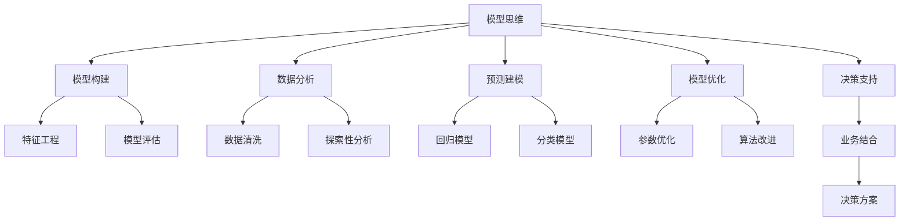

                 

# 模型思维在管理培训中的运用

> 关键词：模型思维，管理培训，模型构建，数据分析，决策支持，预测建模，模型优化，企业决策，员工培养

## 1. 背景介绍

### 1.1 问题由来

在现代企业管理中，决策复杂度日益提高，数据量庞大且多源异构，传统基于经验的决策方式已经难以适应企业发展的需要。模型思维作为一种基于数据的决策方法，能够帮助管理者在数据驱动的基础上，进行科学的决策和预测。随着大数据技术的发展，模型思维的应用范围不断扩大，已经广泛应用于供应链管理、市场营销、金融风控、人力资源等领域。管理培训作为提升企业综合管理能力的重要手段，也将模型思维作为一项关键技能进行培训，以适应日趋复杂多变的外部环境。

### 1.2 问题核心关键点

模型思维在管理培训中的应用，关键在于如何通过系统性的理论学习和实践操作，帮助管理者掌握模型的构建、评估、优化等关键技术，并能够灵活运用模型解决实际管理问题。这需要从以下几个方面着手：
- 理解模型构建的基本流程和方法。
- 熟悉常用的统计和机器学习模型。
- 掌握模型的评估和优化技术。
- 应用模型解决企业实际问题。

本文将深入分析模型思维在管理培训中的应用，并通过具体案例展示其在提升企业管理决策能力中的作用。

### 1.3 问题研究意义

模型思维的引入，可以显著提升企业管理者的数据分析和决策能力，降低决策风险，提高企业运营效率。具体而言：
- 提升数据素养。管理者能够从海量数据中提取关键信息，做出更加精准的决策。
- 优化决策流程。模型思维强调系统性的分析和预测，有助于构建科学的决策体系。
- 增强应对能力。模型思维能够帮助企业在快速变化的市场环境中，及时调整策略。

## 2. 核心概念与联系

### 2.1 核心概念概述

为更好地理解模型思维在管理培训中的应用，本节将介绍几个密切相关的核心概念：

- **模型思维**：基于数据和统计方法，构建数学模型进行预测和决策的思维方式。在管理培训中，模型思维强调将问题转化为可量化、可预测的数学模型，通过模型构建和分析来指导决策。

- **模型构建**：从问题定义到模型评估的全流程，包括数据收集、特征工程、模型选择、参数优化、模型评估等环节。模型构建是模型思维的基石，是管理培训的重点内容。

- **数据分析**：通过数据收集、清洗、探索性分析等方法，发现数据中的规律和趋势，为模型构建提供基础数据支持。数据分析能力是模型思维应用的关键。

- **预测建模**：使用统计或机器学习方法，根据历史数据建立预测模型，对未来进行预测和决策。预测建模是模型思维在管理中的应用，旨在提升企业决策的科学性。

- **模型优化**：通过调整模型参数、改进模型算法、增加数据样本等手段，提高模型的准确性和鲁棒性。模型优化是模型思维的进阶操作，能够进一步提升决策效果。

- **决策支持**：利用模型分析结果，辅助管理者进行决策。决策支持系统是模型思维在实际中的应用，强调模型与业务结合，提供可操作的决策方案。

这些核心概念之间的逻辑关系可以通过以下Mermaid流程图来展示：



这个流程图展示模型思维的各个关键步骤：

1. 模型思维基于数据分析，构建预测模型。
2. 模型构建涉及特征工程和模型评估。
3. 数据分析包括数据清洗和探索性分析。
4. 预测建模使用回归或分类算法。
5. 模型优化包含参数优化和算法改进。
6. 决策支持强调模型与业务结合，生成决策方案。

这些概念共同构成了模型思维的完整框架，使其能够在复杂的商业环境中有效应用。

## 3. 核心算法原理 & 具体操作步骤

### 3.1 算法原理概述

模型思维的原理基于统计和机器学习模型，通过数据驱动的方式，构建预测模型。其核心思想是：将问题抽象为数学模型，通过收集历史数据进行训练，对未来进行预测和决策。

形式化地，假设问题可以转化为一个回归或分类问题，设模型为 $M$，训练集为 $D=\{(x_i,y_i)\}_{i=1}^N$，其中 $x_i$ 为输入特征，$y_i$ 为输出标签。模型训练的目标是找到最优的模型参数 $\theta$，使得模型能够准确地预测输出 $y$，即：

$$
\hat{y} = M_{\theta}(x)
$$

其中，$\hat{y}$ 为模型预测输出，$M_{\theta}$ 为模型函数，$\theta$ 为模型参数。

模型的训练过程主要包括以下步骤：
- 数据预处理：清洗数据、标准化、特征工程等。
- 模型选择：根据问题类型，选择合适的回归或分类模型。
- 模型训练：通过优化算法（如梯度下降）最小化损失函数 $\mathcal{L}(\theta)$，得到最优参数 $\theta^*$。
- 模型评估：使用验证集或测试集评估模型性能，选择最优模型。

### 3.2 算法步骤详解

基于模型思维的管理培训，一般包括以下几个关键步骤：

**Step 1: 问题定义和数据收集**
- 明确管理问题，将其转化为回归或分类问题。
- 确定输入特征和输出标签。
- 收集相关的历史数据，划分为训练集、验证集和测试集。

**Step 2: 数据预处理**
- 数据清洗：处理缺失值、异常值等噪声。
- 数据标准化：使用归一化或标准化方法处理数据。
- 特征工程：选择、提取和构造对模型有用的特征。

**Step 3: 模型选择**
- 根据问题类型，选择合适的回归或分类模型。
- 考虑模型的复杂度和可解释性，评估模型可能带来的风险。

**Step 4: 模型训练**
- 选择优化算法，设置学习率、迭代次数等参数。
- 训练模型，计算损失函数，更新模型参数。
- 使用交叉验证等技术，避免过拟合。

**Step 5: 模型评估**
- 使用验证集或测试集，评估模型性能。
- 计算准确率、召回率、F1分数等指标。
- 选择最优模型，进行模型优化。

**Step 6: 模型优化**
- 调整模型参数，改进算法实现。
- 增加数据样本，进行模型泛化训练。
- 使用集成方法，提升模型鲁棒性。

**Step 7: 决策支持**
- 将模型结果转化为可操作的决策方案。
- 结合业务背景，调整模型输出。
- 定期更新模型，适应数据分布变化。

以上是模型思维在管理培训中的核心步骤。在实际应用中，还需要根据具体问题，对各个环节进行优化设计，如改进训练目标函数，引入更多的正则化技术，搜索最优的超参数组合等，以进一步提升模型性能。

### 3.3 算法优缺点

模型思维在管理培训中的应用，具有以下优点：
1. 数据驱动决策。通过模型分析，能够提供基于数据的决策依据，降低决策风险。
2. 提升决策科学性。模型能够系统地分析问题，发现数据中的规律和趋势，提升决策的科学性。
3. 增强应对能力。模型思维能够帮助企业在快速变化的市场环境中，及时调整策略，提高应变能力。

同时，该方法也存在一定的局限性：
1. 数据依赖性强。模型训练和预测依赖高质量、丰富的数据，数据收集和处理成本较高。
2. 模型复杂度高。复杂模型可能带来高维度和计算复杂度，难以解释和维护。
3. 假设条件限制。模型假设数据符合某种分布，在真实数据中可能存在偏差。
4. 过拟合风险。模型训练过程中可能出现过拟合，导致泛化能力差。
5. 模型解释性差。某些模型（如深度学习模型）缺乏可解释性，难以理解其内部机制。

尽管存在这些局限性，但就目前而言，模型思维是提升企业管理决策能力的重要手段。未来相关研究的重点在于如何进一步降低模型对数据的依赖，提高模型的少样本学习和跨领域迁移能力，同时兼顾可解释性和伦理安全性等因素。

### 3.4 算法应用领域

模型思维已经在管理培训中得到了广泛的应用，覆盖了企业管理决策的各个方面，例如：

- 供应链管理：通过预测模型，优化库存管理和物流调度。
- 市场营销：利用回归模型，预测客户需求，指导销售策略。
- 金融风控：建立信用评分模型，评估贷款风险，控制违约率。
- 人力资源：使用分类模型，预测员工流失和绩效表现，制定招聘策略。
- 绩效考核：构建绩效评估模型，科学量化员工表现，提升考核效果。

除了上述这些经典应用外，模型思维还被创新性地应用到更多场景中，如风险管理、客户关系管理、质量控制等，为企业决策提供了强大的支持。

## 4. 数学模型和公式 & 详细讲解  
### 4.1 数学模型构建

本节将使用数学语言对模型思维在管理培训中的应用进行更加严格的刻画。

假设管理问题可以转化为回归问题，设输入特征 $x \in \mathcal{X}$，输出标签 $y \in \mathcal{Y}$。构建线性回归模型 $M_{\theta}$，其中 $\theta = [w,b]$ 为模型参数，$w$ 为权重向量，$b$ 为偏置项。回归模型预测输出为：

$$
\hat{y} = M_{\theta}(x) = wx + b
$$

模型训练的目标是最小化均方误差损失函数：

$$
\mathcal{L}(\theta) = \frac{1}{N}\sum_{i=1}^N (y_i - wx_i - b)^2
$$

通过梯度下降等优化算法，最小化损失函数，得到最优参数：

$$
\theta^* = \mathop{\arg\min}_{\theta} \mathcal{L}(\theta)
$$

在得到模型参数后，可以使用模型对新数据进行预测和决策。

### 4.2 公式推导过程

以下我们以线性回归模型为例，推导损失函数及其梯度的计算公式。

假设模型 $M_{\theta}$ 在输入 $x$ 上的输出为 $\hat{y}=M_{\theta}(x)$，设 $n$ 为样本数量，$N$ 为特征维度。则均方误差损失函数定义为：

$$
\mathcal{L}(\theta) = \frac{1}{n}\sum_{i=1}^n (y_i - wx_i - b)^2
$$

其中 $y_i$ 为真实标签，$\hat{y}_i = wx_i + b$ 为模型预测输出。

根据链式法则，损失函数对参数 $\theta$ 的梯度为：

$$
\frac{\partial \mathcal{L}(\theta)}{\partial \theta} = \frac{2}{n}\sum_{i=1}^n -(y_i - wx_i - b)x_i
$$

其中 $x_i$ 为输入特征，$y_i$ 为真实标签。

在得到损失函数的梯度后，即可带入梯度下降算法，完成模型的迭代优化。重复上述过程直至收敛，最终得到最优模型参数 $\theta^*$。

## 5. 项目实践：代码实例和详细解释说明
### 5.1 开发环境搭建

在进行模型思维实践前，我们需要准备好开发环境。以下是使用Python进行Scikit-learn开发的环境配置流程：

1. 安装Anaconda：从官网下载并安装Anaconda，用于创建独立的Python环境。

2. 创建并激活虚拟环境：
```bash
conda create -n model-env python=3.8 
conda activate model-env
```

3. 安装Scikit-learn：
```bash
conda install scikit-learn
```

4. 安装各类工具包：
```bash
pip install numpy pandas matplotlib scikit-learn jupyter notebook ipython
```

完成上述步骤后，即可在`model-env`环境中开始模型思维实践。

### 5.2 源代码详细实现

下面我们以线性回归模型为例，给出使用Scikit-learn库进行模型构建和训练的PyTorch代码实现。

首先，导入必要的库和数据：

```python
from sklearn.datasets import load_boston
from sklearn.model_selection import train_test_split
from sklearn.linear_model import LinearRegression
import numpy as np
import pandas as pd
import matplotlib.pyplot as plt

# 加载波士顿房价数据集
boston = load_boston()
X = pd.DataFrame(boston.data, columns=boston.feature_names)
y = pd.Series(boston.target)

# 划分训练集和测试集
X_train, X_test, y_train, y_test = train_test_split(X, y, test_size=0.3, random_state=42)
```

然后，构建和训练线性回归模型：

```python
# 构建线性回归模型
model = LinearRegression()

# 训练模型
model.fit(X_train, y_train)

# 预测测试集
y_pred = model.predict(X_test)

# 计算均方误差
mse = np.mean((y_pred - y_test)**2)
print(f"Mean Squared Error: {mse:.3f}")
```

最后，绘制模型预测结果与实际数据的对比图：

```python
# 绘制预测结果对比图
plt.scatter(y_test, y_pred)
plt.xlabel('Actual Prices')
plt.ylabel('Predicted Prices')
plt.show()
```

以上是一个简单的线性回归模型训练实例。通过Python和Scikit-learn库，可以很方便地实现模型的构建、训练和评估。

### 5.3 代码解读与分析

让我们再详细解读一下关键代码的实现细节：

**导入库和数据**：
- `load_boston`方法：从scikit-learn库中加载波士顿房价数据集。
- `train_test_split`方法：将数据集划分为训练集和测试集，用于模型训练和评估。

**模型构建和训练**：
- `LinearRegression`类：scikit-learn库中线性回归模型的实现。
- `fit`方法：使用训练集数据拟合模型参数。
- `predict`方法：使用训练好的模型对测试集数据进行预测。

**模型评估**：
- 计算均方误差：使用模型预测结果和真实标签计算均方误差，衡量模型预测的准确性。
- 绘制对比图：使用matplotlib库绘制模型预测结果与实际数据的对比图，直观展示模型效果。

可以看出，通过Python和scikit-learn库，可以很方便地进行线性回归模型的构建和评估。开发者可以基于此框架，进一步探索更复杂的管理问题解决方案。

## 6. 实际应用场景
### 6.1 智能客服系统

基于模型思维的智能客服系统，可以通过预测模型优化客户服务流程。传统客服系统依赖人工客服，无法24小时提供服务，且效率和质量难以保证。通过构建客户满意度预测模型，智能客服系统可以自动识别客户情绪，及时分配人工客服，提升客户体验。

在技术实现上，可以收集历史客户服务数据，将问题与客户满意度进行标注，构建预测模型。模型能够根据客户提问、语气等信息，预测客户满意度。对于预测结果较低的客户，系统自动分配人工客服，进行进一步处理。通过不断优化模型，提升预测准确性，提升客户满意度。

### 6.2 人力资源管理

模型思维在人力资源管理中的应用，主要体现在招聘和绩效评估两个方面。传统人力资源管理往往依赖经验判断，缺乏数据驱动的支持。通过预测模型，可以有效提升招聘和绩效评估的科学性。

在招聘过程中，可以构建应聘人员匹配度预测模型，根据历史招聘数据和应聘者信息，预测其与岗位的匹配度。选择匹配度较高的应聘者进行面试，提升招聘效率和质量。

在绩效评估中，可以构建员工绩效预测模型，根据历史员工绩效数据，预测新员工的绩效表现。根据预测结果，制定个性化的培训和发展计划，提升员工绩效。

### 6.3 财务风险管理

财务风险管理是企业运营中面临的重要问题。模型思维可以通过预测模型，帮助企业识别潜在的财务风险。

在风险识别方面，可以构建信用评分模型，根据历史贷款数据，评估客户的信用风险。预测客户违约概率，及时采取风险控制措施，降低贷款违约率。

在风险管理方面，可以构建财务预警模型，根据历史财务数据，预测企业财务风险。及时预警，帮助企业制定应对策略，降低财务风险。

### 6.4 未来应用展望

随着模型思维的不断发展，其在管理培训中的应用也将更加广泛和深入。未来，模型思维将向以下几个方向发展：

1. 模型自动化：通过自动化模型构建和优化技术，减少人工干预，提高模型构建效率。
2. 模型融合：将多种模型进行融合，构建更为复杂和鲁棒的预测系统。
3. 实时预测：利用实时数据，进行实时预测和决策支持，提升企业应对能力。
4. 模型解释性：通过可解释性模型，提升模型在管理中的可接受性和可用性。
5. 跨领域应用：将模型思维应用于更多领域，如医疗、物流、制造等，提升各行业的管理决策能力。

这些趋势将进一步推动模型思维在企业管理中的普及和应用，带来更加科学、高效的管理决策。

## 7. 工具和资源推荐
### 7.1 学习资源推荐

为了帮助开发者系统掌握模型思维的理论基础和实践技巧，这里推荐一些优质的学习资源：

1. 《机器学习实战》系列书籍：由机器学习专家撰写，深入浅出地介绍了机器学习的基本概念和经典模型。

2. 《Python数据科学手册》：详细介绍了Python在数据科学中的应用，包括数据预处理、模型构建、模型评估等环节。

3. Coursera《机器学习》课程：由斯坦福大学Andrew Ng教授主讲，系统讲解机器学习的基本理论和方法。

4. Kaggle平台：全球最大的数据科学竞赛平台，提供丰富的数据集和比赛，有助于提升实践能力。

5. GitHub上的开源项目：如TensorFlow、scikit-learn等，提供大量模型实现和案例，可供学习和参考。

通过对这些资源的学习实践，相信你一定能够快速掌握模型思维的基本原理和实践技巧，并将其应用到企业管理决策中。

### 7.2 开发工具推荐

高效的开发离不开优秀的工具支持。以下是几款用于模型思维开发的常用工具：

1. Python：开源的高级编程语言，生态丰富，适用于模型构建和数据分析。

2. R语言：广泛应用于统计分析和数据可视化，适用于建立统计模型。

3. scikit-learn：基于Python的机器学习库，提供丰富的模型实现和评估工具。

4. TensorFlow：由Google主导开发的深度学习框架，适用于构建复杂神经网络模型。

5. Jupyter Notebook：开源的交互式编程环境，便于模型构建和数据分析。

6. GitHub：代码托管平台，提供版本控制和协作功能，便于团队合作和项目管理。

合理利用这些工具，可以显著提升模型思维的开发效率，加快创新迭代的步伐。

### 7.3 相关论文推荐

模型思维的研究源于学界的持续研究。以下是几篇奠基性的相关论文，推荐阅读：

1. "The Elements of Statistical Learning"（统计学习要素）：由Tibshirani等人撰写，系统介绍了统计学习的基本理论和算法。

2. "Pattern Recognition and Machine Learning"（模式识别与机器学习）：由Christopher M. Bishop撰写，全面介绍了机器学习的基本理论和算法。

3. "Deep Learning"（深度学习）：由Ian Goodfellow等人撰写，详细介绍了深度学习的理论和实现。

4. "Random Forests"（随机森林）：由Breiman等人撰写，介绍了随机森林算法的基本原理和实现。

5. "AdaBoost"（自适应增强算法）：由Freund等人撰写，介绍了自适应增强算法的基本原理和实现。

这些论文代表了大模型思维的发展脉络。通过学习这些前沿成果，可以帮助研究者把握学科前进方向，激发更多的创新灵感。

## 8. 总结：未来发展趋势与挑战

### 8.1 总结

本文对模型思维在管理培训中的应用进行了全面系统的介绍。首先阐述了模型思维的背景和意义，明确了其在提升企业管理决策能力方面的独特价值。其次，从原理到实践，详细讲解了模型构建、数据分析、预测建模等关键技术，给出了模型思维的完整代码实例。同时，本文还广泛探讨了模型思维在智能客服、人力资源、财务风险等领域的应用前景，展示了其巨大的潜力。此外，本文精选了模型思维的相关学习资源，力求为读者提供全方位的技术指引。

通过本文的系统梳理，可以看到，模型思维在复杂多变的商业环境中，能够提供数据驱动的决策支持，提升管理决策的科学性和准确性。未来，伴随模型思维的不断发展，将在更多领域得到应用，带来更深刻的变革。

### 8.2 未来发展趋势

展望未来，模型思维的发展趋势将呈现以下几个方向：

1. 模型自动化。通过自动化模型构建和优化技术，减少人工干预，提高模型构建效率。
2. 模型融合。将多种模型进行融合，构建更为复杂和鲁棒的预测系统。
3. 实时预测。利用实时数据，进行实时预测和决策支持，提升企业应对能力。
4. 模型解释性。通过可解释性模型，提升模型在管理中的可接受性和可用性。
5. 跨领域应用。将模型思维应用于更多领域，如医疗、物流、制造等，提升各行业的管理决策能力。

这些趋势凸显了模型思维在管理决策中的重要作用，为企业管理者提供了强大的数据驱动决策工具。

### 8.3 面临的挑战

尽管模型思维已经取得了瞩目成就，但在实际应用中也面临诸多挑战：

1. 数据质量和数量。高质量、丰富的数据是模型构建和训练的前提，但数据收集和处理成本较高。如何提高数据收集效率，减少数据噪声，是模型思维应用的瓶颈。
2. 模型复杂度。复杂模型可能带来高维度和计算复杂度，难以解释和维护。如何平衡模型复杂度和可解释性，是模型思维应用的难点。
3. 模型鲁棒性。模型在面对新数据时，可能出现泛化能力差、预测不准确的问题。如何提高模型的鲁棒性，增强泛化能力，是模型思维应用的关键。
4. 模型解释性。部分模型（如深度学习模型）缺乏可解释性，难以理解其内部机制。如何提升模型的可解释性，增强决策透明度，是模型思维应用的挑战。
5. 数据安全和隐私。模型训练和应用过程中，可能涉及敏感数据。如何保护数据安全和隐私，是模型思维应用的重要考虑因素。

这些挑战需要在模型构建和应用过程中予以关注，逐步克服，才能使模型思维在管理培训中发挥更大的作用。

### 8.4 研究展望

面对模型思维所面临的挑战，未来的研究需要在以下几个方面寻求新的突破：

1. 数据质量提升。利用自动化数据收集和处理技术，提高数据质量，减少数据噪声。
2. 模型自动化构建。开发自动化模型构建工具，提升模型构建效率和质量。
3. 模型解释性增强。引入可解释性模型，提升模型在管理中的可接受性和可用性。
4. 模型鲁棒性提升。通过改进算法和数据处理方式，提高模型的鲁棒性和泛化能力。
5. 跨领域应用拓展。将模型思维应用于更多领域，提升各行业的管理决策能力。

这些研究方向将推动模型思维在管理培训中的应用，带来更加科学、高效的管理决策，为企业管理者提供强大的数据驱动决策支持。

## 9. 附录：常见问题与解答

**Q1：模型思维在管理培训中的应用是否适用于所有管理问题？**

A: 模型思维在管理培训中的应用，适用于数据驱动的管理决策问题。对于纯主观决策和管理经验总结的问题，模型思维可能难以提供支持。需要结合具体问题，判断是否适合应用模型思维。

**Q2：如何构建适用于管理培训的模型？**

A: 构建适用于管理培训的模型，主要包括以下步骤：
1. 问题定义：明确管理问题，将其转化为回归或分类问题。
2. 数据收集：收集历史数据，划分为训练集和测试集。
3. 数据预处理：清洗数据、标准化、特征工程等。
4. 模型选择：根据问题类型，选择合适的回归或分类模型。
5. 模型训练：使用优化算法最小化损失函数，得到最优模型参数。
6. 模型评估：使用验证集或测试集评估模型性能，选择最优模型。
7. 模型优化：调整模型参数，改进算法实现，提高模型性能。

**Q3：模型思维在管理培训中是否需要深度学习？**

A: 深度学习是模型思维的一种高级形式，适用于复杂的数据处理和预测问题。对于简单的管理决策问题，传统的统计模型如线性回归、决策树等已经足够。深度学习模型在计算资源和数据质量要求较高，需要结合具体问题和数据情况进行选择。

**Q4：模型思维在管理培训中是否需要跨学科知识？**

A: 模型思维在管理培训中，需要结合统计学、计算机科学、领域知识等多方面的知识。统计学和计算机科学提供模型构建和优化的方法，领域知识提供问题定义和模型应用的背景。跨学科知识的融合，是模型思维应用的基础。

**Q5：模型思维在管理培训中的效果如何评估？**

A: 模型思维的效果评估，主要包括以下几个方面：
1. 模型准确性：使用验证集或测试集评估模型预测的准确性。
2. 模型鲁棒性：评估模型在不同数据分布下的泛化能力。
3. 模型可解释性：评估模型的内部机制和预测逻辑的透明度。
4. 业务影响：评估模型在实际业务中的应用效果，如提升客户满意度、降低财务风险等。

通过这些评估指标，可以全面衡量模型思维在管理培训中的效果，指导模型优化和改进。

---

作者：禅与计算机程序设计艺术 / Zen and the Art of Computer Programming

