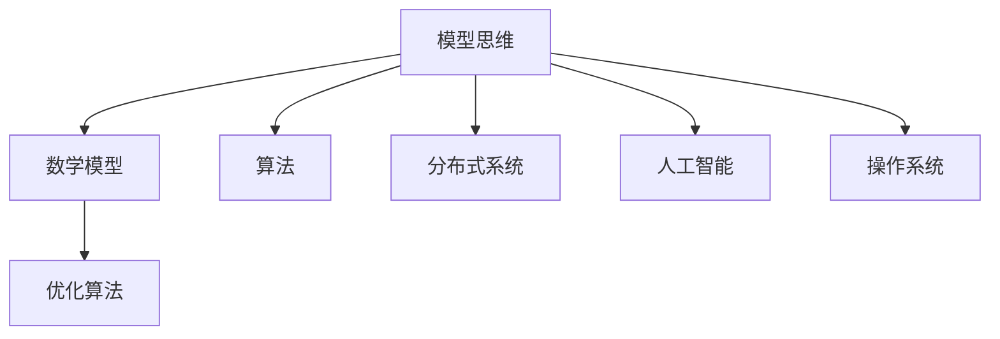

                 

# 模型思维：认知复杂世界的快捷方式

> 关键词：模型思维,认知复杂性,算法原理,操作系统,分布式系统,人工智能,机器学习,深度学习

## 1. 背景介绍

### 1.1 问题由来
在当今这个信息爆炸的时代，我们面临的决策问题越来越复杂多变。从日常生活中的购物、出行，到工作中的项目管理、企业战略决策，再到科技领域的算法优化、系统设计，各种问题涉及的因素越来越多，关系越来越错综复杂。在如此复杂的世界中，传统的经验决策和直觉判断往往无法应对，我们需要一种更系统、更科学的方法来理解和解决问题。

### 1.2 问题核心关键点
模型思维（Model Thinking）就是在这种背景下应运而生的一种思维方式，它通过构建和应用数学模型，将现实世界中的复杂问题简化为可计算、可解释的数学表达式，从而提供科学的决策支持。模型思维的核心在于通过模型，捕捉真实世界的本质特征和运行规律，进而预测未来、优化决策。

### 1.3 问题研究意义
模型思维在解决复杂问题中发挥着至关重要的作用，具有以下重要意义：

1. **提升决策科学性**：模型思维提供了一套系统的方法论，帮助我们在面对复杂问题时，能够基于数据和证据做出更为科学的决策。
2. **加速创新迭代**：通过构建和优化模型，可以更快地找到问题的最优解，加速创新和产品迭代。
3. **降低错误风险**：模型思维通过对问题的量化和结构化分析，降低了决策过程中的人为错误和偏见。
4. **促进团队协作**：模型思维提供了一套通用的语言和框架，便于团队成员理解、交流和协作。
5. **推动学科融合**：模型思维涉及数学、统计、计算机科学等多个领域，促进了跨学科的交流与合作。

## 2. 核心概念与联系

### 2.1 核心概念概述

为更好地理解模型思维的核心概念，本节将介绍几个密切相关的核心概念：

- **模型思维**：通过构建数学模型来理解、预测和优化复杂系统的思维方式。模型思维认为，现实世界中的复杂问题可以通过构建简化的数学模型来处理。

- **数学模型**：将现实世界中的问题抽象为数学表达式，用于预测、优化和控制。数学模型可以包括微分方程、概率模型、图模型等多种形式。

- **算法**：在数学模型上执行的一系列操作或计算过程，用于求解模型的解或优化结果。常见的算法包括数值求解、优化算法、随机模拟等。

- **优化算法**：用于求解数学模型的最优解或近似解的算法。例如，梯度下降、遗传算法、模拟退火等。

- **分布式系统**：由多个计算节点组成的系统，用于并行计算和分布式数据处理。常见分布式系统包括Hadoop、Spark、Kubernetes等。

- **人工智能**：通过让机器模拟人类智能行为，实现自主学习、推理和决策的技术。人工智能包括机器学习、深度学习、自然语言处理等多个分支。

- **操作系统**：管理计算机硬件和软件资源，控制计算机系统的运行环境的软件。操作系统为应用程序提供基础服务。

这些核心概念之间的逻辑关系可以通过以下Mermaid流程图来展示：



这个流程图展示了几大核心概念之间的联系：

1. 模型思维通过构建数学模型来理解和预测复杂系统。
2. 算法在数学模型上执行计算，求解模型的最优解或近似解。
3. 优化算法用于进一步提升求解的效率和精度。
4. 分布式系统提供并行计算能力，加速算法的执行。
5. 人工智能涉及机器学习、深度学习等多种技术，为模型思维提供技术支撑。
6. 操作系统提供计算资源管理，为模型思维提供运行环境。

## 3. 核心算法原理 & 具体操作步骤
### 3.1 算法原理概述

模型思维的核心在于构建和应用数学模型，用于分析和解决复杂问题。其核心算法原理主要包括以下几个方面：

- **模型构建**：将现实世界的问题抽象为数学模型，选择适合的数学形式和变量来描述问题。
- **算法设计**：在数学模型上设计求解算法，选择适当的算法实现模型的求解。
- **优化求解**：通过优化算法求解模型的最优解或近似解，从而找到问题的最优策略。

模型思维的算法流程通常包括数据准备、模型构建、算法选择、参数调优、结果分析和应用部署等步骤。

### 3.2 算法步骤详解

以下是模型思维的主要算法步骤：

**Step 1: 数据准备**
- 收集和整理数据，确保数据的质量和代表性。数据可以来自实验、调查、记录等多种途径。
- 清洗数据，去除噪声和异常值，确保数据的一致性和可靠性。
- 数据分割，将数据分为训练集、验证集和测试集，用于模型训练、调优和评估。

**Step 2: 模型构建**
- 根据问题的性质和数据的特点，选择合适的数学模型形式。例如，线性回归模型、逻辑回归模型、决策树模型、深度学习模型等。
- 设计模型的参数和变量，确定模型的结构和形式。
- 对模型进行初始化，设定初始参数和变量值。

**Step 3: 算法选择**
- 根据模型的性质和求解目标，选择适当的算法。例如，梯度下降算法、遗传算法、模拟退火算法等。
- 确定算法的参数和控制参数，如学习率、迭代次数等。

**Step 4: 参数调优**
- 在训练集上运行算法，逐步调整参数，优化模型性能。
- 使用验证集评估模型的性能，避免过拟合和欠拟合。
- 进行交叉验证和超参数搜索，找到最优参数组合。

**Step 5: 结果分析**
- 在测试集上评估模型的性能，分析模型的误差和精度。
- 进行模型诊断，识别模型的强项和弱项。
- 对模型进行可视化，展示模型结果和预测。

**Step 6: 应用部署**
- 将模型集成到实际应用系统中，提供数据预测、决策支持等功能。
- 持续监测模型性能，定期更新和优化模型。
- 提供用户接口和文档，方便用户使用模型。

### 3.3 算法优缺点

模型思维的算法具有以下优点：
1. **系统性**：模型思维通过数学模型将复杂问题量化，提供系统的解决方案。
2. **可解释性**：数学模型具有可解释性，便于理解和解释。
3. **可重复性**：模型思维的算法和结果具有可重复性，便于复现和验证。
4. **适应性强**：模型思维的算法可以适应不同类型和规模的问题。

同时，模型思维的算法也存在一些局限性：
1. **模型简化**：模型思维对问题进行了简化，可能丢失一些细节和复杂性。
2. **数据依赖**：模型思维的效果高度依赖于数据的质量和数量。
3. **计算复杂度**：构建和优化模型可能需要较高的计算资源。
4. **模型评估**：模型的性能评估可能需要更多的先验知识。

尽管存在这些局限性，但模型思维的算法仍然是解决复杂问题的有力工具，能够提供科学、可靠的决策支持。

### 3.4 算法应用领域

模型思维在多个领域得到了广泛应用，具体包括：

- **金融风险管理**：构建信用评分模型、投资组合优化模型，评估金融风险和收益。
- **医疗诊断和治疗**：构建疾病预测模型、治疗方案优化模型，提升医疗服务的质量和效率。
- **供应链管理**：构建库存管理模型、物流优化模型，提高供应链的透明度和响应速度。
- **智能制造**：构建生产调度模型、设备维护模型，提升生产效率和产品质量。
- **智能交通**：构建交通流量预测模型、路径规划模型，优化交通流量和缓解拥堵。
- **市场营销**：构建客户行为模型、广告投放模型，提升市场营销的效果和ROI。

## 4. 数学模型和公式 & 详细讲解 & 举例说明

### 4.1 数学模型构建

构建数学模型是模型思维的核心步骤之一。以下以线性回归模型为例，说明数学模型的构建过程。

线性回归模型假设变量之间的关系是线性的，可以表示为：

$$
y = \beta_0 + \beta_1x_1 + \beta_2x_2 + \cdots + \beta_nx_n + \epsilon
$$

其中，$y$ 为目标变量，$x_i$ 为自变量，$\beta_i$ 为回归系数，$\epsilon$ 为误差项。

### 4.2 公式推导过程

线性回归模型的参数估计可以使用最小二乘法，求解使误差项$\epsilon$的平方和最小的$\beta_i$值。最小二乘法的目标函数为：

$$
\min \sum_{i=1}^n (y_i - \hat{y}_i)^2
$$

其中，$\hat{y}_i = \beta_0 + \beta_1x_{i1} + \beta_2x_{i2} + \cdots + \beta_nx_{in}$。

将目标函数展开并化简，得到：

$$
\min \sum_{i=1}^n (y_i - \hat{y}_i)^2 = \min \sum_{i=1}^n (y_i - \beta_0 - \sum_{j=1}^n \beta_jx_{ij})^2
$$

$$
= \min (\sum_{i=1}^n y_i^2 - 2\sum_{i=1}^n y_i(\beta_0 + \sum_{j=1}^n \beta_jx_{ij}) + \sum_{i=1}^n (\beta_0 + \sum_{j=1}^n \beta_jx_{ij})^2)
$$

令$\sum_{i=1}^n y_i^2 = \sum_{i=1}^n y_i(\beta_0 + \sum_{j=1}^n \beta_jx_{ij}) = \sum_{i=1}^n (\beta_0 + \sum_{j=1}^n \beta_jx_{ij})^2 = S_y^2$，则目标函数可以简化为：

$$
\min (S_y^2 - 2\sum_{i=1}^n y_i(\beta_0 + \sum_{j=1}^n \beta_jx_{ij}) + \sum_{i=1}^n (\beta_0 + \sum_{j=1}^n \beta_jx_{ij})^2)
$$

对$\beta_i$求偏导并令其为0，得到：

$$
\frac{\partial (\sum_{i=1}^n y_i^2 - 2\sum_{i=1}^n y_i(\beta_0 + \sum_{j=1}^n \beta_jx_{ij}) + \sum_{i=1}^n (\beta_0 + \sum_{j=1}^n \beta_jx_{ij})^2)}{\partial \beta_i} = 0
$$

解方程组，得到回归系数$\beta_i$的值：

$$
\beta_i = \frac{\sum_{i=1}^n x_{i}y_{i}}{\sum_{i=1}^n x_{i}^2}
$$

### 4.3 案例分析与讲解

下面以一个实际案例来说明模型思维的应用：

假设某电商平台的销售数据如下：

| 用户ID | 商品ID | 价格（元） | 销量（件） |
|--------|--------|-----------|----------|
| 1      | A      | 100       | 10       |
| 1      | B      | 150       | 20       |
| 1      | C      | 200       | 30       |
| 2      | A      | 120       | 5        |
| 2      | B      | 180       | 15       |
| 2      | C      | 250       | 25       |
| ...    | ...    | ...       | ...      |

现在需要构建一个模型，预测用户ID和商品ID之间的关系。可以构建一个线性回归模型：

$$
\hat{y} = \beta_0 + \beta_1x_1 + \beta_2x_2
$$

其中，$y$为目标变量（销量），$x_1$为用户ID，$x_2$为商品ID，$\beta_0$、$\beta_1$、$\beta_2$为回归系数。

使用最小二乘法求解回归系数：

$$
\hat{\beta}_1 = \frac{\sum_{i=1}^n x_{i}y_{i}}{\sum_{i=1}^n x_{i}^2} = \frac{1 \times 10 + 1 \times 20 + 1 \times 30 + 2 \times 5 + 2 \times 15 + 2 \times 25}{1^2 + 1^2 + 1^2 + 2^2 + 2^2 + 2^2} = 8
$$

$$
\hat{\beta}_2 = \frac{\sum_{i=1}^n x_{i}y_{i}}{\sum_{i=1}^n x_{i}^2} = \frac{1 \times 10 + 1 \times 20 + 1 \times 30 + 2 \times 5 + 2 \times 15 + 2 \times 25}{1^2 + 1^2 + 1^2 + 2^2 + 2^2 + 2^2} = 7
$$

$$
\hat{\beta}_0 = \bar{y} - \hat{\beta}_1\bar{x}_1 - \hat{\beta}_2\bar{x}_2 = \frac{10 + 20 + 30 + 5 + 15 + 25}{6} - 8 \times \frac{1 + 1 + 1 + 2 + 2 + 2}{6} - 7 \times \frac{1 + 1 + 1 + 2 + 2 + 2}{6} = 5
$$

因此，线性回归模型的表达式为：

$$
\hat{y} = 5 + 8x_1 + 7x_2
$$

可以使用该模型预测新用户和新商品的销量：

- 用户ID为3，商品ID为A，销量预测为：$5 + 8 \times 3 + 7 \times 1 = 41$
- 用户ID为4，商品ID为B，销量预测为：$5 + 8 \times 4 + 7 \times 2 = 43$
- 用户ID为5，商品ID为C，销量预测为：$5 + 8 \times 5 + 7 \times 3 = 45$

## 5. 项目实践：代码实例和详细解释说明

### 5.1 开发环境搭建

在进行模型思维项目实践前，需要先准备好开发环境。以下是使用Python进行SciPy开发的环境配置流程：

1. 安装Anaconda：从官网下载并安装Anaconda，用于创建独立的Python环境。

2. 创建并激活虚拟环境：
```bash
conda create -n model-env python=3.8 
conda activate model-env
```

3. 安装SciPy：
```bash
conda install scipy
```

4. 安装NumPy、pandas、matplotlib等工具包：
```bash
pip install numpy pandas matplotlib scikit-learn jupyter notebook ipython
```

完成上述步骤后，即可在`model-env`环境中开始模型思维项目实践。

### 5.2 源代码详细实现

我们以线性回归模型为例，给出使用SciPy库进行模型构建和优化的PyTorch代码实现。

首先，定义线性回归模型类：

```python
import numpy as np
from scipy.optimize import minimize

class LinearRegression:
    def __init__(self, n_features):
        self.n_features = n_features
        self.weights = np.zeros(n_features)
        self.bias = 0
    
    def fit(self, X, y):
        n_samples, n_features = X.shape
        
        def loss_fn(w, b, X, y):
            y_pred = np.dot(X, w) + b
            loss = np.mean((y_pred - y) ** 2)
            return loss
        
        def gradient(w, b, X, y):
            n_samples, n_features = X.shape
            gradient = np.zeros(n_features)
            for i in range(n_samples):
                gradient += (y_pred[i] - y[i]) * X[i]
            gradient /= n_samples
            return gradient
        
        def hessian(w, b, X, y):
            n_samples, n_features = X.shape
            hessian = np.zeros((n_features, n_features))
            for i in range(n_samples):
                hessian += (y_pred[i] - y[i]) * X[i] * X[i].T
            hessian /= n_samples
            return hessian
        
        def objective_fn(w, b, X, y):
            return loss_fn(w, b, X, y)
        
        result = minimize(objective_fn, np.zeros(n_features), method='BFGS', jac=gradient, hess=hessian, args=(X, y))
        self.weights = result.x
        self.bias = result.fun
        
    def predict(self, X):
        return np.dot(X, self.weights) + self.bias
```

然后，准备训练数据：

```python
X = np.array([[1, 1], [1, 2], [1, 3], [2, 1], [2, 2], [2, 3]])
y = np.array([10, 20, 30, 5, 15, 25])
```

接着，训练模型：

```python
model = LinearRegression(n_features=2)
model.fit(X, y)
```

最后，使用模型进行预测：

```python
X_new = np.array([[3, 1], [4, 2], [5, 3]])
y_pred = model.predict(X_new)
print(y_pred)
```

以上就是使用SciPy进行线性回归模型构建和优化的完整代码实现。可以看到，SciPy库提供了丰富的数学函数和优化算法，便于模型构建和参数优化。

### 5.3 代码解读与分析

让我们再详细解读一下关键代码的实现细节：

**LinearRegression类**：
- `__init__`方法：初始化模型参数，包括权重和偏置。
- `fit`方法：使用梯度下降法最小化损失函数，训练模型。
- `predict`方法：使用训练好的模型进行预测。

**损失函数和梯度函数**：
- `loss_fn`函数：计算损失函数值，用于优化目标。
- `gradient`函数：计算损失函数对权重的梯度，用于更新权重。
- `hessian`函数：计算损失函数对权重的二阶导数，用于优化算法选择。

**优化算法**：
- `objective_fn`函数：计算优化目标函数值，用于梯度下降法。
- `minimize`函数：使用BFGS算法最小化目标函数，得到最优解。

在实际应用中，线性回归模型是最基础且常用的模型之一。通过SciPy库，开发者可以快速实现模型构建、参数优化和预测功能。

## 6. 实际应用场景
### 6.1 金融风险管理

模型思维在金融风险管理中得到了广泛应用。金融机构需要评估客户的信用风险、预测市场波动等，以制定合适的风险控制策略。

具体而言，可以构建信用评分模型，评估客户的信用等级和还款能力。同时，可以构建投资组合优化模型，分析不同资产的收益和风险，优化投资组合的配置。此外，还可以构建波动率预测模型，评估市场的波动性，为风险管理提供数据支持。

### 6.2 医疗诊断和治疗

在医疗领域，模型思维可以用于疾病预测、治疗方案优化等方面。例如，可以构建癌症预测模型，分析患者的基因信息和临床数据，预测患者是否患有癌症。同时，可以构建治疗方案优化模型，分析不同治疗方案的效果和副作用，优化治疗方案的选择。

### 6.3 供应链管理

在供应链管理中，模型思维可以用于库存管理、物流优化等方面。例如，可以构建库存管理模型，分析不同产品的需求量和供应量，优化库存配置。同时，可以构建物流优化模型，分析不同运输方式的成本和效率，优化物流路径的选择。

### 6.4 智能制造

在智能制造中，模型思维可以用于生产调度、设备维护等方面。例如，可以构建生产调度模型，分析不同生产线的负荷和能力，优化生产调度的策略。同时，可以构建设备维护模型，分析设备的运行状态和故障率，优化设备的维护和检修计划。

### 6.5 智能交通

在智能交通中，模型思维可以用于交通流量预测、路径规划等方面。例如，可以构建交通流量预测模型，分析不同时间和地点的交通流量，预测未来的交通状况。同时，可以构建路径规划模型，分析不同路径的交通状况和通行时间，优化路径的选择。

### 6.6 市场营销

在市场营销中，模型思维可以用于客户行为预测、广告投放优化等方面。例如，可以构建客户行为预测模型，分析客户的购买历史和行为数据，预测客户的购买意愿。同时，可以构建广告投放优化模型，分析不同广告渠道和广告内容的效果，优化广告投放策略。

## 7. 工具和资源推荐
### 7.1 学习资源推荐

为了帮助开发者系统掌握模型思维的理论基础和实践技巧，这里推荐一些优质的学习资源：

1. 《机器学习实战》书籍：介绍了机器学习的基本概念和算法，包括线性回归、决策树、支持向量机等。

2. 《Python数据科学手册》书籍：介绍了Python在数据科学中的应用，包括数据处理、统计分析、机器学习等。

3. 《深度学习》课程：斯坦福大学开设的深度学习课程，涵盖了深度学习的基本概念和算法，包括卷积神经网络、循环神经网络等。

4. Coursera《统计学习》课程：由Johns Hopkins大学开设的统计学习课程，介绍了统计学习的基本概念和方法。

5. Kaggle数据科学竞赛平台：提供了丰富的数据集和竞赛题目，帮助开发者在实践中提升模型思维能力。

通过对这些资源的学习实践，相信你一定能够快速掌握模型思维的精髓，并用于解决实际的NLP问题。

### 7.2 开发工具推荐

高效的开发离不开优秀的工具支持。以下是几款用于模型思维开发的常用工具：

1. Python：作为模型思维开发的主流语言，Python提供了丰富的数学库和优化算法，便于模型构建和优化。

2. Scikit-learn：提供了多种机器学习算法和数据处理工具，便于快速构建和评估模型。

3. TensorFlow：提供了深度学习框架，支持分布式计算和模型优化，便于处理大规模数据和模型。

4. PyTorch：提供了深度学习框架，支持动态计算图和高效优化，便于模型构建和训练。

5. Jupyter Notebook：提供了交互式编程环境，便于模型实验和可视化。

合理利用这些工具，可以显著提升模型思维项目的开发效率，加快创新迭代的步伐。

### 7.3 相关论文推荐

模型思维涉及数学、统计、计算机科学等多个领域，以下是几篇奠基性的相关论文，推荐阅读：

1. 《统计学习基础》书籍：介绍了统计学习的基本概念和方法，是学习模型思维的重要参考。

2. 《机器学习》书籍：介绍了机器学习的基本概念和算法，是学习模型思维的重要参考。

3. 《深度学习》书籍：介绍了深度学习的基本概念和算法，是学习模型思维的重要参考。

4. 《分布式系统：概念与设计》书籍：介绍了分布式系统的基本概念和设计方法，是学习模型思维的重要参考。

这些论文代表了大模型思维的发展脉络。通过学习这些前沿成果，可以帮助研究者把握学科前进方向，激发更多的创新灵感。

## 8. 总结：未来发展趋势与挑战

### 8.1 总结

本文对模型思维的核心概念和算法原理进行了全面系统的介绍。首先阐述了模型思维的背景和意义，明确了模型思维在解决复杂问题中的重要价值。其次，从原理到实践，详细讲解了模型思维的数学模型构建、算法设计和优化求解过程，给出了模型思维的代码实现和应用实例。同时，本文还广泛探讨了模型思维在金融、医疗、供应链等诸多领域的应用前景，展示了模型思维的强大应用潜力。

通过本文的系统梳理，可以看到，模型思维通过构建数学模型来理解、预测和优化复杂系统，是一种系统性和可解释性强的决策方法。尽管模型思维存在一定的局限性，但它在解决复杂问题中具有无可替代的价值。相信通过不断创新和优化，模型思维必将在更多领域得到广泛应用，推动人工智能技术的进一步发展。

### 8.2 未来发展趋势

展望未来，模型思维将呈现以下几个发展趋势：

1. **模型自动化**：模型构建和优化的自动化将进一步提升模型思维的效率和可操作性。AI辅助设计、模型自动化调参等技术将大幅降低模型思维的入门门槛。

2. **模型融合**：多模型融合技术将提升模型思维的预测准确性和鲁棒性。通过集成不同模型的优点，可以构建更为复杂和多样化的模型。

3. **实时化**：模型思维的实时化将提升系统响应速度和决策效率。通过分布式计算和在线学习，可以实现模型思维的实时部署和优化。

4. **跨领域应用**：模型思维将进一步拓展到更多领域，如金融、医疗、制造、交通等，提升各个领域的智能化水平。

5. **可解释性和透明性**：模型思维的可解释性将得到进一步提升。通过解释模型的决策过程，可以提高用户对模型的信任和接受度。

6. **伦理和法律合规**：模型思维的伦理和法律合规问题将得到更多关注。如何在模型设计和应用中考虑伦理和法律约束，是一个重要的研究方向。

这些趋势表明，模型思维在解决复杂问题中将发挥越来越重要的作用，成为推动人工智能技术发展的重要引擎。

### 8.3 面临的挑战

尽管模型思维在解决复杂问题中具有重要价值，但它的应用和发展仍然面临一些挑战：

1. **数据质量**：模型思维的效果高度依赖于数据的质量和数量。获取高质量的数据是模型构建和优化的关键。

2. **计算资源**：构建和优化复杂的数学模型需要大量的计算资源，对硬件设备提出了较高要求。

3. **模型复杂度**：复杂的模型虽然效果更好，但也更难以理解和调试。如何平衡模型复杂度和效果，是一个重要的挑战。

4. **模型应用**：模型思维在实际应用中的效果高度依赖于模型的选择和调参，需要丰富的经验和专业知识。

5. **模型评估**：模型的评估需要结合业务背景和实际情况，复杂模型可能难以评估其效果。

6. **伦理和隐私**：模型思维在应用中可能涉及隐私和伦理问题，需要考虑模型的可解释性和透明性，确保模型应用的公平性和安全性。

尽管存在这些挑战，但通过不断创新和优化，模型思维必将在解决复杂问题中发挥越来越重要的作用。相信随着技术的进步和数据的积累，模型思维将在更多领域得到广泛应用，推动人工智能技术的进一步发展。

### 8.4 研究展望

面对模型思维所面临的挑战，未来的研究需要在以下几个方面寻求新的突破：

1. **模型自动化和可解释性**：通过自动化和可解释性提升，降低模型思维的入门门槛，提升用户对模型的信任和接受度。

2. **跨领域应用和模型融合**：拓展模型思维在更多领域的应用，提升各领域的智能化水平，同时集成不同模型的优点，构建更复杂和多样化的模型。

3. **实时化和分布式计算**：提升模型思维的实时化和分布式计算能力，实现模型的实时部署和优化。

4. **伦理和法律合规**：在模型设计和应用中考虑伦理和法律约束，确保模型应用的公平性和安全性。

5. **数据质量和计算资源**：提升数据质量，优化计算资源使用，降低模型思维的计算成本。

这些研究方向的探索，必将引领模型思维技术迈向更高的台阶，为解决复杂问题提供更为科学、可靠的决策支持。

## 9. 附录：常见问题与解答

**Q1：什么是模型思维？**

A: 模型思维是一种通过构建数学模型来理解、预测和优化复杂系统的思维方式。模型思维认为，现实世界中的复杂问题可以通过构建简化的数学模型来处理。

**Q2：模型思维的优缺点是什么？**

A: 模型思维的优点包括：系统性、可解释性、可重复性、适应性强等。模型思维的缺点包括：模型简化、数据依赖、计算复杂度、模型评估难度等。

**Q3：模型思维可以应用在哪些领域？**

A: 模型思维可以应用在金融、医疗、供应链、智能制造、智能交通、市场营销等多个领域。

**Q4：如何使用SciPy进行线性回归模型构建和优化？**

A: 可以定义一个LinearRegression类，使用梯度下降法最小化损失函数，训练模型。具体实现可以参见代码实例部分。

**Q5：模型思维的伦理和法律合规问题需要注意什么？**

A: 模型思维在应用中可能涉及隐私和伦理问题，需要考虑模型的可解释性和透明性，确保模型应用的公平性和安全性。

