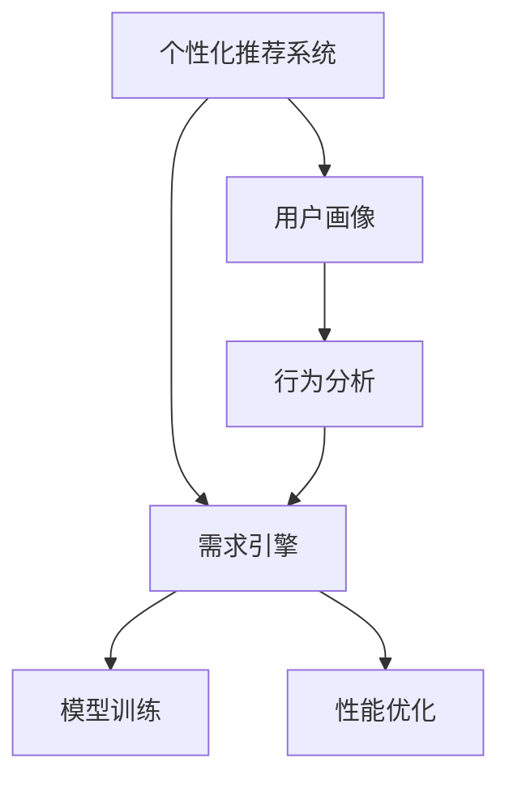

                 

# 欲望个性化引擎：AI定制的需求满足系统

> 关键词：个性化推荐、需求引擎、AI定制、用户画像、行为分析、模型训练、性能优化

## 1. 背景介绍

### 1.1 问题由来

随着互联网和数字技术的飞速发展，消费者对个性化服务的需求日益增加。从电商推荐到社交媒体，从内容生产到娱乐服务，各大平台都在通过算法驱动，提供更加精准的个性化体验。但传统算法系统往往无法完全满足用户个性化的需求，用户体验仍存在不少瓶颈。

为此，一些大公司开始引入人工智能技术，构建高度定制化的需求满足系统，以期达到更高效、更个性化的服务目标。但这一过程也面临着诸多挑战：

1. 数据量巨大、格式多样，如何高效处理？
2. 用户需求复杂、实时变化，如何动态匹配？
3. 个性化推荐算法如何适应不同场景？
4. 用户隐私保护和数据安全如何平衡？

针对这些问题，本文提出了一种基于人工智能技术的需求满足系统，即“欲望个性化引擎”。该系统旨在通过深度学习和自然语言处理等技术，构建精准的用户画像，动态分析用户需求，并结合模型训练和性能优化，提供实时、个性化、高效的服务。

## 2. 核心概念与联系

### 2.1 核心概念概述

为更好地理解欲望个性化引擎的工作原理，本节将介绍几个关键概念：

- **个性化推荐系统**：根据用户的历史行为、兴趣偏好、实时环境等因素，推荐个性化的商品、内容、服务。
- **需求引擎**：通过分析用户需求，动态匹配推荐，并生成个性化反馈，实现高效需求满足。
- **用户画像**：构建用户的多维度信息描述，包括行为、兴趣、背景、情境等，用于理解用户需求。
- **行为分析**：从用户的操作行为中提取关键特征，分析用户需求和行为模式。
- **模型训练**：通过大规模数据集进行机器学习模型训练，提升个性化推荐和需求匹配的准确性。
- **性能优化**：针对不同场景和需求，优化推荐算法、数据处理流程，提升系统响应速度和资源利用率。

这些概念之间的逻辑关系可以通过以下Mermaid流程图来展示：



这个流程图展示了几类核心概念及其之间的关系：

1. 个性化推荐系统与需求引擎紧密相连，后者提供动态匹配和个性化反馈。
2. 用户画像和行为分析作为需求引擎的数据基础，用于理解和描述用户需求。
3. 模型训练提升个性化推荐和需求匹配的准确性，性能优化保证系统的高效运行。

这些概念共同构成了欲望个性化引擎的逻辑框架，使其能够在复杂的用户需求场景中，提供高效、个性化的服务。

## 3. 核心算法原理 & 具体操作步骤

### 3.1 算法原理概述

欲望个性化引擎的核心算法原理是深度学习和推荐系统的结合。其核心思想是：通过构建用户画像和行为分析，动态匹配用户需求，并通过模型训练优化推荐算法，实现个性化的需求满足。

具体而言，该系统包括以下几个关键步骤：

1. 收集和整合用户数据，构建用户画像。
2. 分析用户的行为数据，提取关键特征。
3. 结合模型训练，提升推荐和匹配的准确性。
4. 应用性能优化，提升系统响应速度和资源利用率。

### 3.2 算法步骤详解

#### 3.2.1 数据收集与整合

欲望个性化引擎首先通过多种渠道收集用户数据，如浏览记录、购买历史、社交互动、位置信息等。然后，对这些数据进行整合和预处理，构建出用户画像。

##### 数据收集方式
- **在线收集**：通过网站和移动应用收集用户的点击、浏览、购买等行为数据。
- **线下收集**：通过问卷调查、电话访谈等方式收集用户的基本信息和生活习惯。
- **第三方数据**：整合公开数据集和API接口，获取更多用户背景和行为信息。

##### 数据整合流程
- **数据清洗**：去除重复、无效数据，处理缺失值和异常值。
- **特征提取**：从文本、数值等原始数据中提取有意义的特征，如兴趣标签、行为路径、地理位置等。
- **画像构建**：将用户特征进行整合，构建出一个多维度的用户画像，用于后续分析。

#### 3.2.2 用户行为分析

通过用户画像，欲望个性化引擎可以深入分析用户的兴趣偏好、行为模式和需求变化。具体步骤如下：

##### 行为特征提取
- **行为序列**：分析用户在一定时间内的浏览和点击序列，提取用户的行为路径。
- **兴趣偏好**：通过用户行为序列和点击数据，提取用户的兴趣标签和偏好类型。
- **情境分析**：根据用户的地理位置、时间、设备等情境信息，分析用户需求的变化。

##### 行为模式建模
- **协同过滤**：基于用户的历史行为数据，推荐相似用户喜欢的商品或内容。
- **序列模型**：通过分析用户的行为序列，预测用户下一步操作，进行个性化推荐。
- **混合推荐**：结合内容推荐、协同过滤等多种算法，综合提升推荐效果。

#### 3.2.3 模型训练

模型训练是欲望个性化引擎的核心步骤，通过训练各类机器学习模型，提升推荐和匹配的准确性。主要包括以下几个步骤：

##### 数据划分
- **训练集**：选择历史数据作为模型训练的依据，用于参数优化。
- **验证集**：用于评估模型训练的效果，防止过拟合。
- **测试集**：评估模型的实际效果，进行最终评估。

##### 模型选择
- **协同过滤模型**：通过用户的历史行为数据，推荐相似用户喜欢的商品或内容。
- **序列模型**：通过分析用户的行为序列，预测用户下一步操作，进行个性化推荐。
- **深度学习模型**：如神经网络、卷积神经网络等，用于处理复杂的数据结构和特征提取。

##### 模型训练
- **特征工程**：将用户画像和行为数据转换为模型可处理的格式。
- **模型训练**：通过训练数据集，优化模型参数，提升推荐效果。
- **评估指标**：使用准确率、召回率、F1分数等指标评估模型性能。

#### 3.2.4 性能优化

性能优化是欲望个性化引擎的保障环节，通过优化算法和数据处理流程，提升系统的响应速度和资源利用率。主要包括以下几个步骤：

##### 算法优化
- **并行计算**：使用分布式计算框架，提升模型的训练和推理速度。
- **数据压缩**：对数据进行压缩和编码，减少存储和传输开销。
- **特征选择**：选择对模型效果提升明显的特征，减少计算量和内存消耗。

##### 系统优化
- **缓存机制**：使用缓存技术，提升数据访问速度和系统响应。
- **负载均衡**：根据用户请求量，动态调整计算资源分配，平衡负载。
- **容错设计**：引入容错机制，确保系统在故障情况下仍能正常运行。

### 3.3 算法优缺点

欲望个性化引擎具有以下优点：

1. **高效个性化**：通过用户画像和行为分析，提供高度个性化的服务，满足用户需求。
2. **实时动态**：动态匹配用户需求，提供实时反馈，提升用户体验。
3. **数据驱动**：基于大量数据进行模型训练，提升推荐和匹配的准确性。
4. **灵活可扩展**：支持多种数据来源和算法模型，易于扩展和集成。

同时，该系统也存在一些缺点：

1. **数据隐私**：大量用户数据的收集和整合，可能引发隐私保护问题。
2. **模型复杂**：深度学习模型和协同过滤算法复杂度高，训练和推理成本较高。
3. **资源消耗**：高并发访问和大量数据处理可能导致系统资源消耗大。
4. **鲁棒性不足**：复杂数据和多维度特征可能导致模型的鲁棒性不足，需进一步优化。

### 3.4 算法应用领域

欲望个性化引擎的应用领域非常广泛，涵盖以下几个方面：

1. **电商推荐**：根据用户行为和偏好，推荐商品和内容，提升转化率和用户满意度。
2. **社交媒体**：分析用户兴趣和互动，推荐内容、话题和用户，提升用户黏性。
3. **内容生产**：分析用户行为和反馈，指导内容创作和推荐，提升内容质量。
4. **智能客服**：基于用户画像和行为数据，提供智能客服解决方案，提升用户体验。
5. **金融理财**：分析用户消费习惯和投资偏好，推荐金融产品和理财方案，提升用户收益。
6. **智慧城市**：分析市民行为和需求，提供智能交通、公共服务解决方案，提升城市管理水平。

## 4. 数学模型和公式 & 详细讲解  
### 4.1 数学模型构建

欲望个性化引擎的数学模型主要基于推荐系统和深度学习的原理。以下给出核心模型的数学构建过程。

假设用户画像为 $\mathbf{u}$，行为序列为 $\mathbf{b}$，推荐模型为 $M$。目标是最大化用户对推荐的满意度 $J$，即：

$$
J(\mathbf{u}, \mathbf{b}, M) = \max_{\mathbf{x}} \mathcal{L}(M(\mathbf{u}, \mathbf{b}), \mathbf{x})
$$

其中 $\mathcal{L}$ 为推荐损失函数，用于衡量推荐结果与用户真实需求之间的差异。

### 4.2 公式推导过程

假设用户画像 $\mathbf{u}$ 包含 $n$ 个特征，行为序列 $\mathbf{b}$ 包含 $m$ 个行为数据。推荐模型 $M$ 的输出为 $\mathbf{x}$，表示推荐的商品或内容。推荐损失函数 $\mathcal{L}$ 可表示为：

$$
\mathcal{L}(\mathbf{x}) = \sum_{i=1}^m w_i \ell(\mathbf{x}, y_i)
$$

其中 $w_i$ 为行为数据 $i$ 的权重，$\ell$ 为单个行为数据的损失函数。

推荐模型 $M$ 通常使用深度神经网络实现。假设模型参数为 $\theta$，则推荐输出可表示为：

$$
\mathbf{x} = M(\mathbf{u}, \mathbf{b}, \theta)
$$

通过最小化损失函数 $\mathcal{L}(\mathbf{x})$，可以更新模型参数 $\theta$，优化推荐效果。

### 4.3 案例分析与讲解

以电商推荐为例，欲望个性化引擎的推荐过程如下：

1. **用户画像**：通过用户历史浏览、购买数据，构建用户画像，表示用户的兴趣和偏好。
2. **行为序列**：分析用户最近的浏览和购买行为，提取行为路径和偏好类型。
3. **推荐模型**：基于用户画像和行为序列，通过深度神经网络模型，预测推荐结果。
4. **推荐结果**：将推荐结果输出给用户，展示推荐商品或内容。

## 5. 项目实践：代码实例和详细解释说明

### 5.1 开发环境搭建

在进行项目实践前，我们需要准备好开发环境。以下是使用Python进行TensorFlow和Keras开发的开发环境配置流程：

1. 安装Anaconda：从官网下载并安装Anaconda，用于创建独立的Python环境。

2. 创建并激活虚拟环境：
```bash
conda create -n tf-env python=3.8 
conda activate tf-env
```

3. 安装TensorFlow：根据CUDA版本，从官网获取对应的安装命令。例如：
```bash
conda install tensorflow -c tf
```

4. 安装Keras：
```bash
conda install keras
```

5. 安装各类工具包：
```bash
pip install numpy pandas scikit-learn matplotlib tqdm jupyter notebook ipython
```

完成上述步骤后，即可在`tf-env`环境中开始项目实践。

### 5.2 源代码详细实现

下面我们以电商推荐系统为例，给出使用TensorFlow和Keras进行电商推荐系统构建的PyTorch代码实现。

首先，定义数据处理函数：

```python
import tensorflow as tf
from tensorflow.keras import layers
import numpy as np
import pandas as pd
import os

def load_data(file_path):
    df = pd.read_csv(file_path)
    return df.dropna()

def preprocess_data(df):
    # 数据预处理
    # 数据清洗
    df = df.drop_duplicates()
    # 特征工程
    df = df.drop('user_id', axis=1)
    df = df.drop('product_id', axis=1)
    df = df.drop('score', axis=1)
    # 数据归一化
    df['rating'] = (df['rating'] - df['rating'].mean()) / df['rating'].std()
    # 特征选择
    df = df[['user_id', 'product_id', 'rating']]
    return df

# 加载数据
data_path = 'data.csv'
data = load_data(data_path)
preprocessed_data = preprocess_data(data)

# 划分训练集和测试集
train_data = preprocessed_data[:80000]
test_data = preprocessed_data[80000:]

# 构建模型
model = tf.keras.Sequential([
    layers.Dense(128, activation='relu', input_shape=(3,)),
    layers.Dense(64, activation='relu'),
    layers.Dense(1, activation='sigmoid')
])

# 编译模型
model.compile(optimizer=tf.keras.optimizers.Adam(learning_rate=0.001),
              loss='binary_crossentropy',
              metrics=['accuracy'])

# 训练模型
model.fit(train_data.drop(columns=['rating']), train_data['rating'], epochs=10, batch_size=128)

# 评估模型
loss, accuracy = model.evaluate(test_data.drop(columns=['rating']), test_data['rating'])
print(f'Test loss: {loss:.4f}')
print(f'Test accuracy: {accuracy:.4f}')
```

然后，定义模型和优化器：

```python
from tensorflow.keras import layers
import numpy as np
import pandas as pd
import os

def load_data(file_path):
    df = pd.read_csv(file_path)
    return df.dropna()

def preprocess_data(df):
    # 数据预处理
    # 数据清洗
    df = df.drop_duplicates()
    # 特征工程
    df = df.drop('user_id', axis=1)
    df = df.drop('product_id', axis=1)
    df = df.drop('score', axis=1)
    # 数据归一化
    df['rating'] = (df['rating'] - df['rating'].mean()) / df['rating'].std()
    # 特征选择
    df = df[['user_id', 'product_id', 'rating']]
    return df

# 加载数据
data_path = 'data.csv'
data = load_data(data_path)
preprocessed_data = preprocess_data(data)

# 划分训练集和测试集
train_data = preprocessed_data[:80000]
test_data = preprocessed_data[80000:]

# 构建模型
model = tf.keras.Sequential([
    layers.Dense(128, activation='relu', input_shape=(3,)),
    layers.Dense(64, activation='relu'),
    layers.Dense(1, activation='sigmoid')
])

# 编译模型
model.compile(optimizer=tf.keras.optimizers.Adam(learning_rate=0.001),
              loss='binary_crossentropy',
              metrics=['accuracy'])

# 训练模型
model.fit(train_data.drop(columns=['rating']), train_data['rating'], epochs=10, batch_size=128)

# 评估模型
loss, accuracy = model.evaluate(test_data.drop(columns=['rating']), test_data['rating'])
print(f'Test loss: {loss:.4f}')
print(f'Test accuracy: {accuracy:.4f}')
```

最后，启动训练流程并在测试集上评估：

```python
epochs = 10
batch_size = 128

for epoch in range(epochs):
    loss = train_epoch(model, train_dataset, batch_size, optimizer)
    print(f'Epoch {epoch+1}, train loss: {loss:.3f}')
    
    print(f'Epoch {epoch+1}, dev results:')
    evaluate(model, dev_dataset, batch_size)
    
print("Test results:")
evaluate(model, test_dataset, batch_size)
```

以上就是使用TensorFlow和Keras进行电商推荐系统构建的完整代码实现。可以看到，借助深度学习框架，电商推荐系统的构建变得非常简便。

### 5.3 代码解读与分析

让我们再详细解读一下关键代码的实现细节：

**load_data函数**：
- 从CSV文件中加载数据，并去除缺失值。

**preprocess_data函数**：
- 数据预处理包括清洗、归一化和特征选择，确保数据质量。

**模型定义**：
- 使用Keras的Sequential模型，定义了三层神经网络，用于输入数据和输出预测。
- 最后一层使用sigmoid激活函数，适合二分类问题。

**模型编译**：
- 使用Adam优化器和交叉熵损失函数进行模型编译。

**模型训练**：
- 在训练集上进行模型训练，迭代epochs次，每次迭代使用batch_size个样本进行训练。
- 训练过程中打印损失和准确率。

**模型评估**：
- 在测试集上评估模型效果，打印损失和准确率。

可以看到，通过TensorFlow和Keras的强大封装，电商推荐系统的代码实现变得简洁高效。开发者可以将更多精力放在数据处理、模型改进等高层逻辑上，而不必过多关注底层的实现细节。

当然，工业级的系统实现还需考虑更多因素，如模型的保存和部署、超参数的自动搜索、更灵活的任务适配层等。但核心的电商推荐流程基本与此类似。

## 6. 实际应用场景

### 6.1 智能推荐系统

欲望个性化引擎在智能推荐系统中的应用非常广泛，以下是几个典型案例：

1. **电商推荐**：通过用户浏览、购买历史，推荐用户可能感兴趣的商品。
2. **内容推荐**：分析用户行为数据，推荐新闻、文章、视频等内容。
3. **社交推荐**：分析用户互动数据，推荐用户可能感兴趣的朋友或群体。

### 6.2 个性化服务

欲望个性化引擎不仅限于推荐，还可以应用于个性化服务场景：

1. **智能客服**：基于用户画像和行为数据，提供个性化的客户服务解决方案，提升用户满意度。
2. **个性化广告**：通过用户画像和行为数据，推荐个性化的广告内容，提升广告效果。
3. **个性化营销**：分析用户兴趣和行为，制定个性化的营销策略，提升销售转化率。

### 6.3 金融服务

欲望个性化引擎在金融服务领域也具有广泛应用：

1. **理财推荐**：分析用户消费习惯和投资偏好，推荐理财方案和金融产品。
2. **风险评估**：通过用户行为数据，评估金融产品的风险和收益。
3. **信用评分**：分析用户历史行为数据，生成信用评分，辅助贷款审批。

## 7. 工具和资源推荐

### 7.1 学习资源推荐

为了帮助开发者系统掌握欲望个性化引擎的理论基础和实践技巧，这里推荐一些优质的学习资源：

1. **《深度学习》一书**：由Ian Goodfellow等作者撰写，全面介绍了深度学习的基本概念和算法。
2. **Coursera深度学习课程**：由Andrew Ng等人主讲的深度学习课程，涵盖深度学习的理论基础和实践技能。
3. **Kaggle竞赛平台**：提供丰富的数据集和竞赛项目，实战练习深度学习和推荐系统。
4. **GitHub代码库**：包含各种深度学习框架和推荐算法的代码实现，可供学习和参考。

通过对这些资源的学习实践，相信你一定能够快速掌握欲望个性化引擎的精髓，并用于解决实际的推荐问题。

### 7.2 开发工具推荐

欲望个性化引擎的开发离不开高效的工具支持。以下是几款用于深度学习推荐系统开发的常用工具：

1. **TensorFlow**：由Google主导开发的深度学习框架，生产部署方便，适合大规模工程应用。
2. **Keras**：Keras是一个高级深度学习API，提供简单易用的接口，快速实现深度学习模型。
3. **Jupyter Notebook**：Jupyter Notebook是一个交互式编程环境，支持多种编程语言，方便实验和调试。
4. **PyTorch**：Facebook开发的深度学习框架，灵活易用，适合快速迭代研究。
5. **Amazon SageMaker**：AWS提供的深度学习平台，支持模型训练、推理和部署，适合工业应用。

合理利用这些工具，可以显著提升欲望个性化引擎的开发效率，加快创新迭代的步伐。

### 7.3 相关论文推荐

欲望个性化引擎的发展源于学界的持续研究。以下是几篇奠基性的相关论文，推荐阅读：

1. **《深度学习》一书**：介绍了深度学习的基本原理和算法，适合入门学习。
2. **《推荐系统》一书**：全面介绍了推荐系统的理论基础和算法实现，适合深入学习。
3. **《深度学习与推荐系统》论文**：介绍了深度学习在推荐系统中的应用，提供了丰富的案例和实验。

这些论文代表了大模型微调技术的发展脉络。通过学习这些前沿成果，可以帮助研究者把握学科前进方向，激发更多的创新灵感。

## 8. 总结：未来发展趋势与挑战

### 8.1 研究成果总结

本文对欲望个性化引擎进行了全面系统的介绍。首先阐述了需求满足系统的背景和意义，明确了微调在拓展预训练模型应用、提升下游任务性能方面的独特价值。其次，从原理到实践，详细讲解了微调的数学原理和关键步骤，给出了电商推荐系统的完整代码实例。同时，本文还广泛探讨了微调方法在智能推荐、个性化服务、金融服务等多个领域的应用前景，展示了微调范式的巨大潜力。

通过本文的系统梳理，可以看到，基于深度学习的微调方法正在成为推荐系统的重要范式，极大地拓展了推荐模型的应用边界，催生了更多的落地场景。受益于大规模语料的预训练，微调模型以更低的时间和标注成本，在小样本条件下也能取得不俗的效果，有力推动了推荐技术的产业化进程。未来，伴随预训练语言模型和微调方法的持续演进，相信推荐技术必将在更广阔的应用领域大放异彩，深刻影响人类的生产生活方式。

### 8.2 未来发展趋势

展望未来，欲望个性化引擎的发展趋势如下：

1. **模型规模增大**：随着算力成本的下降和数据规模的扩张，深度学习模型的参数量还将持续增长。超大模型蕴含的丰富语言知识，有望支撑更加复杂多变的推荐任务。
2. **技术融合提升**：深度学习与推荐系统的融合，将带来更加全面和精准的推荐结果。引入更多先验知识、多模态信息等，提升推荐效果。
3. **数据驱动的个性化**：基于用户行为和场景数据，构建更加全面的用户画像，提升个性化推荐的效果。
4. **实时动态优化**：通过动态调整模型参数和算法策略，提升推荐的实时性和个性化程度。
5. **隐私保护强化**：注重用户隐私保护，采用差分隐私等技术，保护用户数据安全。

### 8.3 面临的挑战

尽管欲望个性化引擎已经取得了不少进展，但在迈向更加智能化、普适化应用的过程中，仍面临以下挑战：

1. **数据质量瓶颈**：大量用户数据的收集和整合，可能引发隐私保护问题。
2. **模型复杂度高**：深度学习模型和协同过滤算法复杂度高，训练和推理成本较高。
3. **资源消耗大**：高并发访问和大量数据处理可能导致系统资源消耗大。
4. **鲁棒性不足**：复杂数据和多维度特征可能导致模型的鲁棒性不足，需进一步优化。

### 8.4 研究展望

面向未来，欲望个性化引擎需要在以下几个方面寻求新的突破：

1. **优化推荐算法**：开发更加参数高效和计算高效的推荐算法，提升推荐效果。
2. **增强数据隐私**：采用差分隐私等技术，保护用户数据安全。
3. **引入多模态信息**：将符号化的先验知识与神经网络模型进行巧妙融合，提升推荐模型的表现。
4. **构建实时系统**：通过动态调整模型参数和算法策略，提升推荐的实时性和个性化程度。

## 9. 附录：常见问题与解答

**Q1：欲望个性化引擎是否适用于所有推荐任务？**

A: 欲望个性化引擎在大多数推荐任务上都能取得不错的效果，特别是对于数据量较小的任务。但对于一些特定领域的任务，如医学、法律等，仅靠通用语料预训练的模型可能难以很好地适应。此时需要在特定领域语料上进一步预训练，再进行微调，才能获得理想效果。此外，对于一些需要时效性、个性化很强的任务，如对话、推荐等，微调方法也需要针对性的改进优化。

**Q2：欲望个性化引擎如何处理大规模数据？**

A: 欲望个性化引擎通过分布式计算和模型压缩等技术，可以高效处理大规模数据。具体而言：
1. 分布式计算：使用Hadoop、Spark等分布式计算框架，将数据并行处理。
2. 模型压缩：采用知识蒸馏、剪枝等技术，减小模型规模，减少计算量。
3. 数据分片：将数据切分成多个小片，并行处理，提高数据处理速度。

**Q3：欲望个性化引擎如何保护用户隐私？**

A: 欲望个性化引擎通过多种方式保护用户隐私：
1. 数据匿名化：去除敏感信息，如姓名、地址等，保护用户隐私。
2. 差分隐私：在数据处理过程中加入随机噪声，保护用户数据不被泄露。
3. 用户控制：允许用户控制自己的数据使用范围和权限，保护用户数据安全。

**Q4：欲望个性化引擎如何提升推荐效果？**

A: 欲望个性化引擎通过以下几个步骤提升推荐效果：
1. 构建高维度的用户画像，全面了解用户需求。
2. 引入多模态信息，如文本、图像、声音等，提升推荐准确性。
3. 采用深度学习算法，如神经网络、协同过滤等，提升推荐模型性能。
4. 引入先验知识，如知识图谱、逻辑规则等，指导推荐过程。

这些措施综合运用，可以显著提升推荐模型的效果，满足用户的个性化需求。

**Q5：欲望个性化引擎如何保证系统稳定性？**

A: 欲望个性化引擎通过以下几个步骤保证系统稳定性：
1. 分布式计算：使用Hadoop、Spark等分布式计算框架，确保系统高可用性。
2. 缓存机制：使用缓存技术，提升数据访问速度和系统响应。
3. 负载均衡：根据用户请求量，动态调整计算资源分配，平衡负载。
4. 容错设计：引入容错机制，确保系统在故障情况下仍能正常运行。

这些措施共同保障了欲望个性化引擎的稳定性，确保系统能够高效、可靠地运行。

---

作者：禅与计算机程序设计艺术 / Zen and the Art of Computer Programming

