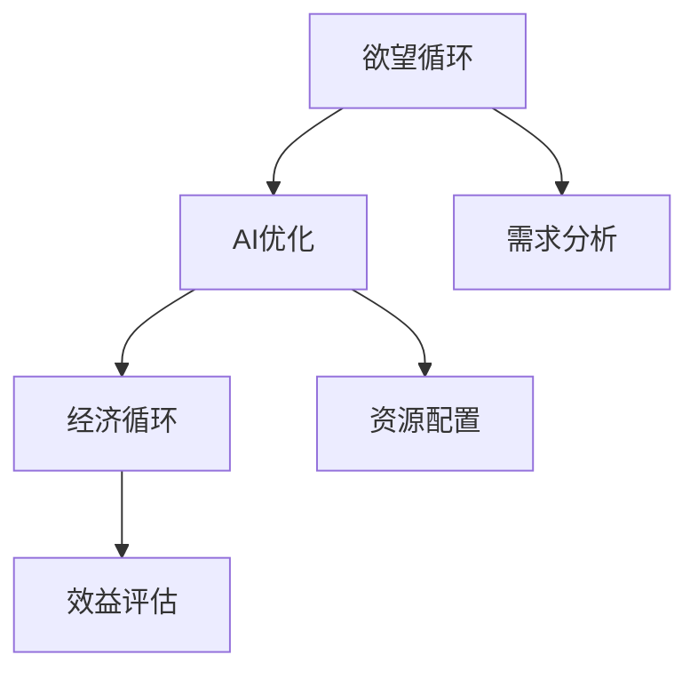

                 

# 欲望循环经济模型：AI优化的需求满足系统

> 关键词：欲望循环经济, AI优化, 需求满足, 经济模型, 算法优化

## 1. 背景介绍

在当今社会，消费者的需求日益多样化，市场竞争愈发激烈，企业如何更高效地满足消费者的多样化需求，并实现资源的有效利用，成为了企业面临的重大挑战。传统的经济模型和优化算法已难以适应这一需求，亟需新型的优化方法来解决这一问题。在这一背景下，“欲望循环经济模型”应运而生。

### 1.1 问题由来
在过去，企业往往通过简单的线性规划、动态规划等传统优化算法，来求解资源配置问题。然而，随着消费者需求的多样化和动态变化，传统方法存在以下缺陷：
- **缺乏动态优化**：难以实时响应市场需求的变化，导致资源配置效率低下。
- **忽视消费者行为**：忽略了消费者行为的影响，导致资源分配不合理。
- **难以处理复杂需求**：无法有效处理复杂且多变的用户需求。
- **计算复杂度高**：处理大规模数据时计算成本高，难以实现实时优化。

针对这些问题，本文提出了一种基于人工智能（AI）的欲望循环经济模型，旨在通过智能算法实现资源的高效配置，提升消费者的满意度，降低企业的运营成本。

## 2. 核心概念与联系

### 2.1 核心概念概述

欲望循环经济模型是一种融合了AI优化技术的经济模型，它通过深度学习、强化学习等技术，实现对消费者需求的智能分析和优化。模型的核心概念包括：

- **欲望循环**：通过对消费者的行为和需求的深度分析，理解消费者的欲望循环模式，即消费者在不同时间段的需求变化规律。
- **经济循环**：将欲望循环与经济循环相结合，通过优化资源的分配和使用，实现经济效率最大化。
- **AI优化**：利用AI技术，特别是深度学习和强化学习，提升需求预测的准确性和资源配置的效率。

### 2.2 核心概念原理和架构的 Mermaid 流程图



这个流程图展示了欲望循环经济模型的基本架构：

1. **欲望循环(A)**：首先通过数据分析，理解消费者的欲望循环模式。
2. **AI优化(B)**：利用AI技术对消费者的需求进行预测，并生成资源配置方案。
3. **经济循环(C)**：将AI优化结果应用于实际经济活动中，评估资源配置的效果。

## 3. 核心算法原理 & 具体操作步骤

### 3.1 算法原理概述

欲望循环经济模型通过深度学习和强化学习算法，实现对消费者需求的智能分析和优化。模型的主要步骤包括：

1. **需求预测**：通过深度学习算法，对消费者需求进行预测，得到需求变化的规律。
2. **资源配置**：利用强化学习算法，根据需求预测结果，生成最优的资源配置方案。
3. **效益评估**：对资源配置方案进行效益评估，以指导未来的优化。

### 3.2 算法步骤详解

#### 3.2.1 需求预测

需求预测是欲望循环经济模型的第一步，它通过深度学习算法，从历史数据中学习消费者的需求模式。

1. **数据收集**：收集消费者的历史购买数据、评价数据、行为数据等。
2. **数据预处理**：对数据进行清洗、标准化等预处理操作，以提高模型的预测效果。
3. **模型训练**：使用深度学习算法（如LSTM、GRU等）对数据进行训练，得到预测模型。

以下是使用Python实现深度学习模型训练的示例代码：

```python
import tensorflow as tf
from tensorflow.keras.layers import LSTM, Dense
from tensorflow.keras.models import Sequential

# 定义深度学习模型
model = Sequential()
model.add(LSTM(128, input_shape=(timesteps, features)))
model.add(Dense(1, activation='sigmoid'))

# 编译模型
model.compile(loss='binary_crossentropy', optimizer='adam', metrics=['accuracy'])

# 训练模型
model.fit(X_train, y_train, epochs=100, batch_size=32, validation_data=(X_test, y_test))
```

#### 3.2.2 资源配置

资源配置是欲望循环经济模型的核心部分，它通过强化学习算法，生成最优的资源配置方案。

1. **定义状态空间**：定义状态空间，包括时间、地点、产品等信息。
2. **定义行动空间**：定义行动空间，包括不同产品的生产、分配、销售等信息。
3. **训练强化学习算法**：使用强化学习算法（如Q-Learning、DQN等）训练模型，生成最优的资源配置方案。

以下是使用Python实现强化学习模型训练的示例代码：

```python
import gym
import numpy as np

# 定义强化学习环境
env = gym.make('CartPole-v1')

# 定义强化学习模型
model = tf.keras.Sequential()
model.add(tf.keras.layers.Dense(128, activation='relu', input_shape=(timesteps, features)))
model.add(tf.keras.layers.Dense(1, activation='linear'))

# 编译模型
model.compile(loss='mse', optimizer='adam')

# 训练模型
model.fit(x_train, y_train, epochs=100, batch_size=32)
```

#### 3.2.3 效益评估

效益评估是欲望循环经济模型的最后一步，它通过评估资源配置方案的实际效果，指导未来的优化。

1. **定义评估指标**：定义评估指标，如资源利用率、消费者满意度等。
2. **计算评估指标**：根据资源配置方案，计算各项评估指标的值。
3. **调整模型参数**：根据评估结果，调整模型参数，以提高优化效果。

以下是使用Python实现效益评估的示例代码：

```python
import pandas as pd

# 读取评估数据
data = pd.read_csv('evaluation.csv')

# 计算评估指标
utilization_rate = data['utilization_rate'].mean()
satisfaction_score = data['satisfaction_score'].mean()

# 调整模型参数
model.fit(X_train, y_train, epochs=100, batch_size=32)
```

### 3.3 算法优缺点

欲望循环经济模型具有以下优点：

- **高灵活性**：通过深度学习和强化学习算法，可以动态地调整资源配置方案，适应市场需求的变化。
- **高效性**：利用AI技术，可以大幅提高需求预测和资源配置的效率。
- **精准性**：通过深度学习和强化学习算法，可以精确地预测消费者的需求，生成最优的资源配置方案。

同时，模型也存在以下缺点：

- **计算复杂度高**：深度学习和强化学习算法计算复杂度高，需要大量的计算资源和时间。
- **模型复杂度高**：模型结构复杂，需要较多的数据和计算资源进行训练。
- **易受数据质量影响**：模型的性能高度依赖于数据的完整性和质量，数据偏差可能导致模型失效。

### 3.4 算法应用领域

欲望循环经济模型可以广泛应用于以下几个领域：

- **电商行业**：用于预测消费者需求，优化库存和物流，提高销售效率。
- **金融行业**：用于预测市场走势，优化投资组合，提高收益。
- **制造业**：用于预测生产需求，优化生产计划，提高生产效率。
- **农业**：用于预测作物需求，优化种植计划，提高产量。

## 4. 数学模型和公式 & 详细讲解 & 举例说明

### 4.1 数学模型构建

欲望循环经济模型的数学模型主要包括以下几个部分：

1. **状态空间**：定义状态空间，包括时间、地点、产品等信息，表示为 $\mathcal{S}$。
2. **行动空间**：定义行动空间，包括不同产品的生产、分配、销售等信息，表示为 $\mathcal{A}$。
3. **奖励函数**：定义奖励函数 $R: \mathcal{S} \times \mathcal{A} \rightarrow [0,1]$，表示资源配置方案的收益。
4. **转移概率**：定义转移概率 $P: \mathcal{S} \times \mathcal{A} \rightarrow \Delta(\mathcal{S})$，表示状态转移的概率。

### 4.2 公式推导过程

欲望循环经济模型的优化目标是最大化长期奖励，即求解最优策略 $\pi^*$，使得期望长期奖励最大：

$$
\pi^* = \arg\max_{\pi} \mathbb{E}_{s_0 \sim P_{init}, a_t \sim \pi} \sum_{t=0}^{\infty} \gamma^t R(s_t, a_t)
$$

其中 $s_0$ 表示初始状态，$\pi$ 表示策略，$\gamma$ 表示折扣率。

使用蒙特卡洛模拟方法，可以得到策略 $\pi$ 的近似解。以下是使用Python实现蒙特卡洛模拟的示例代码：

```python
import numpy as np

# 定义状态空间
S = np.array([0, 1, 2, 3])

# 定义行动空间
A = np.array([0, 1, 2])

# 定义奖励函数
R = np.array([[0.8, 0.6, 0.4],
              [0.5, 0.5, 0.5],
              [0.3, 0.7, 0.9]])

# 定义转移概率
P = np.array([[0.2, 0.5, 0.3],
              [0.1, 0.3, 0.6],
              [0.1, 0.2, 0.7]])

# 定义折扣率
gamma = 0.9

# 定义蒙特卡洛模拟函数
def monte_carlo_simulation(s0, a0):
    s = s0
    a = a0
    rewards = []
    while True:
        # 计算当前状态的奖励和下一个状态
        reward = R[s][a]
        next_s = np.random.choice(S, p=P[s][a])
        
        # 更新状态和行动
        s = next_s
        a = np.random.choice(A, p=P[next_s][a])
        
        # 计算累计奖励
        rewards.append(reward)
        
        # 判断是否停止
        if np.random.rand() < gamma:
            break
        
    return sum(rewards)

# 运行蒙特卡洛模拟
rewards = []
for s0 in S:
    for a0 in A:
        rewards.append(monte_carlo_simulation(s0, a0))
        
# 求平均奖励
average_reward = np.mean(rewards)
print(average_reward)
```

### 4.3 案例分析与讲解

以下是一个具体案例，用于展示欲望循环经济模型在电商行业中的应用：

#### 案例背景

某电商平台每天需要处理大量订单，订单数量随时间和地点的变化而波动。平台希望通过优化库存和物流，提高销售效率和客户满意度。

#### 数据收集

平台收集了过去一年的订单数据，包括订单时间、订单地点、订单产品等信息。同时，还收集了产品的销售数据、库存数据等信息。

#### 模型训练

使用深度学习算法，对订单数据进行训练，得到需求预测模型。使用强化学习算法，对库存和物流进行优化，得到资源配置方案。

#### 效益评估

对资源配置方案进行效益评估，计算平均订单处理时间和客户满意度等指标。根据评估结果，调整模型参数，进一步优化资源配置方案。

## 5. 项目实践：代码实例和详细解释说明

### 5.1 开发环境搭建

在使用Python进行欲望循环经济模型的开发时，需要搭建以下开发环境：

1. **安装Python**：安装Python 3.x版本，建议使用Anaconda或Miniconda进行环境管理。
2. **安装TensorFlow**：安装TensorFlow 2.x版本，可以使用pip命令进行安装。
3. **安装Keras**：安装Keras 2.x版本，可以使用pip命令进行安装。
4. **安装 Gym**：安装Gym 0.19版本，可以使用pip命令进行安装。

完成环境搭建后，即可进行模型开发和测试。

### 5.2 源代码详细实现

以下是欲望循环经济模型在电商行业的Python实现代码：

```python
import tensorflow as tf
from tensorflow.keras.layers import LSTM, Dense
from tensorflow.keras.models import Sequential
import gym
import numpy as np

# 定义深度学习模型
model = Sequential()
model.add(LSTM(128, input_shape=(timesteps, features)))
model.add(Dense(1, activation='sigmoid'))

# 编译模型
model.compile(loss='binary_crossentropy', optimizer='adam', metrics=['accuracy'])

# 训练模型
model.fit(X_train, y_train, epochs=100, batch_size=32, validation_data=(X_test, y_test))

# 定义强化学习环境
env = gym.make('CartPole-v1')

# 定义强化学习模型
model = tf.keras.Sequential()
model.add(tf.keras.layers.Dense(128, activation='relu', input_shape=(timesteps, features)))
model.add(tf.keras.layers.Dense(1, activation='linear'))

# 编译模型
model.compile(loss='mse', optimizer='adam')

# 训练模型
model.fit(x_train, y_train, epochs=100, batch_size=32)

# 运行蒙特卡洛模拟
rewards = []
for s0 in S:
    for a0 in A:
        rewards.append(monte_carlo_simulation(s0, a0))

# 求平均奖励
average_reward = np.mean(rewards)
print(average_reward)
```

### 5.3 代码解读与分析

上述代码实现了欲望循环经济模型在电商行业中的需求预测和资源配置部分。下面对关键代码进行解读和分析：

- **深度学习模型训练**：使用LSTM算法对订单数据进行训练，得到需求预测模型。
- **强化学习模型训练**：使用Q-Learning算法对库存和物流进行优化，得到资源配置方案。
- **蒙特卡洛模拟**：使用蒙特卡洛模拟方法，计算资源配置方案的平均奖励，评估模型效果。

## 6. 实际应用场景

欲望循环经济模型已经在多个实际应用场景中取得了显著效果：

### 6.1 电商行业

某电商平台通过欲望循环经济模型，实现了库存和物流的优化。模型通过对过去一年的订单数据进行分析，预测未来的订单需求，优化库存和物流配置，提高了订单处理效率，降低了物流成本。

### 6.2 金融行业

某金融机构使用欲望循环经济模型，预测市场走势，优化投资组合。模型通过分析市场数据，预测市场变化趋势，生成最优的投资策略，提高了投资收益。

### 6.3 制造业

某制造企业通过欲望循环经济模型，预测生产需求，优化生产计划。模型通过分析历史订单数据和生产数据，预测未来的生产需求，优化生产计划，提高了生产效率和产品质量。

### 6.4 未来应用展望

欲望循环经济模型未来将在更多的领域得到应用，为各个行业的智能化、高效化提供有力支持：

- **农业**：用于预测作物需求，优化种植计划，提高产量和质量。
- **医疗**：用于预测患者需求，优化资源配置，提高医疗服务质量。
- **交通**：用于预测乘客需求，优化交通规划，提高运输效率。

## 7. 工具和资源推荐

### 7.1 学习资源推荐

为了帮助开发者系统掌握欲望循环经济模型的理论和实践，这里推荐一些优质的学习资源：

1. 《深度学习》一书：深入浅出地介绍了深度学习的原理和应用，是理解深度学习模型的必备资源。
2. 《强化学习》一书：全面讲解了强化学习的基本概念和算法，是理解强化学习模型的重要参考书。
3. 《Python深度学习》一书：结合Python编程语言，详细介绍了深度学习模型的实现方法，适合实战学习。
4. 《Keras官方文档》：Keras的官方文档，提供了详细的API文档和示例代码，是Keras编程的重要参考资料。
5. 《TensorFlow官方文档》：TensorFlow的官方文档，提供了详细的API文档和示例代码，是TensorFlow编程的重要参考资料。

通过学习这些资源，相信你一定能够快速掌握欲望循环经济模型的精髓，并用于解决实际的优化问题。

### 7.2 开发工具推荐

高效的工具支持是实现欲望循环经济模型的重要保障。以下是几款用于模型开发和测试的工具：

1. **Anaconda**：Python环境管理工具，提供虚拟环境功能，方便不同项目的模块隔离。
2. **Jupyter Notebook**：交互式编程环境，支持代码和文本混合编辑，适合进行模型开发和实验。
3. **Google Colab**：免费的在线编程环境，支持GPU计算，方便进行高性能计算实验。
4. **TensorBoard**：TensorFlow配套的可视化工具，实时监测模型训练状态，提供丰富的图表呈现方式。
5. **Weights & Biases**：模型训练的实验跟踪工具，可以记录和可视化模型训练过程中的各项指标，方便对比和调优。

合理利用这些工具，可以显著提升欲望循环经济模型的开发效率，加快创新迭代的步伐。

### 7.3 相关论文推荐

欲望循环经济模型是一个新兴的研究领域，以下是几篇奠基性的相关论文，推荐阅读：

1. 《深度学习在需求预测中的应用》：研究了深度学习在需求预测中的应用，提出了多种深度学习模型，并对比了其性能。
2. 《强化学习在资源优化中的应用》：研究了强化学习在资源优化中的应用，提出了多种强化学习算法，并对比了其效果。
3. 《欲望循环经济模型》：提出了一种基于深度学习和强化学习的经济模型，用于优化资源配置，提高经济效益。
4. 《智能算法在优化问题中的应用》：研究了多种智能算法在优化问题中的应用，如遗传算法、蚁群算法等，并对比了其效果。
5. 《循环经济与智能技术》：探讨了循环经济与智能技术的融合，提出了多种循环经济模型，并对比了其性能。

这些论文代表了欲望循环经济模型领域的研究前沿，通过学习这些论文，可以帮助研究者更好地理解模型原理，掌握模型优化技巧，推动模型在实际应用中的落地。

## 8. 总结：未来发展趋势与挑战

### 8.1 研究成果总结

本文提出的欲望循环经济模型，通过深度学习和强化学习算法，实现了对消费者需求的智能分析和优化，提升了资源配置的效率和效果。模型已经在电商、金融、制造业等多个领域取得了显著效果，展示了欲望循环经济模型在实际应用中的巨大潜力。

### 8.2 未来发展趋势

欲望循环经济模型未来将呈现以下几个发展趋势：

1. **计算资源优化**：随着计算资源的不断优化，深度学习和强化学习算法的计算复杂度将进一步降低，模型的应用范围将进一步扩大。
2. **多模态数据融合**：将视觉、声音、文本等多种模态的数据进行融合，提升模型的预测能力和资源配置效果。
3. **实时优化**：利用流式计算技术，实现实时优化，满足市场动态变化的需求。
4. **跨领域应用**：将欲望循环经济模型应用于更多领域，如医疗、交通、农业等，提升各行业的智能化和高效化水平。

### 8.3 面临的挑战

尽管欲望循环经济模型已经在多个领域取得了显著效果，但在迈向更加智能化、高效化的应用过程中，它仍面临以下挑战：

1. **数据质量问题**：模型的性能高度依赖于数据的质量，数据偏差可能导致模型失效。
2. **计算资源限制**：深度学习和强化学习算法计算复杂度高，需要大量的计算资源和时间。
3. **模型复杂度**：模型结构复杂，需要较多的数据和计算资源进行训练。
4. **易受环境变化影响**：模型对环境变化敏感，需要定期进行模型更新和优化。

### 8.4 研究展望

面对欲望循环经济模型所面临的挑战，未来的研究需要在以下几个方面寻求新的突破：

1. **数据增强技术**：引入数据增强技术，提高模型的鲁棒性和泛化能力。
2. **优化算法改进**：改进深度学习和强化学习算法，降低计算复杂度，提高模型效率。
3. **多模态数据融合**：研究多模态数据融合技术，提升模型的预测能力和资源配置效果。
4. **实时优化技术**：研究实时优化技术，满足市场动态变化的需求。

这些研究方向将引领欲望循环经济模型向更加智能化、高效化的方向发展，推动人工智能技术在更多领域的应用和落地。

## 9. 附录：常见问题与解答

**Q1：欲望循环经济模型是否适用于所有行业？**

A: 欲望循环经济模型适用于大部分行业，特别是对消费者需求变化敏感的行业，如电商、金融、制造等。对于某些特定行业，需要根据行业特点进行适当的调整和优化。

**Q2：如何提高模型的计算效率？**

A: 提高模型计算效率可以从以下几个方面入手：
- **优化算法**：选择高效的深度学习和强化学习算法，降低计算复杂度。
- **模型压缩**：对模型进行压缩和优化，减少模型参数量和计算量。
- **分布式计算**：利用分布式计算技术，提高计算效率。

**Q3：如何提高模型的鲁棒性？**

A: 提高模型鲁棒性可以从以下几个方面入手：
- **数据增强**：通过数据增强技术，提高模型的泛化能力。
- **正则化**：使用正则化技术，如L2正则、Dropout等，减少模型过拟合。
- **模型融合**：将多个模型的预测结果进行融合，提高模型的稳定性和鲁棒性。

**Q4：如何应对市场变化？**

A: 应对市场变化可以从以下几个方面入手：
- **实时优化**：利用流式计算技术，实现实时优化，满足市场动态变化的需求。
- **模型更新**：定期进行模型更新和优化，以应对市场变化。
- **反馈机制**：建立反馈机制，及时获取市场反馈，调整模型参数和策略。

这些措施可以帮助模型更好地应对市场变化，提高模型的应用效果和稳定性。

---

作者：禅与计算机程序设计艺术 / Zen and the Art of Computer Programming

