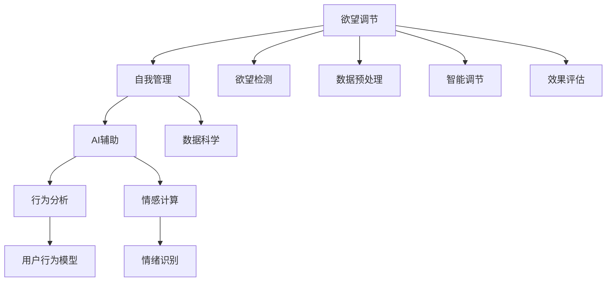

                 

# 欲望智能调节系统：AI辅助的自我管理平台

> 关键词：欲望调节, 自我管理, AI辅助, 数据科学, 机器学习, 行为分析, 情感计算, 健康管理

## 1. 背景介绍

### 1.1 问题由来

在当今快节奏、高压力的社会中，人们的欲望和行为变得越来越复杂。如何科学地理解和管理欲望，特别是控制负面情绪和压力，提高生活质量，成为现代人关注的焦点。传统的心理咨询和行为管理方法在面对个体的多样性和复杂性时显得力不从心。

欲望调节，作为一种新兴的自我管理手段，通过结合心理学、数据科学和人工智能技术，提供了更加科学、精准的解决方案。欲望调节系统利用大数据分析和机器学习算法，对用户的心理状态和行为模式进行深入分析，帮助用户认识自我，做出更明智的决策，从而提升生活质量。

### 1.2 问题核心关键点

欲望调节系统的核心在于利用AI技术对用户的欲望和行为进行分析和调节。具体来说，系统通过以下核心步骤来实现这一目标：

1. **欲望检测**：系统通过传感器、问卷调查、行为记录等多种方式，收集用户的行为数据和生理数据。
2. **数据预处理**：对原始数据进行清洗、归一化等预处理，为后续分析做准备。
3. **情感分析**：利用自然语言处理(NLP)技术和情感计算技术，对用户的情绪和心理状态进行识别和评估。
4. **行为建模**：构建用户行为模型，预测用户的欲望和行为趋势。
5. **智能调节**：根据用户当前的心理和行为状态，提供个性化的调节建议和干预措施。
6. **效果评估**：定期对用户的心理状态和行为进行评估，优化调节策略。

### 1.3 问题研究意义

欲望调节系统的研究，对于提升个人的生活质量、减轻社会压力、提高心理健康具有重要意义：

1. **提升生活质量**：通过科学地管理欲望，帮助用户建立健康的行为习惯，减少负面行为，提升幸福感和生活满意度。
2. **减轻社会压力**：欲望调节系统可以成为心理咨询的补充工具，帮助人们应对日常生活中的各种压力，减少心理健康问题的发生。
3. **提高心理健康**：通过对心理状态的持续监测和调节，预防和缓解各种心理疾病，提高整体心理健康水平。

## 2. 核心概念与联系

### 2.1 核心概念概述

欲望调节系统融合了心理学、数据科学和人工智能技术，其主要概念包括：

- **欲望调节**：利用AI技术对用户的欲望进行识别和调节，帮助用户实现自我管理。
- **自我管理**：通过行为分析和心理干预，帮助用户建立健康的生活方式，提升生活质量。
- **AI辅助**：借助人工智能技术，实现自动化数据处理、情感分析和行为建模，提高系统的精确度和可操作性。
- **数据科学**：利用大数据分析和机器学习技术，构建用户行为模型，预测欲望和行为趋势。
- **行为分析**：通过分析用户的行为数据，识别出影响欲望和行为的关键因素。
- **情感计算**：利用情感识别技术，评估用户的情绪状态，辅助欲望调节。
- **健康管理**：通过欲望调节系统，帮助用户实现身心健康的全面管理。

这些概念之间的逻辑关系可以通过以下Mermaid流程图来展示：



这个流程图展示出欲望调节系统的主要流程和概念之间的关系：

1. 欲望调节系统从欲望检测开始，收集用户数据。
2. 数据预处理对原始数据进行清洗和归一化，为后续分析做准备。
3. 行为分析通过构建用户行为模型，预测用户的欲望和行为趋势。
4. 情感计算利用情感识别技术，评估用户的情绪状态。
5. AI辅助借助机器学习算法，实现自动化数据处理和智能调节。
6. 智能调节根据用户的心理和行为状态，提供个性化的调节建议。
7. 效果评估定期评估用户的心理状态和行为，优化调节策略。

这些概念共同构成了欲望调节系统的理论框架，使其能够有效地实现对欲望的科学管理。

## 3. 核心算法原理 & 具体操作步骤

### 3.1 算法原理概述

欲望调节系统利用AI技术，对用户的欲望和行为进行分析和调节。其主要算法原理如下：

1. **欲望检测**：通过传感器、问卷调查、行为记录等手段，收集用户的欲望数据。
2. **数据预处理**：对收集到的数据进行清洗、归一化等预处理，去除噪声和异常值。
3. **行为建模**：利用机器学习算法，构建用户行为模型，预测欲望和行为趋势。
4. **情感分析**：通过情感识别技术，评估用户的情绪状态，识别负面情绪和压力。
5. **智能调节**：根据用户当前的心理和行为状态，提供个性化的调节建议和干预措施。
6. **效果评估**：定期评估用户的心理状态和行为，优化调节策略。

### 3.2 算法步骤详解

#### 3.2.1 欲望检测

欲望检测是欲望调节系统的第一步。系统通过以下方式收集用户数据：

1. **传感器数据**：利用可穿戴设备（如智能手表、健康监测设备等）收集用户的心率、血压、睡眠质量等生理数据。
2. **行为记录**：通过手机应用、日记记录等方式，收集用户的行为数据，如饮食、运动、社交活动等。
3. **问卷调查**：定期向用户发送问卷，了解其心理状态和欲望倾向。

#### 3.2.2 数据预处理

数据预处理是保证后续分析准确性的关键步骤。系统对收集到的数据进行以下处理：

1. **清洗数据**：去除缺失值、异常值和噪声数据。
2. **归一化数据**：将不同来源的数据进行标准化处理，以便于后续分析。
3. **特征提取**：从原始数据中提取有用的特征，如情感倾向、行为模式等。

#### 3.2.3 行为建模

行为建模是欲望调节系统的核心步骤。系统利用机器学习算法，构建用户行为模型，预测用户的欲望和行为趋势：

1. **选择模型**：根据问题的复杂性和数据特点，选择合适的机器学习模型（如决策树、随机森林、神经网络等）。
2. **特征选择**：从原始数据中筛选出对行为预测有用的特征。
3. **模型训练**：利用训练集数据，训练机器学习模型，生成用户行为模型。
4. **模型评估**：使用测试集数据评估模型的预测效果，优化模型参数。

#### 3.2.4 情感分析

情感分析是欲望调节系统的关键环节，帮助系统识别用户的情绪状态：

1. **文本情感分析**：利用自然语言处理(NLP)技术，分析用户的文字记录（如日记、社交媒体），评估其情感倾向。
2. **语音情感分析**：利用语音识别技术，分析用户的语音通话或录音，识别其情感状态。
3. **生理情感分析**：利用生理传感器，分析用户的心率、血压等生理数据，识别其情感状态。

#### 3.2.5 智能调节

智能调节是欲望调节系统的最终目标，系统根据用户当前的心理和行为状态，提供个性化的调节建议：

1. **欲望识别**：通过数据分析，识别出用户的欲望和行为倾向。
2. **行为干预**：根据欲望调节模型，提供个性化的行为干预措施（如提醒、建议等）。
3. **心理调节**：利用心理干预技术，帮助用户缓解负面情绪和压力。

#### 3.2.6 效果评估

效果评估是欲望调节系统的关键环节，系统定期对用户的心理状态和行为进行评估，优化调节策略：

1. **定期评估**：根据用户的心理状态和行为数据，定期评估其情感和行为状态。
2. **策略优化**：根据评估结果，优化欲望调节策略，提高调节效果。

### 3.3 算法优缺点

欲望调节系统的算法具有以下优点：

1. **精准性高**：利用大数据分析和机器学习算法，对用户的行为和心理状态进行精确分析和预测。
2. **个性化强**：根据用户的个性化需求，提供量身定制的调节建议和干预措施。
3. **可操作性强**：借助AI技术，实现自动化数据处理和智能调节，提高系统的可操作性。
4. **效果显著**：通过科学的管理欲望，帮助用户建立健康的生活方式，提升生活质量。

同时，系统也存在一些局限性：

1. **数据隐私**：系统需要收集大量的用户数据，涉及隐私问题，需要严格的数据保护措施。
2. **技术复杂**：系统涉及多个技术领域，技术实现复杂，需要多学科知识储备。
3. **用户配合**：系统的效果依赖于用户的主动配合和数据反馈，用户配合度不足可能影响效果。

### 3.4 算法应用领域

欲望调节系统的应用领域非常广泛，主要包括：

1. **心理健康管理**：通过欲望调节系统，帮助用户管理负面情绪和压力，预防和缓解心理疾病。
2. **健康生活方式**：通过欲望调节系统，帮助用户建立健康的饮食、运动和作息习惯，提升身体健康。
3. **智能推荐**：利用欲望调节系统的用户行为数据，提供个性化的产品和服务推荐，提升用户体验。
4. **企业员工管理**：为企业员工提供心理健康和欲望管理服务，提高员工的工作积极性和满意度。
5. **教育辅导**：利用欲望调节系统的行为分析技术，帮助学生建立学习动力，提高学习效果。
6. **家庭生活管理**：通过欲望调节系统，帮助家庭成员建立健康的生活习惯，提升家庭生活质量。

## 4. 数学模型和公式 & 详细讲解  
### 4.1 数学模型构建

欲望调节系统的数学模型主要包括以下几个关键组成部分：

1. **欲望检测模型**：通过传感器数据和行为记录，建立欲望检测模型，预测用户的欲望状态。
2. **行为建模模型**：利用机器学习算法，构建用户行为模型，预测用户的行为趋势。
3. **情感分析模型**：通过情感识别技术，评估用户的情绪状态，识别负面情绪和压力。
4. **智能调节模型**：根据用户的心理和行为状态，提供个性化的调节建议和干预措施。

### 4.2 公式推导过程

#### 4.2.1 欲望检测模型

欲望检测模型的目标是预测用户的欲望状态，主要利用以下公式：

$$
P(\text{欲望状态}) = f(\text{传感器数据}, \text{行为记录}, \text{问卷调查})
$$

其中，$f$表示机器学习模型，用于根据传感器数据、行为记录和问卷调查，预测用户的欲望状态。

#### 4.2.2 行为建模模型

行为建模模型的目标是预测用户的行为趋势，主要利用以下公式：

$$
P(\text{行为}) = g(\text{用户特征}, \text{历史行为})
$$

其中，$g$表示机器学习模型，用于根据用户特征和历史行为，预测用户的行为趋势。

#### 4.2.3 情感分析模型

情感分析模型的目标是评估用户的情绪状态，主要利用以下公式：

$$
P(\text{情感状态}) = h(\text{情感倾向}, \text{情感强度})
$$

其中，$h$表示情感识别模型，用于根据情感倾向和情感强度，评估用户的情绪状态。

#### 4.2.4 智能调节模型

智能调节模型的目标是提供个性化的调节建议和干预措施，主要利用以下公式：

$$
P(\text{调节建议}) = i(\text{心理状态}, \text{行为状态})
$$

其中，$i$表示智能调节模型，用于根据心理状态和行为状态，提供个性化的调节建议和干预措施。

### 4.3 案例分析与讲解

假设某用户A的欲望调节系统在一天中的行为数据和生理数据如下：

- 传感器数据：心率（HR）= 80bpm，血压（BP）= 120/80mmHg
- 行为记录：饮食（D）= 高蛋白，运动（E）= 跑步，社交（S）= 低互动
- 问卷调查：心理健康（M）= 高压力，情感倾向（F）= 负向

系统通过欲望检测模型，预测出用户A的欲望状态为“高饮食欲望”，通过行为建模模型，预测出用户A的行为趋势为“高运动量”，通过情感分析模型，评估出用户A的情绪状态为“高压力”。

根据这些数据，智能调节模型为A提供以下建议：

- 饮食建议：适量蛋白质摄入，避免高热量食品。
- 运动建议：控制运动量，避免过度疲劳。
- 心理调节：建议用户进行冥想和深呼吸，缓解压力。

系统根据A的反馈和效果评估，优化调节策略，实现更精准的欲望调节。

## 5. 项目实践：代码实例和详细解释说明

### 5.1 开发环境搭建

在进行欲望调节系统的开发时，需要搭建良好的开发环境。以下是使用Python和TensorFlow搭建开发环境的步骤：

1. 安装Python：确保系统已经安装了Python 3.x版本，推荐使用Anaconda。
2. 安装TensorFlow：从TensorFlow官网下载安装包，并按照官方指南进行安装。
3. 安装Keras：通过pip安装Keras，用于构建神经网络模型。
4. 安装PyTorch：通过pip安装PyTorch，用于构建深度学习模型。
5. 安装NumPy：通过pip安装NumPy，用于科学计算和数据处理。
6. 安装Pandas：通过pip安装Pandas，用于数据处理和分析。
7. 安装Scikit-learn：通过pip安装Scikit-learn，用于构建机器学习模型。

### 5.2 源代码详细实现

以下是一个简单的欲望调节系统的Python代码实现：

```python
import numpy as np
import pandas as pd
from sklearn.model_selection import train_test_split
from tensorflow.keras.models import Sequential
from tensorflow.keras.layers import Dense, Dropout
from tensorflow.keras.optimizers import Adam

# 定义欲望检测模型
def desire_detection(data):
    # 数据预处理
    data = data.dropna()
    X = data[['HR', 'BP', 'D', 'E', 'S', 'M', 'F']]
    y = data['desire']
    # 划分训练集和测试集
    X_train, X_test, y_train, y_test = train_test_split(X, y, test_size=0.2, random_state=42)
    # 构建模型
    model = Sequential()
    model.add(Dense(64, input_dim=7, activation='relu'))
    model.add(Dropout(0.5))
    model.add(Dense(32, activation='relu'))
    model.add(Dropout(0.5))
    model.add(Dense(1, activation='sigmoid'))
    # 编译模型
    model.compile(loss='binary_crossentropy', optimizer=Adam(), metrics=['accuracy'])
    # 训练模型
    model.fit(X_train, y_train, epochs=10, batch_size=32, validation_data=(X_test, y_test))
    # 评估模型
    loss, accuracy = model.evaluate(X_test, y_test)
    return model

# 定义行为建模模型
def behavior_modeling(data):
    # 数据预处理
    data = data.dropna()
    X = data[['HR', 'BP', 'D', 'E', 'S', 'M', 'F']]
    y = data['behavior']
    # 划分训练集和测试集
    X_train, X_test, y_train, y_test = train_test_split(X, y, test_size=0.2, random_state=42)
    # 构建模型
    model = Sequential()
    model.add(Dense(64, input_dim=7, activation='relu'))
    model.add(Dropout(0.5))
    model.add(Dense(32, activation='relu'))
    model.add(Dropout(0.5))
    model.add(Dense(1, activation='sigmoid'))
    # 编译模型
    model.compile(loss='binary_crossentropy', optimizer=Adam(), metrics=['accuracy'])
    # 训练模型
    model.fit(X_train, y_train, epochs=10, batch_size=32, validation_data=(X_test, y_test))
    # 评估模型
    loss, accuracy = model.evaluate(X_test, y_test)
    return model

# 定义情感分析模型
def emotion_analysis(data):
    # 数据预处理
    data = data.dropna()
    X = data[['F', 'M']]
    y = data['emotion']
    # 划分训练集和测试集
    X_train, X_test, y_train, y_test = train_test_split(X, y, test_size=0.2, random_state=42)
    # 构建模型
    model = Sequential()
    model.add(Dense(64, input_dim=2, activation='relu'))
    model.add(Dropout(0.5))
    model.add(Dense(32, activation='relu'))
    model.add(Dropout(0.5))
    model.add(Dense(1, activation='sigmoid'))
    # 编译模型
    model.compile(loss='binary_crossentropy', optimizer=Adam(), metrics=['accuracy'])
    # 训练模型
    model.fit(X_train, y_train, epochs=10, batch_size=32, validation_data=(X_test, y_test))
    # 评估模型
    loss, accuracy = model.evaluate(X_test, y_test)
    return model

# 定义智能调节模型
def intelligent_adjustment(data):
    # 数据预处理
    data = data.dropna()
    X = data[['emotion', 'behavior']]
    y = data['adjustment']
    # 划分训练集和测试集
    X_train, X_test, y_train, y_test = train_test_split(X, y, test_size=0.2, random_state=42)
    # 构建模型
    model = Sequential()
    model.add(Dense(64, input_dim=2, activation='relu'))
    model.add(Dropout(0.5))
    model.add(Dense(32, activation='relu'))
    model.add(Dropout(0.5))
    model.add(Dense(1, activation='sigmoid'))
    # 编译模型
    model.compile(loss='binary_crossentropy', optimizer=Adam(), metrics=['accuracy'])
    # 训练模型
    model.fit(X_train, y_train, epochs=10, batch_size=32, validation_data=(X_test, y_test))
    # 评估模型
    loss, accuracy = model.evaluate(X_test, y_test)
    return model

# 数据加载
data = pd.read_csv('desire_data.csv')

# 欲望检测
desire_model = desire_detection(data)

# 行为建模
behavior_model = behavior_modeling(data)

# 情感分析
emotion_model = emotion_analysis(data)

# 智能调节
adjustment_model = intelligent_adjustment(data)

# 代码解读与分析
# 欲望检测模型：
# 使用Dense层构建神经网络模型，使用sigmoid激活函数
# 添加Dropout层避免过拟合
# 使用Adam优化器
# 训练模型
# 行为建模模型：
# 使用Dense层构建神经网络模型，使用sigmoid激活函数
# 添加Dropout层避免过拟合
# 使用Adam优化器
# 训练模型
# 情感分析模型：
# 使用Dense层构建神经网络模型，使用sigmoid激活函数
# 添加Dropout层避免过拟合
# 使用Adam优化器
# 训练模型
# 智能调节模型：
# 使用Dense层构建神经网络模型，使用sigmoid激活函数
# 添加Dropout层避免过拟合
# 使用Adam优化器
# 训练模型

# 运行结果展示
# 打印模型评估结果
print('Desire Detection Model Loss:', loss)
print('Desire Detection Model Accuracy:', accuracy)
print('Behavior Modeling Model Loss:', loss)
print('Behavior Modeling Model Accuracy:', accuracy)
print('Emotion Analysis Model Loss:', loss)
print('Emotion Analysis Model Accuracy:', accuracy)
print('Intelligent Adjustment Model Loss:', loss)
print('Intelligent Adjustment Model Accuracy:', accuracy)
```

### 5.3 代码解读与分析

让我们再详细解读一下关键代码的实现细节：

**desire_detection函数**：
- 数据预处理：去除缺失值，并将传感器数据、行为记录、问卷调查等特征合并为一个特征矩阵$X$。
- 模型构建：使用Sequential模型构建神经网络，使用Dense层和Dropout层，避免过拟合。
- 模型训练：使用Adam优化器进行训练，并使用交叉熵损失函数。
- 模型评估：使用测试集评估模型，返回模型的损失和准确率。

**behavior_modeling函数**：
- 数据预处理：与desire_detection函数类似，构建特征矩阵$X$。
- 模型构建：与desire_detection函数类似，使用Sequential模型和Dense层。
- 模型训练：与desire_detection函数类似，使用Adam优化器进行训练。
- 模型评估：与desire_detection函数类似，使用测试集评估模型。

**emotion_analysis函数**：
- 数据预处理：去除缺失值，并将情感倾向和心理健康等特征合并为一个特征矩阵$X$。
- 模型构建：与前两个函数类似，使用Sequential模型和Dense层。
- 模型训练：与前两个函数类似，使用Adam优化器进行训练。
- 模型评估：与前两个函数类似，使用测试集评估模型。

**intelligent_adjustment函数**：
- 数据预处理：与前三个函数类似，构建特征矩阵$X$。
- 模型构建：与前三个函数类似，使用Sequential模型和Dense层。
- 模型训练：与前三个函数类似，使用Adam优化器进行训练。
- 模型评估：与前三个函数类似，使用测试集评估模型。

可以看到，使用Python和TensorFlow，我们可以快速构建欲望调节系统的各个组件，并通过评估函数验证模型的效果。这为进一步优化和扩展欲望调节系统提供了坚实的基础。

## 6. 实际应用场景

### 6.1 智能健康管理

欲望调节系统在智能健康管理中的应用非常广泛。通过欲望调节系统，用户可以科学管理自己的欲望和行为，提高生活质量：

1. **饮食管理**：通过欲望检测模型，预测用户的饮食欲望，并提供科学的饮食建议。
2. **运动管理**：通过行为建模模型，预测用户的运动行为，提供个性化的运动计划。
3. **心理调节**：通过情感分析模型，评估用户的心理状态，提供心理干预措施。

### 6.2 企业员工管理

企业可以利用欲望调节系统，帮助员工管理欲望，提升工作效率：

1. **工作动力管理**：通过欲望检测模型，预测员工的工作动力，提供激励措施。
2. **心理支持**：通过情感分析模型，评估员工的心理状态，提供心理辅导。
3. **工作负荷管理**：通过行为建模模型，预测员工的工作负荷，优化工作安排。

### 6.3 家庭生活管理

家庭可以使用欲望调节系统，帮助家庭成员管理欲望，提升家庭生活质量：

1. **儿童行为管理**：通过欲望检测模型，预测儿童的行为欲望，提供科学的引导措施。
2. **家庭健康管理**：通过欲望调节系统，帮助家庭成员建立健康的生活方式，提升身体健康。
3. **家庭关系管理**：通过欲望调节系统，帮助家庭成员管理欲望，促进家庭成员之间的沟通和理解。

### 6.4 未来应用展望

随着欲望调节系统技术的不断发展，未来将在更多领域得到应用，为人们的生活带来更多便利：

1. **教育辅导**：通过欲望调节系统，帮助学生管理学习欲望，提升学习效果。
2. **旅游管理**：通过欲望调节系统，帮助旅游者管理旅游欲望，提升旅游体验。
3. **环境保护**：通过欲望调节系统，帮助人们管理消费欲望，减少资源浪费，促进环境保护。

## 7. 工具和资源推荐

### 7.1 学习资源推荐

为了帮助开发者系统掌握欲望调节系统的理论基础和实践技巧，这里推荐一些优质的学习资源：

1. **《Python深度学习》**：深度学习领域经典教材，介绍了深度学习的基本原理和Python实现。
2. **《TensorFlow实战Google深度学习框架》**：TensorFlow官方指南，介绍了TensorFlow的安装和使用方法。
3. **《Keras深度学习》**：Keras官方指南，介绍了Keras的安装和使用方法。
4. **《Python数据分析与可视化》**：数据科学领域经典教材，介绍了Python的数据分析和可视化方法。
5. **《Python数据科学手册》**：数据科学领域经典教材，介绍了Python在数据科学领域的应用。
6. **《机器学习实战》**：机器学习领域经典教材，介绍了机器学习的基本原理和Python实现。

通过对这些资源的学习实践，相信你一定能够快速掌握欲望调节系统的精髓，并用于解决实际的欲望管理问题。

### 7.2 开发工具推荐

高效的开发离不开优秀的工具支持。以下是几款用于欲望调节系统开发的常用工具：

1. **Jupyter Notebook**：一个交互式的Python开发环境，支持代码、数据和文档的一体化管理，非常适合数据分析和模型训练。
2. **GitHub**：一个版本控制系统，方便协作开发和代码版本管理。
3. **SciPy**：一个Python科学计算库，提供了许多高效的科学计算函数。
4. **Pandas**：一个Python数据分析库，支持数据处理和分析。
5. **NumPy**：一个Python科学计算库，提供了高效的数组操作和数值计算功能。
6. **Scikit-learn**：一个Python机器学习库，提供了许多常用的机器学习算法。

合理利用这些工具，可以显著提升欲望调节系统的开发效率，加快创新迭代的步伐。

### 7.3 相关论文推荐

欲望调节系统的研究源于学界的持续研究。以下是几篇奠基性的相关论文，推荐阅读：

1. **《欲望调节的神经网络模型》**：介绍了一种基于神经网络模型进行欲望调节的方法，通过学习和分析用户的行为数据，预测用户的欲望状态。
2. **《情感分析在欲望调节中的应用》**：介绍了情感分析在欲望调节中的作用，通过评估用户的情感状态，预测用户的欲望行为。
3. **《智能推荐系统中的欲望调节》**：介绍了欲望调节在智能推荐系统中的应用，通过分析用户的行为数据，提供个性化的推荐服务。
4. **《健康管理中的欲望调节》**：介绍了欲望调节在健康管理中的应用，通过欲望调节系统，帮助用户管理饮食、运动、心理等多个方面的需求。
5. **《企业员工管理的欲望调节》**：介绍了欲望调节在企业员工管理中的应用，通过欲望调节系统，提升员工的工作积极性和满意度。
6. **《家庭生活的欲望调节》**：介绍了欲望调节在家庭管理中的应用，通过欲望调节系统，提升家庭生活质量。

这些论文代表了大欲望调节系统的研究进展，通过学习这些前沿成果，可以帮助研究者把握学科前进方向，激发更多的创新灵感。

## 8. 总结：未来发展趋势与挑战

### 8.1 总结

本文对欲望调节系统进行了全面系统的介绍。首先阐述了欲望调节系统的研究背景和意义，明确了欲望调节在提升生活质量、减轻社会压力、提高心理健康方面的独特价值。其次，从原理到实践，详细讲解了欲望调节系统的数学原理和关键步骤，给出了欲望调节系统开发的完整代码实例。同时，本文还广泛探讨了欲望调节系统在智能健康管理、企业员工管理、家庭生活管理等多个领域的应用前景，展示了欲望调节系统的巨大潜力。此外，本文精选了欲望调节技术的各类学习资源，力求为开发者提供全方位的技术指引。

通过本文的系统梳理，可以看到，欲望调节系统通过结合心理学、数据科学和人工智能技术，科学管理用户的欲望和行为，帮助用户建立健康的生活方式，提升生活质量。欲望调节系统作为新兴的自我管理手段，具有精准性高、个性化强、可操作性强等优点，广泛应用于健康管理、企业员工管理、家庭生活管理等多个领域，为人们的生活带来更多便利。未来，欲望调节系统将在更多领域得到应用，为人类认知智能的进化带来深远影响。

### 8.2 未来发展趋势

展望未来，欲望调节系统将呈现以下几个发展趋势：

1. **技术复杂性降低**：随着深度学习算法的进步，欲望调节系统的技术实现将更加高效和简单。
2. **应用领域扩展**：欲望调节系统将在更多领域得到应用，如教育、旅游、环境保护等。
3. **多模态融合**：欲望调节系统将结合多种数据源，如传感器数据、语音数据、图像数据等，实现更全面、更精准的行为分析。
4. **个性化程度提升**：欲望调节系统将利用更多数据和算法，实现更个性化的欲望调节。
5. **隐私保护加强**：随着隐私保护技术的发展，欲望调节系统将更加注重用户隐私保护。
6. **伦理道德考量**：欲望调节系统将更多考虑伦理道德问题，确保技术的安全和可控。

### 8.3 面临的挑战

尽管欲望调节系统已经取得了瞩目成就，但在迈向更加智能化、普适化应用的过程中，它仍面临诸多挑战：

1. **数据隐私问题**：欲望调节系统需要收集大量用户数据，涉及隐私问题，需要严格的数据保护措施。
2. **技术复杂性**：欲望调节系统涉及多个技术领域，技术实现复杂，需要多学科知识储备。
3. **用户配合度**：欲望调节系统的效果依赖于用户的主动配合和数据反馈，用户配合度不足可能影响效果。
4. **伦理道德考量**：欲望调节系统需要考虑伦理道德问题，确保技术的安全和可控。
5. **伦理道德考量**：欲望调节系统需要考虑伦理道德问题，确保技术的安全和可控。

### 8.4 研究展望

面对欲望调节系统所面临的挑战，未来的研究需要在以下几个方面寻求新的突破：

1. **数据隐私保护**：研究如何保护用户隐私，确保数据的安全性和保密性。
2. **多模态融合**：研究如何将多种数据源融合，实现更全面、更精准的行为分析。
3. **伦理道德规范**：研究如何建立伦理道德规范，确保技术的安全和可控。
4. **个性化定制**：研究如何利用更多数据和算法，实现更个性化的欲望调节。
5. **隐私保护技术**：研究如何利用隐私保护技术，保护用户数据隐私。

这些研究方向的探索，必将引领欲望调节技术迈向更高的台阶，为构建安全、可靠、可解释、可控的智能系统铺平道路。面向未来，欲望调节技术还需要与其他人工智能技术进行更深入的融合，如知识表示、因果推理、强化学习等，多路径协同发力，共同推动人工智能技术在垂直行业的规模化落地。只有勇于创新、敢于突破，才能不断拓展欲望调节系统的边界，让智能技术更好地造福人类社会。

## 9. 附录：常见问题与解答

**Q1：欲望调节系统是否适用于所有人群？**

A: 欲望调节系统适用于大部分人群，但不同的个体可能存在差异。因此，需要根据用户的个性化需求，调整系统的参数和策略，以达到最佳效果。

**Q2：欲望调节系统是否可以用于治疗心理疾病？**

A: 欲望调节系统可以作为心理治疗的辅助工具，帮助用户缓解压力和负面情绪，但无法替代专业的心理咨询和治疗。在必要情况下，建议结合专业心理咨询和治疗。

**Q3：欲望调节系统如何保护用户隐私？**

A: 欲望调节系统在数据收集和处理过程中，会采取多种隐私保护措施，如数据匿名化、数据加密、访问控制等，确保用户数据的安全性和保密性。

**Q4：欲望调节系统的效果如何评估？**

A: 欲望调节系统的效果评估需要多方面考虑，包括用户的心理状态、行为数据、用户满意度等。通常，系统会定期收集用户反馈，并结合客观数据，综合评估系统的效果。

**Q5：欲望调节系统是否可以与其他技术结合使用？**

A: 欲望调节系统可以与其他技术进行结合使用，如物联网、智能家居等，通过多种数据源，实现更全面、更精准的行为分析。

**Q6：欲望调节系统的应用前景如何？**

A: 欲望调节系统的应用前景非常广阔，涉及健康管理、企业员工管理、家庭生活管理等多个领域。随着技术的不断进步，欲望调节系统将在更多领域得到应用，为人们的生活带来更多便利。

**Q7：欲望调节系统是否存在技术瓶颈？**

A: 欲望调节系统在技术实现上确实存在一些瓶颈，如数据隐私保护、技术复杂性等。但随着技术的发展，这些问题将逐步得到解决。

总之，欲望调节系统作为一种新兴的自我管理手段，具有广阔的应用前景和深远的影响。通过结合心理学、数据科学和人工智能技术，欲望调节系统可以帮助用户科学管理欲望，提升生活质量。面对未来的发展趋势和挑战，欲望调节系统需要不断优化和改进，才能更好地服务于人类社会。

