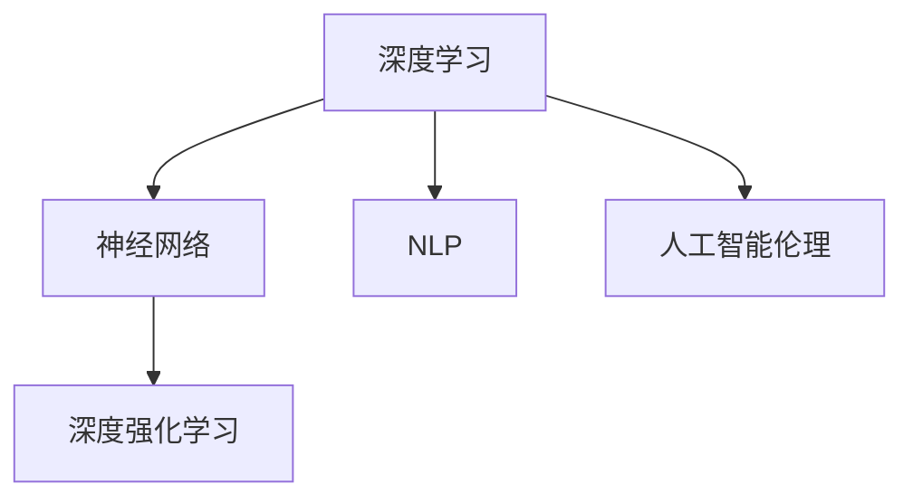

                 

# 欲望的反思：AI时代的自我认知

> 关键词：AI, 自我认知, 深度学习, 神经网络, 深度强化学习, 自然语言处理, 人工智能伦理

## 1. 背景介绍

### 1.1 问题由来

在科技飞速发展的当下，人工智能（AI）已经深入到我们生活的方方面面。从自动驾驶汽车到智能家居，从语音助手到推荐系统，AI无处不在。然而，随着AI技术的不断进步，我们开始反思：AI是否真正理解了自己的行为？其背后的决策机制是否合理透明？AI的欲望与人类欲望有何差异？

### 1.2 问题核心关键点

本文聚焦于AI时代的自我认知，尤其是深度学习模型在决策与行为中的自我反思能力。我们希望通过探讨AI模型在训练和推理过程中的内心世界，理解其在复杂的决策和行为中可能产生的欲望和动机，以及这些欲望与人类欲望之间的差异和相似性。

## 2. 核心概念与联系

### 2.1 核心概念概述

为更好地理解AI时代的自我认知，本节将介绍几个密切相关的核心概念：

- **深度学习**：一种基于神经网络的机器学习方法，能够从大量数据中学习特征，进行分类、回归等任务。
- **神经网络**：由大量神经元（节点）组成的计算图，用于模拟人脑的信息处理机制。
- **深度强化学习**：结合深度学习和强化学习，通过与环境的交互，优化策略以获得最大奖励。
- **自然语言处理（NLP）**：使计算机能够理解、生成和处理人类语言的技术。
- **人工智能伦理**：关注AI技术在道德、社会、法律等方面的影响，确保AI的发展不会对人类造成负面影响。

这些核心概念之间的逻辑关系可以通过以下Mermaid流程图来展示：



这个流程图展示了大语言模型的核心概念及其之间的关系：

1. 深度学习是神经网络的基础，用于学习数据特征。
2. 神经网络是深度学习的核心，通过多层非线性变换，构建复杂模型。
3. 深度强化学习结合深度学习与强化学习，优化决策策略。
4. NLP利用深度学习处理语言数据，实现自然语言理解与生成。
5. 人工智能伦理关注AI技术的应用，确保AI的公平、透明与安全。

## 3. 核心算法原理 & 具体操作步骤
### 3.1 算法原理概述

AI的自我认知涉及对模型内部工作机制的理解，尤其是决策过程的透明性和可解释性。以下是几个关键原理：

- **深度学习模型**：通过多层非线性变换，学习输入数据的复杂特征表示。
- **神经网络结构**：包括卷积层、池化层、全连接层等，用于提取特征、降维、分类等。
- **深度强化学习**：通过奖励机制，优化策略，实现自主决策。
- **自然语言处理**：使用Transformer等模型，处理文本数据，理解语义和上下文。

### 3.2 算法步骤详解

以下是深度学习模型的核心算法步骤：

1. **数据准备**：收集标注数据，分割为训练集、验证集和测试集。
2. **模型设计**：选择或设计适合任务的神经网络结构。
3. **模型训练**：使用训练集数据，通过反向传播算法，更新模型参数，最小化损失函数。
4. **模型评估**：在验证集上评估模型性能，调整超参数，避免过拟合。
5. **模型推理**：使用测试集数据，进行模型推理，输出预测结果。

### 3.3 算法优缺点

深度学习模型的优点包括：

- 自动特征提取：通过多层非线性变换，学习数据的复杂特征。
- 泛化能力：在未见过的数据上表现良好。
- 训练速度快：使用GPU等硬件加速，可快速迭代训练。

但也有一些缺点：

- 黑盒性质：模型内部工作机制不透明，难以解释。
- 数据依赖：需要大量标注数据，数据质量对模型性能影响大。
- 过拟合风险：模型容易在训练集上过拟合，泛化能力下降。

### 3.4 算法应用领域

深度学习模型在多个领域得到广泛应用，例如：

- **计算机视觉**：如图像分类、目标检测、图像生成等。
- **自然语言处理**：如文本分类、语言生成、情感分析等。
- **语音识别**：如语音转文本、语音合成等。
- **推荐系统**：如用户行为分析、商品推荐等。
- **机器人**：如自主导航、物体识别等。

## 4. 数学模型和公式 & 详细讲解 & 举例说明
### 4.1 数学模型构建

深度学习模型的核心是神经网络，其数学模型通常由以下组件构成：

- **输入层**：接收原始数据。
- **隐藏层**：通过非线性变换提取特征。
- **输出层**：根据任务类型，进行分类或回归。

### 4.2 公式推导过程

以多层感知机（MLP）为例，其数学模型可以表示为：

$$
f(x) = W_2 \sigma(W_1 x + b_1) + b_2
$$

其中，$W_1$ 和 $W_2$ 为权重矩阵，$\sigma$ 为激活函数，$x$ 为输入，$b_1$ 和 $b_2$ 为偏置向量。

### 4.3 案例分析与讲解

假设有一项二分类任务，训练集为 $\{(x_i, y_i)\}_{i=1}^N$，其中 $y_i \in \{0, 1\}$。使用深度学习模型进行训练，其损失函数为交叉熵损失：

$$
\mathcal{L} = -\frac{1}{N} \sum_{i=1}^N y_i \log f(x_i) + (1-y_i) \log (1-f(x_i))
$$

通过反向传播算法，计算梯度并更新权重参数：

$$
\frac{\partial \mathcal{L}}{\partial W_1} = -\frac{1}{N} \sum_{i=1}^N (y_i \sigma(W_1 x_i + b_1) - (1-y_i) (1-\sigma(W_1 x_i + b_1)) \cdot \frac{\partial \sigma}{\partial z_i}
$$

其中，$\sigma$ 为sigmoid激活函数，$\frac{\partial \sigma}{\partial z_i} = \sigma(z_i) (1-\sigma(z_i))$。

通过迭代更新权重参数，模型逐渐优化，直至收敛。

## 5. 项目实践：代码实例和详细解释说明
### 5.1 开发环境搭建

在进行深度学习模型开发前，我们需要准备好开发环境。以下是使用Python进行TensorFlow开发的环境配置流程：

1. 安装Anaconda：从官网下载并安装Anaconda，用于创建独立的Python环境。

2. 创建并激活虚拟环境：
```bash
conda create -n tf-env python=3.8 
conda activate tf-env
```

3. 安装TensorFlow：根据CUDA版本，从官网获取对应的安装命令。例如：
```bash
pip install tensorflow-gpu==2.8
```

4. 安装TensorBoard：
```bash
pip install tensorboard
```

5. 安装TensorFlow Addons：
```bash
pip install tensorflow-addons
```

完成上述步骤后，即可在`tf-env`环境中开始深度学习模型开发。

### 5.2 源代码详细实现

以下是一个简单的二分类深度学习模型实现：

```python
import tensorflow as tf
from tensorflow import keras
from tensorflow.keras import layers

# 定义模型
model = keras.Sequential([
    layers.Dense(64, activation='relu'),
    layers.Dense(1, activation='sigmoid')
])

# 编译模型
model.compile(optimizer='adam', loss='binary_crossentropy', metrics=['accuracy'])

# 训练模型
model.fit(train_dataset, epochs=10, batch_size=32, validation_data=val_dataset)

# 评估模型
test_loss, test_acc = model.evaluate(test_dataset)
print(f'Test accuracy: {test_acc}')
```

### 5.3 代码解读与分析

让我们再详细解读一下关键代码的实现细节：

**Sequential模型**：
- 使用Sequential模型定义深度学习模型，依次堆叠各层。
- 第一层为全连接层，64个神经元，ReLU激活函数。
- 第二层为输出层，1个神经元，Sigmoid激活函数，用于二分类任务。

**compile模型**：
- 使用adam优化器，交叉熵损失函数，准确率作为评估指标。

**fit模型**：
- 使用训练集数据，定义训练轮数和批次大小，评估数据为验证集。

**evaluate模型**：
- 在测试集上评估模型性能，输出损失和准确率。

可以看出，TensorFlow提供了一个简单高效的接口，使深度学习模型的实现变得非常便捷。

### 5.4 运行结果展示

训练过程中，可以使用TensorBoard进行实时监控：

```bash
tensorboard --logdir logs
```

打开浏览器访问 `http://localhost:6006/`，即可看到训练过程中的指标曲线，帮助我们优化超参数和调整模型。

## 6. 实际应用场景
### 6.1 计算机视觉

深度学习模型在计算机视觉领域得到了广泛应用，如图像分类、目标检测、图像生成等。以下是一个简单的图像分类示例：

```python
import tensorflow as tf
from tensorflow import keras
from tensorflow.keras import layers

# 定义模型
model = keras.Sequential([
    layers.Conv2D(32, (3, 3), activation='relu', input_shape=(28, 28, 1)),
    layers.MaxPooling2D((2, 2)),
    layers.Flatten(),
    layers.Dense(64, activation='relu'),
    layers.Dense(10, activation='softmax')
])

# 编译模型
model.compile(optimizer='adam', loss='sparse_categorical_crossentropy', metrics=['accuracy'])

# 训练模型
model.fit(train_images, train_labels, epochs=10, batch_size=32, validation_data=(val_images, val_labels))

# 评估模型
test_loss, test_acc = model.evaluate(test_images, test_labels)
print(f'Test accuracy: {test_acc}')
```

### 6.2 自然语言处理

深度学习模型在自然语言处理领域也得到了广泛应用，如文本分类、语言生成、情感分析等。以下是一个简单的文本分类示例：

```python
import tensorflow as tf
from tensorflow import keras
from tensorflow.keras import layers

# 定义模型
model = keras.Sequential([
    layers.Embedding(vocab_size, embedding_dim, input_length=max_len),
    layers.LSTM(64),
    layers.Dense(1, activation='sigmoid')
])

# 编译模型
model.compile(optimizer='adam', loss='binary_crossentropy', metrics=['accuracy'])

# 训练模型
model.fit(train_texts, train_labels, epochs=10, batch_size=32, validation_data=(val_texts, val_labels))

# 评估模型
test_loss, test_acc = model.evaluate(test_texts, test_labels)
print(f'Test accuracy: {test_acc}')
```

### 6.3 未来应用展望

随着深度学习模型的不断发展，其在多个领域的应用将更加广泛和深入。未来，深度学习模型将结合更多先进技术，如对抗生成网络（GAN）、自监督学习（SSL）等，进一步提升模型的性能和可解释性。

## 7. 工具和资源推荐
### 7.1 学习资源推荐

为了帮助开发者系统掌握深度学习模型的理论基础和实践技巧，这里推荐一些优质的学习资源：

1. 《深度学习》（Ian Goodfellow著）：深度学习领域的经典教材，详细介绍了深度学习的基本原理和核心技术。
2. 《TensorFlow实战》（Cory Lorenz著）：TensorFlow的官方教程，介绍了TensorFlow的基本用法和进阶技巧。
3. 《自然语言处理入门》（Daphne Koller和Yoav Singer著）：自然语言处理领域的入门书籍，详细介绍了NLP的基本模型和算法。
4. 《动手学深度学习》（李沐等著）：深度学习领域的实践教程，提供了大量代码示例和实验项目。
5. 《人工智能伦理》（Susan Calvert和Mark Coeckelbergh著）：关注人工智能伦理的书籍，探讨AI技术在道德、社会、法律等方面的影响。

通过对这些资源的学习实践，相信你一定能够快速掌握深度学习模型的精髓，并用于解决实际的AI问题。

### 7.2 开发工具推荐

高效的开发离不开优秀的工具支持。以下是几款用于深度学习模型开发的常用工具：

1. TensorFlow：由Google主导开发的开源深度学习框架，生产部署方便，适合大规模工程应用。
2. PyTorch：基于Python的开源深度学习框架，灵活高效，适合快速迭代研究。
3. Jupyter Notebook：支持Python代码的交互式编程，方便实验和文档撰写。
4. TensorBoard：TensorFlow配套的可视化工具，可实时监测模型训练状态，提供丰富的图表呈现方式。
5. Visual Studio Code：轻量级代码编辑器，支持多种语言和工具集成，提供强大的代码高亮和调试功能。

合理利用这些工具，可以显著提升深度学习模型的开发效率，加快创新迭代的步伐。

### 7.3 相关论文推荐

深度学习模型的发展源于学界的持续研究。以下是几篇奠基性的相关论文，推荐阅读：

1. 《深度学习》（Ian Goodfellow著）：深度学习领域的经典教材，详细介绍了深度学习的基本原理和核心技术。
2. 《ImageNet大规模视觉识别挑战赛》（Jia Deng等著）：ImageNet数据集和竞赛介绍，展示了深度学习在计算机视觉领域的强大能力。
3. 《Attention is All You Need》（Vaswani等著）：提出Transformer结构，开启了NLP领域的预训练大模型时代。
4. 《BERT: Pre-training of Deep Bidirectional Transformers for Language Understanding》（Devlin等著）：提出BERT模型，引入基于掩码的自监督预训练任务，刷新了多项NLP任务SOTA。
5. 《Parameter-Efficient Transfer Learning for NLP》（Howard等著）：提出Adapter等参数高效微调方法，在不增加模型参数量的情况下，也能取得不错的微调效果。

这些论文代表了大语言模型微调技术的发展脉络。通过学习这些前沿成果，可以帮助研究者把握学科前进方向，激发更多的创新灵感。

## 8. 总结：未来发展趋势与挑战

### 8.1 总结

本文对深度学习模型在决策与行为中的自我反思能力进行了全面系统的介绍。首先阐述了深度学习模型在训练和推理过程中的内心世界，理解其在复杂的决策和行为中可能产生的欲望和动机，以及这些欲望与人类欲望之间的差异和相似性。其次，从原理到实践，详细讲解了深度学习模型的核心算法步骤，给出了深度学习模型开发和应用的完整代码实例。同时，本文还探讨了深度学习模型在计算机视觉、自然语言处理等多个领域的应用前景，展示了深度学习模型的广阔前景。

通过对深度学习模型的系统梳理，可以看到，深度学习模型在决策与行为中逐渐展现出自我反思能力，为人工智能伦理和可解释性研究提供了新的视角。未来，随着深度学习模型的不断发展，其在更多领域的应用将更加广泛和深入。

### 8.2 未来发展趋势

展望未来，深度学习模型将呈现以下几个发展趋势：

1. 模型规模持续增大。随着算力成本的下降和数据规模的扩张，深度学习模型的参数量还将持续增长。超大规模深度学习模型蕴含的丰富特征表示，有望支撑更加复杂多变的任务。
2. 模型可解释性增强。未来深度学习模型将更加注重可解释性，通过可视化工具和技术，增强模型的透明性，帮助用户理解模型决策过程。
3. 多模态学习兴起。深度学习模型将结合视觉、语音、文本等多模态信息，提升模型的综合能力，解决更加复杂的问题。
4. 对抗生成网络（GAN）的应用扩展。GAN将应用于生成对抗性样本，提升模型的鲁棒性和泛化能力。
5. 自监督学习（SSL）的广泛应用。SSL将应用于无监督学习，提升模型的训练效率和数据利用率。

以上趋势凸显了深度学习模型的广阔前景。这些方向的探索发展，必将进一步提升深度学习模型的性能和应用范围，为人工智能伦理和可解释性研究提供新的工具和方法。

### 8.3 面临的挑战

尽管深度学习模型已经取得了瞩目成就，但在迈向更加智能化、普适化应用的过程中，它仍面临诸多挑战：

1. 数据依赖。深度学习模型需要大量标注数据，数据质量对模型性能影响大。对于长尾应用场景，获取充足的高质量标注数据成为制约模型性能的瓶颈。
2. 模型鲁棒性不足。深度学习模型面对域外数据时，泛化性能往往大打折扣。模型在训练集上过拟合，泛化能力下降。
3. 可解释性不足。深度学习模型通常呈现黑盒性质，难以解释其内部工作机制和决策逻辑。对于医疗、金融等高风险应用，算法的可解释性和可审计性尤为重要。
4. 安全性风险。深度学习模型难免会学习到有害的信息，通过模型输出传递到现实世界，产生误导性、歧视性的影响。如何从数据和算法层面消除模型偏见，避免恶意用途，确保输出安全性，将是重要的研究课题。
5. 计算资源需求高。深度学习模型的训练和推理需要大量计算资源，如何优化模型结构和计算过程，提升推理速度和资源利用率，是未来重要的研究方向。

### 8.4 未来突破

面对深度学习模型所面临的种种挑战，未来的研究需要在以下几个方面寻求新的突破：

1. 探索无监督和半监督学习。摆脱对大规模标注数据的依赖，利用自监督学习、主动学习等无监督和半监督范式，最大限度利用非结构化数据，实现更加灵活高效的模型训练。
2. 研究参数高效和计算高效的模型。开发更加参数高效的模型，在固定大部分预训练参数的同时，只更新极少量的任务相关参数。同时优化模型计算图，减少前向传播和反向传播的资源消耗，实现更加轻量级、实时性的部署。
3. 引入因果分析和博弈论工具。将因果分析方法引入深度学习模型，识别出模型决策的关键特征，增强模型输出的解释性和逻辑性。借助博弈论工具刻画人机交互过程，主动探索并规避模型的脆弱点，提高系统稳定性。
4. 纳入伦理道德约束。在模型训练目标中引入伦理导向的评估指标，过滤和惩罚有害的输出倾向。加强人工干预和审核，建立模型行为的监管机制，确保输出符合人类价值观和伦理道德。
5. 结合多模态信息融合。深度学习模型将结合视觉、语音、文本等多模态信息，提升模型的综合能力，解决更加复杂的问题。

这些研究方向的探索，必将引领深度学习模型向更高的台阶迈进，为构建安全、可靠、可解释、可控的智能系统铺平道路。面向未来，深度学习模型还需要与其他人工智能技术进行更深入的融合，如知识表示、因果推理、强化学习等，多路径协同发力，共同推动深度学习模型的进步。只有勇于创新、敢于突破，才能不断拓展深度学习模型的边界，让智能技术更好地造福人类社会。

## 9. 附录：常见问题与解答

**Q1：深度学习模型是否具有自我反思能力？**

A: 深度学习模型可以一定程度上通过反向传播和梯度计算，理解自身决策的依据和规律。但是，模型的自我反思能力是非常有限的，往往只停留在简单的特征提取和模式识别上。

**Q2：如何提升深度学习模型的可解释性？**

A: 提升深度学习模型的可解释性可以从以下几个方面入手：
1. 使用可解释模型，如决策树、线性回归等。
2. 可视化模型中间层输出，分析特征重要性。
3. 使用可解释性工具，如LIME、SHAP等，分析模型输出。
4. 通过反向传播计算梯度，理解模型参数的作用。
5. 引入先验知识，增强模型的可解释性。

**Q3：深度学习模型在训练过程中如何避免过拟合？**

A: 深度学习模型在训练过程中，可以采取以下措施避免过拟合：
1. 数据增强：通过回译、近义替换等方式扩充训练集。
2. 正则化：使用L2正则、Dropout等防止模型过度拟合训练集。
3. 对抗训练：引入对抗样本，提高模型鲁棒性。
4. 提前停止：监控验证集性能，一旦性能下降，提前停止训练。
5. 模型集成：训练多个模型，取平均输出，抑制过拟合。

**Q4：如何评估深度学习模型的泛化能力？**

A: 评估深度学习模型的泛化能力，可以从以下几个方面入手：
1. 在验证集和测试集上进行性能评估。
2. 使用交叉验证，评估模型在不同数据集上的表现。
3. 使用模型诊断工具，如Shapley值、LIME等，分析模型的泛化性能。
4. 使用对抗生成网络（GAN）生成对抗性样本，评估模型的鲁棒性。
5. 结合多模态数据，提升模型的泛化能力。

这些措施可以帮助评估深度学习模型的泛化能力，避免模型在训练集上过拟合，提升模型在实际应用中的表现。

---

作者：禅与计算机程序设计艺术 / Zen and the Art of Computer Programming

