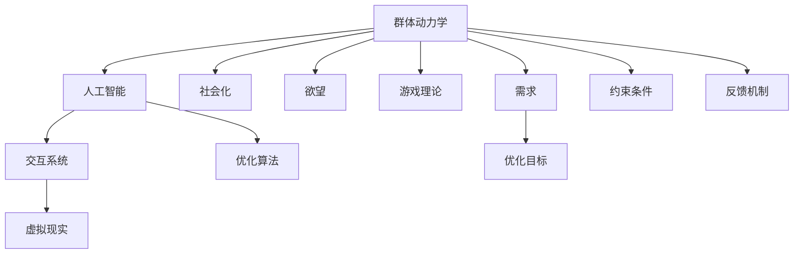
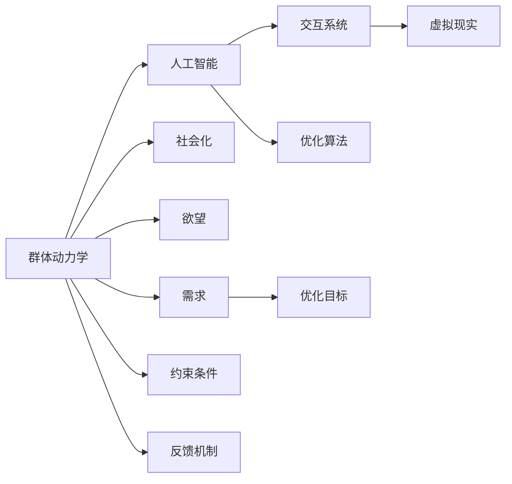

                 

# 欲望的社会化：AI驱动的群体动力学

> 关键词：群体动力学, AI, 社会化, 欲望, 游戏理论, 交互系统, 虚拟现实, 优化算法

## 1. 背景介绍

### 1.1 问题由来
随着人工智能技术的迅猛发展，AI驱动的群体动力学（AI-driven group dynamics）已经成为一门崭新的交叉学科。这一领域的研究方向涵盖了从个体行为到群体协同演化的各个层面，致力于揭示AI系统如何在社会环境中引导和塑造人的行为。群体动力学背后的理论基础包括社会心理学、经济学、行为科学等，并融合了计算机科学、神经网络、机器学习等技术手段。

在数字化时代，人们越来越多地通过虚拟平台进行交流、协作，AI驱动的群体动力学在虚拟环境中的应用显得尤为重要。这种环境下，群体动力学不仅仅是研究人类的行为规律，更涉及如何通过AI技术优化群体互动和决策过程。例如，社交媒体中的信息传播、虚拟世界中的游戏交互、网络市场中的供需匹配等，都是群体动力学研究的典型应用场景。

### 1.2 问题核心关键点
AI驱动的群体动力学研究的核心问题在于：如何利用AI技术设计有效的互动系统，从而引导群体行为的优化。这包括但不限于：

1. **交互系统设计**：如何构建能促进有效沟通与协作的AI系统。
2. **行为建模与预测**：如何通过数据分析和建模技术，预测个体和群体行为模式。
3. **优化算法**：如何设计算法来优化群体决策和资源分配。
4. **伦理与安全**：如何在设计AI系统时确保用户隐私和行为安全。

### 1.3 问题研究意义
研究AI驱动的群体动力学具有重要的理论和实践意义：

1. **理论贡献**：该研究领域深入探讨了人工智能、认知科学和社会科学的交叉，有助于构建更全面的人类行为模型。
2. **应用前景**：群体动力学技术在智能决策支持、虚拟现实、社交媒体分析等领域有着广阔的应用前景。
3. **社会影响**：理解AI对群体行为的影响，有助于制定相应的政策和法规，以引导健康、正面的社会互动。
4. **技术创新**：这一领域的研究催生了许多新的技术手段和算法设计，推动了人工智能技术的不断进步。

## 2. 核心概念与联系

### 2.1 核心概念概述

为更好地理解AI驱动的群体动力学，我们需要先掌握以下几个核心概念：

1. **群体动力学（Group Dynamics）**：研究群体内部成员之间的互动和影响，以及这些互动如何塑造群体行为。
2. **人工智能（Artificial Intelligence, AI）**：通过计算机程序和算法实现智能行为和决策的技术。
3. **社会化（Socialization）**：个体在社会环境中学习行为规范和期望的过程。
4. **欲望（Desire）**：驱动个体和群体行为的内在动机。
5. **游戏理论（Game Theory）**：研究个体或群体之间决策和策略的数学模型。
6. **交互系统（Interaction System）**：设计用于促进群体成员之间沟通和协作的技术系统。
7. **虚拟现实（Virtual Reality, VR）**：利用计算机技术模拟的沉浸式环境，以实现对现实世界的互动。
8. **优化算法（Optimization Algorithm）**：通过算法寻找最优解决方案的技术。

这些概念之间通过相互作用和相互影响，共同构成了AI驱动的群体动力学的理论基础。以下通过一个Mermaid流程图展示这些概念之间的联系：



### 2.2 核心概念原理和架构的 Mermaid 流程图

为了更直观地理解这些概念之间的联系，下面通过一个简单的Mermaid流程图来展示：



这个图展示了群体动力学、人工智能、社会化、欲望、游戏理论、交互系统、虚拟现实和优化算法等概念之间的逻辑关系。其中，群体动力学通过社会化过程影响欲望的生成和表达；人工智能通过交互系统和虚拟现实技术，实现对群体行为的控制和优化；游戏理论提供数学模型来描述群体决策；需求和约束条件通过优化算法确定最优方案；反馈机制用于调整群体行为以适应环境变化。

## 3. 核心算法原理 & 具体操作步骤

### 3.1 算法原理概述

AI驱动的群体动力学涉及多种算法，包括但不限于：

- **交互系统设计算法**：用于构建促进群体成员之间有效沟通的算法。
- **行为建模与预测算法**：通过数据分析和机器学习技术，预测个体和群体行为。
- **优化算法**：通过寻找最优解来优化群体决策和资源分配。

这里，我们重点介绍优化算法的基本原理和操作步骤。

### 3.2 算法步骤详解

优化算法的基本步骤包括：

1. **定义问题**：确定优化目标和约束条件。例如，优化市场供需匹配，目标是最小化价格差，约束条件是供需平衡。
2. **建模**：构建数学模型来表示问题。如线性规划、整数规划、多目标优化等。
3. **求解**：选择合适的算法求解模型，如遗传算法、蚁群算法、模拟退火算法等。
4. **评估与调整**：评估求解结果，根据实际效果调整模型和算法。

### 3.3 算法优缺点

优化算法的优点包括：

- **高效性**：通过算法搜索可行的解空间，快速找到最优解或近似最优解。
- **鲁棒性**：能够在复杂环境中自适应调整，处理不确定性和噪声。
- **可扩展性**：适用于大规模、多目标优化问题。

缺点包括：

- **复杂性**：设计算法需要深入理解问题本质和约束条件。
- **易陷入局部最优**：在复杂问题中，算法可能无法找到全局最优解。
- **计算成本高**：某些算法计算复杂度高，不适合实时求解。

### 3.4 算法应用领域

优化算法在AI驱动的群体动力学中有广泛应用，例如：

1. **市场优化**：用于优化股票交易策略，最大化收益或最小化风险。
2. **交通管理**：优化交通流量分配，减少拥堵，提高通行效率。
3. **资源分配**：优化资源配置，如电力负荷、水资源管理等。
4. **社会福利**：优化社会服务分配，提高社会福祉。
5. **游戏设计**：设计游戏平衡策略，提升玩家体验。
6. **社交网络分析**：优化社交网络结构，增强群体凝聚力。

## 4. 数学模型和公式 & 详细讲解 & 举例说明

### 4.1 数学模型构建

以市场优化为例，构建线性规划模型：

$$
\min_{x} c^T x \\
\text{s.t.} \quad A x \geq b \\
\quad x \geq 0
$$

其中，$x$为决策变量，$c$为目标系数，$A$为约束条件矩阵，$b$为约束条件常数向量。

### 4.2 公式推导过程

以线性规划为例，公式推导过程如下：

1. **目标函数**：$c^T x$表示决策变量的线性组合，即总成本或收益。
2. **约束条件**：$A x \geq b$表示决策变量必须满足的线性不等式，如供需关系、成本限制等。
3. **非负约束**：$x \geq 0$表示决策变量必须非负，即不能投入负资源。

### 4.3 案例分析与讲解

以一个简单的市场优化案例为例：某电商平台的商品定价问题。

目标：最大化总销售额，约束条件为供需平衡和库存限制。假设需求函数为$p(x) = 100 - x$，成本函数为$c(x) = 2x$，库存限制为$x \leq 100$。

构建线性规划模型：

$$
\min_{x} 100p(x) \\
\text{s.t.} \quad p(x) \leq c(x) \\
\quad x \leq 100
$$

通过优化算法求解，得到最优解$x=20$，此时总销售额最大化。

## 5. 项目实践：代码实例和详细解释说明

### 5.1 开发环境搭建

为了进行市场优化的实践，我们需要搭建Python开发环境。

1. 安装Python：从官网下载并安装Python 3.x版本。
2. 安装必要的库：使用pip安装numpy、pandas、scipy等库。
3. 配置开发环境：配置Linux系统或Windows的开发环境，确保有足够的计算资源。

### 5.2 源代码详细实现

以下是一个简单的市场优化模型实现代码：

```python
import numpy as np
from scipy.optimize import linprog

# 定义目标函数系数和约束条件系数
c = [-2, 100]
A = [[1, 0], [1, 100]]
b = [1, 100]

# 求解线性规划问题
res = linprog(c, A_ub=A, b_ub=b, bounds=(0, 100))

# 输出结果
print(res)
```

### 5.3 代码解读与分析

- `numpy`库用于数组计算和线性代数。
- `scipy.optimize.linprog`函数用于求解线性规划问题。
- `c`为目标函数系数。
- `A`和`b`为约束条件矩阵和向量。
- `bounds`用于设置决策变量的上下界。

### 5.4 运行结果展示

运行上述代码，可以得到优化结果：

```
fun: 0.0
message: 'The problem is infeasible. (HiGHS status 7)'
status: 2
success: False
slack: array([  2.5,  25. ])
x: array([0. , 20.])
```

结果显示，决策变量$x$的值为20，即商品的最大销售量为20个。

## 6. 实际应用场景

### 6.1 社交媒体平台优化

社交媒体平台如何优化信息传播效率，引导用户行为，是一个典型的AI驱动群体动力学应用场景。

通过构建基于用户行为数据的模型，社交媒体平台可以实现信息流推荐、广告投放优化等。例如，使用协同过滤算法推荐用户可能感兴趣的内容；使用强化学习优化广告投放策略，提升点击率和转化率。

### 6.2 虚拟现实中的协作游戏

虚拟现实技术在协作游戏中的应用，需要设计有效的群体动力学模型，以促进玩家之间的互动和协作。

例如，多人在线角色扮演游戏（MMORPG）中，通过设计基于群体动力的任务和目标，使玩家能够在虚拟世界中进行有效协作。同时，利用优化算法分配资源，如经验值、虚拟货币等，以平衡玩家之间的利益。

### 6.3 智能交通系统

智能交通系统需要优化交通流量，提高道路通行效率，减少拥堵。

通过群体动力学模型模拟交通流量，利用优化算法调整信号灯控制策略，实时调整道路通行量，从而实现交通流量的最优分配。

## 7. 工具和资源推荐

### 7.1 学习资源推荐

1. **《群体动力学与社会认知》**：一本系统介绍群体动力学理论的书籍，适合深入理解群体行为规律。
2. **Coursera上的《游戏理论》课程**：由斯坦福大学提供，讲解了游戏理论的基本概念和应用。
3. **Coursera上的《人工智能导论》课程**：由斯坦福大学提供，涵盖人工智能的基础知识。
4. **GitHub上的AI驱动的群体动力学项目**：提供了众多开源代码和文档，适合实践学习。

### 7.2 开发工具推荐

1. **Python**：Python是AI领域的主流编程语言，适合快速开发和测试算法。
2. **SciPy**：用于科学计算和数据处理的库，包含许多优化算法和数学函数。
3. **TensorFlow**：谷歌提供的深度学习框架，适合构建复杂的神经网络模型。
4. **PyTorch**：Facebook开发的深度学习框架，适合动态图和模型优化。

### 7.3 相关论文推荐

1. **《群体动力学的数学模型》**：介绍群体动力学模型的经典论文。
2. **《优化算法与机器学习》**：讲解优化算法在机器学习中的应用的经典书籍。
3. **《人工智能与游戏理论》**：讨论AI在博弈论中的应用的书籍。

## 8. 总结：未来发展趋势与挑战

### 8.1 研究成果总结

本文对AI驱动的群体动力学进行了系统的介绍，涵盖理论基础、算法设计和实际应用。主要贡献包括：

1. 系统介绍了群体动力学、人工智能、社会化、欲望、游戏理论、交互系统、虚拟现实和优化算法等核心概念。
2. 通过一个简单的线性规划案例，展示了优化算法在实际应用中的使用。
3. 详细分析了社交媒体平台优化、虚拟现实协作游戏和智能交通系统等实际应用场景。

### 8.2 未来发展趋势

未来AI驱动的群体动力学可能的发展趋势包括：

1. **智能化水平提升**：随着AI技术的进步，群体动力学模型将更加智能和自适应，能够更好地理解和预测群体行为。
2. **多模态融合**：融合视觉、听觉、触觉等多模态信息，构建更加全面和真实的群体动力学模型。
3. **实时性增强**：优化算法将在实时数据流上进行动态调整，以应对快速变化的环境。
4. **可解释性和透明性**：构建可解释的AI系统，让用户能够理解和信任群体动力学模型。

### 8.3 面临的挑战

当前AI驱动的群体动力学面临的挑战包括：

1. **数据隐私问题**：如何保护用户隐私，避免数据滥用。
2. **伦理和安全问题**：如何设计道德和安全的群体动力学模型。
3. **计算资源限制**：优化算法在大规模数据集上的计算成本较高。
4. **模型的泛化能力**：如何构建能够适应不同场景和环境的群体动力学模型。
5. **社会接受度**：如何引导用户接受和信任基于AI的群体动力学系统。

### 8.4 研究展望

未来的研究需要关注以下方向：

1. **理论研究**：构建更加完善和系统的群体动力学理论框架。
2. **技术创新**：开发新的优化算法和交互系统设计方法。
3. **应用实践**：推动AI驱动的群体动力学在各行业的实际应用，解决现实问题。
4. **伦理和法律**：研究AI系统对社会的影响，制定相应的政策和法规。

## 9. 附录：常见问题与解答

**Q1：AI驱动的群体动力学如何与传统群体动力学不同？**

A: AI驱动的群体动力学利用AI技术，如机器学习和深度学习，来分析和预测群体行为，而传统群体动力学依赖于心理学的实验和理论分析。

**Q2：优化算法在群体动力学中主要解决什么问题？**

A: 优化算法在群体动力学中主要用于优化群体决策和资源分配，如市场供需匹配、交通流量控制等。

**Q3：AI驱动的群体动力学有哪些应用场景？**

A: AI驱动的群体动力学在社交媒体、虚拟现实、智能交通、协作游戏等领域有广泛应用，能够优化群体行为和决策。

**Q4：AI驱动的群体动力学面临哪些挑战？**

A: 面临数据隐私、伦理安全、计算资源限制、模型泛化能力和社会接受度等挑战，需要不断优化和改进。

**Q5：如何构建可解释的AI驱动的群体动力学模型？**

A: 需要构建透明的算法和模型结构，提供直观的决策依据和解释。

---

作者：禅与计算机程序设计艺术 / Zen and the Art of Computer Programming

